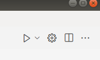

#### 1.CMake语法

基本语法格式：指令(参数 1 参数 2...)
参数之间使用空格或分号分开
指令不分大小写，参数分大小写，变量使用${}方式取值

```cmake
# CMake最小版本要求为2.8.3
cmake_minimum_required(VERSION 2.8.3)
# 指定工程名为HELLOWORLD
project(HELLOWORLD)
# 定义SRC变量，其值为sayhello.cpp hello.cpp
set(SRC sayhello.cpp hello.cpp)
# 将/usr/include/myincludefolder 和 ./include 添加到头文件搜索路径
include_directories(/usr/include/myincludefolder ./include)
# 将/usr/lib/mylibfolder 和 ./lib 添加到库文件搜索路径
link_directories(/usr/lib/mylibfolder ./lib)
# 通过变量 SRC 生成 libhello.so 共享库
#语法： add_library(libname [SHARED|STATIC] source1 source2 ... sourceN)
add_library(hello SHARED ${SRC})
# 添加编译参数 -Wall -std=c++11 -o2
add_compile_options(-Wall -std=c++11 -o2)
# 编译参数 
-g 编译带调试信息的可执行文件， -Wall 打印警告信息
-O2优化源代码， -w 关闭警告信息， -std=c++11 设置编译标准
-o 指定输出文件名
# 编译main.cpp生成可执行文件main
add_executable(main main.cpp)
# 将hello动态库文件链接到可执行文件main
target_link_libraries(main hello)
# 添加src子目录
add_subdirectory(src)
#发现一个目录下所有的源代码文件并将列表存储在一个变量中
# 定义SRC变量，其值为当前目录下所有的源代码文件
aux_source_directory(. SRC)
# 编译SRC变量所代表的源代码文件，生成main可执行文件
add_executable(main ${SRC})
```

* CMake常用变量

```cmake
CMAKE_C_FLAGS  gcc编译选项,CMAKE_CXX_FLAGS g++编译选项
# 在CMAKE_CXX_FLAGS编译选项后追加-std=c++11
set( CMAKE_CXX_FLAGS "${CMAKE_CXX_FLAGS} -std=c++11")
# 设定编译类型为debug，调试时需要选择debug
set(CMAKE_BUILD_TYPE Debug)
# 设定编译类型为release，发布时需要选择release
set(CMAKE_BUILD_TYPE Release)
#设定C编译器类型
set(CMAKE_C_COMPILER  gcc)
#设定C++编译器类型
set(CMAKE_CXX_COMPILER  g++)
#设定可执行文件输出的存放路径
set(EXECUTABLE_OUTPUT_PATHR  ./exe)
#设定库文件输出的存放路径
set(LIBRARY_OUTPUT_PATH  ./library)
CMAKE_SOURCE_DIR     当前文件夹的最顶层目录，也就是工作空间目录
```

#### 2.VScode中的实现

安装拓展，新建CMakeLists.txt文件，注意大写和s，否则报错。

```cmake
#写CMake指令
cmake_minimum_required(VERSION 3.0)#版本号
project(huanghao_code)#项目名称

aux_source_directory(./src SRC_SUB) #子目录中的源文件，赋值给SRC_SUB
aux_source_directory(. SRC_CUR) #当前目录下的源文件，赋值给SRC_CUR

set(CMAKE_CXX_FLAGS "${CMAKE_CXX_FLAGS} -Wall")#编译时显示警告，选择g++编译器
set(CMAKE_BUILD_TYPE Debug)	#可执行文件设为可调试版本， 默认是Release模式

include_directories(${CMAKE_SOURCE_DIR}/include)#头文件路径，CMAKE_SOURCE_DIR
set(EXECUTABLE_OUTPUT_PATH ${PROJECT_SOURCE_DIR}/build) # 设置可执行文件的输出目录

add_executable(a.out ${SRC_SUB} ${SRC_CUR})#生成可执行文件
```

ctrl+`,打开终端

```shell
#创建存放cmake生成文件的目录
book@100ask:~$ mkdir build
book@100ask:~Class_7$ cd build
#在源文件目录中执行cmake命令
book@100ask:~/build$ cmake ..
-- Build files have been written to: /home/book/build
#执行makefile命令
book@100ask:~/build$ make
[100%] Built target my_cmake_exe
```

上述操作可用脚本自动进行，在.vscode目录中创建build.sh脚本，输入以下内容：

```shell
#!/bin/bash
if [ ! -d "build" ]; then
    mkdir build;
else
    rm -rf build/*
fi
cd build
#创建build目录，放置CMake文件
cmake ..
make
```

#### 3.代码调试

###### launch.json(调试用)

点击调试按钮，创建launch.json文件，选择C++(GDB启动)，点击屏幕右下角添加配置，选择C++(GDB启动)，修改代码为：

一般地只需要改`"program":`部分内容改为项目路径下生成的执行文件即可。如果需要调试前重新编译一遍，可以新增一条`"preLaunchTask"`，里面的内容改为tasks.json中的`'label'`名称。

```json
{
   //配置launch.json文件（调试用）
    "version": "0.2.0",
    "configurations": [
        {
            "name": "(gdb) 启动",
            "type": "cppdbg",
            "request": "launch",
            "program": "${workspaceFolder}/build/a.out",
            //设置待调试的可执行文件为工作空间中bin目录的a.out
            "args": [],
            "stopAtEntry": false,
            "cwd": "${workspaceFolder}",
            //目标工作目录为当前工作空间
            "environment": [],
            "externalConsole": false,
            "MIMode": "gdb",
            "setupCommands": [
                {
                    "description": "为 gdb 启用整齐打印",
                    "text": "-enable-pretty-printing",
                    "ignoreFailures": true
                },
                {
                    "description": "将反汇编风格设置为 Intel",
                    "text": "-gdb-set disassembly-flavor intel",
                    "ignoreFailures": true
                }
            ],
            "preLaunchTask": "task1" 
            //调试前执行tasks.json中的task1任务，即执行build.sh脚本
        }

    ]
}
```

###### tasks.json文件（编译用）

tasks.json文件相当于vscode的.sh或.bat文件，用来记录一系列操作的宏，可以用来设置如何编译文件，如何运行文件，几乎.sh能干的都可以干。

按ctrl + shift + p打开vscode控制台，输入Tasks: Configure Task，再选择Create tasks.json file from templates，选择Others模板，就自动生成了一个tasks.json文件，这样你就可以在该文件中编写参数来调整设置。

```cobol
{
    //配置tasks.json文件（编译用）
    "version": "2.0.0",
    "tasks": [
        {
            "label": "task1", //你的设置文件名，可随便起
            "type": "shell",//运行task的平台，一般是shell
            "command": "bash ./.vscode/build.sh"//普通的shell命令
            //运行当前目录下，进入.vscode目录，运行build.sh脚本
        }
    ]
}
```

设置断点后，按F5就可以开始进行编译并调试了。


**整个过程描述：**

按F5 => 运行launch.json => 由于设置"preLaunchTask": "task1"，先去运行tasks.json中的task1中的command => 运行build.sh => 调用cmake并根据CMakeLists.txt文件编译出可执行文件hello\_world => 开始调试launch.json中program所指的可执行文件a.out。

#### 4.win和linux程序区别

暂停和清屏不一样

程序暂停：system("pause")，linux中改为

```c++
cout << "按任意键继续..." << endl;
cin.ignore(); // 清除输入缓冲区
cin.get(); // 等待用户输入
```

清屏：system("cls")；linux中改为system("clear")；

#### 5.运行单个文件

创建c++源文件，点击右上角小齿轮，生成配置文件

点击刚创建的源文件，点击右上角小三角或者ctrl+F5，只运行不调试；按F5或者下拉小三角，可以打断点，调试运行
