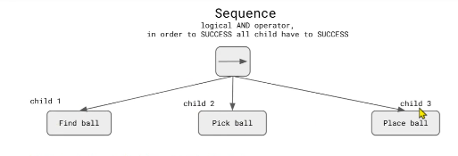
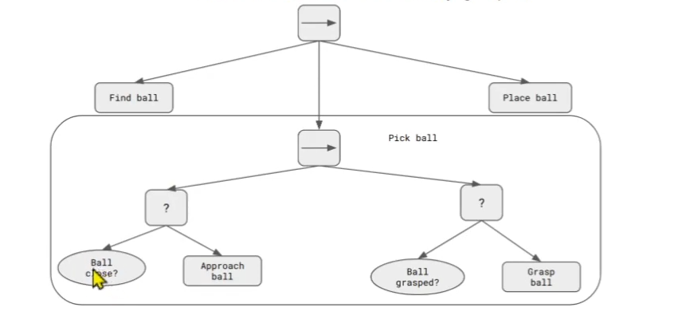
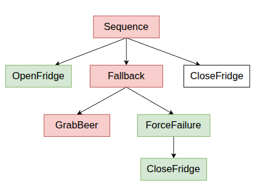
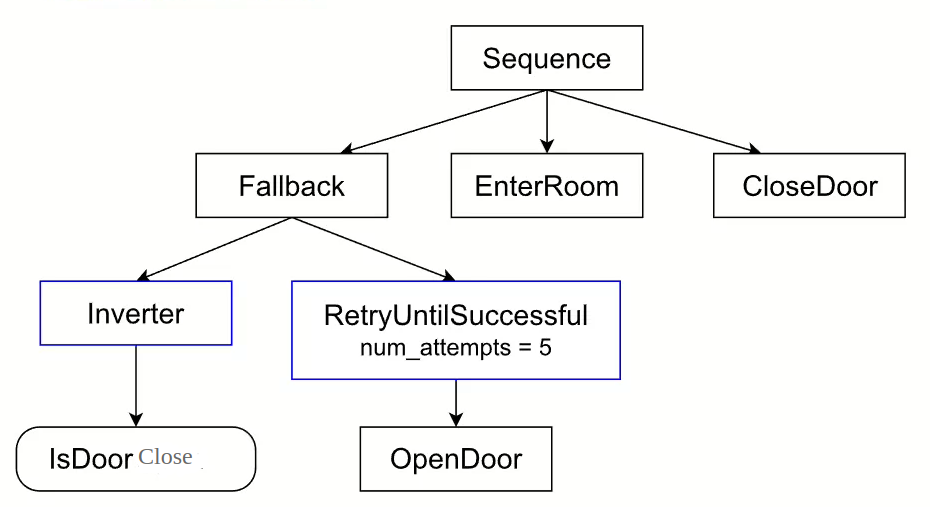
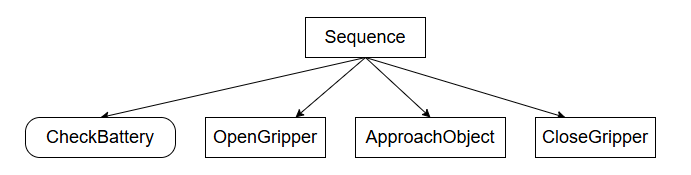
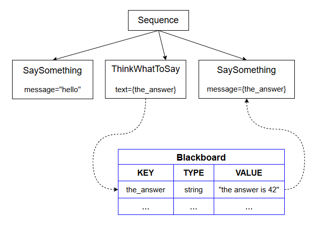

## 基本概念

### 一、控制节点ControlNode

#### 1.sequence  序列节点



-->框表示次序控制节点，所有旗下的行为依次运行，必须全部成功，才表示成功；当其下的某个行为失败时，终止所有行为。

其中，找球，捡球，放球为**动作节点(ActionNode)**；

#### 2.fallback  回退节点

其下行为依次运行，如果有一个行为成功，则终止其下后续行为；如果全部失败，返回failure;下图扩展了捡球行为



“ ？”框表示 fallback 回退节点，椭圆框表示**ConditionNode（条件节点）**，

- `BallClose`：检查是否接近球
- `BallGrasped`：检查是否抓住球

#### 3.控制节点例子



我们现在可以改进“给我拿杯啤酒”的例子，使用颜色“绿色”来表示返回SUCCESS的节点，使用“红色”来表示返回FAILURE的节点。
成功打开冰箱门，然后拿啤酒，因为没有拿到啤酒，强制失败，关门。

### 二、装饰节点



装饰节点通常用于修改子节点的行为，例如：

- InverterNode：反转子节点的返回值
- RetryNode：重试执行子节点
- TimeoutNode：设置子节点超时

isDoorClose的节点的反转器等价于 门是否打开？ 如何未打开，返回failure,开门最多5次直到成功，否则中断所有行为；如果打开了，先进入房间，再关门。

### 三、代码示例

```cpp
// The simplest callback you can wrap into a BT Action
NodeStatus HelloTick()
{
  std::cout << "Hello World\n"; 
  return NodeStatus::SUCCESS;
}

// Allow the library to create Actions that invoke HelloTick()
// (explained in the tutorials)
factory.registerSimpleAction("Hello", std::bind(HelloTick));
```

`HelloTick`**函数指针**

```
TreeNode
```

- `ActionNodeBase`
- `ConditionNode`
- `DecoratorNode`

```xml
 <root BTCPP_format="4">
     <BehaviorTree ID="MainTree">
        <Sequence name="root_sequence">
            <SaySomething   name="action_hello" message="Hello"/>
            <OpenGripper    name="open_gripper"/>
            <ApproachObject name="approach_object"/>
            <CloseGripper   name="close_gripper"/>
        </Sequence>
     </BehaviorTree>
 </root>
```

- 端口是使用属性配置的。在前面的示例中，操作`SaySomething`需要输入端口`message`。

- 在子节点数量方面：
  - `ControlNodes`包含**1到N个子节点**。
  - `DecoratorNodes`和子树**仅包含1个子节点**。
  - `ActionNodes`和`ConditionNodes`都**没有子节点**。

```xml
 <root BTCPP_format="4" >
     <BehaviorTree ID="MainTree">
        <Sequence name="root_sequence">
            <SaySomething message="Hello"/>
            <SaySomething message="{my_message}"/>
        </Sequence>
     </BehaviorTree>
 </root>
```

- 序列的第一个孩子打印“Hello”，
- 第二个孩子读写黑板条目中包含的值，称为“my_message”；

为了使我们树的紧凑版本与Groot兼容，必须按如下方式修改XML：

```xml
 <root BTCPP_format="4" >
     <BehaviorTree ID="MainTree">
        <Sequence name="root_sequence">
           <SaySomething   name="action_hello" message="Hello"/>
           <OpenGripper    name="open_gripper"/>
           <ApproachObject name="approach_object"/>
           <CloseGripper   name="close_gripper"/>
        </Sequence>
    </BehaviorTree>
    
    <!-- the BT executor don't require this, but Groot does -->     
    <TreeNodeModel>
        <Action ID="SaySomething">
            <input_port name="message" type="std::string" />
        </Action>
        <Action ID="OpenGripper"/>
        <Action ID="ApproachObject"/>
        <Action ID="CloseGripper"/>      
    </TreeNodeModel>
 </root>
```

也可以使用显示语法，与groot兼容

```xml
 <root BTCPP_format="4" >
     <BehaviorTree ID="MainTree">
        <Sequence name="root_sequence">
           <Action ID="SaySomething"   name="action_hello" message="Hello"/>
           <Action ID="OpenGripper"    name="open_gripper"/>
           <Action ID="ApproachObject" name="approach_object"/>
           <Action ID="CloseGripper"   name="close_gripper"/>
        </Sequence>
     </BehaviorTree>
 </root>
```

**子树**

如：将子树GraspObject封装在主树MainTree中

```xml
 <root BTCPP_format="4" >
 
     <BehaviorTree ID="MainTree">
        <Sequence>
           <Action  ID="SaySomething"  message="Hello World"/>
           <!-- 将子树GraspObject封装在主树MainTree中 -->    
           <SubTree ID="GraspObject"/>
           <!-- 将子树GraspObject封装在主树MainTree中 -->   
        </Sequence>
     </BehaviorTree>
     
     <BehaviorTree ID="GraspObject">
        <Sequence>
           <Action ID="OpenGripper"/>
           <Action ID="ApproachObject"/>
           <Action ID="CloseGripper"/>
        </Sequence>
     </BehaviorTree>  
 </root>
```

**包括外部文件**

grasp.xml

```xml
 <!-- file grasp.xml -->

 <root BTCPP_format="4" >
     <BehaviorTree ID="GraspObject">
        <Sequence>
           <Action ID="OpenGripper"/>
           <Action ID="ApproachObject"/>
           <Action ID="CloseGripper"/>
        </Sequence>
     </BehaviorTree>  
 </root>
```

aintree.xml

```xml
 <!-- file maintree.xml -->

 <root BTCPP_format="4" >
     <!-- 将子树文件grasp.xml包括进主树maintree.xml文件中 -->
     <include path="grasp.xml"/>
     
     <BehaviorTree ID="MainTree">
        <Sequence>
           <Action  ID="SaySomething"  message="Hello World"/>
           <!-- 将子树GraspObject封装在主树MainTree中 -->
           <SubTree ID="GraspObject"/>
        </Sequence>
     </BehaviorTree>
  </root>
```

如果要查找[ROS包](http://wiki.ros.org/Packages)中的文件：

```xml
<include ros_pkg="name_package"  path="path_relative_to_pkg/grasp.xml"/>
```

## 基础教程

### 1.第一个行为树



利用继承方式，创建树节点，例如，创建ApproachObject 节点

```cpp
// Example of custom SyncActionNode (synchronous action)
// without ports.
class ApproachObject : public BT::SyncActionNode
{
public:
  ApproachObject(const std::string& name) :
      BT::SyncActionNode(name, {})
  {}

  // You must override the virtual function tick()
  BT::NodeStatus tick() override
  {
    std::cout << "ApproachObject: " << this->name() << std::endl;
    return BT::NodeStatus::SUCCESS;
  }
};
```

利用实例化对象，创建节点；创建CheckBattery 节点

```cpp
using namespace BT;

// Simple function that return a NodeStatus
BT::NodeStatus CheckBattery()
{
  std::cout << "[ Battery: OK ]" << std::endl;
  return BT::NodeStatus::SUCCESS;
}
```

在树节点中，创建状态判断函数，创建GripperInterface::open；GripperInterface::close

```cpp
using namespace BT;

// We want to wrap into an ActionNode the methods open() and close()
class GripperInterface
{
public:
  GripperInterface(): _open(true) {}
    
  NodeStatus open() 
  {
    _open = true;
    std::cout << "GripperInterface::open" << std::endl;
    return NodeStatus::SUCCESS;
  }

  NodeStatus close() 
  {
    std::cout << "GripperInterface::close" << std::endl;
    _open = false;
    return NodeStatus::SUCCESS;
  }

private:
  bool _open; // shared information
};
```

用xml创建动态树

```xml
 <root BTCPP_format="4" >
     <BehaviorTree ID="MainTree">
        <Sequence name="root_sequence">
            <CheckBattery   name="check_battery"/>
            <OpenGripper    name="open_gripper"/>
            <ApproachObject name="approach_object"/>
            <CloseGripper   name="close_gripper"/>
        </Sequence>
     </BehaviorTree>
 </root>
```

name可写可不写，我们必须先将自定义的树节点注册到中，然后从文件或文本加载 XML。`BehaviorTreeFactory`

主函数

```cpp
#include "behaviortree_cpp/bt_factory.h"

// file that contains the custom nodes definitions
#include "dummy_nodes.h"
using namespace DummyNodes;

int main()
{
    // We use the BehaviorTreeFactory to register our custom nodes
  BehaviorTreeFactory factory;

  // The recommended way to create a Node is through inheritance.
  factory.registerNodeType<ApproachObject>("ApproachObject");

  // Registering a SimpleActionNode using a function pointer.
  // You can use C++11 lambdas or std::bind
  factory.registerSimpleCondition("CheckBattery", [&](TreeNode&) { return CheckBattery(); });

  //You can also create SimpleActionNodes using methods of a class
  GripperInterface gripper;
  factory.registerSimpleAction("OpenGripper", [&](TreeNode&){ return gripper.open(); } );
  factory.registerSimpleAction("CloseGripper", [&](TreeNode&){ return gripper.close(); } );

  // Trees are created at deployment-time (i.e. at run-time, but only 
  // once at the beginning). 
    
  // IMPORTANT: when the object "tree" goes out of scope, all the 
  // TreeNodes are destroyed
   auto tree = factory.createTreeFromFile("./my_tree.xml");

  // To "execute" a Tree you need to "tick" it.
  // The tick is propagated to the children based on the logic of the tree.
  // In this case, the entire sequence is executed, because all the children
  // of the Sequence return SUCCESS.
  tree.tickWhileRunning();

  return 0;
}

/* Expected output:
*
  [ Battery: OK ]
  GripperInterface::open
  ApproachObject: approach_object
  GripperInterface::close
*/

```

### 2.Blackboard 和端口



- “黑板”是一种由所有节点共享的**简单键值存储** 树的。
- 黑板的“条目”是一个**键值对**。
- **输入端口**可以读取 Blackboard 中的条目，而**输出端口**可以写入条目。

#### **输入端口**

```xml
<SaySomething name="first"   message="hello world" />
<SaySomething name="second" message="{greetings}" />
```

- 在**第一个**节点，端口接收字符串“hello world”;
- 第二个**节点则**被要求在黑板上寻找该值， 使用“Greetings”条目。

Greetings 对应的值 可以在运行时改变。

ActionNode 可以实现如下：`SaySomething`

```cpp
// SyncActionNode (synchronous action) with an input port.
class SaySomething : public SyncActionNode
{
public:
  // If your Node has ports, you must use this constructor signature 
  SaySomething(const std::string& name, const NodeConfig& config)
    : SyncActionNode(name, config)
  { }

  // It is mandatory to define this STATIC method.
  static PortsList providedPorts()
  {
    // This action has a single input port called "message"
    return { InputPort<std::string>("message") };
  }

  // Override the virtual function tick()
  //SaySomething继承了基类SyncActionNode，必须提供 tick() 函数的具体实现，否则它自己也会成为一个抽象类
  //如果不使用override,写错了tick()编译时不会报错造成失误，同时告诉了阅读者，这是一个父类虚函数的具体实现
  NodeStatus tick() override 
  {
    //Expected<T> 是一个“包装器”类型，它要么包含一个类型为 T 的有效值，要么包含一个描述错误的信息。
    //如果它持有有效值，则返回 true；如果持有错误，则返回 false。
    Expected<std::string> msg = getInput<std::string>("message");
    // Check if expected is valid. If not, throw its error
    if (!msg)
    {
      throw BT::RuntimeError("missing required input [message]: ", 
                              msg.error() );
    }
    // use the method value() to extract the valid message.
    std::cout << "Robot says: " << msg.value() << std::endl;
    return NodeStatus::SUCCESS;
  }
};
/*PortsList 是一个数据结构，通常是 std::vector，用于存储端口的描述信息。
providedPorts() 是一个静态方法，作为与行为树框架沟通的“接口”，用来告诉框架一个节点类有哪些端口。
InputPort<...>(...) 是一个对象，它描述了单个端口的名称
return { ... } 是一种便捷的语法，用于创建包含一个或多个端口描述对象的 PortsList 容器。
*/
```

当自定义树节点有输入和/或输出端口时，这些端口必须是 在**静态**方法中声明：

```cpp
static MyCustomNode::PortsList providedPorts();
```

端口的输入可以通过模板方法读取。`message TreeNode::getInput<T>(key)`，建议在主函数中调用，而不是在类的构造函数中调用，因为需要实时运行，更改期望值，而类只能实例化一次就不会调用了。

#### **输出端口**

利用ThinkWhatToSay节点举例

```cpp
class ThinkWhatToSay : public SyncActionNode
{
public:
  ThinkWhatToSay(const std::string& name, const NodeConfig& config)
    : SyncActionNode(name, config)
  { }

  static PortsList providedPorts()
  {
    return { OutputPort<std::string>("text") };
  }

  // This Action writes a value into the port "text"
  NodeStatus tick() override
  {
    // the output may change at each tick(). Here we keep it simple.
    setOutput("text", "The answer is 42" );
    return NodeStatus::SUCCESS;
  }
};
```

#### **完整案例**

- 动作1读取静态字符串的输入。`message`
- 动作2在黑板的条目中写入名为 的 。`the_answer`
- 动作3读取黑板中名为 的条目中的输入。`message``the_answer`

```xml
<root BTCPP_format="4" >
    <BehaviorTree ID="MainTree">
       <Sequence name="root_sequence">
           <SaySomething     message="hello" />
           <ThinkWhatToSay   text="{the_answer}"/>
           <SaySomething     message="{the_answer}" />
       </Sequence>
    </BehaviorTree>
</root>
```

```cpp
#include "behaviortree_cpp/bt_factory.h"

// file that contains the custom nodes definitions
#include "dummy_nodes.h"
using namespace DummyNodes;

int main()
{  
  BehaviorTreeFactory factory;
  factory.registerNodeType<SaySomething>("SaySomething");
  factory.registerNodeType<ThinkWhatToSay>("ThinkWhatToSay");

  auto tree = factory.createTreeFromFile("./my_tree.xml");
  tree.tickWhileRunning();
  return 0;
}

/*  Expected output:
  Robot says: hello
  Robot says: The answer is 42
*/
```

### 3.带有通用类型的端口

#### 解析字符串

**BehaviorTree.CPP**支持字符串自动转换为通用类型，如int；`   `long；``double；``bool`；`NodeStatus；

```CPP
// We want to use this custom type
struct Position2D 
{ 
  double x;
  double y; 
};
```

为了让XML加载器从字符串实例化a， 我们需要提供一个模板 的专业化。

`Position2D` `BT::convertFromString<Position2D>(StringView)`

如何串行成字符串由你决定;在这种情况下， 我们只需用*分号*分隔两个数字。`Position2D`

```cpp
// Template specialization to converts a string to Position2D.
namespace BT
{
    template <> inline Position2D convertFromString(StringView str)
    {
        // We expect real numbers separated by semicolons
        auto parts = splitString(str, ';');
        if (parts.size() != 2)
        {
            throw RuntimeError("invalid input)");
        }
        else
        {
            Position2D output;
            output.x = convertFromString<double>(parts[0]);
            output.y = convertFromString<double>(parts[1]);
            return output;
        }
    }
} // end namespace BT

/*
namespace BT
{
    // 这是一个通用的、未特化的模板
    template <typename T>
    T convertFromString(StringView str)
    {
        // 通用的转换逻辑
    }
}
你可以用这个模板，将字符串转换为 int、double、float 等基本类型：
int i = convertFromString<int>("123");
double d = convertFromString<double>("45.6");
*/

/*
template <> inline Position2D convertFromString(StringView str)
<> 是空的，因为我们要特化的目标 convertFromString 函数只有一个模板参数 T，
而现在我们要把它完全替换成 Position2D。

inline Position2D convertFromString(StringView str)：这是特化后的函数签名；类比 int sum(string a);
Position2D：这就是特化的目标类型。我们正在为 convertFromString<T> 模板创建一个专门用于 Position2D 类型的版本。
inline：建议编译器将这个函数的代码直接插入到调用点，避免函数调用的开销。
convertFromString(StringView str)：函数名和参数必须与原始模板保持一

StringView（在C++标准库中为 std::string_view）是一个对字符串的“只读视图”或“引用”。
它本质上只包含两个信息：一个指向字符序列的指针和该序列的长度。
它不拥有字符串数据！ 它不会分配内存，也不会在销毁时释放内存。

Position2D p1 = convertFromString("10.5;20.3"); // 传入C风格字符串字面量，无拷贝
std::string my_str = "30.0;40.0";
Position2D p2 = convertFromString(my_str);      // 传入std::string，无拷贝
*/
```

正如我们在之前的教程中所做的，我们可以创建两个自定义动作， 一个会写入端口，另一个会从端口读取。

```cpp
class CalculateGoal: public SyncActionNode
{
  public:
    CalculateGoal(const std::string& name, const NodeConfig& config):
      SyncActionNode(name,config)
    {}

    static PortsList providedPorts()
    {
      return { OutputPort<Position2D>("goal") };
    }

    NodeStatus tick() override
    {
      Position2D mygoal = {1.1, 2.3};
      setOutput<Position2D>("goal", mygoal);
      return NodeStatus::SUCCESS;
    }
};

class PrintTarget: public SyncActionNode
{
  public:
    PrintTarget(const std::string& name, const NodeConfig& config):
        SyncActionNode(name,config)
    {}

    static PortsList providedPorts()
    {
      // Optionally, a port can have a human readable description
      const char*  description = "Simply print the goal on console...";
      return { InputPort<Position2D>("target", description) };
    }
      
    NodeStatus tick() override
    {
      auto res = getInput<Position2D>("target");
      if( !res )
      {
        throw RuntimeError("error reading port [target]:", res.error());
      }
      Position2D target = res.value();
      printf("Target positions: [ %.1f, %.1f ]\n", target.x, target.y );
      return NodeStatus::SUCCESS;
    }
};
```

```cpp
static const char* xml_text = R"(

 <root BTCPP_format="4" >
     <BehaviorTree ID="MainTree">
        <Sequence name="root">
            <CalculateGoal goal="{GoalPosition}" />
            <PrintTarget   target="{GoalPosition}" />
            <Script        code=" OtherGoal:='-1;3' " />
            <PrintTarget   target="{OtherGoal}" />
        </Sequence>
     </BehaviorTree>
 </root>
 )";

//<Script> 是行为树框架提供的一个内置节点类型，你不需要自己注册它，可以直接在XML中使用
int main()
{
  BT::BehaviorTreeFactory factory;
  factory.registerNodeType<CalculateGoal>("CalculateGoal");
  factory.registerNodeType<PrintTarget>("PrintTarget");

  auto tree = factory.createTreeFromText(xml_text);
  tree.tickWhileRunning();

  return 0;
}
/* Expected output:

    Target positions: [ 1.1, 2.3 ]
    Converting string: "-1;3"
    Target positions: [ -1.0, 3.0 ]
*/
```

