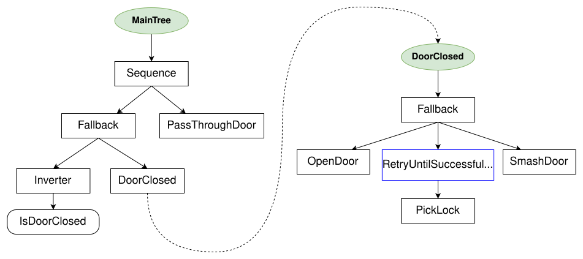
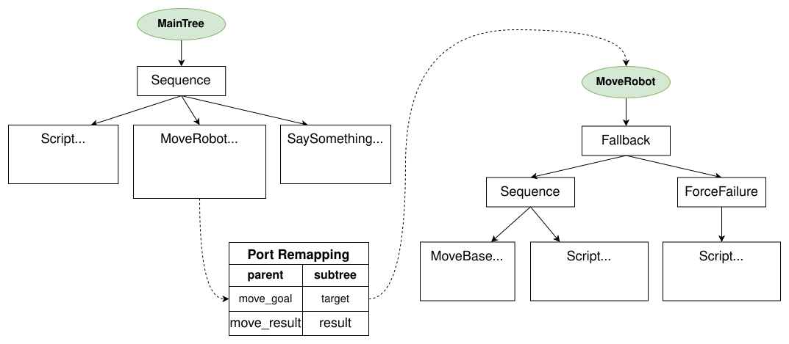
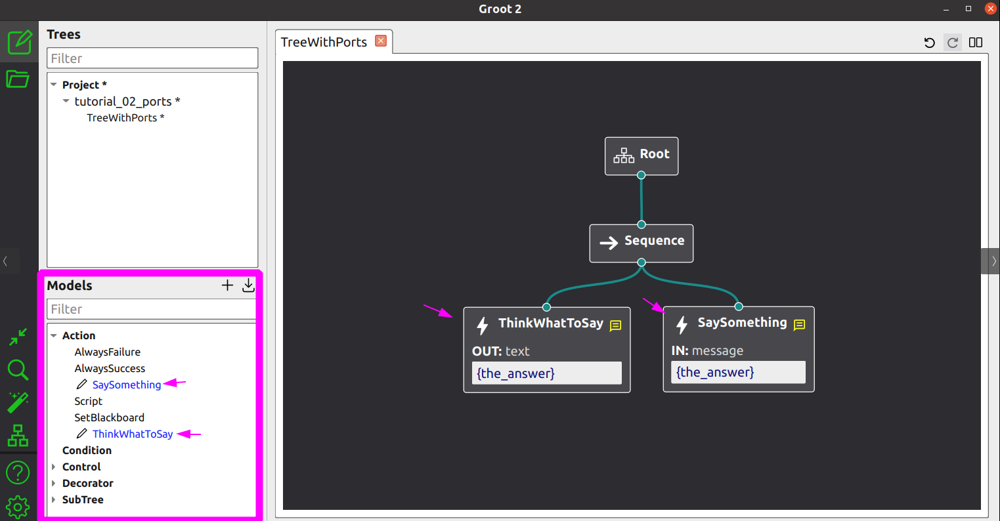
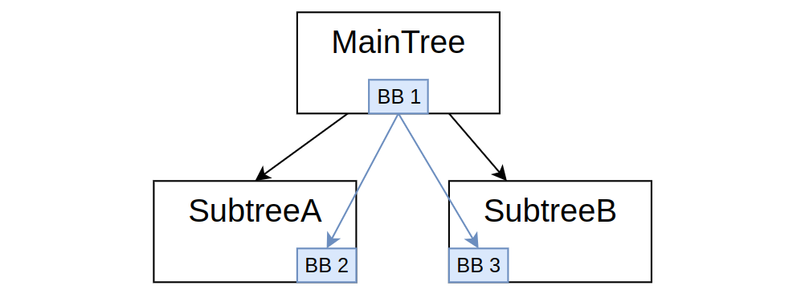
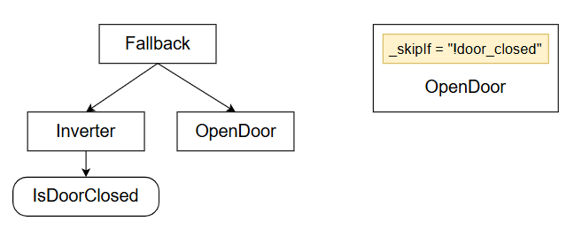
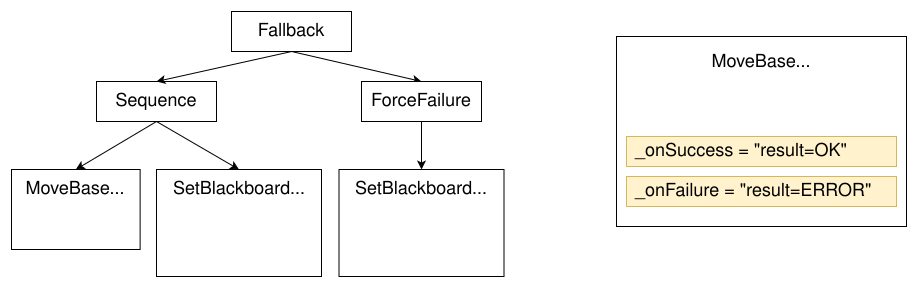
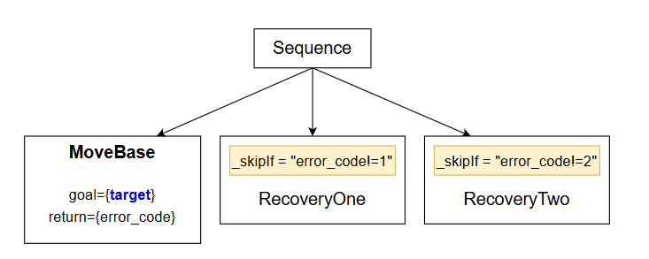
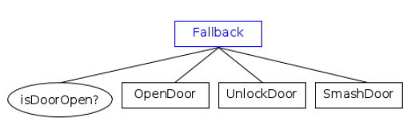
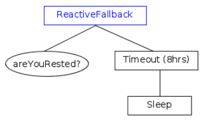

# 基本概念

### 一、控制节点ControlNode

#### 1.sequence  序列节点


-->框表示次序控制节点，所有旗下的行为依次运行，必须全部成功，才表示成功；当其下的某个行为失败时，终止所有行为。

其中，找球，捡球，放球为**动作节点(ActionNode)**；

#### 2.fallback  回退节点

其下行为依次运行，如果有一个行为成功，则终止其下后续行为；如果全部失败，返回failure;下图扩展了捡球行为


“ ？”框表示 fallback 回退节点，椭圆框表示**ConditionNode（条件节点）**，

- `BallClose`：检查是否接近球
- `BallGrasped`：检查是否抓住球

#### 3.控制节点例子


我们现在可以改进“给我拿杯啤酒”的例子，使用颜色“绿色”来表示返回SUCCESS的节点，使用“红色”来表示返回FAILURE的节点。
成功打开冰箱门，然后拿啤酒，因为没有拿到啤酒，强制失败，关门。

### 二、装饰节点


装饰节点通常用于修改子节点的行为，例如：

- InverterNode：反转子节点的返回值
- RetryNode：重试执行子节点
- TimeoutNode：设置子节点超时

isDoorClose的节点的反转器等价于 门是否打开？ 如何未打开，返回failure,开门最多5次直到成功，否则中断所有行为；如果打开了，先进入房间，再关门。

### 三、代码示例

```cpp
// The simplest callback you can wrap into a BT Action
NodeStatus HelloTick()
{
  std::cout << "Hello World\n"; 
  return NodeStatus::SUCCESS;
}

// Allow the library to create Actions that invoke HelloTick()
// (explained in the tutorials)
factory.registerSimpleAction("Hello", std::bind(HelloTick));
```

`HelloTick`**函数指针**

```
TreeNode
```

- `ActionNodeBase`
- `ConditionNode`
- `DecoratorNode`

```xml
 <root BTCPP_format="4">
     <BehaviorTree ID="MainTree">
        <Sequence name="root_sequence">
            <SaySomething   name="action_hello" message="Hello"/>
            <OpenGripper    name="open_gripper"/>
            <ApproachObject name="approach_object"/>
            <CloseGripper   name="close_gripper"/>
        </Sequence>
     </BehaviorTree>
 </root>
```

- 端口是使用属性配置的。在前面的示例中，操作`SaySomething`需要输入端口`message`。

- 在子节点数量方面：
  - `ControlNodes`包含**1到N个子节点**。
  - `DecoratorNodes`和子树**仅包含1个子节点**。
  - `ActionNodes`和`ConditionNodes`都**没有子节点**。

```xml
 <root BTCPP_format="4" >
     <BehaviorTree ID="MainTree">
        <Sequence name="root_sequence">
            <SaySomething message="Hello"/>
            <SaySomething message="{my_message}"/>
        </Sequence>
     </BehaviorTree>
 </root>
```

- 序列的第一个孩子打印“Hello”，
- 第二个孩子读写黑板条目中包含的值，称为“my_message”；

为了使我们树的紧凑版本与Groot兼容，必须按如下方式修改XML：

```xml
 <root BTCPP_format="4" >
     <BehaviorTree ID="MainTree">
        <Sequence name="root_sequence">
           <SaySomething   name="action_hello" message="Hello"/>
           <OpenGripper    name="open_gripper"/>
           <ApproachObject name="approach_object"/>
           <CloseGripper   name="close_gripper"/>
        </Sequence>
    </BehaviorTree>
    
    <!-- the BT executor don't require this, but Groot does -->     
    <TreeNodeModel>
        <Action ID="SaySomething">
            <input_port name="message" type="std::string" />
        </Action>
        <Action ID="OpenGripper"/>
        <Action ID="ApproachObject"/>
        <Action ID="CloseGripper"/>      
    </TreeNodeModel>
 </root>
```

也可以使用显示语法，与groot兼容

```xml
 <root BTCPP_format="4" >
     <BehaviorTree ID="MainTree">
        <Sequence name="root_sequence">
           <Action ID="SaySomething"   name="action_hello" message="Hello"/>
           <Action ID="OpenGripper"    name="open_gripper"/>
           <Action ID="ApproachObject" name="approach_object"/>
           <Action ID="CloseGripper"   name="close_gripper"/>
        </Sequence>
     </BehaviorTree>
 </root>
```

**子树**

如：将子树GraspObject封装在主树MainTree中

```xml
 <root BTCPP_format="4" >
 
     <BehaviorTree ID="MainTree">
        <Sequence>
           <Action  ID="SaySomething"  message="Hello World"/>
           <!-- 将子树GraspObject封装在主树MainTree中 -->    
           <SubTree ID="GraspObject"/>
           <!-- 将子树GraspObject封装在主树MainTree中 -->   
        </Sequence>
     </BehaviorTree>
     
     <BehaviorTree ID="GraspObject">
        <Sequence>
           <Action ID="OpenGripper"/>
           <Action ID="ApproachObject"/>
           <Action ID="CloseGripper"/>
        </Sequence>
     </BehaviorTree>  
 </root>
```

**包括外部文件**

grasp.xml

```xml
 <!-- file grasp.xml -->

 <root BTCPP_format="4" >
     <BehaviorTree ID="GraspObject">
        <Sequence>
           <Action ID="OpenGripper"/>
           <Action ID="ApproachObject"/>
           <Action ID="CloseGripper"/>
        </Sequence>
     </BehaviorTree>  
 </root>
```

aintree.xml

```xml
 <!-- file maintree.xml -->

 <root BTCPP_format="4" >
     <!-- 将子树文件grasp.xml包括进主树maintree.xml文件中 -->
     <include path="grasp.xml"/>
     
     <BehaviorTree ID="MainTree">
        <Sequence>
           <Action  ID="SaySomething"  message="Hello World"/>
           <!-- 将子树GraspObject封装在主树MainTree中 -->
           <SubTree ID="GraspObject"/>
        </Sequence>
     </BehaviorTree>
  </root>
```

如果要查找[ROS包](http://wiki.ros.org/Packages)中的文件：

```xml
<include ros_pkg="name_package"  path="path_relative_to_pkg/grasp.xml"/>
```

# 基础教程

## 1.第一个行为树


利用继承方式，创建树节点，例如，创建ApproachObject 节点

```cpp
// Example of custom SyncActionNode (synchronous action)
// without ports.
class ApproachObject : public BT::SyncActionNode
{
public:
  ApproachObject(const std::string& name) :
      BT::SyncActionNode(name, {})
  {}

  // You must override the virtual function tick()
  BT::NodeStatus tick() override
  {
    std::cout << "ApproachObject: " << this->name() << std::endl;
    return BT::NodeStatus::SUCCESS;
  }
};
```

利用实例化对象，创建节点；创建CheckBattery 节点

```cpp
using namespace BT;

// Simple function that return a NodeStatus
BT::NodeStatus CheckBattery()
{
  std::cout << "[ Battery: OK ]" << std::endl;
  return BT::NodeStatus::SUCCESS;
}
```

在树节点中，创建状态判断函数，创建GripperInterface::open；GripperInterface::close

```cpp
using namespace BT;

// We want to wrap into an ActionNode the methods open() and close()
class GripperInterface
{
public:
  GripperInterface(): _open(true) {}
    
  NodeStatus open() 
  {
    _open = true;
    std::cout << "GripperInterface::open" << std::endl;
    return NodeStatus::SUCCESS;
  }

  NodeStatus close() 
  {
    std::cout << "GripperInterface::close" << std::endl;
    _open = false;
    return NodeStatus::SUCCESS;
  }

private:
  bool _open; // shared information
};
```

用xml创建动态树

```xml
 <root BTCPP_format="4" >
     <BehaviorTree ID="MainTree">
        <Sequence name="root_sequence">
            <CheckBattery   name="check_battery"/>
            <OpenGripper    name="open_gripper"/>
            <ApproachObject name="approach_object"/>
            <CloseGripper   name="close_gripper"/>
        </Sequence>
     </BehaviorTree>
 </root>
```

name可写可不写，我们必须先将自定义的树节点注册到中，然后从文件或文本加载 XML。`BehaviorTreeFactory`

主函数

```cpp
#include "behaviortree_cpp/bt_factory.h"

// file that contains the custom nodes definitions
#include "dummy_nodes.h"
using namespace DummyNodes;

int main()
{
    // We use the BehaviorTreeFactory to register our custom nodes
  BehaviorTreeFactory factory;

  // The recommended way to create a Node is through inheritance.
  factory.registerNodeType<ApproachObject>("ApproachObject");

  // Registering a SimpleActionNode using a function pointer.
  // You can use C++11 lambdas or std::bind
  factory.registerSimpleCondition("CheckBattery", [&](TreeNode&) { return CheckBattery(); });

  //You can also create SimpleActionNodes using methods of a class
  GripperInterface gripper;
  factory.registerSimpleAction("OpenGripper", [&](TreeNode&){ return gripper.open(); } );
  factory.registerSimpleAction("CloseGripper", [&](TreeNode&){ return gripper.close(); } );

  // Trees are created at deployment-time (i.e. at run-time, but only 
  // once at the beginning). 
    
  // IMPORTANT: when the object "tree" goes out of scope, all the 
  // TreeNodes are destroyed
   auto tree = factory.createTreeFromFile("./my_tree.xml");

  // To "execute" a Tree you need to "tick" it.
  // The tick is propagated to the children based on the logic of the tree.
  // In this case, the entire sequence is executed, because all the children
  // of the Sequence return SUCCESS.
  tree.tickWhileRunning();

  return 0;
}

/* Expected output:
*
  [ Battery: OK ]
  GripperInterface::open
  ApproachObject: approach_object
  GripperInterface::close
*/
```

## 2.Blackboard 和端口


- “黑板”是一种由所有节点共享的**简单键值存储** 树的。
- 黑板的“条目”是一个**键值对**。
- **输入端口**（对于节点而言）可以读取 Blackboard 中的条目，而**输出端口**可以写入条目。

#### **输入端口**

```xml
<SaySomething name="first"   message="hello world" />
<SaySomething name="second"  message="{greetings}" />
```

- 在**第一个**节点，端口接收字符串“hello world”;
- 第二个**节点则**被要求在黑板上寻找该值， 使用“Greetings”条目。

Greetings 对应的值 可以在运行时改变。

ActionNode 可以实现如下：`SaySomething`

```cpp
// SyncActionNode (synchronous action) with an input port.
class SaySomething : public SyncActionNode
{
public:
  // If your Node has ports, you must use this constructor signature 
  SaySomething(const std::string& name, const NodeConfig& config)
    : SyncActionNode(name, config)
  { }

  // It is mandatory to define this STATIC method.
  static PortsList providedPorts()
  {
    // This action has a single input port called "message"
    return { InputPort<std::string>("message") };
  }

  // Override the virtual function tick()
  //SaySomething继承了基类SyncActionNode，必须提供 tick() 函数的具体实现，否则它自己也会成为一个抽象类
  //如果不使用override,写错了tick()编译时不会报错造成失误，同时告诉了阅读者，这是一个父类虚函数的具体实现
  NodeStatus tick() override 
  {
    //Expected<T> 是一个“包装器”类型，它要么包含一个类型为 T 的有效值，要么包含一个描述错误的信息。
    //如果它持有有效值，则返回 true；如果持有错误，则返回 false。
    Expected<std::string> msg = getInput<std::string>("message");
    // Check if expected is valid. If not, throw its error
    if (!msg)
    {
      throw BT::RuntimeError("missing required input [message]: ", 
                              msg.error() );
    }
    // use the method value() to extract the valid message.
    std::cout << "Robot says: " << msg.value() << std::endl;
    return NodeStatus::SUCCESS;
  }
};
/*PortsList 是一个数据结构，通常是 std::vector，用于存储端口的描述信息。
providedPorts() 是一个静态方法，作为与行为树框架沟通的“接口”，用来告诉框架一个节点类有哪些端口。
InputPort<...>(...) 是一个对象，它描述了单个端口的名称
return { ... } 是一种便捷的语法，用于创建包含一个或多个端口描述对象的 PortsList 容器。
*/
```

当自定义树节点有输入和/或输出端口时，这些端口必须是 在**静态**方法中声明：

```cpp
static MyCustomNode::PortsList providedPorts();
```

端口的输入可以通过模板方法读取。`message TreeNode::getInput<T>(key)`，建议在主函数中调用，而不是在类的构造函数中调用，因为需要实时运行，更改期望值，而类只能实例化一次就不会调用了。

#### **输出端口**

利用ThinkWhatToSay节点举例

```cpp
class ThinkWhatToSay : public SyncActionNode
{
public:
  ThinkWhatToSay(const std::string& name, const NodeConfig& config)
    : SyncActionNode(name, config)
  { }

  static PortsList providedPorts() //返回类型是PortsList，函数是库里面特定的
  {
    return { OutputPort<std::string>("text") };
  }

  // This Action writes a value into the port "text"
  NodeStatus tick() override
  {
    // the output may change at each tick(). Here we keep it simple.
    setOutput("text", "The answer is 42" );
    return NodeStatus::SUCCESS;
  }
};
```

#### **完整案例**

- 动作1读取静态字符串的输入。`message`
- 动作2在黑板的条目中写入名为 的 。`the_answer`
- 动作3读取黑板中名为 的条目中的输入。`message``the_answer`

```xml
<root BTCPP_format="4" >
    <BehaviorTree ID="MainTree">
       <Sequence name="root_sequence">
           <SaySomething     message="hello" />
           <ThinkWhatToSay   text="{the_answer}"/>
           <SaySomething     message="{the_answer}" />
       </Sequence>
    </BehaviorTree>
</root>
```

```cpp
#include "behaviortree_cpp/bt_factory.h"

// file that contains the custom nodes definitions
#include "dummy_nodes.h"
using namespace DummyNodes;

int main()
{  
  BehaviorTreeFactory factory;
  factory.registerNodeType<SaySomething>("SaySomething");
  factory.registerNodeType<ThinkWhatToSay>("ThinkWhatToSay");

  auto tree = factory.createTreeFromFile("./my_tree.xml");
  tree.tickWhileRunning();
  return 0;
}

/*  Expected output:
  Robot says: hello
  Robot says: The answer is 42
*/
```

## 3.带有通用类型的端口

#### 解析字符串

**BehaviorTree.CPP**支持字符串自动转换为通用类型，如int；`   `long；``double；``bool`；`NodeStatus；

```CPP
// We want to use this custom type
struct Position2D 
{ 
  double x;
  double y; 
};
```

为了让XML加载器从字符串实例化a， 我们需要提供一个模板特化。

`Position2D` `BT::convertFromString<Position2D>(StringView)`

实现方式为

```cpp
std::string my_str = "30.0;40.0";
Position2D p2 = convertFromString(my_str); 
```

如何串行成字符串由你决定; 在这种情况下， 我们只需用*分号*分隔两个数字。`Position2D`

```cpp
namespace BT
{
    template <> inline  //声明以下为模版，inline表示将函数直接插入调用点
    //返回值类型为Position2D（自定义）的函数，用于提取字符串数据
    //StringView 数据类型：指向字符序列的指针和该序列的长度
    // [BT库] convertFromString 是库提供的函数模板
    Position2D convertFromString(StringView str)	
    {
        // [BT库] splitString 是库提供的工具函数
        auto parts = splitString(str, ';');
        if (parts.size() != 2)
        {
            throw RuntimeError("invalid input)");
        }
        else
        {
            Position2D output;
            output.x = convertFromString<double>(parts[0]);
            output.y = convertFromString<double>(parts[1]);
            return output;
        }
    }
} // end namespace BT
```

正如我们在之前的教程中所做的，我们可以创建两个自定义动作， 一个会写入端口，另一个会从端口读取。

1. **黑板**：一个全局的、所有节点都可以访问的共享内存空间。用来存储**键值对**。例如 `{"GoalPosition": (1.1, 2.3), "OtherGoal": (-1.0, 3.0)}`。
2. **端口**：每个节点的“接口”。
   - **输出端口**：节点执行完毕后，将一个值写入黑板，并关联到一个**键**。
   - **输入端口**：节点执行时，从一个**键**读取黑板上的值。
3. **端口映射**：在 XML 中，`goal="{GoalPosition}"` 这段代码就是**端口映射**。它把节点的**端口名**（`goal`）和黑板上的**键名**（`GoalPosition`）连接起来。

```cpp
class CalculateGoal: public SyncActionNode
{
  public:
    CalculateGoal(const std::string& name, const NodeConfig& config):
      SyncActionNode(name,config)
    {}

    static PortsList providedPorts()
    {
      return { OutputPort<Position2D>("goal") };//设置节点输出端口名为 "goal",值类型是Position2D
    }

    NodeStatus tick() override
    {
      Position2D mygoal = {1.1, 2.3};
      setOutput<Position2D>("goal", mygoal);//输出端口值为{1.1, 2.3}
      return NodeStatus::SUCCESS;
    }
};

class PrintTarget: public SyncActionNode
{
  public:
    PrintTarget(const std::string& name, const NodeConfig& config):
        SyncActionNode(name,config)
    {}

    static PortsList providedPorts()
    {
      // Optionally, a port can have a human readable description
      const char*  description = "Simply print the goal on console...";
      return { InputPort<Position2D>("target", description) };//设置节点输出端口名为 "target"
    }
      
    NodeStatus tick() override
    {
      auto res = getInput<Position2D>("target");
      if( !res )
      {
        throw RuntimeError("error reading port [target]:", res.error());
      }
      Position2D target = res.value();
      printf("Target positions: [ %.1f, %.1f ]\n", target.x, target.y );
      return NodeStatus::SUCCESS;
    }
};
```


```cpp
static const char* xml_text = R"(
 <root BTCPP_format="4" >
     <BehaviorTree ID="MainTree">
        <Sequence name="root">
        	<!-- 输出端口goal,输入端口target,对接黑板键名：GoalPosition，OtherGoal>
            <CalculateGoal goal="{GoalPosition}" />
            <PrintTarget   target="{GoalPosition}" />
            <Script        code=" OtherGoal:='-1;3' " />
            <PrintTarget   target="{OtherGoal}" />
        </Sequence>
     </BehaviorTree>
 </root>
 )";

//<Script> 是行为树框架提供的一个内置节点类型，你不需要自己注册它，可以直接在XML中使用
int main()
{
  BT::BehaviorTreeFactory factory;
  factory.registerNodeType<CalculateGoal>("CalculateGoal");
  factory.registerNodeType<PrintTarget>("PrintTarget");

  auto tree = factory.createTreeFromText(xml_text);
  tree.tickWhileRunning();

  return 0;
}
/* Expected output:
    Target positions: [ 1.1, 2.3 ]
    Converting string: "-1;3"
    Target positions: [ -1.0, 3.0 ]
*/
```

## 4.反应性行为

### 4.1异步节点


这篇文档的核心是解释**如何让行为树中的节点执行长时间运行的任务（如网络请求、文件读写、复杂的路径规划等），而不会阻塞整个树的执行**。
传统的行为树节点是同步的：一个节点执行完它的任务，立刻返回成功或失败状态，然后父节点才能继续执行下一个子节点。如果一个任务需要几秒钟，整个行为树就会“卡死”几秒钟，这对于需要实时响应的系统（如机器人、游戏AI）是致命的。
为了解决这个问题，BehaviorTree.CPP 引入了**异步节点**。它的关键机制是 **`tick()` 振动** 和 **状态返回 `RUNNING`**。

*   **异步节点** 在执行一个长时间任务时，不会等待任务结束，而是立即返回 `RUNNING` 状态。
*   行为树的调度器会**周期性地**（例如每秒20次）重新 `tick()` 整个树。
*   当再次 `tick()` 到这个正在执行的异步节点时，它会检查任务的进度。如果任务完成了，就返回 `SUCCESS` 或 `FAILURE`；如果还在进行中，就再次返回 `RUNNING`。
*   通过这种方式，长时间的任务被“分片”执行，使得行为树可以在任务执行期间，仍然能响应其他事件或执行其他分支。
---
#### 专业名词详细解释
文档中出现了几个关键的专业名词，理解它们是掌握异步节点的关键。
#### 1. `tick()` (振动/触发)
这是行为树中最基本、最重要的概念。
*   **中文解释**：可以理解为**“触发”、“执行一次”或“心跳”**。`tick()` 是一个函数调用，它让一个节点执行其内部的逻辑。
*   **详细解释**：
    *   行为树的执行引擎会以一定的频率（比如 20 Hz，即每秒20次）从根节点开始调用 `tick()`。
    *   当一个节点被 `tick()` 时，它会执行自己的任务，并返回一个状态（`SUCCESS`, `FAILURE`, `RUNNING`）。
    *   对于控制节点（如序列节点 Sequence、选择节点 Fallback），它们的 `tick()` 逻辑是根据子节点的返回状态来决定是继续 `tick()` 下一个子节点，还是停止并向上返回自己的状态。
    *   **“振动”这个比喻很形象**：就像你拨动一个开关，`tick()` 就是这个“拨动”的动作，它让节点“动”起来。
#### 2. `RUNNING` (运行中状态)
这是实现异步行为的核心状态。
*   **中文解释**：**“正在执行中”**。它表示一个节点启动的任务尚未完成，需要更多时间。
*   **详细解释**：
    *   一个节点返回 `RUNNING`，意味着“我的活儿还没干完，你别管我，也别执行我的兄弟节点，下次 `tick()` 的时候再来问我”。
    *   当一个子节点返回 `RUNNING` 时，它的父节点（通常是 `Sequence` 或 `Fallback`）也必须**停止执行**，并向上层同样返回 `RUNNING`。这会一直传递到根节点。
    *   这样，整个行为树在下一个 `tick()` 周期，会**精确地从上次返回 `RUNNING` 的那个节点开始继续执行**，而不是从头再来。这保证了任务的状态得以保存和延续。
#### 3. `halt()` (中止/停止)
这是与 `RUNNING` 配对使用的关键方法，用于资源清理和状态重置。
*   **中文解释**：**“强制停止”、“中断”**。
*   **详细解释**：
    *   什么时候会调用 `halt()`？当一个节点正在 `RUNNING` 时，如果它的父节点因为某种原因（比如另一个兄弟节点失败了，或者整个树被外部命令停止）决定不再需要它继续执行了，父节点就会调用这个节点的 `halt()` 方法。
    *   `halt()` 的作用是**给节点一个机会去清理自己**。例如：
        *   一个正在移动机器人的 `MoveTo` 节点被 `halt()`，它需要发送一个“停止移动”的指令给机器人。
        *   一个正在读取文件的节点被 `halt()`，它需要关闭文件句柄，释放内存。
        *   一个启动了后台线程的节点被 `halt()`，它需要安全地终止那个线程。
    *   **正确实现 `halt()` 至关重要**，否则会导致资源泄露（如线程无法关闭、文件未关闭）或系统状态不一致（如机器人停不下来）。
---
#### 异步节点的实现方式
文档中主要介绍了两种实现异步节点的方法：
#### 方式一：基于 `AsyncThreadedAction` (多线程方式)
这是最常用、最直观的方式。
*   **原理**：`AsyncThreadedAction` 是一个基类，它为你封装了多线程的复杂性。
*   **工作流程**：
    1.  当你的节点第一次被 `tick()` 时，`AsyncThreadedAction` 会**自动创建一个新的后台线程**。
    2.  在这个新线程中，它会调用你需要在子类中实现的 `threadFunction()` 方法。这个 `threadFunction()` 包含了你的长时间任务逻辑（例如，一个阻塞的网络请求 `client.request()`）。
    3.  主线程中的 `tick()` 函数在启动后台线程后，**立即返回 `RUNNING`**。
    4.  在后续的 `tick()` 中，它会检查后台线程是否已经结束。
        *   如果结束了，就获取 `threadFunction()` 的返回结果，并返回 `SUCCESS` 或 `FAILURE`。
        *   如果没结束，就继续返回 `RUNNING`。
*   **优点**：实现简单，开发者只需关注任务逻辑本身，不用手动管理线程。
*   **缺点**：如果异步节点很多，会创建大量线程，可能带来线程切换的开销和资源消耗。
#### 方式二：基于 `CoroActionNode` (协程方式)
这是一种更轻量级、更现代的方式，基于 C++20 的协程。
*   **原理**：协程是一种“可以被暂停和恢复”的函数。它不是真正的多线程，而是在**同一线程内**通过协作式调度来模拟并发。
*   **工作流程**：
    1.  你需要实现一个 `tick()` 方法，但这个方法可以被 `co_await` 暂停。
    2.  当遇到一个需要等待的操作时（比如一个非阻塞的 I/O 操作），你可以使用 `co_await` 将函数“暂停”，并让出 CPU 控制权。
    3.  此时，`CoroActionNode` 返回 `RUNNING`，但**没有创建新线程**。
    4.  当等待的条件满足后（比如 I/O 操作完成），协程会从暂停的地方**自动恢复执行**。
*   **优点**：
    *   **极其轻量**：没有线程创建和切换的开销，内存占用更小。
    *   **性能更高**：对于海量的、等待I/O的异步任务，协程远比多线程高效。
*   **缺点**：
    *   需要编译器支持 C++20 协程。
    *   概念比多线程稍微抽象一些，需要理解协程的工作方式。
---
#### 总结与类比
| 特性           | 同步节点                         | 异步节点                                                     |
| :------------- | :------------------------------- | :----------------------------------------------------------- |
| **执行方式**   | 一次性执行完，立即返回结果       | 任务分片执行，通过 `RUNNING` 状态报告进度                    |
| **返回状态**   | `SUCCESS` 或 `FAILURE`           | `SUCCESS`, `FAILURE`, 或 `RUNNING`                           |
| **对树的影响** | 执行完立即让父节点继续           | 执行期间让整个树“暂停”在当前节点                             |
| **适用场景**   | 简单、快速的逻辑（如判断、计算） | 耗时操作（如网络、文件、运动控制）                           |
| **实现基础**   | 普通的 `tick()` 方法             | `tick()` 振动 + `RUNNING` 状态 + `halt()` 清理               |
| **具体实现**   | 继承 `SyncActionNode`            | 继承 `AsyncThreadedAction` (多线程) 或 `CoroActionNode` (协程) |
**一个生动的比喻：**
*   **同步节点**就像一个**快餐店厨师**。你点一个汉堡，他立刻做好给你，然后接待下一位顾客。任务简单快速。
*   **异步节点**就像一个**高级餐厅的厨师**。你点一份慢炖牛排。
    *   他不会站在炉边干等几个小时。他会把牛排放到炉子上（**启动任务**），然后告诉你“您的菜正在烹饪中”（**返回 `RUNNING`）。
    *   然后他可以去准备其他顾客的沙拉（**树可以处理其他事情**）。
    *   过一会儿，他会回来看一眼牛排（**下一次 `tick()`**），如果好了，就端给你（**返回 `SUCCESS`**）；如果没好，就继续忙别的（**继续返回 `RUNNING`**）。
    *   如果你突然说不要了（**父节点决定中止**），他会立刻关掉火（**调用 `halt()`**），避免浪费。
通过理解这些概念，你就可以设计出既强大又响应迅速的复杂AI行为，让机器人或游戏角色能够同时处理多项任务，而不会因为某个耗时操作而“卡住”。

### 4.2反应性和异步行为

实现背景：机器人运动过程中，移动到目标点需要220ms，每隔100ms tick整个树检查是否到目标点，如果每到返回running,如果到了，返回success。

首先创建 **MoveBaseAction** 的虚拟节点

```cpp
// 目标位姿
struct Pose2D
{
    double x, y, theta;
};

namespace chr = std::chrono;//时间 ms

class MoveBaseAction : public BT::StatefulActionNode
{
  public:
    // 所有节点端口，必须采用此签名格式
    MoveBaseAction(const std::string& name, const BT::NodeConfig& config)
      : StatefulActionNode(name, config)
    {}

    // 必须采用此静态定义方法
    static BT::PortsList providedPorts()
    {
        return{ BT::InputPort<Pose2D>("goal") };//设置此节点输入端口名为goal
    }

    // 此函数在开始时调用一次
    BT::NodeStatus onStart() override;

    // 如果onStart（）返回运行，我们将继续调用
    // 直到它返回与RUNING不同的状态结束或退出
    BT::NodeStatus onRunning() override;

    // 如果操作被另一个节点中止，则执行回调
    void onHalted() override;

  private:
    Pose2D _goal;
    chr::system_clock::time_point _completion_time;
};

//-------------------------

BT::NodeStatus MoveBaseAction::onStart()
{
  if ( !getInput<Pose2D>("goal", _goal))//从xml文件输入目标点，保存在_goal中，并于goal黑板键产生映射
  {
    throw BT::RuntimeError("missing required input [goal]");
  }
  printf("[ MoveBase: SEND REQUEST ]. goal: x=%f y=%f theta=%f\n",
         _goal.x, _goal.y, _goal.theta);

  //我们用这个计数器来模拟一个动作
  //完成时间（220毫秒）
  _completion_time = chr::system_clock::now() + chr::milliseconds(220);

  return BT::NodeStatus::RUNNING;//返回RUNNING状态
}

BT::NodeStatus MoveBaseAction::onRunning()
{
  // 假装我们正在检查是否已收到回复
  // 你不想在这个函数中阻塞太多时间。
  std::this_thread::sleep_for(chr::milliseconds(10));

    //假装，经过一定的时间，
    //我们已经完成了操作
  if(chr::system_clock::now() >= _completion_time)
  {
    std::cout << "[ MoveBase: FINISHED ]" << std::endl;
    return BT::NodeStatus::SUCCESS;
  }
  return BT::NodeStatus::RUNNING;
}

void MoveBaseAction::onHalted()
{
  printf("[ MoveBase: ABORTED ]");
}
```

```cpp
int main()
{
  BT::BehaviorTreeFactory factory;
  //bool CheckBattery() 函数没有定义，与BatteryOK节点绑定在一起
  factory.registerSimpleCondition("BatteryOK", std::bind(CheckBattery));
  factory.registerNodeType<MoveBaseAction>("MoveBase");
  factory.registerNodeType<SaySomething>("SaySomething");

  auto tree = factory.createTreeFromText(xml_text);
 
  //这里，而不是tree. tickWhileRning（），
  //我们更喜欢自己的循环。
  std::cout << "--- ticking\n";
  auto status = tree.tickOnce();
  std::cout << "--- status: " << toStr(status) << "\n\n";

  while(status == NodeStatus::RUNNING) 
  {
    //睡觉以避免繁忙的循环。
    //不要使用其他睡眠函数！
    //小睡眠时间可以，这里我们只使用大睡眠时间
    //控制台上的消息较少。
    tree.sleep(std::chrono::milliseconds(100));

    std::cout << "--- ticking\n";
    status = tree.tickOnce();
    std::cout << "--- status: " << toStr(status) << "\n\n";
  }

  return 0;
}
```

```xml
 <root BTCPP_format="4">
     <BehaviorTree>
        <Sequence>
            <BatteryOK/>
            <SaySomething   message="mission started..." />
            <MoveBase           goal="1;2;3"/>
            <SaySomething   message="mission completed!" />
        </Sequence>
     </BehaviorTree>
 </root>
```

预期输出：

```cpp
--- ticking
[ Battery: OK ]
Robot says: mission started...
[ MoveBase: SEND REQUEST ]. goal: x=1.0 y=2.0 theta=3.0
--- status: RUNNING

--- ticking
--- status: RUNNING

--- ticking
[ MoveBase: FINISHED ]
Robot says: mission completed!
--- status: SUCCESS
```

## 5.使用子树



```xml
<root BTCPP_format="4">
    <BehaviorTree ID="MainTree">
        <Sequence>
            <Fallback>
                <Inverter>
                    <IsDoorClosed/>
                </Inverter>
                <!-- 子树设置 -->
                <SubTree ID="DoorClosed"/>
                <!-- 子树设置 -->
            </Fallback>
            <PassThroughDoor/>
        </Sequence>
    </BehaviorTree>

    <BehaviorTree ID="DoorClosed">
        <Fallback>
            <OpenDoor/>
            <RetryUntilSuccessful num_attempts="5">
                <PickLock/>
            </RetryUntilSuccessful>
            <SmashDoor/>
        </Fallback>
    </BehaviorTree>    
</root>
```

```cpp
class CrossDoor
{
public:
    void registerNodes(BT::BehaviorTreeFactory& factory);

    // SUCCESS if _door_open != true
    BT::NodeStatus isDoorClosed();

    // SUCCESS if _door_open == true
    BT::NodeStatus passThroughDoor();

    // After 3 attempts, will open a locked door
    BT::NodeStatus pickLock();

    // FAILURE if door locked
    BT::NodeStatus openDoor();

    // WILL always open a door
    BT::NodeStatus smashDoor();

private:
    bool _door_open   = false;
    bool _door_locked = true;
    int _pick_attempts = 0;
};

//帮助方法，让用户注册不那么痛苦
void CrossDoor::registerNodes(BT::BehaviorTreeFactory &factory)
{
  factory.registerSimpleCondition(
      "IsDoorClosed", std::bind(&CrossDoor::isDoorClosed, this));

  factory.registerSimpleAction(
      "PassThroughDoor", std::bind(&CrossDoor::passThroughDoor, this));

  factory.registerSimpleAction(
      "OpenDoor", std::bind(&CrossDoor::openDoor, this));

  factory.registerSimpleAction(
      "PickLock", std::bind(&CrossDoor::pickLock, this));

  factory.registerSimpleCondition(
      "SmashDoor", std::bind(&CrossDoor::smashDoor, this));
}

int main()
{
  BehaviorTreeFactory factory;

  CrossDoor cross_door;
  cross_door.registerNodes(factory);

//在这个例子中，一个XML包含多个<行为树>
//要确定哪一个是“主的”，我们应该先注册
//XML然后分配一个特定的树，使用它的ID

  factory.registerBehaviorTreeFromText(xml_text);
  auto tree = factory.createTree("MainTree");

//打印树的辅助函数
  printTreeRecursively(tree.rootNode());
  tree.tickWhileRunning();
  return 0;
}
```

## 6.子树的端口重新映射

子树存在和主树相同的作用的端口名，比如导航时的目标位姿和是否成功到达目标点的反馈信息；如果采用相同的端口名，容易起冲突，但重新创建端口，容易造成内存浪费；这里将子端口起别名，重新映射到主端口。



```xml
<root BTCPP_format="4">

    <BehaviorTree ID="MainTree">
        <Sequence>
            <Script code=" move_goal='1;2;3' " />
            <!--子端口重新映射到主端口-->
            <SubTree ID="MoveRobot" target="{move_goal}" 
                                    result="{move_result}" />
            <!--子端口重新映射到主端口-->            
            <SaySomething message="{move_result}"/>
        </Sequence>
    </BehaviorTree>

    <BehaviorTree ID="MoveRobot">
        <Fallback>
            <Sequence>
                <!--子端口接收外界信息-->
                <MoveBase  goal="{target}"/>
                <Script code=" result:='goal reached' " />
            </Sequence>
            <ForceFailure>
                <!--子端口发送信息-->
                <Script code=" result:='error' " />
            </ForceFailure>
        </Fallback>
    </BehaviorTree>

</root>
```

用该方法 检查黑板的价值`debugMessage`

```cpp
int main()
{
  BT::BehaviorTreeFactory factory;

  factory.registerNodeType<SaySomething>("SaySomething");
  factory.registerNodeType<MoveBaseAction>("MoveBase");

  factory.registerBehaviorTreeFromText(xml_text);
  auto tree = factory.createTree("MainTree");

  // Keep ticking until the end
  tree.tickWhileRunning();

//让我们可视化一些关于黑板当前状态的信息。
  std::cout << "\n------ First BB ------" << std::endl;
  tree.subtrees[0]->blackboard->debugMessage();
  std::cout << "\n------ Second BB------" << std::endl;
  tree.subtrees[1]->blackboard->debugMessage();

  return 0;
}

/* Expected output:

------ First BB ------
move_result (std::string)
move_goal (Pose2D)

------ Second BB------
[result] remapped to port of parent tree [move_result]
[target] remapped to port of parent tree [move_goal]

*/
```

## 7.使用多个xml文件

随着子树数量的增加，使用多个文件变得更方便。

文件**subtree_A.xml**：

```xml
<root>
    <BehaviorTree ID="SubTreeA">
        <SaySomething message="Executing Sub_A" />
    </BehaviorTree>
</root>
```

文件**subtree_B.xml**：

```xml
<root>
    <BehaviorTree ID="SubTreeB">
        <SaySomething message="Executing Sub_B" />
    </BehaviorTree>
</root>
```

文件**main_tree.xml**

```xml
<root>
    <BehaviorTree ID="MainTree">
        <Sequence>
            <SaySomething message="starting MainTree" />
            <!-- 这里加载子树 -->
            <SubTree ID="SubTreeA" />
            <SubTree ID="SubTreeB" />
        </Sequence>
    </BehaviorTree>
</root>
```

```cpp
int main()
{
  BT::BehaviorTreeFactory factory;
  factory.registerNodeType<DummyNodes::SaySomething>("SaySomething");

//找到文件夹中的所有XML文件并注册所有文件。
//我们将使用std::文件系统::directory_iterator
  std::string search_directory = "./";

//directory_iterator 是一个迭代器，可以遍历一个目录下的所有文件和子目录。    
  using std::filesystem::directory_iterator;
  /*这是一个基于范围的 for 循环。
    directory_iterator(search_directory) 创建了一个迭代器，
    它会指向 search_directory（即当前目录）中的第一个条目（文件或文件夹）。
    循环会依次遍历目录中的每一个条目，每次循环，
    entry 变量就代表当前正在处理的那个文件或文件夹的信息（类型为 std::filesystem::directory_entry）。    
  */
  for (auto const& entry : directory_iterator(search_directory)) 
  {
     /*entry.path()：获取当前条目的完整路径（例如 ./main_tree.xml）。
	  .extension()：从路径中提取文件的扩展名（例如 .xml）。
	  entry.path().string()：将文件路径对象转换为标准的 std::string 类型。
     */
    if( entry.path().extension() == ".xml")
    {
      factory.registerBehaviorTreeFromFile(entry.path().string());
    }
  }
  // 在我们的具体情况下，这相当于
  // factory.registerBehaviorTreeFromFile("./main_tree.xml");
  // factory.registerBehaviorTreeFromFile("./subtree_A.xml");
  // factory.registerBehaviorTreeFromFile("./subtree_B.xml");

 //您可以创建MainTree，子树将自动添加。
  std::cout << "----- MainTree tick ----" << std::endl;
  auto main_tree = factory.createTree("MainTree");
  main_tree.tickWhileRunning();

  //…或者你可以只创建一个子树
  std::cout << "----- SubA tick ----" << std::endl;
  auto subA_tree = factory.createTree("SubTreeA");
  subA_tree.tickWhileRunning();

  return 0;
}
/* Expected output:

Registered BehaviorTrees:
 - MainTree
 - SubTreeA
 - SubTreeB
----- MainTree tick ----
Robot says: starting MainTree
Robot says: Executing Sub_A
Robot says: Executing Sub_B
----- SubA tick ----
Robot says: Executing Sub_A
```

## 8.向节点传递额外参数

#### 为什么需要“额外参数”？

在之前的学习中，我们知道节点主要通过**黑板**来共享数据。黑板是一个全局的键值对存储，非常适合在树的不同部分之间传递信息。

但考虑这样一种情况：一个节点需要一些**固定的、一次性的配置信息**，这些信息在树的整个生命周期中都不会改变。

例如：

- 一个 `MoveTo` 节点需要知道机器人的**最大速度**。

如果把这些配置信息也写在黑板上，会显得很笨拙：

1. **污染黑板**：黑板上会充满大量固定的配置项，与动态变化的状态数据混在一起，难以管理。
2. **不安全**：任何节点都可以意外地修改这些本应是只读的配置。
3. **不直观**：配置信息与节点本身分离，查看 XML 时无法立刻看出节点的完整行为。

**“额外参数”** 就是解决这个问题的方案。它允许你在 XML 中直接为节点实例提供**静态的、硬编码的参数**，这些参数在节点创建时就被传入，之后不会改变。


#### 方法一 向构造器添加参数（推荐）

考虑以下自定义节点，称为**Action_A**。给它传递两个额外参数

```cpp
//Action_A的构造函数与默认构造函数不同。
class Action_A: public SyncActionNode
{

public:
    // 传递给构造函数的附加参数
    Action_A(const std::string& name, const NodeConfig& config,
             int arg_int, std::string arg_str):
        SyncActionNode(name, config),
        _arg1(arg_int),
        _arg2(arg_str) {}

    // 此示例不需要任何端口
    static PortsList providedPorts() { return {}; }

    //  tick()可以访问私有成员
    NodeStatus tick() override;

private:
    int _arg1;
    std::string _arg2;
};
```

注册该节点并传递已知参数非常简单：

```cpp
BT::BehaviorTreeFactory factory;
factory.registerNodeType<Action_A>("Action_A", 42, "hello world");

// 如果您更喜欢指定模板参数
// factory.registerNodeType<Action_A, int, std::string>("Action_A", 42, "hello world");
```

#### 方法二、使用初始化方法

```cpp
class Action_B: public SyncActionNode
{

public:
    // 构造函数看起来像往常一样。
    Action_B(const std::string& name, const NodeConfig& config):
        SyncActionNode(name, config) {}

    // 我们希望在第一个tick之前调用此方法,并且只调用一次
    void initialize(int arg_int, const std::string& arg_str)
    {
        _arg1 = arg_int;
        _arg2 = arg_str;
    }

    //此示例不需要任何端口
    static PortsList providedPorts() { return {}; }

    // tick()可以访问私有成员
    NodeStatus tick() override;

private:
    int _arg1;
    std::string _arg2;
};
```

```cpp
BT::BehaviorTreeFactory factory;

//像往常一样注册，但我们仍然需要初始化
factory.registerNodeType<Action_B>("Action_B");

// 创建整个树。Action_B实例尚未初始化
auto tree = factory.createTreeFromText(xml_text);

// 访问者将初始化的实例
auto visitor = [](TreeNode* node)
{
  if (auto action_B_node = dynamic_cast<Action_B*>(node))
  {
    action_B_node->initialize(69, "interesting_value");
  }
};

// 将访问者应用到树的所有节点
tree.applyVisitor(visitor);
```

## 9.脚本实例

#### **简介**
从版本 3.5 开始，BehaviorTree.CPP 引入了一种强大的新节点类型：**脚本节点**。
脚本节点允许你直接在 XML 文件中编写简单的逻辑表达式，而无需为这些简单任务创建专门的 C++ 类。这对于以下场景特别有用：

*   **简单的数学计算**。
*   **字符串操作**。
*   **基于黑板键值的条件判断**。
*   **设置黑板键的值**。
脚本节点主要有三种类型，它们都对应于 C++ 节点，但允许你在 XML 中定义其行为：
1.  **`Script`**: 一个同步动作节点，执行一个脚本并返回 `SUCCESS`。
2.  **`IfThenElse`**: 一个控制流节点，根据脚本表达式的结果执行不同的子节点。
3.  **`BlackboardPrecondition`**: 一个条件节点，根据脚本表达式返回 `SUCCESS` 或 `FAILURE`。
---
### **1. `Script` 节点**
`Script` 节点是一个动作节点，它会执行一个脚本。如果脚本执行成功（没有抛出异常），该节点返回 `SUCCESS`。
**语法：**

```xml
<Script code="你的脚本代码" />
```
**示例：**

```xml
<root main_tree_to_execute="MainTree">
    <BehaviorTree ID="MainTree">
        <Sequence>
            <!-- 设置一个初始值 -->
            <SetBlackboard output_key="counter" value="0" />
            <!-- 执行一个脚本来增加计数器的值 -->
            <Script code="counter += 1" />
            <!-- 执行一个脚本来设置另一个键的值 -->
            <Script code="message = 'The counter is ' + std::to_string(counter)" />
            <!-- 打印结果 -->
            <SaySomething message="{message}" />
        </Sequence>
    </BehaviorTree>
</root>
```
**代码解释：**
*   `counter += 1`: 从黑板读取 `counter` 的值，将其加 1，然后写回黑板。
*   `message = 'The counter is ' + std::to_string(counter)`: 读取 `counter` 的值，将其转换为字符串，并与另一个字符串拼接，最后将结果存入黑板的 `message` 键中。
**可用的函数和操作符：**
脚本语言（基于 `ExprTk` 库）支持丰富的功能，包括：
*   基本算术运算：`+`, `-`, `*`, `/`, `%`
*   比较运算符：`==`, `!=`, `<`, `>`, `<=`, `>=`
*   逻辑运算符：`and`, `or`, `not`
*   字符串操作：`+` (拼接)
*   三元运算符：`condition ? value_if_true : value_if_false`
*   **标准库函数**：如 `std::to_string()`, `std::min()`, `std::max()` 等。
---
### **2. `IfThenElse` 节点**
这是一个控制流节点，它根据脚本表达式的真假来决定执行哪个子节点。
**语法：**

```xml
<IfThenElse condition="你的条件表达式">
    <!-- 如果条件为真，执行这里 -->
    <Then>
        ...
    </Then>
    <!-- 如果条件为假，执行这里 -->
    <Else>
        ...
    </Else>
</IfThenElse>
```
**示例：**
```xml
<root main_tree_to_execute="MainTree">
    <BehaviorTree ID="MainTree">
        <Sequence>
            <SetBlackboard output_key="battery_level" value="45" />
            <IfThenElse condition="battery_level < 20">
                <Then>
                    <SaySomething message="电量低，返回充电！" />
                </Then>
                <Else>
                    <SaySomething message="电量充足，继续工作。" />
                </Else>
            </IfThenElse>
        </Sequence>
    </BehaviorTree>
</root>
```
**代码解释：**
*   `condition="battery_level < 20"`: 脚本引擎会检查黑板中 `battery_level` 的值是否小于 20。
*   如果为真，执行 `<Then>` 分支下的节点。
*   如果为假，执行 `<Else>` 分支下的节点。
---
### **3. `BlackboardPrecondition` 节点**
这是一个条件节点，它评估一个脚本表达式。如果表达式为真，节点返回 `SUCCESS`；否则返回 `FAILURE`。它通常用在 `Sequence` 或 `Fallback` 节点的开头，作为执行后续节点的前提条件。
**语法：**

```xml
<BlackboardPrecondition condition="你的条件表达式" />
```
**示例：**

```xml
<root main_tree_to_execute="MainTree">
    <BehaviorTree ID="MainTree">
        <Sequence>
            <SetBlackboard output_key="is_door_open" value="true" />
            <!-- 只有当门是开着的时候，才执行 SaySomething -->
            <BlackboardPrecondition condition="is_door_open == true" />
            <SaySomething message="门是开的，我进来了。" />
        </Sequence>
    </BehaviorTree>
</root>
```
**代码解释：**
*   `condition="is_door_open == true"`: 检查黑板中的 `is_door_open` 键的值是否为 `true`。
*   如果是，`BlackboardPrecondition` 返回 `SUCCESS`，`Sequence` 继续，执行 `SaySomething`。
*   如果不是，`BlackboardPrecondition` 返回 `FAILURE`，导致整个 `Sequence` 提前终止。

### 与cpp联动完整案例

```xml
<root BTCPP_format="4">
  <BehaviorTree>
    <Sequence>
      <Script code=" msg:='hello world' " />
      <Script code=" A:=THE_ANSWER; B:=3.14; color:=RED " />
        <Precondition if="A>B && color != BLUE" else="FAILURE">
          <Sequence>
            <SaySomething message="{A}"/>
            <SaySomething message="{B}"/>
            <SaySomething message="{msg}"/>
            <SaySomething message="{color}"/>
        </Sequence>
      </Precondition>
    </Sequence>
  </BehaviorTree>
</root>
```

黑板中的条目

- **msg**: the string "hello world"
- **A**：对应于别名THE_ANSWER的整数值。
- **B**：实值 3.14
- **C**：对应于枚举RED的整数值。

```cpp
enum Color
{
  RED = 1,
  BLUE = 2,
  GREEN = 3
};

int main()
{
  BehaviorTreeFactory factory;
  factory.registerNodeType<DummyNodes::SaySomething>("SaySomething");

    //我们可以将这些枚举添加到脚本语言中。
    //检查magic_enum的限制
  factory.registerScriptingEnums<Color>();

    //或者我们可以手动为标签“THE_ANSWER”分配一个数字。
    //这不受任何范围限制的影响
  factory.registerScriptingEnum("THE_ANSWER", 42);

  auto tree = factory.createTreeFromText(xml_text);
  tree.tickWhileRunning();

  return 0;
}
```

期望输出

```
Robot says: 42.000000
Robot says: 3.140000
Robot says: hello world
Robot says: 1.000000
```

## 10.日志记录器和树观察者

我们来详细解释这篇关于 BehaviorTree.CPP 中 **Logger（日志记录器）** 和 **TreeObserver（树观察者）** 的教程。

这篇教程的核心是介绍如何监控行为树的内部状态变化，并收集统计数据，这对于**调试**和**单元测试**至关重要。

### 核心概念：Logger 接口
#### 1. 什么是 Logger？
`Logger` 是一个可以附加到行为树上的组件。它的作用是**被动地监听**树中每一个节点的状态变化。
*   **非侵入性**：你不需要修改你的节点代码或 XML 来使用 Logger。它像一个“窃听器”，在旁边默默记录一切，不影响树的正常运行。
*   **观察者模式**：这实现了经典的观察者设计模式。行为树是“被观察者”，Logger 是“观察者”。当节点状态（如从 `IDLE` 变为 `RUNNING`）发生变化时，行为树会通知所有注册的 Logger。
#### 2. Logger 的核心回调函数
每个 Logger 都必须实现一个特定的回调函数，这个函数会在节点状态变化时被调用：
```cpp
virtual void callback(
    BT::Duration timestamp, // 状态变化发生的时间点
    const TreeNode& node,   // 状态发生变化的那个节点对象
    NodeStatus prev_status, // 变化前的状态
    NodeStatus status);     // 变化后的状态
```
这个回调函数提供了你所需的一切信息：**谁**、在**何时**、从**什么状态**变成了**什么状态**。

### 核心工具：TreeObserver 类
虽然你可以自己实现 `Logger` 接口来创建自定义的日志记录器（比如写入文件、发送到网络等），但 BT.CPP 提供了一个非常实用的内置实现：**`TreeObserver`**。
`TreeObserver` 的主要目的不是记录详细的日志流，而是**收集和统计**每个节点的执行情况。
#### 1. `TreeObserver` 收集什么数据？
它为树中的每个节点维护一个 `NodeStatistics` 结构体：
```cpp
struct NodeStatistics {
  NodeStatus last_result;     // 最后一次非IDLE/SKIPPED的结果 (SUCCESS 或 FAILURE)
  NodeStatus current_status;  // 当前状态 (可以是任何状态，包括 IDLE 或 SKIPPED)
  unsigned transitions_count; // 状态转换总次数 (不包括转换到 IDLE)
  unsigned success_count;     // 转换为 SUCCESS 的次数
  unsigned failure_count;     // 转换为 FAILURE 的次数
  unsigned skip_count;        // 转换为 SKIPPED 的次数
  Duration last_timestamp;    // 最后一次状态转换的时间戳
};
```
#### 2. 为什么 `TreeObserver` 很有用？
*   **单元测试**：这是它最重要的用途。你可以精确地验证某个行为路径是否被执行。例如，你可以断言：“在运行此树后，`action_A` 的 `success_count` 必须等于 1，而 `action_B` 的 `transitions_count` 必须等于 0。” 这能确保你的行为树逻辑完全符合预期。
*   **性能分析**：通过 `transitions_count`，你可以了解哪些节点被频繁执行，从而找到性能瓶颈。
*   **逻辑验证**：在复杂的树中，你可以用它来确认某个条件分支是否被触发。
---
### 如何唯一标识一个节点？
要统计一个节点的数据，首先必须能准确地找到它。在一个包含多个同名节点和子树的复杂树中，这并不简单。`TreeObserver` 提供了两种唯一标识符：
1.  **`TreeNode::UID()`**
    *   **是什么**：一个唯一的**数字**。
    *   **如何生成**：按照树的**深度优先遍历**顺序分配。第一个访问的节点 UID 为 1，第二个为 2，以此类推。
    *   **优点**：非常高效，适合程序内部快速查找。
    *   **缺点**：对人类不友好。你无法从数字 `10` 看出它到底是哪个节点。
2.  **`TreeNode::fullPath()`**
    *   **是什么**：一个唯一的、**人类可读的字符串路径**。
    *   **如何生成**：它记录了从根节点到目标节点所经过的**子树层级和节点名称**。
    *   **优点**：非常直观，易于理解和调试。
    *   **缺点**：字符串操作比数字查找稍慢。
**路径示例：** `mysub/action_subA`
这个路径表示：
*   节点 `action_subA` 位于一个名为 `mysub` 的子树内部。
**节点名称的规则：**
*   如果在 XML 中用 `name` 属性指定了名称（如 `<AlwaysFailure name="failing_action"/>`），则使用该名称。
*   如果没有指定 `name`，则使用 `注册名::UID` 的格式（如 `SubTreeB::9`）。
---
### 示例代码

```xml
<root BTCPP_format="4">
  <BehaviorTree ID="MainTree">
    <Sequence>
     <Fallback>
       <AlwaysFailure name="failing_action"/>
       <SubTree ID="SubTreeA" name="mysub"/>
     </Fallback>
     <AlwaysSuccess name="last_action"/>
    </Sequence>
  </BehaviorTree>

  <BehaviorTree ID="SubTreeA">
    <Sequence>
      <AlwaysSuccess name="action_subA"/>
      <SubTree ID="SubTreeB" name="sub_nested"/>
      <SubTree ID="SubTreeB" />
    </Sequence>
  </BehaviorTree>

  <BehaviorTree ID="SubTreeB">
    <AlwaysSuccess name="action_subB"/>
  </BehaviorTree>
</root>
```

注意到一些节点带有XML属性“name” 而有些人则没有。

对应的**UID** ->**全路径**对列表为：

```
1 -> Sequence::1
2 -> Fallback::2
3 -> failing_action
4 -> mysub
5 -> mysub/Sequence::5
6 -> mysub/action_subA
7 -> mysub/sub_nested
8 -> mysub/sub_nested/action_subB
9 -> mysub/SubTreeB::9
10 -> mysub/SubTreeB::9/action_subB
11 -> last_action
```

教程中的 C++ 代码完美地演示了如何使用 `TreeObserver`。

```cpp
int main()
{
  // 1. 创建行为树
  BT::BehaviorTreeFactory factory;
  factory.registerBehaviorTreeFromText(xml_text);
  auto tree = factory.createTree("MainTree");
  // 2. (可选) 打印树结构，方便理解
  BT::printTreeRecursively(tree.rootNode());
  // 3. 【核心】创建 TreeObserver 并附加到树上
  // 从这一刻起，observer 开始监听 tree 的所有状态变化
  BT::TreeObserver observer(tree);
  // 4. 获取并打印所有节点的 UID 和 fullPath 的对应关系
  // 这一步是为了让我们知道每个节点的“身份证号”
  std::map<uint16_t, std::string> ordered_UID_to_path;
  for(const auto& [name, uid]: observer.pathToUID()) {
    ordered_UID_to_path[uid] = name;
  }
  for(const auto& [uid, name]: ordered_UID_to_path) {
    std::cout << uid << " -> " << name << std::endl;
  }
  // 5. 运行行为树
  tree.tickWhileRunning();
  // 6. 【核心】访问特定节点的统计数据
  // 可以使用 fullPath 字符串来查找
  const auto& last_action_stats = observer.getStatistics("last_action");
  assert(last_action_stats.transitions_count > 0); // 断言：该节点至少被执行了一次
  // 7. 打印所有节点的统计摘要
  std::cout << "----------------" << std::endl;
  for(const auto& [uid, name]: ordered_UID_to_path) {
    const auto& stats = observer.getStatistics(uid); // 也可以用 UID 来查找
    std::cout << "[" << name
              << "] \tT/S/F:  " << stats.transitions_count
              << "/" << stats.success_count
              << "/" << stats.failure_count
              << std::endl;
  }
  return 0;
}
```
**代码流程总结：**
1.  **准备**：创建树。
2.  **附加观察者**：创建 `TreeObserver` 实例，并与树关联。
3.  **识别**：打印出所有节点的 UID 和路径，做到心中有数。
4.  **执行**：运行树，观察者自动在后台收集数据。
5.  **分析**：树运行结束后，从观察者中提取和分析统计数据，进行验证或调试。
---
### 总结
| 功能         | Logger 接口                                     | TreeObserver 类                                     |
| :----------- | :---------------------------------------------- | :-------------------------------------------------- |
| **目的**     | 提供一个通用的、可扩展的日志记录框架。          | 提供一个现成的、用于统计和测试的工具。              |
| **工作方式** | 实现 `callback` 函数，响应每一次状态变化。      | 继承自 Logger，在内部将状态变化转换为统计数据。     |
| **主要用途** | 自定义日志（如写入文件、发送到 UI）、实时监控。 | **单元测试**、性能分析、逻辑验证。                  |
| **标识节点** | 回调函数中提供 `TreeNode&` 对象。               | 提供 `UID` 和 `fullPath()` 两种方式来查询统计信息。 |
**核心要点：**
*   **非侵入性**：Logger 和 TreeObserver 都不需要修改现有代码，是强大的外部工具。
*   **TreeObserver 是测试利器**：它将行为树的执行结果量化，使得自动化测试成为可能，是构建健壮行为树系统的关键。
*   **UID vs. Path**：`UID` 给机器用，`fullPath` 给人用。`TreeObserver` 让你可以自由选择使用哪种方式来查询数据。

## 11.连接Gtoot2

这篇教程的核心是教你如何搭建 C++ 程序与 Groot2 之间的桥梁，从而实现**可视化编辑**和**实时监控**。



### Groot2 需要知道什么？
想象一下，Groot2 是一个图形编辑器，它需要一本“词典”来理解你的 C++ 代码中定义了哪些行为树节点。如果它不知道你有一个名为 `OpenDoor` 的节点，它就无法在界面上提供这个选项。
这本“词典”就是 **`TreeNodesModel`**。

#### 1. `TreeNodesModel` 是什么？
`TreeNodesModel` 是一个 XML 描述，它告诉 Groot2 以下信息：

*   **节点 ID**：你注册的节点名称（如 `SaySomething`）。
*   **节点类型**：是 `Action`、`Condition` 还是 `Control` 节点。
*   **端口信息**：节点有哪些输入端口和输出端口，以及它们的名称和数据类型。
**示例 XML 模型：**
```xml
<TreeNodesModel>
    <Action ID="SaySomething">
        <input_port name="message"/> <!-- 告诉 Groot2，SaySomething 有一个叫 "message" 的输入端口 -->
    </Action>
    <Action ID="ThinkWhatToSay">
        <output_port name="text"/> <!-- 告诉 Groot2，ThinkWhatToSay 有一个叫 "text" 的输出端口 -->
    </Action>
</TreeNodesModel>
```
#### 2. 如何生成 `TreeNodesModel`？
**关键点：你不需要手动编写这个 XML！**
手动编写既繁琐又容易出错。BT.CPP 提供了一个函数，可以根据你在 `BehaviorTreeFactory` 中注册的节点，**自动生成**这个 XML 模型字符串。

```cpp
BT::BehaviorTreeFactory factory;
// 在这里注册你所有的自定义节点
factory.registerNodeType<SaySomething>("SaySomething");
// ... 注册其他节点
// 【核心函数】自动生成模型 XML
std::string xml_models = BT::writeTreeNodesModelXML(factory);
// 现在 xml_models 字符串就包含了完整的 TreeNodesModel
// 你可以将它保存到文件中，然后导入到 Groot2
```
#### 3. 如何将模型导入 Groot2？
你有两种方式：
1.  **保存文件并导入**：
    *   将 `xml_models` 字符串保存为一个 XML 文件（例如 `my_nodes.xml`）。
    *   在 Groot2 中，点击 "Import Models" 按钮，选择这个文件。
2.  **直接添加到项目文件**：
    *   将 `<TreeNodesModel> ... </TreeNodesModel>` 这段 XML 直接复制到你的行为树 XML 文件（`.xml`）或项目文件（`.btproj`）中。
---
### 添加实时可视化
导入模型只是第一步，最强大的功能是**实时监控**行为树的执行过程。
:::note 注意
教程中特别指出，目前只有 **Groot2 的 PRO 版本**支持实时可视化功能。
:::

#### 如何连接？
连接你的 C++ 程序和 Groot2 非常简单，只需要一行代码：
```cpp
BT::Groot2Publisher publisher(tree);
```
这行代码做了什么？
1.  **创建通信服务**：它会在你的程序中启动一个后台服务，通过 ZeroMQ（一种高性能消息队列库）与 Groot2 建立进程间通信。
2.  **发送树结构**：连接建立后，它会将整个行为树的结构（包括节点、连接关系、模型信息）一次性发送给 Groot2。Groot2 收到后就能绘制出完整的树形图。
3.  **周期性更新状态**：在你的程序运行 `tree.tick()` 的过程中，`Groot2Publisher` 会周期性地将每个节点的最新状态（`IDLE`, `RUNNING`, `SUCCESS`, `FAILURE`）发送给 Groot2。这样你就能在界面上实时看到哪个节点正在运行（通常是高亮显示）。
4.  **同步黑板数据**：它还会将黑板上的键值对以 JSON 格式发送给 Groot2，让你可以在 IDE 中实时查看和修改数据。
5.  **支持远程调试**：这个连接是双向的。你可以在 Groot2 中设置断点、替换节点或进行故障注入，这些指令会发送回你的 C++ 程序并执行。
---
### 示例代码解析
教程中的 `main` 函数完美地整合了以上所有概念。
```cpp
int main()
{
  BT::BehaviorTreeFactory factory;
  // 1. 注册自定义节点
  CrossDoor cross_door;
  cross_door.registerNodes(factory);
  // 2. 【为 Groot2 生成节点模型】
  std::string xml_models = BT::writeTreeNodesModelXML(factory);
  // 在实际应用中，你会把 xml_models 保存到文件，然后导入 Groot2
  // 3. 从 XML 字符串创建行为树
  factory.registerBehaviorTreeFromText(xml_text);
  auto tree = factory.createTree("MainTree");
  // 4. 【核心】连接到 Groot2 进行实时监控
  BT::Groot2Publisher publisher(tree);
  // 5. 循环执行树
  while(1)
  {
    std::cout << "Start" << std::endl;
    cross_door.reset();
    tree.tickWhileRunning(); // 在这里，publisher 会自动发送状态更新
    std::this_thread::sleep_for(std::chrono::milliseconds(3000));
  }
  return 0;
}
```
**流程总结：**
1.  **注册节点** -> 让工厂知道有哪些节点。
2.  **生成模型** -> 为 Groot2 创建“词典”。
3.  **创建树** -> 实例化要运行的行为树。
4.  **连接发布器** -> 建立与 Groot2 的实时通信链路。
5.  **运行树** -> 开始执行，同时 Groot2 开始可视化。
---
### 在黑板上可视化自定义类型
默认情况下，Groot2 只能直接显示基本类型（如 `int`, `double`, `string`）。如果你的黑板上有一个自定义的结构体，比如 `Pose2D`，Groot2 就不知道如何显示它。
你需要告诉 Groot2 如何将你的自定义类型**序列化**成 JSON 格式。

#### 示例：自定义类型 `Pose2D`
```cpp
struct Pose2D {
    double x;
    double y;
    double theta;
};
```
#### 解决方案：实现 JSON 转换函数
你需要提供一个函数，该函数能将 `Pose2D` 对象转换成 `nlohmann::json` 对象。根据你的 BT.CPP 版本，注册方式略有不同。
**版本 4.3.6 或更高（推荐方式）：**

1.  **定义转换函数**：函数名和命名空间可以自定义，但签名必须是 `void(nlohmann::json&, const T&)`。
    
    ```cpp
    void PoseToJson(nlohmann::json& dest, const Pose2D& pose) {
        dest["x"] = pose.x;
        dest["y"] = pose.y;
        dest["theta"] = pose.theta;
    }
    ```
2.  **注册转换函数**：在 `main` 函数中，使用宏来注册。
    ```cpp
    #include <behaviortree_cpp/json_export.h>
    int main() {
        // ...
        BT::RegisterJsonDefinition<Pose2D>(PoseToJson);
        // ...
    }
    ```
完成这两步后，当黑板上有一个 `Pose2D` 类型的数据时，`Groot2Publisher` 就会调用你注册的 `PoseToJson` 函数，将其转换为 JSON 对象（如 `{"x": 1.0, "y": 2.0, "theta": 0.5}`）发送给 Groot2，Groot2 就能正确地显示了。
---
### 总结
| 步骤                  | 目的                           | 关键代码/操作                           |
| :-------------------- | :----------------------------- | :-------------------------------------- |
| **1. 注册节点**       | 让 C++ 工厂知道你的节点        | `factory.registerNodeType<...>(...)`    |
| **2. 生成模型**       | 为 Groot2 创建节点“词典”       | `BT::writeTreeNodesModelXML(factory)`   |
| **3. 导入模型**       | 让 Groot2 编辑器知道你的节点   | 在 Groot2 中点击 "Import Models"        |
| **4. 连接发布器**     | 建立 C++ 与 Groot2 的实时通信  | `BT::Groot2Publisher publisher(tree);`  |
| **5. 注册自定义类型** | 让 Groot2 能显示黑板上复杂数据 | `BT::RegisterJsonDefinition<...>(...);` |
通过掌握这些步骤，你就可以将强大的 Groot2 IDE 完全集成到你的开发流程中，极大地提升行为树的开发、调试和监控效率。

# 高级教程

## 12.默认端口值

好的，我们来详细解析这篇关于“端口默认值”的教程。

这篇教程介绍了一个非常实用的功能：**为行为树节点的端口设置默认值**。这可以简化 XML 的编写，并让节点在不被明确配置时也能有一个合理的初始行为。

### 为什么需要默认值？
在之前的学习中，我们知道端口的值通常需要在 XML 中通过 `value="..."` 或 `key="{...}"` 来提供。
但如果一个端口在大多数情况下都使用相同的值，或者它总是关联到同名的黑板键，那么每次都在 XML 中重复指定就会显得很冗余。

**默认值** 就是为了解决这个问题。它允许你在 C++ 节点定义中直接为端口预设一个值或关联。

### 1. 输入端口 的默认值
输入端口的默认值非常灵活，主要分为两种：**默认值**和**默认黑板条目**。
#### 1.1 默认值
如果端口没有被 XML 提供值，它将使用一个硬编码的默认值。
**语法：**
在 `providedPorts()` 方法中，`InputPort` 的构造函数接受第二个参数作为默认值。
**示例代码分析：**

```cpp
static PortsList providedPorts()
{
  return { 
    // 1. 没有默认值，必须在 XML 中提供
    BT::InputPort<Point2D>("input"),
    // 2. 默认值是一个 C++ 对象
    BT::InputPort<Point2D>("pointA", Point2D{1, 2}, "default value is x=1, y=2"),
    
    // 3. 默认值是一个字符串，会被自动转换
    BT::InputPort<Point2D>("pointB", "3,4", "default value is x=3, y=4"),
  };
}
```
**关键点解析：**
*   `BT::InputPort<Point2D>("pointA", Point2D{1, 2}, ...)`
    *   第二个参数 `Point2D{1, 2}` 是一个直接的 C++ 对象。如果 `pointA` 在 XML 中没有被赋值，它就会自动获得这个值。
*   `BT::InputPort<Point2D>("pointB", "3,4", ...)`
    *   第二个参数 `"3,4"` 是一个字符串。BT.CPP 会尝试使用 `convertFromString<Point2D>()` 这个函数（你需要自己实现）将这个字符串转换成 `Point2D` 对象。
    *   这种方式让你可以用简洁的字符串来初始化复杂的对象，非常方便。
#### 1.2 默认黑板条目
如果端口没有被 XML 提供值，它将自动关联到一个指定的黑板键。
**语法：**
默认值是一个包含黑板键名的字符串，并用花括号 `{}` 包围。
**示例代码分析：**

```cpp
static PortsList providedPorts()
{
  return { 
    // 4. 默认关联到名为 "point" 的黑板键
    BT::InputPort<Point2D>("pointC", "{point}", "point by default to BB entry {point}"),
    
    // 5. 默认关联到与端口同名的黑板键 (语法糖)
    BT::InputPort<Point2D>("pointD", "{=}", "point by default to BB entry {pointD}") 
  };
}
```
**关键点解析：**
*   `BT::InputPort<Point2D>("pointC", "{point}", ...)`
    *   如果在 XML 中没有为 `pointC` 指定值，那么这个端口会自动从黑板读取 `point` 键的值。
*   `BT::InputPort<Point2D>("pointD", "{=}", ...)`
    *   这是一个非常方便的**语法糖**。`{=}` 是一个简写，它表示“默认关联到与端口名相同的黑板键”。
    *   所以，`{=}` 在这里等价于 `{pointD}`。这在端口名和黑板键名通常保持一致的场景下，能减少很多重复代码。
---
### 2. 输出端口 的默认值
输出端口的默认值功能相对有限，也更符合逻辑。因为输出端口的作用是**写入**数据，所以它的“默认值”只能是**默认写入到哪个黑板键**。
**语法：**
和输入端口的“默认黑板条目”语法完全相同。
**示例代码分析：**

```cpp
static PortsList providedPorts()
{
  return { 
    // 默认将输出写入到 "target" 这个黑板键
    BT::OutputPort<Point2D>("result", "{target}", "point by default to BB entry {target}")
  };
}
```
**关键点解析：**
*   `BT::OutputPort<Point2D>("result", "{target}", ...)`
    *   如果在 XML 中没有为 `result` 端口指定 `output_key`，那么这个节点执行后，它的输出结果会自动写入到黑板的 `target` 键中。
*   同样，你也可以使用 `{=}` 语法糖，让它默认写入到与端口名同名的黑板键（即 `result`）。

## 13.通过引用访问端口

好的，我们来详细解析这篇关于“黑板零拷贝访问”的教程。

这篇教程解决了一个在性能敏感和多线程应用中非常重要的问题：如何高效且安全地访问黑板上的大型或不可复制的对象。

### 核心问题：值语义 vs. 引用语义
首先，教程回顾了黑板默认的工作方式：
*   **值语义**：这是黑板默认的行为。当你使用 `getInput()` 和 `setOutput()` 时，行为树会**复制**数据。
    *   `setOutput("key", my_object)`: `my_object` 的一个副本被存入黑板。
    *   `getInput("key", other_object)`: 黑板上的副本被复制到 `other_object` 中。
这种方式简单、安全，因为它避免了共享状态带来的问题。但存在明显的缺点：
*   **性能开销**：如果对象很大（比如一个包含数百万个3D点的点云），每次复制都会消耗大量 CPU 时间和内存。
*   **不可行性**：如果对象是**不可复制的**（例如，它包含一个互斥锁 `std::mutex` 或独占资源的句柄），那么值语义根本无法工作。
**零拷贝访问**的目标就是实现**引用语义**：让节点直接操作存储在黑板上的那个原始对象，而不是它的副本。
---
### 方法一：使用 `std::shared_ptr`
这是实现引用语义的一种直观方法。
#### 1. 思路
不在黑板上直接存储大对象，而是存储一个指向该对象的**智能指针** (`std::shared_ptr`)。智能指针本身很小，复制它的开销可以忽略不计，而所有复制者都通过指针指向同一个原始对象。
#### 2. 代码实现
**节点端口定义：**

```cpp
// 生产者节点：创建点云并存储
PortsList AcquirePointCloud::providedPorts()
{
    // 端口类型是 shared_ptr<Pointcloud>
    return { OutputPort<std::shared_ptr<Pointcloud>>("cloud") };
}
// 消费者节点：读取并处理点云
PortsList SegmentObject::providedPorts()
{
    // 端口类型也是 shared_ptr<Pointcloud>
    return { InputPort<std::string>("obj_name"),
             InputPort<std::shared_ptr<Pointcloud>>("cloud"),
             OutputPort<Pose3D>("obj_pose") };
}
```
**工作流程：**
1.  `AcquirePointCloud` 节点创建一个 `Pointcloud` 对象，然后用 `std::make_shared<Pointcloud>()` 创建一个 `shared_ptr`，最后通过 `setOutput()` 将这个 `shared_ptr` 存入黑板。
2.  `SegmentObject` 节点通过 `getInput()` 获取这个 `shared_ptr`。
3.  现在，两个节点都持有指向同一个 `Pointcloud` 对象的 `shared_ptr`，实现了零拷贝的共享访问。
#### 3. 优点与缺点
*   **优点**：
    *   实现了零拷贝，性能高。
    *   利用了 `std::shared_ptr` 的自动内存管理功能。
*   **致命缺点**：**非线程安全**。
    *   教程明确指出，如果一个异步节点（有自己的独立线程）在修改 `Pointcloud` 对象，而另一个同步节点同时在读取它，就会发生**数据竞争**，导致未定义行为（程序崩溃或数据损坏）。
    *   `std::shared_ptr` 本身是线程安全的（引用计数的增减是原子的），但它所指向的**对象** (`Pointcloud`) 并不是。
---
### 方法二：线程安全的 `castPtr` (推荐)
为了解决方法一的线程安全问题，BT.CPP (v4.5.1+) 提供了一个更强大、更安全的 API。
#### 1. 思路
不再将线程安全的责任交给用户（通过 `shared_ptr`），而是由**黑板本身来提供线程安全机制**。黑板在存储每个条目时，会自动关联一个互斥锁。当你需要访问对象时，必须先获取这个锁。
#### 2. 代码实现
**节点端口定义：**
```cpp
// 注意：端口类型回归到普通的 Pointcloud
PortsList AcquirePointCloud::providedPorts()
{
    return { OutputPort<Pointcloud>("cloud") };
}
PortsList SegmentObject::providedPorts()
{
    return { InputPort<std::string>("obj_name"),
             InputPort<Pointcloud>("cloud"),
             OutputPort<Pose3D>("obj_pose") };
}
```
**访问对象：**
这是最关键的部分，使用了 `getLockedPortContent()` 和 `castPtr()`。

```cpp
//在下面的范围内，只要"any_locked"存在，一个互斥锁保护
//“点云”的实例将保持锁定
if(auto any_locked = getLockedPortContent<Pointcloud>("cloud"))
{
    // any_locked 是一个包装对象，它持有了锁和指向 Pointcloud 的指针
    if(any_locked->empty()) // 假设 Pointcloud 有 empty() 方法
    {
        // 条件成立，说明黑板条目还未初始化。
        // 你可以安全地初始化它
        any_locked.assign(my_initial_pointcloud);
    }
    else if(Pointcloud* cloud_ptr = any_locked->castPtr<Pointcloud>())
    {
        // 成功将内部指针转换为 Pointcloud*。
        // 在这个作用域内，你可以安全地通过 cloud_ptr 修改点云实例。
        // 因为锁已经被 any_locked 持有，其他线程无法同时访问。
        cloud_ptr->doSomething();
    }
} // <-- any_locked 在这里被销毁，锁被自动释放
```
**代码解析：**

1.  `getLockedPortContent<Pointcloud>("cloud")`：
    *   这个函数会去黑板上找到 `cloud` 条目。
    *   它会**锁定**该条目关联的互斥锁。
    *   它返回一个 `any_locked` 对象（类型是 `LockedPort<Pointcloud>` 或类似）。
2.  **RAII 锁管理**：
    *   `any_locked` 对象的生命周期就是锁的生命周期。只要 `any_locked` 存在（在 `if` 作用域内），锁就保持锁定状态。
    *   当程序执行离开 `if` 作用域时，`any_locked` 被销毁，它的析构函数会**自动释放锁**。这是一种非常安全的 RAII（Resource Acquisition Is Initialization）模式。
3.  `any_locked->castPtr<Pointcloud>()`：
    *   从 `any_locked` 对象中获取一个指向原始 `Pointcloud` 对象的裸指针。
    *   现在你就可以通过这个指针来直接操作对象了。

## 14.子树模型与自动重映射

这篇教程的核心目标是解决在行为树中重复使用 `SubTree` 节点时，XML 配置冗余的问题。它介绍了两种强大的机制：**默认端口值** 和 **自动映射**，以提升代码的简洁性和可维护性。

### 1. 问题背景：重复的 XML 配置
首先，教程指出了一个常见痛点：当同一个 `SubTree` 在行为树的多个地方被调用时，如果每次都需要完整地指定其输入/输出端口映射，会导致大量重复的 XML 代码。
**示例问题代码：**

```xml
<!-- 第一次调用 -->
<SubTree ID="MoveRobot" target="{move_goal}" frame="world" result="{error_code}" />
<!-- 在另一个地方调用，可能大部分映射都一样 -->
<SubTree ID="MoveRobot" target="{move_goal}" frame="world" result="{error_code}" />
```
这种复制粘贴不仅繁琐，而且如果需要修改一个默认值（比如把 `frame` 从 `"world"` 改成 `"map"`），就必须在所有使用的地方都进行修改，非常容易出错且难以维护。

### 2. 解决方案一：在 `<TreeNodesModel>` 中定义默认值
这是第一个解决方案，旨在将“最常用”的端口映射定义为 `SubTree` 的默认配置。
#### 核心概念
将 `SubTree` 的端口默认值从每次调用的地方，抽离到一个集中的“模型定义”区域——`<TreeNodesModel>` 中。这类似于面向对象编程中为类的构造函数参数设置默认值。
#### 实现方式
在 XML 文件（通常是包含 `<BehaviorTree>` 的文件）的 `<TreeNodesModel>` 部分，为你的 `SubTree` 添加一个定义。
**示例代码：**

```xml
<TreeNodesModel>
  <SubTree ID="MoveRobot">
    <input_port  name="target"  default="{move_goal}"/> <!-- 默认输入 -->
    <input_port  name="frame"   default="world"/>      <!-- 默认输入 -->
    <output_port name="result"  default="{error_code}"/> <!-- 默认输出 -->
  </SubTree>
</TreeNodesModel>
```
**解读：**
*   `<TreeNodesModel>`：这是一个声明区域，用于定义自定义节点的模型或为现有节点（如 `SubTree`）添加元数据。
*   `<SubTree ID="MoveRobot">`：这里声明我们正在为 ID 为 `MoveRobot` 的子树定义模型。
*   `<input_port name="..." default="..."/>`：为名为 `name` 的输入端口设置一个默认值 `default`。
*   `<output_port name="..." default="..."/>：为名为 `name` 的输出端口设置一个默认值。
#### 使用效果
定义了默认值后，在行为树中调用 `MoveRobot` 时，如果不需要改变某个端口的映射，就可以省略它。
**简化后的调用：**

```xml
<!-- 使用所有默认值，非常简洁 -->
<SubTree ID="MoveRobot" />
```
#### 覆盖默认值
默认值并非强制性的。在某个特定调用中，如果需要修改某个端口的值，只需显式地指定它即可，它会覆盖模型中定义的默认值。
**示例：覆盖 `frame` 的默认值**

```xml
<!-- frame 被覆盖为 "map"，其他端口仍使用默认值 -->
<SubTree ID="MoveRobot" frame="map" />
```
这提供了极大的灵活性：**定义一次，多处复用，按需覆盖**。

### 3. 解决方案二：`_autoremap` (自动映射)
这是第二个更进一步的简化方案，专门用于处理一种非常常见的场景：父树和子树的端口名称完全相同。
#### 核心概念
当父树和子树中用于通信的黑板条目名称相同时，`_autoremap` 可以自动完成映射，无需手动一一指定。它遵循“同名即映射”的原则。
#### 实现方式
在 `SubTree` 标签中添加 `_autoremap="true"` 属性。
**对比示例：**
**手动映射（繁琐）：**

```xml
<!-- 父树中的黑板键 {target}, {frame}, {result} -->
<!-- 子树中的端口也叫 target, frame, result -->
<SubTree ID="MoveRobot" target="{target}" frame="{frame}" result="{result}" />
```
**自动映射（简洁）：**
```xml
<!-- 效果与上面完全相同 -->
<SubTree ID="MoveRobot" _autoremap="true" />
```
`_autoremap="true"` 会自动查找 `MoveRobot` 子树中所有可用的输入/输出端口，并在父树中寻找同名的黑板键，然后建立连接。

#### 结合覆盖使用
`_autoremap` 和显式覆盖可以混合使用。这让你在享受自动映射便利的同时，仍能对特定端口进行精细控制。
**示例：自动映射大部分端口，但手动覆盖 `frame`**

```xml
<!-- target 和 result 自动映射，frame 被强制设为 "world" -->
<SubTree ID="MoveRobot" _autoremap="true" frame="world" />
```
---
### 4. 重要提示：私有端口
教程末尾的 `:::caution` 部分揭示了一个非常有用的设计技巧。
#### 核心概念
`_autoremap` 会自动映射**所有**端口。但有时，我们可能希望子树中的某些端口是“私有”的，只用于子树内部的逻辑，不希望被父树意外地自动映射。

#### 实现方式
将不希望被自动映射的端口名以下划线 `_` 开头。
**示例：**
假设 `MoveRobot` 子树内部有一个用于临时计算的输入端口 `_internal_param`。

```xml
<!-- 在 MoveRobot.xml 的定义中 -->
<input_port name="_internal_param" default="42"/>
```
当在父树中这样调用时：
```xml
<SubTree ID="MoveRobot" _autoremap="true" />
```
`_autoremap` 会**忽略** `_internal_param` 端口，因为它以下划线开头。这有效地将其标记为“私有”，防止了不必要的耦合和潜在的错误。

## 15.模拟与节点替换

好的，我们来对这篇关于 BT.CPP 中 Mock 测试（模拟测试）的教程进行深入解析。

这篇教程介绍了一个非常强大且实用的功能——**替换规则**，它主要用于单元测试和集成测试，允许开发者在不修改原始 XML 行为树定义的情况下，动态地将某些节点替换为“模拟”版本。

这篇教程的核心目标是教会开发者如何使用 BT.CPP 的替换规则机制来创建可测试的行为树。

### 1. 为什么需要 Mock 测试？
在软件开发中，单元测试的目的是隔离并验证单个组件（在这里是行为树中的节点）的功能。但在真实的行为树中，节点之间可能存在复杂的依赖关系，例如：
*   一个节点可能需要调用硬件接口（如移动机器人、读取传感器）。
*   一个节点可能执行耗时很长的操作（如路径规划、网络请求）。
*   一个节点可能具有不确定的行为（如 `AlwaysFailure` 或 `RandomSuccess`）。
直接测试包含这些节点的行为树会非常困难、缓慢且不稳定。Mock 测试通过创建一个“假”节点来替代真实节点，这个假节点：
*   **行为可控**：可以预设它返回 `SUCCESS`、`FAILURE` 或 `RUNNING`。
*   **执行快速**：可以模拟耗时操作，但瞬间完成，或按设定的时间异步完成。
*   **无副作用**：不会与真实的硬件或外部系统交互。
---
### 2. 核心机制：替换规则
BT.CPP 从 4.1 版本开始引入了 `addSubstitutionRule` 方法，这是实现 Mock 测试的核心。
#### 工作原理
1.  **注册节点**：首先，你需要在 `BehaviorTreeFactory` 中注册所有原始的节点类型（如 `SaySomething`）和你的**模拟节点类型**（如 `TestSaySomething`、`DummyAction`）。
2.  **添加替换规则**：在创建行为树实例之前，调用 `factory.addSubstitutionRule()`。这个方法告诉工厂：“当你遇到一个匹配某个模式的节点时，不要创建它原始类型的实例，而是创建我指定的这个模拟类型的实例。”
3.  **创建树**：当你调用 `factory.createTree()` 时，工厂会解析 XML，并根据你设定的替换规则来实例化节点。
#### 规则匹配
替换规则基于节点的 `fullPath`。`fullPath` 是节点的唯一标识符，格式通常是 `子树ID/节点名`。例如，在示例中：
*   主树中的 `talk` 节点的 `fullPath` 是 `talk`。
*   子树 `MySub` 中的 `action_subA` 节点的 `fullPath` 是 `mysub/action_subA`。
规则支持**通配符 `*`**，这使得你可以一次性替换一整类节点，非常灵活。
---
### 3. 两种替换方式
教程中展示了两种主要的替换方式：
#### 方式一：替换为另一个自定义节点
这是最灵活的方式。你可以创建一个完全自定义的模拟节点，来精确模拟被替换节点的行为。
**示例：**

```cpp
// 注册一个模拟节点
factory.registerSimpleAction("TestSaySomething", [](BT::TreeNode& self){
  auto msg = self.getInput<std::string>("message");
  std::cout << "TestSaySomething: " << msg.value() << std::endl;
  return BT::NodeStatus::SUCCESS;
});
// 添加规则：将名为 "talk" 的节点替换为 "TestSaySomething" 类型
factory.addSubstitutionRule("talk", "TestSaySomething");
```
**优点**：完全控制模拟逻辑，可以检查输入端口、设置输出端口、打印调试信息等。

**适用场景**：需要精确模拟某个特定节点的复杂行为。

### 4. 内置的万能模拟节点：`TestNode`
为了方便快速创建模拟节点，BT.CPP 提供了一个内置的 `TestNode`。它是一个高度可配置的“万能”模拟节点，无需编写 C++ 代码即可通过配置来模拟各种行为。
#### `TestNode` 的可配置项
它通过 `TestNodeConfig` 结构体进行配置：
*   `return_status`：预设节点返回的状态（`SUCCESS` 或 `FAILURE`）。
*   `async_delay`：将节点变为异步节点，并设定一个延迟时间（毫秒）。这对于测试异步逻辑和超时机制非常有用。
*   `post_script`：一个在节点执行完毕后运行的脚本。通常用于模拟 `OutputPort`，即向黑板写入数据。
#### 使用 `TestNode` 的方式
你可以在替换规则中直接传入一个 `TestNodeConfig` 对象。
**示例：**

```cpp
BT::TestNodeConfig test_config;
test_config.async_delay = std::chrono::milliseconds(2000); // 模拟2秒的异步操作
test_config.post_script = "msg ='message SUBSTITUED'";     // 执行后，将黑板变量msg的值修改
// 将名为 "last_action" 的节点替换为一个配置好的 TestNode
factory.addSubstitutionRule("last_action", test_config);
```
**优点**：无需编写任何 C++ 代码，只需配置即可快速创建模拟节点，极大提高了测试效率。

**适用场景**：模拟简单的、行为可预设的节点，特别是需要模拟异步操作或输出端口的场景。

### 5. 配置方式：C++ 代码 vs. JSON 文件
教程展示了两种定义替换规则的方法，它们各有优劣。
#### 方式一：硬编码（在 C++ 代码中）
```cpp
factory.addSubstitutionRule("mysub/action_*", "TestAction");
factory.addSubstitutionRule("talk", "TestSaySomething");
factory.addSubstitutionRule("last_action", test_config);
```
*   **优点**：直接，编译时检查，对于简单的测试用例很方便。
*   **缺点**：每次修改规则都需要重新编译代码，不够灵活。
#### 方式二：外部 JSON 文件
```json
{
  "TestNodeConfigs": {
    "MyTest": {
      "async_delay": 2000,
      "return_status": "SUCCESS",
      "post_script": "msg ='message SUBSTITUED'"
    }
  },
  "SubstitutionRules": {
    "mysub/action_*": "TestAction",
    "talk": "TestSaySomething",
    "last_action": "MyTest"
  }
}
```
*   **优点**：
    *   **灵活性极高**：可以在不重新编译程序的情况下，通过修改 JSON 文件来改变测试场景。
    *   **配置与代码分离**：使测试逻辑更清晰，易于管理。
    *   **可重用性**：同一个 JSON 配置文件可以被多个测试用例使用。
*   **缺点**：没有编译时检查，JSON 格式错误或配置项错误只能在运行时发现。
**最佳实践**：对于复杂的测试套件或需要频繁调整测试场景的情况，**强烈推荐使用 JSON 文件**。

### 6.完整实例

在这个例子中，我们将看到：

- 我们可以用替换规则将一个节点替换为另一个节点。
- 如何使用内置的 .`TestNode`
- 万用卡匹配的示例。
- 如何在运行时通过JSON文件传递这些规则。

我们将使用以下 XML：

```xml
<root BTCPP_format="4">
  <BehaviorTree ID="MainTree">
    <Sequence>
      <SaySomething name="talk" message="hello world"/>
        <Fallback>
          <AlwaysFailure name="failing_action"/>
          <SubTree ID="MySub" name="mysub"/>
        </Fallback>
        <SaySomething message="before last_action"/>
        <Script code="msg:='after last_action'"/>
        <AlwaysSuccess name="last_action"/>
        <SaySomething message="{msg}"/>
    </Sequence>
  </BehaviorTree>

  <BehaviorTree ID="MySub">
    <Sequence>
      <AlwaysSuccess name="action_subA"/>
      <AlwaysSuccess name="action_subB"/>
    </Sequence>
  </BehaviorTree>
</root>
```

c++代码

```cpp
int main(int argc, char** argv)
{
  // 1. 创建一个“工厂”，它负责生产行为树中的所有节点
  BT::BehaviorTreeFactory factory;
  
  // 注册一个正常的、我们可能想要被替换的节点
  factory.registerNodeType<SaySomething>("SaySomething");

  // -----------------------------------------------------------------
  // 接下来，我们注册一些“模拟节点”（也叫“假节点”或“测试节点”）
  // 它们的作用是在测试时，替代真实的节点，以便我们控制测试环境
  // -----------------------------------------------------------------

  // 注册一个简单的模拟节点 "DummyAction"
  // 它的功能很简单：打印自己的名字，然后返回成功
  factory.registerSimpleAction("DummyAction", [](BT::TreeNode& self){
    std::cout << "DummyAction 正在替代节点: "<< self.name() << std::endl;
    return BT::NodeStatus::SUCCESS;
  });

  // 注册一个专门用来替代 "SaySomething" 的模拟节点 "TestSaySomething"
  // 它会尝试读取 "message" 输入端口，并打印出来
  factory.registerSimpleAction("TestSaySomething", [](BT::TreeNode& self){
    auto msg = self.getInput<std::string>("message");
    if (!msg)
    {
      // 如果没有找到 "message" 端口，就报错
      throw BT::RuntimeError( "缺少必需的输入端口 [message]: ", msg.error() );
    }
    std::cout << "TestSaySomething 节点说: " << msg.value() << std::endl;
    return BT::NodeStatus::SUCCESS;
  });

  // -----------------------------------------------------------------
  // 2. 设置替换规则
  // 告诉工厂：在创建行为树时，如果遇到某些节点，就用我们的模拟节点去替换它们
  // -----------------------------------------------------------------

  // 我们可以通过命令行参数 "no_sub" 来跳过替换，方便对比
  bool skip_substitution = (argc == 2) && std::string(argv[1]) == "no_sub";

  if(!skip_substitution)
  {
    // 我们可以选择用 JSON 文件来配置规则，或者在代码里手动写
    bool const USE_JSON = true; // 这里我们选择用 JSON

    if(USE_JSON)
    {
      // 从一个名为 json_text 的字符串变量中加载替换规则
      factory.loadSubstitutionRuleFromJSON(json_text);
    }
    else {
      // 手动添加替换规则的示例：

      // 规则1：将所有符合 "mysub/action_*" 模式的节点，替换为 "TestAction" 节点
      // 这里的 * 是通配符，可以匹配任何字符
      factory.addSubstitutionRule("mysub/action_*", "TestAction");

      // 规则2：将名为 "talk" 的节点，替换为 "TestSaySomething" 节点
      factory.addSubstitutionRule("talk", "TestSaySomething");

      // 规则3：使用一个内置的、可配置的万能模拟节点 "TestNode"
      // 首先创建一个配置对象
      BT::TestNodeConfig test_config;
      // 将节点设置为异步执行，并模拟 2000 毫秒（2秒）的延迟
      test_config.async_delay = std::chrono::milliseconds(2000);
      // 设置一个“后置脚本”，节点执行完后会运行这个脚本，这里用来模拟输出端口
      test_config.post_script = "msg ='message SUBSTITUED'";

      // 将名为 "last_action" 的节点，替换为一个使用上面配置的 TestNode
      factory.addSubstitutionRule("last_action", test_config);
    }
  }

  // 3. 从 XML 文本中注册行为树的结构
  factory.registerBehaviorTreeFromText(xml_text);

  // 4. 创建行为树的实例
  // 在这个阶段，工厂会读取 XML，并根据我们上面设置的替换规则来创建节点
  // 比如，如果 XML 中有 <SaySomething name="talk" .../>，它实际上创建的是一个 "TestSaySomething" 节点
  auto tree = factory.createTree("MainTree");
  
  // 5. 运行行为树
  tree.tickWhileRunning();

  return 0;
}
```

JSON 文件，相当于当 执行的分支，是：`USE_JSON == false`

```json
{
  "TestNodeConfigs": {
    "MyTest": {
      "async_delay": 2000,
      "return_status": "SUCCESS",
      "post_script": "msg ='message SUBSTITUED'"
    }
  },

  "SubstitutionRules": {
    "mysub/action_*": "TestAction",
    "talk": "TestSaySomething",
    "last_action": "MyTest"
  }
}
```

## 16.全球黑板

好的，我们来对这篇关于 BT.CPP 中“全局黑板”功能的教程进行详细解析。

这篇教程介绍了一个在 BT.CPP 4.6.0 版本中新增的重要特性：**全局黑板**。它解决了在某些特定场景下，需要在整个行为树甚至外部代码中共享数据的问题，是对原有“作用域黑板”模型的有力补充。

### 教程解析
这篇教程的核心是解释为什么需要全局黑板，如何创建它，以及如何通过新的 `@` 语法来便捷地访问它。

### 1. 为什么需要“全局黑板”？
教程首先回顾了 BT.CPP 的核心理念之一：**作用域黑板**。就像编程语言中的函数作用域一样，每个 `SubTree` 都有自己的黑板，数据必须通过显式的端口映射来传递。这极大地增强了模块化和封装性，避免了全局状态带来的混乱。
然而，在某些特定情况下，一个真正意义上的全局数据存储是必要的。教程列举了几个典型场景：
*   **单例和全局对象**：对于系统中唯一的资源（如硬件接口、日志系统），如果不想通过端口在子树间层层传递，全局黑板提供了一个直接的访问点。
*   **机器人的全局状态**：例如机器人的电池电量、连接状态、紧急停止信号等。这些状态是全局性的，任何子树都可能需要读取。
*   **外部数据交互**：当行为树需要与主循环或其他线程共享数据时，全局黑板可以作为它们之间的通信桥梁。主循环可以写入传感器数据，行为树可以读取这些数据来做决策。
*   **实现“世界模型”**：这是一个非常重要的概念。全局黑板作为一个通用的键值存储，非常适合用作“世界模型”，即一个集中存储环境状态、机器人状态和任务状态的地方，所有行为树都可以从这里获取对世界的“认知”。
---
### 2. 黑板的层次结构
为了理解全局黑板，教程首先解释了默认的黑板层次结构。
#### 默认结构（无全局黑板）



当一个父树包含两个子树时，会自然形成一个三层黑板的层次结构：
*   **主树黑板**：根节点。
*   **子树1黑板**：主树黑板的子节点。
*   **子树2黑板**：主树黑板的子节点。
每个子黑板都有一个指向其父黑板的指针。查找一个键时，如果本地黑板没有找到，它会自动向上层父黑板查找。这就是**作用域**和**继承**的体现。这些黑板的生命周期与它们所属的子树绑定。
#### 引入全局黑板后的结构
通过特定的代码，我们可以创建一个独立于行为树生命周期之外的“根黑板”。
```cpp
auto global_bb = BT::Blackboard::create(); // 1. 创建一个独立的黑板
auto maintree_bb = BT::Blackboard::create(global_bb); // 2. 创建主树黑板，并设置 global_bb 为其父级
auto tree = factory.createTree("MainTree", maintree_bb); // 3. 将主树黑板传递给行为树
```


这样新的层次结构变为：

*   **全局黑板**：新的根，独立于行为树存在。
*   **主树黑板**：全局黑板的子节点。
*   **子树黑板**：主树黑板的子节点。
`global_bb` 对象的生命周期不再受 `tree` 对象的限制，即使 `tree` 被销毁，`global_bb` 依然存在，可以被外部代码直接访问。
---
### 3. 核心语法：`@` 前缀
这是全局黑板功能最关键、最便捷的部分。为了在不进行端口映射的情况下直接访问顶层黑板，BT.CPP 4.6 引入了 `@` 前缀语法。
*   **`{value}`**：标准的黑板访问方式。它会在当前节点所在的作用域（本地黑板）及其父级黑板中查找 `value`。
*   **`{@value}`**：新的全局黑板访问方式。它会**跳过所有中间层**，直接在层次结构的**顶层黑板**中查找 `value`。
这个语法非常强大，因为它：
1.  **简洁**：无需在 `<SubTree>` 标签中添加任何 `remapping`。
2.  **明确**：`@` 符号清晰地表明了这是一个对全局数据的访问。
3.  **通用**：它既可以用在输入/输出端口中，也可以用在 `<Script>` 节点的脚本语言中。
---
### 4. 完整示例解析
教程中的 C++ 示例完美地演示了整个流程。
#### XML 行为树
```xml
<BehaviorTree ID="MainTree">
  <Sequence>
    <PrintNumber name="main_print" val="{@value}" />
    <SubTree ID="MySub"/>
  </Sequence>
</BehaviorTree>
<BehaviorTree ID="MySub">
  <Sequence>
    <PrintNumber name="sub_print" val="{@value}" />
    <Script code="@value_sqr := @value * @value" />
  </Sequence>
</BehaviorTree>
```
*   `main_print` 和 `sub_print` 都通过 `val="{@value}"` 直接从全局黑板读取 `value`。
*   `MySub` 中的 `<Script>` 节点通过 `@value_sqr := @value * @value` 从全局黑板读取 `value`，计算平方，并将结果写回全局黑板的 `value_sqr`。
*   注意，`<SubTree ID="MySub"/>` **没有任何端口映射**，代码非常干净。
#### C++ 主循环
```cpp
class PrintNumber : public BT::SyncActionNode
{
public:
  PrintNumber(const std::string& name, const BT::NodeConfig& config)
    : BT::SyncActionNode(name, config)
  {}
  
  static BT::PortsList providedPorts()
  {
    return { BT::InputPort<int>("val") };
  }

  NodeStatus tick() override
  {
    const int val = getInput<int>("val").value();
    std::cout << "[" << name() << "] val: " << val << std::endl;
    return NodeStatus::SUCCESS;
  }
};

int main()
{
  BehaviorTreeFactory factory;
  factory.registerNodeType<PrintNumber>("PrintNumber");
  factory.registerBehaviorTreeFromText(xml_main);

  auto global_bb = BT::Blackboard::create();
  // "MainTree" 将拥有 maintree_bb 的所有权
  auto maintree_bb = BT::Blackboard::create(global_bb);
  auto tree = factory.createTree("MainTree", maintree_bb);

  // 我们可以直接与 global_bb 交互
  for(int i = 1; i <= 3; i++)
  {
    // 1. 外部代码向全局黑板写入数据
    global_bb->set("value", i);
    // 2. 执行行为树，树内部节点读取/写入全局黑板
    tree.tickOnce();
    // 3. 外部代码从全局黑板读取数据
    auto value_sqr = global_bb->get<int>("value_sqr");
    // 打印
    std::cout << "[While loop] value: " << i 
              << " value_sqr: " << value_sqr << "\n\n";
  }
  return 0;
}
```
这个循环清晰地展示了外部代码与行为树通过全局黑板进行双向通信的过程。

输出

```
[main_print] val: 1
[sub_print] val: 1
[While loop] value: 1 value_sqr: 1

[main_print] val: 2
[sub_print] val: 2
[While loop] value: 2 value_sqr: 4

[main_print] val: 3
[sub_print] val: 3
[While loop] value: 3 value_sqr: 9
```

# 指南与节点库

## 1.前置与后置条件

好的，我们来对这篇关于 BT.CPP 中“前置与后置条件”的教程进行深入解析。

这篇教程介绍了一个在 BT.CPP 4.x 版本中引入的、极其强大的功能，它通过脚本语言为节点附加了“钩子”，极大地增强了行为树的表达能力，同时简化了 XML 结构。

### 教程解析
这篇教程的核心是教会开发者如何使用 `_skipIf`、`_onSuccess` 等脚本属性，将原本需要多个节点组合才能实现的逻辑，内嵌到单个节点的属性中，从而使行为树更简洁、更具声明性。

### 1. 核心概念：什么是前置与后置条件？
在 BT.CPP 的上下文中：
*   **前置条件**：是在节点 `tick()` 方法执行**之前**运行的一段脚本。它的主要作用是**决定是否应该执行这个节点**。
*   **后置条件**：是在节点 `tick()` 方法执行**之后**（即节点返回 `SUCCESS` 或 `FAILURE` 时）运行的一段脚本。它的主要作用是**根据节点的执行结果进行后续处理**。
这些功能完全通过 XML 属性实现，**不需要修改任何 C++ 节点代码**，这体现了 BT.CPP 脚本系统的强大之处。
---
### 2. 前置条件详解
前置条件提供了一种简洁的方式来实现“守卫”或“条件判断”逻辑。
| 属性名       | 功能描述                                                     |
| :----------- | :----------------------------------------------------------- |
| `_skipIf`    | 如果条件为 `true`，则**跳过**此节点的执行，并返回 `SUCCESS`。 |
| `_failureIf` | 如果条件为 `true`，则**跳过**此节点的执行，并返回 `FAILURE`。 |
| `_successIf` | 如果条件为 `true`，则**跳过**此节点的执行，并返回 `SUCCESS`。 |
| `_while`     | 如果条件为 `true`，则正常执行节点。如果条件变为 `false`，则会**中断**一个正在 `RUNNING` 的节点。 |
#### 示例对比：实现 "If-Then" 逻辑



**旧方法（使用 Fallback 和 Inverter）：**
```xml
<Fallback>
    <Inverter>
        <IsDoorClosed/> <!-- 如果门是关着的 -->
    </Inverter>
    <OpenDoor/>       <!-- 就开门 -->
</Fallback>
```
这种方式需要 3 个节点来表达一个简单的“如果门没关，就开门”的逻辑，XML 结构相对冗长。
**新方法（使用 `_skipIf`）：**

```xml
<OpenDoor _skipIf="!door_closed"/>
```
*   `!door_closed`：如果黑板变量 `door_closed` 为 `false`（即门没关）。
*   `_skipIf="!door_closed"`：如果门没关，则**不跳过**，正常执行 `OpenDoor`。
*   反之，如果 `door_closed` 为 `true`（门是关着的），则跳过 `OpenDoor` 节点。
**解读**：新方法将逻辑直接内嵌在动作节点上，代码更紧凑，意图也更清晰。
---
### 3. 后置条件详解
后置条件用于处理节点执行后的“清理”或“状态更新”工作，完美解决了过去需要用 `Sequence` 和 `Fallback` 组合来处理不同结果的繁琐问题。
| 属性名       | 功能描述                                              |
| :----------- | :---------------------------------------------------- |
| `_onSuccess` | 如果节点返回 `SUCCESS`，则执行此脚本。                |
| `_onFailure` | 如果节点返回 `FAILURE`，则执行此脚本。                |
| `_post`      | 无论节点返回 `SUCCESS` 还是 `FAILURE`，都执行此脚本。 |
| `_onHalted`  | 如果一个正在 `RUNNING` 的节点被中止，则执行此脚本。   |
#### 示例对比：根据执行结果设置错误码



**旧方法（使用 Fallback 和 Sequence）：**
```xml
<Fallback>
    <Sequence>
        <MoveBase  goal="{target}"/>
        <SetBlackboard output_key="result" value="OK" /> <!-- 成功则设为 OK -->
    </Sequence>
    <ForceFailure>
        <SetBlackboard output_key="result" value="ERROR" /> <!-- 失败则设为 ERROR -->
    </ForceFailure>
</Fallback>
```
这种结构非常复杂，难以阅读和维护。
**新方法（使用 `_onSuccess` 和 `_onFailure`）：**

```xml
<MoveBase goal="{target}" 
          _onSuccess="result:=OK"
          _onFailure="result:=ERROR"/>
```
**解读**：新方法将“成功后做什么”和“失败后做什么”的逻辑直接绑定在 `MoveBase` 节点上，一目了然。这里还展示了脚本支持枚举类型（`OK`, `ERROR`），增强了代码的可读性和安全性。

### 4. 设计模式与应用场景
教程通过两个重要的设计模式，展示了前置/后置条件的强大威力。
#### 模式一：错误码处理



行为树本身只有 `SUCCESS`/`FAILURE` 两种状态，这在需要区分多种失败原因（如“路径规划失败”、“机器人卡住”、“目标无效”）时显得力不从心。
**解决方案**：使用后置条件将具体的错误码写入黑板的某个变量（如 `error_code`），然后下游的节点可以根据这个变量的值来选择不同的恢复策略。
**示例流程：**

1.  `MoveBase` 节点执行。
2.  如果失败，`_onFailure="error_code:=PATH_FAILED"` 将错误码写入黑板。
3.  后续的 `Switch` 或 `If/Else` 逻辑节点（可以用 `Fallback` + 前置条件实现）检查 `error_code` 的值。
4.  根据 `error_code` 的值，执行不同的恢复子树（如 `ReplanPath`, `BackUpAndRetry`）。
这使得行为树能够像状态机一样处理复杂的、基于结果的状态转换，但保持了行为树本身的结构化优势。
#### 模式二：状态管理与声明式树
尽管行为树的初衷是摆脱状态机的复杂性，但在某些应用中，显式的状态管理是不可避免的，甚至能让逻辑更清晰。
**解决方案**：使用前置条件来确保某个操作只在特定状态下执行，并使用后置条件来更新状态。

**示例：无人机降落逻辑**

```xml
<StartLanding _skipIf="state != DO_LANDING"
              _onSuccess="state:=LANDED"/>
```
*   `_skipIf="state != DO_LANDING"`：只有当当前状态是 `DO_LANDING` 时，才执行降落动作。这起到了一个“守卫”的作用。
*   `_onSuccess="state:=LANDED"`：一旦 `StartLanding` 成功完成（比如高度传感器检测到已落地），就将状态更新为 `LANDED`。
**声明式的好处**：教程最后提到一个非常重要的观点——这种模式让节点变得更加“声明式”。`StartLanding` 节点本身就声明了“我应该在 `DO_LANDING` 状态下运行，并且成功后我会把状态变为 `LANDED`”。这个节点是自包含的，你可以把它移动到行为树的任何位置，它的逻辑和依赖关系都是清晰的，这大大提高了代码的模块化和可重用性。

## 2.异步动作

好的，我们来对这篇关于 BT.CPP 中“异步动作”的教程进行深入的解析。这篇教程是理解如何构建健壮、响应式行为树的核心，它澄清了几个非常关键但容易混淆的概念。

### 教程解析
这篇教程的核心目标是教会开发者如何正确地实现长时间运行的任务，而不会阻塞整个行为树，并解释了为什么推荐的做法是“非阻塞”而非“多线程”。

### 1. 核心概念辨析：并发 vs. 并行
这是理解 BT.CPP 异步模型的基础，也是最容易误解的地方。
*   **并行**：真正的“同时进行”。需要多核 CPU 和多线程支持。任务 A 和任务 B 在同一时刻都在执行。
*   **并发**：逻辑上的“同时进行”。任务 A 和任务 B 在一个时间段内交错执行，但在任何一个瞬间，只有一个任务在执行。
**BT.CPP 的执行模型是单线程的并发：**
*   行为树引擎在一个线程中运行。
*   它依次 `tick` 树中的节点。
*   **关键点**：如果任何一个节点的 `tick()` 方法是**阻塞**的（例如，调用了 `sleep()`），整个线程都会被卡住，行为树就“死”了，无法响应任何变化。
因此，BT.CPP 的“响应式”行为，**不是通过并行实现的，而是通过非阻塞的并发实现的**。
---
### 2. 异步节点的本质：状态机与轮询
教程明确指出，一个异步节点并不是指它在后台线程里偷偷运行，而是指它遵循一种特定的行为模式：
1.  **快速返回 `RUNNING`**：当一个耗时任务开始时，节点的 `tick()` 方法不应等待任务完成，而是立即返回 `RUNNING` 状态。这相当于告诉行为树：“我已经开始了，但还没完成，请稍后再来问我”。
2.  **轮询**：行为树会在下一轮 `tick` 时再次调用这个节点。节点需要能够检查之前的任务是否已经完成。
3.  **最终返回 `SUCCESS` 或 `FAILURE`**：当任务完成后，节点在后续的 `tick()` 调用中返回最终状态。
4.  **可中止性**：当父节点（如 `Sequence` 因为一个子节点失败而决定不再继续）决定中止这个任务时，节点的 `halt()` 方法会被调用。节点必须能够**快速地**停止正在进行的任务。
这个“启动 -> 检查 -> 完成/中止”的模式，本质上就是一个**状态机**。BT.CPP 提供的 `StatefulActionNode` 基类完美地封装了这个状态机。
---
### 3. 实现异步节点的最佳实践：`StatefulActionNode`
教程中的 `SleepNode` 是实现异步节点的黄金标准。
```cpp
using namespace std::chrono;
// 使用 StatefulActionNode 作为基类的异步节点示例
class SleepNode : public BT::StatefulActionNode
{
  public:
    SleepNode(const std::string& name, const BT::NodeConfig& config)
      : BT::StatefulActionNode(name, config)
    {}
    static BT::PortsList providedPorts()
    {
      // 我们希望睡眠的毫秒数
      return{ BT::InputPort<int>("msec") };
    }
    NodeStatus onStart() override
    {
      int msec = 0;
      getInput("msec", msec);
      if( msec <= 0 ) {
        // 无需进入 RUNNING 状态，直接成功
        return NodeStatus::SUCCESS;
      }
      else {
        // 设置一个截止时间，一旦到达，任务就完成了
        deadline_ = system_clock::now() + milliseconds(msec);
        return NodeStatus::RUNNING;
      }
    }
    /// 当节点处于 RUNNING 状态时，每次 tick 都会调用此方法
    NodeStatus onRunning() override
    {
      if ( system_clock::now() >= deadline_ ) {
        // 时间已到，任务成功
        return NodeStatus::SUCCESS;
      }
      else {
        // 时间未到，继续运行
        return NodeStatus::RUNNING;
      }
    }
    void onHalted() override
    {
      // 节点被中断时调用，这里不需要做特殊处理
      std::cout << "SleepNode 被中断" << std::endl;
    }
  private:
    // 用来记录任务完成的时间点
    system_clock::time_point deadline_;
};
```
*   **`onStart()`**：只在节点第一次被 `tick` 且需要进入 `RUNNING` 状态时调用一次。非常适合做**初始化**工作，比如记录开始时间、向外部服务发送“开始”指令等。
*   **`onRunning()`**：在节点返回 `RUNNING` 之后，每次后续的 `tick` 都会调用此方法。非常适合做**状态检查**，比如检查是否超时、查询外部服务的状态等。
*   **`onHalted()`**：当节点的 `halt()` 被调用时触发。非常适合做**清理工作**，比如向外部服务发送“取消”指令。
这种模式将节点的生命周期清晰地分成了几个阶段，代码逻辑清晰，且完全在行为树的单线程内运行，**没有引入任何多线程的复杂性**。
---
### 4. 反模式：阻塞与多线程
教程花了大量篇幅来警告两种错误的实现方式。
#### 错误一：阻塞节点 (`BadSleepNode`)
```cpp
NodeStatus tick() override
{
  std::this_thread::sleep_for( milliseconds(msec) ); // 阻塞！
  return NodeStatus::SUCCESS;
}
```
*   **问题**：这是最致命的错误。它直接冻结了整个行为树，使其完全失去响应能力。`halt()` 方法也永远不会被调用。
#### 错误二：滥用多线程 (`ThreadedSleepNode`)
虽然比阻塞要好，但教程强烈不推荐默认使用 `ThreadedAction`。
*   **复杂性**：如教程所示，即使是简单的睡眠，要实现一个可以被正确 `halt` 的线程版本，代码也比 `StatefulActionNode` 复杂得多（需要手动检查 `isHaltRequested()` 并分块睡眠）。
*   **线程安全**：多线程最大的隐患是数据竞争。如果你的异步节点需要访问黑板，就必须非常小心地处理线程同步问题，这很容易出错。
*   **资源开销**：每个异步节点都创建一个线程，可能会导致大量的线程切换开销和资源消耗。
**结论**：除非你有非常充分的理由（例如，必须调用一个没有提供非阻塞 API 的第三方库），否则应**优先使用 `StatefulActionNode`**。
---
### 5. 终极解决方案：客户端/服务器架构
教程最后指出了实现复杂异步任务的最高级、最推荐的模式。
这个模式的核心思想是：**行为树本身不执行任务，它只负责“决策”和“指挥”**。
*   **行为树**：作为**客户端**。它只负责发送指令（如“开始移动”、“停止移动”）和查询状态（如“移动完成了吗？”）。
*   **外部服务/进程**：作为**服务器**。它真正执行耗时任务（如路径规划、机器人控制）。
**ROS 中的 ActionLib 就是这种模式的完美实现：**
*   `sendGoal()`：非阻塞地发送目标。
*   `getState()`：查询执行状态。
*   `getResult()`：获取最终结果。
*   `cancelGoal()`：中止任务。
在这种架构下，行为树中的异步节点变得极其简单：
```cpp
NodeStatus onStart() {
    action_client.sendGoal(goal);
    return NodeStatus::RUNNING;
}
NodeStatus onRunning() {
    if(action_client.isDone()) {
        return NodeStatus::SUCCESS; // or FAILURE
    }
    return NodeStatus::RUNNING;
}
void onHalted() {
    action_client.cancelGoal();
}
```
这种模式将任务执行的复杂性完全隔离到了外部服务中，行为树保持其轻量、单线程、响应式的核心优势。

## 3.装饰器节点

装饰器是行为树中非常基础且重要的一类控制节点，用于修饰其唯一子节点的行为。

### 1. 装饰器的核心定义
教程首先给出了装饰器的核心定义：
*   **有且仅有一个子节点**。
*   **决定子节点是否、何时以及被 tick 多少次**。
这表明装饰器是一种控制流节点，它像一个“包装器”，包裹着另一个节点，并改变或增强其行为。
---
### 2. 内置装饰器详解
教程逐一列出了最常用的内置装饰器。我们可以将它们按功能进行分类理解。
#### A. 逻辑转换类
这类装饰器用于改变子节点返回的状态值。
*   **`Inverter`（反相器）**
    *   **功能**：将子节点的 `SUCCESS` 和 `FAILURE` 状态反转。`RUNNING` 状态保持不变。
    *   **用途**：将一个条件节点变成它的“非”条件。例如，`IsDoorOpen` 变成 `IsDoorClosed`。
*   **`ForceSuccess`（强制成功）**
    *   **功能**：无论子节点返回 `SUCCESS` 还是 `FAILURE`，它都返回 `SUCCESS`。`RUNNING` 状态保持不变。
    *   **用途**：当你希望某个动作无论成功与否，都不影响整个序列的继续执行时。例如，一个“记录日志”的动作，即使失败了也不应该中断主流程。
*   **`ForceFailure`（强制失败）**
    *   **功能**：无论子节点返回 `SUCCESS` 还是 `FAILURE`，它都返回 `FAILURE`。`RUNNING` 状态保持不变。
    *   **用途**：常用于 `Fallback` 节点中，强制进入下一个分支。例如，在一个 `Fallback` 中，你先尝试一个理想方案，然后用一个 `ForceFailure` 包裹一个检查节点，如果检查通过（返回 `SUCCESS`），`ForceFailure` 将其转为 `FAILURE`，从而让 `Fallback` 继续尝试后续的备用方案。
#### B. 循环控制类
这类装饰器用于重复执行其子节点。
*   **`Repeat`（重复）**
    *   **功能**：当子节点返回 `SUCCESS` 时，重复 tick 子节点，直到达到指定的次数 `num_cycles`。如果子节点返回 `FAILURE`，则立即中断循环并返回 `FAILURE`。`RUNNING` 状态会保持，且不计入重复次数。
    *   **用途**：重复执行某个固定的动作，例如“连续拍照5次”。
*   **`RetryUntilSuccessful`（重试直到成功）**
    *   **功能**：与 `Repeat` 相反。当子节点返回 `FAILURE` 时，重复 tick 子节点，直到达到最大尝试次数 `num_attempts`。如果子节点返回 `SUCCESS`，则立即中断循环并返回 `SUCCESS`。`RUNNING` 状态会保持，且不计入尝试次数。
    *   **用途**：用于可能失败但需要重试的操作，例如“尝试连接网络，最多尝试10次”。
*   **`KeepRunningUntilFailure`（持续运行直到失败）**
    *   **功能**：只要子节点返回 `SUCCESS` 或 `RUNNING`，它就返回 `RUNNING`。一旦子节点返回 `FAILURE`，它就返回 `FAILURE`。
    *   **用途**：创建一个持续执行的任务，直到某个条件不满足为止。例如，“保持巡逻，直到发现敌人”。
#### C. 时序与执行控制类
这类装饰器控制子节点的执行时机或次数。
*   **`Delay`（延迟）**
    *   **功能**：在 tick 子节点之前，先等待一段指定的时间 `delay_msec`。
    *   **用途**：在动作之间添加延时，例如“等待2秒后关门”。
*   **`RunOnce`（运行一次）**
    *   **功能**：确保其子节点只被执行一次。执行完毕后，可以通过输入端口 `then_skip` 控制后续行为：默认为 `true`，之后该节点会被跳过；设为 `false`，则会一直返回第一次执行的结果。
    *   **用途**：用于初始化或只执行一次的动作，例如“启动时进行一次系统自检”。
#### D. 脚本与组合类
*   **`PreCondition`（前置条件）**
    *   **功能**：这是一个基于脚本语言的装饰器，其功能与 `_skipIf` 等前置条件脚本类似。
    *   **用途**：提供一种更灵活的、基于脚本来决定是否执行子节点的方式。
*   **`SubTree`（子树）**
    *   **功能**：虽然它被归类为装饰器，但更准确的定义是**组合器**。它用于将另一个行为树作为当前树的一个节点来执行。
    *   **用途**：模块化和重用行为树。
---
### 3. 需要在 C++ 中注册的装饰器
这类装饰器不是内置的，需要用户在 C++ 代码中注册后才能在 XML 中使用，它们提供了更大的灵活性。
*   **`ConsumeQueue`（消费队列）**
    *   **功能**：它有一个类型为 `T` 的队列输入端口。只要队列不为空，它就会弹出一个元素，将其放入输出端口 `popped_item`，然后 tick 其子节点。如果队列为空，则返回 `SUCCESS`。
    *   **用途**：非常适合处理任务队列，例如“**依次导航到路径点列表中的所有点**”。
    *   **注册方式**：`factory.registerNodeType<ConsumeQueue<Pose2D>>("ConsumeQueue");`
*   **`SimpleDecoratorNode`（简单装饰器节点）**
    *   **功能**：这是一个用于快速创建自定义装饰器的工具。它允许你通过一个 C++ 函数（或 lambda）来定义装饰器的逻辑，而无需创建一个完整的 C++ 类。
    *   **用途**：当你需要一个简单的、一次性的装饰器逻辑时，这可以大大减少样板代码。
    *   **注册方式**：`factory.registerSimpleDecorator("MyDecorator", tick_function, ports);`
---
### 总结与最佳实践
| 装饰器                        | 核心用途     | 关键行为                |
| :---------------------------- | :----------- | :---------------------- |
| **`Inverter`**                | 逻辑取反     | `SUCCESS` <-> `FAILURE` |
| **`ForceSuccess`**            | 忽略失败     | 总是返回 `SUCCESS`      |
| **`ForceFailure`**            | 忽略成功     | 总是返回 `FAILURE`      |
| **`Repeat`**                  | 固定次数循环 | 成功则继续，失败则中断  |
| **`RetryUntilSuccessful`**    | 重试机制     | 失败则继续，成功则中断  |
| **`KeepRunningUntilFailure`** | 持续任务     | 失败才停止              |
| **`Delay`**                   | 延时执行     | 等待指定时间            |
| **`RunOnce`**                 | 单次执行     | 执行一次后可跳过        |
| **`SubTree`**                 | 模块化       | 执行另一个行为树        |
| **`ConsumeQueue`**            | 处理队列     | 消费队列中的任务        |
**核心思想**：装饰器是行为树实现复杂逻辑的“语法糖”。它们将常见的控制模式（如循环、重试、逻辑反转）封装成可重用的节点，使得 XML 文件更简洁、更具可读性，并减少了编写自定义 C++ 节点的需要。在构建行为树时，应优先考虑是否能用这些内置装饰器来组合出所需的行为。

## 4.回退节点

回退节点是行为树中实现“选择”逻辑的核心控制节点。

这篇教程的核心是解释 `Fallback` 和 `ReactiveFallback` 这两种选择节点的区别，特别是它们在处理子节点返回 `RUNNING` 状态时的不同行为，这对于构建响应式系统至关重要。

### 1. Fallback 的核心概念与通用规则



教程首先定义了 `Fallback` 节点的共同目标：**按顺序尝试不同的策略，直到找到一个“有效”的（即返回 `SUCCESS` 的）为止。**
这在其他框架中也被称为 **“选择器”** 或 **“优先级”** 节点。
**它们共享以下基本规则：**

1.  **初始化**：在开始 `tick` 第一个子节点之前，节点自身的状态变为 `RUNNING`。
2.  **处理失败**：如果一个子节点返回 `FAILURE`，`Fallback` 会 `tick` 下一个子节点。
3.  **全部失败**：如果最后一个子节点也返回了 `FAILURE`，所有子节点都会被**中止**，`Fallback` 返回 `FAILURE`。
4.  **找到成功**：如果任何一个子节点返回 `SUCCESS`，`Fallback` 会立即停止，中止所有其他子节点，并返回 `SUCCESS`。
---
### 2. 关键区别：如何处理 `RUNNING` 状态

在下面的例子中，角色最多会*睡8小时*。如果他/她完全休息，节点将返回SUCCESS，异步节点将被中断。



这是整篇教程的重点，也是 `Fallback` 和 `ReactiveFallback` 的根本区别所在。
| 控制节点类型           | 子节点返回 `RUNNING` 时的行为 |
| :--------------------- | :---------------------------- |
| **`Fallback`**         | **再次 Tick**                 |
| **`ReactiveFallback`** | **重新开始**                  |
这里的术语需要精确理解：
*   **“重新开始”**：意味着**整个 `ReactiveFallback` 节点会从头再来**。它会重新 `tick` 它的第一个子节点，然后是第二个，以此类推。它不“记住”之前哪个子节点在运行。
*   **“再次 Tick”**：意味着 `Fallback` 节点**有“记忆”**。当它下一次被 `tick` 时，它会**直接 `tick` 那个上次返回了 `RUNNING` 状态的子节点**。那些已经返回 `FAILURE` 的兄弟节点会被跳过，不会被重复 `tick`。
---
### 3. 两种节点的具体应用场景
教程通过两个生动的例子来阐明它们的用途。
#### `Fallback` 的应用场景：按顺序尝试不同方案
**示例：尝试开门**
```xml
<Fallback>
    <IsDoorOpen/>         <!-- 1. 检查门是否开着 -->
    <OpenDoor/>           <!-- 2. 如果门关着，尝试开门 -->
    <BreakDoor/>          <!-- 3. 如果开门失败，破门 -->
</Fallback>
```
**行为分析：**

1.  `Fallback` 开始，`tick` `IsDoorOpen`。
2.  如果 `IsDoorOpen` 返回 `FAILURE`（门是关的），`Fallback` 会记住这个失败，然后 `tick` 下一个子节点 `OpenDoor`。
3.  如果 `OpenDoor` 开始执行并返回 `RUNNING`（正在开门），`Fallback` 也返回 `RUNNING`。
4.  在下一轮 `tick` 时，`Fallback` **不会**再去检查 `IsDoorOpen`，而是直接**再次 `tick` `OpenDoor`**，看看它是否完成了。
5.  如果 `OpenDoor` 最终成功，`Fallback` 返回 `SUCCESS`，`BreakDoor` 永远不会被执行。
**结论**：`Fallback` 适用于**按优先级顺序执行一系列互斥的方案**。一旦某个方案开始执行，它就会坚持到这个方案成功或失败，不会回头去检查之前的条件。
---
#### `ReactiveFallback` 的应用场景：对条件变化做出反应
**示例：角色睡眠**
```xml
<ReactiveFallback>
    <AreYouRested/>       <!-- 1. 检查是否休息好了 -->
    <Timeout duration="8h"/> <!-- 2. 等待8小时超时 -->
    <Sleep/>              <!-- 3. 执行睡眠动作 -->
</ReactiveFallback>
```
**行为分析：**
1.  `ReactiveFallback` 开始，`tick` `AreYouRested`，假设返回 `FAILURE`（没休息好）。
2.  它接着 `tick` `Timeout`，然后 `tick` `Sleep`。`Sleep` 是一个异步动作，开始执行并返回 `RUNNING`。`ReactiveFallback` 也返回 `RUNNING`。
3.  **关键点**：在角色睡眠期间，外部条件可能发生变化（比如，一个事件让角色瞬间“休息好了”）。
4.  在下一轮 `tick` 时，`ReactiveFallback` **会重新开始**。它会首先 `tick` `AreYouRested`。
5.  此时，`AreYouRested` 返回 `SUCCESS`。`ReactiveFallback` 立即停止，并返回 `SUCCESS`。
6.  **重要**：因为 `ReactiveFallback` 返回了 `SUCCESS`，它会**中止**所有其他子节点。这意味着正在 `RUNNING` 的 `Sleep` 和 `Timeout` 会被中断，角色会立刻醒来。
**结论**：`ReactiveFallback` 适用于**需要持续监控优先级最高的条件**的场景。即使一个低优先级的长时间任务已经开始，只要高优先级的条件满足了，就会立即中断当前任务，去响应这个变化。这使得行为树更加“响应式”。
---
### 总结与最佳实践
| 节点类型               | 记忆性     | 响应性 | 典型用例                                                     |
| :--------------------- | :--------- | :----- | :----------------------------------------------------------- |
| **`Fallback`**         | **有记忆** | 较低   | 按顺序尝试不同的解决方案，一旦开始执行一个方案，就不会回头检查条件。 |
| **`ReactiveFallback`** | **无记忆** | **高** | 持续检查最高优先级的条件，即使低优先级任务正在执行，也会被高优先级条件的变化所中断。 |
**核心决策指南：**

*   当你的逻辑是“尝试 A，如果 A 不行就尝试 B，如果 B 不行就尝试 C...”时，使用 `Fallback`。
*   当你的逻辑是“只要条件 A 满足，就做 A；否则，只要条件 B 满足，就做 B；否则，就一直做 C...”并且需要在任何时候都能响应 A 或 B 的变化时，使用 `ReactiveFallback`。
在构建机器人或 AI 的行为时，`ReactiveFallback` 通常更有用，因为它能确保 AI 始终对环境的变化保持警惕和响应。

## 5.序列节点

序列节点是行为树中实现“顺序执行”逻辑的核心控制节点，与 Fallback 互为补充。

这篇教程的核心是解释 `Sequence`、`ReactiveSequence` 和 `SequenceWithMemory` 这三种序列节点的区别，特别是它们在处理子节点返回 `FAILURE` 和 `RUNNING` 状态时的不同行为模式。

### 1. Sequence 的核心概念与通用规则
教程首先定义了 `Sequence` 节点的共同目标：**按顺序 `tick` 所有子节点，只要它们都返回 `SUCCESS`。如果任何一个子节点返回 `FAILURE`，整个序列就会中止。**
**它们共享以下基本规则：**

1.  **初始化**：在开始 `tick` 第一个子节点之前，节点自身的状态变为 `RUNNING`。
2.  **处理成功**：如果一个子节点返回 `SUCCESS`，`Sequence` 会 `tick` 下一个子节点。
3.  **全部成功**：如果最后一个子节点也返回了 `SUCCESS`，所有子节点都会被**中止**，`Sequence` 返回 `SUCCESS`。
4.  **处理失败**：如果任何一个子节点返回 `FAILURE`，`Sequence` 会立即中止，中止所有其他子节点，并返回 `FAILURE`。
---
### 2. 关键区别：如何处理 `FAILURE` 和 `RUNNING` 状态
这是整篇教程的重点，也是三种序列节点的根本区别所在。
| 控制节点类型             | 子节点返回 `FAILURE` 时的行为 | 子节点返回 `RUNNING` 时的行为 |
| :----------------------- | :---------------------------- | :---------------------------- |
| **`Sequence`**           | **重新开始**                  | **再次 Tick**                 |
| **`ReactiveSequence`**   | **重新开始**                  | **重新开始**                  |
| **`SequenceWithMemory`** | **再次 Tick**                 | **再次 Tick**                 |
这里的术语需要精确理解：
*   **“重新开始”**：意味着**整个序列节点会从头再来**。它会重新 `tick` 它的第一个子节点，然后是第二个，以此类推。
*   **“再次 Tick”**：意味着序列节点**有“记忆”**。当它下一次被 `tick` 时，它会**直接 `tick` 那个上次返回了非 `SUCCESS` 状态的子节点**。那些已经返回 `SUCCESS` 的兄弟节点会被跳过，不会被重复 `tick`。
---
### 3. 三种节点的具体应用场景
教程通过三个生动的例子来阐明它们的用途。
#### `Sequence` 的应用场景：标准顺序执行
**示例：狙击手行为**
```xml
<Sequence>
    <IsEnemyVisible/>     <!-- 1. 检查敌人是否可见 -->
    <Aim/>                <!-- 2. 瞄准 -->
    <Fire/>               <!-- 3. 开火 -->
</Sequence>
```
**行为分析：**

1.  `Sequence` 开始，`tick` `IsEnemyVisible`。
2.  如果返回 `SUCCESS`，`tick` `Aim`。
3.  如果 `Aim` 返回 `SUCCESS`，`tick` `Fire`。
4.  如果 `Fire` 返回 `SUCCESS`，整个 `Sequence` 返回 `SUCCESS`。
5.  如果在 `Aim` 时敌人消失了（`IsEnemyVisible` 再次被 `tick` 时返回 `FAILURE`），`Sequence` 会**重新开始**，回到第一步检查敌人是否可见。
**结论**：`Sequence` 适用于**必须严格按顺序执行，且每一步都可能失败需要重来的场景**。它的特点是：对失败**无记忆**，对运行中**有记忆**。
---
#### `ReactiveSequence` 的应用场景：持续检查条件
**示例：接近敌人**

```xml
<ReactiveSequence>
    <IsEnemyVisible/>     <!-- 1. 持续检查敌人是否可见 -->
    <ApproachEnemy/>      <!-- 2. 如果可见，则接近（异步动作） -->
</ReactiveSequence>
```
**行为分析：**

1.  `ReactiveSequence` 开始，`tick` `IsEnemyVisible`（假设返回 `SUCCESS`），然后 `tick` `ApproachEnemy`。
2.  `ApproachEnemy` 开始执行并返回 `RUNNING`。
3.  **关键点**：在下一轮 `tick` 时，`ReactiveSequence` **会重新开始**。它会首先 `tick` `IsEnemyVisible`。
4.  如果敌人突然躲起来了，`IsEnemyVisible` 返回 `FAILURE`。`ReactiveSequence` 立即中止，并返回 `FAILURE`。这会导致 `ApproachEnemy` 被**中断**。
5.  如果敌人仍然可见，`IsEnemyVisible` 返回 `SUCCESS`，`ReactiveSequence` 会继续 `tick` `ApproachEnemy`。
**结论**：`ReactiveSequence` 适用于**需要在一个长时间动作执行期间，持续监控前置条件**的场景。只要条件不满足，动作就会被立即中断。它的特点是：对失败和运行中**都无记忆**，每次都从头开始。
---
#### `SequenceWithMemory` 的应用场景：带记忆的顺序执行
**示例：巡逻机器人**
```xml
<SequenceWithMemory>
    <GoTo location="A"/>    <!-- 1. 前往A点 -->
    <GoTo location="B"/>    <!-- 2. 前往B点 -->
    <GoTo location="C"/>    <!-- 3. 前往C点 -->
</SequenceWithMemory>
```
**行为分析：**

1.  机器人成功前往A点，`GoTo(A)` 返回 `SUCCESS`。`SequenceWithMemory` 记住了这个成功。
2.  在前往B点时，假设机器人被卡住了，`GoTo(B)` 返回 `FAILURE`。
3.  在下一轮 `tick` 时，`SequenceWithMemory` **不会**重新去A点，而是**直接再次 `tick` `GoTo(B)`**，尝试从失败中恢复。
4.  如果 `GoTo(B)` 最终成功，它会继续 `tick` `GoTo(C)`。
**结论**：`SequenceWithMemory` 适用于**执行一系列一次性任务，并且希望从失败点恢复，而不是从头开始**的场景。它的特点是：对成功**有记忆**，对失败和运行中**也有记忆**。
---
### 总结与最佳实践
| 节点类型                 | 对 `SUCCESS` 的记忆 | 对 `FAILURE` 的记忆 | 对 `RUNNING` 的记忆 | 典型用例                                 |
| :----------------------- | :------------------ | :------------------ | :------------------ | :--------------------------------------- |
| **`Sequence`**           | 无                  | 无                  | 有                  | 标准的、需要重头再来的顺序流程。         |
| **`ReactiveSequence`**   | 无                  | 无                  | 无                  | 持续监控条件的动作，条件不满足立即中断。 |
| **`SequenceWithMemory`** | **有**              | 有                  | 有                  | 执行一系列一次性任务，从失败点恢复。     |
**核心决策指南：**

*   当你的逻辑是“做完A，再做B，再做C，任何一步失败都得从A开始重来”时，用 `Sequence`。
*   当你的逻辑是“只要条件满足，就一直做B，同时每时每刻都检查条件”时，用 `ReactiveSequence`。
*   当你的逻辑是“做完A，再做B，再做C，B失败了就重试B，不用再去做A”时，用 `SequenceWithMemory`。
在复杂的树结构中，这三种节点经常被组合使用，以实现精确的控制流。例如，教程最后的例子就用 `ReactiveSequence` 包裹 `SequenceWithMemory`，实现了“持续检查电池，同时按顺序访问路径点”的复合逻辑。

# 与ROS2集成

#### 与 ROS2 的集成
BehaviorTree.CPP 经常被用于机器人技术和 ROS 生态系统中。
我们提供了一套即用型的包装器，可用于快速实现与 ROS2 交互的 TreeNode：**BehaviorTree.ROS2**
在系统架构方面，我们应该记住：

*   你应该有一个中心化的“协调器”ROS 节点，它负责执行行为。这将被进一步称为“**任务规划器**”，它将由 BT.CPP 实现。
*   系统中的所有其他元素都应该是“**面向服务**”的组件，并且应将任何业务逻辑和决策委托给任务规划器。
注意！有些词是相同的，但在 ROS 或 BT.CPP 的上下文中具有不同的含义。
特别是“Action”和“Node”这两个词： 
*   **TreeNode** vs **rclcpp::Node**
*   **BT::Action** vs **rclcpp_action**
你可以直接使用这些包装器，或者将它们用作模板/蓝图来创建你自己的。
---
#### 使用 `rclcpp_action` 的异步 BT::Action
与 ROS 交互的推荐方式是通过 `rclcpp_action`。
它们是完美的搭配，因为：

*   它们的 API 是异步的，即用户无需担心创建单独的线程。
*   它们可以被中止，这是实现 `TreeNode::halt()` 和构建响应式行为所需要的功能。
让我们以官方 C++ 教程中描述的 "Fibonacci" 动作客户端为例。
要创建一个调用此 ROS Action 的 BT Action：
```cpp
#include <behaviortree_ros2/bt_action_node.hpp>
#include "action_tutorials_interfaces/action/fibonacci.hpp"
// 为了简洁起见，我们定义这些类型别名
using Fibonacci = action_tutorials_interfaces::action::Fibonacci;
using GoalHandleFibonacci = rclcpp_action::ServerGoalHandle<Fibonacci>;
using namespace BT;
class FibonacciAction: public RosActionNode<Fibonacci>
{
public:
  FibonacciAction(const std::string& name,
                  const NodeConfig& conf,
                  const RosNodeParams& params)
    : RosActionNode<Fibonacci>(name, conf, params)
  {}
  // 此派生类的特定端口应与基类的端口合并，
  // 使用 RosActionNode::providedBasicPorts()
  static PortsList providedPorts()
  {
    return providedBasicPorts({InputPort<unsigned>("order")});
  }
  // 当 TreeNode 被 tick 时调用此方法，它应该
  // 将请求发送给 action server
  bool setGoal(RosActionNode::Goal& goal) override 
  {
    // 从输入端口获取 "order"
    getInput("order", goal.order);
    // 如果我们能够正确设置目标，则返回 true。
    return true;
  }
  
  // 收到回复时执行的回调。
  // 根据回复，你可以决定返回 SUCCESS 或 FAILURE。
  NodeStatus onResultReceived(const WrappedResult& wr) override
  {
    std::stringstream ss;
    ss << "Result received: ";
    for (auto number : wr.result->sequence) {
      ss << number << " ";
    }
    RCLCPP_INFO(logger(), ss.str().c_str());
    return NodeStatus::SUCCESS;
  }
  // 当客户端和服务器之间的通信级别出现错误时调用的回调。
  // 这会将 TreeNode 的状态设置为 SUCCESS 或 FAILURE，
  // 具体取决于返回值。
  // 如果未重写，默认将返回 FAILURE。
  virtual NodeStatus onFailure(ActionNodeErrorCode error) override
  {
    RCLCPP_ERROR(logger(), "Error: %d", error);
    return NodeStatus::FAILURE;
  }
  // 我们也支持反馈的回调，就像原始教程中一样。
  // 通常，此回调应返回 RUNNING，但你可以
  // 根据反馈的值决定中止
  // 该 action，并认为 TreeNode 已完成。
  // 在这种情况下，返回 SUCCESS 或 FAILURE。
  // Cancel 请求将自动发送到服务器。
  NodeStatus onFeedback(const std::shared_ptr<const Feedback> feedback)
  {
    std::stringstream ss;
    ss << "Next number in sequence received: ";
    for (auto number : feedback->partial_sequence) {
      ss << number << " ";
    }
    RCLCPP_INFO(logger(), ss.str().c_str());
    return NodeStatus::RUNNING;
  }
};
```
你可能已经注意到，BT 版本的 Action 客户端比原始版本更简单，因为大部分样板代码都在 `BT::RosActionNode` 包装器内部。
注册此节点时，我们需要使用 `BT::RosNodeParams` 传递 `rclcpp::Node` 和其他参数：

```cpp
// in main()
BehaviorTreeFactory factory;
auto node = std::make_shared<rclcpp::Node>("fibonacci_action_client");
// 提供 ROS 节点和 action 服务的名称
RosNodeParams params; 
params.nh = node;
params.default_port_value = "fibonacci";
factory.registerNodeType<FibonacciAction>("Fibonacci", params);
```
---
#### 使用 `rclcpp::Client`（服务）的异步 BT::Action
一个类似的包装器可用于 ROS Service 客户端。将使用异步接口。
下面的示例基于官方教程。

```cpp
#include <behaviortree_ros2/bt_service_node.hpp>
#include "example_interfaces/srv/add_two_ints.hpp"
using AddTwoInts = example_interfaces::srv::AddTwoInts;
using namespace BT;
class AddTwoIntsNode: public RosServiceNode<AddTwoInts>
{
  public:
  AddTwoIntsNode(const std::string& name,
                  const NodeConfig& conf,
                  const RosNodeParams& params)
    : RosServiceNode<AddTwoInts>(name, conf, params)
  {}
  // 此派生类的特定端口应与基类的端口合并，
  // 使用 RosServiceNode::providedBasicPorts()
  static PortsList providedPorts()
  {
    return providedBasicPorts({
        InputPort<unsigned>("A"),
        InputPort<unsigned>("B")});
  }
  // 当 TreeNode 被 tick 时调用此方法，它应该
  // 将请求发送给服务提供者
  bool setRequest(Request::SharedPtr& request) override
  {
    // 使用输入端口来设置 A 和 B
    getInput("A", request->a);
    getInput("B", request->b);
    // 如果我们准备好发送请求，则必须返回 true
    return true;
  }
  // 收到答案时调用的回调。
  // 它必须返回 SUCCESS 或 FAILURE
  NodeStatus onResponseReceived(const Response::SharedPtr& response) override
  {
    RCLCPP_INFO(logger(), "Sum: %ld", response->sum);
    return NodeStatus::SUCCESS;
  }
  // 当客户端和服务器之间的通信级别出现错误时调用的回调。
  // 这会将 TreeNode 的状态设置为 SUCCESS 或 FAILURE，
  // 具体取决于返回值。
  // 如果未重写，默认将返回 FAILURE。
  virtual NodeStatus onFailure(ServiceNodeErrorCode error) override
  {
    RCLCPP_ERROR(logger(), "Error: %d", error);
    return NodeStatus::FAILURE;
  }
};
```
---
### 教程深度解析与理解
这篇教程的核心是教你如何将 BT.CPP 的决策能力与 ROS2 的通信和执行能力无缝地结合起来。
#### 1. 核心思想：架构分离
教程开篇就提出了一个非常重要的系统架构原则：
> 你应该有一个中心化的“协调器”ROS 节点...称之为“任务规划器”...所有其他元素都应该是“面向服务”的组件...
> **解读：**
> 这个架构的核心是**关注点分离**。
> 1.  **任务规划器**：这是一个**唯一的、中心化的 ROS2 节点**。它的唯一职责就是运行行为树（BT.CPP），负责整个系统的高级决策和任务编排。它不直接控制硬件，而是像一个“大脑”一样思考“下一步该做什么”。
> 2.  **服务导向组件**：系统中所有其他部分（如电机驱动、传感器处理、导航、视觉感知等）都被设计成**独立的服务提供者**。它们不自己做决策，只负责执行具体任务并提供服务（例如，提供“移动到某点”的 Action 服务，或“计算两数之和”的 Service 服务）。
> **这种架构的好处：**
> *   **解耦**：决策逻辑（BT）和执行逻辑（ROS 服务）完全分离。你可以修改决策树，而无需改动底层的驱动代码。
> *   **模块化与重用**：每个 ROS 服务都是一个独立的模块，可以被其他系统或不同的行为树重用。
> *   **清晰**：系统结构非常清晰，“大脑”和“四肢”各司其职。
#### 2. 概念澄清：避免混淆
教程特别提醒了 ROS2 和 BT.CPP 中两个同名但意义不同的词：
| 术语       | 在 BT.CPP 中的含义                                           | 在 ROS2 中的含义                                             |
| :--------- | :----------------------------------------------------------- | :----------------------------------------------------------- |
| **Node**   | 行为树中的一个基本单元（如 `Sequence`, `ActionNode`），是逻辑的组成部分。 | 一个 `rclcpp::Node`，是 ROS2 计算图中的基本执行单元，负责通信（发布、订阅、服务等）。 |
| **Action** | 一种特殊的 `TreeNode`，通常用于执行耗时任务，可以返回 `RUNNING` 状态。 | `rclcpp_action`，ROS2 中一种用于处理长时间、可中断任务的通信机制。 |
**关键理解**：在后续代码中，我们会创建一个**继承自 `RosActionNode` 的 `TreeNode`**，这个 `TreeNode` 内部会使用一个 `rclcpp::Node` 来与 ROS2 的 `rclcpp_action` 进行通信。不要把这两者混为一谈。

#### 3. 代码示例解析：创建一个 ROS Action 节点
教程以调用 "Fibonacci" Action 为例，展示了如何创建一个自定义的 `TreeNode`。让我们分解 `FibonacciAction` 类：
```cpp
class FibonacciAction: public RosActionNode<Fibonacci>
{
  // ...
};
```
这个类完美地封装了与 ROS2 Action 交互的所有逻辑。它不是一个阻塞的客户端，而是一个**状态机**，其生命周期由几个关键的回调函数驱动：
*   **`providedPorts()`**：定义了这个节点的“接口”。它声明需要一个名为 `"order"` 的输入端口。这个端口会连接到行为树的黑板，从那里获取数据。
*   **`setGoal()`**：这是**启动阶段**。当行为树第一次 `tick` 这个节点时，`setGoal` 被调用。它从输入端口读取 `"order"` 的值，然后将其打包成 ROS Action 的目标发送出去。发送后，节点立即返回 `RUNNING` 状态，告诉行为树：“任务已启动，正在等待结果”。
*   **`onFeedback()`**：这是**运行阶段**。在 ROS Action 执行期间，服务器可能会周期性地发送反馈。每次收到反馈，`onFeedback` 都会被调用。通常，这个函数只是处理一下反馈信息（比如打印进度），然后返回 `RUNNING`，表示任务仍在进行中。
*   **`onResultReceived()`**：这是**成功结束阶段**。当 ROS Action 服务器成功完成任务后，会发送最终结果。`onResultReceived` 被调用，处理结果，并返回 `NodeStatus::SUCCESS`。此时，整个 `FibonacciAction` 节点也就成功结束了。
*   **`onFailure()`**：这是**失败结束阶段**。如果在通信过程中或服务器端发生错误，这个回调会被调用，并返回 `NodeStatus::FAILURE`。
*   **`halt()` 方法**：这个方法没有被重写，但基类 `RosActionNode` 已经实现了它。当行为树的父节点决定中止这个任务时（比如用户按下了急停按钮），`halt()` 会被调用，基类会自动向 ROS Action 服务器发送一个**取消请求**。这就是实现响应式行为的关键！
#### 4. 注册与连接
最后，教程展示了如何在 `main` 函数中注册这个自定义节点：
```cpp
// 1. 创建一个 ROS2 节点，这个节点将被 BT 节点用来通信
auto node = std::make_shared<rclcpp::Node>("fibonacci_action_client");
// 2. 准备参数
RosNodeParams params; 
params.nh = node; // 传入 ROS2 节点
params.default_port_value = "fibonacci"; // 设置 Action 的名称
// 3. 注册节点，并将参数传递给它
factory.registerNodeType<FibonacciAction>("Fibonacci", params);
```
**关键点**：`RosNodeParams` 是一座桥梁，它将 `rclcpp::Node` 的实例传递给了 `BT::RosActionNode`，使得行为树中的节点拥有了与 ROS2 通信的能力。
#### 5. ROS Service 的集成
教程还简要介绍了 ROS Service 的集成，其模式与 Action 非常相似，但更简单，因为 Service 是一次性的请求-响应，没有中间的反馈和持续状态。
*   `setRequest()`：设置请求。
*   `onResponseReceived()`：处理响应。
*   `onFailure()`：处理错误。
### 总结
1.  **架构为王**：采用“中心化任务规划器 + 服务化组件”的架构。
2.  **概念清晰**：区分 `TreeNode` 和 `rclcpp::Node`，`BT::Action` 和 `rclcpp_action`。
3.  **异步优先**：优先使用 ROS2 Action 来实现耗时任务，因为它与 BT.CPP 的异步模型天生匹配。
4.  **封装之美**：通过继承 `RosActionNode` 或 `RosServiceNode`，可以创建出简洁、非阻塞、可中止的 `TreeNode`，将复杂的 ROS 通信细节封装在基类中，让开发者专注于业务逻辑。

