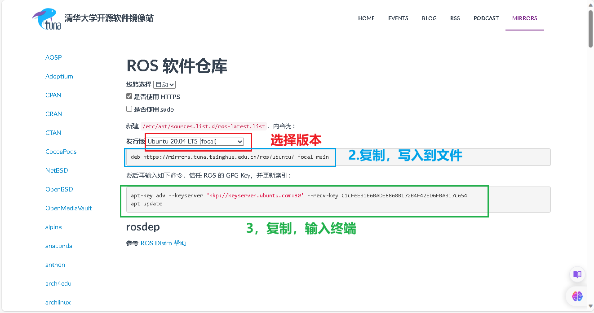

## 第〇章 ROS安装

### 1.自动安装ROS

普通安装方式十分繁琐，而且下载链接容易被墙，推荐用国内镜像源结合鱼香ros一键安装!

参考教程网站：<https://azitide.github.io/post/ubuntu_ROS.html>

网址

[清华开源镜像](https://mirrors.tuna.tsinghua.edu.cn/)

#### 一、配置软件源

1.首先我们要知道自己的电脑的cpu是什么架构的

**英特尔（intel）一般是x86架构，锐龙（amd）一般是arm架构**，当然英特尔也有amd架构，但在少部分，因为双方都有授权，所以各自都有对方架构的少部分芯片,还有一些小众的架构如PowerPC(ppc64el)、RISC-V(riscv64) 和 S390x 等架构，这些架构的设备用ubuntu-ports镜像的软件源即可

2.进去对应的架构的软件源

- [ubuntu | 镜像站使用帮助 | 清华大学开源软件镜像站 | x86](https://mirrors.tuna.tsinghua.edu.cn/help/ubuntu/)

    与

- [ubuntu-ports | 镜像站使用帮助 | 清华大学开源软件镜像站 | arm](https://mirror.tuna.tsinghua.edu.cn/help/ubuntu-ports/)

3.选择对应的版本

[](https://z1.ax1x.com/2023/10/12/piSM6RP.png)

设置好后，随即文本框中会生成你需要的 **sources.list** 文件内容，一会用到。

然后打开 Ubuntu 的终端，依次输入下面的命令

1、

```none
sudo apt update
```

2、

```none
cp /etc/apt/sources.list ~/Desktop
```

3、

```none
sudo gedit /etc/apt/sources.list
```

三条命令都输完后会打开一个文件内容，

把里面的全删掉，然后复制刚才网页生成的文本框内容粘贴上去，保存文件，退出

#### 二、安装ROS

###### 一键安装

这里我们用小鱼的大佬的鱼香ROS 一键安装

打开ubuntu终端，输入：

```none
wget http://fishros.com/install -O fishros && . fishros
```

然后我们输入 **1** 一键安装 –> 不更换源安装 –> 选择你ubuntu版本对应的ros版本 –> 桌面版–> 进行安装

[](https://z1.ax1x.com/2023/10/12/piSMZ80.png)

##### 报错：

如报错，先检查网络原因，如没有问题，先用命令行更换源

```none
wget http://fishros.com/install -O fishros && . fishros
```

然后我们输入 **5** –> 删掉第三方源并更换国内源 –> 添加ros/ros2源–> 完成，重新执行”一键安装“；

###### ros1启动命令

1，然后新建一个终端，打开输入

```none
roscore
```

终端完成后 会显示 \[/rosout\], 这样成功了一半

2，再新建第二个终端，输入

```none
rosrun turtlesim turtlesim_node
```

它会打开一个蓝色屏幕的小乌龟在中间，成功了

3，再建第三个终端，输入：

```none
rosrun turtlesim turtle_teleop_key
```

鼠标要在第三个终端，就可以通过按下键盘的 ↑ ↓ ← →键来对小海龟进行控制了。

安装完成

###### ros2开启命令

ros2没有中心节点，不需要roscore！

1，新建终端

```none
ros2 run turtlesim turtlesim_node
```

2，另外开一个终端

```none
ros2 run turtlesim turtle_teleop_key
```

安装完成

#### 三、配置rosdep

这里我们用小鱼的大佬的 一键配置

打开ubuntu终端，输入：

```none
wget http://fishros.com/install -O fishros && . fishros
```

再输入 **3** 就一键配置了

完成

#### 四、更新系统环境

这里我们还是用小鱼的大佬的 一键配置

打开ubuntu终端，输入：

```none
wget http://fishros.com/install -O fishros && . fishros
```

再输入 **4** 就一键配置了

完成

到这里，我们的ROS已经安装完成，加油！

### 2.手动安装ROS

参考网址：[ubuntu系统安装ROS（手动版） (azitide.github.io)](https://azitide.github.io/post/ubuntu_ROS_shoudong.html)

#### 1.确认自己的ubuntu系统然后去确认ROS版本

| **Ubuntu** | **ROS1**   | 开始 | 维护到期 |
| ---------- | ---------- | ---- | -------- |
| 14.04 LTS  | indigo     | 2014 | 2019     |
| 16.04 LTS  | Kinetic    | 2016 | 2021     |
| 18.04 LTS  | Melodic    | 2018 | 2023     |
| 20.04 LTS  | **Noetic** | 2020 | 2025     |

与

| **Ubuntu** | **ROS2**            | 开始 | 维护到期 |
| ---------- | ------------------- | ---- | -------- |
| 20.04 LTS  | Foxy Fitzroy        | 2020 | 2023     |
| 20.04 LTS  | Galactic Geochelone | 2021 | 2022     |

| 20.04 LTS  
22.04 LTS | **Humble Hawksbill  
(Recommended)** | 2022 | 2027 |
| 22.04 LTS | **Iron Irwini** | 2023 | 2024 |

#### 2、更换源

（1）进去源网站

- [ros | 镜像站使用帮助 | 清华大学开源软件镜像站](https://mirror.tuna.tsinghua.edu.cn/help/ros/)

    与

- [ros2 | 镜像站使用帮助 | 清华大学开源软件镜像站](https://mirror.tuna.tsinghua.edu.cn/help/ros2/)

[](https://s11.ax1x.com/2023/12/31/piOhzlQ.png)

（2）打开**ubuntu终端**，输入命令行打开文件

```none
sudo gedit /etc/apt/sources.list.d/ros-latest.list
```

打开文件后，复制第2步的网址进去（如文件内有其他网址，可以删掉，只留一条）

（3）文件保存退出后，新开一个终端，输入第3步的命令行（注意里面是两条命令行，要分开输入）

#### 3、安装ROS本体

格式是：

```none
sudo apt install ros-”ROS版本“-desktop-full
```

以20.04版本的ROS1为例：

```none
sudo apt install ros-noetic-desktop-full
```

以22.04版本的ROS2为例：

```none
sudo apt install ros-Humble-desktop-full
```

#### 4、更新rosdep

```none
sudo rosdep init
```

```none
rosdep update
```

#### 5、设置环境变量：

格式：

```none
echo "source 《你的ros系统文件setup.sh存放位置》" >> ~/.bashrc
```

以20.04版本的ROS1为例：

```none
echo "source /opt/ros/noetic/setup.bash" >> ~/.bashrc
```

```none
source ~/.bashrc
```

#### 6、验证

##### ros1启动命令

分别开**三个终端**依次输入

```none
roscore
```

```none
rosrun turtlesim turtlesim_node
```

```none
rosrun turtlesim turtle_teleop_key
```

鼠标要在第三个终端，就可以通过按下键盘的 ↑ ↓ ← →键来对小海龟进行控制了，动起来便是成功了

##### ros2启动命令

ros2没有中心节点，不需要roscore！

第一个终端

```none
ros2 run turtlesim turtlesim_node
```

第二个终端

```none
ros2 run turtlesim turtle_teleop_key
```

####### python

####### 添加中文报错

第二行加上		# coding:utf-8

####### 鼠标变为十字 无法点击

```shell
ps -e | grep import
kill -9 21526(import的进程)
```


## 第一章 ROS文件初始化

##### 命令窗口快捷键

```
Alt+Up                          //移动到上面的终端
Alt+Down                        //移动到下面的终端
Alt+Left                        //移动到左边的终端
Alt+Right                       //移动到右边的终端

Ctrl+Shift+X                    //最大化或恢复当前终端

Ctrl+Shift+W                    //关闭当前终端
Ctrl+Shift+Q                    //退出当前窗口，当前窗口的所有终端都将被关闭

Ctrl+Shift+O                    //水平分割终端
```

##### 报错解决

###### python添加中文报错

第二行加上		# coding:utf-8

###### 鼠标变为十字 无法点击

```
ps -e | grep import
kill -9 21526(import的进程)
```

##### HelloWorld

###### C++

```shell
#创建工作空间并初始化
mkdir -p 自定义空间名称/src
cd 自定义空间名称
catkin_make		#编译

#进入 src 创建 ros 包并添加依赖
cd src
catkin_create_pkg 自定义ROS包名 roscpp rospy std_msgs

#进入 ros 包的 src 目录编辑源文件
cd 自定义的包
gedit helloworld.cpp
```

```c++
#include "ros/ros.h"

int main(int argc, char *argv[])
{
    //执行 ros 节点初始化
    ros::init(argc,argv,"hello");
    //创建 ros 节点句柄(非必须)
    ros::NodeHandle n;
    //控制台输出 hello world
    ROS_INFO("hello world!");
    return 0;
}
```

```cmake
#编辑 ros 包下的 Cmakelist.txt文件
add_executable(步骤3的源文件名
  src/步骤3的源文件名.cpp
)
target_link_libraries(步骤3的源文件名
  ${catkin_LIBRARIES}
)
```

```shell
#进入工作空间目录并编译，窗口1
cd 自定义空间名称
catkin_make
```

```shell
#重新开一个窗口2，启动ros核心
roscore
```

```shell
#回到窗口1
cd 工作空间
source ./devel/setup.bash		#刷新路径，让系统知道ROS 工作空间位置、可执行文件和脚本。
rosrun 包名 C++节点		#运行

##命令行输出: HelloWorld!

##PS:进入家目录的隐藏文件：.bashrc文件
##末尾添加source ~/工作空间/devel/setup.bash，更加方便

##或者PS：进入工作空间：Ctrl+H创建.catkin_workspace文件
##末尾添加：source ./devel/setup.bash
```

###### python

```shell
cd ros包
mkdir scripts
cd scripts
gedit hello.py
```

```python
#! /usr/bin/env python		##解释器路径
# coding:utf-8						##防止中文注释报错
"""
    Python 版 HelloWorld
"""
import rospy					#输入包

if __name__ == "__main__":
    rospy.init_node("Hello")					#节点初始化
    rospy.loginfo("Hello World!!!!")		#日志输出
```

```shell
chmod +x 自定义文件名.py
```

```cmake
#编辑 ros 包下的 CamkeList.txt 文件
catkin_install_python(PROGRAMS scripts/自定义文件名.py
  DESTINATION ${CATKIN_PACKAGE_BIN_DESTINATION}
)
```

```shell
#进入工作空间目录并编译，窗口1
cd 自定义空间名称
catkin_make
```

```shell
#重新开一个窗口2，启动ros核心
roscore
```

```shell
#窗口1 
cd 工作空间
source ./devel/setup.bash
rosrun 包名 自定义文件名.py

##输出结果:Hello World!!!!
```

##### VScode

```shell
mkdir -p xxx_ws/src(必须得有 src)		#创建 ROS 工作空间
cd xxx_ws
catkin_make

cd xxx_ws		# 启动 vscode
code .
```

 ctrl + shift + B 调用编译，选择:	catkin_make:build	； 会自动添加c_cpp_properties.json，settings.json。

 ctrl + shift + B 调用编译，选择：catkin_make:build 右边的齿轮，添加配置文件

```json
{
// 有关 tasks.json 格式的文档，请参见
    // https://go.microsoft.com/fwlink/?LinkId=733558
    "version": "2.0.0",
    "tasks": [
        {
            "label": "catkin_make:debug", //代表提示的描述性信息
            "type": "shell",  //可以选择shell或者process,如果是shell代码是在shell里面运行一个命令，如果是process代表作为一个进程来运行
            "command": "catkin_make",//这个是我们需要运行的命令
            "args": [],//如果需要在命令后面加一些后缀，可以写在这里，比如-DCATKIN_WHITELIST_PACKAGES=“pac1;pac2”
            "group": {"kind":"build","isDefault":true},
            "presentation": {
                "reveal": "always"//可选always或者silence，代表是否输出信息
            },
            "problemMatcher": "$msCompile"
        }
    ]
}

```

**创建 ROS 功能包**

选定./命名空间/src ,右击 ---> create catkin package,设置包名helloworld      
添加依赖roscpp,rospy,std_msgs

**功能包的 src 下新建 cpp 文件**

```c++
/*
    控制台输出 HelloVSCode !!!
*/
#include "ros/ros.h"

int main(int argc, char *argv[])
{
    setlocale(LC_ALL,"");//解决输出中文乱码问题
    //执行节点初始化
    ros::init(argc,argv,"HelloVSCode");

    //输出日志
    ROS_INFO("Hello VSCode!!!哈哈哈哈哈哈哈哈哈哈");
    return 0;
}
```

**python 实现**

功能包 下新建 scripts 文件夹，添加 python 文件，**并添加可执行权限**

 **配置 CMakeLists.txt**

```cmake
##c++
add_executable(节点名称
  src/C++源文件名.cpp
)
target_link_libraries(节点名称
  ${catkin_LIBRARIES}
)
##python
catkin_install_python(PROGRAMS scripts/自定义文件名.py
  DESTINATION ${CATKIN_PACKAGE_BIN_DESTINATION}
)
```

**编译:** ctrl + shift + B

**执行**：启动内核，进入工作空间，刷新环境变量，运行

```shell
#窗口1
roscore

#窗口2
cd 工作空间
source ./devel/setup.bash
rosrun 包名 helloworld.py 或者 c++节点
```

##### launch文件

用于一次性启动多个 ROS 节点

1. 选定功能包右击 ---> 添加 launch 文件夹

2. 选定 launch 文件夹右击 ---> 添加 launch 文件

3. 编辑 launch 文件内容

    ```shell
    <launch>
        <node pkg="helloworld" type="demo_hello" name="hello" output="screen" />
        <node pkg="turtlesim" type="turtlesim_node" name="t1"/>
        <node pkg="turtlesim" type="turtle_teleop_key" name="key1" />
    </launch>
    ```

    - node ---> 包含的某个节点
    - pkg -----> 功能包
    - type ----> 被运行的节点文件
    - name --> 为节点命名
    - output-> 设置日志的输出目标

    ```shell
    roslaunch 包名 launch文件名
    #运行 launch 文件
    #运行结果: 一次性启动了多个节点
    ```
  ##### 计算图

用于展示节点之间的关系

```shell
rqt_graph	#新终端输入
```


​    
