## 第〇章 ROS安装

### 1.自动安装ROS

普通安装方式十分繁琐，而且下载链接容易被墙，推荐用国内镜像源结合鱼香ros一键安装!

参考教程网站：<https://azitide.github.io/post/ubuntu_ROS.html>

网址

[清华开源镜像](https://mirrors.tuna.tsinghua.edu.cn/)

#### 一、配置软件源

1.首先我们要知道自己的电脑的cpu是什么架构的

**英特尔（intel）一般是x86架构，锐龙（amd）一般是arm架构**，当然英特尔也有amd架构，但在少部分，因为双方都有授权，所以各自都有对方架构的少部分芯片,还有一些小众的架构如PowerPC(ppc64el)、RISC-V(riscv64) 和 S390x 等架构，这些架构的设备用ubuntu-ports镜像的软件源即可

2.进去对应的架构的软件源

- [ubuntu | 镜像站使用帮助 | 清华大学开源软件镜像站 | x86](https://mirrors.tuna.tsinghua.edu.cn/help/ubuntu/)

    与

- [ubuntu-ports | 镜像站使用帮助 | 清华大学开源软件镜像站 | arm](https://mirror.tuna.tsinghua.edu.cn/help/ubuntu-ports/)

3.选择对应的版本

[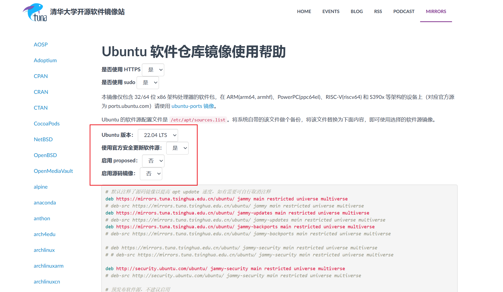](https://z1.ax1x.com/2023/10/12/piSM6RP.png)

设置好后，随即文本框中会生成你需要的 **sources.list** 文件内容，一会用到。

然后打开 Ubuntu 的终端，依次输入下面的命令

1、

```none
sudo apt update
```

2、

```none
cp /etc/apt/sources.list ~/Desktop
```

3、

```none
sudo gedit /etc/apt/sources.list
```

三条命令都输完后会打开一个文件内容，

把里面的全删掉，然后复制刚才网页生成的文本框内容粘贴上去，保存文件，退出

#### 二、安装ROS

###### 一键安装

这里我们用小鱼的大佬的鱼香ROS 一键安装

打开ubuntu终端，输入：

```none
wget http://fishros.com/install -O fishros && . fishros
```

然后我们输入 **1** 一键安装 –> 不更换源安装 –> 选择你ubuntu版本对应的ros版本 –> 桌面版–> 进行安装

[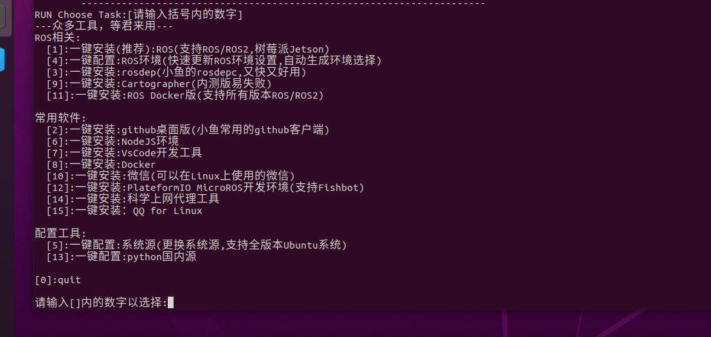](https://z1.ax1x.com/2023/10/12/piSMZ80.png)

##### 报错：

如报错，先检查网络原因，如没有问题，先用命令行更换源

```none
wget http://fishros.com/install -O fishros && . fishros
```

然后我们输入 **5** –> 删掉第三方源并更换国内源 –> 添加ros/ros2源–> 完成，重新执行”一键安装“；

###### ros1启动命令

1，然后新建一个终端，打开输入

```none
roscore
```

终端完成后 会显示 \[/rosout\], 这样成功了一半

2，再新建第二个终端，输入

```none
rosrun turtlesim turtlesim_node
```

它会打开一个蓝色屏幕的小乌龟在中间，成功了

3，再建第三个终端，输入：

```none
rosrun turtlesim turtle_teleop_key
```

鼠标要在第三个终端，就可以通过按下键盘的 ↑ ↓ ← →键来对小海龟进行控制了。

安装完成

###### ros2开启命令

ros2没有中心节点，不需要roscore！

1，新建终端

```none
ros2 run turtlesim turtlesim_node
```

2，另外开一个终端

```none
ros2 run turtlesim turtle_teleop_key
```

安装完成

#### 三、配置rosdep

这里我们用小鱼的大佬的 一键配置

打开ubuntu终端，输入：

```none
wget http://fishros.com/install -O fishros && . fishros
```

再输入 **3** 就一键配置了

完成

#### 四、更新系统环境

这里我们还是用小鱼的大佬的 一键配置

打开ubuntu终端，输入：

```none
wget http://fishros.com/install -O fishros && . fishros
```

再输入 **4** 就一键配置了

完成

到这里，我们的ROS已经安装完成，加油！

### 2.手动安装ROS

参考网址：[ubuntu系统安装ROS（手动版） (azitide.github.io)](https://azitide.github.io/post/ubuntu_ROS_shoudong.html)

#### 1.确认自己的ubuntu系统然后去确认ROS版本

| **Ubuntu** | **ROS1**   | 开始 | 维护到期 |
| ---------- | ---------- | ---- | -------- |
| 14.04 LTS  | indigo     | 2014 | 2019     |
| 16.04 LTS  | Kinetic    | 2016 | 2021     |
| 18.04 LTS  | Melodic    | 2018 | 2023     |
| 20.04 LTS  | **Noetic** | 2020 | 2025     |

与

| **Ubuntu** | **ROS2**            | 开始 | 维护到期 |
| ---------- | ------------------- | ---- | -------- |
| 20.04 LTS  | Foxy Fitzroy        | 2020 | 2023     |
| 20.04 LTS  | Galactic Geochelone | 2021 | 2022     |

| 20.04 LTS  
22.04 LTS | **Humble Hawksbill  
(Recommended)** | 2022 | 2027 |
| 22.04 LTS | **Iron Irwini** | 2023 | 2024 |

#### 2、更换源

（1）进去源网站

- [ros | 镜像站使用帮助 | 清华大学开源软件镜像站](https://mirror.tuna.tsinghua.edu.cn/help/ros/)

    与

- [ros2 | 镜像站使用帮助 | 清华大学开源软件镜像站](https://mirror.tuna.tsinghua.edu.cn/help/ros2/)

[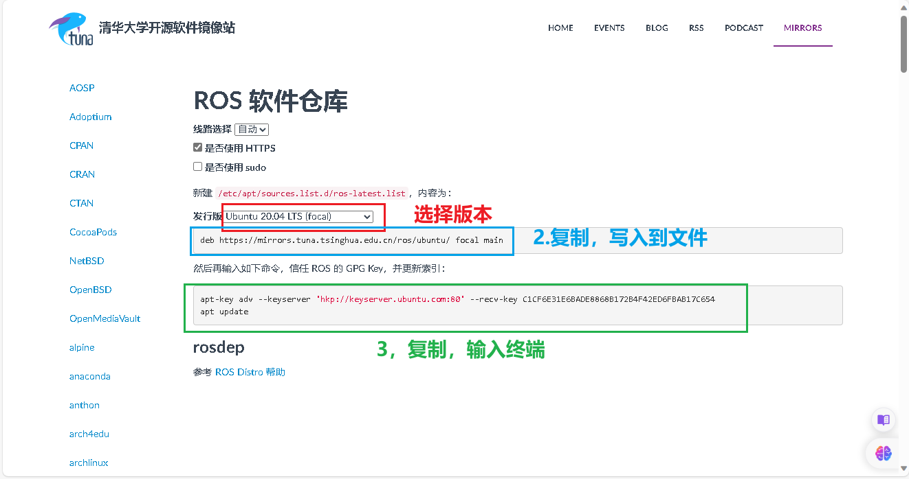](https://s11.ax1x.com/2023/12/31/piOhzlQ.png)

（2）打开**ubuntu终端**，输入命令行打开文件

```none
sudo gedit /etc/apt/sources.list.d/ros-latest.list
```

打开文件后，复制第2步的网址进去（如文件内有其他网址，可以删掉，只留一条）

（3）文件保存退出后，新开一个终端，输入第3步的命令行（注意里面是两条命令行，要分开输入）

#### 3、安装ROS本体

格式是：

```none
sudo apt install ros-”ROS版本“-desktop-full
```

以20.04版本的ROS1为例：

```none
sudo apt install ros-noetic-desktop-full
```

以22.04版本的ROS2为例：

```none
sudo apt install ros-Humble-desktop-full
```

#### 4、更新rosdep

```none
sudo rosdep init
```

```none
rosdep update
```

#### 5、设置环境变量：

格式：

```none
echo "source 《你的ros系统文件setup.sh存放位置》" >> ~/.bashrc
```

以20.04版本的ROS1为例：

```none
echo "source /opt/ros/noetic/setup.bash" >> ~/.bashrc
```

```none
source ~/.bashrc
```

#### 6、验证

##### ros1启动命令

分别开**三个终端**依次输入

```none
roscore
```

```none
rosrun turtlesim turtlesim_node
```

```none
rosrun turtlesim turtle_teleop_key
```

鼠标要在第三个终端，就可以通过按下键盘的 ↑ ↓ ← →键来对小海龟进行控制了，动起来便是成功了

##### ros2启动命令

ros2没有中心节点，不需要roscore！

第一个终端

```none
ros2 run turtlesim turtlesim_node
```

第二个终端

```none
ros2 run turtlesim turtle_teleop_key
```

 **python添加中文报错**

第二行加上		# coding:utf-8

**鼠标变为十字 无法点击**

```shell
ps -e | grep import
kill -9 21526(import的进程)
```


## 第一章 文件初始化

### 终端快捷键

```
Alt+Up                          //移动到上面的终端
Alt+Down                        //移动到下面的终端
Alt+Left                        //移动到左边的终端
Alt+Right                       //移动到右边的终端

Ctrl+Shift+X                    //最大化或恢复当前终端

Ctrl+Shift+W                    //关闭当前终端
Ctrl+Shift+Q                    //退出当前窗口，当前窗口的所有终端都将被关闭

Ctrl+Shift+O                    //水平分割终端
```

**python添加中文报错：**		第二行加上		# coding:utf-8		

**鼠标变为十字 无法点击**

```
ps -e | grep import
kill -9 21526(import的进程)
```

### 终端写代码

###### C++

```shell
#创建工作空间并初始化
mkdir -p 自定义空间名称/src
cd 自定义空间名称
catkin_make		#编译

#进入 src 创建 ros 包并添加依赖
cd src
catkin_create_pkg 自定义ROS包名 roscpp rospy std_msgs

#进入 ros 包的 src 目录编辑源文件
cd 自定义的包
gedit helloworld.cpp
```

```c++
#include "ros/ros.h"

int main(int argc, char *argv[])
{
    //执行 ros 节点初始化
    ros::init(argc,argv,"hello");
    //创建 ros 节点句柄(非必须)
    ros::NodeHandle n;
    //控制台输出 hello world
    ROS_INFO("hello world!");
    return 0;
}
```

```cmake
#编辑 ros 包下的 Cmakelist.txt文件
add_executable(步骤3的源文件名
  src/步骤3的源文件名.cpp
)
target_link_libraries(步骤3的源文件名
  ${catkin_LIBRARIES}
)
```

```shell
#进入工作空间目录并编译，窗口1
cd 自定义空间名称
catkin_make
```

```shell
#重新开一个窗口2，启动ros核心
roscore
```

```shell
#回到窗口1
cd 工作空间
source ./devel/setup.bash		#刷新路径，让系统知道ROS 工作空间位置、可执行文件和脚本。
rosrun 包名 C++节点		#运行

##命令行输出: HelloWorld!

##PS:进入家目录的隐藏文件：.bashrc文件
##末尾添加source ~/工作空间/devel/setup.bash，更加方便
```

###### python

```shell
cd ros包
mkdir scripts
cd scripts
gedit hello.py
```

```python
#! /usr/bin/env python		##解释器路径
# coding:utf-8						##防止中文注释报错
"""
    Python 版 HelloWorld
"""
import rospy					#输入包

if __name__ == "__main__":
    rospy.init_node("Hello")					#节点初始化
    rospy.loginfo("Hello World!!!!")		#日志输出
```

```shell
chmod +x 自定义文件名.py
```

```cmake
#编辑 ros 包下的 CamkeList.txt 文件
catkin_install_python(PROGRAMS scripts/自定义文件名.py
  DESTINATION ${CATKIN_PACKAGE_BIN_DESTINATION}
)
```

```shell
#进入工作空间目录并编译，窗口1
cd 自定义空间名称
catkin_make
```

```shell
#重新开一个窗口2，启动ros核心
roscore
```

```shell
#窗口1 
cd 工作空间
source ./devel/setup.bash
rosrun 包名 自定义文件名.py

##输出结果:Hello World!!!!
```

### VScode写代码

```shell
mkdir -p xxx_ws/src(必须得有 src)		#创建 ROS 工作空间
cd xxx_ws
catkin_make

cd xxx_ws		# 启动 vscode
code .
```

 ctrl + shift + B 调用编译，选择:	catkin_make:build	； 会自动添加c_cpp_properties.json，settings.json。

 ctrl + shift + B 调用编译，选择：catkin_make:build 右边的齿轮，添加配置文件

tasks.json

```json
{
	// 有关 tasks.json 格式的文档，请参见
		// https://go.microsoft.com/fwlink/?LinkId=733558
		"version": "2.0.0",
		"tasks": [
			{
				"label": "catkin_make:debug", //代表提示的描述性信息
				"type": "shell",  //可以选择shell或者process,如果是shell代码是在shell里面运行一个命令，如果是process代表作为一个进程来运行
				"command": "catkin_make",//这个是我们需要运行的命令
				"args": [],//如果需要在命令后面加一些后缀，可以写在这里，比如-DCATKIN_WHITELIST_PACKAGES=“pac1;pac2”
				"group": {"kind":"build","isDefault":true},
				"presentation": {
					"reveal": "always"//可选always或者silence，代表是否输出信息
				},
				"problemMatcher": "$msCompile"}
		]
}
	
```

c_cpp_properties.json

```json
{
  "configurations": [
    {
      "browse": {
        "databaseFilename": "${default}",
        "limitSymbolsToIncludedHeaders": false
      },
      "includePath": [
        "/opt/ros/noetic/include/**",
        "/usr/include/**",
        "/home/ubuntu2004/module_ws/src/tf01_static/include/**"
      ],
      "name": "ROS",
      "intelliSenseMode": "gcc-x64",
      "compilerPath": "/usr/bin/gcc",
      "cStandard": "gnu17",
      "cppStandard": "c++17"
    }
  ],
  "version": 4
}
```

settings.json

```json
{
    "python.autoComplete.extraPaths": [
        "/home/ubuntu2004/module_ws/devel/lib/python3/dist-packages",
        "/opt/ros/noetic/lib/python3/dist-packages"
    ],
    "python.analysis.extraPaths": [
        "/home/ubuntu2004/module_ws/devel/lib/python3/dist-packages",
        "/opt/ros/noetic/lib/python3/dist-packages"
    ],
    "cmake.sourceDirectory": "/home/ubuntu2004/module_ws/src/tf01_static",
}
```


##### 代码无提示问题

在编写代码的时候，不提示代码容易出现写错以及费时的问题。

可以在创建的目录中打开c\_cpp\_properties.json文件。


打开后在[配置文件](https://so.csdn.net/so/search?q=%E9%85%8D%E7%BD%AE%E6%96%87%E4%BB%B6&spm=1001.2101.3001.7020)中修改内容。

16行，17行的数字要保持一致。


就可以提示代码了。

在使用自定义msg进行话题通信时，如果没有在.vscode下的setting.json文件中配置我们定义的文件的目录，也不会有补齐代码的功能。

即需要在.vscode下的setting.json文件中配置，devel下的lib下的，python3/dist-packages  


##### ROS_INFO文本高亮报错

在c_cpp_properties.json文件中将
      "cStandard": "gnu11",
      "cppStandard": "c++11"

C插件的版本调整至1.20.5

重启虚拟机，方可解决


**创建 ROS 功能包**

选定./命名空间/src ,右击 ---> create catkin package,设置包名helloworld
添加依赖roscpp,rospy,std_msgs

**功能包的 src 下新建 cpp 文件**

```c++
/*
    控制台输出 HelloVSCode !!!
*/
#include "ros/ros.h"

int main(int argc, char *argv[])
{
    setlocale(LC_ALL,"");//解决输出中文乱码问题
    //执行节点初始化
    ros::init(argc,argv,"HelloVSCode");

    //输出日志
    ROS_INFO("Hello VSCode!!!哈哈哈哈哈哈哈哈哈哈");
    return 0;
}
```

**python 实现**

功能包 下新建 scripts 文件夹，添加 python 文件，**并添加可执行权限**

 **配置 CMakeLists.txt**

```cmake
##c++
add_executable(节点名称
  src/C++源文件名.cpp
)
target_link_libraries(节点名称
  ${catkin_LIBRARIES}
)
##python
catkin_install_python(PROGRAMS scripts/自定义文件名.py
  DESTINATION ${CATKIN_PACKAGE_BIN_DESTINATION}
)
```

**编译:** ctrl + shift + B

**执行**：启动内核，进入工作空间，刷新环境变量，运行

```shell
#窗口1
roscore

#窗口2
cd 工作空间
source ./devel/setup.bash
rosrun 包名 helloworld.py 或者 c++节点
```

### launch文件和计算图

用于一次性启动多个 ROS 节点

1. 选定功能包右击 ---> 添加文件夹，命名为 launch 

2. 选定 launch 文件夹右击 ---> 添加文件，命名为xxx.launch 

3. 编辑 xxx.launch 文件内容

    ```shell
    <launch>
        <node pkg="helloworld" type="demo_hello" name="hello" output="screen" />
        <node pkg="turtlesim" type="turtlesim_node" name="t1"/>
        <node pkg="turtlesim" type="turtle_teleop_key" name="key1" />
    </launch>
    ```

    - node ---> 包含的某个节点
    - pkg -----> 功能包
    - type ----> 被运行的节点文件
    - name --> 为节点命名，自定义
    - output-> 设置日志的输出目标

    终端运行
    
    ```shell
    roslaunch 包名 launch文件名
    #运行 launch 文件
    #运行结果: 一次性启动了多个节点
    ```

**计算图**

用于展示节点之间的关系

```shell
rqt_graph	#新终端输入
```

##     第二章 通信机制

### 2.0概述

ROS 中的基本通信机制主要有如下三种实现策略:

- 话题通信(发布订阅模式)，类似关注B站UP主，当他发视频时，我可以自动接收
- 服务通信(请求响应模式)，类似点击视频观看，只有点击才能观看
- 参数服务器(参数共享模式)，类似在线腾讯文档，多人填写查看信息

### 2.1话题通信

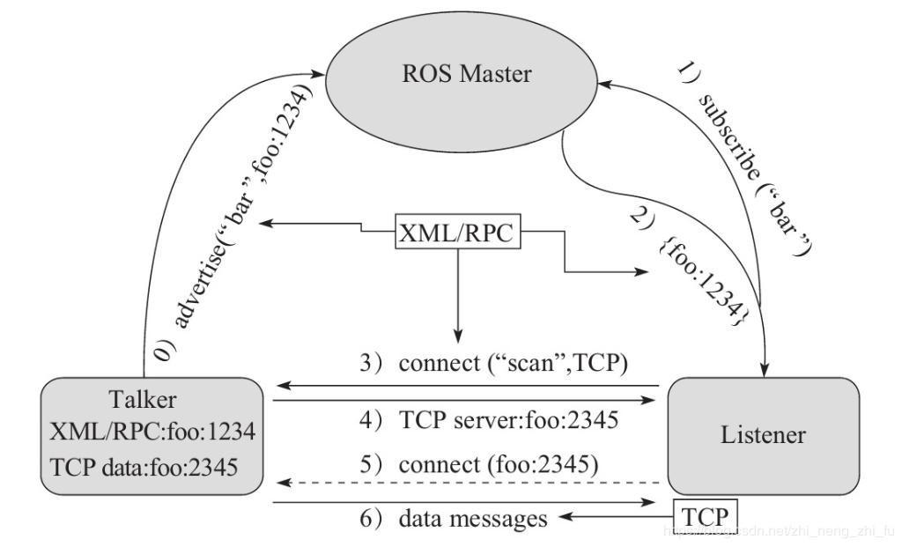

#### C++

**需求:**

> 编写发布订阅实现，要求发布方以1HZ(每秒1次)的频率发布文本消息，订阅方订阅消息并将消息内容打印输出。

**分析:**

在模型实现中，ROS master 不需要实现，而连接的建立也已经被封装了，需要关注的关键点有三个:

1. 发布方

   

2. 接收方

3. 数据(此处为普通文本)

**流程:**

1. 编写发布方实现；
2. 编写订阅方实现；
3. 编辑配置文件；
4. 编译并执行。

```shell
mkdir -p ws/src		#创建 ROS 工作空间
cd ws
catkin_make	#编译，初始化ROS空间

#进入家目录的隐藏文件：.bashrc		末尾添加:
source ~/工作空间/devel/setup.bash

cd ws		# 启动 vscode
code .
```

 ctrl + shift + B 调用编译，选择：catkin_make:build 右边的齿轮，添加配置文件

```json
{
// 有关 tasks.json 格式的文档，请参见
    // https://go.microsoft.com/fwlink/?LinkId=733558
    "version": "2.0.0",
    "tasks": [
        {
            "label": "catkin_make:debug", //代表提示的描述性信息
            "type": "shell",  //可以选择shell或者process,如果是shell代码是在shell里面运行一个命令，如果是process代表作为一个进程来运行
            "command": "catkin_make",//这个是我们需要运行的命令
            "args": [],//如果需要在命令后面加一些后缀，可以写在这里，比如-DCATKIN_WHITELIST_PACKAGES=“pac1;pac2”
            "group": {"kind":"build","isDefault":true},
            "presentation": {
                "reveal": "always"//可选always或者silence，代表是否输出信息
            },
            "problemMatcher": "$msCompile"
        }
    ]
}
```

右击vscode中src文件夹-->creat catkin package

```shell
demo01 #添加包名
roscpp rospy std_msgs	#添加依赖
```

在demo01下的src中，新建pub.cpp，即发布方

```cpp
/*
    需求: 实现基本的话题通信，一方发布数据，一方接收数据，
         实现的关键点:
         1.发送方
         2.接收方
         3.数据(此处为普通文本)

         PS: 二者需要设置相同的话题

    消息发布方:
        循环发布信息:HelloWorld 后缀数字编号

    实现流程:
        1.包含头文件 
        2.初始化 ROS 节点:命名(唯一)
        3.实例化 ROS 句柄
        4.实例化 发布者 对象
        5.组织被发布的数据，并编写逻辑发布数据
*/
// 1.包含头文件 
#include "ros/ros.h"
#include "std_msgs/String.h" //普通文本类型的消息
#include <sstream>//拼接字符串

int main(int argc, char  *argv[])
{   
    //设置编码，防止中文乱码
    setlocale(LC_ALL,"");

    //2.初始化 ROS 节点:命名(唯一)
    // 参数1和参数2 后期为节点传值会使用
    // 参数3 是节点名称，是一个标识符，需要保证运行后，在 ROS 网络拓扑中唯一
    ros::init(argc,argv,"talker");
    //3.实例化 ROS 句柄
    ros::NodeHandle nh;//该类封装了 ROS 中的一些常用功能

    //4.实例化 发布者 对象
    //泛型: 发布的消息类型，字符串
    //参数1: 要发布到的话题
    //参数2: 队列中最大保存的消息数，超出此阀值时，先进的先销毁(时间早的先销毁)
    ros::Publisher pub = nh.advertise<std_msgs::String>("chatter",10);

    //5.组织被发布的数据，并编写逻辑发布数据
    //数据(动态组织)
    std_msgs::String msg;
    // msg.data = "你好啊！！！";
    std::string msg_front = "Hello 你好！"; //消息前缀
    int count = 0; //消息计数器

    ros::Rate r(1);    //逻辑(一秒1次)
    ros::Duration(3.0).sleep(); //延迟3秒发送，用于和管理者通信，避免接收者错过第一条数据

    //节点不死
    while (ros::ok())
    {
        //使用 stringstream 拼接字符串与编号
        std::stringstream ss;
        ss << msg_front << count;
        msg.data = ss.str();
        //发布消息
        pub.publish(msg);
        //加入调试，打印发送的消息
        ROS_INFO("发送的消息:%s",msg.data.c_str());

        //根据前面制定的发送频率自动休眠 休眠时间 = 1/频率；
        r.sleep();
        count++;//循环结束前，让 count 自增
        //回调函数，目前暂无应用
        ros::spinOnce();
    }
    return 0;
}
```

在demo01下的src中，新建sub.cpp，即订阅方

```cpp
/*
    需求: 实现基本的话题通信，一方发布数据，一方接收数据，
         实现的关键点:
         1.发送方
         2.接收方
         3.数据(此处为普通文本)

    消息订阅方:
        订阅话题并打印接收到的消息

    实现流程:
        1.包含头文件 
        2.初始化 ROS 节点:命名(唯一)
        3.实例化 ROS 句柄
        4.实例化 订阅者 对象
        5.处理订阅的消息(回调函数)
        6.设置循环调用回调函数
*/
// 1.包含头文件 
#include "ros/ros.h"
#include "std_msgs/String.h"

void doMsg(const std_msgs::String::ConstPtr& msg_p){//引用形式，传入消息指针
    ROS_INFO("我听见:%s",msg_p->data.c_str());//打印消息
    // ROS_INFO("我听见:%s",(*msg_p).data.c_str());
}

int main(int argc, char  *argv[])
{
    setlocale(LC_ALL,"");
    //2.初始化 ROS 节点:命名(唯一)
    ros::init(argc,argv,"listener");
    //3.实例化 ROS 句柄
    ros::NodeHandle nh;
    //4.实例化 订阅者 对象
    ros::Subscriber sub = nh.subscribe<std_msgs::String>("chatter",10,doMsg);//尖括号可省略
    //5.处理订阅的消息(回调函数)

    //6.设置循环调用回调函数
    ros::spin();//循环读取接收的数据，并调用回调函数doMsg处理
    return 0;
}
```

配置 demo01/CMakeLists.txt

```cmake
add_executable(pub		#136行
  src/pub.cpp
)
add_executable(sub
  src/sub.cpp
)

target_link_libraries(pub		#150行
  ${catkin_LIBRARIES}
)
target_link_libraries(sub
  ${catkin_LIBRARIES}
)
```

ctrl shift + B编译；ctrl alt + T新建终端

```shell
roscore	#启动核心
```

分割终端，运行发布者节点

```shell
cd ws
rosrun demo01 pub	#rosrun 包名	节点名
```

再次分割终端，运行订阅者节点

```shell
rosrun demo01 sub
```

打印话题小工具

```shell
rostopic echo chatter	#rostopic echo 话题
```

查看计算图

```shell
rqt_graph 		#新终端输入
```

#### Python

**流程:**

1. 编写发布方实现；
2. 编写订阅方实现；
3. 为python文件添加可执行权限；
4. 编辑配置文件；
5. 编译并执行。

在ws/demo01下新建文件夹scripts，其下新建pub.py，发布方程序

```python
#! /usr/bin/env python
# -*- coding: utf-8 -*-		
# 指定编码格式为utf-8
"""
    需求: 实现基本的话题通信，一方发布数据，一方接收数据，
         实现的关键点:
         1.发送方
         2.接收方
         3.数据(此处为普通文本)

         PS: 二者需要设置相同的话题

    消息发布方:
        循环发布信息:HelloWorld 后缀数字编号

    实现流程:
        1.导包 
        2.初始化 ROS 节点:命名(唯一)
        3.实例化 发布者 对象
        4.组织被发布的数据，并编写逻辑发布数据
"""
#1.导包 
import rospy
from std_msgs.msg import String

if __name__ == "__main__":
    #2.初始化 ROS 节点:命名(唯一)
    rospy.init_node("talker_p")
    #3.实例化 发布者 对象
    pub = rospy.Publisher("chatter_p",String,queue_size=10)
    #4.组织被发布的数据，并编写逻辑发布数据
    msg = String()  #创建 msg 对象
    msg_front = "hello 你好"
    count = 0  #计数器 
    # 设置循环频率
    rate = rospy.Rate(1)
    rospy.sleep(3)  #延迟3秒发送数据，防止订阅方接收不到
    while not rospy.is_shutdown():

        #拼接字符串
        msg.data = msg_front + str(count)

        pub.publish(msg)
        rate.sleep()
        rospy.loginfo("写出的数据:%s",msg.data)
        count += 1
```

scripts下新建sub.py,订阅方脚本

```python
#! /usr/bin/env python
# -*- coding: utf-8 -*-
"""
    需求: 实现基本的话题通信，一方发布数据，一方接收数据，
         实现的关键点:
         1.发送方
         2.接收方
         3.数据(此处为普通文本)

    消息订阅方:
        订阅话题并打印接收到的消息

    实现流程:
        1.导包 
        2.初始化 ROS 节点:命名(唯一)
        3.实例化 订阅者 对象
        4.处理订阅的消息(回调函数)
        5.设置循环调用回调函数
"""
#1.导包 
import rospy
from std_msgs.msg import String

def doMsg(msg):
    rospy.loginfo("I heard:%s",msg.data)

if __name__ == "__main__":
    #2.初始化 ROS 节点:命名(唯一)
    rospy.init_node("listener_p")
    #3.实例化 订阅者 对象
    sub = rospy.Subscriber("chatter_p",String,doMsg,queue_size=10)
    #4.处理订阅的消息(回调函数)
    #5.设置循环调用回调函数
    rospy.spin()
```

终端下进入 scripts 执行:	

```shell
chmod +x *.py
```

配置CMakeLists.txt

```cmake
#165行
catkin_install_python(PROGRAMS
  scripts/pub.py
  scripts/sub.py
  DESTINATION ${CATKIN_PACKAGE_BIN_DESTINATION}
)
```

打开终端，执行节点

```
roscore
```

```shell
cd ws
rosrun demo01 pub.py
```

```shell
rosrun demo01 sub.py
```

**不同编译语言，交互通信**

话题名称改为相同就能实现

C++发布数据，pub.cpp

```cpp
 ros::Publisher pub = nh.advertise<std_msgs::String>("chatter",10);
//话题名称：chatter
```

python接收数据,sub.py

```python
sub = rospy.Subscriber("chatter",String,doMsg,queue_size=10)
#话题名称：chatter
```

ctrl shift + B 编译

打开终端，执行节点

```
roscore
```

```shell
cd ws
rosrun demo01 pub
```

```shell
rosrun demo01 sub.py
```

#### 自定义消息 数据类型 msg

即传输的一段消息可包含多种类似的数据，常用于储存激光雷达数据：长度和角度

- int8, int16, int32, int64 (或者无符号类型: uint*)
- float32, float64
- string
- time, duration
- other msg files
- variable-length array[] and fixed-length array[C]

ROS中还有一种特殊类型：`Header`，标头包含时间戳和ROS中常用的坐标帧信息。

**1 定义msg文件**

ws/src/demo01下新建文件夹msg，新建Person.msg

```msg
string name
uint16 age
float64 height
```

**2 编辑配置文件**

**demo01/package.xml**中添加编译依赖与执行依赖

```xml
  <build_depend>message_generation</build_depend>
  <exec_depend>message_runtime</exec_depend>
  <!-- 
  exce_depend 以前对应的是 run_depend 现在非法
  -->
```

**demo01/CMakeLists.txt**编辑 msg 相关配置

```cmake
# 编译时的依赖文件
find_package(catkin REQUIRED COMPONENTS
  roscpp
  rospy
  std_msgs
  message_generation
)

# 配置 msg 源文件
add_message_files(
  FILES
  Person.msg
)

# 生成消息时依赖于 std_msgs
generate_messages(
  DEPENDENCIES
  std_msgs
)

#执行时依赖
catkin_package(
#  INCLUDE_DIRS include
#  LIBRARIES demo02_talker_listener
  CATKIN_DEPENDS roscpp rospy std_msgs message_runtime
#  DEPENDS system_lib
)
```

**3 编译**

ctrl shift + B 后，出现

C++ 需要调用的中间文件(.../工作空间/devel/include/包名/xxx.h)

Python 需要调用的中间文件(.../工作空间/devel/lib/python3/dist-packages/包名/msg)

后续调用相关 msg 时，是从这些中间文件调用的

#### C++调用自定义msg

**vscode配置**

 ws/.vscode/c_cpp_properties.json 的 includepath属性，设置头文件路径

```json
{
  "configurations": [
    {
      "browse": {
        "databaseFilename": "${default}",
        "limitSymbolsToIncludedHeaders": false
      },
      "includePath": [
        "/opt/ros/melodic/include/**",
        "/usr/include/**",
        "/home/book/ws/devel/include/demo01/**"//设置头文件路径
      ],
      "name": "ROS",
      "intelliSenseMode": "gcc-x64",
      "compilerPath": "/usr/bin/gcc",
      "cStandard": "gnu11",
      "cppStandard": "c++14"
    }
  ],
  "version": 4
}
```

ws/src/demo01/src新建pub_person.cpp

```cpp
/*
    需求: 循环发布人的信息
*/

#include "ros/ros.h"
#include "demo01/Person.h"//可能会报错，但不用管

int main(int argc, char *argv[])
{
    setlocale(LC_ALL,"");

    //1.初始化 ROS 节点
    ros::init(argc,argv,"talker_person");

    //2.创建 ROS 句柄
    ros::NodeHandle nh;

    //3.创建发布者对象
    ros::Publisher pub = nh.advertise<demo01::Person>("chatter_person",1000);

    //4.组织被发布的消息，编写发布逻辑并发布消息
    demo01::Person p;
    p.name = "sunwukong";
    p.age = 2000;
    p.height = 1.45;

    ros::Rate r(1);
    while (ros::ok())
    {
        pub.publish(p);
        p.age += 1;
        ROS_INFO("我叫:%s,今年%d岁,高%.2f米", p.name.c_str(), p.age, p.height);

        r.sleep();
        ros::spinOnce();
    }

    return 0;
}
```

ws/src/demo01/src新建sub_person.cpp

```cpp
/*
    需求: 订阅人的信息
*/

#include "ros/ros.h"
#include "demo01/Person.h"//可能会报错，但不用管

void doPerson(const demo01::Person::ConstPtr& person_p){
    ROS_INFO("订阅的人信息:%s, %d, %.2f", person_p->name.c_str(), person_p->age, person_p->height);
}

int main(int argc, char *argv[])
{   
    setlocale(LC_ALL,"");

    //1.初始化 ROS 节点
    ros::init(argc,argv,"listener_person");
    //2.创建 ROS 句柄
    ros::NodeHandle nh;
    //3.创建订阅对象
    ros::Subscriber sub = nh.subscribe<demo01::Person>("chatter_person",10,doPerson);

    //4.回调函数中处理 person

    //5.ros::spin();
    ros::spin();    
    return 0;
}
```

配置CMakeLists.txt

```cmake
add_executable(pub_person src/pub_person.cpp)
add_executable(sub_person src/sub_person.cpp)

# 编译前，先编译msg文件，然后让源文件调用msg
add_dependencies(pub_person ${PROJECT_NAME}_generate_messages_cpp)
add_dependencies(sub_person ${PROJECT_NAME}_generate_messages_cpp)

target_link_libraries(pub_person
  ${catkin_LIBRARIES}
)
target_link_libraries(sub_person
  ${catkin_LIBRARIES}
)
```

编译，启动roscore，分别启动两个节点，可以用rostopic echo talker_person查看发布的消息,用rqt_graph查看节点关系

#### py调用自定义msg

vscode settings.json 配置

```json
{
    "python.autoComplete.extraPaths": [
        "/opt/ros/melodic/lib/python2.7/dist-packages",
        "/home/book/ws/devel/lib/python2.7/dist-packages"//包含自定义msg的包
    ],
    "python.analysis.extraPaths": [
        "/opt/ros/melodic/lib/python2.7/dist-packages"
    ]
}
```

发布方脚本：pub_person.py

```python
#! /usr/bin/env python
# -*- coding: utf-8 -*-
"""
    发布方:
        循环发送消息

"""
import rospy
from demo01.msg import Person


if __name__ == "__main__":
    #1.初始化 ROS 节点
    rospy.init_node("talker_person_p")
    #2.创建发布者对象
    pub = rospy.Publisher("chatter_person",Person,queue_size=10)
    #3.组织消息
    p = Person()
    p.name = "葫芦瓦"
    p.age = 18
    p.height = 0.75

    #4.编写消息发布逻辑
    rate = rospy.Rate(1)
    while not rospy.is_shutdown():
        pub.publish(p)  #发布消息
        rate.sleep()  #休眠
        rospy.loginfo("姓名:%s, 年龄:%d, 身高:%.2f",p.name, p.age, p.height)
```

订阅方脚本：sub_person.py

```python
#! /usr/bin/env python
# -*- coding: utf-8 -*-
"""
    订阅方:
        订阅消息

"""
import rospy
from demo01.msg import Person

def doPerson(p):
    rospy.loginfo("接收到的人的信息:%s, %d, %.2f",p.name, p.age, p.height)


if __name__ == "__main__":
    #1.初始化节点
    rospy.init_node("listener_person_p")
    #2.创建订阅者对象
    sub = rospy.Subscriber("chatter_person",Person,doPerson,queue_size=10)
    rospy.spin() #4.循环
```

scripts文件夹下打开终端，改权限

```shell
chmod +x *.py
```

配置 CMakeLists.txt

```
catkin_install_python(PROGRAMS
  scripts/pub_person.py
  scripts/sub_person.py
  DESTINATION ${CATKIN_PACKAGE_BIN_DESTINATION}
)
```

```shell
roscore	#启动核心
```

```shell
cd ws
rosrun demo01 pub_person.py		#进入工作空间，启动发布节点
```

```shell
rosrun demo01 sub_person.py		#订阅节点
```

```shell
rpt_graph												#关系图
```

### 2.2服务通信

概念：A节点向B节点发送请求，B节点回复响应

理论模型：B节点作为服务端，先向管理方注册话题和地址，当A节点向管理方注册话题后，管理方向A发送B的地址，然后A可以与B进行请求，后B响应

#### 自定义服务消息 数据类型 srv

**需求:**

> 服务通信中，客户端提交两个整数至服务端，服务端求和并响应结果到客户端，请创建服务器与客户端通信的数据载体。

右击ws/src，创建catkin包，包名：plumbing_server_client；依赖包：roscpp rospy stdmsgs

plumbing_server_client中，新建文件夹srv，用于放置服务通信自定义数据，新建AddInts.srv;请求和响应使用`---`分割

```shell
# 客户端请求时发送的两个数字
int32 num1
int32 num2
---
# 服务器响应发送的数据
int32 sum
```

**编辑配置文件**

package.xml

```xml
  <build_depend>message_generation</build_depend>
  <exec_depend>message_runtime</exec_depend>
  <!-- 
  exce_depend 以前对应的是 run_depend 现在非法
  -->
```

CMakeLists.txt

```cmake
find_package(catkin REQUIRED COMPONENTS
  roscpp
  rospy
  std_msgs
  message_generation	# 需要加入 message_generation,必须有 std_msgs
)

add_service_files(
  FILES
  AddInts.srv	#
)

generate_messages(
  DEPENDENCIES
  std_msgs	#
)

catkin_package(
 CATKIN_DEPENDS roscpp rospy std_msgs message_runtime	#
)

```

ctrl shift b编译；发现ws/devel/include/plumbing_server_client出现三个.h头文件，用于cpp程序

ws/devel/lib/plumbing_server_client/srv出现三个.py文件,用于python程序

#### C++	服务通信

**服务端节点**

.vscode/c_cpp_properties.json配置

```json
{
  "configurations": [
    {
      "browse": {
        "databaseFilename": "${default}",
        "limitSymbolsToIncludedHeaders": true
      },
      "includePath": [
        "/opt/ros/melodic/include/**",
        "/usr/include/**",
        "/home/book/ws/devel/include/**"	//加这里
      ],
      "name": "ROS",
      "intelliSenseMode": "gcc-x64",
      "compilerPath": "/usr/bin/gcc",
      "cStandard": "gnu11",
      "cppStandard": "c++14"
    }
  ],
  "version": 4
}
```

plumbing_server_client 功能包中src文件夹新建demo01_server.cpp

```cpp
/*
    需求: 
        编写两个节点实现服务通信，客户端节点需要提交两个整数到服务器
        服务器需要解析客户端提交的数据，相加后，将结果响应回客户端，
        客户端再解析

    服务器实现:
        1.包含头文件
        2.初始化 ROS 节点
        3.创建 ROS 句柄
        4.创建 服务 对象
        5.回调函数处理请求并产生响应
        6.由于请求有多个，需要调用 ros::spin()
*/
#include "ros/ros.h"
#include "plumbing_server_client/AddInts.h"

// bool 返回值由于标志是否处理成功
bool doReq(plumbing_server_client::AddInts::Request& req,
          plumbing_server_client::AddInts::Response& resp){
    int num1 = req.num1;
    int num2 = req.num2;

    ROS_INFO("服务器接收到的请求数据为:num1 = %d, num2 = %d",num1, num2);

    //逻辑处理
    if (num1 < 0 || num2 < 0)
    {
        ROS_ERROR("提交的数据异常:数据不可以为负数");
        return false;
    }

    //如果没有异常，那么相加并将结果赋值给 resp
    resp.sum = num1 + num2;
    return true;
}

int main(int argc, char *argv[])
{
    setlocale(LC_ALL,"");
    // 2.初始化 ROS 节点
    ros::init(argc,argv,"AddInts_Server");//节点名称
    // 3.创建 ROS 句柄
    ros::NodeHandle nh;
    // 4.创建 服务 对象
    ros::ServiceServer server = nh.advertiseService("AddInts",doReq);//话题名称，处理函数
    ROS_INFO("服务已经启动....");
    //     5.回调函数处理请求并产生响应
    //     6.由于请求有多个，需要调用 ros::spin()
    ros::spin();
    return 0;
}
```

配置CMakeLists.txt

```cmake
add_executable(demo01_server src/demo01_server.cpp)
add_dependencies(demo01_server ${PROJECT_NAME}_gencpp)
target_link_libraries(demo01_server
  ${catkin_LIBRARIES}
)
```

ctrl shift b 编译，打开终端

```
roscore
```

```shell
cd ws
source ./devel/setup.bash
rosrun plumbing_server_client demo01_server 

#[ INFO] [1724064193.753397254]: 服务已经启动....
```

```shell
rosservice call AddInts 	#按tab键
"num1: 1
num2: 5" 

#sum: 6

#[ INFO] [1724069676.954949735]: 服务器接收到的请求数据为:num1 = 1, num2 = 5
```

**客户端节点**

plumbing_server_client 功能包中src文件夹新建demo02_client.cpp

```cpp
/*
    需求: 
        编写两个节点实现服务通信，客户端节点需要提交两个整数到服务器
        服务器需要解析客户端提交的数据，相加后，将结果响应回客户端，
        客户端再解析

    服务器实现:
        1.包含头文件
        2.初始化 ROS 节点
        3.创建 ROS 句柄
        4.创建 客户端 对象
        5.请求服务，接收响应

    实现动态参数提交：
        1.格式：rosrun xxx xxx 12 34
        2.节点执行时，获取命令中的参数，并组织n进 request
        共传入3个参数，程序名 12 34；故argc = 3;*argv[1]=12，*argv[2]=34
       
    问题：
        如果先启动客户端，没启动服务端，会请求异常
    解决：
        在ros中内部设置相关函数，这些函数可以让客户端挂起，等待服务端启动
*/
// 1.包含头文件
#include "ros/ros.h"
#include "plumbing_server_client/AddInts.h"

int main(int argc, char *argv[])
{
    setlocale(LC_ALL,"");

    // 调用时动态传值
    if (argc != 3)
    {
        ROS_ERROR("请提交两个整数");
        return 1;//结束main函数
    }

    // 2.初始化 ROS 节点
    ros::init(argc,argv,"AddInts_Client");//客户端
    // 3.创建 ROS 句柄
    ros::NodeHandle nh;
    // 4.创建 客户端 对象
    ros::ServiceClient client = nh.serviceClient<plumbing_server_client::AddInts>("AddInts");
    //等待服务启动成功
    //这是一个阻塞式函数，只有服务启动成功后才会继续执行
    //方式1
    ros::service::waitForService("AddInts");
    //方式2
    // client.waitForExistence();
    // 5.组织请求数据
    //实例化AddInts类对象，里面封装了客户端的请求数据和服务端的响应数据
    plumbing_server_client::AddInts ai;
    ai.request.num1 = atoi(argv[1]);//将字符串地址转化为int型数据
    ai.request.num2 = atoi(argv[2]);
    // 6.发送请求,返回 bool 值，标记是否成功
    bool flag = client.call(ai);//ros自带函数
    // 7.处理响应
    if (flag)
    {
        ROS_INFO("请求正常处理,响应结果:%d",ai.response.sum);
    }
    else
    {
        ROS_ERROR("请求处理失败....");
        return 1;
    }

    return 0;
}
```

配置CMakeLists.txt

```cmake
 add_executable(demo02_client src/demo02_client.cpp)
 add_dependencies(demo02_client ${PROJECT_NAME}_gencpp)
 target_link_libraries(demo02_client  ${catkin_LIBRARIES})
```

编译后，启动终端

```shell
rosrun plumbing_server_client demo02_client
[ERROR] [1724074832.948562698]: 请提交两个整数

plumbing_server_client demo02_client 1 2
[ INFO] [1724074885.084971520]: 请求正常处理,响应结果:3
```

#### py	服务通信

**vscode/settings.json配置**

```json
{
    "python.autoComplete.extraPaths": [
        "/opt/ros/melodic/lib/python2.7/dist-packages",
        "/home/book/ws/devel/lib/python2.7/dist-packages"	//加这里
    ],
    "python.analysis.extraPaths": [
        "/opt/ros/melodic/lib/python2.7/dist-packages"
    ]
}
```

**服务端**

ws/src/plumbing_server_client下新建文件夹scripts，新建文件demo01_server_p.py

```python
#! /usr/bin/env python
#-*- coding: utf-8 -*-
"""
    需求: 
        编写两个节点实现服务通信，客户端节点需要提交两个整数到服务器
        服务器需要解析客户端提交的数据，相加后，将结果响应回客户端，
        客户端再解析

    服务器端实现:
        1.导包
        2.初始化 ROS 节点
        3.创建服务对象
        4.回调函数处理请求并产生响应
        5.spin 函数

"""
# 1.导包
import rospy
from plumbing_server_client.srv import AddInts,AddIntsRequest,AddIntsResponse
# 回调函数的参数是请求对象，返回值是响应对象
def doReq(req):
    # 解析提交的数据
    sum = req.num1 + req.num2
    rospy.loginfo("提交的数据:num1 = %d, num2 = %d, sum = %d",req.num1, req.num2, sum)

    # 创建响应对象，赋值并返回
    # resp = AddIntsResponse()
    # resp.sum = sum
    resp = AddIntsResponse(sum)
    return resp


if __name__ == "__main__":
    # 2.初始化 ROS 节点
    rospy.init_node("addints_server_p")
    # 3.创建服务对象
    server = rospy.Service("AddInts",AddInts,doReq)# 话题名称 消息数据类型 处理函数
    rospy.loginfo("服务器已启动！")
    # 4.回调函数处理请求并产生响应
    # 5.spin 函数
    rospy.spin()
```

右击ws/src/plumbing_server_client/scripts，在终端打开

```shell
chmod +x *.py
```

配置CMakeLists.txt

```cmake
catkin_install_python(PROGRAMS		#167行
  scripts/demo01_server_p.py
  DESTINATION ${CATKIN_PACKAGE_BIN_DESTINATION}
)
```

编译后，打开终端

```shell
roscore
```

```shell
cd ws
rosrun plumbing_server_client demo01_server_p.py

# [INFO] [1724125496.827225]: 服务器已启动！
# [INFO] [1724125593.831271]: 提交的数据:num1 = 10, num2 = 20, sum = 30
```

```shell
rosservice call AddInts  #空格 tab
"num1: 10
num2: 20" 
#sum: 30
```

**客户端**

ws/src/plumbing_server_client/scripts，新建文件demo02_client_p.py

```python
#! /usr/bin/env python
# -*- coding: utf-8 -*-
"""
    需求: 
        编写两个节点实现服务通信，客户端节点需要提交两个整数到服务器
        服务器需要解析客户端提交的数据，相加后，将结果响应回客户端，
        客户端再解析

    客户端实现:
        1.导包
        2.初始化 ROS 节点
        3.创建请求对象
        4.发送请求
        5.接收并处理响应

    优化:
        加入数据的动态获取
"""
#1.导包
import rospy
from plumbing_server_client.srv import *    #自定义数据类型
import sys  #用于接收终端数据

if __name__ == "__main__":

    #优化实现，动态读取
    if len(sys.argv) != 3:
        rospy.logerr("请正确提交参数")
        sys.exit(1)

    # 2.初始化 ROS 节点
    rospy.init_node("AddInts_Client_p")#节点名称
    # 3.创建请求对象
    client = rospy.ServiceProxy("AddInts",AddInts)#话题名称，消息类型
    # 请求前，等待服务已经就绪
    # 方式1:
    # rospy.wait_for_service("AddInts")
    # 方式2
    client.wait_for_service()
    # 4.发送请求,接收并处理响应
    # 方式1
    # resp = client(3,4)
    # 方式2
    # resp = client(AddIntsRequest(1,5))
    # 方式3
    req = AddIntsRequest()
    # req.num1 = 100
    # req.num2 = 200 

    #优化，终端动态读取
    req.num1 = int(sys.argv[1])
    req.num2 = int(sys.argv[2]) 

    resp = client.call(req)
    rospy.loginfo("响应结果:%d",resp.sum)
```

右击ws/src/plumbing_server_client/scripts，在终端打开

```shell
chmod +x *.py
```

配置CMakeLists.txt

```cmake
catkin_install_python(PROGRAMS		#167行
  scripts/demo01_server_p.py
  scripts/demo02_client_p.py
  DESTINATION ${CATKIN_PACKAGE_BIN_DESTINATION}
)
```

编译后，打开终端

```shell
roscore
```

```shell
cd ws
rosrun plumbing_server_client demo02_client_p.py 12 34
# 挂起，等待服务器启动
#服务器启动结果：
# [INFO] [1724139177.098779]: 响应结果:46
```

```shell
rosrun plumbing_server_client demo01_server_p.py
# [INFO] [1724139176.873222]: 服务器已启动！
# [INFO] [1724139177.097307]: 提交的数据:num1 = 12, num2 = 34, sum = 46
```

### 2.3参数服务器

作为一个数据容器，方便多个节点调用与存储数据；适用于存在数据共享的应用场景，如无人车的尺寸和转弯半径可放在参数服务器，给全局路径规划和局部路径规划节点使用。

设置者向管理者发送数据，管理者会将数据存入一个列表，调用者可以向管理者请求数据

参数可使用数据类型:

- 32-bit integers	4个字节的整形
- booleans               布尔
- strings                    字符串
- doubles                  浮点
- iso8601 dates       国际标准时间
- lists                            列表 
- base64-encoded binary data        64位编码二进制数据
- 字典    

> 注意:参数服务器不是为高性能而设计的，因此最好用于存储静态的、非二进制的、简单数据

#### C++参数服务器

##### 参数设置与修改

新建功能包：plumbing_param_server

plumbing_param_server/src中新建文件：demo01_param_set.cpp

```cpp
/*
    参数服务器操作之新增与修改(二者API一样)_C++实现:
    在 roscpp 中提供了两套 API 实现参数操作
    ros::NodeHandle
        setParam("键",值)
    ros::param
        set("键","值")

    示例:分别设置整形、浮点、字符串、bool、列表、字典等类型参数
        修改(相同的键，不同的值)
*/
#include "ros/ros.h"

int main(int argc, char *argv[])
{
    ros::init(argc,argv,"set_update_param");

    std::vector<std::string> stus;
    stus.push_back("zhangsan");
    stus.push_back("李四");
    stus.push_back("王五");
    stus.push_back("孙大脑袋");

    std::map<std::string,std::string> friends;
    friends["guo"] = "huang";
    friends["yuang"] = "xiao";

    //NodeHandle--------------------------------------------------------
    ros::NodeHandle nh;
    nh.setParam("nh_int",10); //整型
    nh.setParam("nh_double",3.14); //浮点型
    nh.setParam("nh_bool",true); //bool
    nh.setParam("nh_string","hello NodeHandle"); //字符串
    nh.setParam("nh_vector",stus); // vector
    nh.setParam("nh_map",friends); // map

    //修改演示(相同的键，不同的值)
    nh.setParam("nh_int",10000);

    //param--------------------------------------------------------
    ros::param::set("param_int",20);
    ros::param::set("param_double",3.14);
    ros::param::set("param_string","Hello Param");
    ros::param::set("param_bool",false);
    ros::param::set("param_vector",stus);
    ros::param::set("param_map",friends);

    //修改演示(相同的键，不同的值)
    ros::param::set("param_int",20000);

    return 0;
}
```

配置cmakelists

```cmake
add_executable(demo01_param_set src/demo01_param_set.cpp)

target_link_libraries(demo01_param_set
  ${catkin_LIBRARIES}
)
```

编译后，终端启动

```
roscore
```

```shell
cd ws
rosrun plumbing_param_server demo01_param_set
```

```shell
rosparam list
/nh_bool
/nh_double
/nh_int
/nh_map/guo
/nh_map/yuang
/nh_string
/nh_vector
/param_bool
/param_double
/param_int
/param_map/guo
/param_map/yuang
/param_string
/param_vector
/rosdistro
/roslaunch/uris/host_100ask__39713
/rosversion
/run_id

rosparam get /nh_int
10000
```

##### 参数查找

plumbing_param_server/src中新建文件：demo02_param_get.cpp

```cpp
/*
    参数服务器操作之查询_C++实现:
    在 roscpp 中提供了两套 API 实现参数操作
    ros::NodeHandle

        param(键,默认值) 
            存在，返回键对应的值，否则返回默认值

        getParam(键,存储结果的变量)
            存在,返回 true,且将值赋值给参数2
            若果键不存在，那么返回值为 false，且不为参数2赋值

        getParamCached键,存储结果的变量)--从缓存中提取，提高变量获取效率
            存在,返回 true,且将值赋值给参数2
            若果键不存在，那么返回值为 false，且不为参数2赋值

        getParamNames(std::vector<std::string>)
            获取所有的键,并存储在参数 vector 中 

        hasParam(键)
            是否包含某个键，存在返回 true，否则返回 false

        searchParam(参数1：被搜索的键，参数2：结果)
            搜索键，参数2存储搜索结果的变量，如果键存在则键名被存入参数2，否则参数2为空

    ros::param ----- 与 NodeHandle 类似
*/

#include "ros/ros.h"

int main(int argc, char *argv[])
{
    setlocale(LC_ALL,"");//防止中文乱码
    ros::init(argc,argv,"get_param");//初始化节点（节点名称）

    //NodeHandle--------------------------------------------------------
    
    ros::NodeHandle nh;
    
    // param 函数
    int res1 = nh.param("nh_int",100); // 键存在
    int res2 = nh.param("nh_int2",100); // 键不存在
    ROS_INFO("param获取结果:%d,%d",res1,res2);
    //param获取结果:10000,100


    // getParam 函数
    int nh_int_value;
    double nh_double_value;
    bool nh_bool_value;
    std::string nh_string_value;
    std::vector<std::string> stus;
    std::map<std::string, std::string> friends;

    nh.getParam("nh_int",nh_int_value);
    nh.getParam("nh_double",nh_double_value);
    nh.getParam("nh_bool",nh_bool_value);
    nh.getParam("nh_string",nh_string_value);
    nh.getParam("nh_vector",stus);
    nh.getParam("nh_map",friends);

    ROS_INFO("getParam获取的结果:%d,%.2f,%s,%d",
            nh_int_value,
            nh_double_value,
            nh_string_value.c_str(),
            nh_bool_value
            );//10000,3.14,hello NodeHandle,1
    for (auto &&stu : stus)//遍历stus，每次循环给stu赋值一次
    {
        ROS_INFO("stus 元素:%s",stu.c_str());//用c风格字符串形式输出        
    }
    /*
    [ INFO] [1724151841.944857405]: stus 元素:zhangsan
    [ INFO] [1724151841.944888085]: stus 元素:李四
    [ INFO] [1724151841.944892990]: stus 元素:王五
    [ INFO] [1724151841.944902557]: stus 元素:孙大脑袋
    */

    for (auto &&f : friends)
    {
        ROS_INFO("map 元素:%s = %s",f.first.c_str(), f.second.c_str());
    }
    /*
    [ INFO] [1724151841.944908374]: map 元素:guo = huang
    [ INFO] [1724151841.944913013]: map 元素:yuang = xiao
    */

    // getParamCached()
    nh.getParamCached("nh_int",nh_int_value);
    ROS_INFO("通过缓存获取数据:%d",nh_int_value);
    //通过缓存获取数据:10000

    //getParamNames()
    std::vector<std::string> param_names1;
    nh.getParamNames(param_names1);//将参数服务器中的键名存入param_names1
    for (auto &&name : param_names1)
    {
        ROS_INFO("名称解析name = %s",name.c_str());        
    }
    /*
    [ INFO] [1724151841.946669765]: 名称解析name = /param_double
    [ INFO] [1724151841.946717951]: 名称解析name = /param_int
    [ INFO] [1724151841.946790520]: 名称解析name = /rosversion
    [ INFO] [1724151841.946802605]: 名称解析name = /run_id
    [ INFO] [1724151841.946808835]: 名称解析name = /param_bool
    [ INFO] [1724151841.946815695]: 名称解析name = /nh_int
    [ INFO] [1724151841.946854004]: 名称解析name = /param_vector
    [ INFO] [1724151841.946895464]: 名称解析name = /nh_map/guo
    [ INFO] [1724151841.946919449]: 名称解析name = /nh_map/yuang
    [ INFO] [1724151841.946926770]: 名称解析name = /nh_vector
    [ INFO] [1724151841.946932185]: 名称解析name = /nh_bool
    [ INFO] [1724151841.946937718]: 名称解析name = /nh_string
    [ INFO] [1724151841.946979257]: 名称解析name = /param_map/guo
    [ INFO] [1724151841.947019639]: 名称解析name = /param_map/yuang
    [ INFO] [1724151841.947056720]: 名称解析name = /rosdistro
    [ INFO] [1724151841.947083354]: 名称解析name = /nh_double
    [ INFO] [1724151841.947089215]: 名称解析name = /param_string
    */
    ROS_INFO("----------------------------");

    //hasParam()，键名是否存在？
    ROS_INFO("存在 nh_int 吗? %d",nh.hasParam("nh_int"));
    ROS_INFO("存在 nh_intttt 吗? %d",nh.hasParam("nh_intttt"));
    // [ INFO] [1724151841.948633801]: 存在 nh_int 吗? 1
    // [ INFO] [1724151841.949115054]: 存在 nh_intttt 吗? 0

    //searchParam("键名",键的值)
    std::string key;
    nh.searchParam("nh_int",key);
    ROS_INFO("搜索键:%s",key.c_str());//搜索键:/nh_int
    
    //param--------------------------------------------------------
    /*
    ROS_INFO("++++++++++++++++++++++++++++++++++++++++");
    int res3 = ros::param::param("param_int",20); //存在
    int res4 = ros::param::param("param_int2",20); // 不存在返回默认
    ROS_INFO("param获取结果:%d,%d",res3,res4);

    // getParam 函数
    int param_int_value;
    double param_double_value;
    bool param_bool_value;
    std::string param_string_value;
    std::vector<std::string> param_stus;
    std::map<std::string, std::string> param_friends;

    ros::param::get("param_int",param_int_value);
    ros::param::get("param_double",param_double_value);
    ros::param::get("param_bool",param_bool_value);
    ros::param::get("param_string",param_string_value);
    ros::param::get("param_vector",param_stus);
    ros::param::get("param_map",param_friends);

    ROS_INFO("getParam获取的结果:%d,%.2f,%s,%d",
            param_int_value,
            param_double_value,
            param_string_value.c_str(),
            param_bool_value
            );
    for (auto &&stu : param_stus)
    {
        ROS_INFO("stus 元素:%s",stu.c_str());        
    }

    for (auto &&f : param_friends)
    {
        ROS_INFO("map 元素:%s = %s",f.first.c_str(), f.second.c_str());
    }

    // getParamCached()
    ros::param::getCached("param_int",param_int_value);
    ROS_INFO("通过缓存获取数据:%d",param_int_value);

    //getParamNames()
    std::vector<std::string> param_names2;
    ros::param::getParamNames(param_names2);
    for (auto &&name : param_names2)
    {
        ROS_INFO("名称解析name = %s",name.c_str());        
    }
    ROS_INFO("----------------------------");

    ROS_INFO("存在 param_int 吗? %d",ros::param::has("param_int"));
    ROS_INFO("存在 param_intttt 吗? %d",ros::param::has("param_intttt"));

    std::string key;
    ros::param::search("param_int",key);
    ROS_INFO("搜索键:%s",key.c_str());
    */

    return 0;
}
```

配置cmaklists.txt

```cmake
add_executable(demo02_param_get src/demo02_param_get.cpp)

target_link_libraries(demo02_param_get
  ${catkin_LIBRARIES}
)
```

编译后，终端运行

```shell
book@100ask:~/ws$ rosrun plumbing_param_server demo02_param_get
[ INFO] [1724151841.941386929]: param获取结果:10000,100
[ INFO] [1724151841.944803899]: getParam获取的结果:10000,3.14,hello NodeHandle,1
[ INFO] [1724151841.944857405]: stus 元素:zhangsan
[ INFO] [1724151841.944888085]: stus 元素:李四
[ INFO] [1724151841.944892990]: stus 元素:王五
[ INFO] [1724151841.944902557]: stus 元素:孙大脑袋
[ INFO] [1724151841.944908374]: map 元素:guo = huang
[ INFO] [1724151841.944913013]: map 元素:yuang = xiao
[ INFO] [1724151841.945862283]: 通过缓存获取数据:10000
[ INFO] [1724151841.946475397]: 名称解析name = /roslaunch/uris/host_100ask__39713
[ INFO] [1724151841.946669765]: 名称解析name = /param_double
[ INFO] [1724151841.946717951]: 名称解析name = /param_int
[ INFO] [1724151841.946790520]: 名称解析name = /rosversion
[ INFO] [1724151841.946802605]: 名称解析name = /run_id
[ INFO] [1724151841.946808835]: 名称解析name = /param_bool
[ INFO] [1724151841.946815695]: 名称解析name = /nh_int
[ INFO] [1724151841.946854004]: 名称解析name = /param_vector
[ INFO] [1724151841.946895464]: 名称解析name = /nh_map/guo
[ INFO] [1724151841.946919449]: 名称解析name = /nh_map/yuang
[ INFO] [1724151841.946926770]: 名称解析name = /nh_vector
[ INFO] [1724151841.946932185]: 名称解析name = /nh_bool
[ INFO] [1724151841.946937718]: 名称解析name = /nh_string
[ INFO] [1724151841.946979257]: 名称解析name = /param_map/guo
[ INFO] [1724151841.947019639]: 名称解析name = /param_map/yuang
[ INFO] [1724151841.947056720]: 名称解析name = /rosdistro
[ INFO] [1724151841.947083354]: 名称解析name = /nh_double
[ INFO] [1724151841.947089215]: 名称解析name = /param_string
[ INFO] [1724151841.947097993]: ----------------------------
[ INFO] [1724151841.948633801]: 存在 nh_int 吗? 1
[ INFO] [1724151841.949115054]: 存在 nh_intttt 吗? 0
[ INFO] [1724151841.949522085]: 搜索键:/nh_int
```

##### 参数删除

plumbing_param_server/src中新建文件：demo03_param_del.cpp

```cpp
/* 
    参数服务器操作之删除_C++实现:

    ros::NodeHandle
        deleteParam("键")
        根据键删除参数，删除成功，返回 true，否则(参数不存在)，返回 false

    ros::param
        del("键")
        根据键删除参数，删除成功，返回 true，否则(参数不存在)，返回 false
*/
#include "ros/ros.h"
int main(int argc, char *argv[])
{   
    setlocale(LC_ALL,"");
    ros::init(argc,argv,"delete_param");

    ros::NodeHandle nh;
    bool r1 = nh.deleteParam("nh_int");
    ROS_INFO("nh 删除结果:%d",r1);

    bool r2 = ros::param::del("param_int");
    ROS_INFO("param 删除结果:%d",r2);

    return 0;
}
```

配置cmaklists.txt

```
add_executable(demo03_param_del src/demo03_param_del.cpp)

target_link_libraries(demo03_param_del
  ${catkin_LIBRARIES}
)
```

编译后，终端运行

```shell
book@100ask:~/ws$ rosrun plumbing_param_server demo03_param_del
[ INFO] [1724154448.310369359]: nh 删除结果:1
[ INFO] [1724154448.311598449]: param 删除结果:1
```

查看服务器中参数

```shell
book@100ask:~/ws$ rosparam list
/nh_bool
/nh_double
/nh_map/guo
/nh_map/yuang
/nh_string
/nh_vector
/param_bool
/param_double
/param_map/guo
/param_map/yuang
/param_string
/param_vector
/rosdistro
/roslaunch/uris/host_100ask__39713
/rosversion
/run_id
# 发现   nh_int，param_int被删除了
```

#### PY参数服务器

##### 参数设置与修改

plumbing_param_server功能包下新建文件夹scripts,新建文件demo1_param_set_p.py

```python
#! /usr/bin/env python
# -*- coding: utf-8 -*-
"""
    参数服务器操作之新增与修改(二者API一样)_Python实现:
     rospy.set_param("p_int",10)
"""

import rospy

if __name__ == "__main__":
    rospy.init_node("set_update_paramter_p")

    # 设置各种类型参数
    rospy.set_param("p_int",10)
    rospy.set_param("p_double",3.14)
    rospy.set_param("p_bool",True)
    rospy.set_param("p_string","hello python")
    rospy.set_param("p_list",["hello","haha","xixi"])
    rospy.set_param("p_dict",{"name":"hulu","age":8})

    # 修改
    rospy.set_param("p_int",100)

```

右击scripts,终端打开

```
chmod +x *.py
```

配置cmakelists

```cmake
catkin_install_python(PROGRAMS
  scripts/demo01_param_set_p.py
  DESTINATION ${CATKIN_PACKAGE_BIN_DESTINATION}
)
```

编译后，终端运行

```shell
roscore
```

```
cd ws
rosrun plumbing_param_server demo01_param_set_p.py
```

```shell
book@100ask:~$ rosparam list
/p_bool
/p_dict/age
/p_dict/name
/p_double
/p_int
/p_list
/p_string
/rosdistro
/roslaunch/uris/host_100ask__44087
/rosversion
/run_id

book@100ask:~$ rosparam get p_bool
true
book@100ask:~$ rosparam get p_dict
{age: 8, name: hulu}

book@100ask:~$ rosparam get p_double
3.14
book@100ask:~$ rosparam get p_int
100
book@100ask:~$ rosparam get p_list
[hello, haha, xixi]

book@100ask:~$ rosparam get p_string
hello python
```

##### 参数查询

scripts新建文件demo02_param_get_p.py

```python
#! /usr/bin/env python
# -*- coding: utf-8 -*-
"""
    参数服务器操作之查询_Python实现:    
        rospy.get_param(键,默认值)
            当键存在时，返回对应的值，如果不存在返回默认值
        rospy.get_param_cached(键,默认值)
            速度更快，当键存在时，返回对应的值，如果不存在返回默认值
        rospy.get_param_names()
        rospy.has_param(待查询键名)
        rospy.search_param（待查询键名）
"""

import rospy

if __name__ == "__main__":
    rospy.init_node("get_param_p")

    #获取参数
    int_value = rospy.get_param("p_int",10000)
    double_value = rospy.get_param("p_double")
    bool_value = rospy.get_param("p_bool")
    string_value = rospy.get_param("p_string")
    p_list = rospy.get_param("p_list")
    p_dict = rospy.get_param("p_dict")

    rospy.loginfo("获取的数据:%d,%.2f,%d,%s",
                int_value,
                double_value,
                bool_value,
                string_value)
    #获取的数据:100,3.14,1,hello python

    for ele in p_list:
        rospy.loginfo("ele = %s", ele)
    # [INFO] [1724210194.246411]: ele = hello
    # [INFO] [1724210194.247279]: ele = haha
    # [INFO] [1724210194.248085]: ele = xixi

    rospy.loginfo("name = %s, age = %d",p_dict["name"],p_dict["age"])
    # name = hulu, age = 8

    # get_param_cached
    int_cached = rospy.get_param_cached("p_int")
    rospy.loginfo("缓存数据:%d",int_cached)
    # 缓存数据:100

    # get_param_names
    names = rospy.get_param_names()
    for name in names:
        rospy.loginfo("name = %s",name)
    # [INFO] [1724210194.254186]: name = /p_string
    # [INFO] [1724210194.255053]: name = /p_dict/age
    # [INFO] [1724210194.256032]: name = /p_dict/name
    # [INFO] [1724210194.257405]: name = /p_bool
    # [INFO] [1724210194.259344]: name = /p_double
    # [INFO] [1724210194.261331]: name = /p_list
    # [INFO] [1724210194.262646]: name = /p_int

    rospy.loginfo("-"*80)

    # has_param
    flag = rospy.has_param("p_int")
    rospy.loginfo("包含p_int吗？%d",flag)
    # 包含p_int吗？1

    # search_param
    key = rospy.search_param("p_int")
    rospy.loginfo("搜索的键 = %s",key)
    #搜索的键 = /p_int
```

右击scripts,终端打开

```shell
chmod +x *.py
```

cmakelists

```cmake
catkin_install_python(PROGRAMS
  scripts/demo01_param_set_p.py
  scripts/demo02_param_get_p.py
  DESTINATION ${CATKIN_PACKAGE_BIN_DESTINATION}
)
```

终端运行

```shell
rosrun plumbing_param_server demo02_param_get_p.py
```

##### 参数删除

scripts新建demo03_param_del_p.py

```python
#! /usr/bin/env python
# -*- coding: utf-8 -*-
"""
    参数服务器操作之删除_Python实现:
    rospy.delete_param("键")
    键存在时，可以删除成功，键不存在时，会抛出异常
"""
import rospy

if __name__ == "__main__":
    rospy.init_node("delete_param_p")

    try:
        rospy.delete_param("p_int")
    except Exception as e:  #将异常赋值给e
        rospy.loginfo("删除失败")
```

添加权限，修改cmakelists，打开终端执行

```shell
rosparam list
#p_int 参数存在
```

```shell
rosrun plumbing_param_server demo03_param_del_p.py
```

```shell
rosparam list
#p_int 参数消失
```

```shell
rosrun plumbing_param_server demo03_param_del_p.py
[INFO] [1724212308.275874]: 删除失败
```

### 2.4常用命令

查看ROS程序运行时，节点或参数的相关信息

#### rosnode

获取节点信息命令

```
rosnode ping    测试到节点的连接状态
rosnode list    列出活动节点
rosnode info    打印节点信息
rosnode machine    列出指定设备上节点
rosnode kill    杀死某个节点
rosnode cleanup    清除已经关闭，但存在于list中的节点
```

测试

```
roscore
```

```shell
cd ws
rosrun demo01 pub_person
# 不断输出发布消息
```

```shell
cd ws
rosrun demo01 sub_person
# 不断输出订阅消息
```

```shell
book@100ask:~$ rosnode
rosnode is a command-line tool for printing information about ROS Nodes.
Commands:
	rosnode ping	test connectivity to node
	rosnode list	list active nodes
	rosnode info	print information about node
	rosnode machine	list nodes running on a particular machine or list machines
	rosnode kill	kill a running node
	rosnode cleanup	purge registration information of unreachable nodes

Type rosnode <command> -h for more detailed usage, e.g. 'rosnode ping -h'

book@100ask:~$ rosnode ping -h
Usage: rosnode ping [options] <node>
Options:
  -h, --help  show this help message and exit
  -a, --all   ping all nodes
  -c COUNT    number of pings to send. Not available with --all
  
book@100ask:~$ rosnode list
/listener_person
/rosout
/talker_person

book@100ask:~$ rosnode ping talker_person
rosnode: node is [/talker_person]
pinging /talker_person with a timeout of 3.0s
xmlrpc reply from http://100ask:38979/	time=19.884109ms
xmlrpc reply from http://100ask:38979/	time=0.598907ms
xmlrpc reply from http://100ask:38979/	time=0.551939ms
^Cping average: 3.290789ms

book@100ask:~$ rosnode info talker_person
--------------------------------------------------------------------------------
Node [/talker_person]
Publications: 
 * /chatter_person [demo01/Person]
 * /rosout [rosgraph_msgs/Log]

Subscriptions: None

Services: 
 * /talker_person/get_loggers
 * /talker_person/set_logger_level

contacting node http://100ask:38979/ ...
Pid: 107387
Connections:
 * topic: /rosout
    * to: /rosout
    * direction: outbound (43395 - 192.168.133.128:35900) [11]
    * transport: TCPROS
 * topic: /chatter_person
    * to: /listener_person
    * direction: outbound (43395 - 192.168.133.128:60472) [12]
    * transport: TCPROS

book@100ask:~$ rosnode machine 100ask
/listener_person
/rosout
/talker_person

book@100ask:~$ rosnode kill /listener_person
killing /listener_person
killed
```

rosnode cleanup 测试

```shell
book@100ask:~/ws$ rosrun turtlesim tulesim_node
[ INFO] [1724298014.614813417]: Starting turtlesim with node name /turtlesim
[ INFO] [1724298014.620261841]: Spawning turtle [turtle1] at x=[5.544445], y=[5.544445], theta=[0.000000]
^C
```

```shell
book@100ask:~/ws$ rosrun turtlesim turtle_teleop_key
Reading from keyboard
---------------------------
Use arrow keys to move the turtle. 'q' to quit.
```

```shell
book@100ask:~$ rosnode list
/rosout
/teleop_turtle
/turtlesim

book@100ask:~$ rosnode list
/rosout
/teleop_turtle
/turtlesim	#节点关闭后，依旧存在于list中

book@100ask:~$ rosnode cleanup  #用cleanup清除僵尸节点
ERROR: connection refused to [http://100ask:39229/]
Unable to contact the following nodes:
 * /turtlesim
Warning: these might include alive and functioning nodes, e.g. in unstable networks.
Cleanup will purge all information about these nodes from the master.
Please type y or n to continue:
y		#按y确认
Unregistering /turtlesim
done

book@100ask:~$ rosnode list
/rosout
/teleop_turtle
```

#### rostopic

动态获取话题的信息

```shell
rostopic bw     显示话题使用的带宽
rostopic delay  显示带有 header 的话题延迟
rostopic echo   打印消息到屏幕			
rostopic find   根据类型查找话题
rostopic hz     显示话题的发布频率		
rostopic info   显示话题相关信息			
rostopic list   显示所有活动状态下的话题	
rostopic pub    将数据发布到话题	
rostopic type   打印话题类型	
```

测试

```
roscore
```

```
rosrun demo01 pub_person
```

```
rosrun demo01 sub_person
```

```
book@100ask:~$ rostopic
rostopic is a command-line tool for printing information about ROS Topics.

Commands:
	rostopic bw	display bandwidth used by topic
	rostopic delay	display delay of topic from timestamp in header
	rostopic echo	print messages to screen
	rostopic find	find topics by type
	rostopic hz	display publishing rate of topic    
	rostopic info	print information about active topic
	rostopic list	list active topics
	rostopic pub	publish data to topic
	rostopic type	print topic or field type

Type rostopic <command> -h for more detailed usage, e.g. 'rostopic echo -h'

book@100ask:~$ rostopic list
/chatter_person
/rosout
/rosout_agg
book@100ask:~$ rostopic echo chatter_person
name: "sunwukong"
age: 2170
height: 1.45
---
name: "sunwukong"
age: 2171
height: 1.45
---
name: "sunwukong"
age: 2172
height: 1.45
```

```shell
#rostopic pub 话题名称 自定义数据类型
#关闭发布方
rostopic pub chatter_person demo #按两次tab，并修改发布数据
rostopic pub chatter_person demo01/Person "name:huluwa ''
age: 8
height: 0.8" 
# 订阅方：[ INFO] [1724317261.211805402]: 订阅的人信息:huluwa, 8, 0.80

#按每秒一次的评率发布话题
# rostopic pub -r 频率 话题 自定义数据类型（按两次rab补齐并修改）
book@100ask:~$ rostopic pub -r 1 chatter_person demo01/Person "name: 'huluwa'
age: 8
height: 1.0" 
# 后订阅方每隔一秒接收到一次数据
```

```shell
#查看话题信息，首先打开发布方节点，然后
#rostopic info 话题
rostopic info chatter_person
Type: demo01/Person		#消息类型

Publishers: 
 * /talker_person (http://100ask:38333/)	#发布方

Subscribers: 
 * /listener_person (http://100ask:34005/)		#订阅方
```

```shell
#查看发布频率
rostopic hz chatter_person
subscribed to [/chatter_person]
no new messages
average rate: 1.002
	min: 0.998s max: 0.998s std dev: 0.00000s window: 2
average rate: 1.001
	min: 0.998s max: 1.000s std dev: 0.00059s window: 3
average rate: 1.001
	min: 0.998s max: 1.000s std dev: 0.00075s window: 4
average rate: 1.000
	min: 0.998s max: 1.000s std dev: 0.00075s window: 5
```

#### rosservice

显示服务通信，有关信息

```shell
rosservice args 打印服务参数
rosservice call    使用提供的参数调用服务
rosservice find    按照服务类型查找服务
rosservice info    打印有关服务的信息
rosservice list    列出所有活动的服务
rosservice type    打印服务类型
rosservice uri    打印服务的 ROSRPC uri
```

测试

```
roscore
```

```
rosrun plumbing_server_client demo01_server
[ INFO] [1724318439.809560829]: 服务已经启动....
```

```shell
book@100ask:~$ rosservice list		#列写服务信息
/AddInts
/AddInts_Server/get_loggers
/AddInts_Server/set_logger_level
/rosout/get_loggers
/rosout/set_logger_level

#呼叫服务端，给服务端发数据
book@100ask:~$ rosservice call AddInts "num1: 1		
num2: 2" 
sum: 3
#服务端接收数据后，响应：
#[ INFO] [1724318548.898261324]: 服务器接收到的请求数据为:num1 = 1, num2 = 2

#查看服务话题信息
book@100ask:~$ rosservice info AddInts
Node: /AddInts_Server		#节点
URI: rosrpc://100ask:40523		#地址
Type: plumbing_server_client/AddInts		#消息类型
Args: num1 num2		#传入的数据

#查看消息类型
book@100ask:~$ rosservice type AddInts 
plumbing_server_client/AddInts
```

#### rosmsg

查看消息类型

```shell
rosmsg show    显示消息描述
rosmsg info    显示消息信息
rosmsg list    列出所有消息

rosmsg md5    显示 md5 加密后的消息
# 用于加密数据通信，当消息数据结构修改时，不能被解析

rosmsg package    显示某个功能包下的所有消息
rosmsg packages    列出包含消息的功能包
```

测试

```
roscore
```

```
rosrun demo01 pub_person
```

```
rosrun demo01 sub_person
```

```shell
book@100ask:~$ rosmsg
rosmsg is a command-line tool for displaying information about ROS Message types.

Commands:
	rosmsg show	Show message description
	rosmsg info	Alias for rosmsg show
	rosmsg list	List all messages
	rosmsg md5	Display message md5sum
	rosmsg package	List messages in a package
	rosmsg packages	List packages that contain messages

Type rosmsg <command> -h for more detailed usage

book@100ask:~$ rosmsg list
actionlib/TestAction
actionlib/TestActionFeedback
......
```

```shell
book@100ask:~$ rosmsg list | grep -i person
demo01/Person

book@100ask:~$ rosmsg show demo01/Person 
string name
uint16 age
float64 height

book@100ask:~$ rosmsg info demo01/Person 
string name
uint16 age
float64 height

book@100ask:~$ rosmsg md5 demo01/Person 
81ccf2097ef38ca6466e5a60ea1f8e49

book@100ask:~$ rosmsg package demo01
demo01/Person

book@100ask:~$ rosmsg packages demo01
actionlib
actionlib_msgs
actionlib_tutorials
......
```

#### rossrv

显示服务类型，消息信息

```shell
rossrv show    显示服务消息详情
rossrv info    显示服务消息相关信息
rossrv list    列出所有服务信息

rossrv md5    显示 md5 加密后的服务消息
rossrv package    显示某个包下所有服务消息
rossrv packages    显示包含服务消息的所有包
```

测试

```
roscore
```

```
rosrun plumbing_server_client demo01_server
```

```
book@100ask:~/ws$ rossrv list
control_msgs/QueryCalibrationState
control_msgs/QueryTrajectoryState
control_toolbox/SetPidGains
......

book@100ask:~/ws$ rossrv list | grep -i AddInts
plumbing_server_client/AddInts

book@100ask:~/ws$ rossrv info plumbing_server_client/AddInts
int32 num1
int32 num2
---
int32 sum

book@100ask:~/ws$ rossrv show plumbing_server_client/AddInts
int32 num1
int32 num2
---
int32 sum
```

#### rosparam

参数服务器相关参数查看

```shell
rosparam set    设置参数
rosparam get    获取参数
rosparam load    从外部文件加载参数
rosparam dump    将参数写出到外部文件
rosparam delete    删除参数
rosparam list    列出所有参数
```

```
roscore
```

```shell
book@100ask:~$ rosparam list
/rosdistro
/roslaunch/uris/host_100ask__40187
/rosversion
/run_id

book@100ask:~$ rosparam set name car
book@100ask:~$ rosparam list
/name
/rosdistro
/roslaunch/uris/host_100ask__40187
/rosversion
/run_id

book@100ask:~$ rosparam get name
car

book@100ask:~$ rosparam delete name
book@100ask:~$ rosparam list
/rosdistro
/roslaunch/uris/host_100ask__40187
/rosversion
/run_id

book@100ask:~$ rosparam dump params.yaml
# 主目录出现params.yaml文件，添加： name: bike

book@100ask:~$ rosparam load params.yaml
book@100ask:~$ rosparam list
/length
/name
/rosdistro
/roslaunch/uris/host_100ask__40187
/rosversion
/run_id
/width

book@100ask:~$ rosparam get name
bike
```

### 2.5实际操作

以编码的方式实现乌龟运动的控制、乌龟位姿的订阅、乌龟生成与乌龟窗体背景颜色的修改

#### 话题发布

给乌龟节点发布 角速度与线速度 消息，控制乌龟做圆周运动

##### 研究话题与消息

```
roscore
```

```
rosrun turtlesim turtlesim_node
```

```
rosrun turtlesim turtle_teleop_key
```

```shell
book@100ask:~$ rostopic list
/rosout
/rosout_agg
/turtle1/cmd_vel
/turtle1/color_sensor
/turtle1/pose

book@100ask:~$ rqt_graph
#/teleop_turtle  ----/turtle1/cmd_vel---->  /teleop_turtle
#运动控制的话题名称：/turtle1/cmd_vel

book@100ask:~$ rostopic info /turtle1/cmd_vel		#查看话题信息
Type: geometry_msgs/Twist		#消息数据类型

Publishers: 
 * /teleop_turtle (http://100ask:40243/)		#发布者

Subscribers: 
 * /turtlesim (http://100ask:44811/)			#订阅者


book@100ask:~$ rostopic type /turtle1/cmd_vel		#话题消息，数据类型
geometry_msgs/Twist

book@100ask:~$ rosmsg show geometry_msgs/Twist		#话题通信，消息数据类型，详细信息
geometry_msgs/Vector3 linear	#线速度
  float64 x		#前进后退					#只修改这个
  float64 y		#左右平移
  float64 z		#垂直起降
geometry_msgs/Vector3 angular		#角速度，rad/s
  float64 x		#x轴平行于机头和机尾，控制翻滚
  float64 y		#y轴平行于机翼，控制俯仰
  float64 z		#z轴垂直于机身平面，控制偏航				#只修改这个

book@100ask:~$ rosmsg info geometry_msgs/Twist		#同rosmsg show
geometry_msgs/Vector3 linear
  float64 x
  float64 y
  float64 z
geometry_msgs/Vector3 angular
  float64 x
  float64 y
  float64 z
```

乌龟速度消息验证

```shell
book@100ask:~$ rostopic echo /turtle1/cmd_vel
linear: 
  x: 2.0
  y: 0.0
  z: 0.0
angular: 
  x: 0.0
  y: 0.0
  z: 0.0
---
linear: 
  x: 0.0
  y: 0.0
  z: 0.0
angular: 
  x: 0.0
  y: 0.0
  z: 2.0
---
```

自定义话题，控制乌龟作圆周运动

命令行实现

```shell
book@100ask:~$ rostopic pub -r 10 /turtle1/cmd_vel geometry_msgs/Twist "linear:
  x: 1.0
  y: 0.0
  z: 0.0
angular:
  x: 0.0
  y: 0.0
  z: 1.0" 
# 输入期间用tab补齐，后续发现乌龟作圆周运动
#-r 10表示以10hz发布数据
```

##### c++代码实现

右击ws/src，创建功能包，包名：plumbing_test，依赖包：roscpp,rospy,std_msgs,geometry_msgs；plumbing_test/src中新建文件：test01_pub_twist.cpp

```cpp
/*
    编写 ROS 节点，控制小乌龟画圆

    准备工作:
        1.获取topic(已知: /turtle1/cmd_vel)
        2.获取消息类型(已知: geometry_msgs/Twist)
        3.运行前，注意先启动 turtlesim_node 节点

    实现流程:
        1.包含头文件
        2.初始化 ROS 节点
        3.创建发布者对象
        4.循环发布运动控制消息
*/

#include "ros/ros.h"
#include "geometry_msgs/Twist.h"

int main(int argc, char *argv[])
{
    setlocale(LC_ALL,"");
    // 2.初始化 ROS 节点
    ros::init(argc,argv,"control");
    ros::NodeHandle nh;
    // 3.创建发布者对象
    ros::Publisher pub = nh.advertise<geometry_msgs::Twist>("/turtle1/cmd_vel",1000);
    // 4.循环发布运动控制消息
    //4-1.组织消息
    geometry_msgs::Twist msg;
    msg.linear.x = 1.0;//1m/s
    msg.linear.y = 0.0;
    msg.linear.z = 0.0;

    msg.angular.x = 0.0;
    msg.angular.y = 0.0;
    msg.angular.z = 0.5;//2rad/s

    //4-2.设置发送频率
    ros::Rate r(10);//每秒10次
    //4-3.循环发送
    while (ros::ok())
    {
        pub.publish(msg);
        //休眠
        r.sleep();
        ros::spinOnce();//调用回头函数，暂时无用
    }
    return 0;
}
```

编辑cmakelists

```shell
add_executable(test01_pub_twist src/test01_pub_twist.cpp)	#137

add_dependencies(test01_pub_twist ${${PROJECT_NAME}_EXPORTED_TARGETS} ${catkin_EXPORTED_TARGETS})		#147

target_link_libraries(test01_pub_twist		#150
  ${catkin_LIBRARIES}
)
```

编译后，打开终端

```
roscore
```

```
rosrun turtlesim turtlesim_node
```

```shell
cd ws
rosrun plumbing_test test01_pub_twist
# 现象：乌龟作圆周运动
```

##### py代码实现

plumbing_test下新建scripts,新建test01_pub_twist_p.py

```python
#! /usr/bin/env python
# -*- coding:utf-8 -*-
"""
    编写 ROS 节点，控制小乌龟画圆

    准备工作:
        1.获取topic(已知: /turtle1/cmd_vel)
        2.获取消息类型(已知: geometry_msgs/Twist)
        3.运行前，注意先启动 turtlesim_node 节点

    实现流程:
        1.导包
        2.初始化 ROS 节点
        3.创建发布者对象
        4.循环发布运动控制消息
"""
import rospy
from geometry_msgs.msg import Twist

if __name__ == "__main__":
    # 2.初始化 ROS 节点
    rospy.init_node("control_circle_p")
    # 3.创建发布者对象
    pub = rospy.Publisher("/turtle1/cmd_vel",Twist,queue_size=1000)
    # 4.循环发布运动控制消息
    rate = rospy.Rate(10)
    msg = Twist()
    msg.linear.x = 1.0
    msg.linear.y = 0.0
    msg.linear.z = 0.0
    msg.angular.x = 0.0
    msg.angular.y = 0.0
    msg.angular.z = 0.5

    while not rospy.is_shutdown():
        pub.publish(msg)
        rate.sleep()
```

右击scripts，终端打开

```
chmod +x *.py
```

配置cmakelists

```shell
catkin_install_python(PROGRAMS		#163
  scripts/test01_pub_twist_p.py
  DESTINATION ${CATKIN_PACKAGE_BIN_DESTINATION}
)
```

编译后，终端运行

```shell
cd ws
rosrun plumbing_test test01_pub_twist_p.py
# 现象：乌龟作圆周运动
```

#### 话题订阅

通过键盘控制乌龟运动后，乌龟会发送运动信息，通过话题订阅获取乌龟位姿信息

首先，查看关于位姿信息的话题和消息类型

写一个launch文件，控制乌龟运动与键盘控制

plumbing_test下新建文件夹launch,新建文件start_turtle.launch

```xml
<!-- 启动乌龟gui与键盘控制节点 -->
<launch>
    <!-- 相当于终端同时输入两行命令，并显示到屏幕上 -->
    <!-- 如：rosrun turtlesim turtlesim_node -->
    <!-- 乌龟gui -->
    <node pkg="turtlesim" type="turtlesim_node" name="turtle1" output="screen" />
    <!-- 键盘控制 -->
    <node pkg="turtlesim" type="turtle_teleop_key" name="key" output="screen" />
</launch>
```

```shell
roslaunch plumbing_test start_turtle.launch
#此时出现乌龟gui，键盘可控制乌龟运行
```

##### 研究话题与消息

```shell
book@100ask:~$ rostopic list
/rosout
/rosout_agg
/turtle1/cmd_vel
/turtle1/color_sensor
/turtle1/pose						#乌龟位姿 话题名称

book@100ask:~$ rostopic info /turtle1/pose
Type: turtlesim/Pose		#消息类型

Publishers: 
 * /turtle1 (http://100ask:32991/)

Subscribers: None

book@100ask:~$ rosmsg info turtlesim/Pose		#消息类型内部结构
float32 x
float32 y
float32 theta			
float32 linear_velocity
float32 angular_velocity	#坐标点，角度，线速度，角速度
```

命令行获取位姿

```
rostopic echo /turtle1/pose

x: 8.21795654297
y: 8.03555488586
theta: 1.66400003433
linear_velocity: 0.0
angular_velocity: 0.0
---
x: 8.21795654297
y: 8.03555488586
theta: 1.66400003433
linear_velocity: 0.0
angular_velocity: 0.0
---
......
```

##### c++获取位姿

配置package.xml

```xml
  <!-- 编译文件和运行文件时，需要依赖turtlesim功能包 -->
  
<build_depend>turtlesim</build_depend>

  <exec_depend>turtlesim</exec_depend>
```

配置cmakelists

```cmake
find_package(catkin REQUIRED COMPONENTS
  geometry_msgs
  roscpp
  rospy
  std_msgs
  turtlesim		#编译时，需要此包
)
```

plumbing_test/src新建test02_sub_pose.cpp

```cpp
#include "ros/ros.h"
#include "turtlesim/Pose.h"
/*
    订阅乌龟的位姿信息，并打印到终端
    已知信息：
        1.话题名称：/turtle1/pose
        2.消息类型：turtlesim/Pose
    
    实现流程：
        1.包含头文件
        2.初始化节点
        3.创建节点句柄
        4.创建订阅者对象
        5.回调函数处理订阅数据
        6.spin
*/
void doPose(const turtlesim::Pose::ConstPtr& p){
    ROS_INFO("乌龟的位姿信息：坐标：（%.2f,%.2f）,朝向：%.2f,线速度：%.2f,角速度：%.2f",
            p->x,p->y,p->theta,p->linear_velocity,p->angular_velocity);
};

int main(int argc,char *argv[])
{
    // 防止中文乱码
    setlocale(LC_ALL,"");
    // 2.初始化节点
    ros::init(argc,argv,"sub_pose");
    // 3.创建节点句柄
    ros::NodeHandle nh;
    // 4.创建订阅者对象
    ros::Subscriber sub = nh.subscribe<turtlesim::Pose>("/turtle1/pose",100,doPose);
    // 5.回调函数处理订阅数据
    // 6.spin
    ros::spin();
    return 0;
}
```

配置cmakelists

```cmake
add_executable(test02_sub_pose src/test02_sub_pose.cpp)

add_dependencies(test02_sub_pose ${${PROJECT_NAME}_EXPORTED_TARGETS} ${catkin_EXPORTED_TARGETS})

target_link_libraries(test02_sub_pose
  ${catkin_LIBRARIES}
)
```

编译，启动终端

```
roscore
```

```
roslaunch plumbing_test start_turtle.launch		#启动乌龟和键盘
```

```shell
cd ws
rosrun plumbing_test test02_sub_pose
#终端出现乌龟位姿信息
```

##### py获取位姿

scripts新建test02_sub_pose_p.py

添加运行权限，配置cmakelist

```cmake
catkin_install_python(PROGRAMS
  scripts/test01_pub_twist_p.py
  scripts/test02_sub_pose_p.py

  DESTINATION ${CATKIN_PACKAGE_BIN_DESTINATION}
)
```

```python
#! /usr/bin/env python
# -*- coding: utf-8 -*-
"""
订阅乌龟位姿，打印到终端
已知信息：
    1.话题名称：/turtle1/pose
    2.消息类型：turtlesim/Pose

实现流程：
    1.导包
    2.初始化节点
    3.创建订阅者对象
    4.回调函数 处理数据
    5.spin
"""

import rospy
from turtlesim.msg import Pose

def doPose(data):
    rospy.loginfo("乌龟坐标:x=%.2f, y=%.2f,theta=%.2f",data.x,data.y,data.theta)

if __name__ == "__main__":
    # 2.初始化节点
    rospy.init_node("sub_pose_p")
    # 3.创建订阅者对象
    sub = rospy.Subscriber("/turtle1/pose",Pose,doPose,queue_size=100)
    # 4.回调函数 处理数据
    # 5.spin
    rospy.spin()
```

编译，打开终端运行

```
roscore
```

```
roslaunch plumbing_test start_turtle.launch
```

```
rosrun plumbing_test test02_sub_pose_p.py
```

#### 服务调用

乌龟gui作为服务端，写一个客户端节点，放置乌龟

##### 话题名称与消息类型

乌龟gui原理图：以终端左下角为原点，建立直角坐标系定位

```shell
roslaunch plumbing_test start_turtle.launch		#启动乌龟和键盘
```

```shell
book@100ask:~$ rosservice list			
......
/spawn			#服务名称：产卵；生成新乌龟
......

book@100ask:~$ rosservice info spawn		#服务信息		
Node: /turtle1
URI: rosrpc://100ask:48449
Type: turtlesim/Spawn		#消息类型
Args: x y theta name			#请求参数

book@100ask:~$ rossrv info turtlesim/Spawn		#消息详细参数
float32 x					#请求
float32 y
float32 theta
string name
---
string name			#响应

```

##### 命令行放置乌龟

```shell
book@100ask:~$ rosservice call spawn "x: 1.0
y: 4.0
theta: 1.57
name: 'turtle2'" 
name: "turtle2"
```

##### c++放龟客户端

创建功能包需要依赖的功能包: roscpp rospy std_msgs turtlesim

src新建test03_service_client.cpp

```cpp
/*
    生成一只小乌龟
    准备工作:
        1.服务话题 /spawn
        2.服务消息类型 turtlesim/Spawn
        3.运行前先启动 turtlesim_node 节点

    实现流程:
        1.包含头文件
          需要包含 turtlesim 包下资源，注意在 package.xml 配置
        2.初始化 ros 节点
        3.创建 ros 句柄
        4.创建 service 客户端
        5.等待服务启动
        6.发送请求
        7.处理响应
*/
#include "ros/ros.h"
#include "turtlesim/Spawn.h"

int main(int argc, char *argv[])
{
    setlocale(LC_ALL,"");
    // 2.初始化 ros 节点
    ros::init(argc,argv,"turtle2");
    // 3.创建 ros 句柄
    ros::NodeHandle nh;
    // 4.创建 service 客户端
    ros::ServiceClient client = nh.serviceClient<turtlesim::Spawn>("/spawn");
    // 5.等待服务启动
    ros::service::waitForService("/spawn");
    // 6.发送请求
    turtlesim::Spawn spawn;//创建数据载体
    spawn.request.x = 1.0;
    spawn.request.y = 1.0;
    spawn.request.theta = 1.57;
    spawn.request.name = "turtle2";
    //客户端向服务端发送数据，响应成功返回true,服务端响应数据存入spawn
    bool flag = client.call(spawn);
    // 7.处理响应
    if (flag)
    {
        ROS_INFO("有新龟诞生：%s!",spawn.response.name.c_str());
    }
    else
    {
        ROS_INFO("龟龟出生失败！");
    }
    
    return 0;
}

```

配置cmakelists,同上；终端运行

```shell
rosrun turtlesim turtlesim_node		#乌龟gui
```

```shell
book@100ask:~$ cd ws
book@100ask:~/ws$ rosrun plumbing_test test03_service_client 
[ INFO] [1724473667.848560159]: 有新龟诞生：turtle2!
book@100ask:~/ws$ rosrun plumbing_test test03_service_client 
[ INFO] [1724473752.985671928]: 龟龟出生失败！
# 同名龟不可重复生成
```

##### py放龟客户端

scripts中新建test03_service_client_p.py

```python
#! /usr/bin/env python
#-*- coding: utf-8 -*-
"""
    生成一只小乌龟
    准备工作:
        1.服务话题 /spawn
        2.服务消息类型 turtlesim/Spawn
        3.运行前先启动 turtlesim_node 节点

    实现流程:
        1.导包
          需要包含 turtlesim 包下资源，注意在 package.xml 配置
        2.初始化 ros 节点
        3.创建 service 客户端
        4.等待服务启动
        5.发送请求
        6.处理响应
"""
import rospy
from turtlesim.srv import *

if __name__ == "__main__":
    # 2.初始化 ros 节点
    rospy.init_node("set_turtle_p")
    # 3.创建 service 客户端
    client = rospy.ServiceProxy("/spawn",Spawn)
    # 4.等待服务启动
    client.wait_for_service()
    # 5.发送请求
    req = SpawnRequest()    #创建发布对象
    req.x = 2.0
    req.y = 2.0
    req.theta = -1.57
    req.name = "turtle3"
    # 6.处理响应
    try:
        response = client.call(req)
        rospy.loginfo("新龟生成：%s!",response.name)
    except Exception as e:
        rospy.logerr("服务调用失败！")
```

改权限，改cmake，终端运行

```shell
rosrun turtlesim turtlesim_node 
```

```shell
book@100ask:~$ rosrun plumbing_test test03_service_client
[ INFO] [1724488190.907889649]: 有新龟诞生：turtle2!
book@100ask:~$ rosrun plumbing_test test03_service_client
[ INFO] [1724488196.870934340]: 龟龟出生失败！
```

#### 参数设置

通过参数服务器，以 rgb 方式设置乌龟gui背景

##### 命令行设置参数

```
rosrun turtlesim turtlesim_node 
```

```shell
book@100ask:~$ rosparam list
......
/turtlesim/background_b
/turtlesim/background_g
/turtlesim/background_r
......

book@100ask:~$ rosparam get /turtlesim/background_r
69
book@100ask:~$ rosparam get /turtlesim/background_g
86
book@100ask:~$ rosparam get /turtlesim/background_b
255

book@100ask:~$ rosparam set /turtlesim/background_r 255
book@100ask:~$ rosparam set /turtlesim/background_g 0
book@100ask:~$ rosparam set /turtlesim/background_b 0

#修改参数后，节点未使用参数服务器数据，重新启动节点，刷新
book@100ask:~$ rosrun turtlesim turtlesim_node 
[ INFO] [1724488838.444682822]: Starting turtlesim with node name /turtlesim
[ INFO] [1724488838.450170998]: Spawning turtle [turtle1] at x=[5.544445], y=[5.544445], theta=[0.000000]
#此时背景变为红色
```

##### C++设置参数

src中新建test04_param.cpp

```cpp
/*设置乌龟GUI背景色*/
#include "ros/ros.h"

int main(int argc, char *argv[])
{
    ros::init(argc,argv,"set_bgcol");

    // //1.用ros内置函数设置参数
    // ros::param::set("/turtlesim/background_r",0);
    // ros::param::set("/turtlesim/background_g",0);
    // ros::param::set("/turtlesim/background_b",0);

    //2.用句柄设置参数
    ros::NodeHandle nh("turtlesim");//添加命名空间后，后续不用输入
    nh.setParam("background_r",255);
    nh.setParam("background_g",255);
    nh.setParam("background_b",255);

    return 0;
}
```

配置cmake，编译后终端运行

```shell
roscore
```

```shell
cd ws
rosrun plumbing_test test04_param
rosrun turtlesim turtlesim_node
#背景变为白色
```

##### py设置参数

脚本文件夹新建test04_param_p.py

```
#! /usr/bin/env python
#-*- coding: utf-8 -*-

'''
设置乌龟gui背景色
'''
import rospy

if __name__ == "__main__":
    rospy.init_node("set_bgCol")
    rospy.set_param("/turtlesim/background_r",100)
    rospy.set_param("/turtlesim/background_g",100)
    rospy.set_param("/turtlesim/background_b",100)
```

改权限，改cmake，终端运行

```
roscore
```

```shell
book@100ask:~$ rosrun plumbing_test test04_param_p.py
book@100ask:~$ rosrun turtlesim turtlesim_node 
# gui背景变为灰色
```

## 第三章 通信API与包

### 3.1常用API_C++

#### 初始化

```cpp
/*ROS初始化函数。
 * 该函数可以解析并使用节点启动时传入的参数(通过参数设置节点名称、命名空间...) 
 * 该函数有多个重载版本，如果使用NodeHandle建议调用该版本。 
 *
 * argc 参数个数
 * argv 参数列表
 * name 节点名称，需要保证其唯一性，不允许包含命名空间
 * options 节点启动选项，被封装进了ros::init_options
 */
ros::init(argc,argv,"talker",ros::init_options::AnonymousName);
```

argc和argv的使用

```shell
rosrun plumbing_apis demo01_apis_pub _length:=2
#通过此格式  _length:=2  ，传参，修改参数服务器
rosparam list
......
/talker/length

rosparam get /talker/length
2
# 其他用法：设置全局参数，给节点重命名......
```

 options的使用

```cpp
//解决不能多次启动相同节点的问题，修改c++文件并编译
 ros::init(argc,argv,"talker",ros::init_options::AnonymousName);
```

```
 rosrun plumbing_apis demo01_apis_pub
```

```
rosrun plumbing_apis demo01_apis_pub
```

```shell
rosnode list
/rosout
/talker_1724496754023255670
/talker_1724496762085070085
# 产生同名但不同后缀的节点
```

#### 话题与服务相关对象

一般由NodeHandle建立

发布对象

```cpp
ros::NodeHandle nh;//该类封装了 ROS 中的一些常用功能
ros::Publisher pub = nh.advertise<std_msgs::String>("chatter",10,true);
    //发布者 对象
    /*
        作用：创建发布者对象
        模板：被发布的消息类型

        参数：
            参数1: 要发布到的话题
            参数2: 队列中最大保存的消息数，超出此阀值时，先进的先销毁(时间早的先销毁)
            参数3：latch(可选)，默认为false.如何设置为true,会保存发布方最后一条消息，
                当新的订阅对象连接到发布方时，发布方会将这条消息，发送给订阅者
        使用：
            latch 设置为true时，可以用于只发布一次消息的情况，如发布静态地图
    */
```

订阅方不能查看订阅前的数据，但设置latch为true，可以查看订阅前的最后一条消息

```cpp
roscore
```

```
book@100ask:~/ws$ $ rosrun plumbing_ap demo01_apis_pub 
[ INFO] [1724560942.800910407]: 发送的消息:Hello 你好！0
[ INFO] [1724560942.802486624]: 发送的消息:Hello 你好！1
[ INFO] [1724560943.803039551]: 发送的消息:Hello 你好！2
[ INFO] [1724560944.802744063]: 发送的消息:Hello 你好！3
```

```
book@100ask:~/ws$ rosrun plumbing_apidemo02_apis_sub 
[ INFO] [1724560949.662738902]: 我听见:Hello 你好！3
```

```cpp
//订阅对象
ros::NodeHandle nh;
ros::Subscriber sub = nh.subscribe<std_msgs::String>("chatter",10,doMsg);//尖括号可省略
/*
作用：创建订阅对象
模板：订阅的消息类型
参数：
	参数1：话题名称
	参数2：消息队列长度
	参数3：处理消息的回调函数，如打印消息
*/
```

```cpp
//服务端对象
ros::NodeHandle nh;
ros::ServiceServer server = nh.advertiseService("AddInts",doReq);
/*
作用：创建服务端对象
参数：
	参数1：服务话题名称
	参数2：处理请求的回调函数
*/
```

```cpp
//客户端对象
ros::NodeHandle nh;
ros::ServiceClient client = nh.serviceClient<plumbing_server_client::AddInts>("AddInts");
/*
作用：创建客户端对象
模板：服务消息类型
参数：服务话题名称
*/

//请求发送函数
plumbing_server_client::AddInts  data;
data = 100;
client.call(data);
/*
函数类型：bool
	发送成功返回true，并将服务端的响应，封装进data
*/

//等待服务函数
ros::service::waitForService("AddInts");
//或者
client.waitForExistence();
```

#### 回旋函数

```cpp
ros::spinOnce();		//只回调一次处理函数，用于发布数据，运行一次后，运行后面程序
ros::spin();					//无限次回调处理函数，用于接收数据，后面程序不再运行
```

#### 时间

```cpp
#include "ros/ros.h"
/*
需求1：获取当前时刻 + 设置指定时刻
实现：
    1.准备（头文件，节点初始化，句柄创建）
    2.获取当前时刻
    3.设置指定时刻

需求2：程序停顿执行5秒
实现：
    1.创建持续时间对象
    2.休眠

需求3：已知程序开始时刻和运行时间，求运行结束时刻
实现：
    1.获取开始执行时刻
    2.模拟运行时间
    3.计算结束时刻
总结：
    1.时刻与时刻不能相减
    2.时刻与时间可相加减
    3.时间之间可以相加减

需求4：每隔1秒钟，在控制台输出一段文本
实现：
    1.策略1 ros::Rate(1)
    2.策略2 定时器
总结：
    创建: nh.creatTimer()
    参数1：时间间隔
    参数2：回调函数（时间时间 TimerEvent）
    参数3：是否只启动一次
    参数4：是否自动启动（当设置为false时，手动调用 timer.start()）
    定时器启动后：ros::spin()
*/

//定时器用的回调函数
void cb(const ros::TimerEvent& event){
    ROS_INFO("--------");
    ROS_INFO("函数被调用的时刻：%.2f",event.current_real.toSec());
}

int main(int argc, char  *argv[])
{
    //需求1：获取与设置时刻-----------------------------------------------------------------------------------------------------------

    // 1.准备（头文件，节点初始化，句柄创建）
    setlocale(LC_ALL,"");    
    ros::init(argc,argv,"hello_time");
    ros::NodeHandle nh;

    // 2.获取当前时刻
    ros::Time now = ros::Time::now();
    //now函数会将当前时刻封装并返回
    //当前时刻：now 被调用的那一刻
    //参考系：1970.01.01 00：00：00；中国：参考系+8h
    ROS_INFO("当前时刻：%.2f",now.toSec());//单位:秒,距离参考系的时间
    ROS_INFO("当前时刻：%d",now.sec);//单位:秒,距离参考系的时间

    // 3.设置指定时刻
    ros::Time t1(100,1e9);//距离参考系的时间，参数1：秒，参数2：纳秒,1e9=10^9
    ros::Time t2(100.66);
    ROS_INFO("t1 = %.2f",t1.toSec());
    ROS_INFO("t2 = %.2f",t2.toSec());

    // book@100ask:~/ws$ rosrun plumbing_apis  demo03_apis_time 
    // [ INFO] [1724583717.898397225]: 当前时刻：1724583717.90
    // [ INFO] [1724583717.899574252]: 当前时刻：1724583717
    // [ INFO] [1724583717.899631580]: t1 = 101.00
    // [ INFO] [1724583717.899685149]: t2 = 100.66

    //需求2：程序停顿执行5秒----------------------------------------------------------------------------------------------------------
    ROS_INFO("------持续时间-----");
    ros::Time start = ros::Time::now();
    ROS_INFO("开始休眠:%.2f",start.toSec());
    ros::Duration du(4.5);//定时4.5秒
    du.sleep();//休眠4.5秒
    ros::Time end = ros::Time::now();
    ROS_INFO("结束休眠:%.2f",end.toSec());
    // [ INFO] [1724586367.960657222]: ------持续时间-----
    // [ INFO] [1724586367.960681601]: 开始休眠:1724586367.96
    // [ INFO] [1724586372.460918638]: 结束休眠:1724586372.46

	//需求3：已知程序开始时刻和运行时间，求运行结束时刻-------------------------------------------------------------------
    ROS_INFO("------时间运算-----");
    // 1.获取开始执行时刻
    ros::Time begin = ros::Time::now();
    // 2.模拟运行时间
    ros::Duration du1(5);//运行5秒钟
    // 3.计算结束时刻
    ros::Time stop = begin + du1;//也可以 “减法”
    ROS_INFO("开始时刻：%.2f",begin.toSec());
    ROS_INFO("结束时刻：%.2f",stop.toSec());
    // [ INFO] [1724586979.184085857]: 开始时刻：1724586979.18
    // [ INFO] [1724586979.184098739]: 结束时刻：1724586984.18

    //时刻与时刻运算
    //ros::Time sum = begin + stop;时刻没有+操作
    ros::Duration du2 = stop - begin;
    ROS_INFO("时刻相减：%.2f",du2.toSec());
    //[ INFO] [1724587326.316437257]: 时刻相减：5.00

    //持续时间之间的运算
    ros::Duration du3 = du1 + du2;
    ros::Duration du4 = du1 - du2;
    ROS_INFO("du1 + du2：%.2f",du3.toSec());
    ROS_INFO("du1 - du2：%.2f",du4.toSec());
    // [ INFO] [1724587504.250559469]: du1 + du2：10.00
    // [ INFO] [1724587504.250564680]: du1 - du2：0.00

	//需求4：每隔1秒钟，在控制台输出一段文本-----------------------------------------------------------------------------------
    ROS_INFO("------定时器-----");
    /*
    Timer createTimer(Duration period,  //时间间隔 --- 1s
        const TimerCallback& callback,  //回调函数 --- 封装业务
        bool oneshot = false,           //是否只执行一次回调函数
        bool autostart = true)          //是否自动启动定时器
    */
    // ros::Timer timer = nh.createTimer(ros::Duration(1),cb);
    // ros::spin();//需要回旋
    // // [ INFO] [1724642727.858371742]: ------定时器-----
    // //间隔1秒输出横杠
    // // [ INFO] [1724642728.859643751]: --------
    // // [ INFO] [1724642729.858800596]: --------
    // // [ INFO] [1724642730.859296727]: --------

    //oneshot参数
    // ros::Timer timer = nh.createTimer(ros::Duration(1),cb,true);
    // ros::spin();//需要回旋
    // [ INFO] [1724643002.441836875]: --------

    //autostart参数
    ros::Timer timer = nh.createTimer(ros::Duration(1),cb,false,false);
    //不出现 ------
    timer.start();//手动启动定时器
    // [ INFO] [1724643261.505752254]: --------
    // [ INFO] [1724643262.505615668]: --------
    // [ INFO] [1724643263.506614365]: --------
    ros::spin();//需要回旋
    return 0;
}
```

#### 关闭节点

**ros**::**shutdown**();

```cpp
#include "ros/ros.h"
#include "std_msgs/String.h" //普通文本类型的消息
#include <sstream>//拼接字符串
/*
打印了50条消息后，关闭节点
*/

int main(int argc, char  *argv[])
{   
    setlocale(LC_ALL,"");
    ros::init(argc,argv,"talker",ros::init_options::AnonymousName);
    ros::NodeHandle nh;//该类封装了 ROS 中的一些常用功能
    ros::Publisher pub = nh.advertise<std_msgs::String>("chatter",10,true);
    std_msgs::String msg;
    std::string msg_front = "Hello 你好！"; //消息前缀
    int count = 0; //消息计数器
    ros::Rate r(10);    //逻辑(一秒1次)
    ros::Duration(3.0).sleep(); //延迟3秒发送，用于和管理者通信，避免接收者错过第一条数据

    while (ros::ok())
    {
        //如果计数器 >=50,那么关闭节点
        if (count >= 50)
        {
            ros::shutdown();
        }

        count++;//循环结束前，让 count 自增
        //使用 stringstream 拼接字符串与编号
        std::stringstream ss;
        ss << msg_front << count;
        msg.data = ss.str();
        pub.publish(msg);
        ROS_INFO("发送的消息:%s",msg.data.c_str());
        r.sleep();
        //回调函数，目前暂无应用,不能用ros::spin（），会阻塞发布消息
        ros::spinOnce();
        ROS_INFO("回调");
    }
    return 0;
}
```

#### 日志输出

```cpp
#include "ros/ros.h"
/*
ros 中日志：
    演示不同级别日志的基本使用
*/
int main(int argc, char *argv[])
{
    setlocale(LC_ALL,"");
    ros::init(argc,argv,"hello_log");
    ros::NodeHandle nh;

    //日志输出
    ROS_DEBUG("调试信息");//不会打印在控制台
    ROS_INFO("一般信息");
    ROS_WARN("警告信息");
    ROS_ERROR("错误信息");
    ROS_FATAL("严重错误");
    // [ INFO] [1724646209.954417074]: 一般信息
    // [ WARN] [1724646209.955213578]: 警告信息
    // [ERROR] [1724646209.955239990]: 错误信息
    // [FATAL] [1724646209.955249620]: 严重错误
    return 0;
}
```

### 3.2常用API_PY

#### 初始化

demo01_apis_pub_p.py

```python
#! /usr/bin/env python
# -*- coding: utf-8 -*-
import rospy
from std_msgs.msg import String

if __name__ == "__main__":
    #2.初始化 ROS 节点:命名(唯一)
    """
    作用：ros初始化

    参数：
        name: 节点名
        argv = None ------ 封装节点调用时传递的参数
        anonymous = False ------ 为节点生成随机后缀名，可以解决重名问题

    使用：
        1.argv的使用:可以按照ros中指定的语法格式传参，ros可以解析并加以使用           

        2.anonymous的使用:可以设置为Ture,节点名称会产生随机后缀，解决重名问题
    """
    rospy.init_node("talker_p",anonymous=True)
    #3.实例化 发布者 对象
    pub = rospy.Publisher("chatter_p",String,queue_size=10)
    #4.组织被发布的数据，并编写逻辑发布数据
    msg = String()  #创建 msg 对象
    msg_front = "hello 你好"
    count = 0  #计数器 
    # 设置循环频率
    rate = rospy.Rate(1)
    rospy.sleep(3)  #延迟3秒发送数据，防止订阅方接收不到
    while not rospy.is_shutdown():

        #拼接字符串
        msg.data = msg_front + str(count)

        pub.publish(msg)
        rate.sleep()
        rospy.loginfo("写出的数据:%s",msg.data)
        count += 1
```

argv参数

```
rosrun plumbing_apis  demo01_apis_pub_p.py _A:=10000	#py中不用设置，直接传参
```

```
book@100ask:~/ws$ rosparam list
/rosdistro
/roslaunch/uris/host_100ask__33747
/rosversion
/run_id
/talker_p/A
book@100ask:~/ws$ rosparam get /talker_p/A
10000
```

anonymous参数

```
rosrun plumbing_apis  demo01_apis_pub_p.py
```

```shell
book@100ask:~$ rosnode list
/rosout
/talker_p_64617_1724664465536
/talker_p_64645_1724664500119
```

#### 话题与服务相关对象

```python
#! /usr/bin/env python
# -*- coding: utf-8 -*-
import rospy
from std_msgs.msg import String

if __name__ == "__main__":
    rospy.init_node("talker_p",anonymous=True)
    #3.实例化 发布者 对象
    """
    参数latch:
        bool值，默认值：False
    作用：
        如果设置为True,可以将发布的最后一条数据保存，当新的订阅对象连接时，将该数据发送出去
    使用：
        latch = True
    """
    pub = rospy.Publisher("chatter_p",String,queue_size=10,latch=True)
    #4.组织被发布的数据，并编写逻辑发布数据
    msg = String()  #创建 msg 对象
    msg_front = "hello 你好"
    count = 0  #计数器 
    # 设置循环频率
    rate = rospy.Rate(1)
    rospy.sleep(3)  #延迟3秒发送数据，防止订阅方接收不到
    while not rospy.is_shutdown():
        if count <= 10:
            #拼接字符串
            msg.data = msg_front + str(count)
            pub.publish(msg)
            rate.sleep()
            rospy.loginfo("写出的数据:%s",msg.data)
        count += 1
```

​    参数latch作用：发布方保存最后一条数据，给订阅方

```
rosrun plumbing_apis demo01_apis_pub_p.py
[INFO] [1724665776.938569]: 写出的数据:hello 你好0
[INFO] [1724665777.940653]: 写出的数据:hello 你好1
ros[INFO] [1724665778.940354]: 写出的数据:hello 你好2
[INFO] [1724665779.939760]: 写出的数据:hello 你好3
[INFO] [1724665780.939404]: 写出的数据:hello 你好4
[INFO] [1724665781.939696]: 写出的数据:hello 你好5
[INFO] [1724665782.939669]: 写出的数据:hello 你好6
[INFO] [1724665783.940090]: 写出的数据:hello 你好7
[INFO] [1724665784.940449]: 写出的数据:hello 你好8
[INFO] [1724665785.939816]: 写出的数据:hello 你好9
[INFO] [1724665786.939942]: 写出的数据:hello 你好10
```

```
rostopic echo chatter_p
data: !!python/str "hello \u4F60\u597D10"
---
```

#### 回旋函数

```python
rospy.spin()
```

#### 时间

```python
#! /usr/bin/env python
# -*- coding: utf-8 -*-
import rospy

"""
需求1：获取当前时刻 + 设置指定时刻
需求2：程序停顿执行5秒
需求3：已知程序开始时刻和运行时间，求运行结束时刻
需求4：定时器，每隔1秒钟，在控制台输出一段文本

"""
def doMsg(event):
    rospy.loginfo("+++++++++++")
    rospy.loginfo("调用回调函数的时刻:%.2f",event.current_real.to_sec())

if __name__ == "__main__":
    #-----------------------------------------------------------------------------------
    # 需求1：获取当前时刻 + 设置指定时刻
    rospy.init_node("hello_time")
    #获取时刻
    #获取now() 被调用的时刻，并封装成对象
    #即距离参考点 1970.01.01 00：00：00的时间，中国+8h
    now = rospy.Time.now()  
    rospy.loginfo("当前时刻：%.2f",now.to_sec())
    rospy.loginfo("当前时刻：%d",now.secs)
    # [INFO] [1724668296.301696]: 当前时刻：1724668296.30
    # [INFO] [1724668296.303739]: 当前时刻：1724668296    

    #设置时刻
    #将一个时间封装成Time对象，距离参考点过去了x秒
    time1 = rospy.Time(100.5) #秒
    time2 = rospy.Time(100,1e9) #秒，纳秒
    rospy.loginfo("当前时刻：%.2f",time1.to_sec())
    rospy.loginfo("当前时刻：%.2f",time2.to_sec())
    # [INFO] [1724672445.568729]: 当前时刻：100.50
    # [INFO] [1724672445.569474]: 当前时刻：101.00

    #从某个时间值(可以是变量)，获取时间对象
    time3 = rospy.Time.from_sec(210.12)
    rospy.loginfo("当前时刻：%.2f",time3.to_sec())
    # [INFO] [1724672548.787859]: 当前时刻：210.12

    #--------------------------------------------------------------------------------
    #需求2：程序停顿执行5秒
    rospy.loginfo("-----休眠前-----")
    # 1.封装一个持续时间对象（5秒）
    du = rospy.Duration(5,1e9)#秒，纳秒
    # 2.再将持续时间休眠
    #du.sleep()异常
    # rospy.sleep(du)
    rospy.loginfo("-----休眠后-----")
    # [INFO] [1724672912.190349]: -----休眠前-----
    # 等待6秒
    # [INFO] [1724672918.198098]: -----休眠后-----

    #-----------------------------------------------------------------------------
    #需求3：已知程序开始时刻和运行时间，求运行结束时刻
    #1.获取一个时刻t1
    t1 = rospy.Time.now()
    #2.设置一个持续时间du1
    du1 = rospy.Duration(5)
    #3.结束时刻 t2 = t1 + du1
    t2 = t1 + du1
    rospy.loginfo("开始时刻：%.2f",t1.to_sec())
    rospy.loginfo("结束时刻：%.2f",t2.to_sec())
    # [INFO] [1724673249.438090]: 开始时刻：1724673249.44
    # [INFO] [1724673249.438933]: 结束时刻：1724673254.44
    t3 = t1 - du1
    rospy.loginfo("时刻与时间减法：%.2f",t3.to_sec())
    #[INFO] [1724673618.295816]: 时刻与时间减法：1724673613.29
    # t4 = t1 + t2
    # rospy.loginfo("时刻与时刻加法：%.2f",t4.to_sec())#不行
    t5 = t1 - t2
    rospy.loginfo("时刻与时刻减法：%.2f",t5.to_sec())
    # [INFO] [1724673791.624368]: 时刻与时刻减法：-5.00
    du2 = du1 + du
    rospy.loginfo("时间与时间加法：%.2f",du2.to_sec())
    # [INFO] [1724673875.693536]: 时间与时间加法：11.00   
    du3 = du2 - du1
    rospy.loginfo("时间与时间减法：%.2f",du3.to_sec())
    # [INFO] [1724673934.050527]: 时间与时间减法：6.00

    #--------------------------------------------------------------------------------------
    """
    需求4：定时器，每隔1秒钟，在控制台输出一段文，类似于

    rate = rospy.Rate(1)
    while not rospy.is_shutdown():
        rate.sleep() #休眠
        rospy.loginfo("+++++++++++++++")
    """
    """
    rospy.Timer(self, period, callback, oneshot=False, reset=False)
        @param period: desired period between callbacks
        @type  period: rospy.Duration
        @param callback: callback to be called
        @type  callback: function taking rospy.TimerEvent
        @param oneshot: if True, fire only once, otherwise fire continuously until shutdown is called [default: False]
        @type  oneshot: bool
        @param reset: if True, timer is reset when rostime moved backward. [default: False]
        @type  reset: bool
    """
    # timer = rospy.Timer(rospy.Duration(2),doMsg)#每隔两秒，运行一次doMsg函数
    # rospy.spin() #重要
    # # [INFO] [1724675054.027888]: +++++++++++
    # # [INFO] [1724675056.024945]: +++++++++++
    # # [INFO] [1724675058.027757]: +++++++++++

    # oneshot
    # timer = rospy.Timer(rospy.Duration(2),doMsg,True)#只运行一次doMsg
    # rospy.spin() #重要
    # # [INFO] [1724675263.437060]: +++++++++++

    #获取回调函数运行时刻
    timer = rospy.Timer(rospy.Duration(2),doMsg)#每隔两秒，运行一次doMsg函数
    rospy.spin() #重要
    # [INFO] [1724675836.166313]: +++++++++++
    # [INFO] [1724675836.167802]: 调用回调函数的时刻:1724675836.17
    # [INFO] [1724675838.166007]: +++++++++++
    # [INFO] [1724675838.167514]: 调用回调函数的时刻:1724675838.17

```

#### 关闭节点

```python
rospy.is_shutdown()
#判断节点是否关闭，如果关闭，返回ture

rospy.on_shutdown(回调函数)
#节点关闭过程中，执行回调函数

rospy.signal_shutdown("提示信息：关闭节点")
#关闭节点
```

实操

```python
#! /usr/bin/env python
# -*- coding: utf-8 -*-
import rospy
from std_msgs.msg import String

def cb():
    rospy.loginfo("节点正在被关闭.....")

if __name__ == "__main__":
    #2.初始化 ROS 节点:命名(唯一)
    rospy.init_node("talker_p",anonymous=True)
    #3.实例化 发布者 对象
    pub = rospy.Publisher("chatter_p",String,queue_size=10,latch=True)
    #4.组织被发布的数据，并编写逻辑发布数据
    msg = String()  #创建 msg 对象
    msg_front = "hello 你好"
    count = 0  #计数器 
    # 设置循环频率
    rate = rospy.Rate(1)
    rospy.sleep(3)  #延迟3秒发送数据，防止订阅方接收不到
    while not rospy.is_shutdown():
        count += 1
        if count <= 3:
            #拼接字符串
            msg.data = msg_front + str(count)
            pub.publish(msg)
            rate.sleep()
            rospy.loginfo("写出的数据:%s",msg.data)
        else:
            #关闭节点
            rospy.on_shutdown(cb)
            rospy.signal_shutdown("提示信息：关闭节点")           
```

```
rosrun plumbing_apis demo01_apis_pub_p.py 
[INFO] [1724727968.211850]: 写出的数据:hello 你好1
[INFO] [1724727969.214033]: 写出的数据:hello 你好2
[INFO] [1724727970.214050]: 写出的数据:hello 你好3
[INFO] [1724727970.215849]: 节点正在被关闭.....
```

#### 日志输出

```python
#! /usr/bin/env python
#-*- coding:utf-8 -*-
import rospy

if __name__ == "__main__":
    #演示日志函数
    rospy.init_node("hello_log")

    rospy.logdebug("debug消息")	#不会输出
    rospy.loginfo("info消息")				#默认白色字体
    rospy.logwarn("warn消息")			#默认黄色字体
    rospy.logerr("error消息")				#默认红色字体
    rospy.logfatal("fatal消息")			#默认红色字体
```

```shell
rosrun plumbing_apis demo03_apis_log_p.py 
[INFO] [1724728506.644167]: info消息
[WARN] [1724728506.645217]: warn消息
[ERROR] [1724728506.646050]: error消息
[FATAL] [1724728506.646829]: fatal消息
```

### 3.3头文件与源文件

#### 头文件的调用

需求：设计头文件，源文件调用被设计的头文件

流程：

> 1.编写头文件
> 2.编写源文件
> 3.编辑配置文件，编译并执行

编写头文件

右击ws/src，创建功能包，包名：plumbing_head，依赖：roscpp rospy std_msgs

include中，新建头文件hello.h

```cpp
#ifndef _HELLO_H
#define _HELLO_H    //如果没有声明_HELLO_H，重新声明

/*
声明 namespace
        |-- class
            |-- run
*/

namespace hello_ns{

    class MyHello{

    public:
        void run();
    };

}

#endif
```

配置.vscode/c_cpp_properties.json

```json
"includePath": [
        "/home/book/ws/src/plumbing_head/include/**"
      ],
```

src中，新建hello.cpp

```cpp
#include "ros/ros.h"
#include "plumbing_head/hello.h"

namespace hello_ns {

    void MyHello::run(){
        ROS_INFO("run 函数执行中");
    }
}

int main(int argc, char *argv[])
{
    setlocale(LC_ALL,"");
    ros::init(argc,argv,"hello_head");
    hello_ns::MyHello myhello;
    myhello.run();
    return 0;
}
```

配置cmakelists

```cmake
include_directories(
include
  ${catkin_INCLUDE_DIRS}
)

add_executable(hello src/hello.cpp)

add_dependencies(hello ${${PROJECT_NAME}_EXPORTED_TARGETS} ${catkin_EXPORTED_TARGETS})

target_link_libraries(hello
  ${catkin_LIBRARIES}
)
```

编译并执行

```shell
roscore
```

```shell
rosrun plumbing_head hello
[ INFO] [1724730532.958943114]: run 函数执行中
```

#### 自定义源文件调用

需求：设计头文件与源文件，可执行源文件包含头文件

流程：

> 1.编写头文件
> 2.编写源文件
> 3.编写可执行文件
> 4.编辑配置文件并执行

新建功能包：plumbing_head_src，依赖：roscpp rospy std_msgs

1.编写头文件；include中新建hello.h

```cpp
#ifndef _HELLO_H
#define _HELLO_H    //如果没有声明_HELLO_H，重新声明

/*
声明 namespace
        |-- class
            |-- run
*/

namespace hello_ns{
    class MyHello{
    public:
        void run();
    };
}

#endif
```

2.编写源文件；src中新建hello.cpp

```cpp
#include "plumbing_head_src/hello.h"
#include "ros/ros.h"

namespace hello_ns{
    void MyHello::run(){
        ROS_INFO("源文件中的run函数...");
    }
}
```

3.编写可执行文件；src中新建use_hello.cpp

```cpp
#include "ros/ros.h"
#include "plumbing_head_src/hello.h"


int main(int argc, char *argv[])
{
    setlocale(LC_ALL,"");
    ros::init(argc,argv,"hello_head_src");

    hello_ns::MyHello myhello;
    myhello.run();

    return 0;
}
```

4.编辑cmakelists文件并执行

头文件与源文件：

```cmake
#包含头文件目录：自定义的头文件目录，ROS自带的头文件目录
include_directories(
include
  ${catkin_INCLUDE_DIRS}
)

#生成head_src.a静态库，用于后面编译
add_library(head_src
  include/${PROJECT_NAME}/hello.h
  src/hello.cpp
)

#确保在构建head_src目标之前，其他必要目标已构建完成
add_dependencies(head_src ${${PROJECT_NAME}_EXPORTED_TARGETS} ${catkin_EXPORTED_TARGETS})

# 将catkin库文件，链接到目标库文件head_src
target_link_libraries(head_src
  ${catkin_LIBRARIES}
)
```

可执行文件：

```cmake
# 编译use_hello.cpp生成可执行文件use_hello 
add_executable(use_hello src/use_hello.cpp)

#确保在构建use_hello 目标之前，其他必要目标已构建完成
add_dependencies(use_hello ${${PROJECT_NAME}_EXPORTED_TARGETS} ${catkin_EXPORTED_TARGETS})

#这里的链接库  要包含之前生成的	head_src
#将head_src、${catkin_LIBRARIES}动态库文件链接到可执行文件use_hello
target_link_libraries(use_hello
  head_src
  ${catkin_LIBRARIES}
)
```

编译并执行

```
rosrun plumbing_head_src use_hello
[ INFO] [1724755000.792012363]: 源文件中的run函数...
```

### 3.4 Python模块导入

需求：新建A和UseA文件，将A导入UseA，并使用A

scripts中新建tools.py

```python
#! /usr/bin/env python
num = 100
```

修改之前的pub.py

```python
#! /usr/bin/env python
# -*- coding: utf-8 -*-

#1.导包 
import rospy
from std_msgs.msg import String
import tools#--------------------------------------------------------------

if __name__ == "__main__":
    #2.初始化 ROS 节点:命名(唯一)
    rospy.init_node("talker_p")
    rospy.loginfo("%d",tools.num)#--------------------------------------
    #3.实例化 发布者 对象
    pub = rospy.Publisher("chatter_p",String,queue_size=10)
    #4.组织被发布的数据，并编写逻辑发布数据
    msg = String()  #创建 msg 对象
    msg_front = "hello 你好"
    count = 0  #计数器 
    # 设置循环频率
    rate = rospy.Rate(1)
    rospy.sleep(3)  #延迟3秒发送数据，防止订阅方接收不到
    while not rospy.is_shutdown():

        #拼接字符串
        msg.data = msg_front + str(count)

        pub.publish(msg)
        rate.sleep()
        rospy.loginfo("写出的数据:%s",msg.data)
        count += 1
```

添加权限，修改cmakelists

```
chmod +x *.py
```

```cmake
catkin_install_python(PROGRAMS
  scripts/pub.py
  scripts/tools.py
  DESTINATION ${CATKIN_PACKAGE_BIN_DESTINATION}
)
```

编译并运行

```shell
rosrun demo01 pub.py
[INFO] [1724756670.948273]: 100
[INFO] [1724756673.953366]: 写出的数据:hello 你好0
[INFO] [1724756674.955365]: 写出的数据:hello 你好1
。。。。。。
```

## 第四章 运行管理

如何关联不同功能包？	元功能包

如何同时启动繁多的节点？		launch文件

功能包、节点、话题、参数重名如何解决？		进行相关设置

不同主机上的节点如何通信？		分布式通信

### 4.1 元功能包

将功能包打包成元功能包(MetaPackage)，实现多功能一起调用

创建元功能包实操

需求：将demo01、plumbing_server_client、plumbing_param_server功能包打包成元功能包plumbing_my

右击ws/src，新建功能包，名称plumbing_my，依赖无，按回车即可

修改package.xml

```xml
<!--   元功能包声明依赖的功能包 -->
  <exec_depend>demo01</exec_depend>
  <exec_depend>plumbing_server_client</exec_depend>
  <exec_depend>plumbing_param_server</exec_depend>

  <!-- The export tag contains other, unspecified, tags -->
  <!-- 声明一个标签 -->
  <export>
    <metapackage />
  </export>
```

修改cmakelists

```cmake
cmake_minimum_required(VERSION 3.0.2)
project(plumbing_my)
find_package(catkin REQUIRED)
catkin_metapackage()	#添加这一行，后面删干净,不可以换行
```

### 4.2 launch文件

应用场景：同时启动多个节点

需求：同时启动乌龟gui和键盘操控节点

右击ws/src，创建功能包 launch01_basic，添加依赖包：roscpp rospy std_msgs turtlesim

右击launch01_basic，新建文件夹launch，其下新建文件start_turtle.launch

```xml
<launch>
    <!-- 子级标签：启动的节点 -->
    <!-- node pkg="功能包" type="节点类型" name="节点名称" output="日志输出目标" -->
    <!-- 乌龟gui节点 -->
    <node pkg="turtlesim" type="turtlesim_node" name="my_turtle" output="screen"/>
    <!-- 键盘控制节点 -->
    <node pkg="turtlesim" type="turtle_teleop_key" name="my_key" output="screen"/>
</launch>
```

运行

```shell
roslaunch launch01_basic start_turtle.launch
# 会自动启动roscore
```

**文件标签语法**

#### launch

`<launch>`标签是所有 launch 文件的根标签，充当其他标签的容器

1.属性

- `deprecated = "弃用声明"`

    告知用户当前 launch 文件已经弃用

2.子级标签

所有其它标签都是launch的子级

```xml
<launch deprecated="此文件已过时，不建议使用">
    <!-- 子级标签：启动的节点 -->
    <!-- node pkg="功能包" type="节点类型" name="节点名称" output="日志输出目标" -->
    <!-- 乌龟gui节点 -->
    <node pkg="turtlesim" type="turtlesim_node" name="my_turtle" output="screen"/>
    <!-- 键盘控制节点 -->
    <node pkg="turtlesim" type="turtle_teleop_key" name="my_key" output="screen"/>
</launch>
```

```shell
roslaunch launch01_basic start_turtle.launch
# 节点能正常启动，但有警告
# WARNING: [/home/book/ws/src/launch01_basic/launch/start_turtle.launch] DEPRECATED: 此文件已过时，不建议使用
```

#### node

`<node>`标签用于指定 ROS 节点，是最常见的标签，需要注意的是: roslaunch 命令不能保证按照 node 的声明顺序来启动节点(节点的启动是多进程的)

1.属性

- pkg="包名"

    节点所属的包

- type="nodeType"

    节点类型(与之相同名称的可执行文件)

- name="nodeName"

    节点名称(在 ROS 网络拓扑中节点的名称)

- args="xxx xxx xxx" (可选)

    将参数传递给节点

- machine="机器名"

    在指定机器上启动节点

- respawn="true | false" (可选)

    重新产卵，如果节点退出，是否自动重启；实践

    ```xml
    <node pkg="turtlesim" type="turtlesim_node" name="my_turtle" output="screen" respawn="true" />
    ```

    ```shell
    #启动节点，关闭乌龟gui，系统会自动重启乌龟gui
    ```

- respawn_delay=" N" (可选)

    如果 respawn 为 true, 那么延迟 N 秒后启动节点

- required="true | false" (可选)

    该节点是否必须，如果为 true,那么如果该节点退出，将杀死整个 roslaunch;实践

    ```xml
    <node pkg="turtlesim" type="turtlesim_node" name="my_turtle" output="screen" required="true" />
    ```

    ```shell
    #启动节点，关闭乌龟gui，系统会关闭所有节点
    ```

- ns="xxx" (可选)

    在指定命名空间 xxx 中启动节点

    ```xml
    <node pkg="turtlesim" type="turtlesim_node" name="my_turtle" output="screen" ns="hello"/>
    ```

    ```shell
    #启动节点，查看节点列表
    rosnode list
    /hello/my_turtle
    ```

- clear_params="true | false" (可选)

    在启动前，删除节点的私有空间的所有参数，慎用！

- output="log | screen" (可选)

    日志发送目标，可以设置为 log 日志文件，或 screen 屏幕,默认是 log

2.子级标签

- env 环境变量设置
- remap 重映射节点名称
- rosparam 参数设置
- param 参数设置

#### include

`include`标签用于将另一个 xml 格式的 launch 文件导入到当前文件

1.属性

- file="$(find 包名)/xxx/xxx.launch"

    要包含的文件路径

- ns="xxx" (可选)

    在指定命名空间导入文件

2.子级标签

- env 环境变量设置
- arg 将参数传递给被包含的文件

实践：ws/src/launch中新建start_turtle_use.launch

```xml
<!-- 需要复用start_turtle.launch文件 -->
<launch>
    <!-- 包含 -->
    <include file="$(find launch01_basic)/launch/start_turtle.launch" />
    <!-- 其他节点 -->
</launch>
```

运行：

```shell
roslaunch launch01_basic start_turtle_use.launch 
```

#### remap

用于话题重命名

1.属性

- from="xxx"

    原始话题名称

- to="yyy"

    目标名称

实践：安装更好的键盘控制功能包

```
sudo apt-get install ros-melodic-teleop-twist-keyboard
```

运行

```
rosrun teleop_twist_keyboard teleop_twist_keyboard.py
```

运行乌龟gui+原始键盘控制

```
roslaunch launch01_basic start_turtle.launch
```

查看话题

```shell
rostopic list
/cmd_vel						#高级键盘节点
/turtle1/cmd_vel		#乌龟节点
```

发现话题不一样，不能控制，将乌龟话题改成/cmd_vel，start_turtle.launch

```xml
<launch deprecated="此文件已过时，不建议使用">
    <!-- 子级标签：启动的节点 -->
    <!-- node pkg="功能包" type="节点类型" name="节点名称" output="日志输出目标" -->
    <!-- 乌龟gui节点 -->
    <node pkg="turtlesim" type="turtlesim_node" name="my_turtle" output="screen">
        <remap from="/turtle1/cmd_vel" to="/cmd_vel" />
    </node>
    <!-- 老键盘控制节点 -->
    <node pkg="turtlesim" type="turtle_teleop_key" name="my_key" output="screen"/>
</launch>
```

测试

```
rosrun teleop_twist_keyboard teleop_twist_keyboard.py
```

```
roslaunch launch01_basic start_turtle.launch
```

可以用高级键盘控制了，原始键盘无法控制（原始键盘话题：/turtle1/cmd_vel）

#### param

`<param>`标签主要用于在参数服务器上设置参数，参数源可以在标签中通过 value 指定，也可以通过外部文件加载，在`<node>`标签中时，相当于私有命名空间（参数名称加前缀）。

1.属性

- name="命名空间/参数名"

    参数名称，可以包含命名空间

- value="xxx" (可选)

    定义参数值，如果此处省略，必须指定外部文件作为参数源

- type="str | int | double | bool | yaml" (可选)

    指定参数类型，如果未指定，roslaunch 会尝试确定参数类型，规则如下:

    - 如果包含 '.' 的数字解析未浮点型，否则为整型
    - "true" 和 "false" 是 bool 值(不区分大小写)
    - 其他是字符串

实践,start_turtle.launch

```xml
<launch>
    <!-- param 使用：向参数服务器设置参数 -->
    <!-- 格式1：launch下，node外 -->
    <param name="param_A" type="int" value="100" />
    <node pkg="turtlesim" type="turtlesim_node" name="my_turtle" output="screen">
        <remap from="/turtle1/cmd_vel" to="/cmd_vel" />
        <!-- 格式2：node下 -->
        <param name="param_B" type="double" value="3.14" />
    </node>
    <!-- 老键盘控制节点 -->
    <node pkg="turtlesim" type="turtle_teleop_key" name="my_key" output="screen"/>
</launch>
```

```shell
roslaunch launch01_basic start_turtle.launch 
```

```shell
book@100ask:~$ rosparam list
/my_turtle/param_B
/param_A
book@100ask:~$ rosparam get /param_A
100
book@100ask:~$ rosparam get /my_turtle/param_B
3.14
```

#### rosparam

`<rosparam>`标签可以从 YAML 文件导入参数，或将参数导出到 YAML 文件，也可以用来删除参数，`<rosparam>`标签在`<node>`标签中时被视为私有（参数名称加前缀）。

1.属性

- command="load | dump | delete" (可选，默认 load)

    加载、导出或删除参数

- file="$(find xxxxx)/xxx/yyy...."

    加载或导出到的 yaml 文件

- param="参数名称"

- ns="命名空间" (可选)

**加载参数**

launch文件夹中，新建params.yaml

```yaml
bg_R: 100
bg_G: 50
bg_B: 255
```

start_turtle.launch 

```xml
<launch>
    <!-- rosparam使用：操作参数服务器数据 -->
    <!-- 加载参数 -->
    
    <!-- 格式1：launch 下,node 外 -->
    <rosparam command="load" file="$(find launch01_basic)/launch/params.yaml" />
    
    <node pkg="turtlesim" type="turtlesim_node" name="my_turtle" output="screen">
        <remap from="/turtle1/cmd_vel" to="/cmd_vel" />        
        <!-- 格式2：node下 -->
    	<rosparam command="load" file="$(find launch01_basic)/launch/params.yaml" />
    </node>
    
    <!-- 老键盘控制节点 -->
    <node pkg="turtlesim" type="turtle_teleop_key" name="my_key" output="screen"/>
</launch>
```

运行并查看参数

```shell
roslaunch launch01_basic start_turtle.launch 
```

```shell
book@100ask:~/ws$ rosparam list
/bg_B
/bg_G
/bg_R
/my_turtle/background_b
/my_turtle/background_g
/my_turtle/background_r
/my_turtle/bg_B
/my_turtle/bg_
/my_turtle/bg_R
/rosdistro
/roslaunch/uris/host_100ask__34033
/rosversion
/run_id

book@100ask:~/ws$ rosparam get /bg_R
100
book@100ask:~/ws$ rosparam get /my_turtle/bg_R
100
```

导出、删除参数

系统优先导出、删除参数，再运行其他节点；所有要单独运行

launch文件夹中新建

dump.launch

```shell
<launch>
    <!-- 导出参数 -->
    <rosparam command="dump" file="$(find launch01_basic)/launch/params_out.yaml" />
    <!-- 删除参数 -->
    <rosparam command="delete" param="bg_B" />
</launch>
```

先运行设置参数的节点

```
roslaunch launch01_basic start_turtle.launch 
```

在导出、删除参数

```
roslaunch launch01_basic dump.launch 
```

结果：bg_B被删除，生成的params_out.yaml文件：

```yaml
bg_B: 255
bg_G: 50
bg_R: 100
my_turtle: {background_b: 255, background_g: 86, background_r: 69, bg_B: 255, bg_G: 50,
  bg_R: 100}
rosdistro: 'melodic

  '
roslaunch:
  uris: {host_100ask__34033: 'http://100ask:34033/', host_100ask__38167: 'http://100ask:38167/'}
rosversion: '1.14.13

  '
run_id: 41cbdd6e-65f5-11ef-947b-000c294e710c
```

#### group

`<group>`标签可以对节点分组，具有 ns 属性，可以让节点归属某个命名空间

避免重名问题，易于管理节点

1.属性

- ns="名称空间" (可选)

- clear_params="true | false" (可选)

    启动前，是否删除组名称空间的所有参数(慎用....此功能危险)

2.子级标签

- 除了launch 标签外的其他标签

实践：launch文件夹新建turtles.launch

```xml
<launch>
    <!-- 启动两对乌龟gui 与 键盘控制节点 -->
    
    <group ns="first">
        <node pkg="turtlesim" type="turtlesim_node" name="my_turtle" output="screen"/>
        <node pkg="turtlesim" type="turtle_teleop_key" name="my_key" output="screen"/>
    </group>

    <group ns="second">
        <node pkg="turtlesim" type="turtlesim_node" name="my_turtle" output="screen"/>
        <node pkg="turtlesim" type="turtle_teleop_key" name="my_key" output="screen"/>
    </group>

</launch>
```

运行与测试

```shell
roslaunch launch01_basic turtles.launch 
# 出现两套 龟和键盘
```

```
rosnode list

/first/my_key
/first/my_turtle
/rosout
/second/my_key
/second/my_turtle
```

#### arg

`<arg>`标签是用于动态传参，类似于函数的参数，可以增强launch文件的灵活性

1.属性

- name="参数名称"

- default="默认值" (可选)

- value="数值" (可选)

    不可以与 default 并存

- doc="描述"

    参数说明

launch文件夹中新建arg.launch

```xml
<launch>
    <!-- 需求：演示arg的使用，设置多个同值参数（小车长度） -->
    <!-- <param name="A" value="0.5" />
    <param name="B" value="0.5" />
    <param name="C" value="0.5" /> -->

    <arg name="car_length" default="0.5" />
    <param name="A" value="$(arg car_length)" />
    <param name="B" value="$(arg car_length)" />
    <param name="C" value="$(arg car_length)" />

</launch>
```

运行与测试

```
 roslaunch launch01_basic arg.launch 
```

```shell
book@100ask:~$ rosparam list
/A
/B
/C
/rosdistro
/roslaunch/uris/host_100ask__44019
/rosversion
/run_id
book@100ask:~$ rosparam get A
0.5
book@100ask:~$ rosparam get B
0.5

#动态传参
roslaunch launch01_basic arg.launch car_length:=0.6

book@100ask:~/ws$ rosparam get A
0.6
book@100ask:~/ws$ rosparam get B
0.6
```

### 4.3 工作空间覆盖

解决功能包重名问题

工作空间覆盖：指的是不同工作空间中，存在重名的功能包情形

实验：

创建两个工作空间：demo01_ws,demo02_ws

分别创建功能包turtlesim，cpp文件：hello_ws1,hello_ws2

cpp文件作用，分别输出demo01_ws和demo02_ws

配置.bashrc文件

```shell
source ~/demo02_ws/devel/setup.bash
source ~/demo01_ws/devel/setup.bash
```

终端运行

```shell
book@100ask:~$ rosrun turtlesim hello_ws1 
[ INFO] [1725277994.602680084]: demo01_ws
book@100ask:~$ echo $ROS_PACKAGE_PATH 
/home/book/demo01_ws/src:/home/book/ws/src:/opt/ros/melodic/share
book@100ask:~$ rosrun turtlesim hello_ws2
[rosrun] Couldn't find executable named hello_ws2 below /home/book/demo01_ws/src/turtlesim
```

source两次后，使用最后一次source，前一次被覆盖

删除demo01_ws,demo02_ws，删除ws的devel和build重新编译，重启ubuntu；方可用官方功能包

### 4.4 节点名称重名

节点重名，在运行时，会导致节点关闭

解决方法：加前缀（命名空间）,起别名（名称重映射）
rosrun启动时、launch文件中、编码时，起别名或者加前缀；

#### rosrun

案例：启动多个乌龟

1.加前缀（命名空间）

```shell
# 语法
rosrun 包名 节点名 __ns:=前缀
```

```
rosrun turtlesim turtlesim_node __ns:=ns01
```

```
rosrun turtlesim turtlesim_node __ns:=ns02
```

```
rosnode list
/ns01/turtlesim
/ns02/turtlesim
/rosout
/turtlesim
```

2.改名字

```shell
#语法
rosrun 包名 节点名 __name:其他名字
```

```
rosrun turtlesim turtlesim_node __name:=mike
```

```
rosrun turtlesim turtlesim_node __name:=jerry
```

```shell
rosnode list
/jerry
/mike
/rosout
/turtlesim
```

或者

```shell
rosrun turtlesim turtlesim_node /turtlesim:=t1		#不适用于python
```

```
rosnode list
/rosout
/t1
```

3.混合

```shell
#语法
rosrun 包名 节点名 __name:其他名字 __ns:=命名空间
```

```
rosrun turtlesim turtlesim_node __name:=mike __ns:=ns01
```

```
rosrun turtlesim turtlesim_node __name:=jerry __ns:=ns02
```

```
rosnode list
/ns01/mike
/ns02/jerry
/rosout
/turtlesim
```

4.使用环境变量设置命名空间

```
export ROS_NAMESPACE=ns01
rosrun turtlesim turtlesim_node
```

```
rosnode list
/ns01/turtlesim
```

#### launch

创建功能包：rename01_node
添加依赖：roscpp rospy std_msgs
此功能包下新建文件夹：launch；
此文件夹下新建文件：start_turtle.launch

```xml
<!-- 启动多个乌龟节点 -->
<launch>
    <node pkg="turtlesim" type="turtlesim_node" name="tuetlesim"  />
    <!--名称重映射-->
    <node pkg="turtlesim" type="turtlesim_node" name="t1"  />
    <!-- 命名空间 -->
    <node pkg="turtlesim" type="turtlesim_node" name="tuetlesim"  ns="ns01" />
    <!-- 命名空间 + 名称重映射 -->
    <node pkg="turtlesim" type="turtlesim_node" name="t2"  ns="ns02" />

</launch>
```

编译后测试

```
roslaunch rename01_node start_turtle.launch 
```

```shell
rosnode list
/ns01/tuetlesim
/ns02/t2
/rosout
/t1
/tuetlesim
```

#### 程序设置

cpp

```cpp
ros::init(argc,argv,"zhangsan",ros::init_options::AnonymousName);	//节点后加时间戳，重命名
```

或者

```cpp
  std::map<std::string, std::string> map;
  map["__ns"] = "ns01";
  ros::init(map,"node01");		//命名空间
```

### 4.5 话题名称设置

案例：

```
rosrun teleop_twist_keyboard teleop_twist_keyboard.py
```

```
rosrun turtlesim turtlesim_node 
```

发现不能用键盘控制乌龟运动，原因：话题名称不同

```shell
rostopic list
/cmd_vel		#键盘
/turtle1/cmd_vel		#小乌龟
```

#### rosrun

```
rosrun turtlesim turtlesim_node 
```

```shell
 rosrun teleop_twist_keyboard  teleop_twist_keyboard.py /cmd_vel:=/turtle1/cmd_vel
```

此时可以控制乌龟运动

```shell
rostopic list
/turtle1/cmd_vel		#话题改为相同了
```

#### launch

创建功能包rename02_topic，添加依赖roscpp ,rospy,std_msgs
功能包下新建文件start.launch

```xml
<!-- 高级键盘控制乌龟运动 -->
<launch>
    <!-- 将乌龟的话题设置成与键盘控制一致 -->
    <node pkg="turtlesim" type="turtlesim_node" name="t1">
        <remap from="/turtle1/cmd_vel" to="/cmd_vel" />
    </node>

    <!-- 键盘控制节点 -->
    <node pkg="teleop_twist_keyboard" type="teleop_twist_keyboard.py" name="key" />
</launch>
```

运行测试

```
roslaunch rename02_topic start.launch
```

```
rostopic list
/cmd_vel
/rosout
/rosout_agg
/turtle1/cmd_vel
/turtle1/color_sensor
/turtle1/pose
```

#### 程序设置

话题名称类型：

- 全局(话题参考ROS系统，与节点命名空间平级)
- 相对(话题参考的是节点的命名空间，与节点名称平级)
- 私有(话题参考节点名称，是节点名称的子级)

节点名称：
/命名空间/节点名称	第一个斜杠为根目录

话题名称：
全局：/话题名称
相对：/命名空间/话题名称
私有：/命名空间/节点名称/话题名称

**CPP**

创建功能包rename02_topic，依赖包照常，src中新建topic_name.cpp文件

```cpp
#include "ros/ros.h"
#include "std_msgs/String.h"
/*
演示不同类型的话题名称设置
设置话题名称与命名空间
*/
int main(int argc, char *argv[])
{
    setlocale(LC_ALL,"");
    ros::init(argc,argv,"topic_name");
    // ros::NodeHandle nh;
    //设置不同类型的话题
    //1.全局--话题名称以“/”开头（也可以设置自己的命名空间），这种情况下和节点（命名空间和名字）无关系
    // ros::Publisher pub = nh.advertise<std_msgs::String>("/chatter",100);
    /*
    rosrun rename02_top topic_name __ns:=xxx

    rosnode list
    /xxx/topic_name

    rostopic list
    /chatter
    */

    // ros::Publisher pub = nh.advertise<std_msgs::String>("/yyy/chatter",100);
    /*
    rosrun rename02_top topic_name __ns:=xxx

    rosnode list    
    /xxx/topic_name

    rostopic list   
    /yyy/chatter
    */

    //2.相对    非“/”开头
    // ros::Publisher pub = nh.advertise<std_msgs::String>("chatter",100);
    /*
    rosrun rename02_top topic_name __ns:=xxx

    rosnode list
    /xxx/topic_name

    rostopic list
    /xxx/chatter
    */
    // ros::Publisher pub = nh.advertise<std_msgs::String>("yyy/chatter",100);
    /*
    rosrun rename02_top topic_name __ns:=xxx

    rosnode list
    /xxx/topic_name

    rostopic list
    /xxx/yyy/chatter
    */
    //3.私有  需要创建新的 ros::NodeHandle nh("~");话题名称在命名空间/节点 的下面

    ros::NodeHandle nh("~");
    // ros::Publisher pub = nh.advertise<std_msgs::String>("chatter",100);
    /*
    rosrun rename02_top topic_name __ns:=xxx

    rosnode list
    /xxx/topic_name

    rostopic list
    /xxx/topic_name/chatter
    */
    // ros::Publisher pub = nh.advertise<std_msgs::String>("yyy/chatter",100);
    /*
    rosrun rename02_top topic_name __ns:=xxx

    rosnode list
    /xxx/topic_name

    rostopic list
    /xxx/topic_name/yyy/chatter
    */

    //有斜杠，用的全局，非私有，权限最高
    ros::Publisher pub = nh.advertise<std_msgs::String>("/yyy/chatter",100);
    /*
    rosrun rename02_top topic_name __ns:=xxx
    
    rosnode list
    /xxx/topic_name

    rostopic list   
    /yyy/chatter
    */
    while (ros::ok())
    {

    }

    return 0;
}
```

Python

新建scripst文件夹，其下新建topic_name_p.py，修改权限，配置cmakelist.txt

```cmake
catkin_install_python(PROGRAMS
  scripts/topic_name_p.py
  DESTINATION ${CATKIN_PACKAGE_BIN_DESTINATION}
)
```

topic_name_p.py

```python
#! /usr/bin/env python
# -*- coding: utf-8 -*-
import rospy
from std_msgs.msg import String

if __name__ == "__main__":
    rospy.init_node("hello")
    """
    实现不同类型的话题设置
    """
    # 1.全局    话题名称以 / 开头
    # pub = rospy.Publisher("/chatter",String,queue_size=10)
    '''
    rosrun rename02_topic topic_name_p.py __ns:=xxx

    rosnode list
    /xxx/hello

    rostopic list
    /chatter
    '''
    # 2.相对    话题名称无前缀
    # pub = rospy.Publisher("chatter",String,queue_size=10)
    """
    rosrun rename02_topic topic_name_p.py __ns:=xxx

    rosnode list
    /xxx/hello

    rostopic list
    /xxx/chatter
    """
    # 3.私有    话题名称以 ~ 开头
    pub = rospy.Publisher("~chatter",String,queue_size=10)
    """
    rosrun rename02_topic topic_name_p.py __ns:=xxx

    rosnode list
    /xxx/hello

    rostopic list
    /xxx/hello/chatter
    """

    while not rospy.is_shutdown():
        pass		#空占位符，没有操作，保证语法通过
```

### 4.6 参数名称重名

#### rosrun 

```shell
# 语法：rosrun 包名 节点名称 _参数名:=参数值
rosrun turtlesim turtlesim_node _radius:=100
```

```
rosparam list
/turtlesim/radius

rosparam get /turtlesim/radius
100
```

#### launch

创建功能包rename03_param，新建launch文件夹，新建文件test_param.launch

```xml
<!-- 设置参数 -->
<launch>
    <!-- 全局 -->
    <param name="radius" value="0.2" />
    <node pkg="turtlesim" type="turtlesim_node" name="t1" ns="xxx" >
        <!-- 私有 -->
        <param name="radius" value="0.08" />
    </node>        
</launch>
```

测试

```
roslaunch rename03_param test_param.launch 
```

```
rosparam list
/radius
/xxx/t1/radius

rosparam get /radius
0.2

rosparam get /xxx/t1/radius
0.08
```

#### 程序设置

 **cpp**

param_name.cpp

```cpp
#include "ros/ros.h"

int main(int argc, char *argv[])
{
    ros::init(argc,argv,"hello");
    ros::NodeHandle nh;
    /* 
        使用 ros::param 设置不同类型参数
    */
    //全局
    ros::param::set("/radiusA",100);
    //相对
    ros::param::set("radiusA",99);
    //私有
    ros::param::set("~radiusA",53);

    return 0;
}
```

测试

```
roscore
```

```
cd ws
rosrun rename03_param param_name __ns:=xxx
```

```
rosparam list
/radiusA
/xxx/hello/radiusA
/xxx/radiusA

 rosparam get /radiusA 
100

rosparam get /xxx/hello/radiusA
53

rosparam get /xxx/radiusA
99
```

**cpp用节点句柄设置参数**

param_name_nh.cpp

```cpp
#include "ros/ros.h"

int main(int argc, char *argv[])
{
    ros::init(argc,argv,"hello");
    ros::NodeHandle nh;
    /* 
        使用 NodeHandle 设置不同类型参数
    */
    //全局
    nh.setParam("/radius_nh_A",4);
    //相对
    nh.setParam("radius_nh_B",5);
    //私有
    ros::NodeHandle nh_private("~");
    nh_private.setParam("radius_nh_C",6);

    return 0;
}
```

```
cd ws
rosrun rename03_param param_name_nh __ns:=xxx

rosparam list
/radius_nh_A
/xxx/hello/radius_nh_C
/xxx/radius_nh_B
```

**python设置参数**

新建scripts文件夹，其中新建文件param_name_p.py，添加权限，配置cmakelists

```python
#! /usr/bin/env python
# -*- coding: utf-8 -*-
import rospy
from std_msgs.msg import String
if __name__ == "__main__":
    rospy.init_node("hello")
    """
    设置不同类型的参数
    """
    # 全局
    rospy.set_param("/radius_A",1)
    # 相对
    rospy.set_param("radius_B",2)
    # 私有
    rospy.set_param("~radius_C",3)
```

测试

```
cd ws
rosrun rename03_param param_name_p.py __ns:=xxx

rosparam list
/radius_A
/xxx/hello/radius_C
/xxx/radius_B
```

### 4.7 分布式通信

一个ROS系统可以为多个节点通信，各个节点可以放置在不同计算机上

要求：所有计算机双向连接，名称能被其他计算机解析

操作：参考赵虚左老师视频

#### **实现**

##### 1.准备

先要保证不同计算机处于同一网络中，最好分别设置固定IP，如果为虚拟机，需要将网络适配器改为桥接模式；

##### 2.配置文件修改

分别修改不同计算机的 /etc/hosts 文件，在该文件中加入对方的IP地址和计算机名:

主机端:

```
从机的IP    从机计算机名
```

从机端:

```
主机的IP    主机计算机名
```

设置完毕，可以通过 ping 命令测试网络通信是否正常。

> IP地址查看名: ifconfig
>
> 计算机名称查看: hostname

##### 3.配置主机IP

配置主机的 IP 地址

~/.bashrc 追加

```
export ROS_MASTER_URI=http://主机IP:11311
export ROS_HOSTNAME=主机IP
```

##### 4.配置从机IP

配置从机的 IP 地址，从机可以有多台，每台都做如下设置:

~/.bashrc 追加

```
export ROS_MASTER_URI=http://主机IP:11311
export ROS_HOSTNAME=从机IP
```

#### **测试**

1.主机启动 roscore(必须)

2.主机启动订阅节点，从机启动发布节点，测试通信是否正常

3.反向测试，主机启动发布节点，从机启动订阅节点，测试通信是否正常

## 第五章 常用组件

- TF坐标变换，不同类型的坐标系之间的转换；实践：小乌龟跟随
- rosbag 用于录制ROS节点的执行过程并可以重放该过程；
- rqt 工具箱，集成了多款图形化的调试工具。

### 5.1 TF坐标变换

目的：将不同传感器整合到一个坐标原点

ROS约定坐标系：

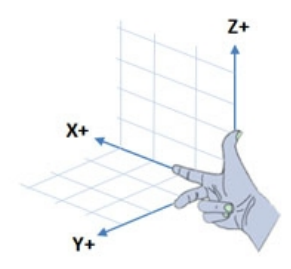

tf1已经被启用，目前常用tf2:

tf2_geometry_msgs:可以将ROS消息转换成tf2消息。

tf2: 封装了坐标变换的常用消息。

tf2_ros:为tf2提供了roscpp和rospy绑定，封装了坐标变换常用的API。

#### 坐标msg消息

终端运行，查看消息类型

```shell
rosmsg info geometry_msgs/PointStamped		#坐标点信息

std_msgs/Header header		#头信息
  uint32 seq		#序列号，无用
  time stamp		#时间戳
  string frame_id		#参考的坐标系
  
geometry_msgs/Point point		#点坐标
  float64 x
  float64 y
  float64 z
```

```shell
rosmsg info geometry_msgs/TransformStamped 		#坐标系相对位置，信息

std_msgs/Header header		#头信息
  uint32 seq		#序列号，无用
  time stamp		#时间戳
  string frame_id		#本坐标系
string child_frame_id		#另一个坐标系

geometry_msgs/Transform transform		#描述二者关系
  geometry_msgs/Vector3 translation			#两坐标原点偏移量
    float64 x
    float64 y
    float64 z
    
  geometry_msgs/Quaternion rotation			#偏航俯仰翻滚相对角，用四元数表示
    float64 x
    float64 y
    float64 z
    float64 w
```

#### 静态坐标变换

静态坐标变换：两坐标系位置相对固定，如机器人与雷达直接的位置

动态坐标变换：两坐标系位置不相对固定，如手指之间的相对位置

已知雷达相对于主体: x0.2 y0.0 z0.5。当前雷达检测到一障碍物坐标为 (2.0 3.0 5.0),该障碍物相对于主体的坐标是（2.2,3.0,5.5)

##### cpp

创建功能包tf01_static

添加依赖：tf2 tf2_ros tf2_geometry_msgs geometry_msgs roscpp rospy std_msgs 

创建文件：demo01_static_pub.cpp，配置cmakelist（bulid中：可执行文件、依赖文件、目标链接库）

demo01_static_pub.cpp

```cpp
#include "ros/ros.h"
#include "tf2_ros/static_transform_broadcaster.h"       //发布者对象
#include "geometry_msgs/TransformStamped.h"             //消息数据
#include "tf2/LinearMath/Quaternion.h"                  //欧拉角转化为四元数
/*
需求：发布两个坐标系的相对关系

流程：
    1.包含头文件
    2.初始化：设置编码，节点初始化，NodeHandle
    3.创建发布对象；
    4.组织被发布的消息
    5.发布数据；
    6.spin();
*/
int main(int argc, char *argv[])
{
    // 2.初始化：设置编码，节点初始化，NodeHandle
    setlocale(LC_ALL,"");
    ros::init(argc,argv,"static_pub");
    ros::NodeHandle nh;
    // 3.创建发布对象；
    tf2_ros::StaticTransformBroadcaster pub;
    // 4.组织被发布的消息
    geometry_msgs::TransformStamped tfs;
    tfs.header.stamp = ros::Time::now();
    tfs.header.frame_id = "base_link";//相对坐标系关系中，被参考的那一个
    tfs.child_frame_id = "laser";
    //雷达偏移量
    tfs.transform.translation.x = 0.2;
    tfs.transform.translation.y = 0.0;
    tfs.transform.translation.z = 0.5;

    //雷达角度偏移量，根据欧拉角转换
    tf2::Quaternion qtn;//创建四元数对象
    //向该对象设置欧拉角，这个对象可以将欧拉角转化为四元数
    qtn.setRPY(0,0,0);//翻滚 俯仰 偏航（单位：弧度）
    tfs.transform.rotation.x = qtn.getX();
    tfs.transform.rotation.y = qtn.getY();
    tfs.transform.rotation.z = qtn.getZ();
    tfs.transform.rotation.w = qtn.getW();

    // 5.发布数据；
    pub.sendTransform(tfs);
    // 6.spin();
    ros::spin();
    return 0;
}
```

测试

```
rosrun tf01_static demo01_static_pub
```

```shell
rostopic echo /tf_static
transforms: 
  - 
    header: 
      seq: 0
      stamp: 
        secs: 1726366143
        nsecs: 684386653
      frame_id: "base_link"
    child_frame_id: "laser"
    transform: 
      translation: 
        x: 0.2
        y: 0.0
        z: 0.5
      rotation: 
        x: 0.0
        y: 0.0
        z: 0.0
        w: 1.0
---
```

可视化坐标系

```shell
rviz
# 在启动的 rviz 中设置Fixed Frame 为 base_link;
# 点击左下的 add 按钮，在弹出的窗口中选择 TF 组件，即可显示坐标关系。
```

**订阅方**

demo02_static_sub.cpp

```cpp
#include "ros/ros.h"
#include "tf2_ros/transform_listener.h"     //创建订阅方对象
#include "tf2_ros/buffer.h"     //缓存数据到buffer中
#include "geometry_msgs/PointStamped.h"     //坐标点数据
#include "tf2_geometry_msgs/tf2_geometry_msgs.h"    //tf2坐标消息
/*
订阅方：订阅发布的坐标相对关系，传入一个坐标点，调用tf实现转换

流程：
    1.包含头文件
    2.编码、初始化、NodeHandle（必须）
    3.创建订阅对象：负责订阅坐标系相对关系
    4.组织一个坐标点数据
    5.转换算法，调用tf内置实现
    6.输出
*/
int main(int argc, char *argv[])
{
    // 2.编码、初始化、NodeHandle（必须）
    setlocale(LC_ALL,"");
    ros::init(argc,argv,"static_sub");
    ros::NodeHandle nh;
    // 3.创建订阅对象：负责订阅坐标系相对关系
    //3-1 创建一个buffer缓存
    tf2_ros::Buffer buffer;
    //3-2创建订阅对象，将订阅数据存入buffer
    tf2_ros::TransformListener listener(buffer);
    // 4.组织一个坐标点数据(雷达检测的物体坐标)
    geometry_msgs::PointStamped ps;
    ps.header.frame_id = "laser";
    ps.header.stamp = ros::Time::now();
    ps.point.x = 2.0;
    ps.point.y = 3.0;
    ps.point.z = 5.0;
    //添加休眠,让订阅方订阅到数据
    ros::Duration(2).sleep();

    // 5.转换算法，调用tf内置实现
    ros::Rate rate(10);
    while (ros::ok())
    {
        //核心代码  将雷达检测的位置 转换成相对于base_link的坐标点
        geometry_msgs::PointStamped ps_out;
        //转换后的坐标点信息，需要头文件tf2_geometry_msgs/tf2_geometry_msgs.h
        ps_out = buffer.transform(ps,"base_link");//参数1：输入坐标点，参数2；转换后的坐标系

        // 6.输出
        ROS_INFO("转换后的坐标值：（%.2f,%.2f,%.2f）,参考坐标系：%s",
                    ps_out.point.x,
                    ps_out.point.y,
                    ps_out.point.z,
                    ps_out.header.frame_id.c_str());
        rate.sleep();
        ros::spinOnce();
    }
    
    return 0;
}
```

测试

```
rosrun tf01_static demo01_static_pub
```

```shell
rosrun tf01_static demo02_static_sub
#[ INFO] [1726369799.161358242]: 转换后的坐标值：（2.20,3.00,5.50）,参考坐标系：base_link
```

**使用try语句，防止订阅不及时报错（建议）**

```cpp
#include "ros/ros.h"
#include "tf2_ros/transform_listener.h"     //创建订阅方对象
#include "tf2_ros/buffer.h"     //缓存数据到buffer中
#include "geometry_msgs/PointStamped.h"     //坐标点数据
#include "tf2_geometry_msgs/tf2_geometry_msgs.h"    //tf2坐标消息
/*
订阅方：订阅发布的坐标相对关系，传入一个坐标点，调用tf实现转换

流程：
    1.包含头文件
    2.编码、初始化、NodeHandle（必须）
    3.创建订阅对象：负责订阅坐标系相对关系
    4.组织一个坐标点数据
    5.转换算法，调用tf内置实现
    6.输出
*/
int main(int argc, char *argv[])
{
    // 2.编码、初始化、NodeHandle（必须）
    setlocale(LC_ALL,"");
    ros::init(argc,argv,"static_sub");
    ros::NodeHandle nh;
    // 3.创建订阅对象：负责订阅坐标系相对关系
    //3-1 创建一个buffer缓存
    tf2_ros::Buffer buffer;
    //3-2创建订阅对象，将订阅数据存入buffer
    tf2_ros::TransformListener listener(buffer);
    // 4.组织一个坐标点数据(雷达检测的物体坐标)
    geometry_msgs::PointStamped ps;
    ps.header.frame_id = "laser";
    ps.header.stamp = ros::Time::now();
    ps.point.x = 2.0;
    ps.point.y = 3.0;
    ps.point.z = 5.0;
    
    // 5.转换算法，调用tf内置实现
    ros::Rate rate(10);
    while (ros::ok())
    {
        //核心代码  将ps转换成相对于base_link的坐标点
        geometry_msgs::PointStamped ps_out;

        try
        {
            //转换后的坐标点信息，需要头文件tf2_geometry_msgs/tf2_geometry_msgs.h
            ps_out = buffer.transform(ps,"base_link");//参数1：输入坐标点，参数2；转换后的坐标系

            // 6.输出
            ROS_INFO("转换后的坐标值：（%.2f,%.2f,%.2f）,参考坐标系：%s",
                        ps_out.point.x,
                        ps_out.point.y,
                        ps_out.point.z,
                        ps_out.header.frame_id.c_str());
        }
        catch(const std::exception& e)rosrun tf01_static demo02_static_sub 3
        {
             ROS_INFO("异常消息：%s",e.what());
        }
        rate.sleep();
        ros::spinOnce();
    }   
    return 0;
}
```

测试

```
rosrun tf01_static demo02_static_sub
```

##### python

**发布方**

tf01_static文件夹中新建scripts文件夹，其中新建demo01_static_p.py，添加权限，配置cmakelists

```cmake
catkin_install_python(PROGRAMS
  scripts/demo01_static_p.py
  DESTINATION ${CATKIN_PACKAGE_BIN_DESTINATION}
)
```

demo01_static_p.py

```python
#! /usr/bin/env python
#-*- coding: utf-8 -*-
import rospy
import tf.transformations
import tf2_ros  #创建发布对象
import tf  #将欧拉角转化为四元数
from geometry_msgs.msg import TransformStamped  #消息类型
"""
发布方：发布两个坐标系相对关系（底盘 base_link  雷达 laser）
流程：
    1.导包
    2.初始化节点
    3.创建发布对象
    4.组织被发布对象
    5.发布数据
    6.spin()
"""
if __name__ == "__main__":
    # 2.初始化节点
    rospy.init_node("static_pub_p")

    # 3.创建发布对象
    pub = tf2_ros.StaticTransformBroadcaster()

    # 4.组织被发布对象（写消息数据）
    ts = TransformStamped()
    # header
    ts.header.stamp = rospy.Time.now()
    ts.header.frame_id = "base_link"
    # child frame id
    ts.child_frame_id = "radar"

    #坐标系相对信息
    #偏移量
    ts.transform.translation.x = 0.2
    ts.transform.translation.y = 0.0
    ts.transform.translation.z = 0.5
    #旋转量
    qtn = tf.transformations.quaternion_from_euler(0,0,0)
    ts.transform.rotation.x = qtn[0]
    ts.transform.rotation.y = qtn[1]
    ts.transform.rotation.z = qtn[2]
    ts.transform.rotation.w = qtn[3]

    # 5.发布数据
    pub.sendTransform(ts)

    # 6.spin()
    rospy.spin()
```

运行

```
rosrun tf01_static demo01_static_pub_p.py
```

```
rostopic echo /tf_static
transforms: 
  - 
    header: 
      seq: 101
      stamp: 
        secs: 1726391990
        nsecs: 527064085
      frame_id: "world"
    child_frame_id: "radar"
    transform: 
      translation: 
        x: 0.2
        y: 0.0
        z: 0.5
      rotation: 
        x: 0.0
        y: 0.0
        z: 0.0
        w: 1.0
---

transforms: 
  - 
    header: 
      seq: 101
      stamp: 
        secs: 1726395833
        nsecs: 928730010
      frame_id: "world"
    child_frame_id: "radar"
    transform: 
      translation: 
        x: 0.2
        y: 0.0
        z: 0.5
      rotation: 
        x: 0.0
        y: 0.0
        z: 0.0
        w: 1.0
---
```

如果报错：

```
the rosdep view is empty: call 'sudo rosdep init' and 'rosdep update'
```

解决办法：

系统检测到`rosdep`没有初始化或更新。以下步骤可以帮助您解决这个问题：

1. **确保网络连接：** 确保您的计算机可以访问互联网，因为`rosdep init`和`rosdep update`需要从网上下载资源。

2. **初始化`rosdep`：** 打开终端，运行以下命令来初始化`rosdep`：

    ```
    sudo rosdep init
    ```

    如果您在中国大陆，可能会因为网络问题而无法直接执行这个命令。这时，您可以尝试以下手动初始化的方法。

3. **手动初始化`rosdep`（如果需要）：** 如果无法直接运行`sudo rosdep init`，您可以手动创建初始化文件：

    - 创建`/etc/ros/rosdep/sources.list.d/20-default.list`文件，并添加以下内容：

        ```
        yaml https://raw.githubusercontent.com/ros/rosdistro/master/rosdep/osx-homebrew.yaml osx
        yaml https://raw.githubusercontent.com/ros/rosdistro/master/rosdep/base.yaml
        yaml https://raw.githubusercontent.com/ros/rosdistro/master/rosdep/python.yaml
        yaml https://raw.githubusercontent.com/ros/rosdistro/master/rosdep/ruby.yaml
        gbpdistro https://raw.githubusercontent.com/ros/rosdistro/master/releases/fuerte.yaml fuerte
        ```

    - 请注意，上述URL中的`fuerte`应替换为您使用的ROS版本的名称（例如`melodic`、`noetic`等）。

4. **更新`rosdep`：** 运行以下命令来更新`rosdep`数据库：

    ```
    rosdep update
    ```

    如果遇到网络问题，您可能需要设置代理或使用VPN。

5. **设置代理（如果需要）：** 如果您在中国大陆并且需要设置代理，可以在终端中设置代理环境变量：

    ```
    export http_proxy=http://<proxy>:<port>
    export https_proxy=http://<proxy>:<port>
    ```

    替换`<proxy>`和`<port>`为您的代理服务器地址和端口。

6. **重新运行ROS节点：** 完成上述步骤后，再次尝试运行您的ROS节点：

    ```
    rosrun tf01_static demo01_static_p.py
    ```

按照这些步骤操作后，`rosdep`应该已经初始化并更新，您应该能够正常运行ROS节点。如果仍然存在问题，请检查网络连接，确保`rosdep`可以访问到所需的资源。

**订阅方**

demo02_static_sub_p.py

```python
#! /usr/bin/env python
#-*- coding: utf-8 -*-
"""
订阅坐标系信息，生成一个相对于 子级坐标系的坐标点数据
转换成父级坐标系中的坐标点

流程：
    1.导包
    2.节点初始化
    3.创建订阅对象
    4.创建雷达坐标系中的坐标点
    5.将坐标点转换成车体坐标系中的坐标点
    6.spin
"""
    # 1.导包
import rospy
import tf2_ros  #创建订阅对象与坐标缓存器
from tf2_geometry_msgs import PointStamped  #坐标数据对象
if __name__ == "__main__":
    # 2.节点初始化
    rospy.init_node("static_sub_p")
    # 3.创建订阅对象
    buffer = tf2_ros.Buffer()   #缓存坐标数据
    listener = tf2_ros.TransformListener(buffer)    #订阅者对象

    rate = rospy.Rate(10)
    while not rospy.is_shutdown():
    # 4.创建雷达坐标系中的坐标点
        ps = PointStamped() 
        ps.header.frame_id = "radar"
        ps.header.stamp = rospy.Time.now()
        ps.point.x = 2.0
        ps.point.y = 3.0
        ps.point.z = 5.0

    # 5.将坐标点转换成车体坐标系中的坐标点
        try:
            ps_out = buffer.transform(ps,"base_link")
            rospy.loginfo("转换结果：（%.2f,%.2f,%.2f）,参考坐标系：%s",
                        ps_out.point.x,
                        ps_out.point.y,
                        ps_out.point.z,
                        ps_out.header.frame_id
                        )
        except Exception as e:
            rospy.logerr("异常：%s",e)
    # 6.spin
        rate.sleep()
```

运行测试

```
cd ws
rosrun tf01_static demo01_static_pub_p.py 
```

```
cd ws 
rosrun tf01_static demo02_static_sub_p.py 
```

##### 终端

```shell
#语法
rosrun tf2_ros static_transform_publisher 
x偏移量 y偏移量 z偏移量 
z偏航角度 y俯仰角度 x翻滚角度 
父级坐标系 子级坐标系
```

运行测试

```
rosrun tf2_ros static_transform_publisher 0.1 0.0 0.3 0 0 0.5 /base_link /laser
```

```
rviz
```

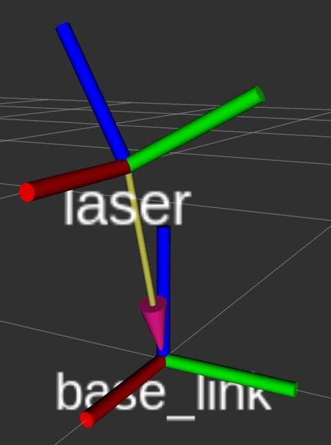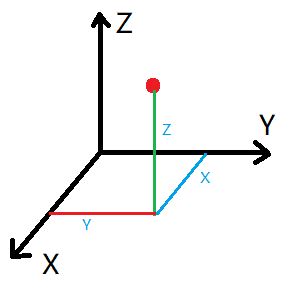

绕轴旋转正方向：轴指向人脸，绕此轴逆时针旋转

#### 动态坐标变换

两个坐标系之间的相对位置是相对变化的

需求：获取乌龟位姿，发布到rviz中

实现：获取乌龟位姿话题和消息名称
			订阅位姿信息，发布位姿信息

获取乌龟位姿话题和消息类型

```shell
rostopic list
/turtle1/pose		#话题名称

rostopic info /turtle1/pose
Type: turtlesim/Pose		#消息类型

Publishers: 
 * /turtlesim (http://100ask:43533/)

Subscribers: None

rosmsg info turtlesim/Pose
float32 x
float32 y
float32 theta
float32 linear_velocity
float32 angular_velocity
```

##### CPP

创建功能包tf02_dynamic，添加依赖 tf2 tf2_ros tf2_geometry_msgs roscpp rospy std_msgs geometry_msgs turtlesim

demo01_dynamic_pub.cpp

```cpp
#include "ros/ros.h"
#include "turtlesim/Pose.h"
#include "tf2_ros/transform_broadcaster.h"
#include "geometry_msgs/TransformStamped.h"
#include "tf2/LinearMath/Quaternion.h"
/*
发布方：订阅乌龟位姿信息，转换成相对于窗体的坐标关系，并发布
准备:
    话题：/turtle1/pose
    消息：/turtlesim/Pose
分析：订阅/turtle1/pose，获取乌龟在世界坐标系中的坐标
     将pose信息转换成坐标系相对信息并发布
流程：
    1.头文件
    2.设置编码，初始化，句柄
    3.创建订阅对象，订阅 /turtle1/pose
    4.回调函数处理订阅消息：将位姿信息转换成坐标相对关系，并发布（重点）
    5.spin()
*/
// 回调函数处理订阅消息：将位姿信息转换成坐标相对关系，并发布（重点）
void doPose(const turtlesim::Pose::ConstPtr& pose)
{
    //1.创建坐标发布对象
    static tf2_ros::TransformBroadcaster pub;   //static对象在程序运行期间会一直存在
    //2.组织被发布的数据
    //坐标对象
    geometry_msgs::TransformStamped ts;
    ts.header.frame_id = "world";   //全局坐标
    ts.header.stamp = ros::Time::now(); 
    ts.child_frame_id = "turtle1";  //子坐标   
    //坐标偏移量
    ts.transform.translation.x = pose->x;
    ts.transform.translation.y = pose->y;
    ts.transform.translation.z = 0; //乌龟处于二维平面
    //坐标旋转量
    tf2::Quaternion qtn;
    qtn.setRPY(0,0,pose->theta);
    ts.transform.rotation.x = qtn.getX();
    ts.transform.rotation.y = qtn.getY();
    ts.transform.rotation.z = qtn.getZ();
    ts.transform.rotation.w = qtn.getW();
    //3.发布
    pub.sendTransform(ts);
}
int main(int argc, char *argv[])
{   
    // 2.设置编码，初始化，句柄
    setlocale(LC_ALL,"");
    ros::init(argc,argv,"dynamic_pub");
    ros::NodeHandle nh;
    // 3.创建订阅对象，订阅 /turtle1/pose
    ros::Subscriber sub;
    sub = nh.subscribe("/turtle1/pose",100,doPose);
    // 4.回调函数处理订阅消息：将位姿信息转换成坐标相对关系，并发布（重点）
    // 5.spin()
    ros::spin();
    return 0;
}
```

配置cmakelists后，编译并执行

```shell
rosrun turtlesim turtlesim_node
```

```
rosrun turtlesim turtle_turtle_teleop_key
```

```
cd ws
rosrun tf02_dynamic demo01_dynamic_pub 
```

```
rviz
```

用键盘控制乌龟运行，rviz上看到相同运动

**订阅方**

需求：订阅相对于乌龟坐标系下的物体坐标，用转换算法修正后，加入世界坐标系，并用终端输出

demo02_dynamic_sub.cpp

```cpp
#include "ros/ros.h"
#include "tf2_ros/transform_listener.h"     //创建订阅方对象
#include "tf2_ros/buffer.h"     //缓存数据到buffer中
#include "geometry_msgs/PointStamped.h"     //坐标点数据
#include "tf2_geometry_msgs/tf2_geometry_msgs.h"    //tf2坐标消息
/*
订阅方：订阅发布的坐标相对关系，传入一个坐标点，调用tf实现转换

流程：
    1.包含头文件
    2.编码、初始化、NodeHandle（必须）
    3.创建订阅对象：负责订阅坐标系相对关系
    4.组织一个坐标点数据
    5.转换算法，调用tf内置实现
    6.输出
*/
int main(int argc, char *argv[])
{
    // 2.编码、初始化、NodeHandle（必须）
    setlocale(LC_ALL,"");
    ros::init(argc,argv,"dynamic_sub");
    ros::NodeHandle nh;
    // 3.创建订阅对象：负责订阅坐标系相对关系
    //3-1 创建一个buffer缓存
    tf2_ros::Buffer buffer;
    //3-2创建订阅对象，将订阅数据存入buffer
    tf2_ros::TransformListener listener(buffer);
    // 4.组织一个坐标点数据(乌龟检测的物体坐标，相对于乌龟的坐标系)
    geometry_msgs::PointStamped ps;
    ps.header.frame_id = "turtle1";
    //用了动态坐标系，废除订阅方时间戳，由于订阅延时，会导致发布时间戳与订阅时间戳无法对齐，导致报错
    ps.header.stamp = ros::Time(0.0);    
    ps.point.x = 2.0;
    ps.point.y = 3.0;
    ps.point.z = 5.0;
    
    // 5.转换算法，调用tf内置实现
    ros::Rate rate(10);
    while (ros::ok())
    {
        //核心代码  将ps转换成相对于base_link的坐标点
        geometry_msgs::PointStamped ps_out;

        try
        {
            //转换后的坐标点信息，需要头文件tf2_geometry_msgs/tf2_geometry_msgs.h
            ps_out = buffer.transform(ps,"world");//参数1：输入坐标点，参数2；转换后的坐标系

            // 6.输出
            ROS_INFO("转换后的坐标值：（%.2f,%.2f,%.2f）,参考坐标系：%s",
                        ps_out.point.x,
                        ps_out.point.y,
                        ps_out.point.z,
                        ps_out.header.frame_id.c_str());
        }
        catch(const std::exception& e)
        {
            ROS_INFO("异常消息：%s",e.what());
        }
        rate.sleep();
        ros::spinOnce();
    }    
    return 0;
}

```

配置cmake后，编译并测试

```
rosrun turtlesim turtlesim_node
```

```
rosrun turtlesim turtle_teleop_key 
```

```shell
cd ws
rosrun tf02_dynamic demo01_dynamic_pub 
```

```
rosrun tf02_dynamic demo01_dynamic_sub 
```

##### python

发布方，demo01_dynamic_pub_p.py

```python
#! /usr/bin/env python
"""  
    动态的坐标系相对姿态发布(一个坐标系相对于另一个坐标系的相对姿态是不断变动的)

    需求: 启动 turtlesim_node,该节点中窗体有一个世界坐标系(左下角为坐标系原点)，乌龟是另一个坐标系，键盘
    控制乌龟运动，将两个坐标系的相对位置动态发布

    实现分析:
        1.乌龟本身不但可以看作坐标系，也是世界坐标系中的一个坐标点
        2.订阅 turtle1/pose,可以获取乌龟在世界坐标系的 x坐标、y坐标、偏移量以及线速度和角速度
        3.将 pose 信息转换成 坐标系相对信息并发布
    实现流程:
        1.导包
        2.初始化 ROS 节点
        3.订阅 /turtle1/pose 话题消息
        4.回调函数处理
            4-1.创建 TF 广播器
            4-2.创建 广播的数据(通过 pose 设置)
            4-3.广播器发布数据
        5.spin
"""
# 1.导包
import rospy
import tf2_ros
import tf
from turtlesim.msg import Pose
from geometry_msgs.msg import TransformStamped

#     4.回调函数处理
def doPose(pose):
    #         4-1.创建 TF 广播器
    broadcaster = tf2_ros.TransformBroadcaster()
    #         4-2.创建 广播的数据(通过 pose 设置)
    tfs = TransformStamped()
    tfs.header.frame_id = "world"
    tfs.header.stamp = rospy.Time.now()
    tfs.child_frame_id = "turtle1"
    tfs.transform.translation.x = pose.x
    tfs.transform.translation.y = pose.y
    tfs.transform.translation.z = 0.0
    qtn = tf.transformations.quaternion_from_euler(0,0,pose.theta)
    tfs.transform.rotation.x = qtn[0]
    tfs.transform.rotation.y = qtn[1]
    tfs.transform.rotation.z = qtn[2]
    tfs.transform.rotation.w = qtn[3]
    #         4-3.广播器发布数据
    broadcaster.sendTransform(tfs)

if __name__ == "__main__":
    # 2.初始化 ROS 节点
    rospy.init_node("dynamic_tf_pub_p")
    # 3.订阅 /turtle1/pose 话题消息
    sub = rospy.Subscriber("/turtle1/pose",Pose,doPose)
    #     4.回调函数处理
    #         4-1.创建 TF 广播器
    #         4-2.创建 广播的数据(通过 pose 设置)
    #         4-3.广播器发布数据
    #     5.spin
    rospy.spin()
```

测试

```
rosrun turtlesim turtlesim_node 
```

```
rosrun turtlesim turtle_teleop_key 
```

```
cd ws
rosrun tf02_dynamic demo01_dynamic_pub_p.py
```

```shell
rviz
#键盘控制乌龟运动时，坐标系同时显示
```

订阅方

demo02_dynamic_sub_p.py

```python
#! /usr/bin/env python
#-*- coding: utf-8 -*-
"""
订阅坐标系信息，生成一个相对于 子级坐标系的坐标点数据
转换成父级坐标系中的坐标点

流程：
    1.导包
    2.节点初始化
    3.创建订阅对象
    4.创建雷达坐标系中的坐标点
    5.将坐标点转换成车体坐标系中的坐标点
    6.spin
"""
    # 1.导包
import rospy
import tf2_ros  #创建订阅对象与坐标缓存器
from tf2_geometry_msgs import PointStamped  #坐标数据对象
if __name__ == "__main__":
    # 2.节点初始化
    rospy.init_node("dynamic_sub_p")
    # 3.创建订阅对象
    buffer = tf2_ros.Buffer()   #缓存坐标数据
    listener = tf2_ros.TransformListener(buffer)    #订阅者对象
    #创建订阅对象的同时，无需写话题名称，会自动接收坐标数据，存入buffer

    rate = rospy.Rate(10)
    while not rospy.is_shutdown():
    # 4.创建乌龟坐标系中的坐标点
        ps = PointStamped() 
        ps.header.frame_id = "turtle1"
        #订阅者时间戳置空，只让发布者时间戳生效，防止订阅延迟报错
        ps.header.stamp = rospy.Time(0.0)  
        ps.point.x = 2.0
        ps.point.y = 3.0
        ps.point.z = 5.0

    # 5.将坐标点转换成世界坐标系中的坐标点
        try:
            ps_out = buffer.transform(ps,"world")
            rospy.loginfo("转换结果：（%.2f,%.2f,%.2f）,参考坐标系：%s",
                        ps_out.point.x,
                        ps_out.point.y,
                        ps_out.point.z,
                        ps_out.header.frame_id
                        )
        except Exception as e:
            rospy.logerr("异常：%s",e)
    # 6.spin
        rate.sleep()
```

运行并测试

```
rosrun turtlesim turtlesim_node
```

```
rosrun turtlesim turtle_teleop_key 
```

```
cd ws 
rosrun tf02_dynamic demo01_dynamic_pub
```

```
cd ws
rosrun tf02_dynamic demo02_dynamic_sub
```

现象：终端输出 乌龟坐标

#### 多坐标变换

实现世界坐标系中，两个子坐标系的坐标变换

##### CPP

创建功能包tf03_tfs，依赖包：tf2 tf2_ros tf2_geometry_msgs roscpp rospy std_msgs geometry_msgs turtlesim，编译

**发布方**

新建launch文件夹，新建文件tfs_c.launch

```xml
<launch>
    <!-- 发布 son1 相对于world 以及 son2 相对于world 的坐标关系 -->
    <!-- args参数：偏移量、旋转量、世界坐标系、子坐标系 -->
    <node pkg="tf2_ros" type="static_transform_publisher" name="son1" args="1 0 0 0 0 0 /world /son1" output="screen" />
    <node pkg="tf2_ros" type="static_transform_publisher" name="son2" args="2 0 0 0 0 0 /world /son2" output="screen" />
</launch>
```

测试

```
roslaunch tf03_tfs tfs_c.launch
```

```
rviz
```

订阅方

demo01_tfs.cpp

```cpp
/*

需求:
    现有坐标系统，父级坐标系统 world,下有两子级系统 son1，son2，
    son1 相对于 world，以及 son2 相对于 world 的关系是已知的，
    求 son1 与 son2中的坐标关系，又已知在 son1中一点的坐标，要求求出该点在 son2 中的坐标
实现流程:
    1.包含头文件
    2.初始化 ros 节点
    3.创建 ros 句柄
    4.创建 TF 订阅对象
    5.解析订阅信息中获取 son1 坐标系原点在 son2 中的坐标
      解析 son1 中的点相对于 son2 的坐标
    6.spin

*/
//1.包含头文件
#include "ros/ros.h"
#include "tf2_ros/transform_listener.h"
#include "tf2_ros/buffer.h"
#include "tf2/LinearMath/Quaternion.h"
#include "tf2_geometry_msgs/tf2_geometry_msgs.h"
#include "geometry_msgs/TransformStamped.h"
#include "geometry_msgs/PointStamped.h"

int main(int argc, char *argv[])
{   setlocale(LC_ALL,"");
    // 2.初始化 ros 节点
    ros::init(argc,argv,"sub_frames");
    // 3.创建 ros 句柄
    ros::NodeHandle nh;
    // 4.创建 TF 订阅对象
    tf2_ros::Buffer buffer; 
    tf2_ros::TransformListener listener(buffer);
    // 5.解析订阅信息中获取 son1 坐标系原点在 son2 中的坐标
    ros::Rate r(1);
    while (ros::ok())
    {
        try
        {
            //解析 son1 中的点相对于 son2 的坐标
            /*
            buffer.lookupTransform("参数1","参数2",参数3)
            A 相对于 B 的坐标系关系
            参数1：目标坐标系 B
            参数2：源坐标系   A
            参数3：ros::Time(0) 取时间间隔最短的两个坐标关系帧，计算相对关系
            返回值：geometry_msgs::TransformStamped  两坐标系的相对关系
            */
            geometry_msgs::TransformStamped tfs = buffer.lookupTransform("son2","son1",ros::Time(0));
            ROS_INFO("Son1 相对于 Son2 的坐标关系:父坐标系ID=%s",tfs.header.frame_id.c_str());
            ROS_INFO("Son1 相对于 Son2 的坐标关系:子坐标系ID=%s",tfs.child_frame_id.c_str());
            ROS_INFO("Son1 相对于 Son2 的坐标关系:x=%.2f,y=%.2f,z=%.2f",
                    tfs.transform.translation.x,
                    tfs.transform.translation.y,
                    tfs.transform.translation.z
                    );

            // 坐标点解析
            geometry_msgs::PointStamped ps;
            ps.header.frame_id = "son1";
            ps.header.stamp = ros::Time::now();
            ps.point.x = 1.0;
            ps.point.y = 2.0;
            ps.point.z = 3.0;

            geometry_msgs::PointStamped psAtSon2;
            psAtSon2 = buffer.transform(ps,"son2");
            ROS_INFO("在 Son2 中的坐标:x=%.2f,y=%.2f,z=%.2f",
                    psAtSon2.point.x,
                    psAtSon2.point.y,
                    psAtSon2.point.z
                    );
        }
        catch(const std::exception& e)
        {
            // std::cerr << e.what() << '\n';
            ROS_INFO("异常信息:%s",e.what());
        }
        r.sleep();
        // 6.spin
        ros::spinOnce();
    }
    return 0;
}
```

测试

```
rosrun tf03_tfs demo01_tfs
```

```
[ INFO] [1726536164.689534557]: Son1 相对于 Son2 的坐标关系:父坐标系ID=son2
[ INFO] [1726536164.689612186]: Son1 相对于 Son2 的坐标关系:子坐标系ID=son1
[ INFO] [1726536164.689671694]: Son1 相对于 Son2 的坐标关系:x=-1.00,y=0.00,z=0.00
[ INFO] [1726536164.689709998]: 在 Son2 中的坐标:x=0.00,y=2.00,z=3.00
```

##### python

发布方：cpp中的launch文件

订阅方：demo01_tfs_p.py

```python
#!/usr/bin/env python
#-*- coding: utf-8 -*-
"""  
    需求:
        现有坐标系统，父级坐标系统 world,下有两子级系统 son1，son2，
        son1 相对于 world，以及 son2 相对于 world 的关系是已知的，
        求 son1 与 son2中的坐标关系，又已知在 son1中一点的坐标，要求求出该点在 son2 中的坐标
    实现流程:   
        1.导包
        2.初始化 ROS 节点
        3.创建 TF 订阅对象
        4.调用 API 求出 son1 相对于 son2 的坐标关系
        5.创建一依赖于 son1 的坐标点，调用 API 求出该点在 son2 中的坐标
        6.spin
"""
# 1.导包
import rospy
import tf2_ros
from geometry_msgs.msg import TransformStamped
from tf2_geometry_msgs import PointStamped

if __name__ == "__main__":

    # 2.初始化 ROS 节点
    rospy.init_node("frames_sub_p")
    # 3.创建 TF 订阅对象
    buffer = tf2_ros.Buffer()
    listener = tf2_ros.TransformListener(buffer)

    rate = rospy.Rate(1)
    while not rospy.is_shutdown():

        try:
        # 4.调用 API 求出 son1 相对于 son2 的坐标关系
            #lookup_transform(self, target_frame, source_frame, time, timeout=rospy.Duration(0.0)):
            tfs = buffer.lookup_transform("son2","son1",rospy.Time(0))
            rospy.loginfo("son1 与 son2 相对关系:")
            rospy.loginfo("父级坐标系:%s",tfs.header.frame_id)
            rospy.loginfo("子级坐标系:%s",tfs.child_frame_id)
            rospy.loginfo("相对坐标:x=%.2f, y=%.2f, z=%.2f",
                        tfs.transform.translation.x,
                        tfs.transform.translation.y,
                        tfs.transform.translation.z,
            )
        # 5.创建一依赖于 son1 的坐标点，调用 API 求出该点在 son2 中的坐标
            point_source = PointStamped()
            point_source.header.frame_id = "son1"
            point_source.header.stamp = rospy.Time.now()
            point_source.point.x = 1
            point_source.point.y = 2
            point_source.point.z = 3

            point_target = buffer.transform(point_source,"son2")

            rospy.loginfo("point_target 所属的坐标系:%s",point_target.header.frame_id)
            rospy.loginfo("坐标点相对于 son2 的坐标:(%.2f,%.2f,%.2f)",
                        point_target.point.x,
                        point_target.point.y,
                        point_target.point.z
            )

        except Exception as e:
            rospy.logerr("错误提示:%s",e)

        rate.sleep()
    # 6.spin    
    # rospy.spin()
```

测试

```
rosrun tf03_tfs demo01_tfs_p.py
```

```
[INFO] [1726539595.972950]: son1 与 son2 相对关系:
[INFO] [1726539595.974439]: 父级坐标系:son2
[INFO] [1726539595.975454]: 子级坐标系:son1
[INFO] [1726539595.976626]: 相对坐标:x=-1.00, y=0.00, z=0.00
[INFO] [1726539595.980209]: point_target 所属的坐标系:son2
[INFO] [1726539595.981932]: 坐标点相对于 son2 的坐标:(0.00,2.00,3.00)
```

#### 坐标系关系查看

安装工具

```shell
# 查看是否有安装
rospack find tf2_tools
```

```shell
#如果没安装，运行下面命令
sudo apt install ros-melodic-tf2-tools
```

测试

```shell
roslaunch tf03_tfs tfs_c.launch		#运行坐标系节点
```

```shell
rosrun tf2_tools view_frames.py		#生成坐标系关系图.pdf，存入运行路径
evince frames.pdf		#打开pdf文件
```

#### 坐标变换实操

需求：键盘控制乌龟1运动，乌龟2跟随乌龟1运动

实现原理：
1、获取两只乌龟相对于世界坐标系的坐标信息
2、以乌龟1为父坐标系，乌龟2 为子坐标系，建立坐标系，获取2的坐标
3、生成速度信息，控制2运动

实现流程：

1. 启动乌龟显示节点（launch文件）
2. 在乌龟显示窗体中生成一只新的乌龟(需要使用服务)
3. 编写两只乌龟发布坐标信息的节点
4. 编写订阅节点订阅坐标信息并生成新的相对关系生成速度信息

CPP

创建功能包：tf04_test

添加依赖：tf2 tf2_ros tf2_geometry_msgs roscpp rospy std_msgs geometry_msgs turtlesim

新建launch文件夹，创建launch文件test.launch

```xml
<launch>
    <!-- 1.启动乌龟gui节点 -->
    <node pkg="turtlesim" type="turtlesim_node" name="turtle1" output="screen"/>
    <!-- 键盘控制节点 -->
    <node pkg="turtlesim" type="turtle_teleop_key" name="key" output="screen"/>

    <!-- 2.生成新乌龟的节点 -->
    <node pkg="tf04_test" type="test01_new_turtle" name="turtle2" output="screen"/>

    <!-- 3.启动两个乌龟相对于世界的坐标关系的发布 -->
    <!-- 
        基本思路：
            1.节点只编写一个
            2.节点启动两次
            3.节点启动时，动态传参：turtle1,turtle2
     -->
    <node pkg="tf04_test" type="test02_pub_turtle" name="pub1" args="turtle1" output="screen"/>
    <node pkg="tf04_test" type="test02_pub_turtle" name="pub2" args="turtle2" output="screen"/>

    <!-- 4.需要订阅 turtle1 与turtle2 相对于世界坐标系的坐标消息，
    并转换成 turtle1 相对于 turtle2 的坐标关系，
    再生成速度消息 -->
    <node pkg="tf04_test" type="test03_control_turtle2" name="control" output="screen"/>

</launch>
```

test01_new_turtle.cpp

生成一只新乌龟

```cpp
/*
    生成一只小乌龟
    准备工作:
        1.服务话题 /spawn
        2.服务消息类型 turtlesim/Spawn
        3.运行前先启动 turtlesim_node 节点

    实现流程:
        1.包含头文件
          需要包含 turtlesim 包下资源，注意在 package.xml 配置
        2.初始化 ros 节点
        3.创建 ros 句柄
        4.创建 service 客户端
        5.等待服务启动
        6.发送请求
        7.处理响应
*/
#include "ros/ros.h"
#include "turtlesim/Spawn.h"

int main(int argc, char *argv[])
{
    setlocale(LC_ALL,"");
    // 2.初始化 ros 节点
    ros::init(argc,argv,"turtle2");
    // 3.创建 ros 句柄
    ros::NodeHandle nh;
    // 4.创建 service 客户端
    ros::ServiceClient client = nh.serviceClient<turtlesim::Spawn>("/spawn");
    // 5.等待服务启动
    ros::service::waitForService("/spawn");
    // 6.发送请求
    turtlesim::Spawn spawn;//创建数据载体
    spawn.request.x = 1.0;
    spawn.request.y = 1.0;
    spawn.request.theta = 1.57;
    spawn.request.name = "turtle2";
    //客户端向服务端发送数据，响应成功返回true,服务端响应数据存入spawn
    bool flag = client.call(spawn);
    // 7.处理响应
    if (flag)
    {
        ROS_INFO("有新龟诞生：%s!",spawn.response.name.c_str());
    }
    else
    {
        ROS_INFO("龟龟出生失败！");
    }
    
    return 0;
}

```

test02_pub_turtle.cpp

动态发布	乌龟世界坐标

```cpp
#include "ros/ros.h"
#include "turtlesim/Pose.h"
#include "tf2_ros/transform_broadcaster.h"
#include "geometry_msgs/TransformStamped.h"
#include "tf2/LinearMath/Quaternion.h"
//动态接收乌龟名字
std::string turtle_name;

void doPose(const turtlesim::Pose::ConstPtr& pose)
{
    //1.创建坐标发布对象
    static tf2_ros::TransformBroadcaster pub;   //static对象在程序运行期间会一直存在
    //2.组织被发布的数据
    //坐标对象
    geometry_msgs::TransformStamped ts;
    ts.header.frame_id = "world";   //全局坐标
    ts.header.stamp = ros::Time::now(); 
    //关键点2：动态传入
    ts.child_frame_id = turtle_name;  //子坐标   
    //坐标偏移量
    ts.transform.translation.x = pose->x;
    ts.transform.translation.y = pose->y;
    ts.transform.translation.z = 0; //乌龟处于二维平面
    //坐标旋转量
    tf2::Quaternion qtn;
    qtn.setRPY(0,0,pose->theta);
    ts.transform.rotation.x = qtn.getX();
    ts.transform.rotation.y = qtn.getY();
    ts.transform.rotation.z = qtn.getZ();
    ts.transform.rotation.w = qtn.getW();
    //3.发布
    pub.sendTransform(ts);
}
int main(int argc, char *argv[])
{   
    // 2.设置编码，初始化，句柄
    setlocale(LC_ALL,"");
    ros::init(argc,argv,"dynamic_pub");

    //解析传入参数
    if (argc != 2)
    {
        ROS_ERROR("请传入正确参数");
    }
    else
    {
        turtle_name = argv[1];
        ROS_INFO("乌龟 %s 坐标发送",turtle_name.c_str());
    }
    
    ros::NodeHandle nh;
    // 3.创建订阅对象，订阅 /turtle1/pose
    ros::Subscriber sub;
    //关键点1：订阅的话题名称，turtle1 或 turtle2 动态传入
    sub = nh.subscribe(turtle_name + "/pose",100,doPose);
    // 4.回调函数处理订阅消息：将位姿信息转换成坐标相对关系，并发布（重点）
    // 5.spin()
    ros::spin();
    return 0;
}
```

乌龟2 跟随 乌龟1 运动

test03_control_turtle2.cpp

```cpp
/*
需求:
    需求1.换算出turtle1 相对于turtle2 的关系
    需求2：计算角速度和线速度并发布
实现流程:
    1.包含头文件
    2.初始化 ros 节点
    3.创建 ros 句柄
    4.创建 TF 订阅对象
    5.解析订阅信息中获取 son1 坐标系原点在 son2 中的坐标
      解析 son1 中的点相对于 son2 的坐标
    6.spin
*/
//1.包含头文件
#include "ros/ros.h"
#include "tf2_ros/transform_listener.h"
#include "tf2_ros/buffer.h"
#include "tf2/LinearMath/Quaternion.h"
#include "tf2_geometry_msgs/tf2_geometry_msgs.h"
#include "geometry_msgs/TransformStamped.h"
#include "geometry_msgs/PointStamped.h"
#include "geometry_msgs/Twist.h"

int main(int argc, char *argv[])
{   setlocale(LC_ALL,"");
    // 2.初始化 ros 节点
    ros::init(argc,argv,"sub_frames");
    // 3.创建 ros 句柄
    ros::NodeHandle nh;
    // 4.创建 TF 订阅对象
    tf2_ros::Buffer buffer; 
    tf2_ros::TransformListener listener(buffer);

    //A.创建发布对象
    ros::Publisher pub = nh.advertise<geometry_msgs::Twist>("/turtle2/cmd_vel",100);

    // 5.解析订阅信息中获取 son1 坐标系原点在 son2 中的坐标
    ros::Rate r(1);
    while (ros::ok())
    {
        try
        {
            //解析 turtle1 中的点相对于 turtle2 的坐标
            /*
            buffer.lookupTransform("参数1","参数2",参数3)
            A 相对于 B 的坐标系关系
            参数1：目标坐标系 B
            参数2：源坐标系   A
            参数3：ros::Time(0) 取时间间隔最短的两个坐标关系帧，计算相对关系
            返回值：geometry_msgs::TransformStamped  两坐标系的相对关系
            */
            geometry_msgs::TransformStamped tfs = buffer.lookupTransform("turtle2","turtle1",ros::Time(0));
            // ROS_INFO("Son1 相对于 Son2 的坐标关系:父坐标系ID=%s",tfs.header.frame_id.c_str());//turtle2
            // ROS_INFO("Son1 相对于 Son2 的坐标关系:子坐标系ID=%s",tfs.child_frame_id.c_str());//turtle1
            // ROS_INFO("Son1 相对于 Son2 的坐标关系:x=%.2f,y=%.2f,z=%.2f",
            //         tfs.transform.translation.x,
            //         tfs.transform.translation.y,
            //         tfs.transform.translation.z
            //         );

            //B.计算并组织速度消息
            geometry_msgs::Twist twist;
            /*
            组织速度，只需要设置线速度的X和角速度Z
            X = 系数 *（x^2+y^2）^0.5
            Z = 系数 * arctan(y/x)
            */
            twist.linear.x = 1 * sqrt(pow(tfs.transform.translation.x,2) + pow(tfs.transform.translation.y,2));
            twist.angular.z = 1 * atan2(tfs.transform.translation.y,tfs.transform.translation.x);
            //C.发布
            pub.publish(twist);
        }
        catch(const std::exception& e)
        {
            // std::cerr << e.what() << '\n';
            ROS_INFO("异常信息:%s",e.what());
        }

        r.sleep();
        // 6.spin
        ros::spinOnce();
    }
    return 0;
}
```

运行测试

```
roslaunch tf04_test test.launch
```

### 5.2 rosbag

**概念**

是用于录制和回放 ROS 主题的一个工具集。

实现了数据的复用，方便调试、测试。

**本质**

rosbag本质也是ros的节点，当录制时，rosbag是一个订阅节点，可以订阅话题消息并将订阅到的数据写入磁盘文件；当重放时，rosbag是一个发布节点，可以读取磁盘文件，发布文件中的话题消息。

#### 命令行

**需求:**

ROS 内置的乌龟案例并操作，操作过程中使用 rosbag 录制，录制结束后，实现重放

**实现:**

1.准备

创建目录保存录制的文件

```
mkdir ./xxx
cd xxx
Copy
```

2.开始录制

```
rosbag record -a -O 目标文件
```

操作小乌龟一段时间，结束录制使用 ctrl + c，在创建的目录中会生成bag文件。

3.查看文件

```
rosbag info 文件名
```

4.回放文件

```
rosbag play 文件名
```

重启乌龟节点，会发现，乌龟按照录制时的轨迹运动。

#### 编码

创建功能包rosbag_demo，依赖：roscpp rospy std_msgs rosbag

创建文件：demo01_write_bag.cpp

```cpp
#include "ros/ros.h"
#include "rosbag/bag.h"
#include "std_msgs/String.h"


int main(int argc, char *argv[])
{
    ros::init(argc,argv,"bag_write");
    ros::NodeHandle nh;
    //创建bag对象
    rosbag::Bag bag;
    //打开
    bag.open("test.bag",rosbag::BagMode::Write);
    //写
    std_msgs::String msg;
    msg.data = "hello world";
    /*
    参数1：话题
    参数2：时间戳
    参数3：消息
    */
    bag.write("/chatter",ros::Time::now(),msg);
    bag.write("/chatter",ros::Time::now(),msg);
    bag.write("/chatter",ros::Time::now(),msg);
    bag.write("/chatter",ros::Time::now(),msg);
    //关闭
    bag.close();

    return 0;
}
```

编译并测试

```
rosrun rosbag_demo demo01_write_bag 
```

```
rosbag info test.bag
```

### 5.3 rqt工具箱

可视化查看话题、节点等内容的工具

使用

```
rqt
```

启动后，点击plugins添加功能插件

**rqt_graph**		查看节点关系

**rqt_console**	查看日志消息

**rqt_plot**			查看话题数据

**rqt_bag**			录制运动信息

## 第六章 机器人系统仿真

### 6.1 概念

机器人操作系统学习、开发与测试过程中，会遇到诸多问题，比如:

> 场景1:机器人一般价格不菲，学习ROS要购买一台机器人吗？
>
> 场景2:机器人与之交互的外界环境具有多样性，如何实现复杂的环境设计？
>
> 场景3:测试时，直接将未经验证的程序部署到实体机器人运行，安全吗？
>
> ...

在诸如此类的场景中，ROS中的**仿真**就显得尤为重要了。

___

#### 1.**概念**

**机器人系统仿真：**是通过计算机对实体机器人系统进行模拟的技术，在 ROS 中，仿真实现涉及的内容主要有三:对机器人建模(URDF)、创建仿真环境(Gazebo)以及感知环境(Rviz)等系统性实现。

#### 2.**作用**

##### 2.1仿真优势:

仿真在机器人系统研发过程中占有举足轻重的地位，在研发与测试中较之于实体机器人实现，仿真有如下几点的显著优势:

1.**低成本:**当前机器人成本居高不下，动辄几十万，仿真可以大大降低成本，减小风险

2.**高效:**搭建的环境更为多样且灵活，可以提高测试效率以及测试覆盖率

3.**高安全性:**仿真环境下，无需考虑耗损问题

##### 2.2仿真缺陷:

机器人在仿真环境与实际环境下的表现差异较大，换言之，仿真并不能完全做到模拟真实的物理世界，存在一些"失真"的情况，原因:

1.仿真器所使用的物理引擎目前还不能够完全精确模拟真实世界的物理情况

2.仿真器构建的是关节驱动器（电机&齿轮箱）、传感器与信号通信的绝对理想情况，目前不支持模拟实际硬件缺陷或者一些临界状态等情形

#### 3.相关组件

##### 3.1URDF

**URDF**是 Unified Robot Description Format 的首字母缩写，直译为**统一(标准化)机器人描述格式**，可以以一种 XML 的方式描述机器人的部分结构，比如底盘、摄像头、激光雷达、机械臂以及不同关节的自由度.....,该文件可以被 C++ 内置的解释器转换成可视化的机器人模型，是 ROS 中实现机器人仿真的重要组件

##### 3.2rviz

RViz 是 ROS Visualization Tool 的首字母缩写，直译为**ROS的三维可视化工具**。它的主要目的是以三维方式显示ROS消息，可以将 数据进行可视化表达。例如:可以显示机器人模型，可以无需编程就能表达激光测距仪（LRF）传感器中的传感 器到障碍物的距离，RealSense、Kinect或Xtion等三维距离传感器的点云数据（PCD， Point Cloud Data），从相机获取的图像值等

以“ros- \[ROS\_DISTRO\] -desktop-full”命令安装ROS时，RViz会默认被安装。

运行使用命令`rviz`或`rosrun rviz rviz`

_**如果rviz没有安装，请调用如下命令自行安装:**_

```
sudo apt install ros-[ROS_DISTRO]-rviz
```

##### 3.3gazebo

Gazebo是一款3D动态模拟器，用于显示机器人模型并创建仿真环境,能够在复杂的室内和室外环境中准确有效地模拟机器人。与游戏引擎提供高保真度的视觉模拟类似，Gazebo提供高保真度的物理模拟，其提供一整套传感器模型，以及对用户和程序非常友好的交互方式。

以“ros- \[ROS\_DISTRO\] -desktop-full”命令安装ROS时，gzebo会默认被安装。

运行使用命令`gazebo`或`rosrun gazebo_ros gazebo`

**注意1:**_**在 Ubuntu20.04 与 ROS Noetic 环境下，gazebo 启动异常以及解决**_

-   **问题1:**VMware: vmw\_ioctl\_command error Invalid argument(无效的参数)
    
    **解决:**
    
    `echo "export SVGA_VGPU10=0" >> ~/.bashrc`
    
    `source .bashrc`
    
-   **问题2:**\[Err\] \[REST.cc:205\] Error in REST request
    
    **解决:**`sudo gedit ~/.ignition/fuel/config.yaml`
    
    然后将`url : https://api.ignitionfuel.org`使用 # 注释
    
    再添加`url: https://api.ignitionrobotics.org`
    
-   **问题3:**启动时抛出异常:`[gazebo-2] process has died [pid xxx, exit code 255, cmd.....`
    
    **解决:**`killall gzserver`和`killall gzclient`
    

**注意2:**_**如果 gazebo没有安装，请自行安装:**_

1.添加源:

```shell
sudo sh -c 'echo "deb http://packages.osrfoundation.org/gazebo/ubuntu-stable `lsb_release -cs` main" 
&gt;
 /etc/apt/sources.list.d/gazebo-stable.list'
```

```shell
wget http://packages.osrfoundation.org/gazebo.key -O - | sudo apt-key add -
```

2.安装：

```
sudo apt update
```

```
sudo apt install gazebo11 
sudo apt install libgazebo11-dev
```

___

**另请参考:**

-   [https://wiki.ros.org/urdf](https://wiki.ros.org/urdf)
    
-   [http://wiki.ros.org/rviz](http://wiki.ros.org/rviz)
    
-   [http://gazebosim.org/tutorials?tut=ros\_overview](http://gazebosim.org/tutorials?tut=ros_overview)
    

**课程说明:**

机器人的系统仿真是一种集成实现，主要包含三部分:

-   URDF 用于创建机器人模型
    
-   Gzebo 用于搭建仿真环境
    
-   Rviz 图形化的显示机器人各种传感器感知到的环境信息
    

三者应用中，只是创建 URDF 意义不大，一般需要结合 Gazebo 或 Rviz 使用，在 Gazebo 或 Rviz 中可以将 URDF 文件解析为图形化的机器人模型，一般的使用组合为:

-   如果非仿真环境，那么使用 URDF 结合 Rviz 直接显示感知的真实环境信息
    
-   如果是仿真环境，那么需要使用 URDF 结合 Gazebo 搭建仿真环境，并结合 Rviz 显示感知的虚拟环境信息
    

后续课程安排:

-   先介绍 URDF 与 Rviz 集成使用，在 Rviz 中只是显示机器人模型，主要用于学习 URDF 语法
    
-   再介绍 URDF 与 Gazebo 集成，主要学习 URDF 仿真相关语法以及仿真环境搭建
    
-   最后集成 URDF 与 Gazebo 与 Rviz，实现综合应用
    

素材链接:

-   [https://github.com/zx595306686/sim\_demo.git](https://github.com/zx595306686/sim_demo.git)

### 6.2 rviz打开urdf

前面介绍过，URDF 不能单独使用，需要结合 Rviz 或 Gazebo，URDF 只是一个文件，需要在 Rviz 或 Gazebo 中渲染成图形化的机器人模型，当前，首先演示URDF与Rviz的集成使用，因为URDF与Rviz的集成较之于URDF与Gazebo的集成更为简单，后期，基于Rviz的集成实现，我们再进一步介绍URDF语法。

**需求描述:**

在 Rviz 中显示一个盒状机器人

**结果演示:**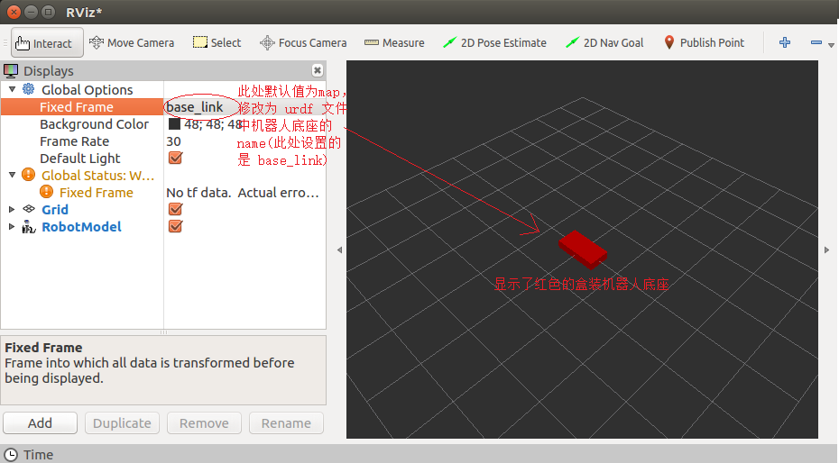

**实现流程：**

1.  准备:新建功能包，导入依赖
    
2.  核心:编写 urdf 文件
    
3.  核心:在 launch 文件集成 URDF 与 Rviz
    
4.  在 Rviz 中显示机器人模型
    

#### 1.创建功能包，导入依赖

创建一个新的功能包，名称自定义，导入依赖包:`urdf`与`xacro`

在当前功能包下，再新建几个目录:

`urdf`: 存储 urdf 文件的目录

`meshes`:机器人模型渲染文件(暂不使用)

`config`: 配置文件

`launch`: 存储 launch 启动文件

#### 2.编写 URDF 文件

新建一个子级文件夹:`urdf`(可选)，文件夹中添加一个`.urdf`文件,复制如下内容:

demo01_helloworld.urdf

```xml
<robot name="mycar">
    <link name="base_link">
        <visual>
            <geometry>
                <box size="0.5 0.2 0.1" />
            </geometry>
        </visual>
    </link>
</robot>
```

#### 3.在 launch 文件中集成 URDF 与 Rviz

在`launch`目录下，新建一个 launch 文件，该 launch 文件需要启动 Rviz，并导入 urdf 文件，Rviz 启动后可以自动载入解析`urdf`文件，并显示机器人模型，核心问题:如何导入 urdf 文件? 在 ROS 中，可以将 urdf 文件的路径设置到参数服务器，使用的参数名是:`robot_description`,示例代码如下:

```xml
<launch>

    <!-- 设置参数 -->
    <param name="robot_description" textfile="$(find urdf01_rviz)/urdf/urdf/demo01_helloworld.urdf" />

    <!-- 启动 rviz -->
    <node pkg="rviz" type="rviz" name="rviz" />

</launch>
```

#### 4.在 Rviz 中显示机器人模型

rviz 启动后，会发现并没有盒装的机器人模型，这是因为默认情况下没有添加机器人显示组件，需要手动添加，添加方式如下: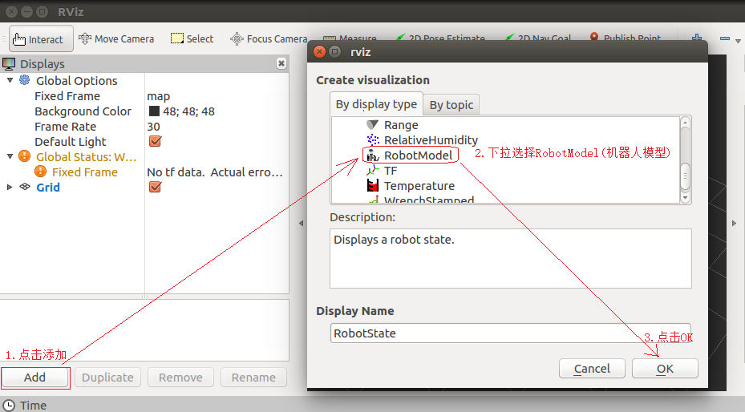

设置完毕后，可以正常显示了

#### 5.优化 rviz 启动

重复启动`launch`文件时，Rviz 之前的组件配置信息不会自动保存，需要重复执行步骤4的操作，为了方便使用，可以使用如下方式优化:

首先，将当前配置保存进`config`目录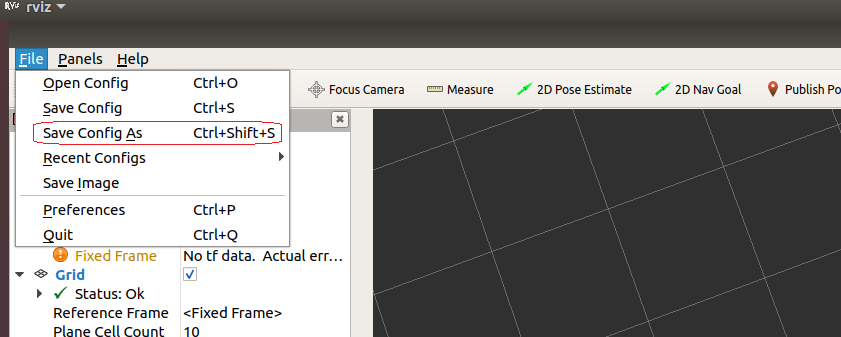然后，`launch`文件中 Rviz 的启动配置添加参数:`args`,值设置为`-d 配置文件路径`

demo01_helloworld.launch

```xml
<launch>

    <!-- 设置参数 -->
    <param name="robot_description" textfile="$(find urdf01_rviz)/urdf/urdf/demo01_helloworld.urdf" />

    <!-- 启动 rviz -->
    <node pkg="rviz" type="rviz" name="rviz" args="-d $(find urdf01_rviz)/config/show_mycar.rviz" />

</launch>
```

再启动时，就可以包含之前的组件配置了，使用更方便快捷。

### 6.3 URDF语法详解

URDF 文件是一个标准的 XML 文件，在 ROS 中预定义了一系列的标签用于描述机器人模型，机器人模型可能较为复杂，但是 ROS 的 URDF 中机器人的组成却是较为简单，可以主要简化为两部分:连杆(link标签) 与 关节(joint标签)，接下来我们就通过案例了解一下 URDF 中的不同标签:

-   robot 根标签，类似于 launch文件中的launch标签
-   link 连杆标签
-   joint 关节标签
-   gazebo 集成gazebo需要使用的标签

关于gazebo标签，后期在使用 gazebo 仿真时，才需要使用到，用于配置仿真环境所需参数，比如: 机器人材料属性、gazebo插件等，但是该标签不是机器人模型必须的，只有在仿真时才需设置

___

**另请参考:**

-   [https://wiki.ros.org/urdf/XML](https://wiki.ros.org/urdf/XML)


#### 6.3.1 01\_robot

robot

urdf 中为了保证 xml 语法的完整性，使用了`robot`标签作为根标签，所有的 link 和 joint 以及其他标签都必须包含在 robot 标签内,在该标签内可以通过 name 属性设置机器人模型的名称

1.属性

name: 指定机器人模型的名称

2.子标签

其他标签都是子级标签

#### 6.3.2 02\_link

link

urdf 中的 link 标签用于描述机器人某个部件(也即刚体部分)的外观和物理属性，比如: 机器人底座、轮子、激光雷达、摄像头...每一个部件都对应一个 link, 在 link 标签内，可以设计该部件的形状、尺寸、颜色、惯性矩阵、碰撞参数等一系列属性

1.属性

-   name ---> 为连杆命名

2.子标签

-   visual ---> 描述外观(对应的数据是可视的)
    
    -   geometry 设置连杆的形状
        
        -   标签1: box(盒状)
            
            -   属性:size=长(x) 宽(y) 高(z)
        -   标签2: cylinder(圆柱)
            
            -   属性:radius=半径 length=高度
        -   标签3: sphere(球体)
            
            -   属性:radius=半径
        -   标签4: mesh(为连杆添加皮肤)
            
            -   属性: filename=资源路径(格式:**package://<packagename>/<path>/文件**)
    -   origin 设置偏移量与倾斜弧度
        
        -   属性1: xyz=x偏移 y便宜 z偏移
            
        -   属性2: rpy=x翻滚 y俯仰 z偏航 (单位是弧度)
        
    -   metrial 设置材料属性(颜色)
        
        -   属性: name
            
        -   标签: color
            
            -   属性: rgba=红绿蓝权重值与透明度 (每个权重值以及透明度取值\[0,1\])
-   collision ---> 连杆的碰撞属性
    
-   Inertial ---> 连杆的惯性矩阵
    

在此，只演示`visual`使用。

3.案例

机器人模型下载：[zx595306686/sim_demo](https://github.com/zx595306686/sim_demo)

**需求:**分别生成长方体、圆柱与球体的机器人部件

demo02_link.urdf

```xml
<robot name="mycar">
    <link name="base_link">
        <visual>
            <!-- 形状 -->
            <geometry>
                <!-- 长方体的长宽高 -->
                <!-- <box size="0.5 0.3 0.1" /> -->
                <!-- 圆柱，半径和长度 -->
                <!-- <cylinder radius="0.5" length="0.1" /> -->
                <!-- 球体，半径-->
                <!-- <sphere  radius="0.3" /> -->
                <!-- 皮肤 -->
                <mesh filename="package://urdf01_rviz/meshes/autolabor_mini.stl" />               

            </geometry>
            <!-- xyz坐标 rpy翻滚俯仰与偏航角度(3.14=180度 1.57=90度) -->
            <origin xyz="0 0 0" rpy="1.57 0 0" />
            <!-- 颜色: r=red g=green b=blue a=透明度 0~1-->
            <material name="car_color"> -->
                <color rgba="0.7 0.5 0 0.5" />
            </material>
        </visual>
    </link>
</robot>    
```

demo02_link.launch

```xml
<launch>

    <!-- 设置参数 -->
    <param name="robot_description" textfile="$(find urdf01_rviz)/urdf/urdf/demo02_link.urdf" />

    <!-- 启动 rviz -->
    <node pkg="rviz" type="rviz" name="rviz" args="-d $(find urdf01_rviz)/config/show_mycar.rviz" />

</launch>
```


___

#### 6.3.3 03\_joint

joint

urdf 中的 joint 标签用于描述机器人关节的运动学和动力学属性，还可以指定关节运动的安全极限，机器人的两个部件(分别称之为 parent link 与 child link)以"关节"的形式相连接，不同的关节有··不同的运动形式: 旋转、滑动、固定、旋转速度、旋转角度限制....,比如:安装在底座上的轮子可以360度旋转，而摄像头则可能是完全固定在底座上。

joint标签对应的数据在模型中是不可见的

1.属性

-   name ---> 为关节命名
    
-   type ---> 关节运动形式
    
    -   continuous: 旋转关节，可以绕单轴无限旋转
        
    -   revolute: 旋转关节，类似于 continues,但是有旋转角度限制
        
    -   prismatic: 滑动关节，沿某一轴线移动的关节，有位置极限
        
    -   planer: 平面关节，允许在平面正交方向上平移或旋转
        
    -   floating: 浮动关节，允许进行平移、旋转运动
        
    -   fixed: 固定关节，不允许运动的特殊关节
        

2.子标签

-   parent(必需的)
    
    parent link的名字是一个强制的属性：
    
    -   link:父级连杆的名字，是这个link在机器人结构树中的名字。
-   child(必需的)
    
    child link的名字是一个强制的属性：
    
    -   link:子级连杆的名字，是这个link在机器人结构树中的名字。
-   origin
    
    -   属性: xyz=各轴线上的偏移量 rpy=各轴线上的偏移弧度。
-   axis
    
    -   属性: xyz用于设置围绕哪个关节轴运动。

3.案例

**需求:**创建机器人模型，底盘为长方体，在长方体的前面添加一摄像头，摄像头可以沿着 Z 轴 360 度旋转。

**URDF文件示例如下:**

demo03_joint.urdf

```xml
<!-- 
    需求: 创建机器人模型，底盘为长方体，
         在长方体的前面添加一摄像头，
         摄像头可以沿着 Z 轴 360 度旋转

 -->
<robot name="mycar">
    <!-- 底盘 -->
    <link name="base_link">
        <visual>
            <geometry>
                <box size="0.5 0.2 0.1" />
            </geometry>
            <origin xyz="0 0 0" rpy="0 0 0" />
            <material name="blue">
                <color rgba="0 0 1.0 0.5" />
            </material>
        </visual>
    </link>

    <!-- 摄像头 -->
    <link name="camera">
        <visual>
            <geometry>
                <box size="0.02 0.05 0.05" />
            </geometry>
            <origin xyz="0 0 0" rpy="0 0 0" />
            <material name="red">
                <color rgba="1 0 0 0.5" />
            </material>
        </visual>
    </link>

    <!-- 关节 -->
    <joint name="camera2baselink" type="continuous">
        <parent link="base_link"/>
        <child link="camera" />
        <!-- 需要计算两个 link 的物理中心之间的偏移量 -->
        <origin xyz="0.2 0 0.075" rpy="0 0 0" />
        <axis xyz="0 0 1" />
    </joint>

</robot>
```

**launch文件示例如下:**

demo03_joint.launch

```xml
<launch>

    <param name="robot_description" textfile="$(find urdf01_rviz)/urdf/urdf/demo03_joint.urdf" />
    <node pkg="rviz" type="rviz" name="rviz" args="-d $(find urdf01_rviz)/config/show_mycar.rviz" /> 

    <!-- 添加关节状态发布节点 -->
    <node pkg="joint_state_publisher" type="joint_state_publisher" name="joint_state_publisher" />
    <!-- 添加机器人状态发布节点 -->
    <node pkg="robot_state_publisher" type="robot_state_publisher" name="robot_state_publisher" />
    <!-- 可选:用于控制关节运动的节点 -->
    <!-- <node pkg="joint_state_publisher_gui" type="joint_state_publisher_gui" name="joint_state_publisher_gui" /> -->

</launch>
```

PS:

1.状态发布节点在此是必须的:

2.关节运动控制节点(可选)，会生成关节控制的UI，用于测试关节运动是否正常。

5.遇到问题以及解决

**base_footprint优化urdf**

demo04_base_footprint.urdf

```xml
<!--

    使用 base_footprint 优化

-->
<robot name="mycar">
    <!-- 设置一个原点(机器人中心点的投影) -->
    <link name="base_footprint">
        <visual>
            <geometry>
                <sphere radius="0.001" />
            </geometry>
        </visual>
    </link>

    <!-- 添加底盘 -->
    <link name="base_link">
        <visual>
            <geometry>
                <box size="0.5 0.2 0.1" />
            </geometry>
            <origin xyz="0 0 0" rpy="0 0 0" />
            <material name="blue">
                <color rgba="0 0 1.0 0.5" />
            </material>
        </visual>
    </link>

    <!-- 底盘与原点连接的关节 -->
    <joint name="base_link2base_footprint" type="fixed">
        <parent link="base_footprint" />
        <child link="base_link" />
        <origin xyz="0 0 0.05" />
    </joint>

    <!-- 添加摄像头 -->
    <link name="camera">
        <visual>
            <geometry>
                <box size="0.02 0.05 0.05" />
            </geometry>
            <origin xyz="0 0 0" rpy="0 0 0" />
            <material name="red">
                <color rgba="1 0 0 0.5" />
            </material>
        </visual>
    </link>
    <!-- 关节 -->
    <joint name="camera2baselink" type="continuous">
        <parent link="base_link"/>
        <child link="camera" />
        <origin xyz="0.2 0 0.075" rpy="0 0 0" />
        <axis xyz="0 0 1" />
    </joint>

</robot>
```

demo04_base_footprint.launch

```xml
<launch>

    <param name="robot_description" textfile="$(find urdf01_rviz)/urdf/urdf/demo04_base_footprint.urdf" />
    <!-- 可选:用于控制关节运动的节点 -->
    <!-- <node pkg="joint_state_publisher_gui" type="joint_state_publisher_gui" name="joint_state_publisher_gui" /> -->

    <node pkg="rviz" type="rviz" name="rviz" args="-d $(find urdf01_rviz)/config/show_mycar.rviz" /> 

    <!-- 添加关节状态发布节点 -->
    <node pkg="joint_state_publisher" type="joint_state_publisher" name="joint_state_publisher" />
    <!-- 添加机器人状态发布节点 -->
    <node pkg="robot_state_publisher" type="robot_state_publisher" name="robot_state_publisher" />


</launch>
```


**问题1:**

命令行输出如下错误提示

```shell
UnicodeEncodeError: 'ascii' codec can't encode characters in position 463-464: ordinal not in range(128)
[joint_state_publisher-3] process has died [pid 4443, exit code 1, cmd /opt/ros/melodic/lib/joint_state_publisher/joint_state_publisher __name:=joint_state_publisher __log:=/home/rosmelodic/.ros/log/b38967c0-0acb-11eb-aee3-0800278ee10c/joint_state_publisher-3.log].
log file: /home/rosmelodic/.ros/log/b38967c0-0acb-11eb-aee3-0800278ee10c/joint_state_publisher-3*.log
```

rviz中提示坐标变换异常，导致机器人部件显示结构异常

**原因:**编码问题导致的

**解决:**去除URDF中的中文注释

**问题2:**\[ERROR\] \[1584370263.037038\]: Could not find the GUI, install the 'joint\_state\_publisher\_gui' package

**解决:**`sudo apt install ros-noetic-joint-state-publisher-gui`

```shell
UnicodeEncodeError: 'ascii' codec can't encode characters in position 10-11: ordinal not in range(128)
```

[解决方案](https://www.cnblogs.com/yhl-yh/p/6728567.html)： 问题可能是urdf文件里有中文注释    

在相应路径 /opt/ros/melodic/lib/joint_state_publisher 给相关文件添加权限 

```
sudo chmod 777 joint_state_publisher
```

分别在相应py文件里添加 

```shell
    import sys  
    reload(sys)  
    sys.setdefaultencoding('utf8')   
```

#### 6.3.4 urdf练习

**需求描述:**

创建一个四轮圆柱状机器人模型，机器人参数如下,底盘为圆柱状，半径 10cm，高 8cm，四轮由两个驱动轮和两个万向支撑轮组成，两个驱动轮半径为 3.25cm,轮胎宽度1.5cm，两个万向轮为球状，半径 0.75cm，底盘离地间距为 1.5cm(与万向轮直径一致)

**结果演示:****实现流程:**

创建机器人模型可以分步骤实现

1.  新建 urdf 文件，并与 launch 文件集成
2.  搭建底盘
3.  在底盘上添加两个驱动轮
4.  在底盘上添加两个万向轮

demo05_test.urdf

```xml
<robot name="mycar">
    <!-- 设置 base_footprint  -->
    <link name="base_footprint">
        <visual>
            <geometry>
                <sphere radius="0.001" />
            </geometry>
        </visual>
    </link>

    <!-- 添加底盘 -->
    <!-- 
        参数
            形状:圆柱 
            半径:10     cm 
            高度:8      cm 
            离地:1.5    cm
    -->
    <link name="base_link">
        <visual>
            <geometry>
                <cylinder radius="0.1" length="0.08" />
            </geometry>
            <origin xyz="0 0 0" rpy="0 0 0" />
            <material name="yellow">
                <color rgba="0.8 0.3 0.1 0.5" />
            </material>
        </visual>
    </link>

    <joint name="base_link2base_footprint" type="fixed">
        <parent link="base_footprint" />
        <child link="base_link"/>
        <!-- 关节z上的高度 = 车体高度/2+离地间距 = 0.04+0.015 = 0.055 -->
        <origin xyz="0 0 0.055" />
    </joint>

    <!-- 添加驱动轮 -->
    <!--
        驱动轮是侧翻的圆柱
        参数
            半径: 3.25 cm
            宽度: 1.5  cm
            颜色: 黑色
        关节设置:
            x = 0
            y = 底盘的半径 + 轮胎宽度 / 2
            z = 离地间距 + 底盘长度 / 2 - 轮胎半径 = 1.5 + 4 - 3.25 = 2.25(cm)
            axis = 0 1 0
    -->
    <link name="left_wheel">
        <visual>
            <geometry>
                <cylinder radius="0.0325" length="0.015" />
            </geometry>
            <origin xyz="0 0 0" rpy="1.5705 0 0" />
            <material name="black">
                <color rgba="0.0 0.0 0.0 1.0" />
            </material>
        </visual>

    </link>

    <joint name="left_wheel2base_link" type="continuous">
        <parent link="base_link" />
        <child link="left_wheel" />
        <origin xyz="0 0.1 -0.0225" />
        <axis xyz="0 1 0" />
    </joint>


    <link name="right_wheel">
        <visual>
            <geometry>
                <cylinder radius="0.0325" length="0.015" />
            </geometry>
            <origin xyz="0 0 0" rpy="1.5705 0 0" />
            <material name="black">
                <color rgba="0.0 0.0 0.0 1.0" />
            </material>
        </visual>

    </link>

    <joint name="right_wheel2base_link" type="continuous">
        <parent link="base_link" />
        <child link="right_wheel" />
        <origin xyz="0 -0.1 -0.0225" />
        <axis xyz="0 1 0" />
    </joint>

    <!-- 添加万向轮(支撑轮) -->
    <!--
        参数
            形状: 球体
            半径: 0.75 cm
            颜色: 黑色

        关节设置:
            x = 自定义(底盘半径 - 万向轮半径) = 0.1 - 0.0075 = 0.0925(cm)
            y = 0
            z = 底盘长度 / 2 + 离地间距 / 2 = 0.08 / 2 + 0.015 / 2 = 0.0475 
            axis= 1 1 1
    -->
    <link name="front_wheel">
        <visual>
            <geometry>
                <sphere radius="0.0075" />
            </geometry>
            <origin xyz="0 0 0" rpy="0 0 0" />
            <material name="black">
                <color rgba="0.0 0.0 0.0 1.0" />
            </material>
        </visual>
    </link>

    <joint name="front_wheel2base_link" type="continuous">
        <parent link="base_link" />
        <child link="front_wheel" />
        <origin xyz="0.0925 0 -0.0475" />
        <axis xyz="1 1 1" />
    </joint>

    <link name="back_wheel">
        <visual>
            <geometry>
                <sphere radius="0.0075" />
            </geometry>
            <origin xyz="0 0 0" rpy="0 0 0" />
            <material name="black">
                <color rgba="0.0 0.0 0.0 1.0" />
            </material>
        </visual>
    </link>

    <joint name="back_wheel2base_link" type="continuous">
        <parent link="base_link" />
        <child link="back_wheel" />
        <origin xyz="-0.0925 0 -0.0475" />
        <axis xyz="1 1 1" />
    </joint>
</robot>
```

demo05_test.launch

```xml
<launch>
    <!-- 将 urdf 文件内容设置进参数服务器 -->
    <param name="robot_description" textfile="$(find urdf01_rviz)/urdf/urdf/demo05_test.urdf" />

    <!-- 启动 rivz -->
    <node pkg="rviz" type="rviz" name="rviz_test" args="-d $(find urdf01_rviz)/config/show_mycar.rviz" />

    <!-- 启动机器人状态和关节状态发布节点 -->
    <node pkg="robot_state_publisher" type="robot_state_publisher" name="robot_state_publisher" />
    <node pkg="joint_state_publisher" type="joint_state_publisher" name="joint_state_publisher" />

    <!-- 启动图形化的控制关节运动节点 -->
    <node pkg="joint_state_publisher_gui" type="joint_state_publisher_gui" name="joint_state_publisher_gui" />

</launch>
```

#### 6.3.5 urdf工具

#### 6.3.5 URDF工具

在 ROS 中，提供了一些工具来方便 URDF 文件的编写，比如:

-   `check_urdf`命令可以检查复杂的 urdf 文件是否存在语法问题
    
-   `urdf_to_graphiz`命令可以查看 urdf 模型结构，显示不同 link 的层级关系
    

当然，要使用工具之前，首先需要安装，安装命令:`sudo apt install liburdfdom-tools`

#### 1.check\_urdf 语法检查

进入urdf文件所属目录，调用:`check_urdf urdf文件`，如果不抛出异常，说明文件合法,否则非法

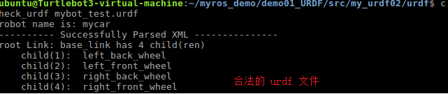

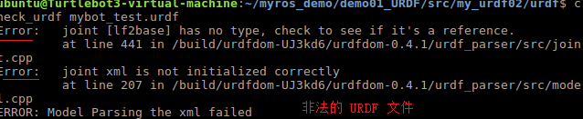

#### 2.urdf\_to\_graphiz 结构查看

进入urdf文件所属目录，调用:`urdf_to_graphiz urdf文件`，当前目录下会生成 pdf 文件

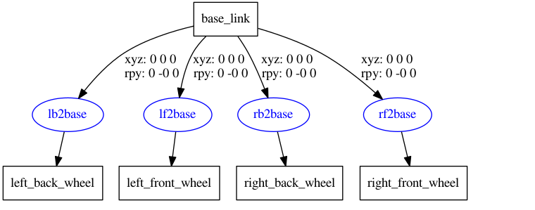

```shell
book@100ask:~/ws/src/urdf01_rviz/urdf/urdf$ check_urdf demo05_test.urdf 
robot name is: mycar
---------- Successfully Parsed XML ---------------
root Link: base_footprint has 1 child(ren)
    child(1):  base_link
        child(1):  back_wheel
        child(2):  front_wheel
        child(3):  left_wheel
        child(4):  right_wheel
book@100ask:~/ws/src/urdf01_rviz/urdf/urdf$ urdf_to_graphiz demo05_test.urdf 
Created file mycar.gv
Created file mycar.pdf
book@100ask:~/ws/src/urdf01_rviz/urdf/urdf$ evince mycar.pdf
```

### 6.4 URDF优化_xacro

前面 URDF 文件构建机器人模型的过程中，存在若干问题。

> 问题1:在设计关节的位置时，需要按照一定的公式计算，公式是固定的，但是在 URDF 中依赖于人工计算，存在不便，容易计算失误，且当某些参数发生改变时，还需要重新计算。
>
> 问题2:URDF 中的部分内容是高度重复的，驱动轮与支撑轮的设计实现，不同轮子只是部分参数不同，形状、颜色、翻转量都是一致的，在实际应用中，构建复杂的机器人模型时，更是易于出现高度重复的设计，按照一般的编程涉及到重复代码应该考虑封装。
>
> ......

如果在编程语言中，可以通过变量结合函数直接解决上述问题，在 ROS 中，已经给出了类似编程的优化方案，称之为:**Xacro**

___

**概念**

Xacro 是 XML Macros 的缩写，Xacro 是一种 XML 宏语言，是可编程的 XML。

**原理**

Xacro 可以声明变量，可以通过数学运算求解，使用流程控制控制执行顺序，还可以通过类似函数的实现，封装固定的逻辑，将逻辑中需要的可变的数据以参数的方式暴露出去，从而提高代码复用率以及程序的安全性。

**作用**

较之于纯粹的 URDF 实现，可以编写更安全、精简、易读性更强的机器人模型文件，且可以提高编写效率。

___

**另请参考:**

-   [http://wiki.ros.org/xacro](http://wiki.ros.org/xacro)

#### 6.4.1 快速体验

**目的:**简单了解 xacro 的基本语法。

**需求描述:**

使用xacro优化上一节案例中驱动轮实现，需要使用变量封装底盘的半径、高度，使用数学公式动态计算底盘的关节点坐标，使用 Xacro 宏封装轮子重复的代码并调用宏创建两个轮子(注意: 在此，演示 Xacro 的基本使用，不必要生成合法的 URDF )。

**准备:**

创建功能包，导入 urdf 与 xacro。

1.Xacro文件编写

编写 Xacro 文件，以变量的方式封装属性(常量半径、高度、车轮半径...)，以函数的方式封装重复实现(车轮的添加)。

demo01_helloworld.urdf.xacro

```xml
<robot name="mycar" xmlns:xacro="http://wiki.ros.org/xacro">
    <!-- 属性封装 -->
    <xacro:property name="wheel_radius" value="0.0325" />
    <xacro:property name="wheel_length" value="0.0015" />
    <xacro:property name="PI" value="3.1415927" />
    <xacro:property name="base_link_length" value="0.08" />
    <xacro:property name="lidi_space" value="0.015" />

    <!-- 宏 -->
    <xacro:macro name="wheel_func" params="wheel_name flag" >
        <link name="${wheel_name}_wheel">
            <visual>
                <geometry>
                    <cylinder radius="${wheel_radius}" length="${wheel_length}" />
                </geometry>

                <origin xyz="0 0 0" rpy="${PI / 2} 0 0" />

                <material name="wheel_color">
                    <color rgba="0 0 0 0.3" />
                </material>
            </visual>
        </link>

        <!-- 3-2.joint -->
        <joint name="${wheel_name}2link" type="continuous">
            <parent link="base_link"  />
            <child link="${wheel_name}_wheel" />
            <!-- 
                x 无偏移
                y 车体半径
                z z= 车体高度 / 2 + 离地间距 - 车轮半径

            -->
            <origin xyz="0 ${0.1 * flag} ${(base_link_length / 2 + lidi_space - wheel_radius) * -1}" rpy="0 0 0" />
            <axis xyz="0 1 0" />
        </joint>

    </xacro:macro>
    <xacro:wheel_func wheel_name="left" flag="1" />
    <xacro:wheel_func wheel_name="right" flag="-1" />
</robot>
```

2.Xacro文件转换成 urdf 文件

命令行进入 xacro文件 所属目录，执行:`rosrun xacro xacro xxx.xacro > xxx.urdf`, 会将 xacro 文件解析为 urdf 文件，内容如下:

```xml
<?xml version="1.0" ?>
<!-- =================================================================================== -->
<!-- |    This document was autogenerated by xacro from test.xacro                     | -->
<!-- |    EDITING THIS FILE BY HAND IS NOT RECOMMENDED                                 | -->
<!-- =================================================================================== -->
<robot name="mycar">
  <link name="left_wheel">
    <visual>
      <geometry>
        <cylinder length="0.0015" radius="0.0325"/>
      </geometry>
      <origin rpy="1.57079635 0 0" xyz="0 0 0"/>
      <material name="wheel_color">
        <color rgba="0 0 0 0.3"/>
      </material>
    </visual>
  </link>
  <!-- 3-2.joint -->
  <joint name="left2link" type="continuous">
    <parent link="base_link"/>
    <child link="left_wheel"/>
    <!-- 
                x 无偏移
                y 车体半径
                z z= 车体高度 / 2 + 离地间距 - 车轮半径

            -->
    <origin rpy="0 0 0" xyz="0 0.1 -0.0225"/>
    <axis xyz="0 1 0"/>
  </joint>
  <link name="right_wheel">
    <visual>
      <geometry>
        <cylinder length="0.0015" radius="0.0325"/>
      </geometry>
      <origin rpy="1.57079635 0 0" xyz="0 0 0"/>
      <material name="wheel_color">
        <color rgba="0 0 0 0.3"/>
      </material>
    </visual>
  </link>
  <!-- 3-2.joint -->
  <joint name="right2link" type="continuous">
    <parent link="base_link"/>
    <child link="right_wheel"/>
    <!-- 
                x 无偏移
                y 车体半径
                z z= 车体高度 / 2 + 离地间距 - 车轮半径

            -->
    <origin rpy="0 0 0" xyz="0 -0.1 -0.0225"/>
    <axis xyz="0 1 0"/>
  </joint>
</robot>
```

注意: 该案例编写生成的是非法的 URDF 文件，目的在于演示 Xacro 的极简使用以及优点。

#### 6.4.2 语法详解

xacro 提供了可编程接口，类似于计算机语言，包括变量声明调用、函数声明与调用等语法实现。在使用 xacro 生成 urdf 时，根标签`robot`中必须包含命名空间声明:`xmlns:xacro="http://wiki.ros.org/xacro"`

1.属性与算数运算

用于封装 URDF 中的一些字段，比如: PAI 值，小车的尺寸，轮子半径 ....

**属性定义**

```xml
<xacro:property name="xxxx" value="yyyy" />
```

**属性调用**

```xml
${属性名称}
```

**算数运算**

```xml
${数学表达式}
```

2.宏

类似于函数实现，提高代码复用率，优化代码结构，提高安全性

**宏定义**

```xml
<xacro:macro name="宏名称" params="参数列表(多参数之间使用空格分隔)">

    .....

    参数调用格式: ${参数名}

</xacro:macro>
```

**宏调用**

```xml
<xacro:宏名称 参数1=xxx 参数2=xxx/>
```

3.文件包含

机器人由多部件组成，不同部件可能封装为单独的 xacro 文件，最后再将不同的文件集成，组合为完整机器人，可以使用文件包含实现

**文件包含**

```xml
<robot name="xxx" xmlns:xacro="http://wiki.ros.org/xacro">
      <xacro:include filename="my_base.xacro" />
      <xacro:include filename="my_camera.xacro" />
      <xacro:include filename="my_laser.xacro" />
      ....
</robot>
```

属性与算数运算 实例

demo02_field.urdf.xacro

```xml
<robot name="mycar" xmlns:xacro="http://wiki.ros.org/xacro">
    <!-- 1.属性定义 -->
    <xacro:property name="PI" value="3.1415927" />
    <xacro:property name="radius" value="0.03" />
    <!-- 2.属性调用 -->
    <myUsePropertyxxx name="${PI}" />
    <myUsePropertyxxx name="${radius}" />
    <!-- 3.算数运算 -->
    <myUsePropertyYyy result="${PI / 2}" />
    <myUsePropertyYyy result="${radius * 2}" />

</robot>
```

```shell
book@100ask:~/ws/src/urdf01_rviz/urdf/xacro$ rosrun xacro xacro demo02_field.urdf.xacro 
<?xml version="1.0" encoding="utf-8"?>
<!-- =================================================================================== -->
<!-- |    This document was autogenerated by xacro from demo02_field.urdf.xacro        | -->
<!-- |    EDITING THIS FILE BY HAND IS NOT RECOMMENDED                                 | -->
<!-- =================================================================================== -->
<robot name="mycar">
  <!-- 2.属性调用 -->
  <myUsePropertyxxx name="3.1415927"/>
  <myUsePropertyxxx name="0.03"/>
  <!-- 3.算数运算 -->
  <myUsePropertyYyy result="1.57079635"/>
  <myUsePropertyYyy result="0.06"/>
</robot>
```

宏定义 实例

demo03_macro.urdf.xacro

```xml
<robot name="mycar" xmlns:xacro="http://wiki.ros.org/xacro">
    <!-- 1.宏定义 -->
    <xacro:macro name="getSum" params="num1 num2">
        <result value="${num1 + num2}" />
    </xacro:macro>
    <!-- 2.宏调用 -->
    <xacro:getSum num1="1" num2="5" />

</robot>
```

```shell
book@100ask:~/ws/src/urdf01_rviz/urdf/xacro$ rosrun xacro xacro demo03_macro.urdf.xacro 
<?xml version="1.0" encoding="utf-8"?>
<!-- =================================================================================== -->
<!-- |    This document was autogenerated by xacro from demo03_macro.urdf.xacro        | -->
<!-- |    EDITING THIS FILE BY HAND IS NOT RECOMMENDED                                 | -->
<!-- =================================================================================== -->
<robot name="mycar">
  <result value="6"/>
</robot>
```

文件包含实例

demo04_sum.urdf.xacro 

```xml
<robot name="mycar" xmlns:xacro="http://wiki.ros.org/xacro">
    <!-- 演示文件包含 -->
    <xacro:include filename="demo02_field.urdf.xacro" />
    <xacro:include filename="demo03_macro.urdf.xacro" />
</robot>
```

```shell
book@100ask:~/ws/src/urdf01_rviz/urdf/xacro$ rosrun xacro xacro demo04_sum.urdf.xacro 
<?xml version="1.0" encoding="utf-8"?>
<!-- =================================================================================== -->
<!-- |    This document was autogenerated by xacro from demo04_sum.urdf.xacro          | -->
<!-- |    EDITING THIS FILE BY HAND IS NOT RECOMMENDED                                 | -->
<!-- =================================================================================== -->
<robot name="mycar">
  <!-- 2.属性调用 -->
  <myUsePropertyxxx name="3.1415927"/>
  <myUsePropertyxxx name="0.03"/>
  <!-- 3.算数运算 -->
  <myUsePropertyYyy result="1.57079635"/>
  <myUsePropertyYyy result="0.06"/>
  <result value="6"/>
</robot>
```

#### 6.4.3 完整流程


**需求描述:**

使用 Xacro 优化 URDF 版的小车底盘模型实现

**结果演示:**


1.编写 Xacro 文件

demo05_car_base.urdf.xacro

```xml
<!--
    使用 xacro 优化 URDF 版的小车底盘实现：

    实现思路:
    1.将一些常量、变量封装为 xacro:property
      比如:PI 值、小车底盘半径、离地间距、车轮半径、宽度 ....
    2.使用 宏 封装驱动轮以及支撑轮实现，调用相关宏生成驱动轮与支撑轮

-->
<!-- 根标签，必须声明 xmlns:xacro -->
<robot name="my_base" xmlns:xacro="http://www.ros.org/wiki/xacro">
    <!-- 封装变量、常量 -->
    <xacro:property name="PI" value="3.141"/>
    <!-- 宏:黑色设置 -->
    <material name="black">
        <color rgba="0.0 0.0 0.0 1.0" />
    </material>
    <!-- 底盘属性 -->
    <xacro:property name="base_footprint_radius" value="0.001" /> <!-- base_footprint 半径  -->
    <xacro:property name="base_link_radius" value="0.1" /> <!-- base_link 半径 -->
    <xacro:property name="base_link_length" value="0.08" /> <!-- base_link 长 -->
    <xacro:property name="earth_space" value="0.015" /> <!-- 离地间距 -->

    <!-- 底盘 -->
    <link name="base_footprint">
      <visual>
        <geometry>
          <sphere radius="${base_footprint_radius}" />
        </geometry>
      </visual>
    </link>

    <link name="base_link">
      <visual>
        <geometry>
          <cylinder radius="${base_link_radius}" length="${base_link_length}" />
        </geometry>
        <origin xyz="0 0 0" rpy="0 0 0" />
        <material name="yellow">
          <color rgba="0.5 0.3 0.0 0.5" />
        </material>
      </visual>
    </link>

    <joint name="base_link2base_footprint" type="fixed">
      <parent link="base_footprint" />
      <child link="base_link" />
      <origin xyz="0 0 ${earth_space + base_link_length / 2 }" />
    </joint>

    <!-- 驱动轮 -->
    <!-- 驱动轮属性 -->
    <xacro:property name="wheel_radius" value="0.0325" /><!-- 半径 -->
    <xacro:property name="wheel_length" value="0.015" /><!-- 宽度 -->
    <!-- 驱动轮宏实现 -->
    <xacro:macro name="add_wheels" params="name flag">
      <link name="${name}_wheel">
        <visual>
          <geometry>
            <cylinder radius="${wheel_radius}" length="${wheel_length}" />
          </geometry>
          <origin xyz="0.0 0.0 0.0" rpy="${PI / 2} 0.0 0.0" />
          <material name="black" />
        </visual>
      </link>

      <joint name="${name}_wheel2base_link" type="continuous">
        <parent link="base_link" />
        <child link="${name}_wheel" />
        <origin xyz="0 ${flag * base_link_radius} ${-(earth_space + base_link_length / 2 - wheel_radius) }" />
        <axis xyz="0 1 0" />
      </joint>
    </xacro:macro>
    <xacro:add_wheels name="left" flag="1" />
    <xacro:add_wheels name="right" flag="-1" />
    <!-- 支撑轮 -->
    <!-- 支撑轮属性 -->
    <xacro:property name="support_wheel_radius" value="0.0075" /> <!-- 支撑轮半径 -->

    <!-- 支撑轮宏 -->
    <xacro:macro name="add_support_wheel" params="name flag" >
      <link name="${name}_wheel">
        <visual>
            <geometry>
                <sphere radius="${support_wheel_radius}" />
            </geometry>
            <origin xyz="0 0 0" rpy="0 0 0" />
            <material name="black" />
        </visual>
      </link>

      <joint name="${name}_wheel2base_link" type="continuous">
          <parent link="base_link" />
          <child link="${name}_wheel" />
          <origin xyz="${flag * (base_link_radius - support_wheel_radius)} 0 ${-(base_link_length / 2 + earth_space / 2)}" />
          <axis xyz="1 1 1" />
      </joint>
    </xacro:macro>

    <xacro:add_support_wheel name="front" flag="1" />
    <xacro:add_support_wheel name="back" flag="-1" />

</robot>
```

2.集成launch文件

**方式1:**先将 xacro 文件转换出 urdf 文件，然后集成

先将 xacro 文件解析成 urdf 文件:`rosrun xacro xacro xxx.xacro > xxx.urdf`然后再按照之前的集成方式直接整合 launch 文件,内容示例:

```xml
<launch>
    <param name="robot_description" textfile="$(find demo01_urdf_helloworld)/urdf/xacro/my_base.urdf" />

    <node pkg="rviz" type="rviz" name="rviz" args="-d $(find demo01_urdf_helloworld)/config/helloworld.rviz" />
    <node pkg="joint_state_publisher" type="joint_state_publisher" name="joint_state_publisher" output="screen" />
    <node pkg="robot_state_publisher" type="robot_state_publisher" name="robot_state_publisher" output="screen" />
    <node pkg="joint_state_publisher_gui" type="joint_state_publisher_gui" name="joint_state_publisher_gui" output="screen" />

</launch>
```

**方式2:**在 launch 文件中直接加载 xacro(**建议使用**)

launch 内容示例:

```xml
<launch>
    <param name="robot_description" command="$(find xacro)/xacro $(find urdf01_rviz)/urdf/xacro/demo05_car_base.urdf.xacro" />

    <node pkg="rviz" type="rviz" name="rviz" args="-d $(find urdf01_rviz)/config/base_footprint.rviz" />
    <node pkg="joint_state_publisher" type="joint_state_publisher" name="joint_state_publisher" output="screen" />
    <node pkg="robot_state_publisher" type="robot_state_publisher" name="robot_state_publisher" output="screen" />
    <node pkg="joint_state_publisher_gui" type="joint_state_publisher_gui" name="joint_state_publisher_gui" output="screen" />

</launch>
```

核心代码:

```xml
<param name="robot_description" command="$(find xacro)/xacro $(find demo01_urdf_helloworld)/urdf/xacro/my_base.urdf.xacro" />
```

加载`robot_description`时使用`command`属性，属性值就是调用 xacro 功能包的 xacro 程序直接解析 xacro 文件。

#### 6.4.4 多文件实操

**需求描述:**

在前面小车底盘基础之上，添加摄像头和雷达传感器。

**结果演示:**

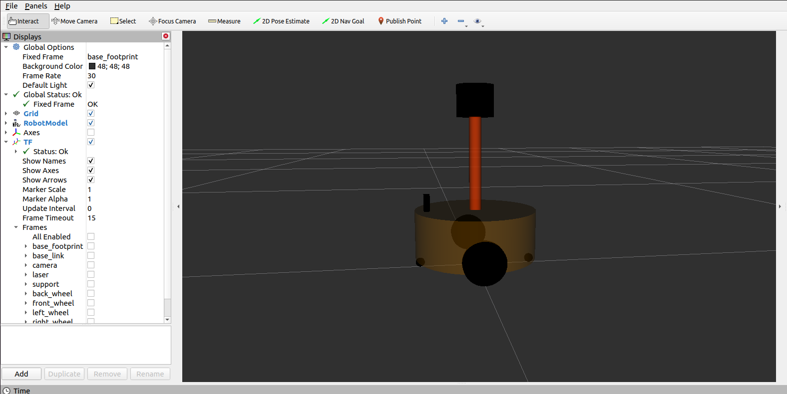

**实现分析:**

机器人模型由多部件组成，可以将不同组件设置进单独文件，最终通过文件包含实现组件的拼装。

**实现流程:**

1.  首先编写摄像头和雷达的 xacro 文件
    
2.  然后再编写一个组合文件，组合底盘、摄像头与雷达
    
3.  最后，通过 launch 文件启动 Rviz 并显示模型
    

1.摄像头和雷达 Xacro 文件实现

摄像头 xacro 文件:

demo06_car_camera.urdf.xacro

```xml
<!-- 摄像头相关的 xacro 文件 -->
<robot name="my_camera" xmlns:xacro="http://wiki.ros.org/xacro">
    <!-- 摄像头属性 -->
    <xacro:property name="camera_length" value="0.01" /> <!-- 摄像头长度(x) -->
    <xacro:property name="camera_width" value="0.025" /> <!-- 摄像头宽度(y) -->
    <xacro:property name="camera_height" value="0.025" /> <!-- 摄像头高度(z) -->
    <xacro:property name="camera_x" value="0.08" /> <!-- 摄像头安装的x坐标 -->
    <xacro:property name="camera_y" value="0.0" /> <!-- 摄像头安装的y坐标 -->
    <xacro:property name="camera_z" value="${base_link_length / 2 + camera_height / 2}" /> <!-- 摄像头安装的z坐标:底盘高度 / 2 + 摄像头高度 / 2  -->

    <!-- 摄像头关节以及link -->
    <link name="camera">
        <visual>
            <geometry>
                <box size="${camera_length} ${camera_width} ${camera_height}" />
            </geometry>
            <origin xyz="0.0 0.0 0.0" rpy="0.0 0.0 0.0" />
            <material name="black" />
        </visual>
    </link>

    <joint name="camera2base_link" type="fixed">
        <parent link="base_link" />
        <child link="camera" />
        <origin xyz="${camera_x} ${camera_y} ${camera_z}" />
    </joint>
</robot>
```

雷达 xacro 文件:

demo07_car_laser.urdf.xacro

```xml
<!--
    小车底盘添加雷达
-->
<robot name="my_laser" xmlns:xacro="http://wiki.ros.org/xacro">

    <!-- 雷达支架 -->
    <xacro:property name="support_length" value="0.15" /> <!-- 支架长度 -->
    <xacro:property name="support_radius" value="0.01" /> <!-- 支架半径 -->
    <xacro:property name="support_x" value="0.0" /> <!-- 支架安装的x坐标 -->
    <xacro:property name="support_y" value="0.0" /> <!-- 支架安装的y坐标 -->
    <xacro:property name="support_z" value="${base_link_length / 2 + support_length / 2}" /> <!-- 支架安装的z坐标:底盘高度 / 2 + 支架高度 / 2  -->

    <link name="support">
        <visual>
            <geometry>
                <cylinder radius="${support_radius}" length="${support_length}" />
            </geometry>
            <origin xyz="0.0 0.0 0.0" rpy="0.0 0.0 0.0" />
            <material name="red">
                <color rgba="0.8 0.2 0.0 0.8" />
            </material>
        </visual>
    </link>

    <joint name="support2base_link" type="fixed">
        <parent link="base_link" />
        <child link="support" />
        <origin xyz="${support_x} ${support_y} ${support_z}" />
    </joint>


    <!-- 雷达属性 -->
    <xacro:property name="laser_length" value="0.05" /> <!-- 雷达长度 -->
    <xacro:property name="laser_radius" value="0.03" /> <!-- 雷达半径 -->
    <xacro:property name="laser_x" value="0.0" /> <!-- 雷达安装的x坐标 -->
    <xacro:property name="laser_y" value="0.0" /> <!-- 雷达安装的y坐标 -->
    <xacro:property name="laser_z" value="${support_length / 2 + laser_length / 2}" /> <!-- 雷达安装的z坐标:支架高度 / 2 + 雷达高度 / 2  -->

    <!-- 雷达关节以及link -->
    <link name="laser">
        <visual>
            <geometry>
                <cylinder radius="${laser_radius}" length="${laser_length}" />
            </geometry>
            <origin xyz="0.0 0.0 0.0" rpy="0.0 0.0 0.0" />
            <material name="black" />
        </visual>
    </link>

    <joint name="laser2support" type="fixed">
        <parent link="support" />
        <child link="laser" />
        <origin xyz="${laser_x} ${laser_y} ${laser_z}" />
    </joint>
</robot>
```

2.组合底盘摄像头与雷达的 xacro 文件

car.urdf.xacro

```xml
<!-- 组合小车底盘与摄像头与雷达 -->
<robot name="my_car_camera" xmlns:xacro="http://wiki.ros.org/xacro">
    <xacro:include filename="my_base.urdf.xacro" />
    <xacro:include filename="my_camera.urdf.xacro" />
    <xacro:include filename="my_laser.urdf.xacro" />
</robot>
```

3.launch 文件

demo06_car_base.launch

```xml
<launch>
    <param name="robot_description" command="$(find xacro)/xacro $(find urdf01_rviz)/urdf/xacro/demo05_car_base.urdf.xacro" />

    <node pkg="rviz" type="rviz" name="rviz" args="-d $(find urdf01_rviz)/config/base_footprint.rviz" />
    <node pkg="joint_state_publisher" type="joint_state_publisher" name="joint_state_publisher" output="screen" />
    <node pkg="robot_state_publisher" type="robot_state_publisher" name="robot_state_publisher" output="screen" />
    <node pkg="joint_state_publisher_gui" type="joint_state_publisher_gui" name="joint_state_publisher_gui" output="screen" />

</launch>
```

### 6.5控制机器人运动

6.5.1 Arbotix使用流程

接下来，通过一个案例演示 arbotix 的使用。

**需求描述:**

控制机器人模型在 rviz 中做圆周运动

**结果演示:**

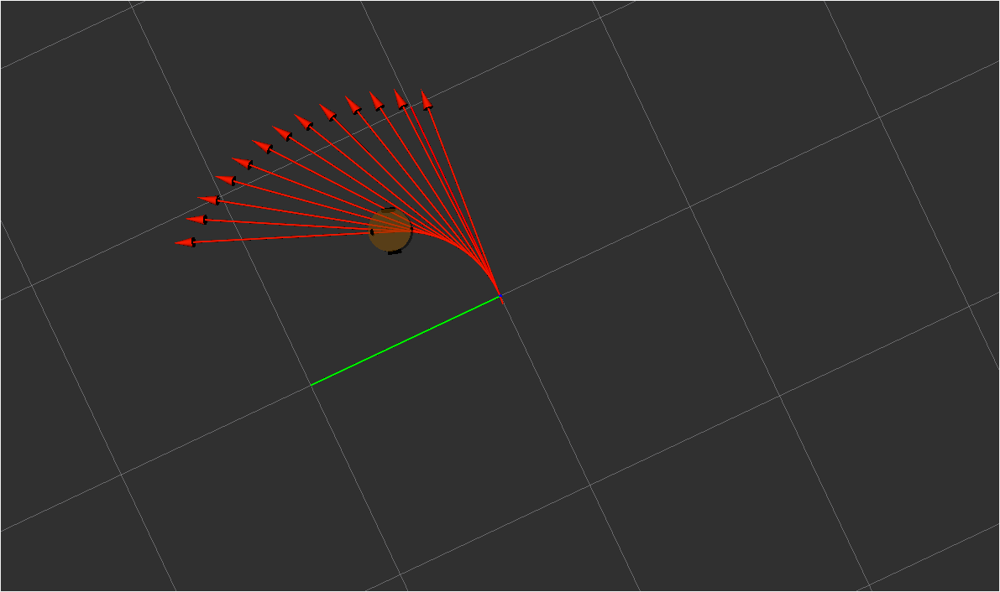

**实现流程:**

1.  安装 Arbotix
    
2.  创建新功能包，准备机器人 urdf、xacro 文件
    
3.  添加 Arbotix 配置文件
    
4.  编写 launch 文件配置 Arbotix
    
5.  启动 launch 文件并控制机器人模型运动
    

1.安装 Arbotix

**方式1:**命令行调用

```
sudo apt-get install ros-<<VersionName()>>-arbotix
```

将 <<VsersionName()>> 替换成当前 ROS 版本名称，如果提示功能包无法定位，请采用方式2。

**方式2:**源码安装

先从 github 下载源码，然后调用 catkin\_make 编译

```
git clone https://github.com/vanadiumlabs/arbotix_ros.git
```

2.创建新功能包，准备机器人 urdf、xacro

urdf 和 xacro 调用上一讲实现即可

3.添加 arbotix 所需的配置文件

**添加 arbotix 所需配置文件**

config/control.yaml

```xml
# 该文件是控制器配置,一个机器人模型可能有多个控制器，比如: 底盘、机械臂、夹持器(机械手)....
# 因此，根 name 是 controller
controllers: {
   # 单控制器设置
   base_controller: {
          #类型: 差速控制器
       type: diff_controller,
       #参考坐标
       base_frame_id: base_footprint, 
       #两个轮子之间的间距
       base_width: 0.2,
       #控制频率
       ticks_meter: 2000, 
       #PID控制参数，使机器人车轮快速达到预期速度
       Kp: 12, 
       Kd: 12, 
       Ki: 0, 
       Ko: 50, 
       #加速限制
       accel_limit: 1.0 
    }
}
```

**另请参考:** [http://wiki.ros.org/arbotix\_python/diff\_controller](http://wiki.ros.org/arbotix_python/diff_controller)

4.launch 文件中配置 arbotix 节点

**launch 示例代码**

demo07_control.launch

```xml
<launch>
    <!-- 将 urdf 文件内容设置进参数服务器 -->
    <param name="robot_description" command="$(find xacro)/xacro $(find urdf01_rviz)/urdf/xacro/car.urdf.xacro" />

    <!-- 启动 rivz -->
    <node pkg="rviz" type="rviz" name="rviz" args="-d $(find urdf01_rviz)/config/base_footprint.rviz" />

    <!-- 启动机器人状态和关节状态发布节点 -->
    <node pkg="joint_state_publisher" type="joint_state_publisher" name="joint_state_publisher" output="screen" />
    <node pkg="robot_state_publisher" type="robot_state_publisher" name="robot_state_publisher" output="screen" />

    <!-- 启动图形化的控制关节运动节点 -->
    <node pkg="joint_state_publisher_gui" type="joint_state_publisher_gui" name="joint_state_publisher_gui" output="screen" />

    <!-- 集成 arbotix 运动控制节点，并且加载参数 -->
    <node pkg="arbotix_python" type="arbotix_driver" name="driver" output="screen">
        <rosparam command="load" file="$(find urdf01_rviz)/config/control.yaml" />
        <param name="sim" value="true" />
    </node>

</launch>
```

代码解释:

<node> 调用了 arbotix\_python 功能包下的 arbotix\_driver 节点

<rosparam> arbotix 驱动机器人运行时，需要获取机器人信息，可以通过 file 加载配置文件

<param> 在仿真环境下，需要配置 sim 为 true

5.启动 launch 文件并控制机器人模型运动

**启动launch:**roslaunch xxxx ....launch

**配置 rviz:**

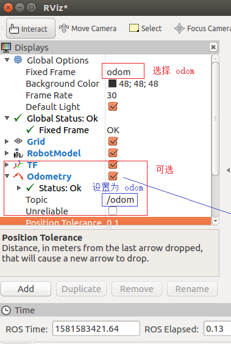

**控制小车运动:**

此时调用 rostopic list 会发现一个熟悉的话题: /cmd\_vel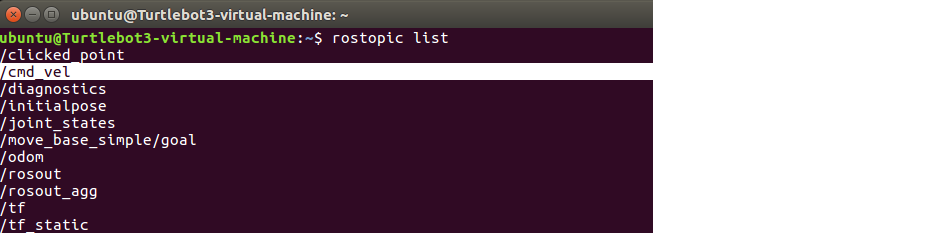也就说我们可以发布 cmd\_vel 话题消息控制小陈运动了，该实现策略有多种，可以另行编写节点，或者更简单些可以直接通过如下命令发布消息:

```shell
book@100ask:~$ rostopic list
/clicked_point
/cmd_vel
/diagnostics
/initialpose
/joint_states
/move_base_simple/goal
/odom
/rosout
/rosout_agg
/tf
/tf_static
book@100ask:~$ rostopic pub -r 10 /cmd_vel geometry_msgs/Twist "linear:
  x: 1.0
  y: 0.0
  z: 0.0
angular:
  x: 0.0
  y: 0.0
  z: 1.0" 
```

现在，小车就可以运动起来了。

___

**另请参考:**

-   [http://wiki.ros.org/arbotix](http://wiki.ros.org/arbotix)

### 6.6 gazebo

URDF 需要集成进 Rviz 或 Gazebo 才能显示可视化的机器人模型，前面已经介绍了URDF 与 Rviz 的集成，本节主要介绍:

-   URDF 与 Gazebo 的基本集成流程；
-   如果要在 Gazebo 中显示机器人模型，URDF 需要做的一些额外配置；
-   关于Gazebo仿真环境的搭建。

#### 6.6.0 gazebo闪退解决


[/\*wywy\*/](https://blog.csdn.net/qq_44360908 "/*wywy*/")  于 2021-06-14 20:43:37 发布

  今天为了能让小车导航用上更好更精确的地图，想到在gazebo里建一个仿真的环境来建图，开开心心的用Building Editor画完，保存[模型](https://edu.csdn.net/cloud/ml_summit?utm_source=glcblog&spm=1001.2101.3001.7020)，选中模型，果断点击放置，~美滋滋~。。。。。个pi。。。。

报错：gzclient: /build/ogre-1.9-B6QkmW/ogre-1.9-1.9.0+dfsg1/OgreMain/src/OgreNode.cpp:630：[virtual](https://so.csdn.net/so/search?q=virtual&spm=1001.2101.3001.7020) void Ogre::Node::setScale([const](https://edu.csdn.net/cloud/houjie?utm_source=highword&spm=1001.2101.3001.7020) Ogre::Vector3&): 假设 ‘!inScale.isNaN() && "Invalid vector supplied as parameter"’ 失败。  
escalating to SIGKILL on server

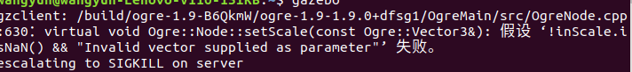

  画了大半天和我说不能放置？一点击放置gazebo马上闪退，真是搞人心态。网上艘了一圈发现可能是gazebo的版本过低了。。。。都gazebo9了还低的吗。。。。无奈之下还是选择升级一下好了，万一就可以了呢。

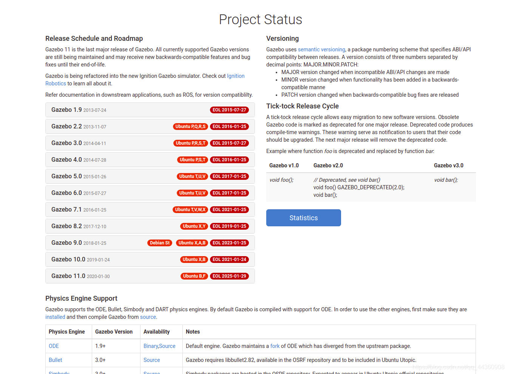

  看了一下版本，直接上11好了。冒着环境崩掉的危险开始重装gazebo。

  卸载之前确定一下版本

> $ gazebo --version

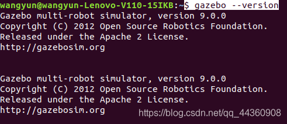

  查看一下gazebo相关插件

> $ dpkg -l | grep gazebo

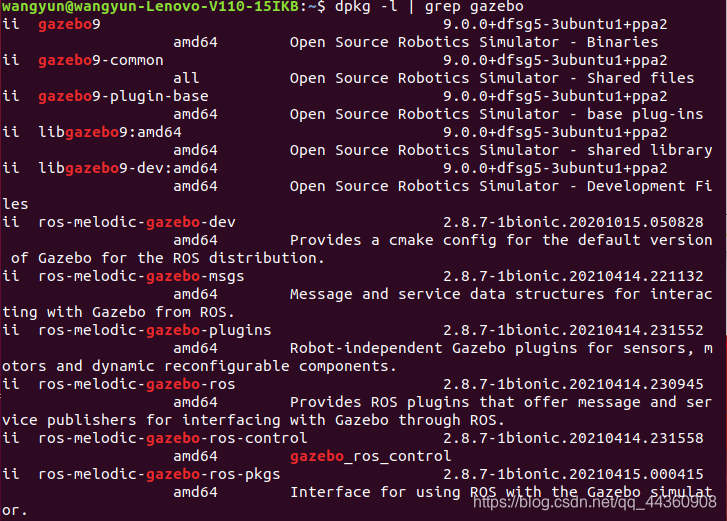

  好家伙还挺多，心里建设了一下，敲下了下面这句

> $ sudo apt-get remove gazebo9 gazebo9-common gazebo9-plugin-base libgazebo9:amd64 libgazebo9-dev:amd64 ros-melodic-gazebo-\*

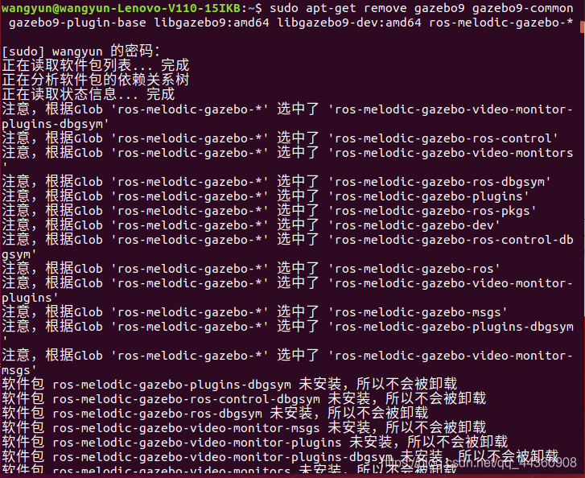

  等待卸载完毕，下面开始装gazebo11，一个新的开始。首先设置您的计算机以接受来自 packages.osrfoundation.org 的[软件](https://marketing.csdn.net/p/3127db09a98e0723b83b2914d9256174?pId=2782&utm_source=glcblog&spm=1001.2101.3001.7020)。

> $ sudo sh -c 'echo "deb http://packages.osrfoundation.org/gazebo/ubuntu\-stable \`lsb\_release -cs\` main" > /etc/apt/sources.list.d/gazebo-stable.list'

可以检查文件是否正确写入

> $ cat /etc/apt/sources.list.d/gazebo-stable.list

  一切正常的话应该是这样的

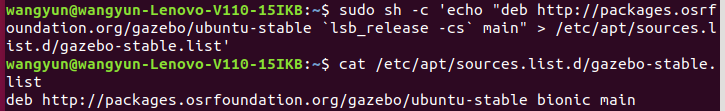

  然后设置密钥

> $ wget https://packages.osrfoundation.org/gazebo.key -O - | sudo apt-key add -

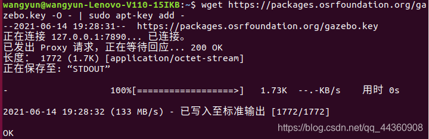

  然后输入更新一下

> $ sudo apt-get update

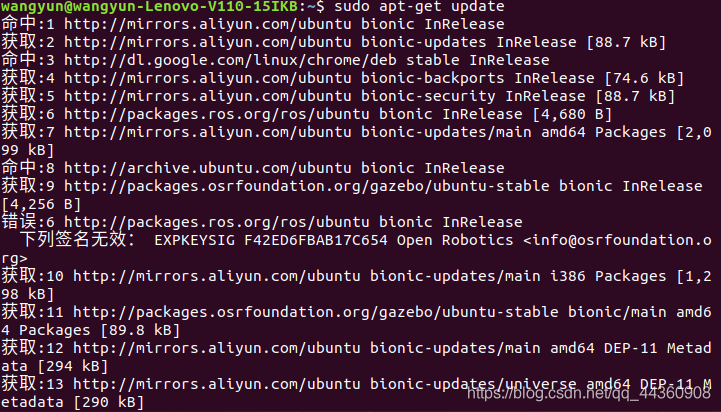

  接下来安装gazebo11

> $ sudo apt-get install gazebo11

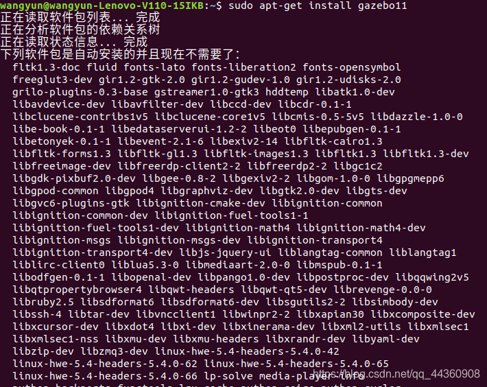

  一波等待之后，继续安装依赖

> $ sudo apt-get install libgazebo11-dev

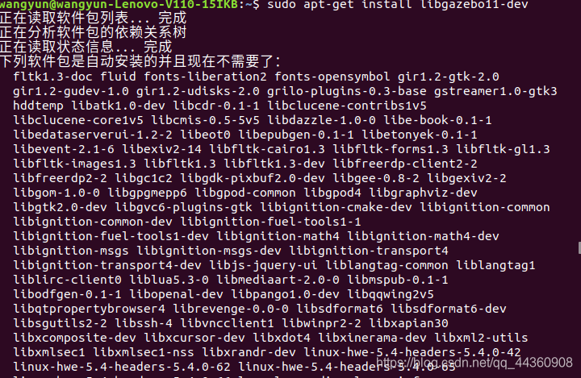

  装完了？不存在的，在装一下ros相关插件

> $ sudo apt install ros-melodic-gazebo11-\*

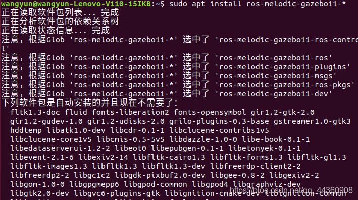

  好了装完了，运行一下gazebo验证一下行不行。

> $ gazebo

  我在gazebo里放置了一下，神奇的事情发生了，他好了，我又可以了，之前下载的模型库也都还在，自己画的也还在，nice！果然还是得经常更新一下软件，希望我的垃圾电脑能够带的动。

参考教程：[http://gazebosim.org/tutorials?tut=install\_ubuntu&cat=install](http://gazebosim.org/tutorials?tut=install_ubuntu&cat=install)

[https://blog.csdn.net/weixin\_44623637/article/details/109249607](https://blog.csdn.net/weixin_44623637/article/details/109249607)

#### 6.6.1 URDF与Gazebo基本集成流程

URDF 与 Gazebo 集成流程与 Rviz 实现类似，主要步骤如下:

1.  创建功能包，导入依赖项
    
2.  编写 URDF 或 Xacro 文件
    
3.  启动 Gazebo 并显示机器人模型
    

1.创建功能包

创建新功能包urdf02_gazebo，导入依赖包: urdf xacro gazebo_ros gazebo_ros_control gazebo_plugins

功能包下创建文件夹：launch,urdf,urdf\gazebo,worlds

2.编写URDF文件

demo01_helloworld.urdf

```xml
<!-- 
    创建一个机器人模型(盒状即可)，显示在 Gazebo 中 
-->

<robot name="mycar">
    <link name="base_link">
        <visual>
            <geometry>
                <box size="0.5 0.2 0.1" />
            </geometry>
            <origin xyz="0.0 0.0 0.0" rpy="0.0 0.0 0.0" />
            <material name="yellow">
                <color rgba="0.5 0.3 0.0 1" />
            </material>
        </visual>
        <collision>
            <geometry>
                <box size="0.5 0.2 0.1" />
            </geometry>
            <origin xyz="0.0 0.0 0.0" rpy="0.0 0.0 0.0" />
        </collision>
        <inertial>
            <origin xyz="0 0 0" />
            <mass value="6" />
            <inertia ixx="1" ixy="0" ixz="0" iyy="1" iyz="0" izz="1" />
        </inertial>
    </link>
    <gazebo reference="base_link">
        <material>Gazebo/Black</material>
    </gazebo>

</robot>
```

注意， 当 URDF 需要与 Gazebo 集成时，和 Rviz 有明显区别:

1.必须使用 collision 标签，因为既然是仿真环境，那么必然涉及到碰撞检测，collision 提供碰撞检测的依据。

2.必须使用 inertial 标签，此标签标注了当前机器人某个刚体部分的惯性矩阵，用于一些力学相关的仿真计算。

3.颜色设置，也需要重新使用 gazebo 标签标注，因为之前的颜色设置为了方便调试包含透明度，仿真环境下没有此选项。

3.启动Gazebo并显示模型

launch 文件实现:

demo01_helloworld.launch

```xml
<launch>

    <!-- 将 Urdf 文件的内容加载到参数服务器 -->
    <param name="robot_description" textfile="$(find demo02_urdf_gazebo)/urdf/urdf01_helloworld.urdf" />

    <!-- 启动 gazebo -->
    <include file="$(find gazebo_ros)/launch/empty_world.launch" />

    <!-- 在 gazebo 中显示机器人模型 -->
    <node pkg="gazebo_ros" type="spawn_model" name="model" args="-urdf -model mycar -param robot_description"  />
</launch>
```

代码解释:

```xml
<include file="$(find gazebo_ros)/launch/empty_world.launch" />
<!-- 启动 Gazebo 的仿真环境，当前环境为空环境 -->
```

```xml
<node pkg="gazebo_ros" type="spawn_model" name="model" args="-urdf -model mycar -param robot_description"  />

<!-- 
    在 Gazebo 中加载一个机器人模型，该功能由 gazebo_ros 下的 spawn_model 提供:
    -urdf 加载的是 urdf 文件
    -model mycar 模型名称是 mycar
    -param robot_description 从参数 robot_description 中载入模型
    -x 模型载入的 x 坐标
    -y 模型载入的 y 坐标
    -z 模型载入的 z 坐标
-->
```

#### 6.6.1.2 界面问题

**界面无法显示**

在.bashrc里面添加代码

```bash
export QT_AUTO_SCREEN_SCALE_FACTOR=0
export QT_SCREEN_SCALE_FACTORS=[1.0]
```

**显示的图像全灰色**

左侧界面中的world\scene\shadows 后的√去除掉


#### 6.6.2 URDF集成Gazebo相关设置


较之于 rviz，gazebo在集成 URDF 时，需要做些许修改，比如:必须添加 collision 碰撞属性相关参数、必须添加 inertial 惯性矩阵相关参数，另外，如果直接移植 Rviz 中机器人的颜色设置是没有显示的，颜色设置也必须做相应的变更。

1.collision

如果机器人link是标准的几何体形状，和link的 visual 属性设置一致即可。

2.inertial

惯性矩阵的设置需要结合link的质量与外形参数动态生成，标准的球体、圆柱与立方体的惯性矩阵公式如下(已经封装为 xacro 实现):

球体惯性矩阵

```xml
<!-- Macro for inertia matrix -->
    <xacro:macro name="sphere_inertial_matrix" params="m r">
        <inertial>
            <mass value="${m}" />
            <inertia ixx="${2*m*r*r/5}" ixy="0" ixz="0"
                iyy="${2*m*r*r/5}" iyz="0" 
                izz="${2*m*r*r/5}" />
        </inertial>
    </xacro:macro>
```

圆柱惯性矩阵

```xml
<xacro:macro name="cylinder_inertial_matrix" params="m r h">
        <inertial>
            <mass value="${m}" />
            <inertia ixx="${m*(3*r*r+h*h)/12}" ixy = "0" ixz = "0"
                iyy="${m*(3*r*r+h*h)/12}" iyz = "0"
                izz="${m*r*r/2}" /> 
        </inertial>
    </xacro:macro>
```

立方体惯性矩阵

```xml
 <xacro:macro name="Box_inertial_matrix" params="m l w h">
       <inertial>
               <mass value="${m}" />
               <inertia ixx="${m*(h*h + l*l)/12}" ixy = "0" ixz = "0"
                   iyy="${m*(w*w + l*l)/12}" iyz= "0"
                   izz="${m*(w*w + h*h)/12}" />
       </inertial>
   </xacro:macro>
```

需要注意的是，原则上，除了 base\_footprint 外，机器人的每个刚体部分都需要设置惯性矩阵，且惯性矩阵必须经计算得出，如果随意定义刚体部分的惯性矩阵，那么可能会导致机器人在 Gazebo 中出现抖动，移动等现象。

3.颜色设置

在 gazebo 中显示 link 的颜色，必须要使用指定的标签:

```xml
<gazebo reference="link节点名称">
     <material>Gazebo/Blue</material>
</gazebo>
```

**PS：**material 标签中，设置的值区分大小写，颜色可以设置为 Red Blue Green Black .....

#### 6.6.3 URDF集成Gazebo实操

**需求描述:**

将之前的机器人模型(xacro版)显示在 gazebo 中

**结果演示:**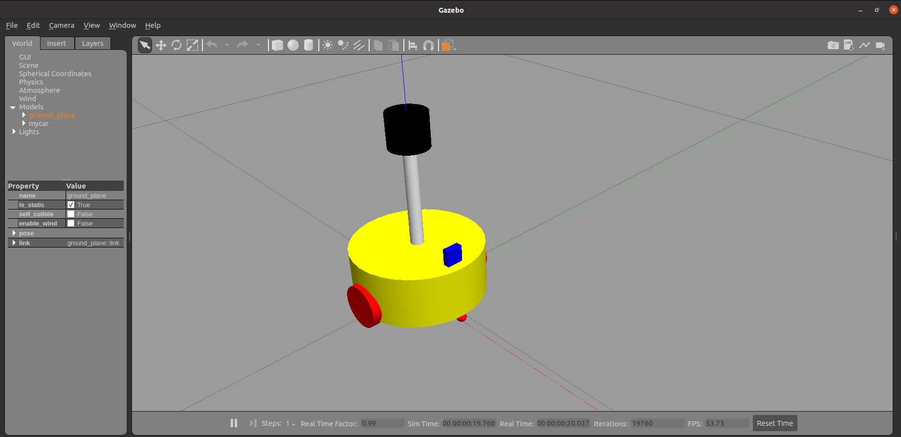**实现流程:**

1.  需要编写封装惯性矩阵算法的 xacro 文件
    
2.  为机器人模型中的每一个 link 添加 collision 和 inertial 标签，并且重置颜色属性
    
3.  在 launch 文件中启动 gazebo 并添加机器人模型
    

1.编写封装惯性矩阵算法的 xacro 文件

head.xacro

```xml
<robot name="base" xmlns:xacro="http://wiki.ros.org/xacro">
    <!-- Macro for inertia matrix -->
    <xacro:macro name="sphere_inertial_matrix" params="m r">
        <inertial>
            <mass value="${m}" />
            <inertia ixx="${2*m*r*r/5}" ixy="0" ixz="0"
                iyy="${2*m*r*r/5}" iyz="0" 
                izz="${2*m*r*r/5}" />
        </inertial>
    </xacro:macro>

    <xacro:macro name="cylinder_inertial_matrix" params="m r h">
        <inertial>
            <mass value="${m}" />
            <inertia ixx="${m*(3*r*r+h*h)/12}" ixy = "0" ixz = "0"
                iyy="${m*(3*r*r+h*h)/12}" iyz = "0"
                izz="${m*r*r/2}" /> 
        </inertial>
    </xacro:macro>

    <xacro:macro name="Box_inertial_matrix" params="m l w h">
       <inertial>
               <mass value="${m}" />
               <inertia ixx="${m*(h*h + l*l)/12}" ixy = "0" ixz = "0"
                   iyy="${m*(w*w + l*l)/12}" iyz= "0"
                   izz="${m*(w*w + h*h)/12}" />
       </inertial>
   </xacro:macro>
</robot>
```

2.复制相关 xacro 文件，并设置 collision inertial 以及 color 等参数

**A.底盘 Xacro 文件**

demo05_car_base.urdf.xacro

```xml
<robot name="my_base" xmlns:xacro="http://www.ros.org/wiki/xacro">
    <xacro:property name="PI" value="3.1415926"/>
    <material name="black">
        <color rgba="0.0 0.0 0.0 1.0" />
    </material>
    <xacro:property name="base_footprint_radius" value="0.001" />
    <xacro:property name="base_link_radius" value="0.1" /> 
    <xacro:property name="base_link_length" value="0.08" /> 
    <xacro:property name="earth_space" value="0.015" /> 
    <xacro:property name="base_link_m" value="0.5" />


    <link name="base_footprint">
      <visual>
        <geometry>
          <sphere radius="${base_footprint_radius}" />
        </geometry>
      </visual>
    </link>

    <link name="base_link">
      <visual>
        <geometry>
          <cylinder radius="${base_link_radius}" length="${base_link_length}" />
        </geometry>
        <origin xyz="0 0 0" rpy="0 0 0" />
        <material name="yellow">
          <color rgba="0.5 0.3 0.0 0.5" />
        </material>
      </visual>
      <collision>
        <geometry>
          <cylinder radius="${base_link_radius}" length="${base_link_length}" />
        </geometry>
        <origin xyz="0 0 0" rpy="0 0 0" />
      </collision>
      <xacro:cylinder_inertial_matrix m="${base_link_m}" r="${base_link_radius}" h="${base_link_length}" />

    </link>


    <joint name="base_link2base_footprint" type="fixed">
      <parent link="base_footprint" />
      <child link="base_link" />
      <origin xyz="0 0 ${earth_space + base_link_length / 2 }" />
    </joint>
    <gazebo reference="base_link">
        <material>Gazebo/Yellow</material>
    </gazebo>


    <xacro:property name="wheel_radius" value="0.0325" />
    <xacro:property name="wheel_length" value="0.015" />
    <xacro:property name="wheel_m" value="0.05" /> 


    <xacro:macro name="add_wheels" params="name flag">
      <link name="${name}_wheel">
        <visual>
          <geometry>
            <cylinder radius="${wheel_radius}" length="${wheel_length}" />
          </geometry>
          <origin xyz="0.0 0.0 0.0" rpy="${PI / 2} 0.0 0.0" />
          <material name="black" />
        </visual>
        <collision>
          <geometry>
            <cylinder radius="${wheel_radius}" length="${wheel_length}" />
          </geometry>
          <origin xyz="0.0 0.0 0.0" rpy="${PI / 2} 0.0 0.0" />
        </collision>
        <xacro:cylinder_inertial_matrix m="${wheel_m}" r="${wheel_radius}" h="${wheel_length}" />

      </link>

      <joint name="${name}_wheel2base_link" type="continuous">
        <parent link="base_link" />
        <child link="${name}_wheel" />
        <origin xyz="0 ${flag * base_link_radius} ${-(earth_space + base_link_length / 2 - wheel_radius) }" />
        <axis xyz="0 1 0" />
      </joint>

      <gazebo reference="${name}_wheel">
        <material>Gazebo/Red</material>
      </gazebo>

    </xacro:macro>
    <xacro:add_wheels name="left" flag="1" />
    <xacro:add_wheels name="right" flag="-1" />

    <xacro:property name="support_wheel_radius" value="0.0075" /> 
    <xacro:property name="support_wheel_m" value="0.03" /> 


    <xacro:macro name="add_support_wheel" params="name flag" >
      <link name="${name}_wheel">
        <visual>
            <geometry>
                <sphere radius="${support_wheel_radius}" />
            </geometry>
            <origin xyz="0 0 0" rpy="0 0 0" />
            <material name="black" />
        </visual>
        <collision>
            <geometry>
                <sphere radius="${support_wheel_radius}" />
            </geometry>
            <origin xyz="0 0 0" rpy="0 0 0" />
        </collision>
        <xacro:sphere_inertial_matrix m="${support_wheel_m}" r="${support_wheel_radius}" />
      </link>

      <joint name="${name}_wheel2base_link" type="continuous">
          <parent link="base_link" />
          <child link="${name}_wheel" />
          <origin xyz="${flag * (base_link_radius - support_wheel_radius)} 0 ${-(base_link_length / 2 + earth_space / 2)}" />
          <axis xyz="1 1 1" />
      </joint>
      <gazebo reference="${name}_wheel">
        <material>Gazebo/Red</material>
      </gazebo>
    </xacro:macro>

    <xacro:add_support_wheel name="front" flag="1" />
    <xacro:add_support_wheel name="back" flag="-1" />


</robot>
```

注意: 如果机器人模型在 Gazebo 中产生了抖动，滑动，缓慢位移 .... 诸如此类情况，请查看

1.  惯性矩阵是否设置了，且设置是否正确合理
    
2.  车轮翻转需要依赖于 PI 值，如果 PI 值精度偏低，也可能导致上述情况产生
    

B.摄像头 Xacro 文件

demo06_car_camera.urdf.xacro

```xml

<robot name="my_camera" xmlns:xacro="http://wiki.ros.org/xacro">

    <xacro:property name="camera_length" value="0.01" /> 
    <xacro:property name="camera_width" value="0.025" /> 
    <xacro:property name="camera_height" value="0.025" /> 
    <xacro:property name="camera_x" value="0.08" />
    <xacro:property name="camera_y" value="0.0" /> 
    <xacro:property name="camera_z" value="${base_link_length / 2 + camera_height / 2}" /> 

    <xacro:property name="camera_m" value="0.01" /> 

    
    <link name="camera">
        <visual>
            <geometry>
                <box size="${camera_length} ${camera_width} ${camera_height}" />
            </geometry>
            <origin xyz="0.0 0.0 0.0" rpy="0.0 0.0 0.0" />
            <material name="black" />
        </visual>
        <collision>
            <geometry>
                <box size="${camera_length} ${camera_width} ${camera_height}" />
            </geometry>
            <origin xyz="0.0 0.0 0.0" rpy="0.0 0.0 0.0" />
        </collision>
        <xacro:Box_inertial_matrix m="${camera_m}" l="${camera_length}" w="${camera_width}" h="${camera_height}" />
    </link>

    <joint name="camera2base_link" type="fixed">
        <parent link="base_link" />
        <child link="camera" />
        <origin xyz="${camera_x} ${camera_y} ${camera_z}" />
    </joint>
    <gazebo reference="camera">
        <material>Gazebo/Blue</material>
    </gazebo>
</robot>
```

C.雷达 Xacro 文件

demo07_car_laser.urdf.xacro

```xml

<robot name="my_laser" xmlns:xacro="http://wiki.ros.org/xacro">

 
    <xacro:property name="support_length" value="0.15" /> 
    <xacro:property name="support_radius" value="0.01" />
    <xacro:property name="support_x" value="0.0" />
    <xacro:property name="support_y" value="0.0" /> 
    <xacro:property name="support_z" value="${base_link_length / 2 + support_length / 2}" />
    <xacro:property name="support_m" value="0.02" />

    <link name="support">
        <visual>
            <geometry>
                <cylinder radius="${support_radius}" length="${support_length}" />
            </geometry>
            <origin xyz="0.0 0.0 0.0" rpy="0.0 0.0 0.0" />
            <material name="red">
                <color rgba="0.8 0.2 0.0 0.8" />
            </material>
        </visual>

        <collision>
            <geometry>
                <cylinder radius="${support_radius}" length="${support_length}" />
            </geometry>
            <origin xyz="0.0 0.0 0.0" rpy="0.0 0.0 0.0" />
        </collision>

        <xacro:cylinder_inertial_matrix m="${support_m}" r="${support_radius}" h="${support_length}" />

    </link>

    <joint name="support2base_link" type="fixed">
        <parent link="base_link" />
        <child link="support" />
        <origin xyz="${support_x} ${support_y} ${support_z}" />
    </joint>

    <gazebo reference="support">
        <material>Gazebo/White</material>
    </gazebo>


    <xacro:property name="laser_length" value="0.05" /> 
    <xacro:property name="laser_radius" value="0.03" /> 
    <xacro:property name="laser_x" value="0.0" /> 
    <xacro:property name="laser_y" value="0.0" />
    <xacro:property name="laser_z" value="${support_length / 2 + laser_length / 2}" /> 

    <xacro:property name="laser_m" value="0.1" />

    <link name="laser">
        <visual>
            <geometry>
                <cylinder radius="${laser_radius}" length="${laser_length}" />
            </geometry>
            <origin xyz="0.0 0.0 0.0" rpy="0.0 0.0 0.0" />
            <material name="black" />
        </visual>
        <collision>
            <geometry>
                <cylinder radius="${laser_radius}" length="${laser_length}" />
            </geometry>
            <origin xyz="0.0 0.0 0.0" rpy="0.0 0.0 0.0" />
        </collision>
        <xacro:cylinder_inertial_matrix m="${laser_m}" r="${laser_radius}" h="${laser_length}" />
    </link>

    <joint name="laser2support" type="fixed">
        <parent link="support" />
        <child link="laser" />
        <origin xyz="${laser_x} ${laser_y} ${laser_z}" />
    </joint>
    <gazebo reference="laser">
        <material>Gazebo/Black</material>
    </gazebo>
</robot>
```

D.组合底盘、摄像头与雷达的 Xacro 文件

car.urdf.xacro

```xml
<robot name="my_car_camera" xmlns:xacro="http://wiki.ros.org/xacro">

    <xacro:include filename="head.xacro" />

    <xacro:include filename="demo05_car_base.urdf.xacro" />
    <xacro:include filename="demo06_car_camera.urdf.xacro" />
    <xacro:include filename="demo07_car_laser.urdf.xacro" />
</robot>
```

3.在 gazebo 中执行

launch 文件:

demo03_env.launch

```xml
<launch>

    <!-- 将 Urdf 文件的内容加载到参数服务器 -->
    <param name="robot_description" command="$(find xacro)/xacro $(find urdf02_gazebo)/urdf/car.urdf.xacro" />

    <!-- 启动 gazebo -->
    <include file="$(find gazebo_ros)/launch/empty_world.launch" />
    
    <!-- 在 gazebo 中显示机器人模型 -->
    <node pkg="gazebo_ros" type="spawn_model" name="model" args="-urdf -model mycar -param robot_description"  />
</launch>
```


#### 6.6.4 Gazebo仿真环境搭建

到目前为止，我们已经可以将机器人模型显示在 Gazebo 之中了，但是当前默认情况下，在 Gazebo 中机器人模型是在 empty world 中，并没有类似于房间、家具、道路、树木... 之类的仿真物，如何在 Gazebo 中创建仿真环境呢？

Gazebo 中创建仿真实现方式有两种:

-   方式1: 直接添加内置组件创建仿真环境
    
-   方式2: 手动绘制仿真环境(更为灵活)
    

也还可以直接下载使用官方或第三方提高的仿真环境插件。

1.添加内置组件创建仿真环境

1.1启动 Gazebo 并添加组件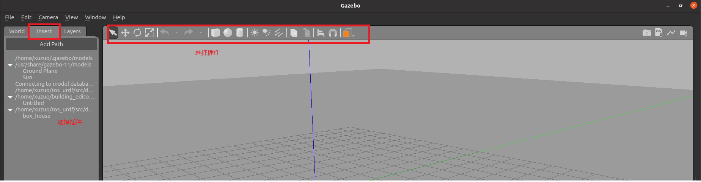

1.2保存仿真环境

添加完毕后，选择 file ---> Save World as 选择保存路径(功能包下: worlds 目录)，文件名自定义，后缀名设置为 .world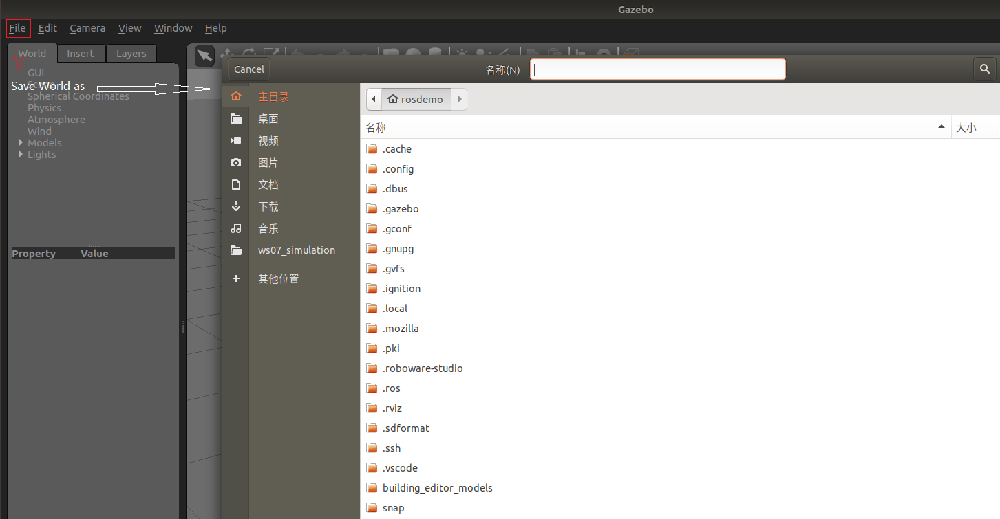

1.3 启动

demo03_env.launch

```xml
<launch>

    <!-- 将 Urdf 文件的内容加载到参数服务器 -->
    <param name="robot_description" command="$(find xacro)/xacro $(find urdf02_gazebo)/urdf/car.urdf.xacro" />

    <!-- 启动 gazebo -->
    <include file="$(find gazebo_ros)/launch/empty_world.launch">
        <arg name="world_name" value="$(find urdf02_gazebo)/worlds/hello.world" />
    </include>
    
    <!-- 在 gazebo 中显示机器人模型 -->
    <node pkg="gazebo_ros" type="spawn_model" name="model" args="-urdf -model mycar -param robot_description"  />
</launch>
```

核心代码: 启动 empty\_world 后，再根据`arg`加载自定义的仿真环境

```xml
    <include file="$(find gazebo_ros)/launch/empty_world.launch">
        <arg name="world_name" value="$(find urdf02_gazebo)/worlds/hello.world" />
    </include>
```

2.自定义仿真环境

2.1 启动 gazebo 打开构建面板，绘制仿真环境

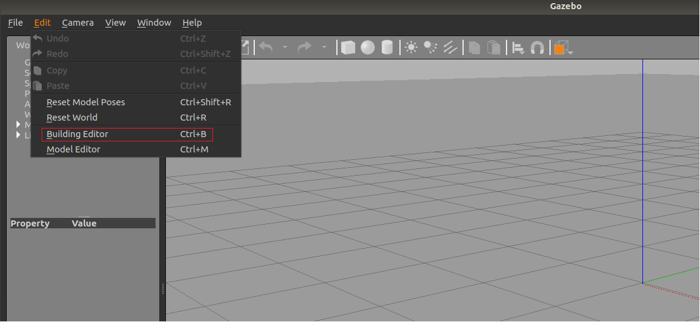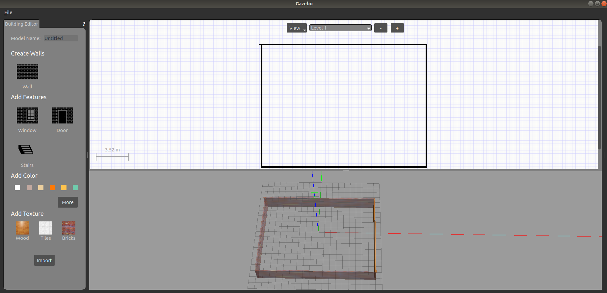

2.2 保存构建的环境

点击: 左上角 file ---> Save (保存路径功能包下的: models)

然后 file ---> Exit Building Editor

2.3 保存为 world 文件

可以像方式1一样再添加一些插件，然后保存为 world 文件(保存路径功能包下的: worlds)


2.4 启动

同方式1

3.使用官方提供的插件

当前 Gazebo 提供的仿真道具有限，还可以下载官方支持，可以提供更为丰富的仿真实现，具体实现如下:

3.1 下载官方模型库

`git clone https://github.com/osrf/gazebo_models`

之前是:`hg clone https://bitbucket.org/osrf/gazebo_models`但是已经不可用

注意: 此过程可能比较耗时

3.2 将模型库复制进 gazebo

将得到的gazebo\_models文件夹内容复制到 /usr/share/gazebo-\*/models

3.3 应用

重启 Gazebo，选择左侧菜单栏的 insert 可以选择并插入相关道具了


### 6.7 URDF、Gazebo与Rviz综合应用

关于URDF(Xacro)、Rviz 和 Gazebo 三者的关系，前面已有阐述: URDF 用于创建机器人模型、Rviz 可以显示机器人感知到的环境信息，Gazebo 用于仿真，可以模拟外界环境，以及机器人的一些传感器，如何在 Gazebo 中运行这些传感器，并显示这些传感器的数据(机器人的视角)呢？本节主要介绍的重点就是将三者结合:通过 Gazebo 模拟机器人的传感器，然后在 Rviz 中显示这些传感器感知到的数据。主要内容包括:

-   运动控制以及里程计信息显示
    
-   雷达信息仿真以及显示
    
-   摄像头信息仿真以及显示
    
-   kinect 信息仿真以及显示
    

___

**另请参考:**

-   [http://gazebosim.org/tutorials?tut=ros\_gzplugins](http://gazebosim.org/tutorials?tut=ros_gzplugins)


#### 6.7.1 机器人运动控制以及里程计信息显示

gazebo 中已经可以正常显示机器人模型了，那么如何像在 rviz 中一样控制机器人运动呢？在此，需要涉及到ros中的组件: ros\_control。

1.ros\_control 简介

**场景:**同一套 ROS 程序，如何部署在不同的机器人系统上，比如：开发阶段为了提高效率是在仿真平台上测试的，部署时又有不同的实体机器人平台，不同平台的实现是有差异的，如何保证 ROS 程序的可移植性？ROS 内置的解决方式是 ros\_control。

**ros\_control:**是一组软件包，它包含了控制器接口，控制器管理器，传输和硬件接口。ros\_control 是一套机器人控制的中间件，是一套规范，不同的机器人平台只要按照这套规范实现，那么就可以保证 与ROS 程序兼容，通过这套规范，实现了一种可插拔的架构设计，大大提高了程序设计的效率与灵活性。

gazebo 已经实现了 ros\_control 的相关接口，如果需要在 gazebo 中控制机器人运动，直接调用相关接口即可

2.运动控制实现流程(Gazebo)

承上，运动控制基本流程:

1.  已经创建完毕的机器人模型，编写一个单独的 xacro 文件，为机器人模型添加传动装置以及控制器
    
2.  将此文件集成进xacro文件
    
3.  启动 Gazebo 并发布 /cmd\_vel 消息控制机器人运动
    

2.1 为 joint 添加传动装置以及控制器

两轮差速配置

/home/book/ws/src/urdf02_gazebo/urdf/gazebo/move.xacro

```xml
<robot name="my_car_move" xmlns:xacro="http://wiki.ros.org/xacro">


    <xacro:macro name="joint_trans" params="joint_name">
        <!-- Transmission is important to link the joints and the controller -->
        <transmission name="${joint_name}_trans">
            <type>transmission_interface/SimpleTransmission</type>
            <joint name="${joint_name}">
                <hardwareInterface>hardware_interface/VelocityJointInterface</hardwareInterface>
            </joint>
            <actuator name="${joint_name}_motor">
                <hardwareInterface>hardware_interface/VelocityJointInterface</hardwareInterface>
                <mechanicalReduction>1</mechanicalReduction>
            </actuator>
        </transmission>
    </xacro:macro>


    <xacro:joint_trans joint_name="left_wheel2base_link" />
    <xacro:joint_trans joint_name="right_wheel2base_link" />


    <gazebo>
        <plugin name="differential_drive_controller" filename="libgazebo_ros_diff_drive.so">
            <rosDebugLevel>Debug</rosDebugLevel>
            <publishWheelTF>true</publishWheelTF>
            <robotNamespace>/</robotNamespace>
            <publishTf>1</publishTf>
            <publishWheelJointState>true</publishWheelJointState>
            <alwaysOn>true</alwaysOn>
            <updateRate>100.0</updateRate>
            <legacyMode>true</legacyMode>
            <leftJoint>left_wheel2base_link</leftJoint> 
            <rightJoint>right_wheel2base_link</rightJoint> 
            <wheelSeparation>${base_link_radius * 2}</wheelSeparation> 
            <wheelDiameter>${wheel_radius * 2}</wheelDiameter> 
            <broadcastTF>1</broadcastTF>
            <wheelTorque>30</wheelTorque>
            <wheelAcceleration>1.8</wheelAcceleration>
            <commandTopic>cmd_vel</commandTopic> 
            <odometryFrame>odom</odometryFrame> 
            <odometryTopic>odom</odometryTopic> 
            <robotBaseFrame>base_footprint</robotBaseFrame> 
        </plugin>
    </gazebo>

</robot>
```

2.2 xacro文件集成

最后还需要将上述 xacro 文件集成进总的机器人模型文件，代码示例如下:

/home/book/ws/src/urdf02_gazebo/urdf/car.urdf.xacro

```xml

<robot name="my_car_camera" xmlns:xacro="http://wiki.ros.org/xacro">

    <xacro:include filename="head.xacro" />

    <xacro:include filename="demo05_car_base.urdf.xacro" />
    <xacro:include filename="demo06_car_camera.urdf.xacro" />
    <xacro:include filename="demo07_car_laser.urdf.xacro" />

    <!-- move control-->
    <xacro:include filename="gazebo/move.xacro" />

    <!-- laser -->
    <xacro:include filename="gazebo/laser.xacro" />

    <!-- camera -->
    <xacro:include filename="gazebo/camera.xacro" />

    <!-- kinect -->
    <xacro:include filename="gazebo/kinect.xacro" />

</robot>
```

当前核心: 包含 控制器以及传动配置的 xacro 文件

```xml
<xacro:include filename="move.urdf.xacro" />
```

2.3 启动 gazebo并控制机器人运动

launch文件:

/home/book/ws/src/urdf02_gazebo/launch/demo03_env.launch

```xml
<launch>

    <!-- 将 Urdf 文件的内容加载到参数服务器 -->
    <param name="robot_description" command="$(find xacro)/xacro $(find urdf02_gazebo)/urdf/car.urdf.xacro" />

    <!-- 启动 gazebo -->
    <include file="$(find gazebo_ros)/launch/empty_world.launch">
        <arg name="world_name" value="$(find urdf02_gazebo)/worlds/box_house.world" />
    </include>

    <!-- 在 gazebo 中显示机器人模型 -->
    <node pkg="gazebo_ros" type="spawn_model" name="model" args="-urdf -model mycar -param robot_description"  />
</launch>
```

启动 launch 文件，使用 topic list 查看话题列表，会发现多了 /cmd\_vel 然后发布 vmd\_vel 消息控制即可

使用命令控制(或者可以编写单独的节点控制)

```c
rostopic pub -r 10 /cmd_vel geometry_msgs/Twist '{linear: {x: 0.2, y: 0, z: 0}, angular: {x: 0, y: 0, z: 0.5}}'
```

接下来我们会发现: 小车在 Gazebo 中已经正常运行起来了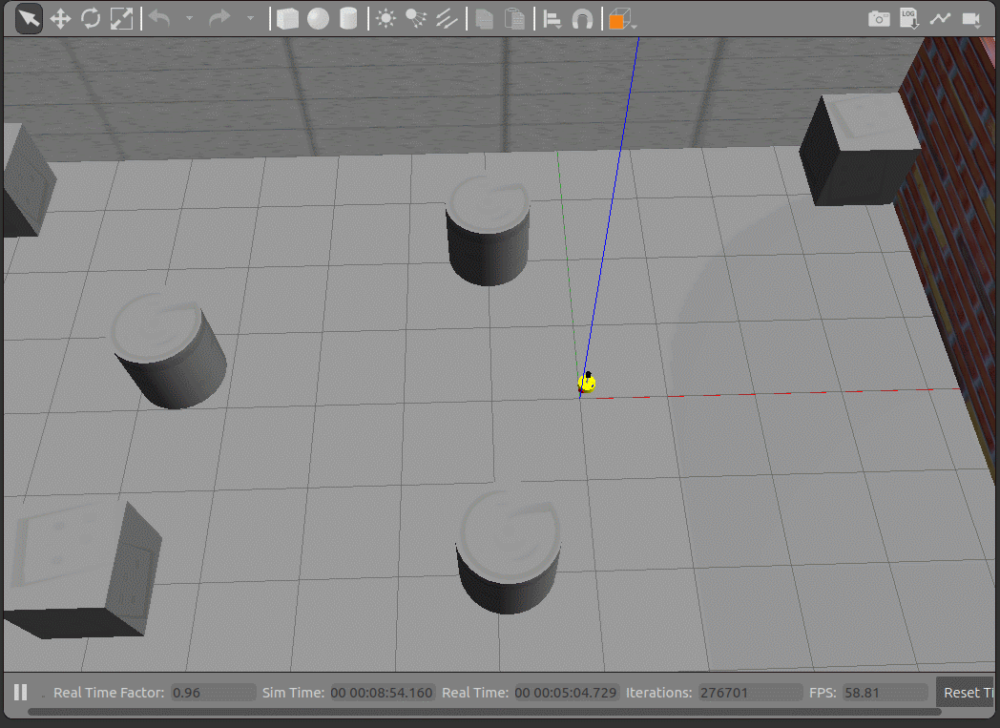

3.Rviz查看里程计信息

在 Gazebo 的仿真环境中，机器人的里程计信息以及运动朝向等信息是无法获取的，可以通过 Rviz 显示机器人的里程计信息以及运动朝向

**里程计:** 机器人相对出发点坐标系的位姿状态(X 坐标 Y 坐标 Z坐标以及朝向)。

3.1启动 Rviz

launch 文件

/home/book/ws/src/urdf02_gazebo/launch/demo04_sensor.launch

```xml
<launch>
    <!-- 添加点云坐标系到kinet连杆坐标系的n变换 -->
    <!-- args: x y z 绕z 绕y 绕x 父级坐标系 子级坐标系-->
    <node pkg="tf2_ros" type="static_transform_publisher" name="static_transform_publisher" args="0 0 0 -1.57 0 -1.57 /support /support_depth" />

    <!-- 先运行dmeo03启动gazebo,此时已经将robot_description载入了参数服务器，此时无需重复载入，启动rviz会自动调用参数服务器 -->
    <node pkg="rviz" type="rviz" name="rviz" args="-d $(find urdf01_rviz)/config/base_footprint.rviz" />
    <node pkg="joint_state_publisher" type="joint_state_publisher" name="joint_state_publisher" output="screen" />
    <node pkg="robot_state_publisher" type="robot_state_publisher" name="robot_state_publisher" output="screen" />
    
</launch>
```

3.2 添加组件

执行 launch 文件后，在 Rviz 中添加图示组件: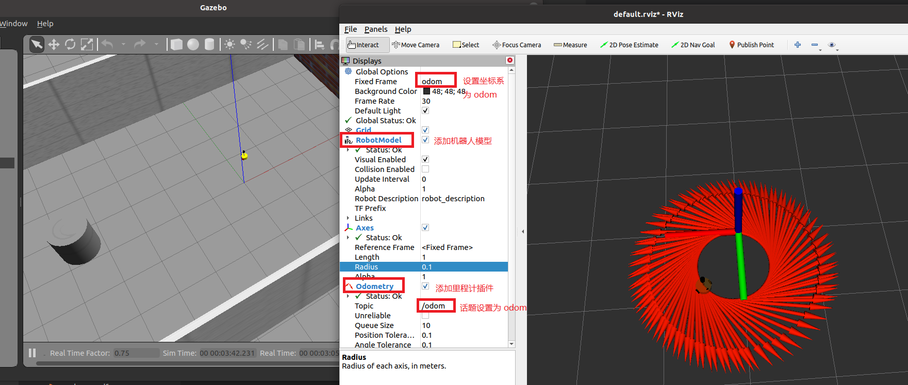


#### 6.7.2 雷达信息仿真以及显示

通过 Gazebo 模拟激光雷达传感器，并在 Rviz 中显示激光数据。

**实现流程:**

雷达仿真基本流程:

1.  已经创建完毕的机器人模型，编写一个单独的 xacro 文件，为机器人模型添加雷达配置；
    
2.  将此文件集成进xacro文件；
    
3.  启动 Gazebo，使用 Rviz 显示雷达信息。
    

1.Gazebo 仿真雷达

1.1 新建 Xacro 文件，配置雷达传感器信息

/home/book/ws/src/urdf02_gazebo/urdf/gazebo/laser.xacro

```xml
<robot name="my_sensors" xmlns:xacro="http://wiki.ros.org/xacro">

  <!-- laser -->
  <!-- modeif there from demo07_car_laser...(laser's name) -->
  <gazebo reference="laser">    
    <sensor type="ray" name="rplidar">
      <pose>0 0 0 0 0 0</pose>
      <visualize>true</visualize>
      <update_rate>5.5</update_rate>
      <ray>
        <scan>
          <horizontal>
            <samples>360</samples>
            <resolution>1</resolution>
            <min_angle>-3</min_angle>
            <max_angle>3</max_angle>
          </horizontal>
        </scan>
        <range>
          <min>0.10</min>
          <max>30.0</max>
          <resolution>0.01</resolution>
        </range>
        <noise>
          <type>gaussian</type>
          <mean>0.0</mean>
          <stddev>0.01</stddev>
        </noise>
      </ray>
      <plugin name="gazebo_rplidar" filename="libgazebo_ros_laser.so">
        <!-- topic name -->
        <topicName>/scan</topicName>
        <!-- modeif there from demo07_car_laser...(laser's name) -->
        <frameName>laser</frameName>
      </plugin>
    </sensor>
  </gazebo>

</robot>
```

1.2 xacro 文件集成

将步骤1的 Xacro 文件集成进总的机器人模型文件，代码示例如下:

/home/book/ws/src/urdf02_gazebo/urdf/car.urdf.xacro

```xml

<robot name="my_car_camera" xmlns:xacro="http://wiki.ros.org/xacro">

    <xacro:include filename="head.xacro" />

    <xacro:include filename="demo05_car_base.urdf.xacro" />
    <xacro:include filename="demo06_car_camera.urdf.xacro" />
    <xacro:include filename="demo07_car_laser.urdf.xacro" />

    <!-- move control-->
    <xacro:include filename="gazebo/move.xacro" />

    <!-- laser -->
    <xacro:include filename="gazebo/laser.xacro" />

    <!-- camera -->
    <xacro:include filename="gazebo/camera.xacro" />

    <!-- kinect -->
    <xacro:include filename="gazebo/kinect.xacro" />

</robot>
```

1.3启动仿真环境

编写launch文件，启动gazebo，此处略...

2.Rviz 显示雷达数据

先启动 rviz,添加雷达信息显示插件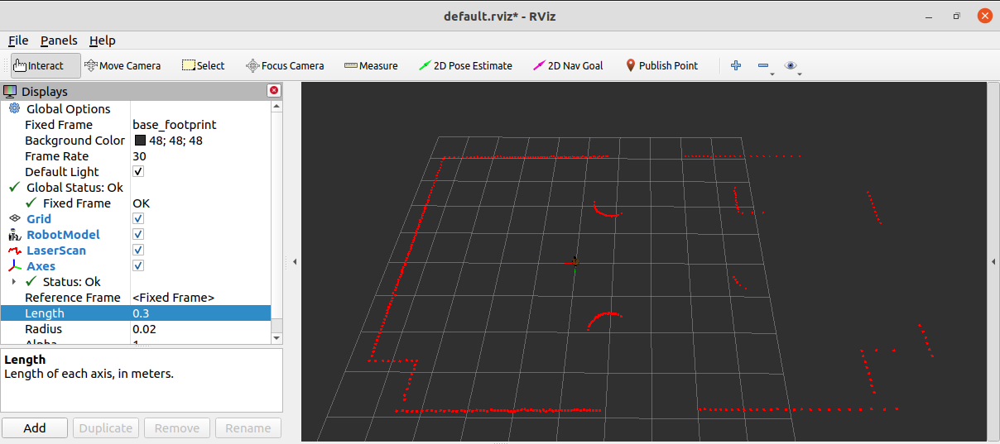


#### 6.7.3 摄像头信息仿真以及显示

通过 Gazebo 模拟摄像头传感器，并在 Rviz 中显示摄像头数据。

**实现流程:**

摄像头仿真基本流程:

1.  已经创建完毕的机器人模型，编写一个单独的 xacro 文件，为机器人模型添加摄像头配置；
    
2.  将此文件集成进xacro文件；
    
3.  启动 Gazebo，使用 Rviz 显示摄像头信息。
    

1.Gazebo 仿真摄像头

1.1 新建 Xacro 文件，配置摄像头传感器信息

camera.xacro

```xml
<robot name="my_sensors" xmlns:xacro="http://wiki.ros.org/xacro">
  <!-- link -->
  <gazebo reference="camera">
    <!-- type= camara -->
    <sensor type="camera" name="camera_node">
      <update_rate>30.0</update_rate> <!-- update ferquency -->
      <!-- camera baseic date -->
      <camera name="head">
        <horizontal_fov>1.3962634</horizontal_fov>
        <image>
          <width>1280</width>
          <height>720</height>
          <format>R8G8B8</format>
        </image>
        <clip>
          <near>0.02</near>
          <far>300</far>
        </clip>
        <noise>
          <type>gaussian</type>
          <mean>0.0</mean>
          <stddev>0.007</stddev>
        </noise>
      </camera>
      <!-- core plugin -->
      <plugin name="gazebo_camera" filename="libgazebo_ros_camera.so">
        <alwaysOn>true</alwaysOn>
        <updateRate>0.0</updateRate>
        <cameraName>/camera</cameraName>
        <imageTopicName>image_raw</imageTopicName>
        <cameraInfoTopicName>camera_info</cameraInfoTopicName>
        <frameName>camera</frameName>
        <hackBaseline>0.07</hackBaseline>
        <distortionK1>0.0</distortionK1>
        <distortionK2>0.0</distortionK2>
        <distortionK3>0.0</distortionK3>
        <distortionT1>0.0</distortionT1>
        <distortionT2>0.0</distortionT2>
      </plugin>
    </sensor>
  </gazebo>
</robot>
```

1.2 xacro 文件集成

将步骤1的 Xacro 文件集成进总的机器人模型文件，代码示例如下:

/home/book/ws/src/urdf02_gazebo/urdf/car.urdf.xacro

```xml

<robot name="my_car_camera" xmlns:xacro="http://wiki.ros.org/xacro">

    <xacro:include filename="head.xacro" />

    <xacro:include filename="demo05_car_base.urdf.xacro" />
    <xacro:include filename="demo06_car_camera.urdf.xacro" />
    <xacro:include filename="demo07_car_laser.urdf.xacro" />

    <!-- move control-->
    <xacro:include filename="gazebo/move.xacro" />

    <!-- laser -->
    <xacro:include filename="gazebo/laser.xacro" />

    <!-- camera -->
    <xacro:include filename="gazebo/camera.xacro" />

    <!-- kinect -->
    <xacro:include filename="gazebo/kinect.xacro" />

</robot>
```

1.3启动仿真环境

编写launch文件，启动gazebo，此处略...

2.Rviz 显示摄像头数据

执行 gazebo 并启动 Rviz,在 Rviz 中添加摄像头组件。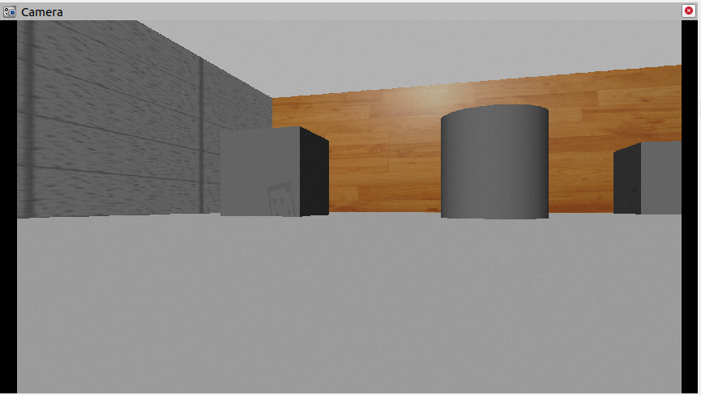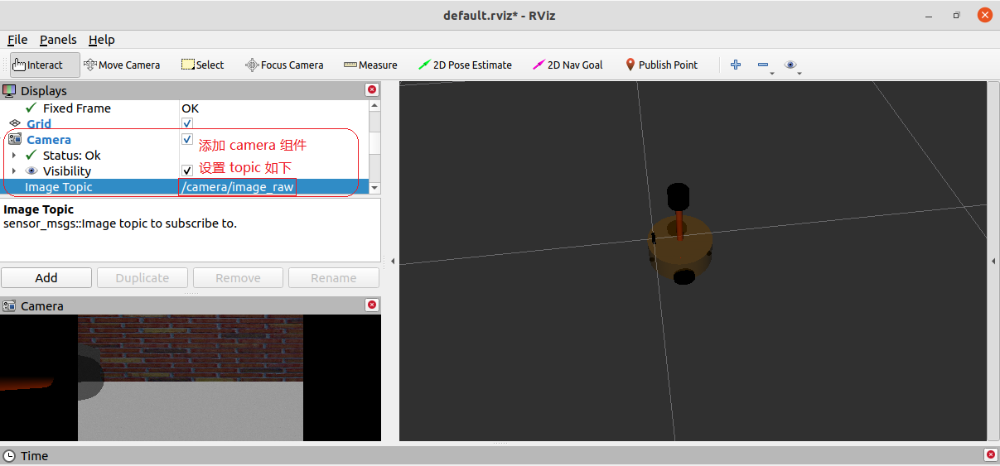

#### 6.7.4 kinect信息仿真以及显示

通过 Gazebo 模拟kinect摄像头，并在 Rviz 中显示kinect摄像头数据。

**实现流程:**

kinect摄像头仿真基本流程:

1.  已经创建完毕的机器人模型，编写一个单独的 xacro 文件，为机器人模型添加kinect摄像头配置；
    
2.  将此文件集成进xacro文件；
    
3.  启动 Gazebo，使用 Rviz 显示kinect摄像头信息。
    

1.Gazebo仿真Kinect

1.1 新建 Xacro 文件，配置 kinetic传感器信息

/home/book/ws/src/urdf02_gazebo/urdf/gazebo/kinect.xacro

```xml
<robot name="my_sensors" xmlns:xacro="http://wiki.ros.org/xacro">
    <gazebo reference="support">  
      <sensor type="depth" name="camera">
        <always_on>true</always_on>
        <update_rate>20.0</update_rate>
        <camera>
          <horizontal_fov>${60.0*PI/180.0}</horizontal_fov>
          <image>
            <format>R8G8B8</format>
            <width>640</width>
            <height>480</height>
          </image>
          <clip>
            <near>0.05</near>
            <far>8.0</far>
          </clip>
        </camera>
        <plugin name="kinect_camera_controller" filename="libgazebo_ros_openni_kinect.so">
          <cameraName>camera</cameraName>
          <alwaysOn>true</alwaysOn>
          <updateRate>10</updateRate>
          <imageTopicName>rgb/image_raw</imageTopicName>
          <depthImageTopicName>depth/image_raw</depthImageTopicName>
          <pointCloudTopicName>depth/points</pointCloudTopicName>
          <cameraInfoTopicName>rgb/camera_info</cameraInfoTopicName>
          <depthImageCameraInfoTopicName>depth/camera_info</depthImageCameraInfoTopicName>
          <frameName>support_depth</frameName>
          <baseline>0.1</baseline>
          <distortion_k1>0.0</distortion_k1>
          <distortion_k2>0.0</distortion_k2>
          <distortion_k3>0.0</distortion_k3>
          <distortion_t1>0.0</distortion_t1>
          <distortion_t2>0.0</distortion_t2>
          <pointCloudCutoff>0.4</pointCloudCutoff>
        </plugin>
      </sensor>
    </gazebo>

</robot>
```

1.2 xacro 文件集成

将步骤1的 Xacro 文件集成进总的机器人模型文件，代码示例如下:

/home/book/ws/src/urdf02_gazebo/urdf/car.urdf.xacro

```xml

<robot name="my_car_camera" xmlns:xacro="http://wiki.ros.org/xacro">

    <xacro:include filename="head.xacro" />

    <xacro:include filename="demo05_car_base.urdf.xacro" />
    <xacro:include filename="demo06_car_camera.urdf.xacro" />
    <xacro:include filename="demo07_car_laser.urdf.xacro" />

    <!-- move control-->
    <xacro:include filename="gazebo/move.xacro" />

    <!-- laser -->
    <xacro:include filename="gazebo/laser.xacro" />

    <!-- camera -->
    <xacro:include filename="gazebo/camera.xacro" />

    <!-- kinect -->
    <xacro:include filename="gazebo/kinect.xacro" />

</robot>
```

1.3启动仿真环境

编写launch文件，启动gazebo，此处略...

2 Rviz 显示 Kinect 数据

启动 rviz,添加摄像头组件查看数据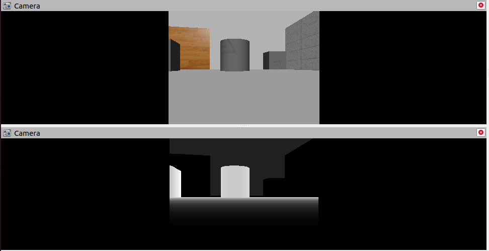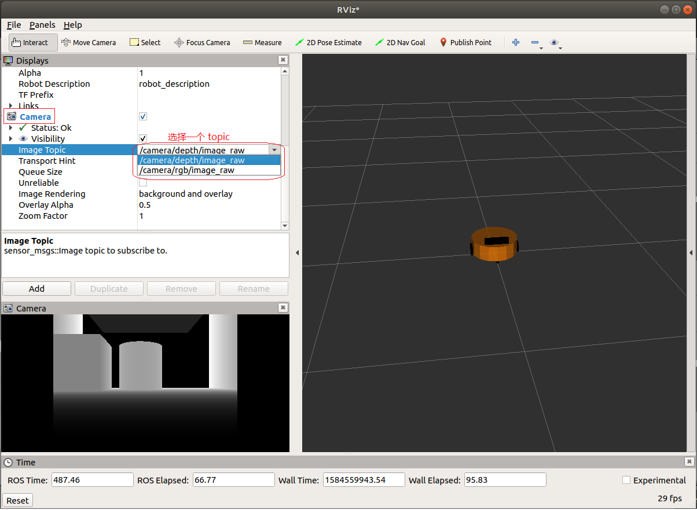

___

**补充:kinect 点云数据显示**

在kinect中也可以以点云的方式显示感知周围环境，在 rviz 中操作如下:

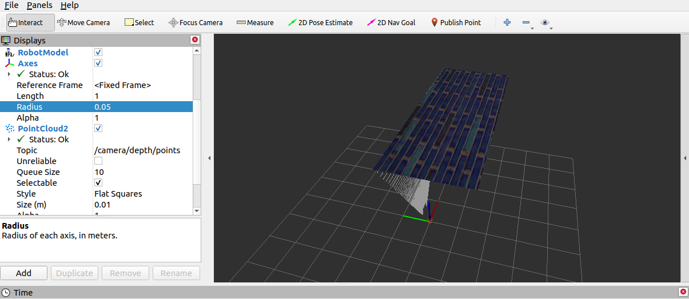

**问题:**在rviz中显示时错位。

**原因:**在kinect中图像数据与点云数据使用了两套坐标系统，且两套坐标系统位姿并不一致。

**解决:**

1.在插件中为kinect设置坐标系，修改配置文件的`<frameName>`标签内容：

/home/book/ws/src/urdf02_gazebo/urdf/gazebo/kinect.xacro

```xml
<frameName>support_depth</frameName>
```

2.发布新设置的坐标系到kinect连杆的坐标变换关系，在启动rviz的launch中，添加:

```xml
<node pkg="tf2_ros" type="static_transform_publisher" name="static_transform_publisher" args="0 0 0 -1.57 0 -1.57 /support /support_depth" />
```

/home/book/ws/src/urdf02_gazebo/launch/demo04_sensor.launch

```xml
<launch>
    <!-- 添加点云坐标系到kinet连杆坐标系的n变换 -->
    <!-- args: x y z 绕z 绕y 绕x 父级坐标系 子级坐标系-->
    <node pkg="tf2_ros" type="static_transform_publisher" name="static_transform_publisher" args="0 0 0 -1.57 0 -1.57 /support /support_depth" />

    <!-- 先运行dmeo03启动gazebo,此时已经将robot_description载入了参数服务器，此时无需重复载入，启动rviz会自动调用参数服务器 -->
    <node pkg="rviz" type="rviz" name="rviz" args="-d $(find urdf01_rviz)/config/base_footprint.rviz" />
    <node pkg="joint_state_publisher" type="joint_state_publisher" name="joint_state_publisher" output="screen" />
    <node pkg="robot_state_publisher" type="robot_state_publisher" name="robot_state_publisher" output="screen" />
    
</launch>
```

3.启动rviz，重新显示。

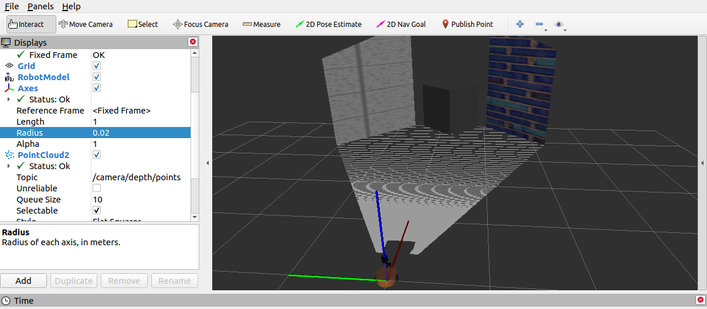

### 6.8 本章小结

本章主要介绍了ROS中仿真实现涉及的三大知识点:

-   URDF(Xacro)
-   Rviz
-   Gazebo

URDF 是用于描述机器人模型的 xml 文件，可以使用不同的标签具代表不同含义，URDF 编写机器人模型代码冗余，xacro 可以优化 URDF 实现，代码实现更为精简、高效、易读。容易混淆的是Rviz与Gazebo，在此我们着重比较以下二者的区别:

> rviz是**三维可视化工具**，强调把已有的数据可视化显示；
>
> gazebo是**三维物理仿真平台**，强调的是创建一个虚拟的仿真环境。
>
> rviz需要**已有数据**。
>
> rviz提供了很多插件，这些插件可以显示图像、模型、路径等信息，但是前提都是这些数据已经以话题、参数的形式发布，rviz做的事情就是订阅这些数据，并完成可视化的渲染，让开发者更容易理解数据的意义。
>
> gazebo不是显示工具，强调的是仿真，**它不需要数据，而是创造数据**。
>
> 我们可以在gazebo中免费创建一个机器人世界，不仅可以仿真机器人的运动功能，还可以仿真机器人的传感器数据。而这些数据就可以放到rviz中显示，所以使用gazebo的时候，经常也会和rviz配合使用。当我们手上没有机器人硬件或实验环境难以搭建时，仿真往往是非常有用的利器。
>
> 综上，如果你手上已经有机器人硬件平台，并且在上边可以完成需要的功能，用rviz应该就可以满足开发需求。
>
> 如果你手上没有机器人硬件，或者想在仿真环境中做一些算法、应用的测试，gazebo+rviz应该是你需要的。
>
> 另外，rviz配合其他功能包也可以建立一个简单的仿真环境，比如rviz+ArbotiX。

## 第七章 机器人导航仿真

导航是机器人系统中最重要的模块之一，比如现在较为流行的服务型室内机器人，就是依赖于机器人导航来实现室内自主移动的，本章主要就是介绍仿真环境下的导航实现，主要内容有:

-   导航相关概念
-   导航实现:机器人建图(SLAM)、地图服务、定位、路径规划....以可视化操作为主。
-   导航消息:了解地图、里程计、雷达、摄像头等相关消息格式。

预期达成的学习目标:

-   了解导航模块中的组成部分以及相关概念
-   能够在仿真环境下独立完成机器人导航

**案例演示:**

SLAM建图

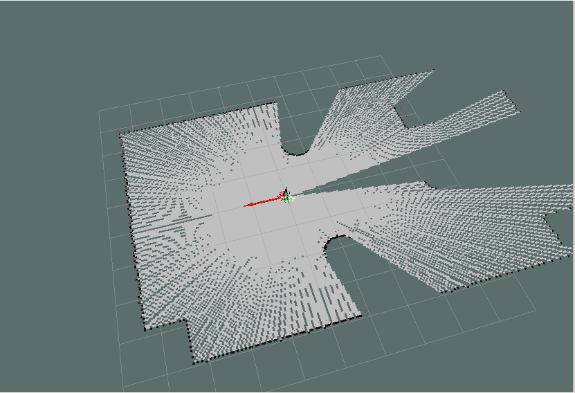

定位

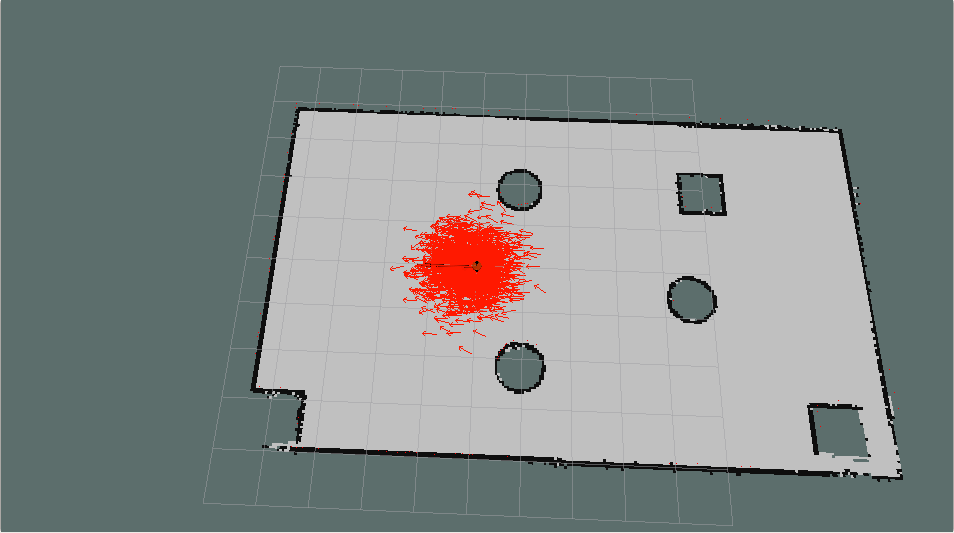

导航实现

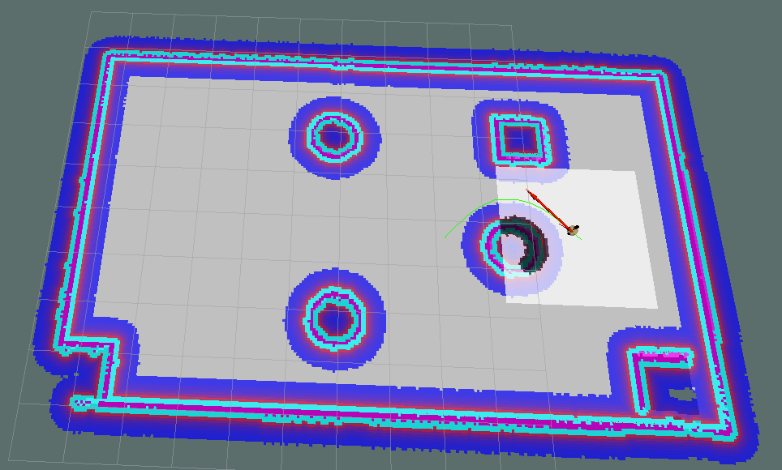

### 7.1 概述

7.1 概述

1.概念

在ROS中机器人导航(Navigation)由多个功能包组合实现，ROS 中又称之为导航功能包集，关于导航模块，官方介绍如下:

```
一个二维导航堆栈，它接收来自里程计、传感器流和目标姿态的信息，并输出发送到移动底盘的安全速度命令。
```

更通俗的讲: 导航其实就是机器人自主的从 A 点移动到 B 点的过程。


2.作用

秉着"不重复发明轮子"的原则，ROS 中导航相关的功能包集为机器人导航提供了一套通用的实现，开发者不再需要关注于导航算法、硬件交互... 等偏复杂、偏底层的实现，这些实现都由更专业的研发人员管理、迭代和维护，开发者可以更专注于上层功能，而对于导航功能的调用，只需要根据自身机器人相关参数合理设置各模块的配置文件即可，当然，如果有必要，也可以基于现有的功能包二次开发实现一些定制化需求，这样可以大大提高研发效率，缩短产品落地时间。总而言之，对于一般开发者而言，ROS 的导航功能包集优势如下:

-   安全: 由专业团队开发和维护
    
-   功能: 功能更稳定且全面
    
-   高效: 解放开发者，让开发者更专注于上层功能实现
    

___

**另请参考:**

-   [http://wiki.ros.org/navigation](http://wiki.ros.org/navigation)

#### 7.1.1导航模块简介

机器人是如何实现导航的呢？或换言之，机器人是如何从 A 点移动到 B 点呢？ROS 官方为了提供了一张导航功能包集的图示,该图中囊括了 ROS 导航的一些关键技术:

假定我们已经以特定方式配置机器人，导航功能包集将使其可以运动。上图概述了这种配置方式。白色的部分是必须且已实现的组件，灰色的部分是可选且已实现的组件，蓝色的部分是必须为每一个机器人平台创建的组件。

总结下来，涉及的关键技术有如下五点:

1.  全局地图
    
2.  自身定位
    
3.  路径规划
    
4.  运动控制
    
5.  环境感知
    

机器人导航实现与无人驾驶类似，关键技术也是由上述五点组成，只是无人驾驶是基于室外的，而我们当前介绍的机器人导航更多是基于室内的。

##### 1.全局地图

在现实生活中，当我们需要实现导航时，可能会首先参考一张全局性质的地图，然后根据地图来确定自身的位置、目的地位置，并且也会根据地图显示来规划一条大致的路线.... 对于机器人导航而言，也是如此，在机器人导航中地图是一个重要的组成元素，当然如果要使用地图，首先需要绘制地图。关于地图建模技术不断涌现，这其中有一门称之为 SLAM 的理论脱颖而出:

1.  **SLAM**(simultaneous localization and mapping),也称为CML (Concurrent Mapping and Localization), 即时定位与地图构建，或并发建图与定位。SLAM问题可以描述为: 机器人在未知环境中从一个未知位置开始移动,在移动过程中根据位置估计和地图进行自身定位，同时在自身定位的基础上建造增量式地图，以绘制出外部环境的完全地图。
    
2.  在 ROS 中，较为常用的 SLAM 实现也比较多，比如: ==gmapping==、hector\_slam、==cartographer==、rgbdslam、ORB\_SLAM ....
    
3.  当然如果要完成 SLAM ，机器人必须要具备感知外界环境的能力，尤其是要具备获取周围环境深度信息的能力。感知的实现需要依赖于传感器，比如: 激光雷达、摄像头、RGB-D摄像头...
    
4.  SLAM 可以用于地图生成，而生成的地图还需要被保存以待后续使用，在 ROS 中保存地图的功能包是 map\_server
    

另外注意: SLAM 虽然是机器人导航的重要技术之一，但是 二者并不等价，确切的讲，SLAM 只是实现地图构建和即时定位。

##### 2.自身定位

导航伊始和导航过程中，机器人都需要确定当前自身的位置，如果在室外，那么 GPS 是一个不错的选择，而如果室内、隧道、地下或一些特殊的屏蔽 GPS 信号的区域，由于 GPS 信号弱化甚至完全不可用，那么就必须另辟蹊径了，比如前面的 SLAM 就可以实现自身定位，除此之外，ROS 中还提供了一个用于定位的功能包: amcl

**amcl**(adaptiveMonteCarloLocalization)自适应的蒙特卡洛定位,是用于2D移动机器人的概率定位系统。它实现了自适应（或KLD采样）蒙特卡洛定位方法，该方法使用粒子过滤器根据已知地图跟踪机器人的姿态。

##### 3.路径规划

导航就是机器人从A点运动至B点的过程，在这一过程中，机器人需要根据目标位置计算全局运动路线，并且在运动过程中，还需要时时根据出现的一些动态障碍物调整运动路线，直至到达目标点，该过程就称之为路径规划。在 ROS 中提供了 move\_base 包来实现路径规则,该功能包主要由两大规划器组成:

1.  全局路径规划(gloable\_planner)
    
    根据给定的目标点和全局地图实现总体的路径规划，使用 Dijkstra 或 A\* 算法进行全局路径规划，计算最优路线，作为全局路线
    
2.  本地时时规划(local\_planner)
    
    在实际导航过程中，机器人可能无法按照给定的全局最优路线运行，比如:机器人在运行中，可能会随时出现一定的障碍物... 本地规划的作用就是使用一定算法(Dynamic Window Approaches) 来实现障碍物的规避，并选取当前最优路径以尽量符合全局最优路径
    

全局路径规划与本地路径规划是相对的，全局路径规划侧重于全局、宏观实现，而本地路径规划侧重与当前、微观实现。

##### 4.运动控制

导航功能包集假定它可以通过话题"cmd\_vel"发布`geometry_msgs/Twist`类型的消息，这个消息基于机器人的基座坐标系，它传递的是运动命令。这意味着必须有一个节点订阅"cmd\_vel"话题， 将该话题上的速度命令转换为电机命令并发送。

##### 5.环境感知

感知周围环境信息，比如: 摄像头、激光雷达、编码器...，摄像头、激光雷达可以用于感知外界环境的深度信息，编码器可以感知电机的转速信息，进而可以获取速度信息并生成里程计信息。

在导航功能包集中，环境感知也是一重要模块实现，它为其他模块提供了支持。其他模块诸如: SLAM、amcl、move\_base 都需要依赖于环境感知。


#### 7.1.2 导航之坐标系

##### 1.简介

定位是导航中的重要实现之一，所谓定位，就是参考某个坐标系(比如:以机器人的出发点为原点创建坐标系)在该坐标系中标注机器人。定位原理看似简单，但是这个这个坐标系不是客观存在的，我们也无法以上帝视角确定机器人的位姿，定位实现需要依赖于机器人自身，机器人需要逆向推导参考系原点并计算坐标系相对关系，该过程实现常用方式有两种:

-   通过里程计定位:时时收集机器人的速度信息计算并发布机器人坐标系与父级参考系的相对关系。
-   通过传感器定位:通过传感器收集外界环境信息通过匹配计算并发布机器人坐标系与父级参考系的相对关系。

两种方式在导航中都会经常使用。

##### 2.特点

两种定位方式都有各自的优缺点。

里程计定位:

-   优点:里程计定位信息是连续的，没有离散的跳跃。
-   缺点:里程计存在累计误差，不利于长距离或长期定位。

传感器定位:

-   优点:比里程计定位更精准；
-   缺点:传感器定位会出现跳变的情况，且传感器定位在标志物较少的环境下，其定位精度会大打折扣。

两种定位方式优缺点互补，应用时一般二者结合使用。

##### 3.坐标系变换

上述两种定位实现中，机器人坐标系一般使用机器人模型中的根坐标系(base\_link 或 base\_footprint)，里程计定位时，父级坐标系一般称之为 odom，如果通过传感器定位，父级参考系一般称之为 map。当二者结合使用时，map 和 odom 都是机器人模型根坐标系的父级，这是不符合坐标变换中"单继承"的原则的，所以，一般会将转换关系设置为: map -> doom -> base\_link 或 base\_footprint。

___

另请参考:

-   [https://www.ros.org/reps/rep-0105.html](https://www.ros.org/reps/rep-0105.html)

#### 7.1.3导航条件说明

导航实现，在硬件和软件方面是由一定要求的，需要提前准备。

##### 1.硬件

虽然导航功能包集被设计成尽可能的通用，在使用时仍然有三个主要的硬件限制：

1.  它是为差速驱动的轮式机器人设计的。它假设底盘受到理想的运动命令的控制并可实现预期的结果，命令的格式为：x速度分量，y速度分量，角速度(theta)分量。
    
2.  它需要在底盘上安装一个单线激光雷达。这个激光雷达用于构建地图和定位。
    
3.  导航功能包集是为正方形的机器人开发的，所以方形或圆形的机器人将是性能最好的。 它也可以工作在任意形状和大小的机器人上，但是较大的机器人将很难通过狭窄的空间。
    

##### 2.软件

导航功能实现之前，需要搭建一些软件环境:

1.  毋庸置疑的，必须先要安装 ROS
    
2.  当前导航基于仿真环境，先保证上一章的机器人系统仿真可以正常执行
    
    在仿真环境下，机器人可以正常接收 /cmd\_vel 消息，并发布里程计消息，传感器消息发布也正常，也即导航模块中的运动控制和环境感知实现完毕
    

后续导航实现中，我们主要关注于: 使用 SLAM 绘制地图、地图服务、自身定位与路径规划。


### 7.2 导航实现

本节内容主要介绍导航的完整性实现，旨在掌握机器人导航的基本流程，该章涉及的主要内容如下:

-   SLAM建图(选用较为常见的gmapping)
    
-   地图服务(可以保存和重现地图)
    
-   机器人定位
    
-   路径规划
    
-   上述流程介绍完毕，还会对功能进一步集成实现探索式的SLAM建图。
    

___

**准备工作**

请先安装相关的ROS功能包:

-   安装 gmapping 包(用于构建地图):`sudo apt install ros-<ROS版本>-gmapping`
    
-   安装地图服务包(用于保存与读取地图):`sudo apt install ros-<ROS版本>-map-server`
    
-   安装 navigation 包(用于定位以及路径规划):`sudo apt install ros-<ROS版本>-navigation`
    

新建功能包nav_demo，并导入依赖: gmapping map_server amcl move_base


#### 7.2.1 SLAM建图

SLAM算法有多种，当前我们选用gmapping，后续会再介绍其他几种常用的SLAM实现。

1.gmapping简介

gmapping 是ROS开源社区中较为常用且比较成熟的SLAM算法之一，gmapping可以根据移动机器人里程计数据和激光雷达数据来绘制二维的栅格地图，对应的，gmapping对硬件也有一定的要求:

-   该移动机器人可以发布里程计消息
-   机器人需要发布雷达消息(该消息可以通过水平固定安装的雷达发布，或者也可以将深度相机消息转换成雷达消息)

关于里程计与雷达数据，仿真环境中可以正常获取的，不再赘述，栅格地图如案例所示。

gmapping 安装前面也有介绍，命令如下:

> `sudo apt install ros-<ROS版本>-gmapping`

2.gmapping节点说明

gmapping 功能包中的核心节点是:slam\_gmapping。为了方便调用，需要先了解该节点订阅的话题、发布的话题、服务以及相关参数。

2.1订阅的Topic

tf (tf/tfMessage)

-   用于雷达、底盘与里程计之间的坐标变换消息。

scan(sensor\_msgs/LaserScan)

-   SLAM所需的雷达信息。

2.2发布的Topic

map\_metadata(nav\_msgs/MapMetaData)

-   地图元数据，包括地图的宽度、高度、分辨率等，该消息会固定更新。

map(nav\_msgs/OccupancyGrid)

-   地图栅格数据，一般会在rviz中以图形化的方式显示。

~entropy(std\_msgs/Float64)

-   机器人姿态分布熵估计(值越大，不确定性越大)。

2.3服务

dynamic\_map(nav\_msgs/GetMap)

-   用于获取地图数据。

2.4参数

~base\_frame(string, default:"base\_link")

-   机器人基坐标系。

~map\_frame(string, default:"map")

-   地图坐标系。

~odom\_frame(string, default:"odom")

-   里程计坐标系。

~map\_update\_interval(float, default: 5.0)

-   地图更新频率，根据指定的值设计更新间隔。

~maxUrange(float, default: 80.0)

-   激光探测的最大可用范围(超出此阈值，被截断)。

~maxRange(float)

-   激光探测的最大范围。

.... 参数较多，上述是几个较为常用的参数，其他参数介绍可参考官网。

2.5所需的坐标变换

雷达坐标系→基坐标系

-   一般由 robot\_state\_publisher 或 static\_transform\_publisher 发布。

基坐标系→里程计坐标系

-   一般由里程计节点发布。

2.6发布的坐标变换

地图坐标系→里程计坐标系

-   地图到里程计坐标系之间的变换。

3.gmapping使用

3.1编写gmapping节点相关launch文件

launch文件编写可以参考 github 的演示 launch文件：[https://github.com/ros-perception/slam\_gmapping/blob/melodic-devel/gmapping/launch/slam\_gmapping\_pr2.launch](https://github.com/ros-perception/slam_gmapping/blob/melodic-devel/gmapping/launch/slam_gmapping_pr2.launch)

复制并修改如下:

/home/book/ws/src/nav_demo/launch/nav01_slam.launch

```xml
<launch>
    <param name="use_sim_time" value="true"/><!--仿真环境下，将该参数设置为 true-->
    <!-- gmapping节点,用于同步定位与建图 -->
    <node pkg="gmapping" type="slam_gmapping" name="slam_gmapping" output="screen">
      <!-- 设置雷达话题 -->
      <remap from="scan" to="scan"/>
      <param name="base_frame" value="base_footprint"/><!--底盘坐标系-->
      <param name="map_frame" value="map"/><!--全局固定坐标系-->
      <param name="odom_frame" value="odom"/> <!--里程计坐标系-->
      <param name="map_update_interval" value="5.0"/><!--雷达更新间隔-->
      <param name="maxUrange" value="16.0"/>
      <param name="sigma" value="0.05"/>
      <param name="kernelSize" value="1"/>
      <param name="lstep" value="0.05"/>
      <param name="astep" value="0.05"/>
      <param name="iterations" value="5"/>
      <param name="lsigma" value="0.075"/>
      <param name="ogain" value="3.0"/>
      <param name="lskip" value="0"/>
      <param name="srr" value="0.1"/>
      <param name="srt" value="0.2"/>
      <param name="str" value="0.1"/>
      <param name="stt" value="0.2"/>
      <param name="linearUpdate" value="1.0"/>
      <param name="angularUpdate" value="0.5"/>
      <param name="temporalUpdate" value="3.0"/>
      <param name="resampleThreshold" value="0.5"/>
      <param name="particles" value="30"/>
      <param name="xmin" value="-50.0"/>
      <param name="ymin" value="-50.0"/>
      <param name="xmax" value="50.0"/>
      <param name="ymax" value="50.0"/>
      <param name="delta" value="0.05"/>
      <param name="llsamplerange" value="0.01"/>
      <param name="llsamplestep" value="0.01"/>
      <param name="lasamplerange" value="0.005"/>
      <param name="lasamplestep" value="0.005"/>
    </node>

    <node pkg="joint_state_publisher" name="joint_state_publisher" type="joint_state_publisher" />
    <node pkg="robot_state_publisher" name="robot_state_publisher" type="robot_state_publisher" />

    <node pkg="rviz" type="rviz" name="rviz" />
    <!-- 可以保存 rviz 配置并后期直接使用-->
    <!--
    <node pkg="rviz" type="rviz" name="rviz" args="-d $(find my_nav_sum)/rviz/gmapping.rviz"/>
    -->
</launch>
```

关键代码解释：

```xml
<remap from="scan" to="scan"/><!-- 雷达话题 -->
<param name="base_frame" value="base_footprint"/><!--底盘坐标系-->
<param name="odom_frame" value="odom"/> <!--里程计坐标系-->
```

3.2执行

1.先启动 Gazebo 仿真环境(此过程略)

```shell
roslaunch urdf02_gazebo demo03_env.launch
```

2.然后再启动地图绘制的 launch 文件:

`roslaunch 包名 launch文件名`

```
roslaunch nav_demo nav01_slam.launch
```

3.启动键盘键盘控制节点，用于控制机器人运动建图

```
rosrun teleop_twist_keyboard teleop_twist_keyboard.py
```

4.在 rviz 中添加组件，显示栅格地图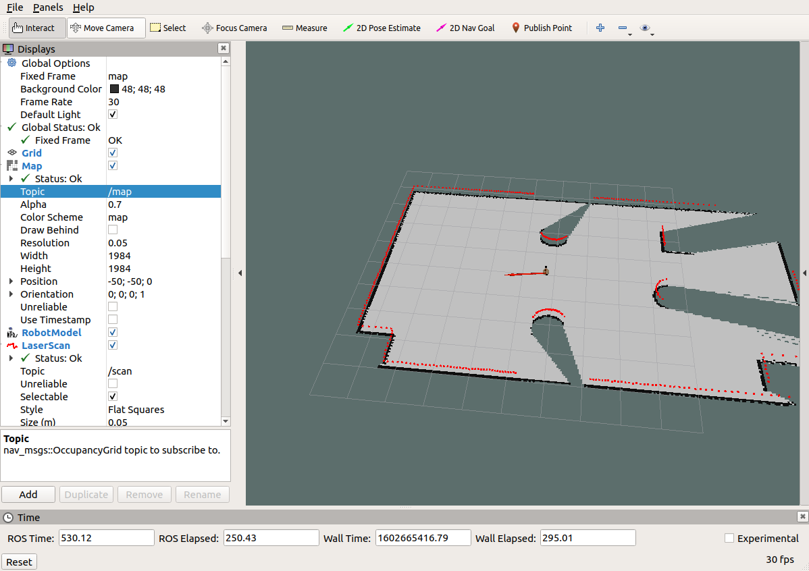最后，就可以通过键盘控制gazebo中的机器人运动，同时，在rviz中可以显示gmapping发布的栅格地图数据了，下一步，还需要将地图单独保存。

___

**另请参考:**

-   [http://wiki.ros.org/gmapping](http://wiki.ros.org/gmapping)


#### 7.2.2 地图服务

上一节我们已经实现通过gmapping的构建地图并在rviz中显示了地图，不过，上一节中地图数据是保存在内存中的，当节点关闭时，数据也会被一并释放，我们需要将栅格地图序列化到的磁盘以持久化存储，后期还要通过反序列化读取磁盘的地图数据再执行后续操作。在ROS中，地图数据的序列化与反序列化可以通过 map\_server 功能包实现。

1.map\_server简介

map\_server功能包中提供了两个节点: map\_saver 和 map\_server，前者用于将栅格地图保存到磁盘，后者读取磁盘的栅格地图并以服务的方式提供出去。

map\_server安装前面也有介绍，命令如下:

> `sudo apt install ros-<ROS版本>-map-server`

2.map\_server使用之地图保存节点(map\_saver)

2.1map\_saver节点说明

**订阅的topic:**

map(nav\_msgs/OccupancyGrid)

-   订阅此话题用于生成地图文件。

2.2地图保存launch文件

地图保存的语法比较简单，编写一个launch文件，内容如下:

/home/book/ws/src/nav_demo/launch/nav02_map_save.launch

```xml
<launch>
    <arg name="filename" value="$(find nav_demo)/map/nav" />
    <node name="map_save" pkg="map_server" type="map_saver" args="-f $(arg filename)" />
</launch>
```

其中 mymap 是指地图的保存路径以及保存的文件名称。

SLAM建图完毕后，执行该launch文件即可。

测试:

> 首先，参考上一节，依次启动仿真环境，键盘控制节点与SLAM节点；
>
> 然后，通过键盘控制机器人运动并绘图；
>
> 最后，通过上述地图保存方式保存地图。
>
> 结果：在指定路径下会生成两个文件，xxx.pgm 与 xxx.yaml

2.3 保存结果解释

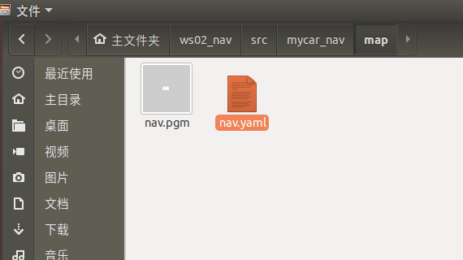

xxx.pgm 本质是一张图片，直接使用图片查看程序即可打开。

xxx.yaml 保存的是地图的元数据信息，用于描述图片，内容格式如下:

/home/book/ws/src/nav_demo/map/nav.yaml

```yaml
#1.声明地图图片资源的路径
image: /home/book/ws/src/nav_demo/map/nav.pgm
#2.地图刻度尺 单位：米/像素
resolution: 0.050000
#3.地图右下角相对于Axes绝对坐标系的位姿信息（相对于rviz原点的位置）[x,y,偏航角]
origin: [-50.000000, -50.000000, 0.000000]
#4.取反（黑白变换）
negate: 0

# 地图的障碍物判断：
# 最终地图结果：白色是可通行区域，黑色的障碍物，蓝灰是未知区域
# 判断规则：
# 1.地图中的每个像素都有取值[0,255],白色255，黑色0
# 2.根据像素值计算一个比例： p=(255-x)/255 白色0 黑色1，灰色是介于0~1的值
# 3.判断是障碍物：p>occupied_thresh是障碍物，p<free_thresh是无障碍物
# 4.如果像素值在两阈值之间，表示未知区域

#5.占用阈值
occupied_thresh: 0.65
#6.空闲阈值 （占用阈值和空闲阈值用于判断地图上的是否有障碍物）
free_thresh: 0.196
```

解释:

-   **image**:被描述的图片资源路径，可以是绝对路径也可以是相对路径。
    
-   **resolution**: 图片分片率(单位: m/像素)。
    
-   **origin**: 地图中左下像素的二维姿势，为（x，y，偏航），偏航为逆时针旋转（偏航= 0表示无旋转）。
    
-   **occupied_thresh**: 占用概率大于此阈值的像素被视为完全占用。
    
-   **free_thresh**: 占用率小于此阈值的像素被视为完全空闲。
    
-   **negate**: 是否应该颠倒白色/黑色自由/占用的语义。

map\_server 中障碍物计算规则:

1.  地图中的每一个像素取值在 \[0,255\] 之间，白色为 255，黑色为 0，该值设为 x；
2.  map\_server 会将像素值作为判断是否是障碍物的依据，首先计算比例: p = (255 - x) / 255.0，白色为0，黑色为1(negate为true，则p = x / 255.0)；
3.  根据步骤2计算的比例判断是否是障碍物，如果 p > occupied\_thresh 那么视为障碍物，如果 p < free\_thresh 那么视为无物。

备注:

-   图片也可以根据需求编辑。

3.map\_server使用之地图服务(map\_server)

3.1map\_server节点说明

**发布的话题**

map\_metadata（nav\_msgs / MapMetaData）

-   发布地图元数据。

map（nav\_msgs / OccupancyGrid）

-   地图数据。

**服务**

static\_map（nav\_msgs / GetMap）

-   通过此服务获取地图。

**参数**

〜frame\_id（字符串，默认值：“map”）

-   地图坐标系。

3.2地图读取

通过 map\_server 的 map\_server 节点可以读取栅格地图数据，编写 launch 文件如下:

/home/book/ws/src/nav_demo/launch/nav03_map_server.launch

```xml
<launch>
    <!-- 设置地图的配置文件 -->
    <arg name="map" default="nav.yaml" />
    <!-- 运行地图服务器，并且加载设置的地图-->
    <node name="map_server" pkg="map_server" type="map_server" args="$(find nav_demo)/map/$(arg map)"/>
</launch>
```

其中参数是地图描述文件的资源路径，执行该launch文件，该节点会发布话题:map(nav\_msgs/OccupancyGrid)

3.3地图显示

在 rviz 中使用 map 组件可以显示栅格地图：

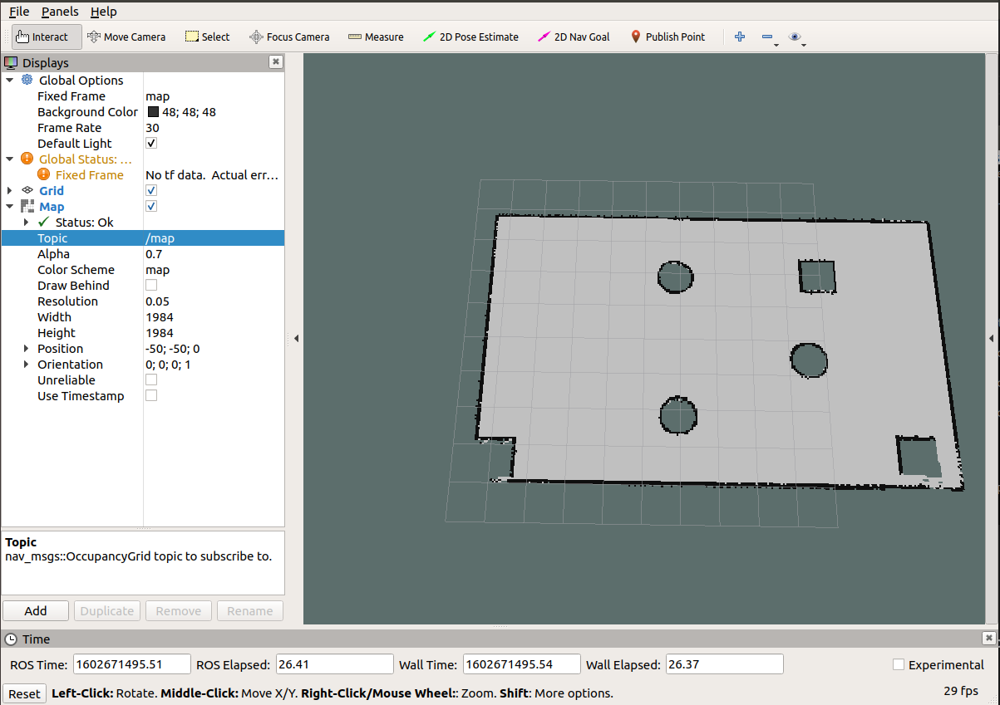

___

另请参考:

-   [http://wiki.ros.org/map\_server](http://wiki.ros.org/map_server)

#### 7.2.3 定位

所谓定位就是推算机器人自身在全局地图中的位置，当然，SLAM中也包含定位算法实现，不过SLAM的定位是用于构建全局地图的，是属于导航开始之前的阶段，而当前定位是用于导航中，导航中，机器人需要按照设定的路线运动，通过定位可以判断机器人的实际轨迹是否符合预期。在ROS的导航功能包集navigation中提供了 ==amcl== 功能包，用于实现导航中的机器人==定位。==

1.amcl简介

AMCL(adaptive Monte Carlo Localization) 是用于2D移动机器人的概率定位系统，它实现了自适应（或KLD采样）蒙特卡洛定位方法，可以根据已有地图使用粒子滤波器推算机器人位置。

amcl已经被集成到了navigation包，navigation安装前面也有介绍，命令如下:

> `sudo apt install ros-<ROS版本>-navigation`

2.amcl节点说明

amcl 功能包中的核心节点是:amcl。为了方便调用，需要先了解该节点订阅的话题、发布的话题、服务以及相关参数。

3.1订阅的Topic

scan(sensor\_msgs/LaserScan)

-   激光雷达数据。

tf(tf/tfMessage)

-   坐标变换消息。

initialpose(geometry\_msgs/PoseWithCovarianceStamped)

-   用来初始化粒子滤波器的均值和协方差。

map(nav\_msgs/OccupancyGrid)

-   获取地图数据。

3.2发布的Topic

amcl\_pose(geometry\_msgs/PoseWithCovarianceStamped)

-   机器人在地图中的位姿估计。

particlecloud(geometry\_msgs/PoseArray)

-   位姿估计集合，rviz中可以被 PoseArray 订阅然后图形化显示机器人的位姿估计集合。

tf(tf/tfMessage)

-   发布从 odom 到 map 的转换。

3.3服务

global\_localization(std\_srvs/Empty)

-   初始化全局定位的服务。

request\_nomotion\_update(std\_srvs/Empty)

-   手动执行更新和发布更新的粒子的服务。

set\_map(nav\_msgs/SetMap)

-   手动设置新地图和姿态的服务。

3.4调用的服务

static\_map(nav\_msgs/GetMap)

-   调用此服务获取地图数据。

3.5参数

~odom\_model\_type(string, default:"diff")

-   里程计模型选择: "diff","omni","diff-corrected","omni-corrected" (diff 差速、omni 全向轮)

~odom\_frame\_id(string, default:"odom")

-   里程计坐标系。

~base\_frame\_id(string, default:"base\_link")

-   机器人极坐标系。

~global\_frame\_id(string, default:"map")

-   地图坐标系。

.... 参数较多，上述是几个较为常用的参数，其他参数介绍可参考官网。

3.6坐标变换

里程计本身也是可以协助机器人定位的，不过里程计存在累计误差且一些特殊情况时(车轮打滑)会出现定位错误的情况，amcl 则可以通过估算机器人在地图坐标系下的姿态，再结合里程计提高定位准确度。

-   里程计定位:只是通过里程计数据实现 /odom\_frame 与 /base\_frame 之间的坐标变换。
-   amcl定位: 可以提供 /map\_frame 、/odom\_frame 与 /base\_frame 之间的坐标变换。

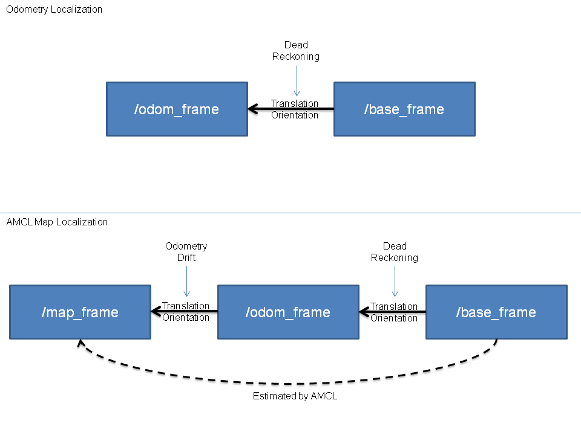

3.amcl使用

3.1编写amcl节点相关的launch文件

关于launch文件的实现，在amcl功能包下的example目录已经给出了示例，可以作为参考，具体实现:

```
roscd amcl
ls examples
```

该目录下会列出两个文件: amcl\_diff.launch 和 amcl\_omni.launch 文件，前者适用于差分移动机器人，后者适用于全向移动机器人，可以按需选择，此处参考前者，新建 launch 文件，复制 amcl\_diff.launch 文件内容并修改如下:

/home/book/ws/src/nav_demo/launch/nav04_amcl.launch

```xml
<launch>
<node pkg="amcl" type="amcl" name="amcl" output="screen">
    <!-- Publish scans from best pose at a max of 10 Hz -->
    <param name="odom_model_type" value="diff"/>
    <param name="odom_alpha5" value="0.1"/>
    <param name="transform_tolerance" value="0.2" />
    <param name="gui_publish_rate" value="10.0"/>
    <param name="laser_max_beams" value="30"/>
    <param name="min_particles" value="500"/>
    <param name="max_particles" value="5000"/>
    <param name="kld_err" value="0.05"/>
    <param name="kld_z" value="0.99"/>
    <param name="odom_alpha1" value="0.2"/>
    <param name="odom_alpha2" value="0.2"/>
    <!-- translation std dev, m -->
    <param name="odom_alpha3" value="0.8"/>
    <param name="odom_alpha4" value="0.2"/>
    <param name="laser_z_hit" value="0.5"/>
    <param name="laser_z_short" value="0.05"/>
    <param name="laser_z_max" value="0.05"/>
    <param name="laser_z_rand" value="0.5"/>
    <param name="laser_sigma_hit" value="0.2"/>
    <param name="laser_lambda_short" value="0.1"/>
    <param name="laser_lambda_short" value="0.1"/>
    <param name="laser_model_type" value="likelihood_field"/>
    <!-- <param name="laser_model_type" value="beam"/> -->
    <param name="laser_likelihood_max_dist" value="2.0"/>
    <param name="update_min_d" value="0.2"/>
    <param name="update_min_a" value="0.5"/>

    <!-- 设置坐标系：odom,map和机器人基坐标系 -->
    <param name="odom_frame_id" value="odom"/><!-- 添加里程计坐标系 -->
    <param name="base_frame_id" value="base_footprint"/><!-- 添加基坐标系 -->
    <param name="global_frame_id" value="map"/><!-- 添加地图坐标系 -->

    <param name="resample_interval" value="1"/>
    <param name="transform_tolerance" value="0.1"/>
    <param name="recovery_alpha_slow" value="0.0"/>
    <param name="recovery_alpha_fast" value="0.0"/>
</node>
</launch>
```

3.2编写测试launch文件

amcl节点是不可以单独运行的，运行 amcl 节点之前，需要先加载全局地图，然后启动 rviz 显示定位结果，上述节点可以集成进launch文件，内容示例如下:

/home/book/ws/src/nav_demo/launch/test_amcl.launch

```xml
<launch>
    <!-- 运行rviz -->
    <node pkg="joint_state_publisher" name="joint_state_publisher" type="joint_state_publisher" />
    <node pkg="robot_state_publisher" name="robot_state_publisher" type="robot_state_publisher" />
    <node pkg="rviz" type="rviz" name="rviz" />

    <!-- 运行地图服务器，并且加载设置的地图-->
    <include file="$(find nav_demo)/launch/nav03_map_server.launch" />
    <!-- 启动AMCL节点 -->
    <include file="$(find nav_demo)/launch/nav04_amcl.launch" />
</launch>
```

当然，launch文件中地图服务节点和amcl节点中的包名、文件名需要根据自己的设置修改。

3.3执行

1.先启动 Gazebo 仿真环境(此过程略)；

```
roslaunch urdf02_gazebo demo03_env.launch 
```

2.启动键盘控制节点：

```
rosrun teleop_twist_keyboard teleop_twist_keyboard.py
```

3.启动上一步中集成地图服务、amcl 与 rviz 的 launch 文件；

```
roslaunch nav_demo test_amcl.launch
```

4.在启动的 rviz 中，添加RobotModel、Map组件，分别显示机器人模型与地图，添加 posearray 插件，设置topic为particlecloud来显示 amcl 预估的当前机器人的位姿，箭头越是密集，说明当前机器人处于此位置的概率越高；

5.通过键盘控制机器人运动，会发现 posearray 也随之而改变。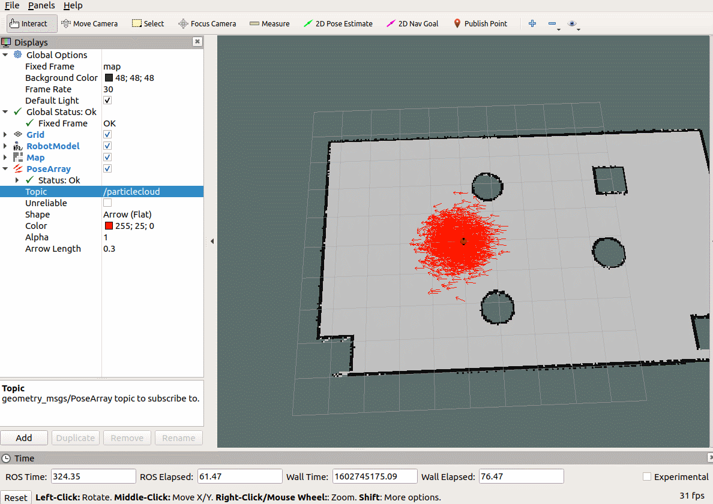

___

**另请参考:**

-   [http://wiki.ros.org/amcl](http://wiki.ros.org/amcl)


#### 7.2.4 路径规划

毋庸置疑的，路径规划是导航中的核心功能之一，在ROS的导航功能包集navigation中提供了 move\_base 功能包，用于实现此功能。

1.move\_base简介

move\_base 功能包提供了基于动作(action)的路径规划实现，move\_base 可以根据给定的目标点，控制机器人底盘运动至目标位置，并且在运动过程中会连续反馈机器人自身的姿态与目标点的状态信息。如前所述(7.1)move\_base主要由全局路径规划与本地路径规划组成。

move\_base已经被集成到了navigation包，navigation安装前面也有介绍，命令如下:

> `sudo apt install ros-<ROS版本>-navigation`

2.move\_base节点说明

move\_base功能包中的核心节点是:move\_base。为了方便调用，需要先了解该节点action、订阅的话题、发布的话题、服务以及相关参数。

2.1动作

**动作订阅**

move\_base/goal(move\_base\_msgs/MoveBaseActionGoal)

-   move\_base 的运动规划目标。

move\_base/cancel(actionlib\_msgs/GoalID)

-   取消目标。

**动作发布**

move\_base/feedback(move\_base\_msgs/MoveBaseActionFeedback)

-   连续反馈的信息，包含机器人底盘坐标。

move\_base/status(actionlib\_msgs/GoalStatusArray)

-   发送到move\_base的目标状态信息。

move\_base/result(move\_base\_msgs/MoveBaseActionResult)

-   操作结果(此处为空)。

2.2订阅的Topic

move\_base\_simple/goal(geometry\_msgs/PoseStamped)

-   运动规划目标(与action相比，没有连续反馈，无法追踪机器人执行状态)。

2.3发布的Topic

cmd\_vel(geometry\_msgs/Twist)

-   输出到机器人底盘的运动控制消息。

2.4服务

~make\_plan(nav\_msgs/GetPlan)

-   请求该服务，可以获取给定目标的规划路径，但是并不执行该路径规划。

~clear\_unknown\_space(std\_srvs/Empty)

-   允许用户直接清除机器人周围的未知空间。

~clear\_costmaps(std\_srvs/Empty)

-   允许清除代价地图中的障碍物，可能会导致机器人与障碍物碰撞，请慎用。

2.5参数

请参考官网。

3.move\_base与代价地图

3.1概念

机器人导航(尤其是路径规划模块)是依赖于地图的，地图在SLAM时已经有所介绍了，ROS中的地图其实就是一张图片，这张图片有宽度、高度、分辨率等元数据，在图片中使用灰度值来表示障碍物存在的概率。不过SLAM构建的地图在导航中是不可以直接使用的，因为：

1.  SLAM构建的地图是静态地图，而导航过程中，障碍物信息是可变的，可能障碍物被移走了，也可能添加了新的障碍物，导航中需要时时的获取障碍物信息；
2.  在靠近障碍物边缘时，虽然此处是空闲区域，但是机器人在进入该区域后可能由于其他一些因素，比如：惯性、或者不规则形体的机器人转弯时可能会与障碍物产生碰撞，安全起见，最好在地图的障碍物边缘设置警戒区，尽量禁止机器人进入...

所以，静态地图无法直接应用于导航，其基础之上需要添加一些辅助信息的地图，比如时时获取的障碍物数据，基于静态地图添加的膨胀区等数据。

3.2组成

代价地图有两张:global\_costmap(全局代价地图) 和 local\_costmap(本地代价地图)，前者用于全局路径规划，后者用于本地路径规划。

两张代价地图都可以多层叠加,一般有以下层级:

-   Static Map Layer：静态地图层，SLAM构建的静态地图。
    
-   Obstacle Map Layer：障碍地图层，传感器感知的障碍物信息。
    
-   Inflation Layer：膨胀层，在以上两层地图上进行膨胀（向外扩张），以避免机器人的外壳会撞上障碍物。
    
-   Other Layers：自定义costmap。
    

多个layer可以按需自由搭配。

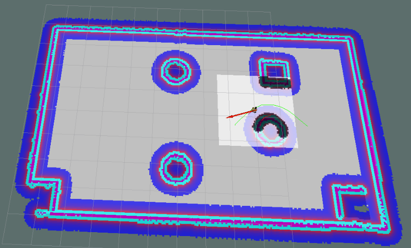

3.3碰撞算法

在ROS中，如何计算代价值呢？请看下图:

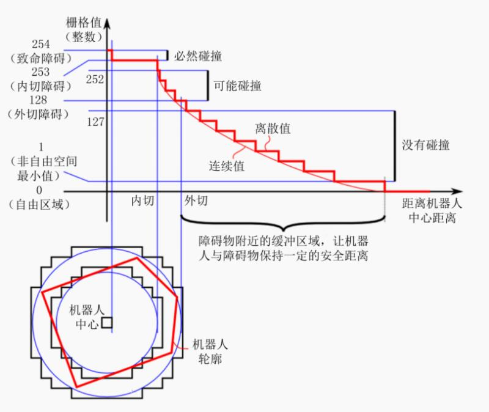

上图中，横轴是距离机器人中心的距离，纵轴是代价地图中栅格的灰度值。

-   致命障碍:栅格值为254，此时障碍物与机器人中心重叠，必然发生碰撞；
-   内切障碍:栅格值为253，此时障碍物处于机器人的内切圆内，必然发生碰撞；
-   外切障碍:栅格值为\[128,252\]，此时障碍物处于其机器人的外切圆内，处于碰撞临界，不一定发生碰撞；
-   非自由空间:栅格值为(0,127\]，此时机器人处于障碍物附近，属于危险警戒区，进入此区域，将来可能会发生碰撞；
-   自由区域:栅格值为0，此处机器人可以自由通过；
-   未知区域:栅格值为255，还没探明是否有障碍物。

膨胀空间的设置可以参考非自由空间。

4.move\_base使用

路径规划算法在move\_base功能包的move\_base节点中已经封装完毕了，但是还不可以直接调用，因为算法虽然已经封装了，但是该功能包面向的是各种类型支持ROS的机器人，不同类型机器人可能大小尺寸不同，传感器不同，速度不同，应用场景不同....最后可能会导致不同的路径规划结果，那么在调用路径规划节点之前，我们还需要配置机器人参数。具体实现如下:

1.  先编写launch文件模板
2.  编写配置文件
3.  集成导航相关的launch文件
4.  测试

4.1launch文件

关于move\_base节点的调用，模板如下:

/home/book/ws/src/nav_demo/launch/nav05_path.launch

```xml
<launch>

    <!-- respawn="false":当此节点关闭后，不再重启   clear_params="true"：清除默认参数 -->
    <node pkg="move_base" type="move_base" respawn="false" name="move_base" output="screen" clear_params="true">
        <rosparam file="$(find nav_demo)/param/costmap_common_params.yaml" command="load" ns="global_costmap" />
        <rosparam file="$(find nav_demo)/param/costmap_common_params.yaml" command="load" ns="local_costmap" />
        <rosparam file="$(find nav_demo)/param/local_costmap_params.yaml" command="load" />
        <rosparam file="$(find nav_demo)/param/global_costmap_params.yaml" command="load" />
        <rosparam file="$(find nav_demo)/param/base_local_planner_params.yaml" command="load" />
    </node>

</launch>

```

launch文件解释:

启动了 move\_base 功能包下的 move\_base 节点，respawn 为 false，意味着该节点关闭后，不会被重启；clear\_params 为 true，意味着每次启动该节点都要清空私有参数然后重新载入；通过 rosparam 会载入若干 yaml 文件用于配置参数，这些yaml文件的配置以及作用详见下一小节内容。

4.2配置文件

关于配置文件的编写，可以参考一些成熟的机器人的路径规划实现，比如: turtlebot3，github链接：[https://github.com/ROBOTIS-GIT/turtlebot3/tree/master/turtlebot3\_navigation/param](https://github.com/ROBOTIS-GIT/turtlebot3/tree/master/turtlebot3_navigation/param)，先下载这些配置文件备用。

在功能包下新建 param 目录，复制下载的文件到此目录: costmap\_common\_params\_burger.yaml、local\_costmap\_params.yaml、global\_costmap\_params.yaml、base\_local\_planner\_params.yaml，并将costmap\_common\_params\_burger.yaml 重命名为:costmap\_common\_params.yaml。

配置文件修改以及解释:

4.2.1costmap_common_params.yaml

该文件是move\_base 在全局路径规划与本地路径规划时调用的通用参数，包括:机器人的尺寸、距离障碍物的安全距离、传感器信息等。配置参考如下:

/home/book/ws/src/nav_demo/param/costmap_common_params.yaml

```yaml
#机器人几何参，如果机器人是圆形，设置 robot_radius,如果是其他形状设置 footprint
robot_radius: 0.12 #圆形
# footprint: [[-0.12, -0.12], [-0.12, 0.12], [0.12, 0.12], [0.12, -0.12]] #其他形状

obstacle_range: 3.0 # 用于障碍物探测，比如: 值为 3.0，意味着检测到距离小于 3 米的障碍物时，就会引入代价地图
raytrace_range: 3.5 # 用于清除障碍物，比如：值为 3.5，意味着清除代价地图中 3.5 米以外的障碍物


#膨胀半径，扩展在碰撞区域以外的代价区域，使得机器人规划路径避开障碍物
inflation_radius: 0.2
#代价比例系数，越大则代价值越小
cost_scaling_factor: 3.0

#地图类型
map_type: costmap
#导航包所需要的传感器
observation_sources: scan
#对传感器的坐标系和数据进行配置。这个也会用于代价地图添加和清除障碍物。例如，你可以用激光雷达传感器用于在代价地图添加障碍物，再添加kinect用于导航和清除障碍物。
scan: {sensor_frame: laser, data_type: LaserScan, topic: scan, marking: true, clearing: true}
```

4.2.2global\_costmap\_params.yaml

该文件用于全局代价地图参数设置:

/home/book/ws/src/nav_demo/param/global_costmap_params.yaml

```yaml
global_costmap:
  global_frame: map #地图坐标系
  robot_base_frame: base_footprint #机器人坐标系
  # 以此实现坐标变换

  update_frequency: 1.0 #代价地图更新频率
  publish_frequency: 1.0 #代价地图的发布频率
  transform_tolerance: 0.5 #等待坐标变换发布信息的超时时间

  static_map: true # 是否使用一个地图或者地图服务器来初始化全局代价地图，如果不使用静态地图，这个参数为false.
```

4.2.3local\_costmap\_params.yaml

该文件用于局部代价地图参数设置:

/home/book/ws/src/nav_demo/param/local_costmap_params.yaml

```yaml
local_costmap:
  global_frame: odom #里程计坐标系
  robot_base_frame: base_footprint #机器人坐标系

  update_frequency: 10.0 #代价地图更新频率
  publish_frequency: 10.0 #代价地图的发布频率
  transform_tolerance: 0.5 #等待坐标变换发布信息的超时时间

  static_map: false  #不需要静态地图，可以提升导航效果
  rolling_window: true #是否使用动态窗口，默认为false，在静态的全局地图中，地图不会变化
  width: 3 # 局部地图宽度 单位是 m
  height: 3 # 局部地图高度 单位是 m
  resolution: 0.05 # 局部地图分辨率 单位是 m，一般与静态地图分辨率保持一致
```

4.2.4base\_local\_planner\_params

基本的局部规划器参数配置，这个配置文件设定了机器人的最大和最小速度限制值，也设定了加速度的阈值。

/home/book/ws/src/nav_demo/param/base_local_planner_params.yaml

```yaml
TrajectoryPlannerROS:

# Robot Configuration Parameters
  max_vel_x: 0.5 # X 方向最大速度
  min_vel_x: 0.1 # X 方向最小速速

  max_vel_theta:  1.0 # 最大角速度
  min_vel_theta: -1.0 # 最小角速度
  min_in_place_vel_theta: 1.0 # 最小自转角速度

  acc_lim_x: 1.0 # X 加速限制
  acc_lim_y: 0.0 # Y 加速限制
  acc_lim_theta: 0.6 # 角速度加速限制

# Goal Tolerance Parameters，目标公差
  xy_goal_tolerance: 0.10
  yaw_goal_tolerance: 0.05

# Differential-drive robot configuration
# 是否是全向移动机器人
  holonomic_robot: false

# Forward Simulation Parameters，前进模拟参数
  sim_time: 0.8
  vx_samples: 18
  vtheta_samples: 20
  sim_granularity: 0.05
```

4.2.5参数配置技巧

以上配置在实操中，可能会出现机器人在本地路径规划时与全局路径规划不符而进入膨胀区域出现假死的情况，如何尽量避免这种情形呢？

> 全局路径规划与本地路径规划虽然设置的参数是一样的，但是二者路径规划和避障的职能不同，可以采用不同的参数设置策略:
>
> -   全局代价地图可以将膨胀半径和障碍物系数设置的偏大一些；
> -   本地代价地图可以将膨胀半径和障碍物系数设置的偏小一些。
>
> 这样，在全局路径规划时，规划的路径会尽量远离障碍物，而本地路径规划时，机器人即便偏离全局路径也会和障碍物之间保留更大的自由空间，从而避免了陷入“假死”的情形。

4.3launch文件集成

如果要实现导航，需要集成地图服务、amcl 、move\_base 与 Rviz 等，集成示例如下:

/home/book/ws/src/nav_demo/launch/nav06_test.launch

```xml
<launch>
    <!-- 地图服务-->
    <include file="$(find nav_demo)/launch/nav03_map_server.launch" />
    <!-- 启动AMCL节点 -->
    <include file="$(find nav_demo)/launch/nav04_amcl.launch" />
    <!-- 运行move_base节点 -->
    <include file="$(find nav_demo)/launch/nav05_path.launch" />

    <!-- 运行rviz -->
    <node pkg="joint_state_publisher" name="joint_state_publisher" type="joint_state_publisher" />
    <node pkg="robot_state_publisher" name="robot_state_publisher" type="robot_state_publisher" />
    <node pkg="rviz" type="rviz" name="rviz" args="-d $(find nav_demo)/config/nav_test02.rviz"/>

</launch>
```

4.4测试

1.先启动 Gazebo 仿真环境(此过程略)；

2.启动导航相关的 launch 文件；

3.添加Rviz组件(参考演示结果),可以将配置数据保存，后期直接调用；

全局代价地图与本地代价地图组件配置如下:

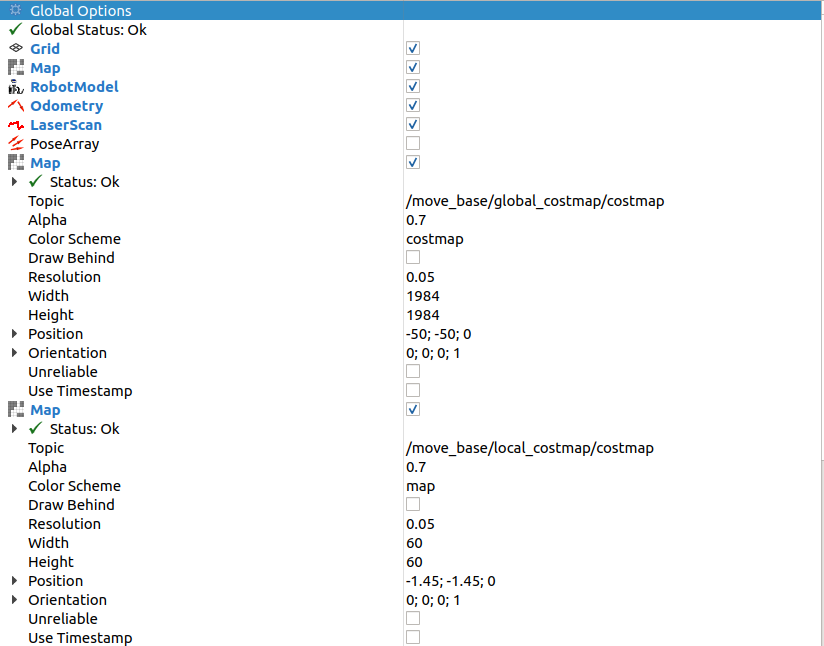

全局路径规划与本地路径规划组件配置如下:

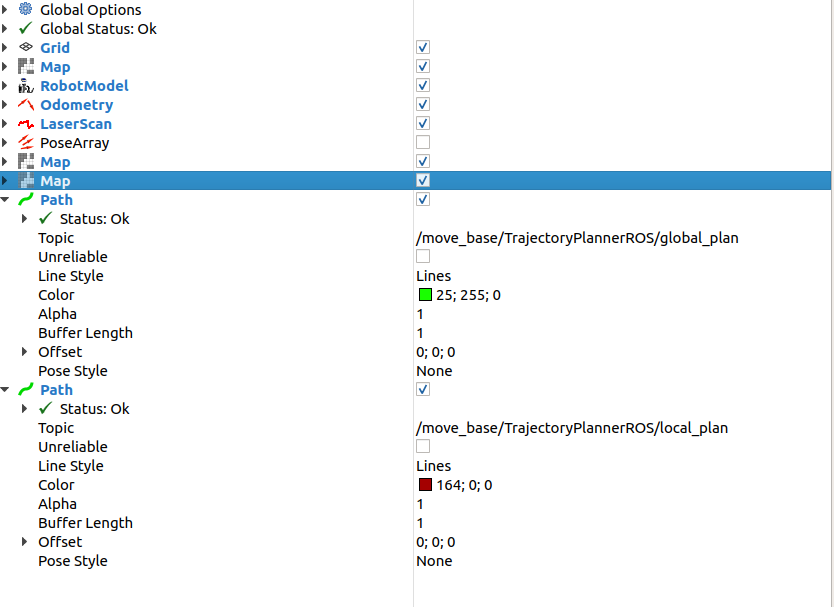

4.通过Rviz工具栏的 2D Nav Goal设置目的地实现导航。


5.也可以在导航过程中，添加新的障碍物，机器人也可以自动躲避障碍物。

___

**另请参考:**

-   [http://wiki.ros.org/move\_base](http://wiki.ros.org/move_base)


#### 7.2.5 导航与SLAM

> 场景:在 7.2.1 导航实现01\_SLAM建图中，我们是通过键盘控制机器人移动实现建图的，而后续又介绍了机器人的自主移动实现，那么可不可以将二者结合，实现机器人自主移动的SLAM建图呢？

上述需求是可行的。虽然可能会有疑问，导航时需要地图信息，之前导航实现时，是通过 map\_server 包的 map\_server 节点来发布地图信息的，如果不先通过SLAM建图，那么如何发布地图信息呢？SLAM建图过程中本身就会时时发布地图信息，所以无需再使用map\_server，SLAM已经发布了话题为 /map 的地图消息了，且导航需要定位模块，SLAM本身也是可以实现定位的。

该过程实现比较简单，步骤如下:

1.  编写launch文件，
1.  集成SLAM与move\_base相关节点；
2.  执行launch文件并测试。

1.编写launc文件

当前launch文件实现，无需调用map\_server的相关节点，只需要启动SLAM节点与move\_base节点，示例内容如下:

/home/book/ws/src/nav_demo/launch/nav07_slam_auto.launch

```xml
<!-- 集成SLAM与a导航，实现机器人自主移动的地图构建 -->
<launch>
    <!-- 启动SLAM节点 -->
    <include file="$(find nav_demo)/launch/nav01_slam.launch" />
    <!-- 运行move_base节点 -->
    <include file="$(find nav_demo)/launch/nav05_path.launch" />
    <!-- 运行rviz -->
    <!-- <node pkg="rviz" type="rviz" name="rviz" args="-d $(find mycar_nav)/rviz/nav.rviz" /> -->
    <!-- nav01_slam.launch 已经包含了运行rviz的语句了 -->
</launch>
```

2.测试

1.首先运行gazebo仿真环境；

2.然后执行launch文件；

3.在rviz中通过2D Nav Goal设置目标点，机器人开始自主移动并建图了；

4.最后可以使用 map\_server 保存地图。

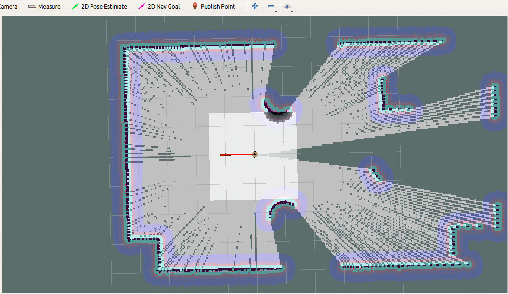

### 7.3 导航相关消息

在导航功能包集中包含了诸多节点，毋庸置疑的，不同节点之间的通信使用到了消息中间件(数据载体)，在上一节的实现中，这些消息已经在rviz中做了可视化处理，比如:地图、雷达、摄像头、里程计、路径规划...的相关消息在rviz中提供了相关组件，本节主要介绍这些消息的具体格式。

#### 7.3.1 地图

地图相关的消息主要有两个:

nav\_msgs/MapMetaData

-   地图元数据，包括地图的宽度、高度、分辨率等。

nav\_msgs/OccupancyGrid

-   地图栅格数据，一般会在rviz中以图形化的方式显示。

1.nav\_msgs/MapMetaData

调用`rosmsg info nav_msgs/MapMetaData`显示消息内容如下:

```shell
time map_load_time
float32 resolution #地图分辨率	x米/像素
uint32 width #地图宽度
uint32 height #地图高度
geometry_msgs/Pose origin #地图位姿数据
  geometry_msgs/Point position
    float64 x
    float64 y
    float64 z
  geometry_msgs/Quaternion orientation
    float64 x
    float64 y
    float64 z
    float64 w
```

测试

```shell
roslaunch nav_demo nav03_map_server.launch 	#读取已保存的地图，并发布话题
```

```shell
rostopic echo /map >> map1.text	#将地图话题数据保存到map1.txt
```

查看全局代价地图

测试（完整仿真环境）

```shell
roslaunch urdf02_gazebo demo03_env.launch	#启动gazebo仿真环境
```

```shell
roslaunch nav_demo nav06_test.launch	 #启动完整导航代码
```

```shell
rostopic echo /move_base/global_costmap/costmap >> map2.txt		#将代价地图数据保存到map2.txt
```

​			

2.nav\_msgs/OccupancyGrid

调用 `rosmsg info nav_msgs/OccupancyGrid`显示消息内容如下:

```shell
std_msgs/Header header
  uint32 seq
  time stamp
  string frame_id
#--- 地图元数据
nav_msgs/MapMetaData info
  time map_load_time
  float32 resolution
  uint32 width
  uint32 height
  geometry_msgs/Pose origin
    geometry_msgs/Point position
      float64 x
      float64 y
      float64 z
    geometry_msgs/Quaternion orientation
      float64 x
      float64 y
      float64 z
      float64 w
#--- 地图内容数据，数组长度 = width * height
int8[] data
```


#### 7.3.2 里程计

里程计相关消息是:nav\_msgs/Odometry，调用`rosmsg info nav_msgs/Odometry` 显示消息内容如下:

```shell
std_msgs/Header header
  uint32 seq
  time stamp
  string frame_id
string child_frame_id
geometry_msgs/PoseWithCovariance pose
  geometry_msgs/Pose pose #里程计位姿
    geometry_msgs/Point position
      float64 x
      float64 y
      float64 z
    geometry_msgs/Quaternion orientation
      float64 x
      float64 y
      float64 z
      float64 w
  float64[36] covariance
geometry_msgs/TwistWithCovariance twist
  geometry_msgs/Twist twist #速度
    geometry_msgs/Vector3 linear
      float64 x
      float64 y
      float64 z
    geometry_msgs/Vector3 angular
      float64 x
      float64 y
      float64 z    
  # 协方差矩阵
  float64[36] covariance
```

测试

启动gazebo仿真环境、启动完整导航代码

```shell
rostopic echo /odom		#里程计消息
```

```shell
rosrun teleop_twist_keyboard teleop_twist_keyboard.py 
#键盘控制机器人运动，查看里程计消息
```

#### 7.3.3 坐标变换

坐标变换相关消息是: tf/tfMessage，调用`rosmsg info tf/tfMessage` 显示消息内容如下:

```shell
geometry_msgs/TransformStamped[] transforms #包含了多个坐标系相对关系数据的数组
  std_msgs/Header header
    uint32 seq
    time stamp
    string frame_id
  string child_frame_id
  geometry_msgs/Transform transform
    geometry_msgs/Vector3 translation	#子级坐标系相对于父级坐标系的相对关系
      float64 x
      float64 y
      float64 z
    geometry_msgs/Quaternion rotation	#欧拉角相关四元数
      float64 x
      float64 y
      float64 z
      float64 w
```

#### 7.3.4 定位

rviz中amcl起作用，PoseArray插件

定位相关消息是:geometry\_msgs/PoseArray，调用`rosmsg info geometry_msgs/PoseArray`显示消息内容如下:

```shell
std_msgs/Header header
  uint32 seq
  time stamp
  string frame_id
geometry_msgs/Pose[] poses #预估的点位姿组成的数组
  geometry_msgs/Point position
    float64 x
    float64 y
    float64 z
  geometry_msgs/Quaternion orientation
    float64 x
    float64 y
    float64 z
    float64 w
```

#### 7.3.5 目标点与路径规划

rviz中的2D Nav Goal,添加组件Path

目标点相关消息是:move\_base\_msgs/MoveBaseActionGoal，

调用`rosmsg info move_base_msgs/MoveBaseActionGoal`显示消息内容如下:

```shell
std_msgs/Header header
  uint32 seq
  time stamp
  string frame_id	#坐标系id
actionlib_msgs/GoalID goal_id	#标志性序列号
  time stamp
  string id
move_base_msgs/MoveBaseGoal goal	#目标点具体数据
  geometry_msgs/PoseStamped target_pose		#目标位姿
    std_msgs/Header header	#头数据
      uint32 seq	#序列化号
      time stamp	#时间戳
      string frame_id	
    geometry_msgs/Pose pose #目标点位姿
      geometry_msgs/Point position	#位姿坐标
        float64 x
        float64 y
        float64 z
      geometry_msgs/Quaternion orientation	#四元数数据
        float64 x
        float64 y
        float64 z
        float64 w
```

路径规划相关消息是:nav\_msgs/Path，调用`rosmsg info nav_msgs/Path`显示消息内容如下:

导航过程中的绿线

```shell
std_msgs/Header header	#头数据
  uint32 seq
  time stamp
  string frame_id
geometry_msgs/PoseStamped[] poses #由一系列点组成的数组
  std_msgs/Header header	
    uint32 seq
    time stamp
    string frame_id
  geometry_msgs/Pose pose
    geometry_msgs/Point position
      float64 x
      float64 y
      float64 z
    geometry_msgs/Quaternion orientation
      float64 x
      float64 y
      float64 z
      float64 w
```

#### 7.3.6 激光雷达

激光雷达相关消息是:sensor\_msgs/LaserScan，调用`rosmsg info sensor_msgs/LaserScan`显示消息内容如下:

```shell
std_msgs/Header header
  uint32 seq
  time stamp
  string frame_id	#雷达名称
float32 angle_min #起始扫描角度(rad)
float32 angle_max #终止扫描角度(rad)
float32 angle_increment #测量值之间的角距离(rad)
float32 time_increment #测量间隔时间(s)
float32 scan_time #扫描间隔时间(s)
float32 range_min #最小有效距离值(m)
float32 range_max #最大有效距离值(m)
float32[] ranges #一个周期的扫描数据，障碍物距离
float32[] intensities #扫描强度数据，如果设备不支持强度数据，该数组为空
```

测试

启动gazebo与导航代码

```
rostopic echo /scan >> laser.txt
```

#### 7.3.7 导航之相机

深度相机相关消息有:sensor\_msgs/Image、sensor\_msgs/CompressedImage、sensor\_msgs/PointCloud2

sensor\_msgs/Image 对应的一般的图像数据，sensor\_msgs/CompressedImage 对应压缩后的图像数据，sensor\_msgs/PointCloud2 对应的是点云数据(带有深度信息的图像数据)。

调用`rosmsg info sensor_msgs/Image`显示消息内容如下:

```
std_msgs/Header header
  uint32 seq
  time stamp
  string frame_id
uint32 height #高度
uint32 width  #宽度
string encoding #编码格式:RGB、YUV等
uint8 is_bigendian #图像大小端存储模式
uint32 step #一行图像数据的字节数，作为步进参数
uint8[] data #图像数据，长度等于 step * height
```

调用`rosmsg info sensor_msgs/CompressedImage`显示消息内容如下:

```
std_msgs/Header header
  uint32 seq
  time stamp
  string frame_id
string format #压缩编码格式(jpeg、png、bmp)
uint8[] data #压缩后的数据
```

调用`rosmsg info sensor_msgs/PointCloud2`显示消息内容如下:

```shell
std_msgs/Header header
  uint32 seq
  time stamp
  string frame_id
uint32 height #高度
uint32 width  #宽度
sensor_msgs/PointField[] fields #每个点的数据类型
  uint8 INT8=1
  uint8 UINT8=2
  uint8 INT16=3
  uint8 UINT16=4
  uint8 INT32=5
  uint8 UINT32=6
  uint8 FLOAT32=7
  uint8 FLOAT64=8
  string name
  uint32 offset
  uint8 datatype
  uint32 count
bool is_bigendian #图像大小端存储模式
uint32 point_step #单点的数据字节步长
uint32 row_step   #一行数据的字节步长
uint8[] data      #存储点云的数组，总长度为 row_step * height
bool is_dense     #是否有无效点
```

测试

启动gazebo仿真环境

```shell
roslaunch urdf02_gazebo demo04_sensor.launch #启动带相机服务的程序
```

```shell
book@100ask:~$ rostopic info /camera/rgb/image_raw
Type: sensor_msgs/Image

Publishers: 
 * /gazebo (http://100ask:44545/)

Subscribers: None


book@100ask:~$ rostopic info /camera/depth/image_raw 
Type: sensor_msgs/Image

Publishers: 
 * /gazebo (http://100ask:44545/)

Subscribers: None


book@100ask:~$ rostopic info /camera/image_raw
Type: sensor_msgs/Image

Publishers: 
 * /gazebo (http://100ask:44545/)

Subscribers: 
 * /rviz (http://100ask:34169/)
```

```shell
rostopic  echo  /camera/rgb/image_raw  >>  camera.txt		#摄像头数据
```

```shell
rostopic echo /camera/depth/points >> points.txt  #点云数据
```

#### 7.3.5 深度图像转激光数据

本节介绍ROS中的一个功能包:depthimage\_to\_laserscan，顾名思义，该功能包可以将深度图像信息转换成激光雷达信息，应用场景如下:

> 在诸多SLAM算法中，一般都需要订阅激光雷达数据用于构建地图，因为激光雷达可以感知周围环境的深度信息，而深度相机也具备感知深度信息的功能，且最初激光雷达价格比价比较昂贵，那么在传感器选型上可以选用深度相机代替激光雷达吗？

答案是可以的，不过二者发布的消息类型是完全不同的，如果想要实现传感器的置换，那么就需要将深度相机发布的三维的图形信息转换成二维的激光雷达信息，这一功能就是通过depthimage\_to\_laserscan来实现的。

1.depthimage\_to\_laserscan简介

1.1原理

depthimage\_to\_laserscan将实现深度图像与雷达数据转换的原理比较简单，雷达数据是二维的、平面的，深度图像是三维的，是若干二维(水平)数据的纵向叠加，如果将三维的数据转换成二维数据，只需要取深度图的某一层即可，为了方面理解，请看官方示例:

图一:深度相机与外部环境(实物图)

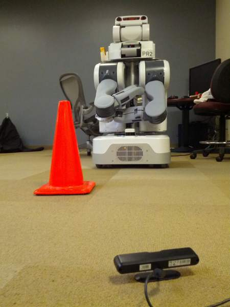

图二:深度相机发布的图片信息，图中彩线对应的是要转换成雷达信息的数据


图三:将图二以点云的方式显示更为直观，图中彩线对应的仍然是要转换成雷达信息的数据

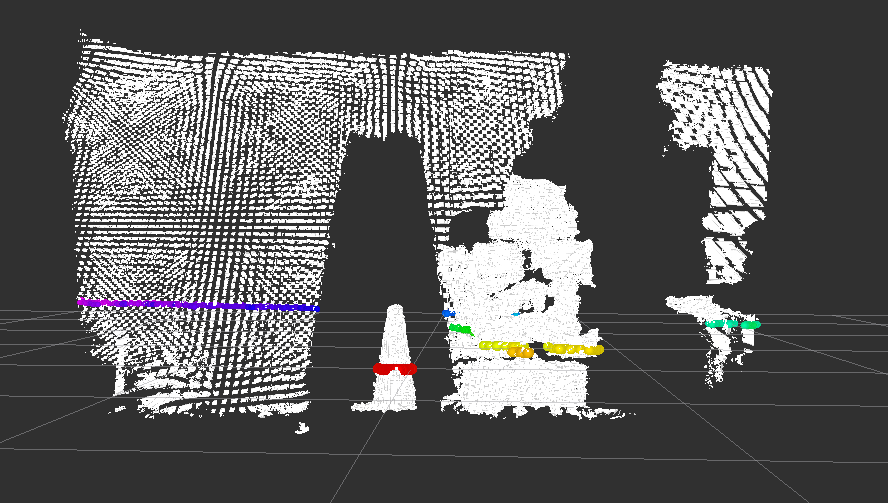

图四:转换之后的结果图(俯视)

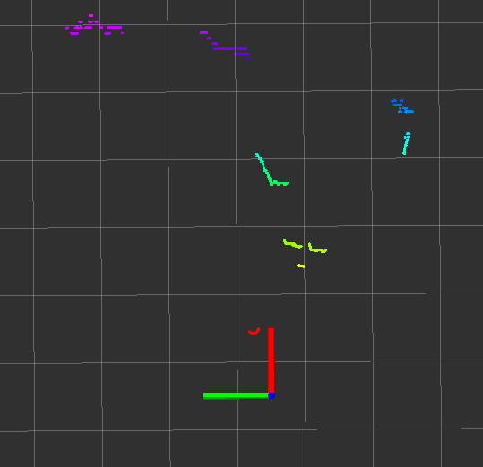

1.2优缺点

**优点:**深度相机的成本一般低于激光雷达，可以降低硬件成本；

**缺点:** 深度相机较之于激光雷达无论是检测范围还是精度都有不小的差距，SLAM效果可能不如激光雷达理想。

1.3安装

使用之前请先安装,命令如下:

```
sudo apt-get install ros-melodic-depthimage-to-laserscan
```

2.depthimage\_to\_laserscan节点说明

depthimage\_to\_laserscan 功能包的核心节点是:depthimage\_to\_laserscan ，为了方便调用，需要先了解该节点订阅的话题、发布的话题以及相关参数。

2.1订阅的Topic

image(sensor\_msgs/Image)

-   输入图像信息。

camera\_info(sensor\_msgs/CameraInfo)

-   关联图像的相机信息。通常不需要重新映射，因为camera\_info将从与image相同的命名空间中进行订阅。

2.2发布的Topic

scan(sensor\_msgs/LaserScan)

-   发布转换成的激光雷达类型数据。

2.3参数

该节点参数较少，只有如下几个，一般需要设置的是: output\_frame\_id。

~scan\_height(int, default: 1 pixel)

-   设置用于生成激光雷达信息的象素行数。

~scan\_time(double, default: 1/30.0Hz (0.033s))

-   两次扫描的时间间隔。

~range\_min(double, default: 0.45m)

-   返回的最小范围。结合range\_max使用，只会获取 range\_min 与 range\_max 之间的数据。

~range\_max(double, default: 10.0m)

-   返回的最大范围。结合range\_min使用，只会获取 range\_min 与 range\_max 之间的数据。

~output\_frame\_id(str, default: camera\_depth\_frame)

-   激光信息的ID。

3.depthimage\_to\_laserscan使用

3.1编写launch文件

编写launch文件执行，将深度信息转换成雷达信息

```shell
<launch>
    <node pkg="depthimage_to_laserscan" type="depthimage_to_laserscan" name="depthimage_to_laserscan">
        <remap from="image" to="/camera/depth/image_raw" />
        <param name="output_frame_id" value="camera"  />
    </node>
</launch>
```

订阅的话题需要根据深度相机发布的话题设置，output\_frame\_id需要与深度相机的坐标系一致。

3.2修改URDF文件

经过信息转换之后，深度相机也将发布雷达数据，为了不产生混淆，可以注释掉 xacro 文件中的关于激光雷达的部分内容。

3.3执行

1.启动gazebo仿真环境，如下:

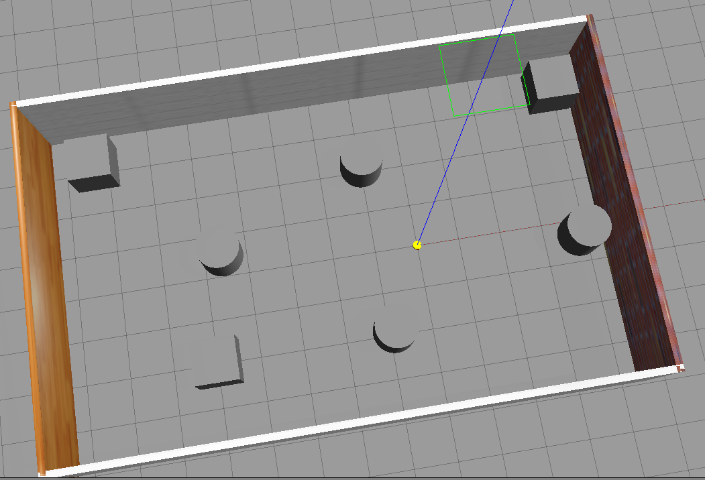

2.启动rviz并添加相关组件(image、LaserScan)，结果如下:

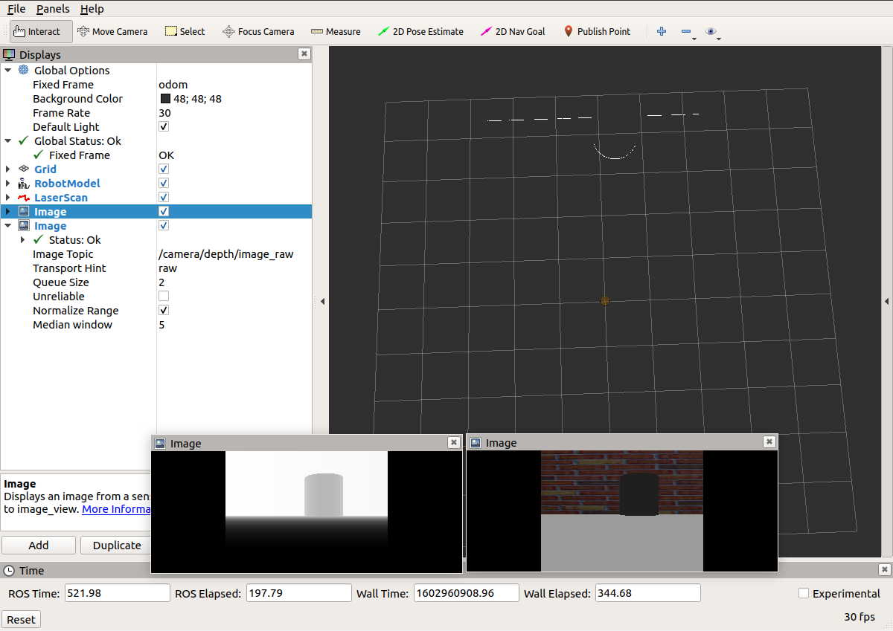4.SLAM应用

现在我们已经实现并测试通过深度图像信息转换成激光雷达信息了，接下来是实践阶段，通过深度相机实现SLAM，流程如下:

1.先启动 Gazebo 仿真环境；

2.启动转换节点；

3.再启动地图绘制的 launch 文件；

4.启动键盘键盘控制节点，用于控制机器人运动建图；

`rosrun teleop_twist_keyboard teleop_twist_keyboard.py`

5.在 rviz 中添加组件，显示栅格地图最后，就可以通过键盘控制gazebo中的机器人运动，同时，在rviz中可以显示gmapping发布的栅格地图数据了，但是，前面也介绍了，由于精度和检测范围的原因，尤其再加之环境的特征点偏少，建图效果可能并不理想，建图中甚至会出现地图偏移的情况。

## 第十章 ROS进阶

在本教程的第二章内容介绍了ROS的核心实现:通信机制 ——话题通信、服务通信和参数服务器。三者结合可以满足ROS中的大多数数据传输相关的应用场景，但是在一些特定场景下可能就有些力不从心了，本章主要介绍之前的通信机制存在的问题以及对应的优化策略，本章主要内容如下:

-   action通信；
-   动态参数；
-   pluginlib；
-   nodelet。

本章预期达成的学习目标:

-   了解服务通信应用的局限性(action的应用场景)，熟练掌握action的理论模型与实现流程；
-   了解参数服务器应用的局限性(动态配置参数的应用场景)，熟练掌握动态配置参数的实现流程；
-   了解插件的概念以及使用流程；
-   了解nodelet的应用场景以及使用流程。

### 10.1 Action 通信

关于action通信，我们先从之前导航中的应用场景开始介绍，描述如下:

> 机器人导航到某个目标点,此过程需要一个节点A发布目标信息，然后一个节点B接收到请求并控制移动，最终响应目标达成状态信息。

乍一看，这好像是服务通信实现，因为需求中要A发送目标，B执行并返回结果，这是一个典型的基于请求响应的应答模式，不过，如果只是使用基本的服务通信实现，存在一个问题：**导航是一个过程，是耗时操作，如果使用服务通信，那么只有在导航结束时，才会产生响应结果，而在导航过程中，节点A是不会获取到任何反馈的，从而可能出现程序"假死"的现象，过程的不可控意味着不良的用户体验，以及逻辑处理的缺陷(比如:导航中止的需求无法实现)。**更合理的方案应该是:导航过程中，可以连续反馈当前机器人状态信息，当导航终止时，再返回最终的执行结果。在ROS中，该实现策略称之为:**action 通信**。

___

**概念**

在ROS中提供了actionlib功能包集，用于实现 action 通信。action 是一种类似于服务通信的实现，其实现模型也包含请求和响应，但是不同的是，在请求和响应的过程中，服务端还可以连续的反馈当前任务进度，客户端可以接收连续反馈并且还可以取消任务。

**action结构图解:**

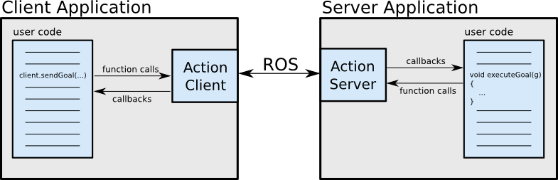

**action通信接口图解:**

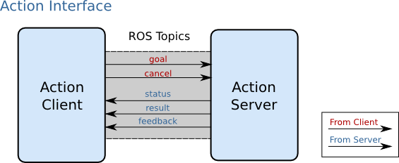

-    goal:目标任务;
-   cacel:取消任务;
-   status:服务端状态;
-   result:最终执行结果(只会发布一次);
-   feedback:连续反馈(可以发布多次)。

**作用**

一般适用于耗时的请求响应场景,用以获取连续的状态反馈。

**案例**

创建两个ROS 节点，服务器和客户端，客户端可以向服务器发送目标数据N(一个整型数据)服务器会计算 1 到 N 之间所有整数的和,这是一个循环累加的过程，返回给客户端，这是基于请求响应模式的，又已知服务器从接收到请求到产生响应是一个耗时操作，每累加一次耗时0.1s，为了良好的用户体验，需要服务器在计算过程中，每累加一次，就给客户端响应一次百分比格式的执行进度，使用 action实现。

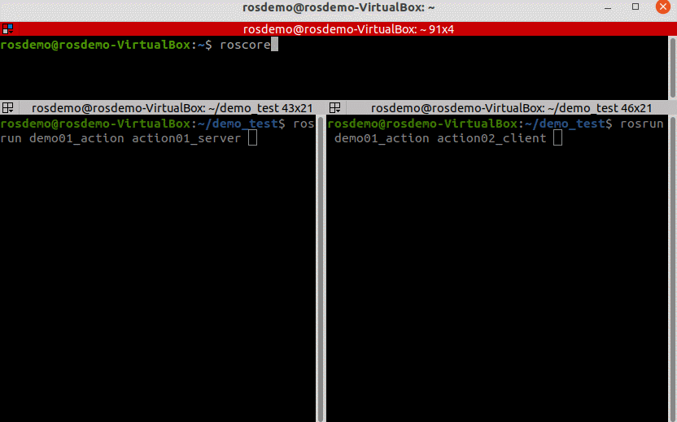

___

**另请参考:**

-   [http://wiki.ros.org/actionlib](http://wiki.ros.org/actionlib)
-   [http://wiki.ros.org/actionlib\_tutorials/Tutorials](http://wiki.ros.org/actionlib_tutorials/Tutorials)

#### 10.1.1 自定义action文件

action、srv、msg 文件内的可用数据类型一致，且三者实现流程类似:

1.  按照固定格式创建action文件；
    
2.  编辑配置文件；
    
3.  编译生成中间文件。
    

1.定义action文件

首先新建功能包demo01_action，并导入依赖: roscpp rospy std_msgs actionlib actionlib_msgs

然后功能包下新建 action 目录，新增 Xxx.action(比如:AddInts.action)。

action 文件内容组成分为三部分:请求目标值、最终响应结果、连续反馈，三者之间使用`---`分割示例内容如下:

```
#目标值
int32 num
---
#最终结果
int32 result
---
#连续反馈
float64 progress_bar
```

2.编辑配置文件

**CMakeLists.txt**

```shell
find_package(catkin REQUIRED COMPONENTS
  roscpp
  rospy
  std_msgs
  actionlib
  actionlib_msgs
)
```

```
add_action_files(
  FILES
  AddInts.action
)
```

```
generate_messages(
  DEPENDENCIES
  std_msgs
  actionlib_msgs
)
```

```
catkin_package(

#  INCLUDE_DIRS include
#  LIBRARIES demo04_action

 CATKIN_DEPENDS roscpp rospy std_msgs actionlib actionlib_msgs

#  DEPENDS system_lib

)
```

3.编译

编译后会生成一些中间文件。

msg文件(.../工作空间/devel/share/包名/msg/xxx.msg):

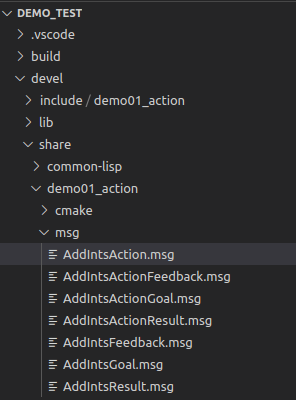

C++ 调用的文件(.../工作空间/devel/include/包名/xxx.h):

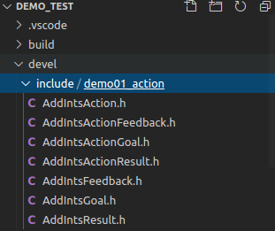

Python 调用的文件(.../工作空间/devel/lib/python3/dist-packages/包名/msg/xxx.py):

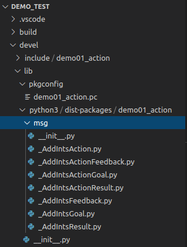

___

#### 10.1.2 action通信(C++)

vscode配置

c_cpp_properies.json 

```c
{
    "configurations": [
        {
            "browse": {
                "databaseFilename": "",
                "limitSymbolsToIncludedHeaders": true
            },
            "includePath": [
                "/opt/ros/noetic/include/**",
                "/usr/include/**",
                "/xxx/yyy工作空间/devel/include/**" //配置 head 文件的路径 
            ],
            "name": "ROS",
            "intelliSenseMode": "gcc-x64",
            "compilerPath": "/usr/bin/gcc",
            "cStandard": "c11",
            "cppStandard": "c++17"
        }
    ],
    "version": 4
}
```

/home/book/ws/src/demo01_action/src/action01_server.cpp

服务端

```cpp
#include "ros/ros.h"
#include "actionlib/server/simple_action_server.h"
#include "demo01_action/AddIntsAction.h"
/*  
    需求:
        创建两个ROS节点，服务器和客户端，
        客户端可以向服务器发送目标数据N（一个整型数据）
        服务器会计算1到N之间所有整数的和，这是一个循环累加的过程，返回给客户端，
        这是基于请求响应模式的，
        又已知服务器从接收到请求到产生响应是一个耗时操作，每累加一次耗时0.1s，
        为了良好的用户体验，需要服务器在计算过程中，
        每累加一次，就给客户端响应一次百分比格式的执行进度，使用action实现。

    流程:
        1.包含头文件;
        2.初始化ROS节点;
        3.创建NodeHandle;
        4.创建action服务对象;
        5.处理请求,产生反馈与响应;
        6.spin().
*/

typedef actionlib::SimpleActionServer<demo01_action::AddIntsAction> Server;

 // 5.处理请求（1.解析提交的目标值；2.产生连续反馈；3.最终结果响应） ---回调函数
 // goal被用来获取客户端提交的目标值num，而server指针被用来发布进度反馈和最终结果
void cb(const demo01_action::AddIntsGoalConstPtr &goal,Server* server){
    //获取目标值
    int num = goal->num;
    ROS_INFO("客户端提交的目标值是:%d",num);
    //累加并响应连续反馈
    int result = 0;
    demo01_action::AddIntsFeedback feedback;//连续反馈对象
    ros::Rate rate(10);//通过频率设置休眠时间，1/10s
    for (int i = 1; i <= num; i++)
    {
        result += i;
        //组织连续数据并发布
        feedback.progress_bar = i / (double)num;
        server->publishFeedback(feedback);
        rate.sleep();
    }
    //设置最终结果
    demo01_action::AddIntsResult r;
    r.result = result;
    server->setSucceeded(r);
    ROS_INFO("最终结果:%d",r.result);
}

int main(int argc, char *argv[])
{
    setlocale(LC_ALL,"");
    ROS_INFO("action服务端实现");
    // 2.初始化ROS节点;
    ros::init(argc,argv,"AddInts_server");
    // 3.创建NodeHandle;
    ros::NodeHandle nh;
    // 4.创建action服务对象;
    /*SimpleActionServer(ros::NodeHandle n, //函数句柄
            std::string name,               //话题名称
            //回调函数，传入参数类型，产生不断的反馈
            boost::function<void (const demo01_action::AddIntsGoalConstPtr &)> execute_callback, 
            bool auto_start)                //自动启动选项
    */
    // actionlib::SimpleActionServer<demo01_action::AddIntsAction> server(....);
    //创建server对象，参数：函数句柄，绑定回调函数，是否自动启动服务
    /*绑定函数定义：
    &cb是回调函数的地址。
    _1是一个特殊的占位符，表示将动作目标（AddIntsGoalConstPtr）作为第一个参数传递给回调函数cb。
    &server是动作服务器对象的地址，作为第二个参数传递给回调函数cb。
    */
    Server server(nh,"addInts",boost::bind(&cb,_1,&server),false);
    server.start();//如果auto start为false，那么需要手动调用改函数，启动服务
    // 5.处理请求（1.解析提交的目标值；2.产生连续反馈；3.最终结果响应） ---回调函数

    // 6.spin().   
    ros::spin();
    return 0;
}
```

cmakelists

```cmake
add_executable(action01_server src/action01_server.cpp)
add_dependencies(action01_server ${${PROJECT_NAME}_EXPORTED_TARGETS} ${catkin_EXPORTED_TARGETS})
target_link_libraries(action01_server
  ${catkin_LIBRARIES}
)
```

测试

ctrl shift b 编译

```shell
roscore #启动核心
```

```shell
book@100ask:~$ cd ws
book@100ask:~/ws$ rostopic list
/rosout
/rosout_agg
book@100ask:~/ws$ rosrun demo01_action action01_server 		#启动节点
[ INFO] [1736326839.816320782]: action服务端实现
[ INFO] [1736327064.044483944]: 客户端提交的目标值是:100
[ INFO] [1736327074.047752074]: 最终结果:5050
```

```shell
book@100ask:~/ws$ rostopic list	
/addInts/cancel
/addInts/feedback			#反馈
/addInts/goal					#目标值
/addInts/result					#结果
/addInts/status					#状态
/rosout
/rosout_agg
```

```shell
book@100ask:~$ rostopic pub /addInts/goal demo01_action/AddIntsActionGoal "header:
  seq: 0
  stamp:
    secs: 0
    nsecs: 0
  frame_id: ''
goal_id:
  stamp:
    secs: 0
    nsecs: 0
  id: ''
goal:
  num: 100" 		#服务端发送目标值
publishing and latching message. Press ctrl-C to terminate
```

```
rostopic  echo  /addInts/feedback	
```

```
rostopic echo   /addInts/result
```

```
rostopic echo  /addInts/status
```

客户端

/home/book/ws/src/demo01_action/src/action02_client.cpp

```cpp
#include "ros/ros.h"
#include "actionlib/client/simple_action_client.h"
#include "demo01_action/AddIntsAction.h"

/*  
    需求:
        创建两个ROS节点，服务器和客户端，
        客户端可以向服务器发送目标数据N（一个整型数据）
        服务器会计算1到N之间所有整数的和，这是一个循环累加的过程，返回给客户端，
        这是基于请求响应模式的，
        又已知服务器从接收到请求到产生响应是一个耗时操作，每累加一次耗时0.1s，
        为了良好的用户体验，需要服务器在计算过程中，
        每累加一次，就给客户端响应一次百分比格式的执行进度，使用action实现。

    流程:
        1.包含头文件;
        2.初始化ROS节点;
        3.创建NodeHandle;
        4.创建action客户端对象;
        5.发送请求;
            a.链接建立--------回调函数
            b.处理连续反馈-----回调函数
            c.处理最终响应-----回调函数
        6.spin().

*/
typedef actionlib::SimpleActionClient<demo01_action::AddIntsAction> Client;


//处理最终结果
void done_cb(const actionlib::SimpleClientGoalState &state, const demo01_action::AddIntsResultConstPtr &result){
    if (state.state_ == state.SUCCEEDED)
    {
        ROS_INFO("最终结果:%d",result->result);
    } else {
        ROS_INFO("任务失败！");
    }

}
//服务已经激活
void active_cb(){
    ROS_INFO("服务已经被激活....");
}
//处理连续反馈
void feedback_cb(const demo01_action::AddIntsFeedbackConstPtr &feedback){
    ROS_INFO("当前进度:%.2f",feedback->progress_bar);
}

int main(int argc, char *argv[])
{
    setlocale(LC_ALL,"");//防止中文乱码
    // 2.初始化ROS节点;
    ros::init(argc,argv,"AddInts_client");
    // 3.创建NodeHandle;
    ros::NodeHandle nh;
    // 4.创建action客户端对象;
    // SimpleActionClient(ros::NodeHandle & n, const std::string & name, bool spin_thread = true)
    // actionlib::SimpleActionClient<demo01_action::AddIntsAction> client(nh,"addInts");
    Client client(nh,"addInts",true);
    //等待服务启动
    ROS_INFO("等待服务器启动....");
    client.waitForServer();
    // 5.发送目标，处理反馈以及最终结果;
    /*  
        void sendGoal(const demo01_action::AddIntsGoal &goal, 
            boost::function<void (const actionlib::SimpleClientGoalState &state, const demo01_action::AddIntsResultConstPtr &result)> done_cb, 
            boost::function<void ()> active_cb, 
            boost::function<void (const demo01_action::AddIntsFeedbackConstPtr &feedback)> feedback_cb)
    */
    demo01_action::AddIntsGoal goal;//实例化目标对象
    goal.num = 100;//目标值
    //客户端发送目标数据，参数：目标值，完成回调函数，处理回调函数，反馈回调函数
    client.sendGoal(goal,&done_cb,&active_cb,&feedback_cb);
    // 6.spin().
    ros::spin();
    return 0;
}
```

cmakelists

```cmake
add_executable(action01_server src/action01_server.cpp)
add_executable(action02_client src/action02_client.cpp)

add_dependencies(action01_server ${${PROJECT_NAME}_EXPORTED_TARGETS} ${catkin_EXPORTED_TARGETS})
add_dependencies(action02_client ${${PROJECT_NAME}_EXPORTED_TARGETS} ${catkin_EXPORTED_TARGETS})

target_link_libraries(action01_server
  ${catkin_LIBRARIES}
)
target_link_libraries(action02_client
  ${catkin_LIBRARIES}
)
```

测试

```
rosrun demo01_action action01_server 
```

```
rosrun demo01_action action02_client 
```

#### 10.1.3 action通信(Py)

服务端

/home/book/ws/src/demo01_action/scripts/action01_server_p.py

```python
#! /usr/bin/env python
# -*- coding: utf-8 -*-
import rospy
import actionlib
from demo01_action.msg import *
"""
    需求:
        创建两个ROS 节点，服务器和客户端，
        客户端可以向服务器发送目标数据N(一个整型数据)服务器会计算 1 到 N 之间所有整数的和,
        这是一个循环累加的过程，返回给客户端，这是基于请求响应模式的，
        又已知服务器从接收到请求到产生响应是一个耗时操作，每累加一次耗时0.1s，
        为了良好的用户体验，需要服务器在计算过程中，
        每累加一次，就给客户端响应一次百分比格式的执行进度，使用 action实现。
    流程:
        1.导包
        2.初始化 ROS 节点
        3.使用类封装，然后创建对象
        4.创建服务器对象
        5.处理请求数据产生响应结果，中间还要连续反馈
            1.解析目标值
            2.发送连续反馈
            3.响应最终结果
        6.spin
"""

"""
在Python中，self是一个特殊的参数，它用于引用类的实例对象。
当您定义一个类的方法时，第一个参数通常是self，它代表当前实例对象。
通过self，您可以在类的内部访问和修改实例属性和方法。
在您提供的代码中，MyActionServer类有两个方法：__init__和cb。
在这两个方法中，self用于引用MyActionServer的实例。
"""
class MyActionServer:
    def __init__(self):
        #SimpleActionServer(name, ActionSpec, execute_cb=None, auto_start=True)
        self.server = actionlib.SimpleActionServer("addInts",AddIntsAction,self.cb,False)
        self.server.start()
        rospy.loginfo("服务端启动")


    def cb(self,goal):
        rospy.loginfo("服务端处理请求:")
        #1.解析目标值
        num = goal.num
        #2.循环累加，连续反馈
        rate = rospy.Rate(10)
        sum = 0
        for i in range(1,num + 1):
            # 累加
            sum = sum + i
            # 计算进度并连续反馈
            feedBack = i / num
            rospy.loginfo("当前进度:%.2f",feedBack)

            #创建发布对象
            feedBack_obj = AddIntsFeedback()
            feedBack_obj.progress_bar = feedBack
            # 发送连续反馈
            self.server.publish_feedback(feedBack_obj)
            rate.sleep()
        #3.响应最终结果
        result = AddIntsResult()
        result.result = sum        
        self.server.set_succeeded(result)
        rospy.loginfo("响应结果:%d",sum)
if __name__ == "__main__":
    rospy.init_node("action_server_p")
    server = MyActionServer()
    rospy.spin()
```

客户端

/home/book/ws/src/demo01_action/scripts/action02_client_p.py

```python
#! /usr/bin/env python
# -*- coding: utf-8 -*-

import rospy
import actionlib
from demo01_action.msg import *

"""
    需求:
        创建两个ROS 节点，服务器和客户端，
        客户端可以向服务器发送目标数据N(一个整型数据)服务器会计算 1 到 N 之间所有整数的和,
        这是一个循环累加的过程，返回给客户端，这是基于请求响应模式的，
        又已知服务器从接收到请求到产生响应是一个耗时操作，每累加一次耗时0.1s，
        为了良好的用户体验，需要服务器在计算过程中，
        每累加一次，就给客户端响应一次百分比格式的执行进度，使用 action实现。
    流程:
        1.导包
        2.初始化 ROS 节点
        3.创建 action Client 对象
        4.等待服务
        5.组织目标对象并发送
        6.编写回调, 激活、连续反馈、最终响应
        7.spin
"""

def done_cb(state,result):
    if state == actionlib.GoalStatus.SUCCEEDED:
        rospy.loginfo("响应结果:%d",result.result)
    else :
        rospy.loginfo("响应失败")

def active_cb():
    rospy.loginfo("服务被激活....")


def fb_cb(fb):
    rospy.loginfo("当前进度:%.2f",fb.progress_bar)

if __name__ == "__main__":
    # 2.初始化 ROS 节点
    rospy.init_node("action_client_p")
    # 3.创建 action Client 对象
    client = actionlib.SimpleActionClient("addInts",AddIntsAction)
    # 4.等待服务
    client.wait_for_server()
    # 5.组织目标对象并发送
    goal_obj = AddIntsGoal()
    goal_obj.num = 10
    client.send_goal(goal_obj,done_cb,active_cb,fb_cb)
    # client.send_goal()参数：目标值，最终结果反馈，连接被激活的反馈
    # 6.编写回调, 激活、连续反馈、最终响应
    # 7.spin
    rospy.spin()
```

先为 Python 文件添加可执行权限:`chmod +x *.py`

修改cmakelists

```cmake
catkin_install_python(PROGRAMS
  scripts/action01_server_p.py
  scripts/action02_client_p.py
  DESTINATION ${CATKIN_PACKAGE_BIN_DESTINATION}
)
```

测试

```
rosrun demo01_action action01_server_p.py 
```

```
rosrun demo01_action action02_client_p.py
```

### 10.2 动态参数

#### 10.2.0 举例测试

```shell
roslaunch urdf02_gazebo demo03_env.launch 
#启动gazebo仿真环境
```

```shell
roslaunch nav_demo nav06_test.launch 
#启动导航代码
```

```shell
rqt
#plugins ->configuration->dynamic reconfigure
```

参数服务器的数据被修改时，如果节点不重新访问，那么就不能获取修改后的数据，例如在乌龟背景色修改的案例中，先启动乌龟显示节点，然后再修改参数服务器中关于背景色设置的参数，那么窗体的背景色是不会修改的，必须要重启乌龟显示节点才能生效。而一些特殊场景下，是要求要能做到动态获取的，也即，参数一旦修改，能够通知节点参数已经修改并读取修改后的数据，比如：

> 机器人调试时，需要修改机器人轮廓信息(长宽高)、传感器位姿信息....，如果这些信息存储在参数服务器中，那么意味着需要重启节点，才能使更新设置生效，但是希望修改完毕之后，某些节点能够即时更新这些参数信息。

在ROS中针对这种场景已经给出的解决方案: dynamic reconfigure 动态配置参数。

动态配置参数，之所以能够实现即时更新，因为被设计成 CS 架构，客户端修改参数就是向服务器发送请求，服务器接收到请求之后，读取修改后的是参数。

___

**概念**

一种可以在运行时更新参数而无需重启节点的参数配置策略。

**作用**

主要应用于需要动态更新参数的场景，比如参数调试、功能切换等。典型应用:导航时参数的动态调试。

**案例**

编写两个节点，一个节点可以动态修改参数，另一个节点时时解析修改后的数据。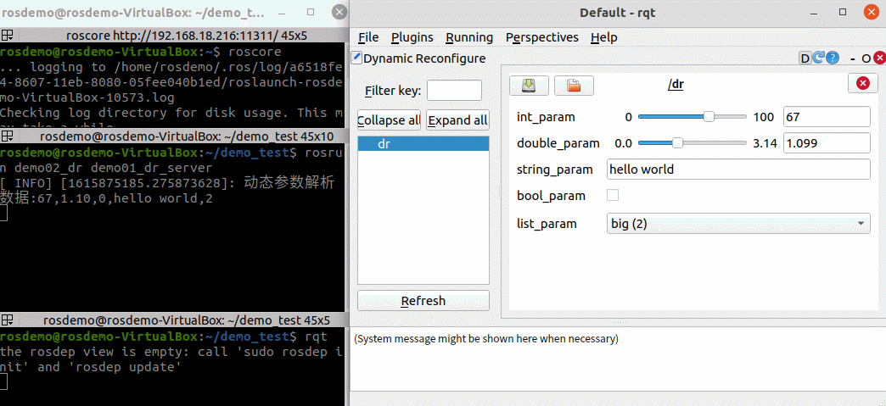

#### 10.2.1 客户端

**需求:**

> 编写两个节点，一个节点可以动态修改参数，另一个节点时时解析修改后的数据。

**客户端实现流程:**

-   新建并编辑 .cfg 文件;
-   编辑CMakeLists.txt;
-   编译。

___

1.新建功能包

新建功能包demo02_dr，添加依赖:roscpp rospy std_msgs dynamic_reconfigure

2.添加.cfg文件

新建 cfg 文件夹，添加 xxx.cfg 文件(并添加可执行权限)，cfg 文件其实就是一个 python 文件,用于生成参数修改的客户端(GUI)。

/home/book/ws/src/demo02_dr/cfg/dr.cfg

```python
#! /usr/bin/env python
#-*- coding: utf-8 -*-
"""
 4生成动态参数 int,double,bool,string,列表
 5实现流程:
 6    1.导包
 7    2.创建生成器
 8    3.向生成器添加若干参数
 9    4.生成中间文件并退出
10
"""
# 1.导包
from dynamic_reconfigure.parameter_generator_catkin import *
PACKAGE = "demo02_dr"
# 2.创建生成器
gen = ParameterGenerator()

# 3.向生成器添加若干参数
#add(name, paramtype, level, description, default=None, min=None, max=None, edit_method="")
#参数：变量名，参数类型，掩码（表示传参过程中，参数是否被修改），描述，默认值，最小值，最大值，下拉列表名称）
gen.add("int_param",int_t,0,"整型参数",50,0,100)
gen.add("double_param",double_t,0,"浮点参数",1.57,0,3.14)
gen.add("string_param",str_t,0,"字符串参数","hello world ")
gen.add("bool_param",bool_t,0,"bool参数",True)

many_enum = gen.enum([gen.const("small",int_t,0,"a small size"),
                gen.const("mediun",int_t,1,"a medium size"),
                gen.const("big",int_t,2,"a big size")
                ],"a car size set")

gen.add("list_param",int_t,0,"列表参数",0,0,2, edit_method=many_enum)

# 4.生成中间文件并退出
#generate(pkgname, nodename, name)
exit(gen.generate(PACKAGE,"dr_node","dr"))
```

`chmod +x xxx.cfg`添加权限

3.配置 CMakeLists.txt

```
generate_dynamic_reconfigure_options(
  cfg/mycar.cfg
)
```

4.编译

编译后会生成中间文件

C++ 需要调用的头文件:

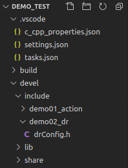

Python需要调用的文件:

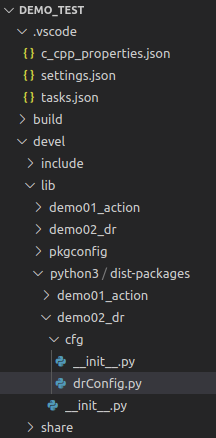

___

#### 10.2.2 服务端(C++)

**需求:**

> 编写两个节点，一个节点可以动态修改参数，另一个节点时时解析修改后的数据。

**服务端实现流程:**

-   新建并编辑 c++ 文件;
-   编辑CMakeLists.txt;
-   编译并执行。

___

0.vscode配置

需要像之前自定义 msg 实现一样配置settings.json 文件，如果以前已经配置且没有变更工作空间，可以忽略，如果需要配置，配置方式与之前相同:

```json
{
    "configurations": [
        {
            "browse": {
                "databaseFilename": "",
                "limitSymbolsToIncludedHeaders": true
            },
            "includePath": [
                "/opt/ros/noetic/include/**",
                "/usr/include/**",
                "/xxx/yyy工作空间/devel/include/**" //配置 head 文件的路径 
            ],
            "name": "ROS",
            "intelliSenseMode": "gcc-x64",
            "compilerPath": "/usr/bin/gcc",
            "cStandard": "c11",
            "cppStandard": "c++17"
        }
    ],
    "version": 4
}
```

1.服务器代码实现

新建cpp文件，内容如下:

/home/book/ws/src/demo02_dr/src/dr01_server.cpp

```cpp
#include "ros/ros.h"
#include "dynamic_reconfigure/server.h"
#include "demo02_dr/drConfig.h"
 /*  
    动态参数服务端: 参数被修改时直接打印
    实现流程:
        1.包含头文件
        2.初始化 ros 节点
        3.创建服务器对象
        4.创建回调对象(使用回调函数，打印修改后的参数)
        5.服务器对象调用回调对象
        6.spin()
*/

void cb(demo02_dr::drConfig& config, uint32_t level){
    ROS_INFO("动态参数解析数据:%d,%.2f,%d,%s,%d",
        config.int_param,
        config.double_param,
        config.bool_param,
        config.string_param.c_str(),
        config.list_param
    );
}

int main(int argc, char *argv[])
{
    setlocale(LC_ALL,"");
    // 2.初始化 ros 节点
    ros::init(argc,argv,"dr");
    // 3.创建服务器对象
    dynamic_reconfigure::Server<demo02_dr::drConfig> server;
    // 4.创建回调对象(使用回调函数，打印修改后的参数)
    //setCallback(const boost::function<void (demo02_dr::drConfig &, uint32_t level)> &callback)
    dynamic_reconfigure::Server<demo02_dr::drConfig>::CallbackType cbType;
    cbType = boost::bind(&cb,_1,_2);
    // 5.服务器对象调用回调对象
    server.setCallback(cbType);
    // 6.spin()
    ros::spin();
    return 0;
}
```

2.编译配置文件

```cmake
add_executable(demo01_dr_server src/demo01_dr_server.cpp)
...

add_dependencies(demo01_dr_server ${${PROJECT_NAME}_EXPORTED_TARGETS} ${catkin_EXPORTED_TARGETS})
...

target_link_libraries(demo01_dr_server
  ${catkin_LIBRARIES}
)
```

3.执行

先启动`roscore`

启动服务端:`rosrun 功能包 xxxx`

```shell
rosrun demo02_dr dr01_server
```

启动客户端: rqt

最终可以通过客户端提供的界面修改数据，并且修改完毕后，服务端会即时输出修改后的结果，最终运行结果与示例类似。

**PS:**ROS版本较新时，可能没有提供客户端相关的功能包导致`rosrun rqt_reconfigure rqt_reconfigure`调用会抛出异常。


#### 10.2.3 服务端(Py)

**需求:**

> 编写两个节点，一个节点可以动态修改参数，另一个节点时时解析修改后的数据。

**服务端实现流程:**

-   新建并编辑 Python 文件;
-   编辑CMakeLists.txt;
-   编译并执行。

___

0.vscode配置

需要像之前自定义 msg 实现一样配置settings.json 文件，如果以前已经配置且没有变更工作空间，可以忽略，如果需要配置，配置方式与之前相同:

```shell
{
    "python.autoComplete.extraPaths": [
        "/opt/ros/noetic/lib/python3/dist-packages",
        "/xxx/yyy工作空间/devel/lib/python3/dist-packages"
    ]
}
```

1.服务器代码实现

新建python文件，内容如下:

/home/book/ws/src/demo02_dr/scripts/dr01_server_p.py

```python
#! /usr/bin/env python
#-*- coding: utf-8 -*-
import rospy
from dynamic_reconfigure.server import Server
from demo02_dr.cfg import drConfig

"""
    动态参数服务端: 参数被修改时直接打印
    实现流程:
        1.导包
        2.初始化 ros 节点
        3.创建服务对象
        4.回调函数处理
        5.spin
"""
# 回调函数
def cb(config,level):
    rospy.loginfo("python 动态参数服务解析:%d,%.2f,%d,%s,%d",
            config.int_param,
            config.double_param,
            config.bool_param,
            config.string_param,
            config.list_param
    )
    return config

if __name__ == "__main__":
    # 2.初始化 ros 节点
    rospy.init_node("dr_p")
    # 3.创建服务对象
    server = Server(drConfig,cb)
    # 4.回调函数处理
    # 5.spin
    rospy.spin()
```

2.编辑配置文件

先为 Python 文件添加可执行权限:`chmod +x *.py`

```cmake
catkin_install_python(PROGRAMS
  scripts/demo01_dr_server_p.py
  DESTINATION ${CATKIN_PACKAGE_BIN_DESTINATION}
)
```

3.执行

先启动`roscore`

启动服务端:`rosrun 功能包 xxxx.py`

启动客户端:`rosrun rqt_gui rqt_gui -s rqt_reconfigure`或`rosrun rqt_reconfigure rqt_reconfigure`

最终可以通过客户端提供的界面修改数据，并且修改完毕后，服务端会即时输出修改后的结果，最终运行结果与示例类似。

**PS:**ROS版本较新时，可能没有提供客户端相关的功能包导致`rosrun rqt_reconfigure rqt_reconfigure`调用会抛出异常。

___

### 10.3 pluginlib

**pluginlib**直译是插件库，所谓插件字面意思就是可插拔的组件，比如:以计算机为例，可以通过USB接口自由插拔的键盘、鼠标、U盘...都可以看作是插件实现，其基本原理就是通过规范化的USB接口协议实现计算机与USB设备的自由组合。同理，在软件编程中，插件是一种遵循一定规范的应用程序接口编写出来的程序，插件程序依赖于某个应用程序，且应用程序可以与不同的插件程序自由组合。在ROS中，也会经常使用到插件，场景如下:

> 1.导航插件:在导航中，涉及到路径规划模块，路径规划算法有多种，也可以自实现，导航应用时，可能需要测试不同算法的优劣以选择更合适的实现，这种场景下，ROS中就是通过插件的方式来实现不同算法的灵活切换的。
>
> 2.rviz插件:在rviz中已经提供了丰富的功能实现，但是即便如此，特定场景下，开发者可能需要实现某些定制化功能并集成到rviz中，这一集成过程也是基于插件的。

___

**概念**

**pluginlib**是一个c++库， 用来从一个ROS功能包中加载和卸载插件(plugin)。插件是指从运行时库中动态加载的类。通过使用Pluginlib，不必将某个应用程序显式地链接到包含某个类的库，Pluginlib可以随时打开包含类的库，而不需要应用程序事先知道包含类定义的库或者头文件。

插件是动态加载的c++类（通过pluginlib库，将其封装为动态链接库，即so文件），这些类需继承预定义的抽象基类，并在编译后通过Pluginlib的接口，在运行时加载到主程序中

```cpp
/*抽象基类*/
class base{
public:
    virtual void fun1() = 0;	//纯虚函数
    virtual void fun2() = 0;
    // ...其他函数    
    virtual ~base() = default;
}；
```

| 情况              | 是否支持多态       | 调用的函数版本     |
| ----------------- | ------------------ | ------------------ |
| 没有virtual       | 不支持             | 基类时的版本       |
| virtual           | 支持               | 子类版本（如果有） |
| 同时有virtual和=0 | 支持，强制子类实现 | 子类版本           |

如果基类中至少存在一个纯虚函数，那这个基类就被称为 抽象基类

抽象基类的特点：不能被实例化，只能被继承。并且继承抽象基类的子类必须要实现抽象基类中所有的纯虚函数

```cpp
/*派生类*/
class son1 : public base{
public:
    void fun1() override {/*求和*/}	//override代表覆写纯虚函数（.h声明后可以不用）
    void fun2() override {/*求积*/}
    // ...其他技能
};
```

派生类经过编译后，生成的so文件，才能称之为插件类，类似游戏的Mod，自身单独编译和主程序分离，有效减低代码的耦合性


**作用**

-   结构清晰；
    
-   低耦合，易修改，可维护性强；
    
-   可移植性强，更具复用性；
    
-   结构容易调整，插件可以自由增减；
    

___

**另请参考:**

-   [http://wiki.ros.org/pluginlib](http://wiki.ros.org/pluginlib)
    
-   [http://wiki.ros.org/pluginlib/Tutorials/Writing%20and%20Using%20a%20Simple%20Plugin](http://wiki.ros.org/pluginlib/Tutorials/Writing%20and%20Using%20a%20Simple%20Plugin)

**需求:**

以插件的方式实现正多边形的相关计算。

**实现流程:**

1.  准备；
    
2.  创建基类；
    
3.  创建插件类；
    
4.  注册插件;
    
5.  构建插件库;
    
6.  使插件可用于ROS工具链;
    
    -   配置xml
        
    -   导出插件
    
7.  使用插件;
    
8.  执行。
    

___

##### 1.准备

创建功能包demo03_plugin导入依赖: roscpp pluginlib。

在 VSCode中需要配置 .vascode/c\_cpp\_properties.json文件中关于 includepath 选项的设置。

```json
{
    "configurations": [
        {
            "browse": {
                "databaseFilename": "${default}",
                "limitSymbolsToIncludedHeaders": false
            },
            "includePath": [
                "/opt/ros/noetic/include/**",
                "/usr/include/**",
                "/home/ubuntu2004/advanced_ws/devel/include/**",
                "${workspaceFolder}/src/demo03_plugin/include"
            ],
            "name": "ROS",
            "intelliSenseMode": "gcc-x64",
            "compilerPath": "/usr/bin/gcc",
            "cStandard": "gnu17",
            "cppStandard": "c++17"
        }
    ],
    "version": 4
}
```

##### 2.创建基类

在 xxx/include/xxx下新建C++头文件: polygon\_base.h，所有的插件类都需要继承此基类，内容如下:

/home/book/ws/src/demo03_plugin/include/demo03_plugin/dbx_base.h

```cpp
#ifndef DBX_BASE_H_
#define DBX_BASE_H_

namespace dbx_base_ns
{
    /*
        注意：必须保证基类中包含无参构造
    */
  class Dbx_Base
  {
    protected:
      Dbx_Base(){}

    public:
      //计算周长的函数
      virtual double getlength() = 0;
      //初始化边长的函数
      virtual void initialize(double side_length) = 0;
      //析构函数
      virtual ~Dbx_Base(){}
  };
};
#endif
```

**PS:**基类必须提供无参构造函数，所以关于多边形的边长没有通过构造函数而是通过单独编写的initialize函数传参。

##### 3.创建插件

在 xxx/include/xxx下新建C++头文件:polygon\_plugins.h，内容如下:

/home/book/ws/src/demo03_plugin/include/demo03_plugin/dbx_plugins.h

```cpp
#ifndef DBX_PLUGINS_H_
#define DBX_PLUGINS_H_
#include "demo03_plugin/dbx_base.h"
namespace dbx_plugins_ns{
    //三边
    class SanBian: public dbx_base_ns::Dbx_Base{
        private:
        //私有成员变量
            double side_length;
        public:
            //构造函数
            SanBian(){
                side_length = 0.0;
            }
            void initialize(double side_length){
                this->side_length = side_length;
            }
            double getlength(){
                return side_length * 3;
            }
    };
    //四边
    class SiBian: public dbx_base_ns::Dbx_Base{
        private:
        //私有成员变量
            double side_length;
        public:
            //构造函数
            SiBian(){
                side_length = 0.0;
            }
            void initialize(double side_length){
                this->side_length = side_length;
            }
            double getlength(){
                return side_length * 4;
            }
    };
};
#endif
```

该文件中创建了正方形与三角形两个衍生类继承基类。

##### 4.注册插件

在 src 目录下新建 polygon_plugins.cpp 文件，内容如下:

/home/book/ws/src/demo03_plugin/src/plus.cpp

```cpp
#include "pluginlib/class_list_macros.h"
#include "demo03_plugin/dbx_base.h"
#include "demo03_plugin/dbx_plugins.h"

//外部导入拓展插件类,参数：子类，父类
PLUGINLIB_EXPORT_CLASS(dbx_plugins_ns::SanBian,dbx_base_ns::Dbx_Base)
PLUGINLIB_EXPORT_CLASS(dbx_plugins_ns::SiBian,dbx_base_ns::Dbx_Base)
```

该文件会将两个衍生类注册为插件。

##### 5.构建插件库

在 CMakeLists.txt 文件中设置内容如下:

```cmake
## Specify additional locations of header files
## Your package locations should be listed before other locations
include_directories(
include
  ${catkin_INCLUDE_DIRS}
)

## Declare a C++ library
add_library(plus
  src/plus.cpp
)
```

至此，可以调用 catkin\_make 编译，编译完成后，在工作空间/devel/lib目录下，会生成相关的 .so 文件。

##### 6.使插件可用于ROS工具链

6.1配置xml

功能包下新建文件:polygon\_plugins.xml,内容如下:

/home/book/ws/src/demo03_plugin/plus.xml

```xml
<!-- 
    需要定位动态链接库
        /home/book/ws/devel/lib/libplus.so
        library 根标签下的path属性
    声明子类与父类
        library 的子标签 class 声明
 -->
<!-- 插件库的相对路径 -->
<library path="lib/libplus">
  <!-- type="插件类" base_class_type="基类" -->
  <class type="dbx_plugins_ns::SanBian" base_class_type="dbx_base_ns::Dbx_Base">
    <!-- 描述信息 -->
    <description>正三边形插件</description>
  </class>
  <class type="dbx_plugins_ns::SiBian" base_class_type="dbx_base_ns::Dbx_Base">
    <!-- 描述信息 -->
    <description>正四边形插件</description>
  </class>
</library>
```

6.2导出插件

package.xml文件中设置内容如下:

```xml
  <!-- The export tag contains other, unspecified, tags -->
  <export>
    <!-- Other tools can request additional information be placed here -->
    <!-- ${prefix} 表示自动寻找功能包 -->
    <demo03_plugin plugin = "${prefix}/plus.xml" />
  </export>
```

标签<xxx />的名称应与基类所属的功能包名称一致，plugin属性值为上一步中创建的xml文件。

编译后，可以调用`rospack plugins --attrib=plugin xxx`命令查看配置是否正常，如无异常，会返回 .xml 文件的完整路径，这意味着插件已经正确的

集成到了ROS工具链。

##### 7.使用插件

src 下新建c++文件:polygon\_loader.cpp，内容如下:

/home/book/ws/src/demo03_plugin/src/use_plus.cpp

```cpp
//类加载器相关的头文件
#include "ros/ros.h"
#include "pluginlib/class_loader.h"
#include "demo03_plugin/dbx_base.h"
/*
    创建类加载器，根据需求加载相关插件
        1.创建类加载器
        2.使用类加载器实例化某个插件对象
        3.使用插件
*/
int main(int argc, char** argv)
{
    setlocale(LC_ALL,"");
  //1.创建类加载器 -- 参数1:基类功能包名称 参数2:基类全限定名称
  pluginlib::ClassLoader<dbx_base_ns::Dbx_Base> loader("demo03_plugin", "dbx_base_ns::Dbx_Base");

  try
  {
    //三角形周长
    //创建插件类实例 -- 参数:插件类全限定名称
    boost::shared_ptr<dbx_base_ns::Dbx_Base> san = loader.createInstance("dbx_plugins_ns::SanBian");
    //使用插件
    san->initialize(10);
    double length = san->getlength();
    ROS_INFO("三角形周长: %.2f", length);

    //四角形周长
    //创建插件类实例 -- 参数:插件类全限定名称
    boost::shared_ptr<dbx_base_ns::Dbx_Base> si = loader.createInstance("dbx_plugins_ns::SiBian");
    //使用插件
    si->initialize(10);
    double length2 = si->getlength();
    ROS_INFO("四边形周长: %.2f", length2);
  }
  catch(pluginlib::PluginlibException& ex)
  {
    ROS_ERROR("The plugin failed to load for some reason. Error: %s", ex.what());
  }
  return 0;
}
```

##### 8.执行

修改CMakeLists.txt文件，内容如下:

```cmake
add_executable(use_plus src/use_plus.cpp)
add_dependencies(use_plus ${${PROJECT_NAME}_EXPORTED_TARGETS} ${catkin_EXPORTED_TARGETS})
target_link_libraries(use_plus
  ${catkin_LIBRARIES}
)
```

编译然后执行:polygon\_loader，结果如下:

```shell
book@100ask:~/ws$ rosrun demo03_plugin use_plus 
[ INFO] [1736830990.742236624]: 三角形周长: 30.00
[ INFO] [1736830990.742361624]: 四边形周长: 40.00
```

___

### 10.4 nodelet

ROS通信是基于Node(节点)的，Node使用方便、易于扩展，可以满足ROS中大多数应用场景，但是也存在一些局限性，由于一个Node启动之后独占一根进程，不同Node之间数据交互其实是不同进程之间的数据交互，当传输类似于图片、点云的大容量数据时，会出现延时与阻塞的情况，比如：

> 现在需要编写一个相机驱动，在该驱动中有两个节点实现:其中节点A负责发布原始图像数据，节点B订阅原始图像数据并在图像上标注人脸。如果节点A与节点B仍按照之前实现，两个节点分别对应不同的进程，在两个进程之间传递容量可观图像数据，可能就会出现延时的情况，那么该如何优化呢？

ROS中给出的解决方案是:Nodelet，通过Nodelet可以将多个节点集成进一个进程。

___

**概念**

nodelet软件包旨在提供在同一进程中运行多个算法(节点)的方式，不同算法之间通过传递指向数据的指针来代替了数据本身的传输(类似于编程传值与传址的区别)，从而实现零成本的数据拷贝。

nodelet功能包的核心实现也是插件，是对插件的进一步封装:

-   不同算法被封装进插件类，可以像单独的节点一样运行；
-   在该功能包中提供插件类实现的基类:Nodelet；
-   并且提供了加载插件类的类加载器:NodeletLoader。

**作用**

应用于大容量数据传输的场景，提高节点间的数据交互效率，避免延时与阻塞。

___

**另请参考:**

-   [http://wiki.ros.org/nodelet/](http://wiki.ros.org/nodelet/)
    
-   [http://wiki.ros.org/nodelet/Tutorials/Running%20a%20nodelet](http://wiki.ros.org/nodelet/Tutorials/Running%20a%20nodelet)
    
-   [https://github.com/ros/common\_tutorials/tree/noetic-devel/nodelet\_tutorial\_math](https://github.com/ros/common_tutorials/tree/noetic-devel/nodelet_tutorial_math)

```shell
book@100ask:~$ rosrun nodelet nodelet
Your usage: 
/opt/ros/melodic/lib/nodelet/nodelet 
nodelet usage:
nodelet load pkg/Type manager [--no-bond]   #将节点加载进管理器
nodelet standalone pkg/Type   #以独立进程加载某个节点
nodelet unload name manager   #移除某个管理器中的节点
nodelet manager              #管理器，管理不同节点
```

#### 10.4.1 使用演示

在ROS中内置了nodelet案例，我们先以该案例演示nodelet的基本使用语法，基本流程如下:

1.  案例简介；
2.  nodelet基本使用语法；
3.  内置案例调用。

1.案例简介

以“ros- \[ROS\_DISTRO\] -desktop-full”命令安装ROS时，nodelet默认被安装，如未安装，请调用如下命令自行安装:

```shell
sudo apt install ros-<<ROS_DISTRO>>-nodelet-tutorial-math
```

在该案例中，定义了一个Nodelet插件类:Plus，这个节点可以订阅一个数字，并将订阅到的数字与参数服务器中的 value 参数相加后再发布。


**需求:**再同一线程中启动两个Plus节点A与B，向A发布一个数字，然后经A处理后，再发布并作为B的输入，最后打印B的输出。

2.nodelet 基本使用语法

使用语法如下:

```
nodelet load pkg/Type manager - Launch a nodelet of type pkg/Type on manager manager
nodelet standalone pkg/Type   - Launch a nodelet of type pkg/Type in a standalone node
nodelet unload name manager   - Unload a nodelet a nodelet by name from manager
nodelet manager               - Launch a nodelet manager node
```

3.内置案例调用

1.启动roscore

```
roscore
```

2.启动manager

```
rosrun nodelet nodelet manager __name:=mymanager
```

\_\_name:= 用于设置管理器名称。

3.添加nodelet节点

添加第一个节点:

```
rosrun nodelet nodelet load nodelet_tutorial_math/Plus mymanager __name:=n1 _value:=100
```

添加第二个节点:

```
rosrun nodelet nodelet load nodelet_tutorial_math/Plus mymanager __name:=n2 _value:=-50 /n2/in:=/n1/out
```

PS: 解释

> rosrun nodelet nodelet load nodelet\_tutorial\_math/Plus mymanager \_\_name:=n1 \_value:=100
>
> 1.  rosnode list 查看，nodelet 的节点名称是: /n1；
> 2.  rostopic list 查看，订阅的话题是: /n1/in，发布的话题是: /n1/out；
> 3.  rosparam list查看，参数名称是: /n1/value。
>
> rosrun nodelet nodelet standalone nodelet\_tutorial\_math/Plus mymanager \_\_name:=n2 \_value:=-50 /n2/in:=/n1/out
>
> 1.  第二个nodelet 与第一个同理；
> 2.  第二个nodelet 订阅的话题由 /n2/in 重映射为 /n1/out。

**优化:**也可以将上述实现集成进launch文件:

```xml
<launch>
    <!-- 设置nodelet管理器 -->
    <node pkg="nodelet" type="nodelet" name="mymanager" args="manager" output="screen" />
    <!-- 启动节点1，名称为 n1, 参数 /n1/value 为100 -->
    <node pkg="nodelet" type="nodelet" name="n1" args="load nodelet_tutorial_math/Plus mymanager" output="screen" >
        <param name="value" value="100" />
    </node>
    <!-- 启动节点2，名称为 n2, 参数 /n2/value 为-50 -->
    <node pkg="nodelet" type="nodelet" name="n2" args="load nodelet_tutorial_math/Plus mymanager" output="screen" >
        <param name="value" value="-50" />
        <remap from="/n2/in" to="/n1/out" />
    </node>

</launch>
```

4.执行

向节点n1发布消息:

```
rostopic pub -r 10 /n1/in std_msgs/Float64 "data: 10.0"
```

打印节点n2发布的消息:

```
rostopic echo /n2/out
```

最终输出结果应该是:60。


#### 10.4.2 实现

nodelet本质也是插件，实现流程与插件实现流程类似，并且更为简单，不需要自定义接口，也不需要使用类加载器加载插件类。

**需求:**参考 nodelet 案例，编写 nodelet 插件类，可以订阅输入数据，设置参数，发布订阅数据与参数相加的结果。

**流程:**

1.  准备；
    
2.  创建插件类并注册插件;
    
3.  构建插件库;
    
4.  使插件可用于ROS工具链；
    
5.  执行。
    

1.准备

新建功能包demo04_nodelet，导入依赖: roscpp nodelet

2.创建插件类并注册插件

/home/book/ws/src/demo04_nodelet/src/myplus.cpp

```cpp
#include "nodelet/nodelet.h"
#include "pluginlib/class_list_macros.h"
#include "ros/ros.h"
#include "std_msgs/Float64.h"
/*
    需求：   首先，需要订阅一个浮点数据
            然后，将订阅的数据与参数服务器的指定参数相加
            最后，将最终结果发布
    流程：
        1.先确定需要的变量：订阅对象，发布对象，存储参数的变量；
        2.获取 NodleHandle;
        3.通过 NodleHandle 创建订阅对象和发布对象，解析参数；
        4.回调函数处理数据，并通过发布对象发布。
*/
namespace nodelet_demo_ns {
class MyPlus: public nodelet::Nodelet {
    public:
    MyPlus(){
        value = 0.0;
    }
    void onInit(){
        //获取 NodeHandle
        ros::NodeHandle& nh = getPrivateNodeHandle();
        //从参数服务器获取参数
        nh.getParam("value",value);
        //创建发布与订阅对象
        pub = nh.advertise<std_msgs::Float64>("out",100);//话题名称： /节点名/out
        sub = nh.subscribe<std_msgs::Float64>("in",100,&MyPlus::doCb,this);

    }
    //处理订阅的回调函数
    void doCb(const std_msgs::Float64::ConstPtr& p){
        double num = p->data;
        //数据处理
        double result = num + value;
        std_msgs::Float64 r;
        r.data = result;
        //发布
        pub.publish(r);
    }
    private:
    ros::Publisher pub;
    ros::Subscriber sub;
    double value;

};
}
PLUGINLIB_EXPORT_CLASS(nodelet_demo_ns::MyPlus,nodelet::Nodelet)
```

3.构建插件库

CMakeLists.txt配置如下：

```cmake
...
add_library(myplus
  src/myplus.cpp
)
...
target_link_libraries(myplus
  ${catkin_LIBRARIES}
)
```

编译后，会在 `工作空间/devel/lib/`先生成文件: libmyplus.so。

4.使插件可用于ROS工具链

4.1配置xml

新建 xml 文件，名称自定义(比如:my\_plus.xml)，内容如下：

/home/book/ws/src/demo04_nodelet/myplus.xml

```xml
<library path="lib/libmyplus">
    <class name="demo04_nodelet/MyPlus" type="nodelet_demo_ns::MyPlus" base_class_type="nodelet::Nodelet" >
        <description>hello</description>
    </class>
</library>
```

4.2导出插件

/home/book/ws/src/demo04_nodelet/package.xml

```xml
  <!-- The export tag contains other, unspecified, tags -->
  <export>
      <!-- Other tools can request additional information be placed here -->
      <nodelet plugin="${prefix}/myplus.xml" />
  </export>
```

5.执行

可以通过launch文件执行nodelet，示例内容如下:

```xml
<launch>
    <!-- 设置nodelet管理器 -->
    <node pkg="nodelet" type="nodelet" name="dasun" args="manager" output="screen" />
    <!-- 启动节点1，名称为 n1, 参数 /n1/value 为100 -->
    <node pkg="nodelet" type="nodelet" name="xiaowang" args="load demo04_nodelet/MyPlus dasun" output="screen" >
        <param name="value" value="100" />
    </node>
    <!-- 启动节点2，名称为 n2, 参数 /n2/value 为-50 -->
    <node pkg="nodelet" type="nodelet" name="ergou" args="load demo04_nodelet/MyPlus dasun" output="screen" >
        <param name="value" value="-50" />
        <remap from="/ergou/in" to="/xiaowang/out" />
    </node>

</launch>
```

运行launch文件，可以参考上一节方式向 p1发布数据，并订阅p2输出的数据，最终运行结果也与上一节类似。

4.执行

向节点n1发布消息:

```
rostopic pub -r 10 /xiaowang/in std_msgs/Float64 "data: 10.0"
```

打印节点n2发布的消息:

```
rostopic echo /ergou/out
```

最终输出结果应该是:60。

___

