## 1.pluginlib与nodelet

### 1.1pluginlib

**pluginlib**直译是插件库，所谓插件字面意思就是可插拔的组件，比如:以计算机为例，可以通过USB接口自由插拔的键盘、鼠标、U盘...都可以看作是插件实现，其基本原理就是通过规范化的USB接口协议实现计算机与USB设备的自由组合。同理，在软件编程中，插件是一种遵循一定规范的应用程序接口编写出来的程序，插件程序依赖于某个应用程序，且应用程序可以与不同的插件程序自由组合。在ROS中，也会经常使用到插件，场景如下:

> 1.导航插件:在导航中，涉及到路径规划模块，路径规划算法有多种，也可以自实现，导航应用时，可能需要测试不同算法的优劣以选择更合适的实现，这种场景下，ROS中就是通过插件的方式来实现不同算法的灵活切换的。
>
> 2.rviz插件:在rviz中已经提供了丰富的功能实现，但是即便如此，特定场景下，开发者可能需要实现某些定制化功能并集成到rviz中，这一集成过程也是基于插件的。

___

**概念**

**pluginlib**是一个c++库， 用来从一个ROS功能包中加载和卸载插件(plugin)。插件是指从运行时库中动态加载的类。通过使用Pluginlib，不必将某个应用程序显式地链接到包含某个类的库，Pluginlib可以随时打开包含类的库，而不需要应用程序事先知道包含类定义的库或者头文件。

插件是动态加载的c++类（通过pluginlib库，将其封装为动态链接库，即so文件），这些类需继承预定义的抽象基类，并在编译后通过Pluginlib的接口，在运行时加载到主程序中；pluginlib库可理解为usb拓展坞，插件可理解为u盘、键盘、鼠标。

```cpp
/*抽象基类*/
class base{
public:
    virtual void fun1() = 0;	//纯虚函数
    virtual void fun2() = 0;
    // ...其他函数    
    virtual ~base() = default;
}；
```

| 情况              | 是否支持多态       | 调用的函数版本     |
| ----------------- | ------------------ | ------------------ |
| 没有virtual       | 不支持             | 基类时的版本       |
| virtual           | 支持               | 子类版本（如果有） |
| 同时有virtual和=0 | 支持，强制子类实现 | 子类版本           |

如果基类中至少存在一个纯虚函数，那这个基类就被称为 抽象基类

抽象基类的特点：不能被实例化，只能被继承。并且继承抽象基类的子类必须要实现抽象基类中所有的纯虚函数

```cpp
/*派生类*/
class son1 : public base{
public:
    void fun1() override {/*求和*/}	//override代表覆写纯虚函数（.h声明后可以不用）
    void fun2() override {/*求积*/}
    // ...其他技能
};
```

派生类经过编译后，生成的so文件，才能称之为插件类，类似游戏的Mod，自身单独编译和主程序分离，有效减低代码的耦合性

**作用**

-   结构清晰；

-   低耦合，易修改，可维护性强；

-   可移植性强，更具复用性；

-   结构容易调整，插件可以自由增减；

___

**另请参考:**

-   [http://wiki.ros.org/pluginlib](http://wiki.ros.org/pluginlib)

-   [http://wiki.ros.org/pluginlib/Tutorials/Writing%20and%20Using%20a%20Simple%20Plugin](http://wiki.ros.org/pluginlib/Tutorials/Writing%20and%20Using%20a%20Simple%20Plugin)

**需求:**

以插件的方式实现正多边形的相关计算。

**实现流程:**

1.  准备；

2.  创建基类；

3.  创建插件类；

4.  注册插件;

5.  构建插件库;

6.  使插件可用于ROS工具链;

    -   配置xml

    -   导出插件

7.  使用插件;

8.  执行。

___

##### 1.准备

创建功能包demo03_plugin导入依赖: roscpp pluginlib。

在 VSCode中需要配置 .vascode/c\_cpp\_properties.json文件中关于 includepath 选项的设置。

```json
{
    "configurations": [
        {
            "browse": {
                "databaseFilename": "${default}",
                "limitSymbolsToIncludedHeaders": false
            },
            "includePath": [
                "/opt/ros/noetic/include/**",
                "/usr/include/**",
                "/home/ubuntu2004/advanced_ws/devel/include/**",
                "${workspaceFolder}/src/demo03_plugin/include"
            ],
            "name": "ROS",
            "intelliSenseMode": "gcc-x64",
            "compilerPath": "/usr/bin/gcc",
            "cStandard": "gnu17",
            "cppStandard": "c++17"
        }
    ],
    "version": 4
}
```

##### 2.创建基类

在 xxx/include/xxx下新建C++头文件: polygon\_base.h，所有的插件类都需要继承此基类，内容如下:

/home/book/ws/src/demo03_plugin/include/demo03_plugin/dbx_base.h

```cpp
#ifndef DBX_BASE_H_
#define DBX_BASE_H_

namespace dbx_base_ns
{
    /*
        注意：必须保证基类中包含无参构造
    */
  class Dbx_Base
  {
    protected:
      Dbx_Base(){}

    public:
      //计算周长的函数
      virtual double getlength() = 0;
      //初始化边长的函数
      virtual void initialize(double side_length) = 0;
      //析构函数
      virtual ~Dbx_Base(){}
  };
};
#endif
```

**PS:**基类必须提供无参构造函数，所以关于多边形的边长没有通过构造函数而是通过单独编写的initialize函数传参。

##### 3.创建插件

在 xxx/include/xxx下新建C++头文件:polygon\_plugins.h，内容如下:

/home/book/ws/src/demo03_plugin/include/demo03_plugin/dbx_plugins.h

```cpp
#ifndef DBX_PLUGINS_H_
#define DBX_PLUGINS_H_
#include "demo03_plugin/dbx_base.h"
namespace dbx_plugins_ns{
    //三边
    class SanBian: public dbx_base_ns::Dbx_Base{
        private:
        //私有成员变量
            double side_length;
        public:
            //构造函数
            SanBian(){
                side_length = 0.0;
            }
            void initialize(double side_length){
                this->side_length = side_length;
            }
            double getlength(){
                return side_length * 3;
            }
    };
    //四边
    class SiBian: public dbx_base_ns::Dbx_Base{
        private:
        //私有成员变量
            double side_length;
        public:
            //构造函数
            SiBian(){
                side_length = 0.0;
            }
            void initialize(double side_length){
                this->side_length = side_length;
            }
            double getlength(){
                return side_length * 4;
            }
    };
};
#endif
```

该文件中创建了正方形与三角形两个衍生类继承基类。

##### 4.注册插件

在 src 目录下新建 polygon_plugins.cpp 文件，内容如下:

/home/book/ws/src/demo03_plugin/src/plus.cpp

```cpp
#include "pluginlib/class_list_macros.h"
#include "demo03_plugin/dbx_base.h"
#include "demo03_plugin/dbx_plugins.h"

//外部导入拓展插件类,参数：子类，父类
PLUGINLIB_EXPORT_CLASS(dbx_plugins_ns::SanBian,dbx_base_ns::Dbx_Base)
PLUGINLIB_EXPORT_CLASS(dbx_plugins_ns::SiBian,dbx_base_ns::Dbx_Base)
```

该文件会将两个衍生类注册为插件。

##### 5.构建插件库

在 CMakeLists.txt 文件中设置内容如下:

```cmake
## Specify additional locations of header files
## Your package locations should be listed before other locations
include_directories(
include
  ${catkin_INCLUDE_DIRS}
)

## Declare a C++ library
add_library(plus
  src/plus.cpp
)
```

至此，可以调用 catkin\_make 编译，编译完成后，在工作空间/devel/lib目录下，会生成相关的 .so 文件。

##### 6.使插件可用于ROS工具链

6.1配置xml

功能包下新建文件:polygon\_plugins.xml,内容如下:

/home/book/ws/src/demo03_plugin/plus.xml

```xml
<!-- 
    需要定位动态链接库
        /home/book/ws/devel/lib/libplus.so
        library 根标签下的path属性
    声明子类与父类
        library 的子标签 class 声明
 -->
<!-- 插件库的相对路径 -->
<library path="lib/libplus">
  <!-- type="插件类" base_class_type="基类" -->
  <class type="dbx_plugins_ns::SanBian" base_class_type="dbx_base_ns::Dbx_Base">
    <!-- 描述信息 -->
    <description>正三边形插件</description>
  </class>
  <class type="dbx_plugins_ns::SiBian" base_class_type="dbx_base_ns::Dbx_Base">
    <!-- 描述信息 -->
    <description>正四边形插件</description>
  </class>
</library>
```

6.2导出插件

package.xml文件中设置内容如下:

```xml
  <!-- The export tag contains other, unspecified, tags -->
  <export>
    <!-- Other tools can request additional information be placed here -->
    <!-- ${prefix} 表示自动寻找功能包 -->
    <demo03_plugin plugin = "${prefix}/plus.xml" />
  </export>
```

标签<xxx />的名称应与基类所属的功能包名称一致，plugin属性值为上一步中创建的xml文件。

编译后，可以调用`rospack plugins --attrib=plugin xxx`命令查看配置是否正常，如无异常，会返回 .xml 文件的完整路径，这意味着插件已经正确的

集成到了ROS工具链。

##### 7.使用插件

src 下新建c++文件:polygon\_loader.cpp，内容如下:

/home/book/ws/src/demo03_plugin/src/use_plus.cpp

```cpp
//类加载器相关的头文件
#include "ros/ros.h"
#include "pluginlib/class_loader.h"
#include "demo03_plugin/dbx_base.h"
/*
    创建类加载器，根据需求加载相关插件
        1.创建类加载器
        2.使用类加载器实例化某个插件对象
        3.使用插件
*/
int main(int argc, char** argv)
{
    setlocale(LC_ALL,"");
  //1.创建类加载器 -- 参数1:基类功能包名称 参数2:基类全限定名称
  pluginlib::ClassLoader<dbx_base_ns::Dbx_Base> loader("demo03_plugin", "dbx_base_ns::Dbx_Base");

  try
  {
    //三角形周长
    //创建插件类实例 -- 参数:插件类全限定名称
    boost::shared_ptr<dbx_base_ns::Dbx_Base> san = loader.createInstance("dbx_plugins_ns::SanBian");
    //使用插件
    san->initialize(10);
    double length = san->getlength();
    ROS_INFO("三角形周长: %.2f", length);

    //四角形周长
    //创建插件类实例 -- 参数:插件类全限定名称
    boost::shared_ptr<dbx_base_ns::Dbx_Base> si = loader.createInstance("dbx_plugins_ns::SiBian");
    //使用插件
    si->initialize(10);
    double length2 = si->getlength();
    ROS_INFO("四边形周长: %.2f", length2);
  }
  catch(pluginlib::PluginlibException& ex)
  {
    ROS_ERROR("The plugin failed to load for some reason. Error: %s", ex.what());
  }
  return 0;
}
```

##### 8.执行

修改CMakeLists.txt文件，内容如下:

```cmake
add_executable(use_plus src/use_plus.cpp)
add_dependencies(use_plus ${${PROJECT_NAME}_EXPORTED_TARGETS} ${catkin_EXPORTED_TARGETS})
target_link_libraries(use_plus
  ${catkin_LIBRARIES}
)
```

编译然后执行:polygon\_loader，结果如下:

```shell
book@100ask:~/ws$ rosrun demo03_plugin use_plus 
[ INFO] [1736830990.742236624]: 三角形周长: 30.00
[ INFO] [1736830990.742361624]: 四边形周长: 40.00
```

___

### 1.2nodelet

ROS通信是基于Node(节点)的，Node使用方便、易于扩展，可以满足ROS中大多数应用场景，但是也存在一些局限性，由于一个Node启动之后独占一根进程，不同Node之间数据交互其实是不同进程之间的数据交互，当传输类似于图片、点云的大容量数据时，会出现延时与阻塞的情况，比如：

> 现在需要编写一个相机驱动，在该驱动中有两个节点实现:其中节点A负责发布原始图像数据，节点B订阅原始图像数据并在图像上标注人脸。如果节点A与节点B仍按照之前实现，两个节点分别对应不同的进程，在两个进程之间传递容量可观图像数据，可能就会出现延时的情况，那么该如何优化呢？

ROS中给出的解决方案是:Nodelet，通过Nodelet可以将多个节点集成进一个进程。

___

**概念**

nodelet软件包旨在提供在同一进程中运行多个算法(节点)的方式，不同算法之间通过传递指向数据的指针来代替了数据本身的传输(类似于编程传值与传址的区别)，从而实现零成本的数据拷贝。

nodelet功能包的核心实现也是插件，是对插件的进一步封装:

-   不同算法被封装进插件类，可以像单独的节点一样运行；
-   在该功能包中提供插件类实现的基类:Nodelet；
-   并且提供了加载插件类的类加载器:NodeletLoader。

**作用**

应用于大容量数据传输的场景，提高节点间的数据交互效率，避免延时与阻塞。

___

**另请参考:**

-   [http://wiki.ros.org/nodelet/](http://wiki.ros.org/nodelet/)

-   [http://wiki.ros.org/nodelet/Tutorials/Running%20a%20nodelet](http://wiki.ros.org/nodelet/Tutorials/Running%20a%20nodelet)

-   [https://github.com/ros/common\_tutorials/tree/noetic-devel/nodelet\_tutorial\_math](https://github.com/ros/common_tutorials/tree/noetic-devel/nodelet_tutorial_math)

```shell
book@100ask:~$ rosrun nodelet nodelet
Your usage: 
/opt/ros/melodic/lib/nodelet/nodelet 
nodelet usage:
nodelet load pkg/Type manager [--no-bond]   #将节点加载进管理器
nodelet standalone pkg/Type   #以独立进程加载某个节点
nodelet unload name manager   #移除某个管理器中的节点
nodelet manager              #管理器，管理不同节点
```

#### 10.4.1 使用演示

在ROS中内置了nodelet案例，我们先以该案例演示nodelet的基本使用语法，基本流程如下:

1.  案例简介；
2.  nodelet基本使用语法；
3.  内置案例调用。

1.案例简介

以“ros- \[ROS\_DISTRO\] -desktop-full”命令安装ROS时，nodelet默认被安装，如未安装，请调用如下命令自行安装:

```shell
sudo apt install ros-<<ROS_DISTRO>>-nodelet-tutorial-math
```

在该案例中，定义了一个Nodelet插件类:Plus，这个节点可以订阅一个数字，并将订阅到的数字与参数服务器中的 value 参数相加后再发布。


**需求:**再同一线程中启动两个Plus节点A与B，向A发布一个数字，然后经A处理后，再发布并作为B的输入，最后打印B的输出。

2.nodelet 基本使用语法

使用语法如下:

```
nodelet load pkg/Type manager - Launch a nodelet of type pkg/Type on manager manager
nodelet standalone pkg/Type   - Launch a nodelet of type pkg/Type in a standalone node
nodelet unload name manager   - Unload a nodelet a nodelet by name from manager
nodelet manager               - Launch a nodelet manager node
```

3.内置案例调用

1.启动roscore

```
roscore
```

2.启动manager

```
rosrun nodelet nodelet manager __name:=mymanager
```

\_\_name:= 用于设置管理器名称。

3.添加nodelet节点

添加第一个节点:

```
rosrun nodelet nodelet load nodelet_tutorial_math/Plus mymanager __name:=n1 _value:=100
```

添加第二个节点:

```
rosrun nodelet nodelet load nodelet_tutorial_math/Plus mymanager __name:=n2 _value:=-50 /n2/in:=/n1/out
```

PS: 解释

> rosrun nodelet nodelet load nodelet\_tutorial\_math/Plus mymanager \_\_name:=n1 \_value:=100
>
> 1.  rosnode list 查看，nodelet 的节点名称是: /n1；
> 2.  rostopic list 查看，订阅的话题是: /n1/in，发布的话题是: /n1/out；
> 3.  rosparam list查看，参数名称是: /n1/value。
>
> rosrun nodelet nodelet standalone nodelet\_tutorial\_math/Plus mymanager \_\_name:=n2 \_value:=-50 /n2/in:=/n1/out
>
> 1.  第二个nodelet 与第一个同理；
> 2.  第二个nodelet 订阅的话题由 /n2/in 重映射为 /n1/out。

**优化:**也可以将上述实现集成进launch文件:

```xml
<launch>
    <!-- 设置nodelet管理器 -->
    <node pkg="nodelet" type="nodelet" name="mymanager" args="manager" output="screen" />
    <!-- 启动节点1，名称为 n1, 参数 /n1/value 为100 -->
    <node pkg="nodelet" type="nodelet" name="n1" args="load nodelet_tutorial_math/Plus mymanager" output="screen" >
        <param name="value" value="100" />
    </node>
    <!-- 启动节点2，名称为 n2, 参数 /n2/value 为-50 -->
    <node pkg="nodelet" type="nodelet" name="n2" args="load nodelet_tutorial_math/Plus mymanager" output="screen" >
        <param name="value" value="-50" />
        <remap from="/n2/in" to="/n1/out" />
    </node>

</launch>
```

4.执行

向节点n1发布消息:

```
rostopic pub -r 10 /n1/in std_msgs/Float64 "data: 10.0"
```

打印节点n2发布的消息:

```
rostopic echo /n2/out
```

最终输出结果应该是:60。


#### 10.4.2 实现

nodelet本质也是插件，实现流程与插件实现流程类似，并且更为简单，不需要自定义接口，也不需要使用类加载器加载插件类。

**需求:**参考 nodelet 案例，编写 nodelet 插件类，可以订阅输入数据，设置参数，发布订阅数据与参数相加的结果。

**流程:**

1.  准备；

2.  创建插件类并注册插件;

3.  构建插件库;

4.  使插件可用于ROS工具链；

5.  执行。

1.准备

新建功能包demo04_nodelet，导入依赖: roscpp nodelet

2.创建插件类并注册插件

/home/book/ws/src/demo04_nodelet/src/myplus.cpp

```cpp
#include "nodelet/nodelet.h"
#include "pluginlib/class_list_macros.h"
#include "ros/ros.h"
#include "std_msgs/Float64.h"
/*
    需求：   首先，需要订阅一个浮点数据
            然后，将订阅的数据与参数服务器的指定参数相加
            最后，将最终结果发布
    流程：
        1.先确定需要的变量：订阅对象，发布对象，存储参数的变量；
        2.获取 NodleHandle;
        3.通过 NodleHandle 创建订阅对象和发布对象，解析参数；
        4.回调函数处理数据，并通过发布对象发布。
*/
namespace nodelet_demo_ns {
class MyPlus: public nodelet::Nodelet {
    public:
    MyPlus(){
        value = 0.0;
    }
    void onInit(){
        //获取 NodeHandle
        ros::NodeHandle& nh = getPrivateNodeHandle();
        //从参数服务器获取参数
        nh.getParam("value",value);
        //创建发布与订阅对象
        pub = nh.advertise<std_msgs::Float64>("out",100);//话题名称： /节点名/out
        sub = nh.subscribe<std_msgs::Float64>("in",100,&MyPlus::doCb,this);

    }
    //处理订阅的回调函数
    void doCb(const std_msgs::Float64::ConstPtr& p){
        double num = p->data;
        //数据处理
        double result = num + value;
        std_msgs::Float64 r;
        r.data = result;
        //发布
        pub.publish(r);
    }
    private:
    ros::Publisher pub;
    ros::Subscriber sub;
    double value;

};
}
PLUGINLIB_EXPORT_CLASS(nodelet_demo_ns::MyPlus,nodelet::Nodelet)
```

3.构建插件库

CMakeLists.txt配置如下：

```cmake
...
add_library(myplus
  src/myplus.cpp
)
...
target_link_libraries(myplus
  ${catkin_LIBRARIES}
)
```

编译后，会在 `工作空间/devel/lib/`先生成文件: libmyplus.so。

4.使插件可用于ROS工具链

4.1配置xml

新建 xml 文件，名称自定义(比如:my\_plus.xml)，内容如下：

/home/book/ws/src/demo04_nodelet/myplus.xml

```xml
<library path="lib/libmyplus">
    <class name="demo04_nodelet/MyPlus" type="nodelet_demo_ns::MyPlus" base_class_type="nodelet::Nodelet" >
        <description>hello</description>
    </class>
</library>
```

4.2导出插件

/home/book/ws/src/demo04_nodelet/package.xml

```xml
  <!-- The export tag contains other, unspecified, tags -->
  <export>
      <!-- Other tools can request additional information be placed here -->
      <nodelet plugin="${prefix}/myplus.xml" />
  </export>
```

5.执行

可以通过launch文件执行nodelet，示例内容如下:

```xml
<launch>
    <!-- 设置nodelet管理器 -->
    <node pkg="nodelet" type="nodelet" name="dasun" args="manager" output="screen" />
    <!-- 启动节点1，名称为 n1, 参数 /n1/value 为100 -->
    <node pkg="nodelet" type="nodelet" name="xiaowang" args="load demo04_nodelet/MyPlus dasun" output="screen" >
        <param name="value" value="100" />
    </node>
    <!-- 启动节点2，名称为 n2, 参数 /n2/value 为-50 -->
    <node pkg="nodelet" type="nodelet" name="ergou" args="load demo04_nodelet/MyPlus dasun" output="screen" >
        <param name="value" value="-50" />
        <remap from="/ergou/in" to="/xiaowang/out" />
    </node>

</launch>
```

运行launch文件，可以参考上一节方式向 p1发布数据，并订阅p2输出的数据，最终运行结果也与上一节类似。

4.执行

向节点n1发布消息:

```
rostopic pub -r 10 /xiaowang/in std_msgs/Float64 "data: 10.0"
```

打印节点n2发布的消息:

```
rostopic echo /ergou/out
```

最终输出结果应该是:60。

___


## 2.自定义全局路径规划器

参考视频：[香奈美教你在ROS中自定义全局路径规划器_哔哩哔哩_bilibili](https://www.bilibili.com/video/BV1qzZcYEEEx/?spm_id_from=333.1391.0.0)

#### 1.前情概念

**pluginlib**是一个c++库， 用来从一个ROS功能包中加载和卸载插件(plugin)。插件是指从运行时库中动态加载的类。通过使用Pluginlib，不必将某个应用程序显式地链接到包含某个类的库，Pluginlib可以随时打开包含类的库，而不需要应用程序事先知道包含类定义的库或者头文件。

插件是动态加载的c++类（通过pluginlib库，将其封装为动态链接库，即so文件），这些类需继承预定义的抽象基类，并在编译后通过Pluginlib的接口，在运行时加载到主程序中

```cpp
/*抽象基类*/
class base{
public:
    virtual void fun1() = 0;	//纯虚函数
    virtual void fun2() = 0;
    // ...其他函数    
    virtual ~base() = default;
}；
```

| 情况              | 是否支持多态       | 调用的函数版本     |
| ----------------- | ------------------ | ------------------ |
| 没有virtual       | 不支持             | 基类时的版本       |
| virtual           | 支持               | 子类版本（如果有） |
| 同时有virtual和=0 | 支持，强制子类实现 | 子类版本           |

如果基类中至少存在一个纯虚函数，那这个基类就被称为 抽象基类

抽象基类的特点：不能被实例化，只能被继承。并且继承抽象基类的子类必须要实现抽象基类中所有的纯虚函数

```cpp
/*派生类*/
class son1 : public base{
public:
    void fun1() override {/*求和*/}	//override代表覆写纯虚函数（.h声明后可以不用）
    void fun2() override {/*求积*/}
    // ...其他技能
};
```

派生类经过编译后，生成的so文件，才能称之为插件类，类似游戏的Mod，自身单独编译和主程序分离，有效减低代码的耦合性

#### 2.构建流程

1.环境准备

> catkin目录创建
>
> ros包创建

2.简单全局路径规划器

> 1.头文件创建：继承抽象基类，声明函数
>
> 2..cpp具体实现：实现纯虚函数，注册插件接口
>
> 3.插件描述文件：plugin.xml编写，cmake参数更改

3.验证环节

> ros仿真环境测试

##### 1.环境准备

​	catkin目录创建

```bash
bot@windows:~/nav$ mkdir -p catkin_wp/src
bot@windows:~/nav$ cd catkin_wp/
bot@windows:~/nav/catkin_wp$ catkin_make
bot@windows:~/nav/catkin_wp$ source ./devel/setup.bash
```

​	ros包创建

```bash
bot@windows:~/nav/catkin_wp/src$ catkin_create_pkg nav_global_planner 
	roscpp rospy pluginlib costmap_2d nav_core tf
```

```bash
bot@windows:~/nav/catkin_wp$ catkin_make
```

全局路径规划器参考网址：

[nav_core: nav_core::BaseGlobalPlanner Class Reference](https://docs.ros.org/en/api/nav_core/html/classnav__core_1_1BaseGlobalPlanner.html)

##### 2.简单全局路径规划器

​	1.头文件创建：继承抽象基类，声明函数

src/nav_global_planner/include/nav_global_planner/nav_global_planner.h

```cpp
#ifndef NAV_GLOBAL_PLANNER_H
#define NAV_GLOBAL_PLANNER_H

#include <ros/ros.h>
#include <costmap_2d/costmap_2d_ros.h>
#include <nav_core/base_global_planner.h>
#include <vector>
#include <geometry_msgs/PoseStamped.h>

namespace nav_global_planner {
    //自定义全局路径规划器 抽象基类
    class NavGlobalPlanner : public nav_core::BaseGlobalPlanner{
        public:
            //声明类的构造函数
            NavGlobalPlanner();//先调用默认构造函数调用对象
            NavGlobalPlanner(std::string name,costmap_2d::Costmap2DROS * costmap_2d);//带参数的构造方法：避免直接调用initialize函数（代码规范）
            //实现纯虚函数
            void initialize(std::string name, costmap_2d::Costmap2DROS *costmap_ros);
            bool makePlan (const geometry_msgs::PoseStamped &start, 
                        const geometry_msgs::PoseStamped &goal,
                        std::vector< geometry_msgs::PoseStamped > &plan);
        
        private:
            costmap_2d::Costmap2D* costmap_;
            bool initialized_;
    };
}
#endif
```

​	2.cpp具体实现：实现纯虚函数，注册插件接口

/home/bot/nav/catkin_wp/src/nav_global_planner/src/nav_global_planner.cpp

```cpp
//引入头文件
#include "nav_global_planner.h"
#include "pluginlib/class_list_macros.h"
//外部导入拓展插件类,参数：子类，父类
PLUGINLIB_EXPORT_CLASS(nav_global_planner::NavGlobalPlanner,nav_core::BaseGlobalPlanner)

//实现无参构造函数
namespace nav_global_planner{
    NavGlobalPlanner::NavGlobalPlanner():initialized_(false){
    
    }
    NavGlobalPlanner::NavGlobalPlanner(std::string name,costmap_2d::Costmap2DROS* costmap_2d){
        initialize(name,costmap_2d);
    }

    void NavGlobalPlanner::initialize(std::string name, costmap_2d::Costmap2DROS* costmap_ros){
        if(!initialized_)
        {
            //初始化环节
            costmap_ = costmap_ros->getCostmap();
            //初始化后就不再重新初始化
            initialized_= true;
        }
    }

    //全局路径规划---直线，start机器人的位置，goal rviz给出的位置
    bool NavGlobalPlanner::makePlan(const geometry_msgs::PoseStamped &start, 
        const geometry_msgs::PoseStamped &goal,
        std::vector<geometry_msgs::PoseStamped> &plan){
            if(!initialized_){
                //如果没有初始化，直接报错
                ROS_ERROR("Planner is not initialized!");
                return false;
            }
            
            //plan里面就是要走过的路径点
            plan.clear();
            //写一个最简单的规划器,直接起点到终点
            plan.push_back(start);
            plan.push_back(goal);
            return true;
    }
}    
```

修改cmakelists

```cmake
include_directories(
include
  ${catkin_INCLUDE_DIRS}
)

add_library(${PROJECT_NAME}
  src/nav_global_planner.cpp
)
```

编译

```bash
catkin_make
```

##### 3.编写描述性文件

/home/bot/nav/catkin_wp/src/nav_global_planner/plugin.xml

```xml
<!-- 插件库的相对路径 -->
<library path="lib/libnav_global_planner">
  <!-- name="插件名称namespace+类名" type="插件类" base_class_type="基类" -->
  <class name="nav_global_planner/NavGlobalPlanner" type="nav_global_planner::NavGlobalPlanner" 
         base_class_type="nav_core::BaseGlobalPlanner">
    <!-- 描述信息 -->
    <description>My custom global planner</description>
  </class>
</library>
```

/home/bot/nav/catkin_wp/src/nav_global_planner/package.xml

```xml
  <export>
    <!-- Other tools can request additional information be placed here -->
    <!-- ${prefix} 表示自动寻找功能包 -->
    <nav_core plugin = "${prefix}/plugin.xml" />
  </export>
```

编译

```bash
catkin_make
```

验证

```bash
bot@windows:~/nav/catkin_wp$ rospack plugins --attrib=plugin nav_core
clear_costmap_recovery /opt/ros/noetic/share/clear_costmap_recovery/ccr_plugin.xml
......
nav_global_planner /home/bot/nav/catkin_wp/src/nav_global_planner/plugin.xml	#出现这一行
```

3.验证环节  ros仿真环境测试

加入缺失文件

[codesharks1/Custom-global-path-planner](https://github.com/codesharks1/Custom-global-path-planner)

编译 catkin_make

```

```

## 3.阿杰补充知识点

#### 1.TF系统

地图原点坐标系：map;

机器人底盘在地面的投影点：base_footprint(底盘脚印);

查看坐标树

```shell
rosrun rqt_tf_tree rqt_tf_tree
```

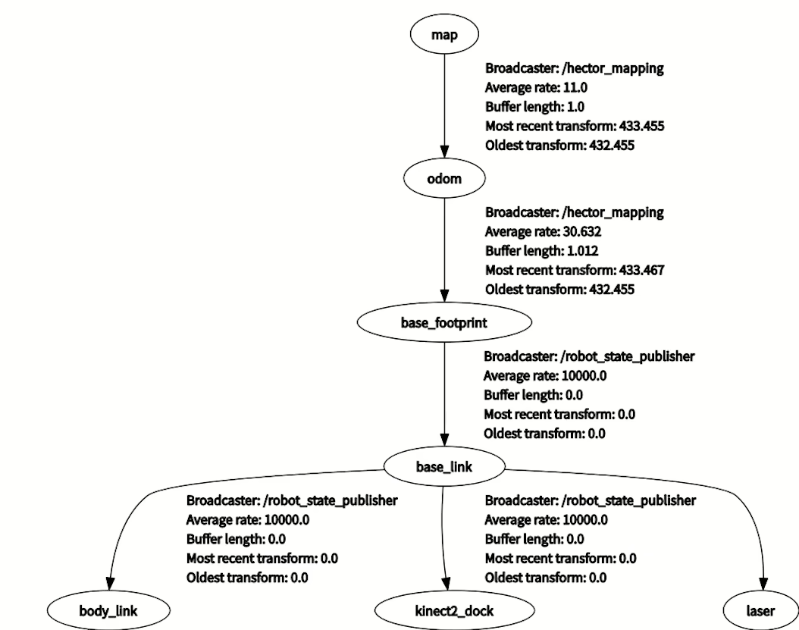

父坐标：map，子坐标：odom

#### 2.里程计

是一种软件算法，用于计算机器人运动的距离，从而计算出位姿，话题名称：/odom

作用：与激光雷达点云信息进行融合，弥补匹配信息不充分的情况；同时，点云匹配可以修正里程计累计误差

坐标树：odmo-->bese_footprint，里程计作为底盘的父坐标

slam最终输出TF:map-->base_footprint,中间插入odom;先利用odom里程计计算机器人位移
再利用slam修正里程计误差（gmapping算法）

#### 3.建图与保存地图

1.启动建图节点，用遥控器控制机器人建图

2.保存地图

```shell
rosrun map_server map_saver -f map
```

3.加载地图到参数服务器

```
rosrun map_server map_server map.yaml
```

```
rosrun rviz rviz
```

#### 4.Navigation导航系统

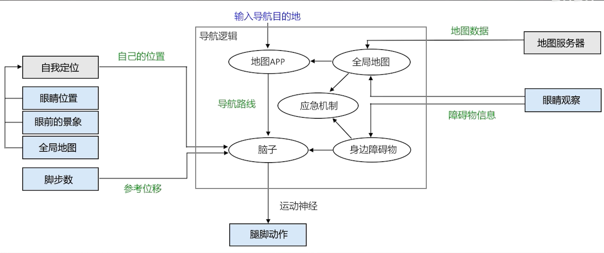

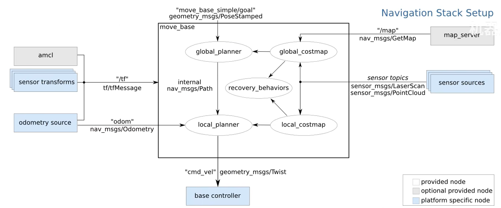

#### 5.全局路径规划算法

典型广度优先算法：dijkstra（迪杰斯特拉）,大水漫盖栅格地图

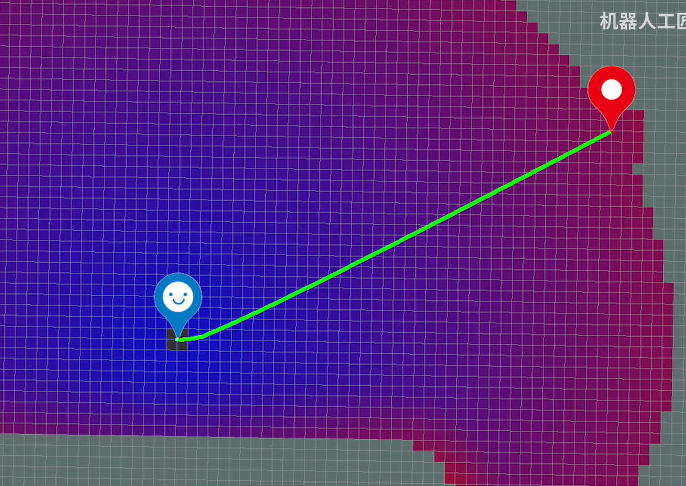

典型深度优先算法：A*算法，确定大致方向，再进行路径规划；优点是算力消耗小

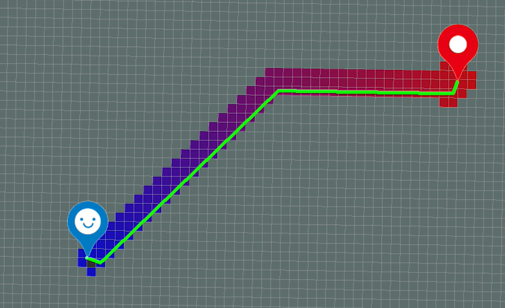

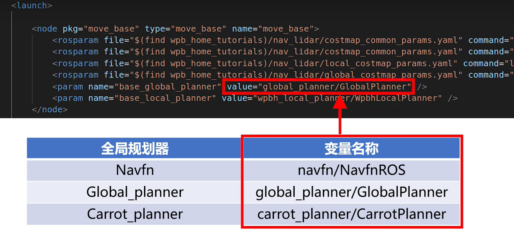

Navfn 默认采用dijkstra算法，A星有bug；global_planner是nav的优化版，可以设置dijkstra和A*,

A*设置方法：

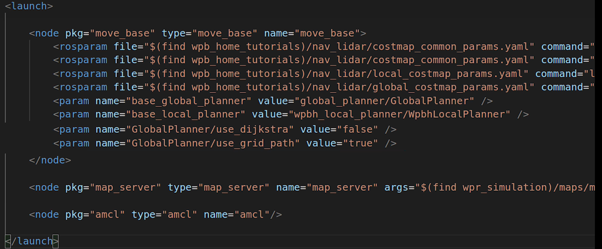

如今计算消耗都差不多，优先使用dijkstra，路径更平滑，距离最短

**carrot_planner全局路径规划器**

起始点到目标点走直线，遇到障碍物停止，很少被使用，常用于自定义规划器模板进行修改

#### 6.AMCL定位算法

自适应蒙特卡洛定位算法，机器人使用影分身，扫描周围障碍物，并于地图进行匹配，选取最优影分身作为当前位姿；（详情看《概率机器人》）

tf树输出机制


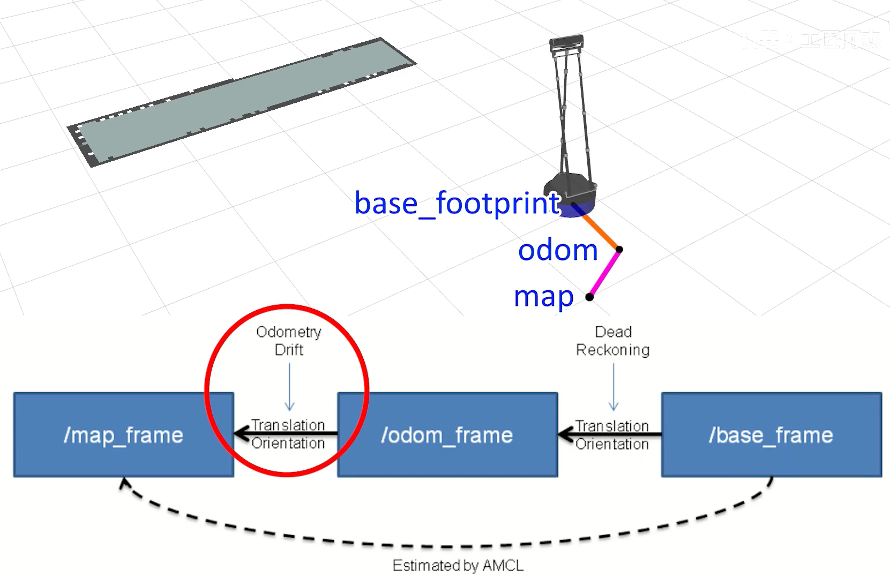

amcl负责输出map-->odom的tf,里程计负责输出odom-->base_footprint的tf，切换本体和分身

影分身替代本体，通过切换map-->odom的tf来实现跳变

#### 7.代价地图参数

costmap_common_params.yaml

```yaml
robot_radius: 0.25		# 机器人底盘半径
inflation_radius: 0.5	# 膨胀半径
obstacle_range: 1.0		# 障碍物范围，单位m；1m范围内的障碍物加入代价地图
raytrace_range: 6.0		# 射线追踪范围，单位m; 6米范围内，被射线穿过的栅格，认为无障碍物，清除动态障碍物残影
observation_sources: base_lidar		# 观测源--底盘上的激光雷达  

# 激光雷达 数据参数
base_lidar: {

    data_type: LaserScan,    # 数据类型
    topic: /scan, 			# 话题名称
    marking: true, 			# 将扫描到的障碍物，添加到代价地图
    clearing: true		 	# 清除动态障碍物残影
    }
```

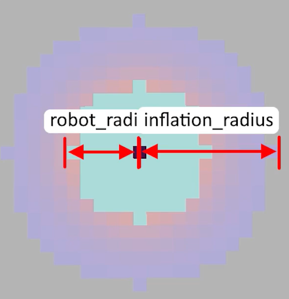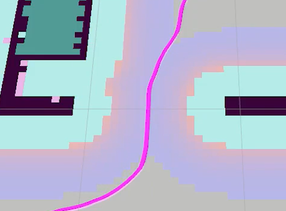

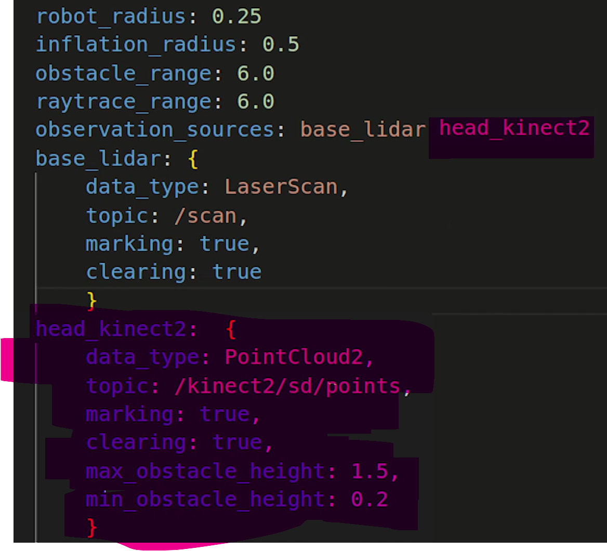

添加深度相机参数，补盲

```yaml
global_costmap:
  # 全局成本图配置参数
  # ---------------------
  # 全局坐标系名称（通常为地图坐标系）
  global_frame: map
    
  # 机器人底座坐标系名称（底盘中心点）
  robot_base_frame: base_footprint
    
  # 是否将map_server发来的地图作为静态地图?,如果设置为否，则只能一边建图一边导航
  static_map: true
    
  # 将新障碍物添加到全局代价地图的频率，1Hz
  update_frequency: 1.0
    
  # 地图发布频率（Hz），发布到rviz的频率
  # 控制ROS话题的发布频率
  publish_frequency: 1.0
    
  # 坐标变换容忍时间（秒） tf树中 laser_frame--> ... -->map 的转换时间
  # 超过此时间未收到有效坐标变换会抛出异常，出现了tf timeout 报错，调大
  transform_tolerance: 1.0

```

```yaml
local_costmap:
  # 局部成本图配置参数
  # ---------------------
  # 全局坐标系名称（通常为里程计坐标系）
  # 原因：amcl导致map-->odom的tf跳变,（map跳动），如果全局坐标系设为map会导致局部路径规划不连续
  global_frame: odom
  
  # 机器人底座坐标系名称（底盘中心点）
  robot_base_frame: base_footprint
  
  # 是否使用静态地图（false: 不使用静态地图，使用激光雷达扫描到的临时地图动态更新）
  # 局部成本图通常用于动态环境，因此设置为false
  static_map: false
  
  # 是否使用滚动窗口（true: 使用滚动窗口，跟随机器人移动）
  # 滚动窗口用于实时更新机器人周围的成本图
  rolling_window: true
  
  # 滚动窗口的宽度（米）
  # 定义了局部成本图的横向覆盖范围
  width: 3.0
  
  # 滚动窗口的高度（米）
  # 定义了局部成本图的纵向覆盖范围
  height: 3.0
  
  # 局部成本图更新频率（Hz），一般设置为激光雷达的扫描频率，每扫描一圈，规划一次
  # 控制局部路径规划的计算频率
  update_frequency: 10.0
  
  # 局部成本图发布频率（Hz）
  # 控制ROS话题的发布频率
  publish_frequency: 10.0
  
  # 坐标变换容差时间（秒）
  # 超过此时间未收到有效坐标变换会抛出异常
  transform_tolerance: 1.0

```

#### 8.恢复行为

遇到无法通过的障碍物时，重新全局路径规划

保守重置：清除地图中，一定范围内的障碍物信息，重新规划导航路线

旋转清除：原地旋转，用雷达彻底扫描周围，避免盲区障碍物残留未被刷新

激进重置：清除地图中更大范围内的障碍物信息，重新规划导航路线

**官方脱困策略**

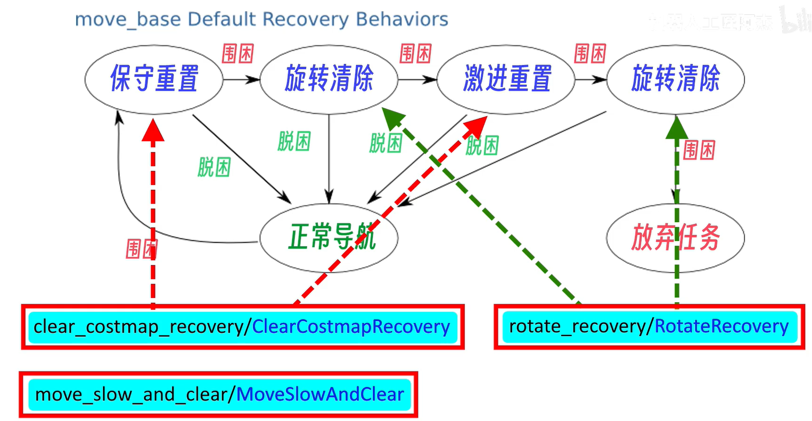

```yaml
recovery_behaviors:
  - name: 'conservative_reset'
    type: 'clear_costmap_recovery/ClearCostmapRecovery'
  - name: 'rotate_recovery'
    type: 'rotate_recovery/RotateRecovery'
  - name: 'aggressive_reset'
    type: 'clear_costmap_recovery/ClearCostmapRecovery'

conservative_reset:
  reset_distance: 2.0				#残留动态地图清除范围（2米）
  layer_names: ["obstacle_layer"]	 #清除的地图层--障碍物层（先验地图中，新加入的障碍物）

aggressive_reset:
  reset_distance: 0.0
  layer_names: ["obstacle_layer"]
```

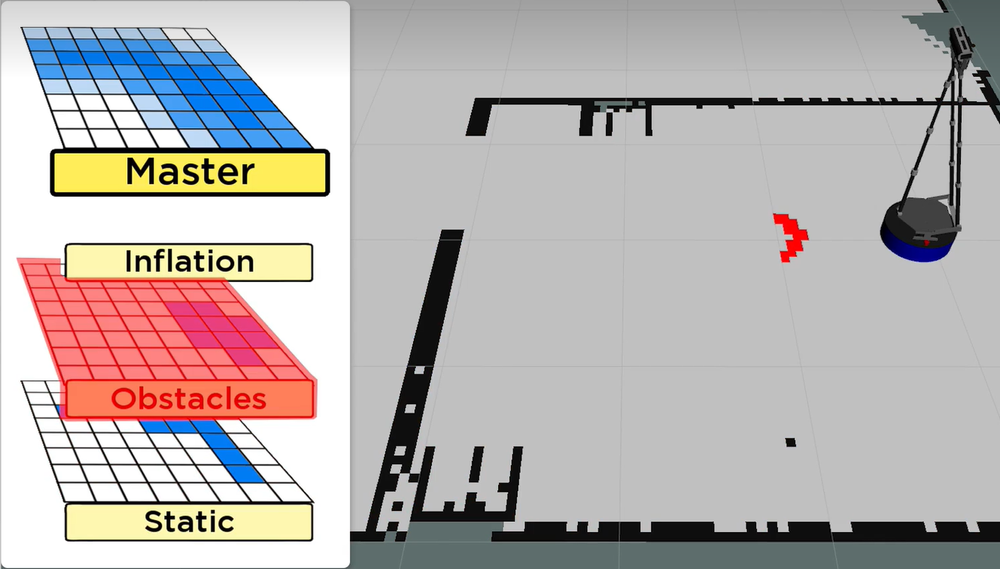


**自定义脱困策略**

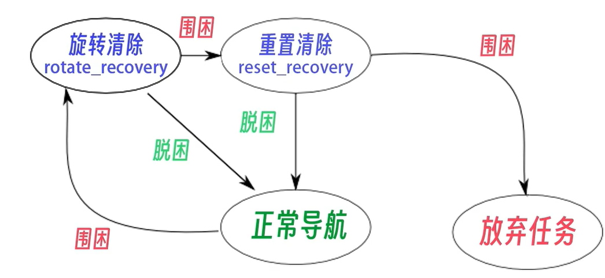

src/wpb_home/wpb_home_tutorials/nav_lidar/global_costmap_params.yaml

```yaml
global_costmap:
  global_frame: map
  robot_base_frame: base_footprint
  static_map: true
  update_frequency: 1.0
  publish_frequency: 1.0
  transform_tolerance: 1.0

recovery_behaviors:
  - name: 'rotate_recovery'
    type: 'rotate_recovery/RotateRecovery'
  - name: 'reset_recovery'
    type: 'clear_costmap_recovery/ClearCostmapRecovery'

reset_recovery:
  reset_distance: 1.84
  layer_names: ["obstacle_layer"]
```

#### 9.局部规划器

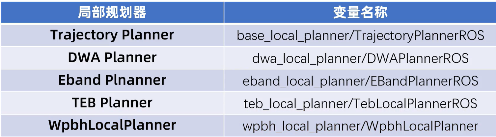

局部路径规划避障，Trajectory Planner ：ros自带的局部路径规划器（内部dwa）；DWA:Trajectory Planner 优化版

Eband Plnanner 和 TEB类似,TEB性能更高；Wpbh 某特定机器人深度优化后的路径规划算法。

**DWA**

Dynamic Window Approach，动态窗口法

1.生成轨迹：以当前机器人运动速度为基础，规划未来一段时间机器人的运动状态和移动路线，机器人运动为矢量运动加旋转运动；综合考虑底盘加速度限制，与障碍物保持有效刹车距离，尽快运动到轨迹终点。

2.挑选轨迹：运动轨迹和全局导航路线的贴合程度（过程），轨迹末端和目标点的距离（目标），轨迹路线和障碍物之间的距离（终点）

src/nav_pkg/launch/nav.launch

```yaml
<launch>
    <!--- Run move_base -->
    <node pkg="move_base" type="move_base" name="move_base">
        <rosparam file="$(find wpb_home_tutorials)/nav_lidar/costmap_common_params.yaml" command="load" ns="global_costmap" />
        <rosparam file="$(find wpb_home_tutorials)/nav_lidar/costmap_common_params.yaml" command="load" ns="local_costmap" />
        <rosparam file="$(find wpb_home_tutorials)/nav_lidar/global_costmap_params.yaml" command="load" />
        <rosparam file="$(find wpb_home_tutorials)/nav_lidar/local_costmap_params.yaml" command="load" />
        <param name="base_global_planner" value="global_planner/GlobalPlanner" /> 
        <param name="base_local_planner" value="dwa_local_planner/DWAPlannerROS" />
        <rosparam file="$(find wpb_home_tutorials)/nav_lidar/dwa_local_planner_params.yaml" command="load"/>
    </node>

    <node pkg="map_server" type="map_server" name="map_server" args="$(find wpr_simulation)/maps/map.yaml"/>
    <node pkg="amcl" type="amcl" name="amcl"/>
    <node name="rviz" pkg="rviz" type="rviz" args="-d $(find nav_pkg)/rviz/nav.rviz" />
</launch>
```

先启动仿真环境，再启动路径规划

动态调参

```shell
rosrun rqt_reconfigure rqt_reconfigure
```

**TEB**
Time Elastic Band (时间弹性带)，形象理解：局部路径作为一条弹力带先贴合在全局路径上，然后受到障碍物斥力，导致弹性带形变避障；


TEB根据机器人的速度和加速度这些运动性能，在绿色弹力带上预测，机器人会到哪个位置，根据最短时间，选取最优路径，常用于竞速机器人；安装teb

```shell
sudo apt install ros-noetic-teb-local-planner
```

缺点：不能原地转弯，会有倒车入库的尖角路径，适用于阿克曼模型，参数太多了，调参困难，不推荐使用

#### 10.坐标点导航

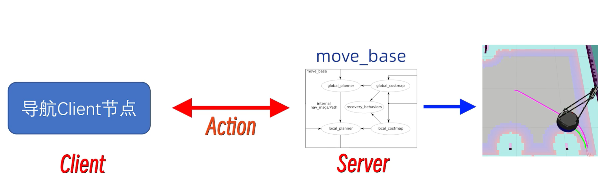


src/nav_pkg/src/nav_client.cpp

```cpp
#include <ros/ros.h>
#include <move_base_msgs/MoveBaseAction.h>
#include <actionlib/client/simple_action_client.h>

//定义客户端对象
typedef actionlib::SimpleActionClient<move_base_msgs::MoveBaseAction> MoveBaseClient;

int main(int argc, char** argv)
{
    ros::init(argc, argv, "nav_client");
    //生成一个action客户端对象
    MoveBaseClient ac("move_base", true);//ac为客户端对象名字，参数1：需要连接服务器名字，参数2：自动阻塞等待结果（不用写spin）
    while (!ac.waitForServer(ros::Duration(5.0)))//等待5秒movebase服务器启动,启动成功返回ture，跳出循环，否则返回false
    {
        ROS_INFO("Waiting for the move_base action server to come up");
    }
    
    move_base_msgs::MoveBaseGoal goal;//定义导航消息包--目标

    goal.target_pose.header.frame_id = "map";//坐标系
    goal.target_pose.header.stamp = ros::Time::now();//时间戳

    //导航目标点，从slam建图原点开始计算
    goal.target_pose.pose.position.x = -3.0;  
    goal.target_pose.pose.position.y = 2.0;

    //目标姿态,xyz默认为0，朝向与原来一致
    goal.target_pose.pose.orientation.w = 1.0;

    ROS_INFO("Sending goal");
    ac.sendGoal(goal);

    ac.waitForResult();//阻塞等待结果

    if(ac.getState() == actionlib::SimpleClientGoalState::SUCCEEDED)
        ROS_INFO("Mission complete!");
    else
        ROS_INFO("Mission failed ...");

    return 0;
}
```

cmakelists

```cmake
add_executable(nav_client src/nav_client.cpp)

add_dependencies(nav_client ${${PROJECT_NAME}_EXPORTED_TARGETS} ${catkin_EXPORTED_TARGETS})

target_link_libraries(nav_client
  ${catkin_LIBRARIES}
)
```

```shell
catkin_make
```

测试：先启动gazebo仿真平台，再启动movebase+rviz，最后

```
rosrun nav_pkg nav_client 
```

车移动到指定坐标点

#### 11.多点导航插件

```shell
roslaunch waterplus_map_tools add_waypoint_simulation.launch 
```


设置目标点，保存导航目标点

```shell
rosrun waterplus_map_tools wp_saver
```

启动仿真环境

```
roslaunch wpr_simulation wpb_map_tool.launch 
```

启动导航运动节点

```
rosrun wpr_simulation demo_map_tool
```

发现车自动移动到1号点

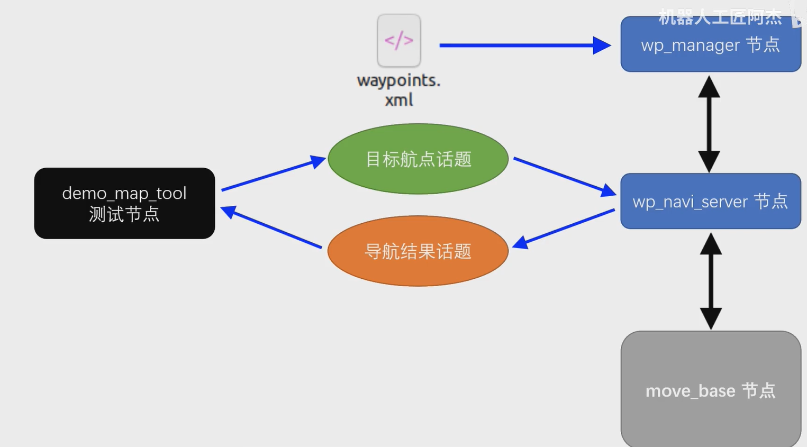

wp_navi_server节点做客户端，给move_base节点发布单个航点信息，控制机器人移动到指定航点；

通过waypoints.xml ---> wp_manager 管理并发布多航点信息

demo_map_tool测试节点发布与接收航点话题，与wp_navi_server节点通信


src/nav_pkg/launch/nav.launch

```xaml
<launch>
    <!--- Run move_base -->
    <node pkg="move_base" type="move_base" name="move_base">
        <rosparam file="$(find wpb_home_tutorials)/nav_lidar/costmap_common_params.yaml" command="load" ns="global_costmap" />
        <rosparam file="$(find wpb_home_tutorials)/nav_lidar/costmap_common_params.yaml" command="load" ns="local_costmap" />
        <rosparam file="$(find wpb_home_tutorials)/nav_lidar/global_costmap_params.yaml" command="load" />
        <rosparam file="$(find wpb_home_tutorials)/nav_lidar/local_costmap_params.yaml" command="load" />
        <param name="base_global_planner" value="global_planner/GlobalPlanner" /> 
        <param name="base_local_planner" value="wpbh_local_planner/WpbhLocalPlanner" />
        <param name="controller_frequencey" value="10" type="double" />
    </node>

    <node pkg="map_server" type="map_server" name="map_server" args="$(find wpr_simulation)/maps/map.yaml"/>

    <node pkg="amcl" type="amcl" name="amcl"/>

    <node name="rviz" pkg="rviz" type="rviz" args="-d $(find nav_pkg)/rviz/map_tool.rviz">

    <node pkg="waterplus_map_tools" type="wp_navi_server" name="wp_navi_server" output="screen" />

    <node pkg="waterplus_map_tools" type="wp_manager" name="wp_manager" output="screen" />
</launch>
```

启动仿真环境

```python
roslaunch wpr_simulation wpb_stage_robocup.launch 
```

启动nav运动控制与rviz

```
roslaunch nav_pkg nav.launch 
```

启动航点发布与接收测试程序

```
rosrun waterplus_map_tools wp_nav_test 
```

发现机器人自动按航点运动


自定义cpp多点导航：

src/nav_pkg/src/wp_node.cpp

```cpp
#include <ros/ros.h>
#include <std_msgs/String.h>

void NavResultCallback(const std_msgs::String &msg)
{
    ROS_WARN("[NavResultCallback] %s",msg.data.c_str());
}

int main(int argc, char** argv)
{
    ros::init(argc, argv, "wp_node");

    ros::NodeHandle n;
    ros::Publisher nav_pub = n.advertise<std_msgs::String>("/waterplus/navi_waypoint", 10);
    ros::Subscriber res_sub = n.subscribe("/waterplus/navi_result", 10 , NavResultCallback);

    sleep(1);

    std_msgs::String nav_msg;
    nav_msg.data = "1";  //前往1号航点
    nav_pub.publish(nav_msg);

    ros::spin();
    
    return 0;
}
```

修改cmakelists，编译；测试

```
roslaunch wpr_simulation wpb_stage_robocup.launch 
```

```
roslaunch nav_pkg nav.launch 
```

```
rosrun nav_pkg wp_node 
```

