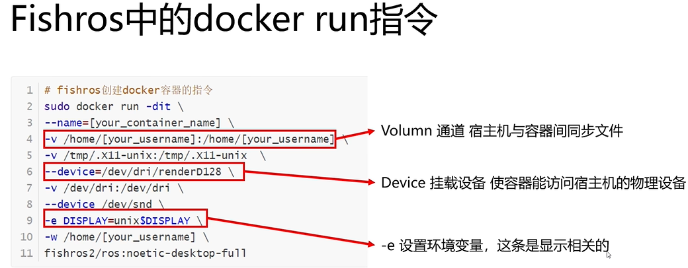
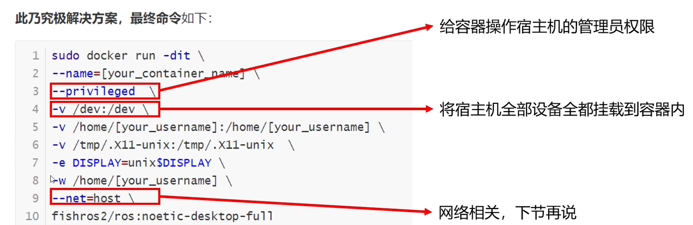
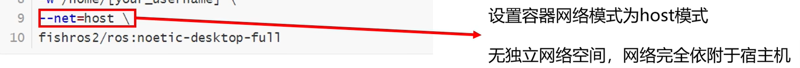
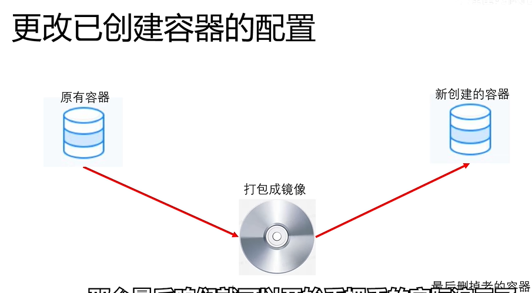
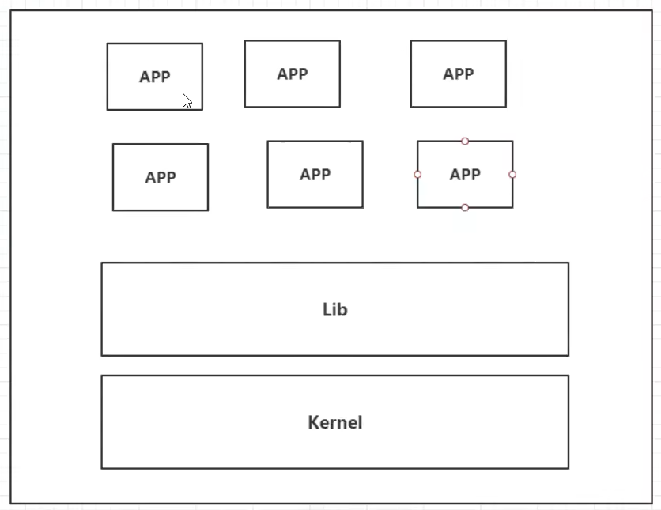
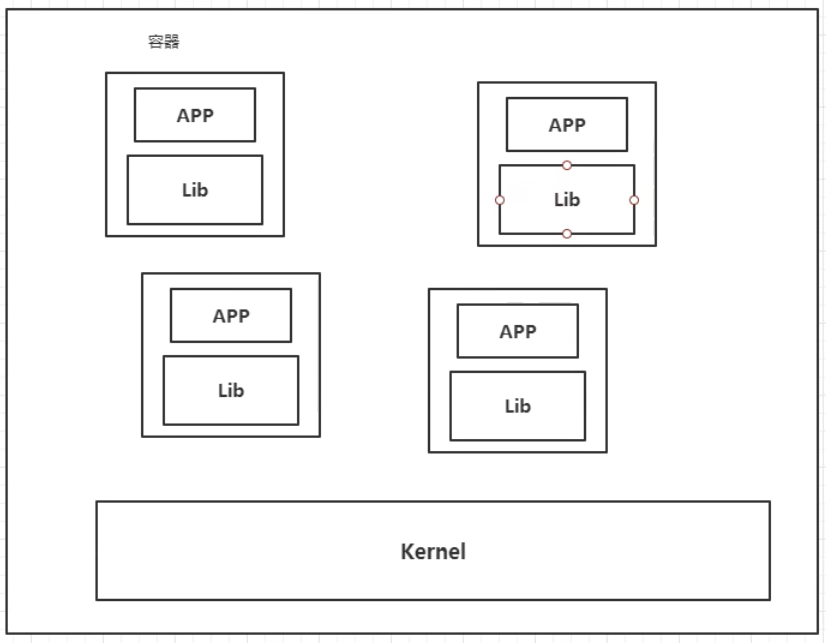
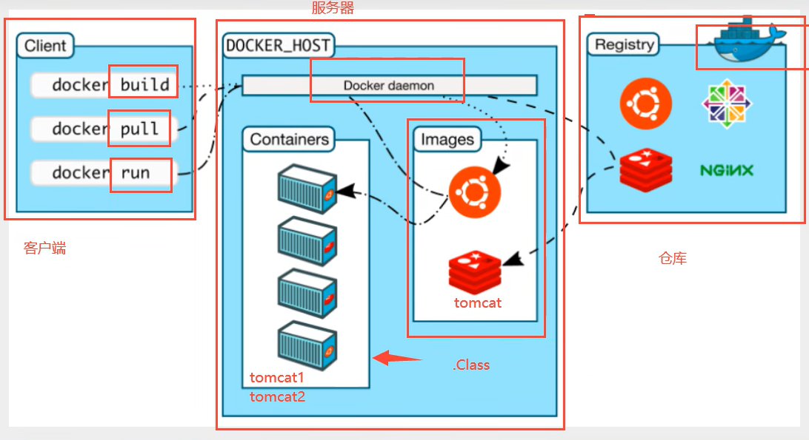

#### ubuntu中运行docker

容器（container）


不虚拟硬件，只虚拟linux内核

性能远高于虚拟机


创建容器命令：docker run

```shell
sudo docker run -dit \
--name=[your_container_name] \	# 指定需要被创建的容器名（新生文件）
fishros2/ros::noetic-desktop-full  # 被实例化的镜像名(源文件)
```



解决鱼香ros无法使用串口和远程通信问题







#### docker为什么出现？

每台设备环境不一样，会出现有的设备代码可以运行，有的设备不能运行；所以用docker将（代码+环境）打包！

java -- apk --发布（应用商店） ---张三使用apk --- 安装即可用

java -- jar(环境) -- 打包项目带上环境（镜像） --- （docker仓库：商店） --- 下载镜像，直接运行即可！

一个linux系统，可以用docker将多个程序打包隔离运行，防止环境干扰

docker出现前，我们都是用虚拟机技术，缺点就是笨重，优点就是完全虚拟一台或多台机器

```
虚拟机: linux ubuntu原生镜像（一台电脑！）  隔离，需要开启多个虚拟机！  占用n个G，启动需要几分钟
docker: 隔离， 镜像（最核心的环境 4m + jdk + mysql） 十分小巧，运行镜像就可以了！ 小巧！ 几兆，秒级启动
```

官网：[Docker: Accelerated Container Application Development](https://www.docker.com/)

文档：[Docker Docs](https://docs.docker.com/)

虚拟机技术：



docker技术：



传统虚拟机，虚拟一套硬件，运行一个完整的操作系统，然后在这个系统上安装和运行软件

docker内的应用，直接运行在宿主机上，docker没有自己的内核，也没有虚拟硬件，更加轻便

每个容器互相隔离，每个容器都有一个属于自己的文件系统，互不影响

**应用更快速的交付和部署**

传统：一堆帮助文档，安装程序

Docker:打包镜像发布测试，一键运行

**更便捷的升级和扩缩容，更简单的系统运维，更高效的计算资源利用**

部署应用和搭积木一样，项目打包为一个镜像，扩展到多个服务器；容器化开发后，开发和测试环境高度一致；容器是内核级别的虚拟化，可以在一个物理机上运行很多的容器实例！服务器的性能可以被压榨到极致。

#### 基本组成



**镜像（image）** 
模板，通过模板创建容器服务， 镜像>run>tomcat01容器（提供服务器），通过镜像创建多个容器（服务运行在容器中） 

**容器（container）** 
docker利用容器技术，独立运行一个或者一个组应用，通过镜像来创建
启动，停止，删除，基本命令！
目前可以把这个容器理解为一个简易的linux系统

**仓库（repository）**
存放镜像的地方，分为私有仓库和公有仓库
Docker Hub(默认是国外的)，阿里云...都有容器服务器（配置镜像加速！）