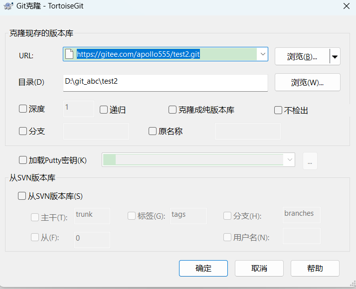

# 图形化操作

**windows下的操作**

注册gitee账号，下载安装git,git小乌龟

创建仓库；点击创建；复制仓库地址


```
https://gitee.com/apollo555/test2.git
```

本地创建仓库：新建文件夹，右击；
点击 git 克隆，粘贴仓库地址，点击确认；
点击关闭；



在test2本地仓库中创建代码，比如用vs2022操作，新建代码后保存。

右击鼠标，选择小乌龟-->添加；
点击提交；
输入日志信息，点击提交。


点击推送；确定；关闭


查看gitee网站；提交成功，可以查看代码


回到本地文件仓库，右击选择小乌龟，拉取代码到本地


# 命令行操作

##### 1.基本操作

###### 工作流程


-   Workspace：工作区
-   Index / Stage：暂存区
-   Repository：仓库区（或本地仓库、版本库）
-   Remote：远程仓库

打开终端，输入命令，配置

```bash
PS C:\Users\ASUS> git config --global user.name "apollo-jeff"
PS C:\Users\ASUS> git config --global user.email "1515415975@qq.com"
```

新建文件夹，进入文件夹，右击打开终端，查看当前仓库状态

```bash
PS C:\Users\ASUS\Desktop\veu-cource> git status		#查看仓库状态
fatal: not a git repository (or any of the parent directories): .git

PS C:\Users\ASUS\Desktop\veu-cource> git init
Initialized empty Git repository in C:/Users/ASUS/Desktop/veu-cource/.git/		#初始化
```

初始化后，文件夹出现.git文件


**文件状态**

新建t.txt文件，继续后面操作

git中的文件有两种状态：未跟踪和已跟踪。
可以通过`git status`来查看文件的状态

**未跟踪**指文件没有被git所管理，已跟踪指文件已被git管理。刚刚添加到项目中的文件处于未跟踪状态

```bash
PS C:\Users\ASUS\Desktop\veu-cource\git-demo> git status
On branch master

No commits yet

Untracked files:##未跟踪
  (use "git add <file>..." to include in what will be committed)
        t.txt

nothing added to commit but untracked files present (use "git add" to track)
```

**已跟踪**的文件又有三种状态：==**未修改、修改和暂存**。==

暂存，表示文件修改已经保存到暂存区，但是尚未提交到git本地仓库。

```bash
 #添加到暂存区
PS C:\Users\ASUS\Desktop\veu-cource\git-demo> git add .\t.txt

PS C:\Users\ASUS\Desktop\veu-cource\git-demo> git status
On branch master

No commits yet	

Changes to be committed:	##文件在暂存区，未被提交
  (use "git rm --cached <file>..." to unstage)
        new file:   t.txt		#红色字体
```

未修改，表示工作区文件和git仓库中文件完全相同

```bash
 #提交到本地仓库，并添加日志
PS C:\Users\ASUS\Desktop\veu-cource\git-demo> git commit  -m "第一次提交t.txt"
[master (root-commit) 64f7344] 第一次提交t.txt
 1 file changed, 1 insertion(+)
 create mode 100644 t.txt
 
PS C:\Users\ASUS\Desktop\veu-cource\git-demo> git status
On branch master
nothing to commit, working tree clean
```

已修改，表示工作区文件已被修改，和git仓库中文件不同。

```bash
#修改文件内容，会变成已修改状态
PS C:\Users\ASUS\Desktop\veu-cource\git-demo> git status
On branch master
Changes not staged for commit:
  (use "git add <file>..." to update what will be committed)
  (use "git restore <file>..." to discard changes in working directory)
        modified:   t.txt

no changes added to commit (use "git add" and/or "git commit -a")
```

要存到git仓库，先暂存，再提交

```bash
git add .\t.txt
git commit -m "第二次提交t.txt" 		#将暂存文件提交到仓库
```

###### 提交日志

git log		详细日志显示，可以上下移动，按q退出

git log --graph		显示分支图

git log --pretty=oneline 	日志单行显示

```bash
PS C:\Users\ASUS\Desktop\veu-cource\git-demo> git log
commit 4e7f2466f003ef82f283473a0cf1a75f1b6df027 (HEAD -> master)
Author: apollo-jeff <1515415975@qq.com>
Date:   Wed Jul 3 19:45:34 2024 +0800

    第二次提交 t.txt

commit 64f7344faf750cfdf3266a973a93427ae35b1a27
Author: apollo-jeff <1515415975@qq.com>
Date:   Wed Jul 3 19:30:48 2024 +0800

    第一次提交t.txt
```

###### 改动查询

git diff 文件名 查看这个文件和之前文件的对比

###### 回退版本

git reset --hard 版本号		#版本号是上面 commit 后面的句子

获取最新版本号：git reflog 		#用于回到最新版本

```bash
git add * #暂存所有文件，包括未跟踪文件
git commit -a -m "修改三个文件"  #提交所有文件，未跟踪文件不会被提交

git commit -m "第二次提交t.txt" 	#将暂存文件提交到仓库
```

###### **存储工作状态**

`git stash` 是 Git 中一个非常有用的命令，用于临时保存和恢复未完成的改动。它允许您在当前工作目录的改动尚未完成或未准备好提交时，把当前工作现场 ”储藏起来”，以便您可以切换分支、拉取最新的更改或处理其他紧急任务，而不会丢失您的工作进度。

git stash		储存当前工作状态

git stash list	查看储存工作列表

```bash
book@100ask:~/Desktop/test$ git stash list
stash@{0}: WIP on master: d5a5eb1 提交所有文件
##"WIP"是"Work In Progress"的缩写，意思是“正在进行中”
```

git stash apply	恢复工作状态，恢复后，stash内容并不删除，你需要使用命令git stash drop来删除。

另一种方式是使用git stash pop,恢复的同时把stash内容也删除了。


##### 2.常用命令

###### 1.重置文件

```bash
git restore .\1.txt		
#丢弃工作区的修改，如果文件未提交，但已修改v，将文件恢复到未修改状态
git restore --staged .\1.txt	#取消暂存状态		

##linuxz中失效，有签出命令，丢弃工作区的改动
git checkout -- <文件>	#注意空格
```

###### 2.删除文件

```bash
git rm .\1.txt		#删除文件，当文件被修改但没有暂存时，无法删除
git rm .\1.txt  -f   #强制删除
```

###### 3.移动文件

````bash
git mv 原文件 重命名文件 #移动文件，重命名文件，保存到git仓库区
````

##### 3.分支

git 在储存文件时，每一次代码提交，都会创建一个与之对应的节点，git就是通过一个一个的节点来记录代码的状态的。
节点会构建一个树状结构，树状结构意味着这个树会存在分支，默认情况下仓库只有一个分支，命名为main（主干）。

在使用git时，分支与分支之间相互独立，在一个分支上修改代码，不会影响其他的分支。

###### 分支命令

```bash
git branch		       #查看分支
git branch 新分支名		#插入分支
git branch -d 分支名	 #删除分支,delite

git switch 分支名		 #切换分支
git switch -c 分支名	 #创建并切换分支,create

git checkout 分支名	#老版本 切换分支

git merge 分支名		 #合并分支
git merge –no-ff -m “注释” 分支名	
#合并分支，禁用”Fast forward”模式，删除分支后会保留分支日志
```

在开发中，都是在自己的分支上编写代码，代码编写完后，再将自己的分支合并到主分支

1.  创建一个次分支。
2.  修改次分支上的内容。
3.  添加到暂存区。
4.  切换回主分支(master)。
5.  合并dev分支
    git merge –no-ff -m “注释” 分支名，删除分支后，保留提交日志
6.  查看历史记录

* **常用分支名**

1. `master` 或 `main`：主分支
2. `develop` 或 `dev`：开发分支
3. `feature/`：特性分支，用于开发新功能，例如 `feature/user-login`。
4. `bugfix/` 或 `hotfix/`：修复分支，例如 `hotfix/login-issue`。
5. `release/`：发布分支，例如 `release/1.0.0`。
6. `test/` 或 `testing/`：测试分支
7. `experiment/` 或 `exp/`：实验分支
8. `docs/`：文档分支
9. `refactor/`：重构分支，用于对现有代码进行重构，提高代码质量和可维护性。
10. `chore/`：杂项分支，如依赖更新、配置更改等。

**变基（rebase）**

在开发中，除了通过merge来合并分支外，还可以通过变基类完成分支的合并。
我们通过merge合并时，在提交记录中，会将所有的分支创建和分支合并的过程，全部显示出来，这样项目就比较复杂，开发过程比较波折时，我们必须要反复创建，合并，创建分支。这样提交记录变得复杂

原理（变基时发生了什么）：

1. 当我们发起变基时，git 会首先找到两条分支的最近的共同祖先
2. 对比当前分支相对于祖先的历史提交，并且将它们提取出来存储到一个临时文件中
3. 将当前部分指向目标的基底
4. 以当前基底开始，重新执行历史操作

变基和 merge 对于合并分支来说最终的结果是一样的！但是变基会使得代码的提交记录更整洁更清晰！注意！大部分情况下合并和变基是可以互换的，但是==如果分支已经提交给了远程仓库，那么这时尽量不要变基==。

###### 变基命令

```bash
#主分支 main,旁路分支ss1；将ss1变基到主分支，并于main合并
git switch iss2		#切换到iss2，准备变基
git rebase main		#变基
git switch main		#切换到main，准备合并
git merge iss2		#将iss2合并到主分支
git branch -d iss2	#删除iss2
```

​	变基后再合并，分支变少更简洁


##### 4.远程仓库（remote）

目前我对于 git 所有操作都是在本地进行的。在开发中显然不能这样的，这时我们就需要一个远程的 git 仓库。远程的 git 仓库和本地的本质没有什么区别，不同点在于远程的仓库可以被多人同时访问使用，方便我们协同开发。在实际工作中，git 的服务器通常由公司搭建内部使用或是购买一些公共的私有 git 服务器。我们学习阶段，直接使用一些开放的公共 git 仓库。目前我们常用的库有两个：GitHub 和 Gitee（码云）

将本地库上传 github：

```bash
git remote add origin https://github.com/apollo-jeff/git-demo.git
# git remote add <自定义远程仓库名> <url>

git remote add origin git@github.com:apollo-jeff/jeff.git	
#用ssh秘钥链接，不用输账号密码，输错了可能会被禁止访问

git branch -M main# 修改分支的名字的为main

git push -u origin main
# git push 将代码上传服务器上，设定默认分支，后面只需git push
```

将本地库上传 gitee：

```bash
git remote add gitee https://gitee.com/apollo555/git-gemo.git
git push -u gitee "main"
```

###### 远程库命令

```bash
git remote # 列出当前的关联的远程库
git remote –v	#查看远程库的详细信息 
git remote add <远程库名> <url> # 关联远程仓库
git remote remove <远程库名>  # 删除远程库,只是本地删除，远程还在

git push -u <远程库名> <分支名> # 向远程库推送代码，并和当前分支关联
git push <远程库> <本地分支>:<远程分支>

git clone <url> # 从远程库下载代码
git clone <url> <自定义文件夹>	# 从远程库下载代码到自定义文件夹

git push   # 如果本地的版本低于远程库，push默认是推不上去
					# 这样写表示本地库master推到远程库master
		
git fetch  # 要想推送成功，必须先确保本地库和远程库的版本一致，
		 #fetch它会从远程仓库下载所有代码，但是它不会将代码和当前分支自动合并
		 # 使用fetch拉取代码后，必须要手动对代码进行合并
         
git merge origin/master		#本地仓库master分支和远程仓库origin中的master分支合并
#结果：
CONFLICT (add/add): Merge conflict in 3.txt
Auto-merging 3.txt
Automatic merge failed; fix conflicts and then commit the result.

git push #之后可以推动代码了，此时远程仓库的3.txt就会变成合并之后的代码

git pull  # 从服务器上拉取代码并自动合并  fetch+merge
```

注意：推送代码之前，一定要先从远程库中拉取最新的代码

多人协作工作模式一般是这样的：

-   首先，可以试图用git push origin branch-name推送自己的修改.
-   如果推送失败，则因为远程分支比你的本地更新早，需要先用git pull试图合并。
-   如果合并有冲突，则需要解决冲突，并在本地提交。再用git push origin branch-name推送。

tag 标签

-   当头指针没有执行某个分支的头部时，这种状态我们称为分离头指针（HEAD detached），分离头指针的状态下也可以操作操作代码，但是这些操作不会出现在任何的分支上，所以注意不要再分离头指针的状态下来操作仓库。

```bash
#分离头指针
git switch <提交id> 		#提交id用git log显示，如commit acc983ea，只用写前几位
#结果：
致命错误：期望一个分支，得到提交 'edf8b54a'
提示： 如果你在本提交分离头指针，使用 --detach 选项重试。

git checkout #查看分支
#结果：
您的分支与上游分支 'origin/main' 一致。
```

-   如果非得要回到后边的节点对代码进行操作，则可以选择创建分支后再操作

```bash
git switch -c <分支名> <提交id>
```

可以为提交记录设置标签，设置标签以后，可以通过标签快速的识别出不同的开发节点：

###### 标签命令

```bash
git tag					  #显示所有标签
git tag 版本				 #当前分支打上版本标签				
git tag 版本 提交id			#给某次提交的程序打上标签
git switch -c test v0.5		#头指针切换到v0.5，并创建分支test，同时切换到test

git push 远程仓库 标签名		#推送标签
git push 远程仓库 --tags	   #推送所有标签
git tag -d 标签名 			   # 删除本地标签
git push 远程仓库 --delete 标签名 # 删除远程标签
```

##### 5.vscode界面


M	 modify	刚刚被修改的文件
U	 untrack	未被追踪的文件
D	 delete	  刚刚被删除的文件


文件点击暂存更改后，变为A标识符，进入暂存区


点击暂存区文件“——”，将文件回到更改区


点击暂存区或更改区的文件，可以看到更改前后的文件，两文件中间的还原块“—>”，按钮可以还原代码


填完提交日志，关闭commit_editmsg，会自动提交代码


在git graph中，先点击最新提交，再按住ctrl，点击久远提交，可以发现有什么更改


##### 6.SSH密钥

SSH（Secure Shell）密钥是一种安全协议，用于在不安全的网络中为网络服务提供安全传输环境。SSH密钥主要用来进行身份验证，以确保只有拥有正确密钥的用户才能访问远程服务器或仓库。当拉取和推送远程仓库代码时，用ssh密钥也可以避免输密码。

但windiws会自动保存密码，也不用输，用https一样有效，也不容易报错，ssh容易出小问题，企业常用

id\_rsa是私钥，不能泄露出去，id\_rsa.pub是公钥，可以放心地告诉任何人。

**仓库公钥只能pull和clone(下载)，不能push**

gitee中有保护分支设置，这里，你可以选择仓库让谁可以进行push推送修改等。在仓库成员管理中可以指定设定用户的身份。但是要访问仓库必须设置个人公钥。

由此说明，gitee的仓库权限逻辑是，首先获取用户私钥信息，然后去看用户在不在这个仓库的管理权限中，如果权限符合则可以推送。

个人公钥设置，不设置不能在gitee推送自己的代码。

标题最好为，你用的哪台电脑生成的公钥，让自己记得。ssh是大神创建的一种安全措施，这样别人就没有办法伪造成你本人，然后进行提交了。

**说明，如果你是魔鬼，你想要去提交恶意破坏别人的项目，那你除非是内部成员才可以，由管理员把你的成员权限加上去，你才是内部成员。才能提交代码。**

因为我们可能在家有台电脑，在公司有电脑，在小媳妇家里也有个电脑，所以你可以把这三台电脑的公钥都添加上去 ，这样的话，你这三台电脑都可以以你的身份（内部成员的身份）提交了。

###### 具体操作

第一步：创建SSH Key。在用户主目录下	C:\Users\ASUS\\.ssh	，看看有没有.ssh目录，如果有，再看看这个目录下有没有id\_rsa和id\_rsa.pub这两个文件，如果有的话，直接跳过此如下命令，如果没有的话，打开命令行，输入如下命令：

```bash
ssh-keygen		#默认加密方式	然后一直按enter
ssh-keygen -t rsa –C “你的邮箱@xxx.com”  # 手动输入，rsa 加密方式 然后一直按enter,

cd ~/.ssh
cat id_rsa.pub
```


第二步：登录github,打开” settings”中的SSH Keys页面，然后点击“Add SSH Key”,填上任意title，在Key文本框里黏贴id\_rsa.pub文件的内容。


点击 Add Key，你就应该可以看到已经添加的key。


###### 远程库命令

```bash
echo "# jeff" >> README.md	#新建介绍文件
git init				   #本地仓库初始化					  
git add README.md			#将介绍文件添加到暂存区,或者git add .
git commit -m "first commit"  #将暂存区文件，提交到本地仓库
git branch -M main			#设置本地默认主分支为main

git remote add origin git@github.com:apollo-jeff/jeff.git	
# 用ssh密钥方式添加远程仓库，origin可以改，表示自定义远程仓库名；比如改为github
git push -u origin main		
# -u：-set-upstream,将当前分支与远程仓库中的分支进行关联
# origin: 自定义远程仓库名
# main：远程仓库默认分支，本地仓库默认分支尽量与其同名；
# 否则	git push -u origin master:main	冒号左边是本地分支，右边是远程分支。
```

