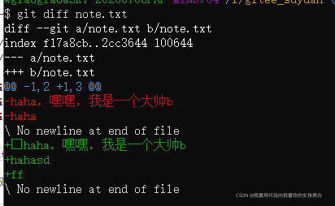
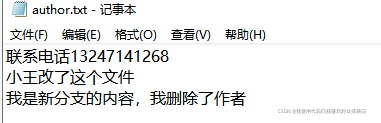

俺今天刚写完 专利技术交底书，于是有了一点点空闲时间。虽然常用github，但心里面总感觉缺点什么，于是有了这篇文档，希望这篇文档能在我忘记怎么用gitee的时候瞬间教会我。并且也能让我在写文档的过程中对git的理解更深。本篇文章的起因是因为一个知乎老哥的评论，它的写作风格，我很喜欢。


 于是本篇也是尝试（体验）用他这种风格来进行写作。

___

没有一个软件规格书，就没有一个好的软件（没有一个计划和目录，那么就没有一篇好文章）

                                                                           ------Stack OverFlow创始人 joel Spolsky

___

## 正文

### 什么是gitee?

要学gitee（国内最大的托管平台），你首先得知道gitee是什么。官方话称他为  **代码托管平台。**

而且你要知道**git**和github（国外最大的代码托管平台）有什么区别？

网上有个回答让我喜出望外 “git” 和“github”的区别，就像是 【魔兽争霸和对战平台的区别】。

历史：以前国外有很多代码托管平台及开源机构，然后国内没有，然后马越想搞开源，当时没人投他，然后他就自己搞，搞了个叫开源中国的公司，然后慢慢有钱了，然后发现没有搞国内托管平台，于是就搞了一个gitee。

### 为什么我现在开始使用gitee?

以前，大家都用github，现在大家都用gitlab，而我自己创建了公司，没钱，然后买的服务器太辣鸡配不起gitlab。于是就用了gitee。

然后再客观分析一下gitee的好处，对于国人来说：

1.gitee是国内的不卡，github非常卡（走梯子才能快）

2.现在互联网形势不好，用国内的产品比较稳定

3.通过多年的累计和扶持，gitee已经比较成熟

4.gitee全面支持中文，非常棒，不再需要右键谷歌机器翻译了

所以建议大家用gitee

### git学习

要用gitee得先学git，不学git就相当于你使用对战平台和别人联机玩游戏，但是你没下游戏，然后只能玩不了~~~

_批注：刚刚偷偷瞥了眼，廖雪峰的git教程（我觉得他写的非常通俗易懂），大家不想看我写的git，可以看他的，传送门[Git简介 - 廖雪峰的官方网站](https://www.liaoxuefeng.com/wiki/896043488029600/896067008724000 "Git简介 - 廖雪峰的官方网站")。_

学git你得知道好处，它能帮你【管理】昨天和今天【改动的文件】，还给你做【备份】；它能管理让你和你朋友一起【协作管理】同一个文件；

#### [安装git](https://so.csdn.net/so/search?q=%E5%AE%89%E8%A3%85git&spm=1001.2101.3001.7020)

我是win10电脑（其他系统的同学请看上述廖雪峰的git博客博客），首先输入在cmd中输入git命令，用来判断你是否安装git。

如果没有安装，可以直接去官网下载并且进行安装，传送门[Git](https://git-scm.com/ "Git")

安装后，右键打开git bash here


自报家门，git采用分布式协作，所以需要知道每台计算机的地址，是以名字和邮箱进行区分的。

所以需要设置你的名字和邮箱

```csharp
$ git config --global user.name "Your Name"

$ git config --global user.email "email@example.com"
```

###  创建版本库

版本库是用来存放你的项目的，对你项目的一删一改，版本库都能监控的到。

首先寻找一个盘（切记不能是含中文目录），创建一个文件夹


右键打开git命令行，输入命令初始化（这样版本库才能管理此文件夹中的内容） 

```csharp
git init
```

 然后就产生了个.git的文件，它是用于记录项目的改动的，千万不能删

#### git引导教程

 在gitee\_suyuan 创建一个文件，用notepad++（别用微软的记事本，因为他团队自作聪明加了十六进制的开头，然后导致浏览器访问为？程序编译失败等问题）


把大象放入冰箱还要三步（打开冰箱-放入大象-关闭冰箱），而把文件交给git管理，只要【两步】。

**step1:**将文件预先添加到git仓库

```bash
git add note.txt
```

如果没有出现任何提示，代表你这条命令执行成功了，大神的开发作风。（大神代表 林纳斯-托瓦兹）

**step2:**然后提交给git仓库，并且附上说明，大神这样写是为了统一规范。

```bash
git commit -m "刚刚我创建了一个文本"
```


 1 file changed（文件改变）,1 insertion 插入（代表行，我只写了一行）

 _git操作必须在存在.git的仓库下进行（否则没有意义，git init除外）_

那么如果我已经提交成功了，我再次提交一个原有的相同的文件会怎么样？我的科学界男神费曼说要勇敢尝试，科学求证（即使别人做过，你也要做，一方面更加熟悉这个操作，另一方面也许别人是错的呢？）那我们就来做个测试吧。

git add note.txt

没有反应！


**说明添加的时候，并不会进行任何计算，只是单纯的把它放到了某个集合中。**

 git  commit -m "我刚刚再次添加了同样的文件"


这里他做出了检测，告诉了我在主分支上（git是存在分支的，以此来区分测试代码、开发版代码、新方向的代码，而主分支通常是最重要的分支，线上版），没有提交合并，所以就把创建的工作树给清理了。

**说明在提交的时候，他会首先创建工作树进行记录版本，然后进行计算是否更改了信息，没有改的话，他就会把刚刚创建的工作树删除，不会做任何操作。**

尝试多个文件进行添加，他是通过空格隔开，也可以全量添加 **add .**  但是不好，计算量大。

我创建了一个note2，也修改了note。现在在进行add，对了add在commit之前会一直记录，你add了一行，然后在进行add命令，都会被记录叠加，最后commit对他们一次处理。


 他修改了2个文件，和插入了4行。删除了一行。（我在note文件下面加了一行，在note2加了2行）

**说明他是，将存在的文件进行覆盖，将新文件进行创建。**

 **而引申出来的，我们为什么能在github上看到，删除和更新的内容？，因为他将上个版本的文件与新出来的文件做了比对，从而知道删除了什么，新增了什么。这做法确实很聪明。**

俺有一个想法，俺已经交给git去管理项目了，那对其中的一个项目进行改动，git知道吗？然后俺对note文件进行改动

通过git status去查询当前的项目状态


 从中能看到modified（改动了）

**说明他，能通过以前的文件和现在的文件做比对，而得到现在的情况**

那俺想他能查看到具体改动了哪些文件吗？

通过diff命令

git diff 文件名



他告诉你了，上一个版本是2行，现在是3行，并且会显示2个文件

**说明他，并没有做具体的文件对比，而只是给你展示了双方的文件内容。**

_这样看完之后，对于量大的问题确实没有太好的解决方式，其实就是个简单的2个文件【以行】作【为单位】进行【字符和位置互相比对】功能。--github和gitee解决了_

然后确认没问题，通过git add 文件名进行提交，此时他在用git status他就会从红色变成绿色，代表已经加入，并且会告诉你，即将覆盖的文件是哪些。


 然后通过git commit -m 进行提交。整个更新到仓库的流程就完成了。


 现在比方说小彭干了件蠢事，把文件删错了然后提交了。项目经理发现了无法编译了，于是大叫，到底是哪个笨蛋干的。然后小彭想到了自己昨天更改了文件，然后他想【大神发明了这个东西，大神肯定想到有某个傻子搞错了，得有办法回退到正常的版本】于是他就找到了下面的命令

git log就能知道自己干了啥


commit是hash值的id代表的是你提交的版本号（通过他进行回退），为什么用hash因为hash叫做指纹，几乎不会重复。

author代表作者，就是你开头安装完之后，输入的本机信息

Date代表修复时间

刚刚的中文是你每次提交commit（快照-备份）的时候 -m 说明

回退命令需要根据你的log显示的id进行回退，你可以不用写全git就能自动去找

```bash
git reset --hard id
```


**说明，他是根据id，将现在的版本定为，你回退的版本**

当然，你也会问，他会把之前那个删掉吗，不会的，如果你没有关闭窗口，根据id照样可以回退回去。而且我猜测大神的写法，为了提高空间利用率，肯定是只存储了修改部分的文件，而不是全部项目。那测试也很简单，你把他全删除了，看看能否回退？（如果能，则代表大神只存储了所有修改部分的文件，没有对整个主分支进行备份）。

居然恢复了，大神也应该想到了这个问题，所以在git中备份了一个主分支的内容，只用主分支+修改的文件进行替换就能恢复到任意版本。

Hard代表的是指针，他只是将当前的版本回退过去了。另外如果你回退错了，又关闭了窗口，不记得是哪一个回退了，大神也写了个功能，能够查看你的回退日志。

git reflog 然后在进行回退


俺刚刚回到了1792的版本，答案是原来是4d7b版本，我再通过reset --hard 4d7b就可以回去了

从下往上看，是每一次commit，然后执行了reset命令。看的很清楚。

**说明，大神记录了每一次快照改变的情况。**

当没有东西改变，通过git status，就是干净的clean。如果本地有东西改变，他就会告诉你改变了，但是没有添加（add）到集体工作的集合中（暂存区）。当添加后，就可以commit了（他就把暂存区的东西全部剪切到分支中，这里我们用的是主分支，之后在status代表是干净的了）。

git 删除也算是修改，所以也得commit，小文是个菜到抠脚的程序员，有天被项目经理看到了他的代码，觉得很辣鸡，没有什么用，叫小文把他删除了。然后小文就在本地删除了，通过commit进行提交。


 但是提示失败了，没有改变。因为对于删除操作，和你添加和修改一样的。你要告诉大神你删除了哪个文件，删除比较敏感，避免有人误删，大神想出了这个法子。让别人没有那么容易删除，必须确定到具体哪个文件才可以。

然后你得和添加修改一样，先把他放到暂存区。

命令是git rm 文件名,之后在git commit -m "原因"


 通过git log版本日志，已经是删除了。


### git总结： 

到目前为止你已经学完了git几乎所有的核心使用命令了，可以说，你如果单排，自己一个人玩单机版，已经可以来回自如。联机版马上就讲，我们先总结一下常用命令。

<table><tbody><tr><td>命令</td><td>用途</td></tr><tr><td>git init</td><td>以当前目录作为项目库，初始化git</td></tr><tr><td>git add 文件</td><td>向git【添加】或者【修改文件】（暂存区）</td></tr><tr><td>git rm 文件</td><td>向git删除文件（暂存区）</td></tr><tr><td>git commit -m "原因"</td><td>合并到分支中（快照）</td></tr><tr><td>git reset --hard id</td><td>回退到某个快照版本</td></tr><tr><td>git reflog</td><td>查看快照的回退步骤</td></tr><tr><td>git log</td><td>查看快照，比reflog详细，但没有reset回退</td></tr><tr><td>git status</td><td>查看git的状态，关于各区域的文件情况，包括增删改</td></tr><tr><td>git diff 文件名</td><td>查看这个文件和之前文件的对比</td></tr></tbody></table>

我们在来总结一下，实际情况。

#### 你想创建新的项目库

创建一个文件夹（整个目录不能有中文，windows系统编码问题），然后在此文件中，右键git bash 输入**git init**

#### 你想用git管理你的项目

把项目复制到这个文件夹下，输入**git add .**  再输入 **git commit -m "这是我项目的第一个版本"**

#### 你想更新了你的代码

输入**git add 你的代码文件** ，再输入**git commit -m "我刚修改了x"**

#### 你想删除你的没用的文件

输入**git rm 没用的文件路径和名称**， 再输入**git commit -m "我刚删除了x"**

#### 你做了新代码，发现新功能不 好，然后回溯到某个版本

输入**git log**，再输入**git reset --hard 版本号**（通过git log看到的hash值就是版本号）

#### 如果回溯也错了，不记得是哪个版本了

输入**git reflog**，可以看到所有的版本，如A版本和B版本还有C版本，你回溯到了B版本，那么A版本的id不记得了，通过reflog就可以看到回溯的操作和所有版本的commit，再通过**git reset --hard 版本号** 回来。

#### 如果你想看git的步骤到哪了，有没有需要提交的东西

输入**git status**，可以看到目前各个区域的情况，如果想要对比这个文件和之前的文件的情况，可以通过**git status**发现哪些文件和版本库的分支不一样。在通过status列出的文件，进行**git diff 文件名** 对比。

### 你的第一个托管的gitee上的项目

联机版开始了

人与人之间需要通信，小芳的内容怎么给小王改呢？不可能现场拷贝文件吧，那远在天边的人怎么办呢，所以通过一台服务器，小芳将小王的文件拉取过来。这个服务器就叫做远程仓库，当然我不用搭建他的服务，服务器24小时运行，我可遭不住，于是就有了托管平台，github和gitee等。只用注册一个账号即可享用服务gitee（不能超过5个人一起开发），如果是大公司还是建议用gitlab，因为他是免费的，而且服务可以搭在任何一台机器上。

自己先注册一个gitee。

然后创建ssh，首先进入主目录看看你有没有创过。

主目录，命令git config --list --show-origin

这个就是你的主目录地址


 也就是包含**.gitconfig**文件的文件夹

打开主目录，看看有没有叫.ssh的目录，

再看看这个目录下有没有`id_rsa`和`id_rsa.pub`这两个文件。如果有则不用走下面生成这一步。

```csharp
ssh-keygen -t rsa -C "你的邮箱地址"
```

一路回车。

 已经成功生成了这2个文件了


（pub的为公钥可以随便给人，非pub的为私钥不能给别人，否则别人可以连你计算机，可把孩子吓坏了！）

然后打开gitee，创建一个代码仓库。

**禁止在代码仓库中，点击管理，添加公钥。**

****

**仓库公钥只能pull和clone(下载)，不能push**

gitee中有保护分支设置，这里，你可以选择仓库让谁可以进行push推送修改等。在仓库成员管理中可以指定设定用户的身份。但是要访问仓库必须设置个人公钥。

由此说明，gitee的仓库权限逻辑是，首先获取用户私钥信息，然后去看用户在不在这个仓库的管理权限中，如果权限符合则可以推送。

个人公钥设置，不设置不能在gitee推送自己的代码。


 标题最好为，你用的哪台电脑生成的公钥，让自己记得。ssh是大神创建的一种安全措施，这样别人就没有办法伪造成你本人，然后进行提交了。

**说明，如果你是魔鬼，你想要去提交恶意破坏别人的项目，那你除非是内部成员才可以，由管理员把你的成员权限加上去，你才是内部成员。才能提交代码。**

因为我们可能在家有台电脑，在公司有电脑，在小媳妇家里也有个电脑，所以你可以把这三台电脑的公钥都添加上去 ，这样的话，你这三台电脑都可以以你的身份（内部成员的身份）提交了。

下面粘贴 id\_rsa.pub 中的内容。点击添加完成。

将本地与远程仓库关联，复制远程仓库的ssh


git@gitee.com:BigDataBugKing/suyuan.git

在git中输入命令,关联远程分支

**git remote add origin git@gitee.com:BigDataBugKing/suyuan.git**

**注意中间那个是:不是/**

注意最好手打，否则可能失败，复制可能会自带空格。remote代表的是远程仓库命令，告诉他添加到哪个仓库，origin是github中默认的名字，我们在gitee中也使用这个（当然你也可以改成其他的）。绿色部分是可以改变的内容。我改的就是suyuan

通过**git remote -v**可以查看是否关联成功。

以后这个suyuan（自定义的远程仓库名称）代表的就是我创建的suyuan.git（映射关系）

不需要输入太复杂的地址就能对他进行推送到gitee中。


 推送至远程分支(会将本地分支的内容，推送至远程分支）

git push -u suyuan master

#### 本地远程不一致？合并！

如果gitee远程仓库有的东西，你本地没有，那么就会出现这种情况（程序就不能push，因为push本质就是覆盖，直接push会导致中央仓库代码丢失，所以一定要保证比远程仓库的东西多）


 那么如果，我想删除gitee远程仓库的东西怎么办。可以直接强制push，替换中央仓库中的内容。

git push -f suyuan master

另外一种保险（把中央仓库数据拉到本地，在本地合并）

git pull --rebase suyuan master


 本地分支出现了，然后将他推上去，给定远程仓库地址别名和分支名。

git push suyuan master


查看gitee远程仓库，是否有author.txt文件


 成功。

###  更新代码到gitee

在成都市中心某个地下车库里，小王一个人在写公司项目，一个人也很方便，用git就完成了，由于进度原因，第三者出现， 老板让小芳加入了项目。于是协作就成了头疼的问题。

他们合用一个远程仓库，然后小王提交了代码到远程仓库gitee，小芳本地没有那个文件，于是小芳就得先把自己的文件写好了更新上去，结果出现了上集那个意外，于是她要把小王的文件从远程仓库拉下来。再进行合并，合并后在提交上去。但是此时他们修改的是同一个文件，是否会出现覆盖问题呢？


此时小芳本地仓库没有这个文件，进行pull拉取。

 本地代码直接被覆盖掉了。所以如果小芳要进行拉取前，首先得先进行数据备份。

然后在将备份的数据覆盖本地仓库，然后进行**git diff 文件**。进行合并操作，再将合并的数据提交上去。


然后通过diff就知道哪里做了改变，进行代码合并。

**总结出来的合并步骤原则就是:**

**1.pull之前首先备份（除.git外的所有文件）pull后本地仓库就变成了远程仓库的内容**

**2.将备份的文件复制过来进行替换，此时工作区（本地的文件）就与本地仓库的不一致了**

**3.通过git status就能找到了，哪些文件和以前不同了**

**4.通过git diff 文件名，就能确定哪些内容被更改和添加了，从而拿本地的和远程分支上的内容，进行本地合并，之后在push上去完成更新。**

### 实验程序新功能，分支

分支是另一条程序线，小芳想了一个新功能，很牛逼，为了不影响到线上分支，于是他就开了自己的分支，用于开发这个功能，当开发完成后，再与线上的分支进行合并。

之前咱们是不是试过版本回溯，其中head指针指向的是当前分支。

从数据上来说呢，每个分支相当于独立的，我们可以在当前分支中进行回溯和查看版本（如:git reflog）

首先创建分支 suyuanPathReduce（可自定义）

```undefined
git branch suyuanPathReduce
```

 那我怎么知道我创建好没有呢？通过

git brach查看，如果冒\*号的，代表的是当前分支

 

现在我想切换的另一个分支里开始工作了

checkout 有签出，迁入的意思

git checkout  suyuanPathReduce

然后我们在git branch查看一下


 那么有趣的来了，我现在新分支(suyuanPathReduce)，以后新分支都代表这个分支。

修改了author.txt的内容，在切换到主分支，将它合并，会不会将主分支的内容直接进行覆盖呢？

覆盖了不就是丢数据了吗（冲突）。我们测试一下。



然后，提交 add author然后commit -m 

然后回到主分支checkout master，然后[合并分支](https://so.csdn.net/so/search?q=%E5%90%88%E5%B9%B6%E5%88%86%E6%94%AF&spm=1001.2101.3001.7020)，git merge suyuanPathReduce

执行merge之前

执行merge之后

确实是直接覆盖了，那怎么办呢，这样可能会删除同事的数据。

我们先来查看一下，这样的话，主分支是否产生了新的版本，如果是的话，则可以diff对比出来哪个被修改了，然后再在分支上修改，修改后进行merge（覆盖）。发现，查不到。因为合并后，工作区直接就是干净的了。（通过status，找不到文件）。

#### git clone 指定分支

注意:在git上，不管你切换哪个分支，然后复制，他都会默认拉取master，你必须手动加-b指定分支

git clone -b 分支名称 git地址

#### 那么冲突怎么办？合并分支需要注意什么？

不使用merge,合并前进行将分支进行备份，然后切换为主分支，拉取最新数据，将备份的数据覆盖过来，此时通过status，查看被修改的文件，通过diff进行文件比对，最终进行合并。

1 **git checkout suyuanPathReduce**

2 **进行复制（非.git的文件）作为备份分支**

3 切回主分支**git checkout master**

4 拉取最新数据**git pull suyuan**(你之前关联的远程库别名) **分支名**

5.将**备份文件进行覆盖**

6.通过git status就能发现哪些文件被改动了，通过git diff 比对文件，进行解决冲突


发现**删除**了**"作者"**，**新增**了**"我是新分支内容 "。**

于是进行手动解决冲突，**添加作者。**

**进行git add author.txt（添加到暂存区）， 进行git commit -m "我解决完冲突了"（提交到本地），git push suyuan master（将本地的数据推送到远程仓库）**

**我们看一下远程仓库是否存在**

 

 完成

###  时光倒流到以前的项目

 首先选择你想倒流的分支**git check branch**（查看分支），选择分支**git checkout 分支名**

 然后**git log**（查看以前的版本记录），如果版本之前有过回溯（略过了一些回溯），使用**git reflog**查看回溯情况。

然后看到了想要回溯的版本，根据log中显示的每个版本对应的hash值id进行回溯，**git reset --hard ec32(某个hash值)**