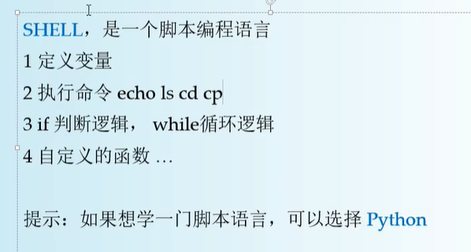
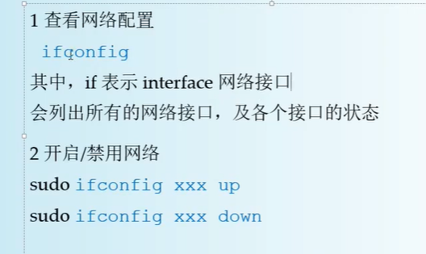
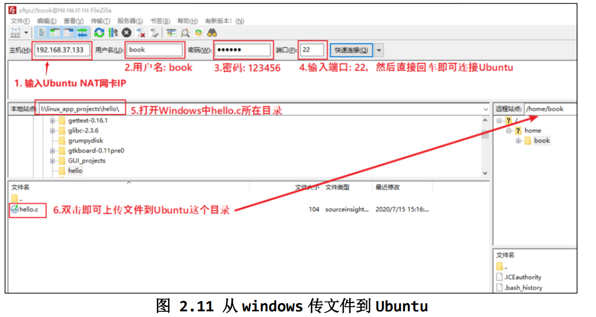
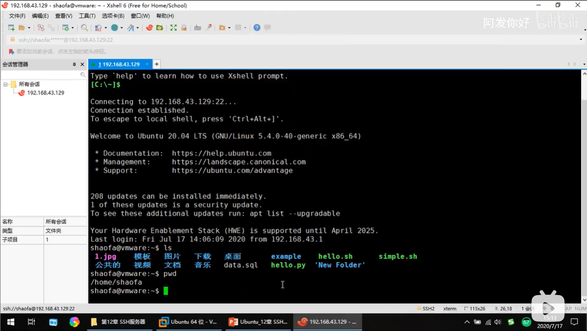
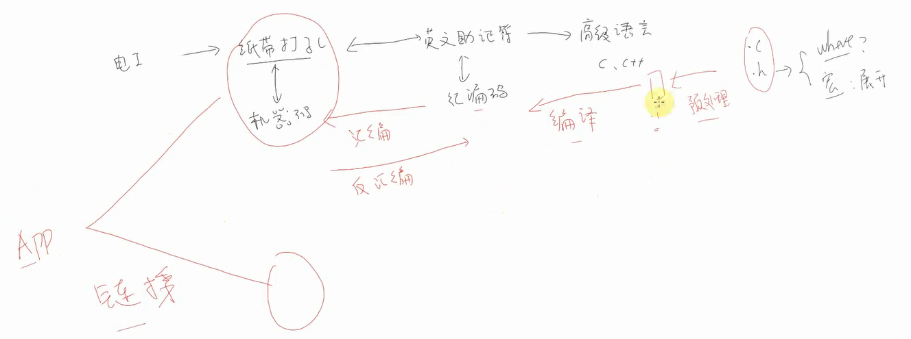

# Linux学习笔记

## 1.ubuntu基础知识

### 1. 快捷键

* 常用

↑ ：复制粘贴上一次命令行

鼠标中键：粘贴

Ctrl-l：清空屏幕，移动光标到左上角。clear 命令完成同样的工作。

history：显示历史列表内容。

Ctrl-c：退出正在运行的程序

自动补全、tab键

感叹号   ！！：执行历史命令

> book@100ask:~/makefile/step3$ ../step4
> bash: ../step4：是一个目录
> book@100ask:~/makefile/step3$ cd !!
> cd ../step4
> book@100ask:~/makefile/step4$ 

Ctrl + U 从光标删除到行首，清空整行

Ctrl + K 从光标删除到行尾，清空整行

Ctrl + w 删除光标前面的一个单词

Ctrl+delete 删除光标后的一个单词C 

ctrl+a //光标迅速回到行首

### 2. Linux 命令行介绍

shell用于接收命令和解析数据和运行程序

\1. shell是什么

\2. 怎么设置PATH

\3. Hello程序示例 

clear ：/命令栏清屏指令

**1. shell是什么**

shell就是一个应用程序，我们可以通过键盘、串口给它发送命令，回车后它就会去执行这些命令。

以“ls -l”命令为例，

① 接收键盘数据并回显

比如：我们使用键盘给shell程序发送字母，它收到后会在屏幕上显示出来

② 解析输入的字符串，寻找程序，执行程序：

当我们使用键盘给shell程序发送回车时，它就知道字符输入结束了

a. shell会解析字符串，这些字符串用空格分为好几部分

b. shell会去寻找该程序，去哪里找？去PATH环境变量所指示的位置找。

  你当然也可以指定绝对、相对路径，shell就会直接去这些路径找到程序

c. 找到程序后，会启动该程序，并传入参数 

**2. 怎么设置PATH**

以在PATH中添加/home/book目录为例：

2.1 永久设置之方法1，这对所有用户都有效：

修改/etc/environment，比如：sudo gedit /etc/environment ，然后添加下行加粗部分：

PATH="/usr/local/sbin:/usr/local/bin:/usr/sbin:/usr/bin:/sbin:/bin:/usr/games:/usr/local/games**:/home/book**" 

然后重启系统或重新登录。 ：

2.2 永久设置之方法2，只对当前用户有效：

命令窗口输入 gedit ~/.bashrc                 //修改~/.bashrc

在行尾添加或修改：

export PATH=$PATH:/home/book 

然后重启系统或重新登录。 


2.3 临时设置：

在终端执行以下命令，这只对当前终端有效：

export PATH=$PATH:/home/book   //将环境变量临时输出至家目录

//输出 路径=之前的路径：家目录

**3. Hello程序示例**

```shell
book@100ask:~$ for((i=0;i<10;i++));do hello $i;done  //shell输入
```

```
//输出
Hello, 0!
Hello, 1!
Hello, 2!
Hello, 3!
Hello, 4!
Hello, 5!
Hello, 6!
Hello, 7!
Hello, 8!
Hello, 9!
```


提示符：book@100ask：~$   /* book是当前用户名，@100ask是主机名,如user@pc*/

用户名标志着当前登录用户在当前计算机中的角色；主机名标志着当前计算机在当前网络中的角色。在Linux中，root表示当前登录的用户，@可以理解为是一个分隔符号，~表示家目录，

```
root@100ask:/home/book#
```

表示当前登录用户的身份是root超级用户

~$  表示在家目录下操作

~$ cd /    表示进入根目录

/$ cd ~    表示进入家目录

cd - 			//切换到上一次路径

cd ..    		//切换到上一层目录

家目录（/home/book,~)

```
book@100ask:~$ cd ./De          //按下tab键，自动补全代码进入桌面路径
book@100ask:~$ cd ./Desktop/
```

Linux 下的根目录为“/”，从根目录下出发可以找到任意目录、任意文件。

 从根目录开始表示目录或文件的方法称为“绝对路径”。比如：

```
/home/book
/home/book/1.txt
/bin/pwd
```

有时候使用绝对路径太过麻烦，可以使用相对路径。假设当前正位于/home/book 目录下，那么：

```
./1.txt 表示当前目录下的 1.txt，即 /home/book/1.txt；“.”表示当前目录
../book/1.txt 表示当前目录的上一级目录里，book 子目录下的 1.txt
“/home/book/..”就是“/home”目录，“..”表示上一级目录
```

刚点开的命令窗口中的 book@100aks:~$中的表示正处于家目录


### 3. 目录/文件操作命令

* 常用文件夹

Bin：全称binary，含义是二进制。该目录中存储的都是一些二进制文件，文件都是可以被运行
的。

Dev：该目录中主要存放的是外接设备，例如盘、其他的光盘等。在其中的外接设备是不能直接被
使用的，需要挂载（类似window下的分配盘符）。

Home：表示“家”，表示除了root用户以外其他用户的家目录，类似于windows下的User/用户目
录。


Root：该目录是root用户自己的家目录。

Sbin：全称super binary，该目录也是存储一些可以被执行的二进制文件，但是必须得有super权
限的用户才能执行。

Usr：存放的是用户自己安装的软件。类似于windows下的program files。

Var：存放的程序/系统的日志文件的目录。

Mnt：当外接设备需要挂载的时候，就需要挂载到mnt目录下。

**命令:**pwd 

**英文来源:**print working directory

**功能:**打印当前所在路径

**命令格式：**

| 命令 | 选项 | 参数 |
| ---- | ---- | ---- |
| pwd  | \    | \    |

**命令:**cd 

**英文来源:**change directory

**功能:**改变路径，切换路径

**命令格式：**

| 命令 | 选项 | 参数   |
| ---- | ---- | ------ |
| cd   | \    | [目录] |

[]中括号表示可有可无

```
cd 命令有些缩略用法：
$ cd - // 进入上次目录, 比如先进入 a 目录再进入 b 目录，执行此命令后即回到 a 目录
$ cd ~ // 进入家目录
```

**命令:**mkdir

**英文来源:**make directory

**功能:**创建目录

**命令格式：**

| 命令  | 选项 | 参数   |
| ----- | ---- | ------ |
| mkdir | -p   | [目录] |

-p表示parents，父母生小孩，确保目录名称存在，不存在的就建一个。


**命令:**rmdir//不常用，直接用 rm -rf  [目录or文件]

**英文来源:**remove directory

**功能:**移除目录

**命令格式：**

| 命令  | 选项 | 参数   |
| ----- | ---- | ------ |
| rmdir | \    | [目录] |


**命令:**ls

**英文来源:**list

**功能:**列出目录内容

**命令格式：**

| 命令 | 选项                        | 参数   |
| ---- | --------------------------- | ------ |
| ls   | -l     -a     -la     -h -d | [目录] |

-l:long,显示文件更完整信息；-a:all,显示当前目录下文件及隐藏文件

-la:-l与-a的组合选项，显示所有文件及完整信息

-h:表示human readable,文件大小用K/M/G等可读方式列出来，三个命令可叠加使用

 -d, --directory            list directories(目录) themselves, not their contents（内容）;只显示目录本身的信息，而不显示目录里面的内容

```
ls --help//查看ls命令详细用法
```

**命令:**cp

**英文来源:**copy

**功能:**复制目录

**命令格式：**

| 命令 | 选项 | 参数                      |
| ---- | ---- | ------------------------- |
| cp   | -rfd | [源文件]       [目标文件] |

- `-r` 或 `--recursive`：用于复制目录及其所有的子目录和文件，如果要复制目录，需要使用该选项。如果目标文件中有文件，不会被覆盖。

- `-f` 或 `--force`：强制复制，即使目标文件已存在也会覆盖，而且不给出提示。

- -d：复制时保留链接。这里所说的链接相当于 Windows 系统中的快捷方式。


**命令:**rm

**英文来源:**remove

**功能:**删除文件及目录

**命令格式：**

| 命令 | 选项      | 参数             |
| ---- | --------- | ---------------- |
| rm   | -r     -f | 文件  或  文件夹 |

删除目录时，常用如下命令：

```
$ rm -rf dir_a //常用
```

⚫ r：recursive，递归地，即删除所有文件

⚫ f：force，强制删除


```
book@100ask:~/abc/123$ echo abc > 1.txt  //创建文本，文本内容abc
clear  //清除命令窗口内容
```

```
book@100ask:~/abc$ mv 1.txt 2.txt  	//mv移动即改名，将1.txt改为2.txt
book@100ask:~/abc$ mv 2.txt ../		//将2.txt移动到上一级目录
book@100ask:~/abc$ mv ../2.txt .	//上一级目录中的2.txt移动到此目录（abc）
```


**命令:**cat

**英文来源:**concatenate(连接)

**功能:**连接文件并打印

**命令格式：**

| 命令 | 选项 | 参数 |
| ---- | ---- | ---- |
| cat  | \    | 文件 |

```
book@100ask:~/abc$ cat 2.txt  //输出文本中的内容,显示abc
book@100ask:~/abc$ cat '1 (copy).txt' 2.txt //输出 abc   abc
```

```
book@100ask:~/abc$ touch 2.txt  //touch摸一下2.txt,改变修改时间
```

### 4. 改变文件的权限和属性


连接数：表示有多少文件名连接到此节点。

如果文件名之前多了一个“.”,则说明这个文件为“隐藏文件”

第1个字符表示“文件类型”，它是目录、文件或链接文件等

第1个字符表示意思：d 目录； - 常规文件 ；l 链接文件； b 设备文件里的可供存储的接口设备 ；c 设备文件里的串行端口设备，如鼠标、键盘等。

后9个字符3个3个一组，共3组，第一组表示“文件所有者的权限”； 第二组表示“用户组的权限”；第三组表示“其他用户的权限”。

每组都是 rwx 的组合，其中 r 代表可读，w 代表可写，x 代表可执行；如果没有对应的权 限，就会出现减号（-）。

比如“drwxrwxr-x”表示：1.此文件是一个目录，2.文件所有者有读写执行权限，3.同一个用户组的其他用户有读写执行权限，4.其他用户有读执行权限，无写权限。


* **chmod修改文件访问权限**

```用二进制数加权限
book@100ask:~$ ls -l hello						//查看hello文件信息       
-rwxr-xr-x 1 book book 8344 May 25 02:33 hello		//hello 文件信息		
book@100ask:~$ chmod 675 hello			//chmod修改文件访问权限
```

675含义：每位数字用于表示三种用户的权限；6=4+2+0：二进制110；7=4+2+1：二进制111；5=4+0+1：101。

用户权限：所有者：rw-；用户组：rwx；其他用户：r-x。//rwx分别表示 读 写 操作 权限

```用二进制数加权限
book@100ask:~$ ls -l hello
-rw-rwxr-x 1 book book 8344 May 25 02:33 hello	//修改后，所有者不能操作文件
book@100ask:~$ ./hello			//所有者操作文件
bash: ./hello: Permission denied	//权限被拒绝
book@100ask:~$ sudo ./hello		//其他用户（book）操作文件						
[sudo] password for book: 		//输入密码
Hello, world!				//操作成功
```

```用+-符号加权限
book@100ask:~$ ls -l hello
-rwxrwxr-x 1 book book 8344 May 25 02:33 hello

book@100ask:~$ chmod -x hello			//-x,所有用户去除x操作权限
book@100ask:~$ ls -l hello
-rw-rw-r-- 1 book book 8344 May 25 02:33 hello

book@100ask:~$ chmod +x hello			//+x,所有用户加上x操作权限
book@100ask:~$ ls -l hello
-rwxrwxr-x 1 book book 8344 May 25 02:33 hello

```

使用 a 、u、g、o字母代表 all、user、group、others 身份。

```符号类型改变文件权限
chmod u=rwx,go=rx hello // hello文件拥有者权限rwx，用户组和其他用户权限rx

chmod a+w hello	//也可以增加或去除某种权限，“+”表示添加权限，“-”表示去除权限：

chmod a-x hello
```

```数字类型改变权限
chmod [-R] xyz 文件或目录
// xyz：代表权限的数值，如 770
// -R：以递归方式进行修改，比如修改某个目录下所有文件的属性。
chmod 777 hello //范例
```

* 把hello程序放入path中，方便运行

```
book@100ask:~$ ls -ld /bin		//查看bin目录信息
drwxr-xr-x 2 root root 4096 May 24 05:46 /bin	//只对root用户可读写操作，对于其他用户不可写

book@100ask:~$ cp hello /bin		//验证book用户是否对bin目录有写权限，尝试写入hello文件
cp: cannot create regular file '/bin/hello': Permission denied  //发现权限不够

book@100ask:~$ sudo cp hello /bin		//用sudo升级为root用户进行写操作
[sudo] password for book: 				//输入密码123456
book@100ask:~$ /bin/hello				//成功写入，并运行下看看
Hello, world!							//运行成功
book@100ask:~$ echo $PATH				//查看shell访问路径
/usr/local/sbin:/usr/local/bin:/usr/sbin:/usr/bin:/sbin:/bin:/usr/games:/usr/local/games:/snap/bin:/home/book	   // /bin在shell的访问路径里面，所以可以直接在book用户的任意目录中运行hello程序了，即使没有也能运行
book@100ask:~$ hello
Hello, world!	
```

* chown:改变文件所有者和用户组

* sudo：临时把book用户切换为boot用户，升级权限

  ```文件所有者和用户组改为root
  book@100ask:~$ ls -l hello
  -rwxrwxr-x 1 book book 8344 May 25 02:33 hello		//hello文件所有者和用户组均为root
  book@100ask:~$ chown root:root hello				//尝试用chown命令改变所有者和组
  chown: changing ownership of 'hello': Operation not permitted	//权限不够，普通用户不能改root超级用户
  book@100ask:~$ sudo chown root:root hello			//用root用户改所有者
  [sudo] password for book: 							//密码
  book@100ask:~$ ls -l hello
  -rwxrwxr-x 1 root root 8344 May 25 02:33 hello		//成功
  ```

  * 默认不能使用 root 用户登录 在开发过程中很少用 root 用户,容易破坏系统

    要使用 root 权限时可以在命令前加上 “sudo”，比如“sudo ps -a”。 

    如果你就是喜欢用 root 用户，可以按下图操作，先给 root 用户设置密码， 以后就可以用 root 用户登录了：


* su : swish user    
* sudo : super do     //临时切换超级用户，提升权限操作

```
book@100ask:~$ su root			//切换root用户
Password: 						//密码 123456
root@100ask:/home/book# su book	 //在root用户下操作，切换回book
book@100ask:~$ 					//在book用户下操作
```


### 5. 查找/搜索，压缩/解压缩，软链接

* **find**查找文件 命令格式为：

  ```
  find [目录名] 选项 查找条件
  $ find /home/book/dira/ -name " test1.txt " 
  ```

  ⚫ /home/book/dira/指明了查找的路径。 

  ⚫ “-name”表明以名字来查找文件 。 

  ⚫ “test1.txt”，就指明查找名为“test1.txt”的文件。

如果没有指定查找目录，则为当前目录。

find 还有一些高级的用法，如查找最近几天(几个小时)之内(之前)有变动的文 件

```
$ find /home/book -mtime -2 //查找/home 目录下两天内有变动的文件。
```

* “*”通配符用于模糊查找

  ```
  book@100ask:~/abc$ find -name 2.txt  //abc目录下查找
  ./2.txt 
  
  book@100ask:~/abc$ cp 2.txt 12.txt   
  book@100ask:~/abc$ find -name "*2.txt"  //用*通配符查找后面为“2.txt”的文件
  ./2.txt
  ./12.txt
  
  book@100ask:~/abc$ cp 2.txt 22.txt1
  book@100ask:~/abc$ find -name "*2.txt*" //用*通配符查找中间为“2.txt”的文件
  ./2.txt
  ./22.txt1
  ./12.txt
  ```

  * grep 查找字符串，使用内容查找文件，主要用于查找源码

    ```
    grep [选项] [查找模式] [文件名]
    ```

    ```shell
    //查找abc,显示行号，在2.txt文机中查找
    book@100ask:~/abc$ grep "abc" -n 2.txt 
    1:abc
    
    //*表示查找当前目录下的所有文件和目录，不包含子目录
    book@100ask:~/abc$ grep "abc" *  
    12.txt:abc
    12.txt:456abc
    1 (copy).txt:abc
    22.txt1:abc
    22.txt1:456abc
    2.txt:abc
    
    //-n表示显示行号
    book@100ask:~/abc$ grep "abc" * -n
    12.txt:1:abc
    12.txt:2:456abc
    1 (copy).txt:1:abc
    22.txt1:1:abc
    22.txt1:4:456abc
    2.txt:1:abc
    
    //w显示不多不少的abc字符串（全字匹配）
    book@100ask:~/abc$ grep "abc" * -nw
    12.txt:1:abc
    1 (copy).txt:1:abc
    22.txt1:1:abc
    2.txt:1:abc
    
    //r表示迭代查询所有文件，包含子目录
    book@100ask:~/abc$ grep "abc" * -nwr
    12.txt:1:abc
    1 (copy).txt:1:abc
    22.txt1:1:abc
    2.txt:1:abc
    dir1/1 (copy).txt:1:abc
    dir1/dir2/1 (copy).txt:1:abc
    ```
```
    
    ```shell
    grep "abc" * -nwr [文件名]                     //常用命令
```

​    

#### 6. 压缩/解压缩命令

* 归档

  tar,即tape archive（磁带档案）档案打包

  创建档案包

  tar -cvf example.tar example //example.tar为压缩包名字，example为准备压缩的文件

  其中，c表示create创建档案；v表示verbose（冗长的）显示详情；f表示file

  也可以多个目录打包 tar -cvf xxx.tar **file1 file2 file3**

* 解归档

  tar -xvf example.tar

  tar -xvf example.tar -C outdir

  其中，-C参数指定目标目录(change)，默认解压到当前目录下

* 归档并压缩

  先前的 tar格式并没有压缩，体积较大

  tar -c[**z**]()vf example.tar[**.gz**]() example

  解压缩

  tar -x[z]()vf example.tar[.gz]()

  tar -x[z]()vf example.tar[.gz]() -C outdir

  通常压缩文件格式为   ***.tar.gz**   格式

#### 5.5命令行：软链接


软链接，即Windows 下的“快捷方式”

 使用 ln 命令（link） 来创建软链接

ln -s source link

其中，-s表示soft 软链接（默认为硬）、

比如

ln -s example example2

软链接的特点：

1.删除软链接，对原文件没有影响

2.删除原文件，则软链接失效

```
book@100ask:~/soft/firefox$ ln -s ~/soft/firefox/firefox  ~/桌面/
```

以 ls -l 查看文件详情时，可以看到文件路径

```
lrwxrwxrwx 1 book book       7 May 26 00:55 example2 -> example   //第一个字母为l,文件名有箭头，表示软链接
```

### 6. 用户

#### 6.1用户管理

* 添加用户

sudo useradd -m test1  //-m参数 表示在 /home 下添加用户目录

* 修改密码

  sudo passwd test1

* 删除用户

  sudo userdel test1

  sudo rm -rf /home/test1  // 删除用户目录

其中，sudo 表示以管理员身份执行//super user


* 要点与细节

  1.登录系统时，默认不允许以root用户登录

  2.只有特殊用户，才能执行 sudo,比如book，但test1不行

  linux 下，把能执行sudo命令的用户叫 sudoer

#### 6.2超级用户

超级用户root，类似windows下的Admininter用户

切换到root用户，有全部权限，可以直接使用useradd等命令

1.首次使用时，需要给root设置密码

   sudo passwd root

2.切换root 用户

   su root   //switch user

3.退出

   exit

* 要点与细节

  1.su root 只对当前会话（终端）有效，不会影响当前桌面环境

  2.root权力太大，需要小心使用

#### 6.3用户和组

linux 下可以创建多个用户 ，可以用组进行管理用户

比如

> 男孩组  boys
>
> ming bo gang qiang
>
> 女孩组 girls
>
> fang hong yue yuan 

* 创建组

groupadd boys

* 创建用户

useradd -m -g boys ming   //-m 表示在 /home 下添加用户目录；-g表示在添加用户进入用户组（group）

* 修改现有用户到新的组

usermod -g boys book  //mod(modify,更改修饰),book用户转移到boys组

+  查看用户和组

cat  /etc/group   //每一行表示一个group的信息，名称+ID

cat   /etc/passwd   //查看用户列表，每一行表示一个用户的信息

* 要点与细节

用户不多时，管理用户不适用组的概念，创建用户时，默认创建同名用户组；比如，book用户属于book组

#### 6.4以root登录桌面

一、默认的，Ubuntu不允许以root登录桌面环境(root 已经设置了密码)

二、修改配置
按以下步骤，执行
1

```
Su root
```

在终端里切换到root用户

2

```
gedit /etc/pam.d/gdm-autologin   
```

   //linux系统配置文件在/etc下面；**gedit命令：图像的文本编辑器**
在这一行前面加一个# , 表示注释此行

```
auth	required	pam_succeed_if.so user != root quiet_success
```

关闭并保存

3

```
gedit  /etc/pam.d/gdm-password
```

在这一行前面加一一个#
auth	required	pam_succeed_if.so user != root quiet_success

关闭并保存.

三、以root登录桌面

重启，点击下面的not listed,输入用户名root,密码123456

### 7. shell与环境变量

#### 8.1可执行脚本

反斜杠（\）：是反斜杠后面的一个变量变为单纯的字符串

脚本 Script,一种解释执行的程序，本质是一个文本文件，具有可执行性

c语言文本需要先编译成一个程序才能执行

而脚本文件可以直接执行

linux 下常见的三种脚本程序

-Shell 脚本 *.sh

-Perl 脚本 *.pl

-Python 脚本 *.py


#### 8.3 Shell脚本


```
#!/bin/sh		//执行sh脚本的程序在bin中，创建sh脚本；第一行必须声明解释器
echo "hello.world" 	//echo：打印

 /bin/sh hello.sh		//用解释器执行
```


#### 9.1 Shell中的变量




```shell
#!/bin/sh		//创建sh脚本
OUTDIR=/opt		//定义变量，OUTDIR是字符串/opt（也是一个路径）	
echo "output to : ${OUTDIR}" //打印句子，${OUTDIR}表示引用OUTDIR的值
ls ${OUTDIR}	//列出OUTDIR的值，即/opt
```


#### 9.2 环境变量


```shell
export OUTDIR=/opt   //export导出，OUTDIR环境变量名字，他的值是一个路径
echo $OUTDIR         //显示OUTDIR的值
```


环境变量相当于全局概念，可以在终端里直接调用


#### 9.3用户环境变量

即只对当前用户有效的环境变量


.profile 是一个shell脚本，用于定义环境变量


gedit 是文本编辑器，打开.profile


```
文末添加  export JAVA_HOME=/opt/jdk1.8  //定义java环境变量
```


#### 9.4系统环境变量


自建一个profile.d文件，/etc/profile 文件会嵌套调用它

```
root@100ask:/home/book# gedit /etc/profile.d/myprofile.sh

```


```
#!/bin/sh		//创建sh脚本
export TOMCAT=/opt/tomcat	//定义变量，TOMCAT是字符串/opt/tomcat（也是一个路径）
```

#### 9.5 PATH环境变量


bin 普通用户可执行程序

修改全局路径：


```
book@100ask:~$ su root
Password: 
root@100ask:/home/book# gedit /etc/profile.d/myprofile.sh
```

```
#!/bin/sh		

export TOMCAT=/opt/tomcat //定义路径

export PATH=$PATH:/home/book //路径=取出路径值+/home/book
```

### 8.网络

速度最佳服务器：


#### 10.1 Vmare网络环境


#### 10.2虚拟机联网


#### 10.3与宿主机互联


43不一定是这个值

```win+r  ->cmd
C:\Users\ASUS>ipconfig
```


电脑访问虚拟机：


虚拟机访问电脑


#### 10.4 手动配置网络





### 9.win与linux的文件传输，vim命令

#### 11 FTP服务器




主机：192.168.233.129

左边windows文件，右边linux文件，用拖拽形式互传文件

#### 12 SSH服务器




xshell 远程操作linux系统，在没有ubuntu的时候用

xftp


#### 13.1 文本编辑  vim


vim可以远程查看文本，gedit只能在ubuntu上看，不能远程查看，但gedit效率更高

打开vim并操作命令：

```
book@100ask:~$ vim abc.txt
```


上面是内容区，下面是命令区和状态区

```
set nu //显示行号
```


#### 13.3 文本文件的上传


### 10. 软件安装、卸载与更新，git命令

apt 工具的使用 本书使用的 Linux 发行版是 Ubuntu，对应的包管理工具就是 apt 工具，apt 包管理工具包含了如 下内容： • apt-get 工具：主要负责软件包的的安装、卸载以及更新等事务。 • apt-cache 工具：用于查询软件包的相关信息。 • apt-config 工具：用于配置所有 apt 工具。

* 安装软件

```
apt-get install 软件包名
```

apt-get install 会扫描本地存放的软件包更新列表/var/lib/apt/lists/，找到最新版本的软件包，然后检 查软件包依赖关系，找到支持该软件正常运行的所有软件包，并从镜像源地址中下载所需的软件包，最后解压软件包，自动完成应用程序的安装和配置。

* 卸载软件 最好别用autoremove  会删掉ros

```
apt-get remove 软件包名
```

* 软件更新

```
sudo apt-get update		#获取更新软件信息
sudo apt-get upgrade	#更新软件
```

* 查询软件包信息

```
apt-cache show 软件包名
```


git文件下载：

```
git clone 仓库地址
```

#### 安装gedit

```
sudo apt-get update
sudo apt install gedit-gmate
sudo apt install gedit-plugins
sudo apt-get remove gedit
sudo apt install gedit
```

#### 安装软件分布目录

    /usr：这是Ubuntu中规模非常庞大的文件夹，里面包含了各个应用程序的文件，相当于Windows的"Program Files"文件夹。/usr下有几个重要的子文件夹，如：
        /usr/bin：应用程序的可执行文件部分，相当于Windows的*.exe文件。
        /usr/share：各种程序间的共享文件，如字体、图标、文档等。
        /usr/local：用户的程序目录，用户自己编译的软件默认会安装到这个目录下。
    
    `/opt`
    
    ：这个目录专门用于安装一些大型的第三方软件，可以理解为Windows中的D盘中自定义的安装目录。
    
    /home/username/bin：用户自己编译的程序通常会被存储在这个目录下。
    
    `/var/cache/apt/archives
    
    `：这是下载的软件存放位置。
    
    /etc：里面绝大部分都是文本文件，用于设置系统的，作用相当于Windows的注册表。其中有一个/etc/shadow文件里面保存着用户的登录密码。
    
    `/lib`
    
    和 /usr/lib：系统核心的动态模块和连接库文件，各种可动态加载的硬件驱动程序。
    
    /tmp：各用户程序产生的临时文件的存放场所，临时文件会被自动清除掉。
    
    /mnt：外接文件系统的挂载点，u盘、cdrom、windows分区都应挂到这里面。

如果你不确定一个程序的安装位置，可以尝试在终端中使用which命令来查找程序的位置。例如，如果你想查找Python的安装位置，可以在终端中输入which python，这将会返回Python安装的路径。


## 2.Linux应用开发

### 1.编译原理




### 2.GCC编译过程

* 基本语法			 GCC 使用的命令语法如下：

 gcc [选项] 输入的文件名

 常用选项：

 • -o：小写字母“o”，指定生成的可执行文件的名字，不指定的话生成的可执行文件名为 a.out。

 • -E：只进行预处理，既不编译，也不汇编。

 • -S：只编译，不汇编。

 • -c：编译并汇编，但不进行链接。

• -g：生成的可执行文件带调试信息，方便使用 gdb 进行调试。

 • -Ox：大写字母“O”加数字，设置程序的优化等级，如“-O0”“-O1”“-O2”“-O3”，数字 越大代码的优化等级越高，编译出来的程序一般会越小，但有可能会导致程序不正常运行。

```
1 # 直接编译成可执行文件
2 gcc hello.c -o hello
3
4 # 以上命令等价于执行以下全部操作
5 # 预处理，可理解为把头文件的代码汇总成 C 代码，把 *.c 转换得到 *.i 文件
6 gcc –E hello.c –o hello.i
7
8 # 编译，可理解为把 C 代码转换为汇编代码，把 *.i 转换得到 *.s 文件
9 gcc –S hello.i –o hello.s
10
11 # 汇编，可理解为把汇编代码转换为机器码，把 *.s 转换得到 *.o，即目标文件
12 gcc –c hello.s –o hello.o
13
14 # 链接，把不同文件之间的调用关系链接起来，把一个或多个 *.o 转换成最终的可执行文件
15 gcc hello.o –o hello
```

\1. ==预处理==，在预处理过程中，对源代码文件中的文件包含 (include)、预编译语句 (如宏定义define 等) 进行展开，生成.i 文件。可理解为==把头文件的代码、宏之类的内容转换成更纯粹 的 C 代码==，不过生成的文件以.i 为后缀。

\2. 编译，把预处理后的.i 文件通过编译成为汇编语言，生成.s 文件，即把代码从 C 语言转换 成汇编语言，这是 GCC 编译器完成的工作。

\3. 汇编，将汇编语言文件经过汇编，生成目标文件.o 文件，每一个源文件都对应一个目标文 件。即把汇编语言的代码转换成机器码，这是 as 汇编器完成的工作。

\4. 链接，最后将每个源文件对应的.o 文件链接起来，就生成一个可执行程序文件，这是链接 器 ld 完成的工作。


* 预处理阶段

把原 C 代码中包含的头文件中引用的内容汇总到一处。如果 原 C 代码有宏定义，还可以更直观地看到它把宏定义展开成具体的内容（如宏定义代表的数字）。

* 编译阶段

GCC 会检查各个源文件的语法，即使我们调用了一个没有定义的函数，也不会报错。汇编语言是跟平台相关的，由于本示例的 GCC 目标平台是 x86，所以此处生成的汇编文件是 x86 的汇编代码。

* 汇编阶段

计算机只认识 0 或者 1，不懂得 C 语言，也不懂得汇编语言，经过编译汇编之后，生成的目标文件包含着机器代码，这部分代码就可以直接被计算机执行。.o 是为了让计算机阅读的二进制文件，所以不像前面生成的.i 和 *.s 文件直接使用字符串来记录，普通记事本无查看。

可以使用“readelf”工具来查看它们的内容。

```
readelf -a hello.o
```


包含 ELF 头、程序头、节等内容，编译器在链接阶段利用这些信息把多个.o文件组织起来，对于可执行文件， 系统在运行时根据这些信息加载程序运行。

* 链接阶段

将汇编过程生成的所有目标文件进行链接，生成可执行文件(.exe)。

例如一个工程里包含了 A 和 B 两个代码文件，编译后生成了各自的 A.o 和 B.o 目标文件，如果 在代码 A 中调用了 B 中的某个函数 fun，那么在 A 的代码中只要包含了 fun 的函数声明，编译就 会通过，而不管 B 中是否真的定义了 fun 函数（当然，如果A中函数声明都没有，编译也会报错）。

> 函数定义和声明的区别：
>
> 定义是指对函数功能的确立，包括指定函数名、函数类型、形参及其类型、函数体等，它是一个完整的、独立的函数单位。
>
> 
>
> 声明的作用则是把函数的名字、函数类型以及形参的个数、类型和顺序(注意，不包括函数体)通知编译系统，以便在对包含函数调用的语句进行编译时，据此对其进行对照检查（例如函数名是否正确，实参与形参的类型和个数是否一致）。
>
> 

 A.o 和 B.o 目标文件在编译阶段是独立的，而在链接阶段，链接过程需要把 A 和 B 之间 的函数调用关系理顺，也就是说要告诉 A 在哪里能够调用到 fun 函数，建立映射关系，所以称之 为链接。若链接过程中找不到 fun 函数的具体定义，则会链接报错。

虽然本示例只有一个 hello.c 文件，但它调用了 C 标准代码库的 printf 函数，所以链接器会把它和 printf 函数链接起来，生成最终的可执行文件。

* 链接分为两种：

   • ==动态链接==，GCC 编译时的默认选项。动态是指在应用程序运行时才去加载外部的代码库，例如 printf 函数的 C 标准代码库 *.so 文件存储在 Linux 系统的某个位置，hello 程序执行时调用库文件 *.so 中的内容，==不同的程序可以共用代码库==。所以动态链接生成的==程序比较小==， 占用较少的内存。

  •==静态链接==，链接时使用选项“--static”，它在编译阶段就会把==所有用到的库打包==到自己的可执行程序中。所以静态链接的优点是具==有较好的兼容性==，不依赖外部环境，但是生成的==程序比较大==。

```shell
book@100ask:~/workdir/example/hello_c$ gcc hello.c -o hello
book@100ask:~/workdir/example/hello_c$ gcc hello.c -o hello_static --static
book@100ask:~/workdir/example/hello_c$ ls -lh
总用量 872K
-rwxrwxr-x 1 book book 8.2K 5月  29 15:24 hello	
//动态链接生成的 hello 程序才 8.2KB
-rwxrwxr-x 1 book book 826K 5月  29 15:24 hello_static	
//静态链接生成的 hello_static 程序则高达 825KB

```

在 Ubuntu 下，可以使用 ldd 工具查看动态文件的库依赖

```shell
book@100ask:~/workdir/example/hello_c$ ldd hello
	linux-vdso.so.1 (0x00007ffc007a8000)
	libc.so.6 => /lib/x86_64-linux-gnu/libc.so.6 (0x00007fab0accc000)
	/lib64/ld-linux-x86-64.so.2 (0x00007fab0b2bf000)
book@100ask:~/workdir/example/hello_c$ ldd hello_static
	不是动态可执行文件
```

可以看到，动态链接生成的 hello 程序依赖于库文件 linux-vdso.so.1、libc.so.6 以及 ld-linux-x86- 64.so.2，其中的 libc.so.6 就是我们常说的 C 标准代码库，我们的程序中调用了它的 printf 库函数。 

静态链接生成的 hello_static 没有依赖外部库文件。

### 3.ARM-GCC 和ARM的 HelloWorld

* 交叉编译器的使用

• 编译器运行在 X86_64 架构平台上，编译生成 X86_64 架构的可执行程序 

• 编译器运行在 ARM 架构平台上，编译生成 ARM 架构的可执行程序

这种编译器和目标程序都是相同架构的编译过程，被称为 本地编译。

编译器运行在 x86 架构平台上，编译生成 ARM 架构的可执行程序，被称为交叉编译，如单片机交叉编译器Keil

 交叉编译原因：ARM 架构平台资源有限

编译器主要有两种类型：

> • arm-linux-gnueabihf-gcc：名称中的 arm表示编译后的程序在arm上运行，Linux 表示在linux上进行编译， 例如前面的 hello.c 程序。
>
>  • arm-none-eabi-gcc，名称中的 none 表示无操作系统，目标应用程序的运行环境是不带操作 系统的，例如裸机代码、uboot、内核代码本身，（一般不用）。

```shell
#安装交叉编译器
sudo apt install gcc-arm-linux-gnueabihf
# 安装完成后使用如下命令查看版本
arm-linux-gnueabihf-gcc –v
```

```shell
book@100ask:~$ which arm-linux-gnueabihf-gcc	//查看安装位置
/usr/bin/arm-linux-gnueabihf-gcc

book@100ask:~$ cd /usr/bin
book@100ask:/usr/bin$ arm-linux-gnueabihf-gcc -v	//查看版本

Using built-in specs.
COLLECT_GCC=arm-linux-gnueabihf-gcc
COLLECT_LTO_WRAPPER=/usr/lib/gcc-cross/arm-linux-gnueabihf/7/lto-wrapper
Target: arm-linux-gnueabihf					//目标架构		
Configured with: ../src/configure -v --with-pkgversion='Ubuntu/Linaro 7.5.0-3ubuntu1~18.04' --with-bugurl=file:///usr/share/doc/gcc-7/README.Bugs --enable-languages=c,ada,c++,go,d,fortran,objc,obj-c++ --prefix=/usr --with-gcc-major-version-only --program-suffix=-7 --enable-shared --enable-linker-build-id --libexecdir=/usr/lib --without-included-gettext --enable-threads=posix --libdir=/usr/lib --enable-nls --with-sysroot=/ --enable-clocale=gnu --enable-libstdcxx-debug --enable-libstdcxx-time=yes --with-default-libstdcxx-abi=new --enable-gnu-unique-object --disable-libitm --disable-libquadmath --disable-libquadmath-support --enable-plugin --enable-default-pie --with-system-zlib --with-target-system-zlib --enable-multiarch --enable-multilib --disable-sjlj-exceptions --with-arch=armv7-a --with-fpu=vfpv3-d16 --with-float=hard --with-mode=thumb --disable-werror --enable-multilib --enable-checking=release --build=x86_64-linux-gnu --host=x86_64-linux-gnu --target=arm-linux-gnueabihf --program-prefix=arm-linux-gnueabihf- --includedir=/usr/arm-linux-gnueabihf/include
Thread model: posix
gcc version 7.5.0 (Ubuntu/Linaro 7.5.0-3ubuntu1~18.04) 	//版本

```

安装完成后输入“arm-linux-gnueabihf-”，再按两下 TAB 键，终端会提示可用的相关命令，如下图 包含了 ARM-GCC 工具链 Binutils 的各种工具。


交叉编译hello.c命令：

```
arm-linux-gnueabihf-gcc hello.c -o hello
```

```
book@100ask:~/workdir_ARM/example/hello_crosscompile$ arm-linux-gnueabihf-gcc hello.c -o hello
book@100ask:~/workdir_ARM/example/hello_crosscompile$ ./hello
bash: ./hello：无法执行二进制文件: 可执行文件格式错误
#所得文件只能在ARM上执行，x86_64上无法执行
```

可以通过 ==readelf== 工具来==查看具体的程序信息==。 readelf 工具在系统安装 GCC 编译工具链时一起被安装了，我们可以直接使用。

```
book@100ask:~/workdir_ARM/example/hello_crosscompile$ readelf -a hello
```


可看到 hello 程序的系统架构为 ARM 平台，标志中表明了它是 hard-float 类型的 EABI 接口。编译后，可以上传ARM系统运行。

* 编译器的型号

GCC 编译器命名格式：arch [-os] [-(gnu)eabi(hf)] -gcc


arm-linux-==gnu==eabi==hf==-gcc 编译器为例，表示它的目标芯片架构为 ARM，目标操作系 统为 Linux，使用 GNU 的 C 标准库即 glibc，使用嵌入式应用二进制接口（eabi），编译器的浮点 模式为硬浮点 hard-float。而另一种名为 arm-linux-gnueabi- gcc 的编译器与它的差别就在于是否带 “hf”，不带“hf”表示它使用 soft-float 模式。

### 4.Linux 系统下的 Hello World

#### 了解Hello World程序的执行过程有什么用?

1、对开发其他应用程序，有非常好的借鉴意义。

2、对程序的报错有清晰的了解，从而针对性地解决问题。

#### 裸机开发中的HelloWorld程序是怎么执行的?


- 第一步；进行源代码的编写，其中关键的点在于printf函数的实现，它需要依赖单片机的串口驱动程序。
- 第二步: 借助一些集成开发环境进行程序的编译。一键编译，无需学习编译链接相关知识。
- 第三步: 借助烧录工具烧录到具体芯片上。一键烧录，无需学习芯片的flash和各种各样启动方式。
- 第四步: 上电启动开发板，串口输出“Hello World”字符串。


#### Linux系统下的Hello World程序是怎么执行的?


- 第一部分，上面浅绿色外框部分为程序的编译。
- 第二部分，浅黄色外框部分为Linux内核提供的服务。
- 第三部分，橘色外框部分为glibc库提供的服务。
- 第四部分，浅灰色外框部分，为用户程序。

下面针对每个子步骤做进一步的讲解: 

> 1 预处理 hello.c, 主要是处理程序里面的文件包含、处理宏定义、条件编译。
>
> 2 把 c 文件编译成为汇编文件 (.s)，其中进行了词法分析，语法分析，语义分析、生成中间代 码、对代码进行优化等工作。 
>
> 3 把汇编文件 (.s) 编译成可重定位文件 (.o)。 
>
> 4 把可重定位文件 (.o) 链接成为可执行文件，其中链接可分为静态链接和动态链接 
>
> > • 静态链接: 在编译阶段就会把所有用到的库打包到自己的可执行程序中, 其优点是具有较好 的兼容性，不依赖外部环境，但是生成的程序比较大。 
> >
> > • 动态链接: 在应用程序运行时，链接器去加载外部的共享库，并完成共享库和动态编译程序 之间的链接。不同的程序可以共用代码库，节省内存空间。 
>
> 5控制台输入./hello 命令后，Shell 会创建一个新的进程来执行该程序。fork() 函数就是用于创 建一个新的进程的。这里的进程可以先简单理解为程序的容器。
>
> 6 exeve() 函数可以理解为向上一步新建的进程，填充一个可执行程序 (hello)。 
>
> 7 sys_execve() 函数为 linux 系统调用, 被 exeve() 函数调用，这里的系统调用可以理解为是操作 系统系统开放给用户的最底层接口。 
>
> 8 do_exeve() 函数是 sys_execve() 函数的核心。 
>
> 9 load_elf_binary() 函数会去文件系统中读取 hello 程序到内存，然后判断它是否是动态链接的 可执行程序，如果不是，则进一步判断是否是静态链接的文件。 
>
> 10ld-linux-xx.so 是 glibc 库中的动态连接器。如果 hello 程序是动态链接程序，该动态链接器会 去加载共享库，并完成共享库和程序的链接工作，然后准备真正开始执行 hell 程序。 
>
> 11 相反，如果 hello 程序是静态编译的程序，则无需再加载链接共享库，直接开始准备执行 hello 程序。
>
> >  • 第 10 和 11 步分别执行之后. 都会开始执行 hello 程序，_start 是程序的真正入口，而该 符号在 glibc 中。也就是说程序的真正入口在 glibc。 
>
> 12 __libc_start_main() 也是 glibc 中的函数，用于在执行用户程序前进行一些初始化工作。
>
> 13 调用用户程序中的 mian() 函数，开始执行 printf 打印函数。 14. 程序执行完了之后，调用 glibc 库中的 _exit() 函数，来结束当前进程。

对比裸机和 linux 系统下的“Hello World”, 很明显可以看到操作系统为 我们做了大量的工作，甚至为了节省内存空间，还把程序的链接这种非常基础性的工作，交给了 glibc 中的动态连接器来完成。避免静态链接的那种低效的开发方式，这是裸机开发难以做到的。

不懂的地方不用深究，后面自然会慢慢学会

#### gcc处理过程演示


* 预处理

```
book@100ask:~/workdir/hello_c$ gcc -E hello.c -o hello.i  -v
#预处理，-v表示显示详情
```


 /usr/lib/gcc/x86_64-linux-gnu/7/==cc1== -E -quiet -v -imultiarch x86_64-linux-gnu hello.c -o hello.i -mtune=generic -march=x86-64 -fstack-protector-strong -Wformat -Wformat-security	#截取详情中的运行程序发现调用了gcc中的cc1应用程序（c编译器）

> /lib 目录是/library 的缩写，根文件系统上的程序所需的共享库，存放了根文件系统程序运行所需的共享文件。

* 编译

```
book@100ask:~/workdir/hello_c$ gcc -S hello.i -o hello.s  -v
```

 /usr/lib/gcc/x86_64-linux-gnu/7/==cc1== -fpreprocessed hello.i -quiet -dumpbase hello.i -mtune=generic -march=x86-64 -auxbase-strip hello.s -version -o hello.s -fstack-protector-strong -Wformat -Wformat-security	

#截取详情中的运行程序发现调用了gcc中的cc1应用程序（c编译器）

* 汇编

```
book@100ask:~/workdir/hello_c$ gcc -c hello.s -o hello.o  -v
```

 ==as== -v --64 -o hello.o hello.s

#截取详情中的运行程序发现，使用了as应用程序

* 链接

```
book@100ask:~/workdir/hello_c$ gcc hello.o -o hello -v
```

 /usr/lib/gcc/x86_64-linux-gnu/7/==collect2== -plugin /usr/lib/gcc/x86_64-linux-gnu/7/liblto_plugin.so -plugin-opt=/usr/lib/gcc/x86_64-linux-gnu/7/lto-wrapper -plugin-opt=-fresolution=/tmp/cchE5hHs.res -plugin-opt=-pass-through=-lgcc -plugin-opt=-pass-through=-lgcc_s -plugin-opt=-pass-through=-lc -plugin-opt=-pass-through=-lgcc -plugin-opt=-pass-through=-lgcc_s --build-id --eh-frame-hdr -m elf_x86_64 --hash-style=gnu --as-needed ==-dynamic-linker== /lib64/ld-linux-x86-64.so.2 -pie -z now -z relro -o hello /usr/lib/gcc/x86_64-linux-gnu/7/../../../x86_64-linux-gnu/Scrt1.o /usr/lib/gcc/x86_64-linux-gnu/7/../../../x86_64-linux-gnu/crti.o /usr/lib/gcc/x86_64-linux-gnu/7/crtbeginS.o -L/usr/lib/gcc/x86_64-linux-gnu/7 -L/usr/lib/gcc/x86_64-linux-gnu/7/../../../x86_64-linux-gnu -L/usr/lib/gcc/x86_64-linux-gnu/7/../../../../lib -L/lib/x86_64-linux-gnu -L/lib/../lib -L/usr/lib/x86_64-linux-gnu -L/usr/lib/../lib -L/usr/lib/gcc/x86_64-linux-gnu/7/../../.. ==hello.o== -lgcc --push-state --as-needed -lgcc_s --pop-state -lc -lgcc --push-state --as-needed -lgcc_s --pop-state /usr/lib/gcc/x86_64-linux-gnu/7/==crtendS.o== /usr/lib/gcc/x86_64-linux-gnu/7/../../../x86_64-linux-gnu/==crtn.o==

#截取详情中的运行程序发现，使用了collect2应用程序，gcc调用了collect2封装的ld链接器

不仅链接了hello.o ，还链接了crtendS.o，crtn.o可重定义文件，这些文件属于glibc库

-dynamic-linker表示用来动态编译


* 静态编译

```
book@100ask:~/workdir/hello_c$ gcc hello.o -o hello_static -v -static
```

 /usr/lib/gcc/x86_64-linux-gnu/7/==collect2== -plugin /usr/lib/gcc/x86_64-linux-gnu/7/liblto_plugin.so -plugin-opt=/usr/lib/gcc/x86_64-linux-gnu/7/lto-wrapper -plugin-opt=-fresolution=/tmp/cc9O7Pfs.res -plugin-opt=-pass-through=-lgcc -plugin-opt=-pass-through=-lgcc_eh -plugin-opt=-pass-through=-lc --build-id -m elf_x86_64 --hash-style=gnu --as-needed ==-static== -z relro -o hello_static /usr/lib/gcc/x86_64-linux-gnu/7/../../../x86_64-linux-gnu/crt1.o /usr/lib/gcc/x86_64-linux-gnu/7/../../../x86_64-linux-gnu/crti.o /usr/lib/gcc/x86_64-linux-gnu/7/crtbeginT.o -L/usr/lib/gcc/x86_64-linux-gnu/7 -L/usr/lib/gcc/x86_64-linux-gnu/7/../../../x86_64-linux-gnu -L/usr/lib/gcc/x86_64-linux-gnu/7/../../../../lib -L/lib/x86_64-linux-gnu -L/lib/../lib -L/usr/lib/x86_64-linux-gnu -L/usr/lib/../lib -L/usr/lib/gcc/x86_64-linux-gnu/7/../../.. hello.o --start-group -lgcc -lgcc_eh -lc --end-group /usr/lib/gcc/x86_64-linux-gnu/7/crtend.o /usr/lib/gcc/x86_64-linux-gnu/7/../../../x86_64-linux-gnu/crtn.o

#截取详情中的运行程序发现，使用了collect2应用程序，gcc调用了collect2封装的ld链接器

-static表示用来静态编译


* 完整输出

```
book@100ask:~/workdir/hello_c$ gcc hello.c -o hello -v
```

 COLLECT_GCC_OPTIONS  		下一行命令表示程序执行过程

/usr/lib/gcc/x86_64-linux-gnu/7/==cc1== -quiet -v -imultiarch x86_64-linux-gnu hello.c -quiet -dumpbase hello.c -mtune=generic -march=x86-64 -auxbase hello -version -fstack-protector-strong -Wformat -Wformat-security -o /tmp/cccGGN2C.s		#预处理与编译

 ==as== -v --64 -o /tmp/ccyjfEUg.o /tmp/cccGGN2C.s		#汇编

 /usr/lib/gcc/x86_64-linux-gnu/7/==collect2== -plugin /usr/lib/gcc/x86_64-linux-gnu/7/liblto_plugin.so -plugin-opt=/usr/lib/gcc/x86_64-linux-gnu/7/lto-wrapper -plugin-opt=-fresolution=/tmp/ccUMGdNU.res -plugin-opt=-pass-through=-lgcc -plugin-opt=-pass-through=-lgcc_s -plugin-opt=-pass-through=-lc -plugin-opt=-pass-through=-lgcc -plugin-opt=-pass-through=-lgcc_s --build-id --eh-frame-hdr -m elf_x86_64 --hash-style=gnu --as-needed ==-dynamic-linker== /lib64/ld-linux-x86-64.so.2 -pie -z now -z relro -o hello /usr/lib/gcc/x86_64-linux-gnu/7/../../../x86_64-linux-gnu/Scrt1.o /usr/lib/gcc/x86_64-linux-gnu/7/../../../x86_64-linux-gnu/crti.o /usr/lib/gcc/x86_64-linux-gnu/7/crtbeginS.o -L/usr/lib/gcc/x86_64-linux-gnu/7 -L/usr/lib/gcc/x86_64-linux-gnu/7/../../../x86_64-linux-gnu -L/usr/lib/gcc/x86_64-linux-gnu/7/../../../../lib -L/lib/x86_64-linux-gnu -L/lib/../lib -L/usr/lib/x86_64-linux-gnu -L/usr/lib/../lib -L/usr/lib/gcc/x86_64-linux-gnu/7/../../.. /tmp/ccyjfEUg.o -lgcc --push-state --as-needed -lgcc_s --pop-state -lc -lgcc --push-state --as-needed -lgcc_s --pop-state /usr/lib/gcc/x86_64-linux-gnu/7/crtendS.o /usr/lib/gcc/x86_64-linux-gnu/7/../../../x86_64-linux-gnu/crtn.o		#链接

### 5.使用 Makefile 控制编译

#### 5.1 makefile 简介

多文件管理工具

gcc hello.c -o hello

gcc aa.c bb.c cc.c dd.c ...

make工具和Makefile

make工具:找出修改过的文件，根据依赖关系，找出受影响的相关文件，最后按照规则==单独编译==这些文件。

Makefile文件:记录依赖关系和编译规则。


Makefile的本质:无论多么复杂的语法，都是为了更好地解决项目文件之间的依赖关系。


#### 5.2 makefile 三要素

目标、依赖、命令

* 怎么描述三要素的关系？

> 目标：依赖的文件或者是其他目标
>
> <tab>命令1
>
> <tab>命令2
>
> <tab>...

实验演示

```Makefile
book@100ask:~/makefile$ gedit Makefile #创建makefile文件，注意M大写
```

```makefile
targeta: targetb targetc
	echo "targeta"
#echo：打印字符命令
targetb: 
	echo "targetb"

targetc: 
	echo "targetc"
```

```Makefile
book@100ask:~/makefile$ make	
#输入make命令时，执行makefile文件
#先执行targeta，后面按顺序执行targetb:，targetc: 后的命令，
#最后才echo "targeta"

echo "targetb"
targetb
echo "targetc"
targetc
echo "targeta"
targeta
```

```Makefile
book@100ask:~/makefile$ make targetb
echo "targetb"
targetb
book@100ask:~/makefile$ make targetc
echo "targetc"
targetc
#目标可以单独执行
```

```Makefile
book@100ask:~/makefile$ touch targetb   
#更新targetb时间，会生成了新的文件，且文件内容为空
book@100ask:~/makefile$ make targetb
make: “targetb”已是最新
```


输入make targetb命令后，先在当前文件目录中执行targetb文件，而且目标文件没有改动过，输出“targetb”已是最新，而不再执行Makefile中的targetb的命令；

即使目录中有新的targetb文件，如何执行Makefile中targetb的命令？

```Makefile
book@100ask:~/makefile$ gedit Makefile


.PHONY:targetb			
#phony假的，指定targetb为伪目标，make程序不执行目录中的targetb文件
#只执行Makefile中的targetb下的命令

targeta: targetb targetc
	echo "targeta"

targetb: 
	echo "targetb"

targetc: 
	echo "targetc"
```

```Makefile
book@100ask:~/makefile$ make targetb
echo "targetb"
targetb
#加上.PHONY:targetb后的效果	
```

#### 5.4 Makefile的变量、模式匹配

* 变量

> * 系统变量
>
> 
>
> > CC，指代编译器
> >
> > AS，指代汇编器
> >
> > MAKE，指make工具
> >
> > ```
> > make -f Makefile_test   
> > #make工具默认找Makefile，输入-f Makefile_test，寻找并执行-f Makefile_test
> > ```
>
> * 自定义变量
>
> > =，延迟赋值，当A赋值过程全部完成后，再给B赋值
> >
> > 
> >
> > :=, 立即赋值，给A赋完值后，立即给B赋值
> >
> > 
> >
> > ?=,空赋值，变量A为空才给A赋值
> >
> > 
> >
> > +=，追加赋值
> >
> > 
>
> * 自动化变量
>
> > $<:第一个依赖文件
> >
> > 
> >
> > $^：全部的依赖文件
> >
> > 
> >
> > 
> >
> > $@:目标
> >
> > 
> >
> > 


代码模块化：

```c
//main.c
#include <stdio.h>
int main(void)
{
    play();
    stop();
    return 0;
}
```

```c
//mp3.c
#include<stdio.h>
void play(void)
{
    printf("play music!\r\n");
}
void stop(void)
{
    printf("stop music!\r\n");
}
```


clean 不会运行，只运行 mp3 :main.o mp3.o；除非输入命令 make clean

​																	等价于


成功生成mp3可执行文件并执行

* 模式匹配

> %:匹配任意多个非空字符       类似于      shell：*通配符
>
> 
>
> 

匹配888字符串，传递给%，后面传递给@并输出


%.o表示以.o结尾的文件；%.c表示以.c结尾的文件；


* 默认规则

> .o文件默认使用.c文件来进行编译；如何没有.o文件会使用.c文件代替。
>
> ```makefile
> CC=gcc
> TARGET=mp3
> OBJS=main.o mp3.o
> $(TARGET):$(OBJS)
> .PHONY:clean
> clean:
> 		rm mp3 *.o
> ```
>
> ```shell
> book@100ask:~/makefile/part_3$ ls
> main.c  Makefile  mp3.c
> book@100ask:~/makefile/part_3$ make
> gcc    -c -o mp3.o mp3.c
> gcc    -c -o main.o main.c
> main.c: In function ‘main’:
> main.c:5:5: warning: implicit declaration of function ‘play’ [-Wimplicit-function-declaration]
>      play();
>      ^~~~
> main.c:6:5: warning: implicit declaration of function ‘stop’ [-Wimplicit-function-declaration]
>      stop();
>      ^~~~
> gcc   mp3.o main.o   -o mp3
> book@100ask:~/makefile/part_3$ ./mp3
> play music!
> stop music!
> ```
>
> 

#### 5.4Makefile条件分支

条件分支

```
ifeq (var1,var2)		#相等执行，不相等执行else
...
else
...
endif
```

```makefile
ARCH ?= x86							#直接执行make，ARCH=x86，生成适合x86下运行程序
ifeq ($(ARCH),x86)					#执行make ARCH=arm，生成适合arm下运行的程序
		CC = gcc
else
		CC = arm-linux-gnueabihf-gcc
endif
TARGET=mp3
OBJS=main.o mp3.o
$(TARGET):$(OBJS)
	$(cc) $^ -o $@
.PHONY:clean
clean:
		rm mp3 *.o
```


```
ifneq (var1,var2)		#不相等执行，相等执行else
...
else
...
endif
```

#### 5.4常用函数

* **patsubst：模式替换函数**

 $(patsubst 旧模式,新模式,文件)

示例： $(patsubst %.c,%.o,x.c.c bar.c)  把字串“x.c.c bar.c”中以.c 结尾的单词替换成以.o 结尾的字符。

函数的返回结果 是“x.c.o bar.o


* **notdir：取文件名函数**   只取文件，丢弃目录

$(notdir NAMES…) 

示例：  $(notdir src/foo.c hacks)  返回值为：“foo.c hacks”


* **wildcard：获取匹配模式文件名函数**    列出当前目录下所有符合模式“PATTERN”格式的文件名

$(wildcard PATTERN)


* **foreach：循环函数，类似于for 语句**	

$(foreach VAR,LIST,TEXT)

遍历LIST中的单词文本，给VAR赋值，VAR参与TEXT表达式进行运算

案例：输出指定目录下的所有文件


* 改造mp3小项目文件


```makefile
ARCH ?= x86
ifeq ($(ARCH),x86)
		CC=gcc
else
		CC=arm-linux-gnueabihf-gcc
endif
TARGET=mp3
BUILD_DIR=build				#生成目录用于存放生成文件
SRC_DIR=module1 module2		#原目录存放子模块文件夹

SOURCES=$(foreach dir,$(SRC_DIR),$(wildcard $(dir)/*.c))	#存放C语言源文件
OBJS=$(patsubst %.c,$(BUILD_DIR)/%.o,$(notdir $(SOURCES)))	
#把.c后缀替换成.o后缀，生成OBJS=main.o mp3.o
#notdir $(SOURCES)去除c语言源文件

VPATH=$(SRC_DIR)	#指定C语言源文件搜索路径

$(BUILD_DIR)/$(TARGET):$(OBJS) 
#目标名是$(BUILD_DIR)/$(TARGET)，目标是$(OBJS) 
		$(CC) $^ -o $@

$(BUILD_DIR)/%.o:%.c | create_build
		$(CC) -c $< -o $@

.PHONY:clean create_build

clean:
	rm -r $(BUILD_DIR)

create_build:
	mkdir -p $(BUILD_DIR)

```


警告信息表示没有函数声明，需要加头文件声明

#### 5.5解决头文件依赖

1、写一个头文件，并把头文件添加到编译器的头文件路径中。


```c
#ifndef __MP3_H		
#define __MP3_H
//防止头文件重复包含，如果头文件没有被声明，则声明一下，否则不声明

void play();
void stop();

#define song "mylove"	//定义一首歌的名字
#endif		//结束ifndef
```


```c
#include<stdio.h>
#include "mp3.h"		//声明
void play(void)
{
    printf("play music <<%s>>!\r\n",song);	//打印歌曲名字
}
void stop(void)
{
    printf("stop music <<%s>>!\r\n",song);
}
```


```c
#include <stdio.h>
#include "mp3.h"
int main(void)
{
    play();
    stop();
    return 0;
}
```

```makefile
ARCH ?= x86
ifeq ($(ARCH),x86)
		CC=gcc
else
		CC=arm-linux-gnueabihf-gcc
endif
TARGET=mp3
BUILD_DIR=build
SRC_DIR=module1 module2
INC_DIR=include  	#头文件所在文件夹

CFLAGS=$(patsubst %,-I%,$(INC_DIR))		#gcc编译选项
INCLUDES=$(foreach dir,$(INC_DIR),$(wildcard $(patsubst)/*.h))

SOURCES=$(foreach dir,$(SRC_DIR),$(wildcard $(dir)/*.c))
OBJS=$(patsubst %.c,$(BUILD_DIR)/%.o,$(notdir $(SOURCES)))
VPATH=$(SRC_DIR)

$(BUILD_DIR)/$(TARGET):$(OBJS)
		$(CC) $^ -o $@

$(BUILD_DIR)/%.o:%.c $(INCLUDES) | create_build
		$(CC) -c $< -o $@ $(CFLAGS)		#添加gcc 编译选项

.PHONY:clean create_build

clean:
	rm -r $(BUILD_DIR)

create_build:
	mkdir -p $(BUILD_DIR)

```

gcc -I +"头文件"

2、实时检查头文件的更新情况，一旦头文件发生变化，应该要重新编译所有相关文件。

gcc -MM 

### 6.文件操作与系统调用

不想做笔记了，直接看野火的文档吧，下面这些复制粘贴的课件，不是很好懂

#### 6.1 C语言面向对象基础

面向过程：

- 把问题分解成一系列的步骤
- 在函数里面一步步实现步骤
- 根据需求调用函数

面向对象：

- 把构成问题的事务分解成各个对象
- 调用对象里面的方法属性解决问题

面向对象三大特性：

- 封装性：隐藏内部方法的细节
- 继承：复用现有的代码
- 多态：函数指针

#### 6.2 一切皆文件

##### Linux内核

屏蔽硬件区别，把所有的硬件设备抽象成文件，提供统一的接口给用户使用。


##### 虚拟文件系统

抽象层，对文件的访问实际上使对抽象层的访问。

- 抽象对象：封装了底层读写细节，使用c语言的多态来实现具体文件系统系统的接口。

##### 普通文件系统：

- ext4
- fat32
- ubifs

##### 特殊文件系统：

- 进程文件系统：procfs，挂载在/proc，存放进程相关信息，任务管理器。
- 设备文件系统：devfs，挂载在/dev。存放硬件操作接口。

#### 6.3文件描述符和打开模式


##### 系统IO编程---应用层对接系统调用层  

- open
- write
- read
- lseek
- close

伪代码:

int fd;

fd = open(filename,flags,mode);

lseek(fd,offset,whence);

write(fd,buf,write_len);

read(fd,buf,read_len)

close(fd);

###### 文件描述符 fd

特殊的索引

实际上就是进程中file_struct结构体成员fd_array的数组下标

##### 文件打开模式

主模式：

- O_RDONLY:只读模式
- O_WRONLY:只写模式
- O_RDWR:读写，模式

副模式：

- O_CREAT:当文件不存在，需要去创建文件
- O_APPEND:追加模式
- O_DIRECT:直接IO模式
- O_SYNC:同步模式
- O_NOBLOCK:非阻塞模式

##### 进程

每个程序本质上就是一个进程


##### 标准IO编程----应用层对接glibc库 

#### 6.4open_close函数

##### OPEN函数

头文件：

```
#include <sys/types.h>
#include <sys/stat.h>
#include <fcntl.h>
```

函数原型：

- 当文件存在时

  ```
  int open(const char* pathname,int flags)
  ```

- 当文件不存在时

  ```
  int open (const char* pathname,int flags,int perms)
  ```

返回值

成功：文件描述符

失败：-1

##### CLOSE函数

头文件：

```
#include <unistd.h>
```

函数原型：

```
int close(int fd)
```

返回值：

成功：0

失败：-1

#### 6.5lseek函数

##### lseek函数

##### 头文件

```
#include <unistd.h>
```

##### 函数原型

```
ssize_t read(int fd,void *buff,size_t count)
```

##### 返回值

成功：

- count：成功读取全部字节
- 0~count:
  - 剩余文件长度小于count
  - 读取期间被异步信号打断

失败：

- -1，读取错误

##### write函数

##### 头文件

同read函数

##### 函数原型

```
ssize_t write(int fd,void *buff,size_t count)
```

##### 返回值

成功：

- count：成功写入全部字节
- 0~count:
  - 写入期间被异步信号打断

失败：

- -1，读取错误

##### 复制普通文件小实验

1、打开要复制的文件

2、创建新的文件

3、把源文件内容读到缓冲区，把缓冲区内容写入新文件

4、循坏执行第三步，直到读取的字节数量为0，退出循坏。

5、关闭打开的文件

#### 6.6lseek和sync函数

##### lseek函数

##### 功能

设置文件读写位置

##### 头文件

```
#include <unistd.h>
```

##### 函数原型

```
off_t lseek(int fd,off_t offset,int whence)
```

- 若whence为SEEK_SET，基准点为文件开头
- 若whence为SEEK_CUR，基准点为当前位置
- 若whence为SEEK_END，基准点为文件末尾

##### 返回值

成功：文件偏移位置值

失败：-1


##### sync函数

##### 页缓存和回写

应用层———》页缓存区 ————》磁盘

##### 功能

强制把修改过的页缓存区数据写入磁盘

##### 头文件

```
#include <unistd.h>
```

##### 函数原型

```
void sync(void);
```

##### 返回值

无

#### 6.7标准IO函数

C标准库实现了一个IO缓存区

##### 常见标准IO函数

- fopen

- fclose

- fread

- fwrite

- fseek

- fflush

- 

  强制把IO缓存区的数据写入到页缓存区

##### 文件IO五大模式

- 阻塞模式
- 非阻塞模式
- IO多路复用
- 异步IO
- 信号驱动IO