# opencv

## 1.环境配置

### 一、下载opencv：

https://opencv.org/releases/  
我下载的为[opencv4](https://so.csdn.net/so/search?q=opencv4&spm=1001.2101.3001.7020).5.4版本，可以直接下载.zip文件，可以选择其他版本。

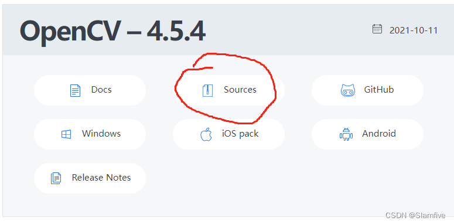  
Sources版本即为.zip版本：

### 二、安装opencv：

Linux默认下载目录为Downloads，在这里用终端打开  
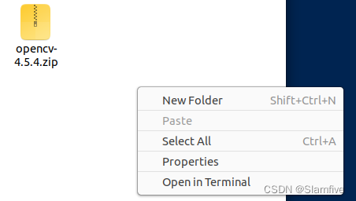

#### 1、解压

输入命令：`unzip opencv-4.5.4.zip`；  
如果报错，安装unzip：`sudo apt-get install unzip`；

#### 2、安装依赖的库：

先更新一下

```c
sudo apt update sudo apt upgrade
```

```c
sudo apt install g++
```

```c
sudo apt install cmake
```

```c
sudo apt install make
```

#### 3、安装opencv依赖项

此处只是选择部分opencv的依赖项，因为opencv的依赖项很多，部分依赖项也不一定用得上。可以参考网上的资料安装自己需要的依赖。

```c
sudo apt-get install build-essential libgtk2.0-dev libgtk-3-dev libavcodec-dev libavformat-dev libjpeg-dev libswscale-dev libtiff5-dev libopenexr-dev libtbb-dev
```

解压完发现opencv是一个cmake工程，里面有CMakeList.txt，因此需要cmake生成Makefile，  
建一个build文件夹并进去：`mkdir build`，`cd build`。

#### 4、使用cmake工具：

```c
cmake -D CMAKE_BUILD_TYPE=Release -D OPENCV_GENERATE_PKGCONFIG=YES ..
```

其中需要添加`OPENCV_GENERATE_PKGCONFIG=YES`进去，否则后面添加路径的时候会报错：  
**“->pkg-config --modversion opencv”时显示“ No package ‘opencv’ found”**  
使用`make`或者`make -j4`，`make -j8` ， `make -12`，来编译，j后面这个数字时调用多线程进行编译，请根据自己的电脑性能选择，否则容易报错。

**“fatal error: Killed signal terminated program cc1plus compilation terminated.”**

#### 5、使用make install来安装。

```c
sudo make install
```

**opencv4的安装路径为**  
后面配置路径会用到：

```c
/usr/local/include/opencv4
```

**库文件的路径为：**

```c
/usr/local/lib
```

### 三、配置OpenCV编译环境

#### 1、添加路径：

**首先将OpenCV的库添加到路径，从而可以让系统找到**  
命令：

```c
sudo gedit /etc/ld.so.conf.d/opencv4.conf
```

执行此命令后打开的可能是一个空白的文件，不用管，只需要在文件末尾添加

```c
/usr/local/lib
```

**注意**，此处如果在`cmake`的时候设置了例如`CMAKE_INSTALL_PREFIX=/usr/local/opencv4` 的其他路径，这部分请根据自己情况改变。

#### 2、使得刚才的配置路径生效：

执行如下命令：

```c
sudo ldconfig
```

#### 3、配置bash：

```c
sudo gedit /etc/bash.bashrc
```

在文件最后添加：

```c
PKG_CONFIG_PATH=$PKG_CONFIG_PATH:/usr/local/lib/pkgconfig export PKG_CONFIG_PATH
```

#### 4、执行如下命令使得刚才的配置生效：

```c
source /etc/bash.bashrc
```

#### 5、更新一下：

```c
sudo updatedb
```

**如果这里报错，需要先安装mlocate**

```c
apt-get install mlocate
```

#### 6、配置完成，检验一下

可以输入`pkg-config --modversion opencv4`来查看opencv的版本，如果输出4.5.4则表明安装成功。  
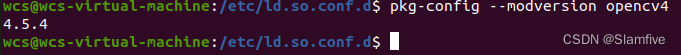

如果像下面这样报错，请检查自己路径配置。实在不行，重新安装，重复以上步骤。  
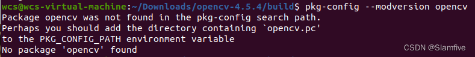

### 四、make过程中可能会出错：

```c
fatal error: Killed signal terminated program cc1plus compilation terminated.
```

**这是因为虚拟机的内存小了，有三个方法解决**

#### 1、直接扩大虚拟机的内存；

直接在虚拟机设置中，增加分配的内存。  
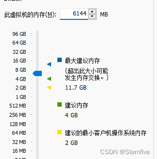

#### 2、增加[swap分区](https://so.csdn.net/so/search?q=swap%E5%88%86%E5%8C%BA&spm=1001.2101.3001.7020)

首先使用`free -m`来查看swap分区大小  
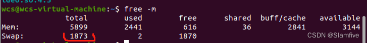

##### （1）创建分区路径

```c
sudo mkdir -p /var/cache/swap/
```

##### （2） 设置分区的大小，bs=64M是块大小，count=64是块数量，所以swap空间大小是bs\*count=4096MB=4GB

```c
sudo dd if=/dev/zero of=/var/cache/swap/swap0 bs=64M count=64
```

##### （3） 设置该目录权限

```c
sudo chmod 0600 /var/cache/swap/swap0
```

##### （4）创建SWAP文件

```c
sudo mkswap /var/cache/swap/swap0
```

##### （5）激活SWAP文件

```c
sudo swapon /var/cache/swap/swap0
```

##### （6） 查看SWAP信息是否正确

```c
sudo swapon -s
```

**此处参考https://blog.csdn.net/weixin\_44796670/article/details/121234446**

#### 3、减少make中进程的数量

**更改以上设置，重新编译就不再会报错。**

### 五、VSCode配置

#### 新建vscode工程，

#### 1、配置 c\_cpp\_properties.json文件

按下\*\*“ctrl+shift+p”\*\*，搜索打开如下图所示第一个配置：  
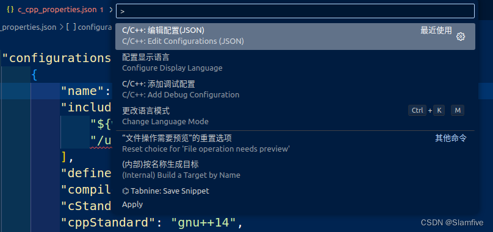  
即`c_cpp_properties.json`文件，往里面添加opencv4路径：

```c
"/usr/local/include/opencv4"
```

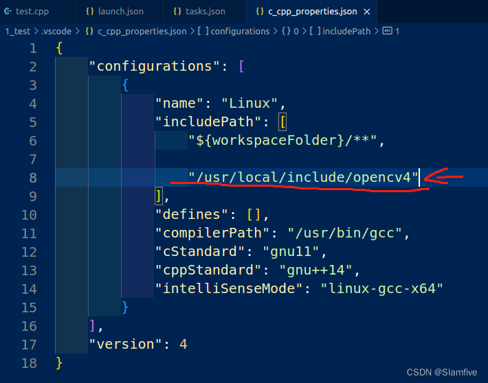  
**注意：我安装的opencv的路径是 `include/opencv4/opencv2`**  
也可以定义为

```c
"/usr/local/include/"
```

实现一个软链接即可

```css
cd /usr/local/include/ sudo ln -s opencv4/opencv2 opencv2
```

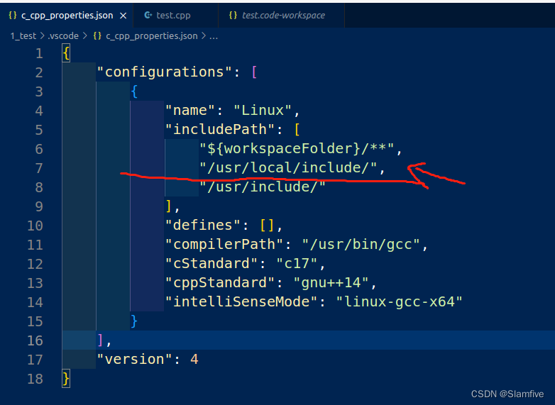

#### 2、配置tasks.json文件：

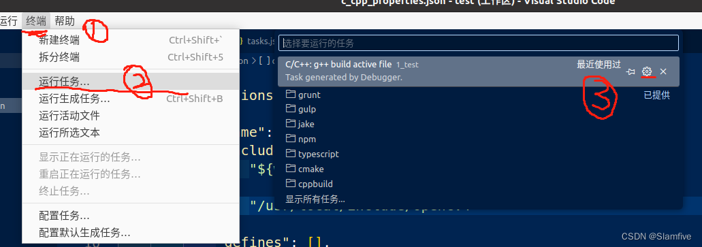

```c
{
    "tasks": [
        {
            "type": "cppbuild",
            "label": "C/C++: g++ build active file",  /* 与launch.json文件里的preLaunchTask的内容保持一致 */
            "command": "/usr/bin/g++",
            "args": [
                "-std=c++11",
                "-g",
                //"${file}",   /* 编译单个文件 */
                "${fileDirname}/*.cpp",  /* 编译多个文件 */
                "-o",
                "${fileDirname}/${fileBasenameNoExtension}",  /* 输出文件路径 */
 
                /* 项目所需的头文件路径 */
                "-I","${workspaceFolder}/",
                "-I","/usr/local/include/",
                "-I","/usr/local/include/opencv4/",
                "-I","/usr/local/include/opencv4/opencv2",
 
                /* 项目所需的库文件路径 */
                "-L", "/usr/local/lib",
 
                /* OpenCV的lib库 */
                "/usr/local/lib/libopencv_*",
 
            ],
            "options": {
                "cwd": "${fileDirname}"
            },
            "problemMatcher": [
                "$gcc"
            ],
            "group": {
                "kind": "build",
                "isDefault": true
            },
            "detail": "Task generated by Debugger."
        }
    ],
    "version": "2.0.0"
}

```

#### 3、配置launch.json文件：

按下\*\*“ctrl+shift+p”\*\*，搜索launch.json打开如下图所示第一个配置：  
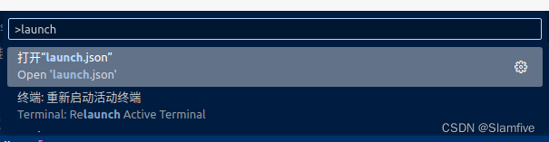

```c
{

    "version": "0.2.0",
    "configurations": [
        {
            "name": "g++ - Build and debug active file",
            "type": "cppdbg",
            "request": "launch",
            "program": "${fileDirname}/${fileBasenameNoExtension}",  //程序文件路径
            "args": [],  //程序运行需传入的参数
            "stopAtEntry": false,
            "cwd": "${fileDirname}",
            "environment": [],
            "externalConsole": true,   //运行时是否显示控制台窗口
            "MIMode": "gdb",
            "setupCommands": [
                {
                    "description": "Enable pretty-printing for gdb",
                    "text": "-enable-pretty-printing",
                    "ignoreFailures": true
                }
            ],
            "preLaunchTask": "C/C++: g++ build active file",
            "miDebuggerPath": "/usr/bin/gdb"
        }
    ]
}

```

写个简单的读取图片程序：可以跑通

```cpp
#include <opencv2/opencv.hpp>
#include <iostream>
using namespace std;

int main(int argc, char* argv[]) {
    const char* imagename = "1.jpg";//此处为的图片路径
    //从文件中读入图像
    cv::Mat img = cv::imread(imagename, 1);
    //如果读入图像失败
    if (img.empty()) {
        fprintf(stderr, "Can not load image %s\n", imagename);
        return -1;
    }
    cv::imshow("image", img); //显示图像
    cv::waitKey();
    return 0;
}
```

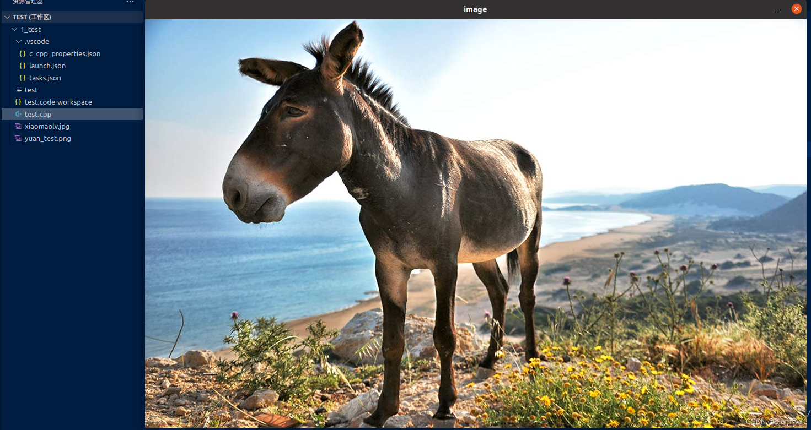  
至此，我们实现了在Ubuntu20.04中安装opencv并配置完成！