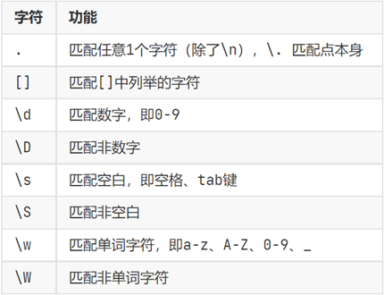
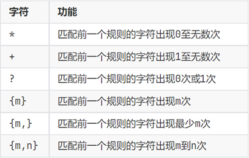
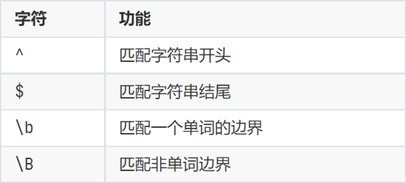
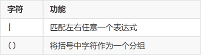

#### 第一章 环境搭建

编译器下载地址：https://www.python.org/downloads

验证安装：终端输入python；出现python版本号表示安装成功

```python
python	#启动python
print("Hello World!!!")	#打印字符串
```

过程：程序-->puthon解释器-->二进制代码-->计算机运行

运行脚本:新建test.py文件

```python
print("Hello World!!!")	#打印字符串
print("Hello World!!!")	#打印字符串
print("Hello World!!!")	#打印字符串
```

当前文件夹打开终端

```python
python test.py	#运行脚本
```

IDE下载：https://www.jetbrains.com/pycharm；下社区版，免费

改中文：设置-->pugins-->下载chinese插件

修改字体大小：设置-->编辑器-->字体

添加快捷方式：设置-->搜索：增加-->添加鼠标快捷方式-->ctrl+鼠标↑

添加快捷方式：设置-->搜索：减小-->添加鼠标快捷方式-->ctrl+鼠标↓

#### 第二章 基础语法

被**写下来**的的固定的**值**，如整数、浮点数、字符串

```python
666
13.14
"啦啦啦啦"	#直接输入不会报错
```

###### 注释、打印

```python
# 单行注释

"""
多行注释
"""
```

```python
money = 100 #变量赋值
print("小明有",money,"元")

"""
小明有 100 元
"""
```

###### 数据类型

```python
# 数据类型
print(type("hello"))
print(type(666))
print(type(3.14))

name = "张三"
name_type = type(name)
print(name_type)
"""
<class 'str'>
<class 'int'>
<class 'float'>
<class 'str'>
"""
```

```python
# 数据类型转换
int(x)
float(x)
str(x)
#万物都能转字符串，但文字不能转数字
#浮点数转整数，丢失小数位
#整数转小数，增加.0
```

###### 标识符、运算符

```python
"""
标识符，用于给变量、类、方法等命名

中英文，数字，下划线；
不推荐使用中文，数字不可以开头
不可以使用关键字
"""
```

```python
"""
算数运算符
+ - * %
/	除法，结果为浮点数
//	取整除，9//2 = 4 , 9.0//2.0 = 4.0
**	指数，10**2 = 100

复合赋值运算符
+=  -=  *=  /=  %=  //=  **=	
"""
```

###### 字符串

```python
#字符串定义
t1 = "字符串文本数据1"
t2 = '字符串文本数据2'
t3 = """字符串文本数据3"""

t4 = """
字符串文本数据4
字符串文本数据4
字符串文本数据4
"""
```

```python
#字符串引号嵌套

# 在字符串内 包含双引号
name = '"黑马程序员"'
print(name)
# 在字符串内 包含单引号
name = "'黑马程序员'"
print(name)
# 使用转义字符 \ 解除引号的效用
name = "\"黑马程序员\""
print(name)
name = '\'黑马程序员\''
print(name)

"""
"黑马程序员"
'黑马程序员'
"黑马程序员"
'黑马程序员'
"""
```

###### 打印拼接、占位符

```python
# 字符串字面拼接
print("你好"+"世界")
# 用变量拼接字符串
name = "张三"
address = "中国"
#tel = 888666，数字不能用加号拼接，用逗号
tel = "888666"
print(name + address + tel)

"""
你好世界
张三中国888666
"""
```

```python
#占位符
# 字符串格式化	"%占位符" % 变量
# %s字符串占位符
name = "张三"
message = "我是%s的朋友" % name
print(message)

# 多个变量
# %d整数占位符
# %7.2f两位小数浮点型占位符，小数四舍五入，数据总宽度为7
age = 24
height = 178.88
mes = "%s今年%d岁,身高%7.2f" % (name,age,height)
print(mes)

"""
我是张三的朋友
张三今年24岁,身高 178.88
"""
```

```python
"""
第二种字符串格式化的方式：f"{变量}，{变量}"
"""
name = "张三"
age = 24
height = 178.88
print(f"我是{name}，今年：{age}岁，我身高是：{height}")

# 我是张三，今年：24岁，我身高是：178.88
```

```python
"""
表达式进行字符串格式化
"""
print("1 * 1 的结果是：%d" % (1 * 1))
print(f"1 * 2的结果是：{1 * 2}")
print("字符串在Python中的类型名是：%s" % type("字符串"))

"""
1 * 1 的结果是：1
1 * 2的结果是：2
字符串在Python中的类型名是：<class 'str'>
"""
```

###### 键盘输入

```python
# 获取键盘输入，input("提示词")
# 输出提示词，并接收键盘数据
name = input("你是谁？")
print(f"你是{name}")

# 传入数据类型是字符型
num = input("你多大？")
print("键盘传入年龄类型是",type(num))
num = int(num)
print("转换后的年龄类型是",type(num))

"""
你是谁？张三
你是张三
你多大？20
键盘传入年龄类型是 <class 'str'>
转换后的年龄类型是 <class 'int'>
"""
```

#### 第三章 判断语句

###### bool 类型

字面量：True， False 

比较运算符：==	!=	>	<	>=	<=

```python
# 定义变量存储布尔类型的数据
bool_1 = True
bool_2 = False
print(f"bool_1变量的内容是：{bool_1}, 类型是：{type(bool_1)}")
print(f"bool_2变量的内容是：{bool_2}, 类型是：{type(bool_2)}")
# 比较运算符的使用
num1 = 10
num2 = 10
print(f"10 == 10的结果是：{num1 == num2}")
```

```python
bool_1变量的内容是：True, 类型是：<class 'bool'>
bool_2变量的内容是：False, 类型是：<class 'bool'>
10 == 10的结果是：True
```

###### if 语句

条件后冒号，操作前缩进

```python
age = int(input("请输入你的年龄："))
if age >= 18:
    print("您已成年，游玩需要买票，10元.")
print("祝您游玩愉快")

"""
请输入你的年龄：18
您已成年，游玩需要买票，10元.
祝您游玩愉快
"""
```

###### if else 语句

```python
age = int(input("请输入你的年龄："))
if age >= 18:
    print("您已成年，需要买票10元。")
else:
    print("您未成年，可以免费游玩。")
    
"""
请输入你的年龄：10
您未成年，可以免费游玩。
"""
```

###### if elif else 语句

判断互斥有序

上一个满足，后面不再判断

else可省略

```python
if int(input("身高（cm）：")) < 120:
    print("身高小于120cm，免费。")
elif int(input("VIP等级（1-5）：")) > 3:
    print("vip级别大于3，可以免费。")
elif int(input("今天几号：")) == 1:
    print("今天1号，可以免费")
else:
    print("条件都不满足，需要买票")
    
"""
身高（cm）：178
VIP等级（1-5）：1
今天几号：24
条件都不满足，需要买票
"""
```

###### 嵌套语句

用缩进表示嵌套

```python
if int(input("你的身高是多少：")) > 120:
    print("身高超出限制，不可以免费")
    print("但是，如果vip级别大于3，可以免费")

    if int(input("你的vip级别是多少：")) > 3:
        print("恭喜你，vip级别达标，可以免费")
    else:
        print("Sorry 你需要买票10元")
else:
    print("欢迎小朋友，免费游玩。")
    
"""
你的身高是多少：178
身高超出限制，不可以免费
但是，如果vip级别大于3，可以免费
你的vip级别是多少：0
Sorry 你需要买票10元
"""
```

###### 随机数字

```python
import random
num = random.randint(1,10)	#1~10，随机产生
```

#### 第四章 循环语句

###### while 循环

```python
sum = 0
i = 1
while i<=10:   
    sum += i
    i += 1
        
print(f"1-10累加的和是：{sum}")

# 1-10累加的和是：55
```

猜数字案例

```python
# 获取范围在1-10的随机数字
import random
num = random.randint(1, 10)

# 定义一个变量，记录总共猜测了多少次
count = 0

# 通过一个布尔类型的变量，做循环是否继续的标记
flag = True
while flag:
    guess_num = int(input("请输入你猜测的数字:"))
    count += 1
    if guess_num == num:
        print("猜中了")
        # 设置为False就是终止循环的条件
        flag = False
    else:
        if guess_num > num:
            print("你猜的大了")
        else:
            print("你猜的小了")

print(f"你总共猜测了{count}次")

"""
请输入你猜测的数字:5
你猜的大了
请输入你猜测的数字:3
猜中了
你总共猜测了2次
"""
```

while的嵌套循环

九九乘法表案例

1 * 1 = 1	
1 * 2 = 2	2 * 2 = 4	
1 * 3 = 3	2 * 3 = 6	  3 * 3 = 9	
1 * 4 = 4	2 * 4 = 8	  3 * 4 = 12	4 * 4 = 16	
1 * 5 = 5	2 * 5 = 10	3 * 5 = 15	4 * 5 = 20	5 * 5 = 25	
1 * 6 = 6	2 * 6 = 12	3 * 6 = 18	4 * 6 = 24	5 * 6 = 30	6 * 6 = 36	
1 * 7 = 7	2 * 7 = 14	3 * 7 = 21	4 * 7 = 28	5 * 7 = 35	6 * 7 = 42	7 * 7 = 49	
1 * 8 = 8	2 * 8 = 16	3 * 8 = 24	4 * 8 = 32	5 * 8 = 40	6 * 8 = 48	7 * 8 = 56	8 * 8 = 64	
1 * 9 = 9	2 * 9 = 18	3 * 9 = 27	4 * 9 = 36	5 * 9 = 45	6 * 9 = 54	7 * 9 = 63	8 * 9 = 72	9 * 9 = 81	

```python
# 定义外层循环的控制变量，行数
i = 1
while i <= 9:

    # 定义内层循环的控制变量，列数
    j = 1
    while j <= i:
        # 内层循环的print语句，通过\t制表符进行对齐,end=''不换行
        print(f"{j} * {i} = {j * i}\t", end='')
        j += 1

    i += 1
    print()     # print空内容，就是输出一个换行
```

###### for 循环

```python
name = "123456"
for x in name:
    # 将name的内容，挨个取出赋予x临时变量
    # 就可以在循环体内对x进行处理
    print(x)
    
"""
1
2
3
4
5
6
"""    
```

案例 统计字符串中有多少a

```python
# 统计如下字符串中，有多少个字母a
name = "itheima is a brand of itcast"

# 定义一个变量，用来统计有多少个a
count = 0

# for 循环统计
# for 临时变量 in 被统计的数据:
for x in name:
    if x == "a":
        count += 1

print(f"name中有{count}个a")

# name中有4个a
```

```python
#for语法
for 临时变量 in 待处理数据集: 

	满足条件的操作

 """
待处理数据集，严格来说，称之为：可迭代类型
可迭代类型指，其内容可以一个个依次取出的一种类型，包括：
字符串、列表、元组等
 """   
```

**rang 语句**

```python
range(num)	
#range(5)取得的数据是：[0, 1, 2, 3, 4]

range(num1，num2)
#range(5, 10)取得的数据是：[5, 6, 7, 8, 9]

range(num1, num2, step)
#range(5, 10, 2)取得的数据是：[5, 7, 9]

#获取的数组，不含末尾num
#step表示步长，元素每次增长的数字，默认是1
```

```python
# range 语法3 range(num1, num2, step)
for i in range(5, 10, 2):
    # 从5开始，到10结束（不包含10本身）的一个数字序列，数字之间的间隔是2
    print(i)
    
"""
5
7
9
"""
```

案例 九九乘法表

```python
# 通过外层循环控制行数
for i in range(1, 10):
    # 通过内层循环控制每一行的数据
    for j in range(1, i + 1):
        # 在内层循环中输出每一行的内容
        print(f"{j} * {i} = {j * i}\t", end='')

    # 外层循环可以通过print输出一个回车符
    print()
```

###### 循环中断

**continue**

中断本次循环，直接进入下一次循环；for循环和while循环，效果一致

```python
for i in range(1,3):
    print("continue中")
    continue    # 中断本次循环，不执行下一行代码
    print("被中断的语句")
    
"""
continue中
continue中
"""    
```

注意：continue只影响本次循环，不影响外部嵌套循环

```python
for i in range(1,3):
    print("外层循环")
    
    for j in range(1, 3):
        print("内层语句")
        continue    # 中断本次循环，不执行下一行代码
        print("被中断的语句")
        
    print()
    
"""
外层循环
内层语句
内层语句

外层循环
内层语句
内层语句

"""   
```

**break**

直接结束所在循环； for循环和while循环，效果一致

```python
for i in range(1,3):
    print("内层语句")
    break  # 跳出循环，只循环一次，不执行下一行代码
    print("被中断的语句")
    
 #内层语句   
```

注意 跳出循环，对外部循环无效

```python
for i in range(1,3):
    print("外层循环")
    
    for j in range(1, 3):
        print("内层语句")
        break    # 跳出内部循环，不执行下一行代码
        print("被中断的语句")
        
    print()
    
"""
外层循环
内层语句

外层循环
内层语句

"""    
```

#### 第五章 函数

###### 函数的定义

```python
def	函数名(传入参数):
    函数体
    return 返回值
# 传入参数和返回值可按需求省略
# 函数先定义后使用
```

函数的调用

```
函数名（参数）
```

```python
str1 = "zhangsan"
str2 = "lisi"
str3 = "wangwu"
# 用内置函数，计算字符串长度
print(f"字符串{str1}的长度是：",len(str1))
print(f"字符串{str2}的长度是：",len(str2))
print(f"字符串{str3}的长度是：",len(str3))
print()

# 用自定义函数，计算字符串长度
def my_len(data) :
    count = 0 # 字符串长度统计量
    for i in data:
        count += 1
    return count

print(f"字符串{str1}的长度是：",my_len(str1))
print(f"字符串{str2}的长度是：",my_len(str2))
print(f"字符串{str3}的长度是：",my_len(str3))

"""
字符串zhangsan的长度是： 8
字符串lisi的长度是： 4
字符串wangwu的长度是： 6

字符串zhangsan的长度是：8
字符串lisi的长度是：4
字符串wangwu的长度是：6
"""
```

###### **None类型**

如果函数没有使用return语句返回数据，函数也有返回值，返回None

```python
# 无return语句的函数返回值
def say_hi():
    print("你好呀")

result = say_hi()
print(f"无返回值函数，返回的内容是：{result}")
print(f"无返回值函数，返回的内容类型是：{type(result)}")
print()
# 你好呀
# 无返回值函数，返回的内容是：None
# 无返回值函数，返回的内容类型是：<class 'NoneType'>

# 主动返回None的函数
def say_hi2():
    print("你好呀")
    return None

result = say_hi2()
print(f"无返回值函数，返回的内容是：{result}")
print(f"无返回值函数，返回的内容类型是：{type(result)}")
print()
# 你好呀
# 无返回值函数，返回的内容是：None
# 无返回值函数，返回的内容类型是：<class 'NoneType'>


# None用于if判断
def check_age(age):
    if age > 18:
        return "SUCCESS"
    else:
        return None

result = check_age(16)
if not result:
    # 进入if表示result是None值 也就是False
    print("未成年，不可以进入")
# 未成年，不可以进入

# None用于声明无初始内容的变量
name = None
```

函数的说明文档，帮助理解函数功能

```python
# 定义函数，进行文档说明
def add(x, y):
    """
    add函数可以接收2个参数，进行2数相加的功能
    :param x: 形参x表示相加的其中一个数字
    :param y: 形参y表示相加的另一个数字
    :return: 返回值是2数相加的结果
    """
    result = x + y
    print(f"2数相加的结果是：{result}")
    return result

add(5, 6)	#鼠标悬停，可以查看说明文档
```

函数的嵌套调用

```python
# 定义函数func_b
def func_b():
    print("---2---")
    
# 定义函数func_a，并在内部调用func_b
def func_a():
    print("---1---")
    # 嵌套调用func_b
    func_b()
    print("---3---")
    
# 调用函数func_a
func_a()

"""
---1---
---2---
---3---
"""
```

###### 局部变量和全局变量

局部变量：定义在函数体内部的变量，只在函数体内部生效；当函数调用完成后，立刻销毁

```python
def test_a():
    num = 100
    print(num)
    
test_a()

# 出了函数体，局部变量就无法使用了
print(num)	#报错
```

全局变量：在函数体内、外都能生效的变量

有多个函数名，不用包含“test”，否则终端出现test session starts

```python
# 在函数内修改全局变量
num = 200

def a():
    print(f"test_a: {num}")

def b():
    num = 500       # 局部变量
    print(f"test_b: {num}")

a()
b()
print(num)

"""
test_a: 200
test_b: 500
200
"""
```

**global关键字**

```python
# global关键字，在函数内声明变量为全局变量
num = 200

def a():
    print(f"test_a: {num}")

def b():
    global num      # 设置内部定义的变量为全局变量
    num = 500
    print(f"test_b: {num}")

a()
b()
print(num)

"""
test_a: 200
test_b: 500
500
"""
```

###### 多返回值

```python
# 第一个return后，退出当前函数
def t_return():
    return 1
    return 2

x = t_return()
y = t_return()
print(x)
print(y)

# 1
# 1
```

```python
# 演示使用多个变量，接收多个返回值
def t_return():
    return 1, "hello", True

x, y, z = t_return()
print(x)
print(y)
print(z)

# 1
# hello
# True
```

###### 多种传参方式

```python
def user_info(name, age, gender):
    print(f"姓名是:{name}, 年龄是:{age}, 性别是:{gender}")
# 位置参数 - 默认使用形式
user_info('小明', 20, '男')
# 姓名是:小明, 年龄是:20, 性别是:男

# 关键字参数，关键字参数必须写最后面
user_info(name='小王', age=11, gender='女')
user_info(age=10, gender='女', name='潇潇')    # 可以不按照参数的定义顺序传参
user_info('甜甜', gender='女', age=9)
# 姓名是:小王, 年龄是:11, 性别是:女
# 姓名是:潇潇, 年龄是:10, 性别是:女
# 姓名是:甜甜, 年龄是:9, 性别是:女

# 缺省参数（默认值）,默认参数必须写最后面
def user_info(name, age, gender='男'):
    print(f"姓名是:{name}, 年龄是:{age}, 性别是:{gender}")

user_info('小天', 13)
user_info('小天', 13,'女')
# 姓名是:小天, 年龄是:13, 性别是:男
# 姓名是:小天, 年龄是:13, 性别是:女

# 不定长 - 位置不定长；参数个数任意, *号
# 元组
def user_info(*args):
    print(f"args参数的类型是：{type(args)}，内容是:{args}")

user_info(1, 2, 3, '小明', '男孩')
# args参数的类型是：<class 'tuple'>，内容是:(1, 2, 3, '小明', '男孩')

# 不定长 - 关键字不定长；参数个数任意, **号；
# 字典
def user_info(**kwargs):
    print(f"args参数的类型是：{type(kwargs)}，内容是:{kwargs}")
user_info(name='小王', age=11, gender='男孩')
# args参数的类型是：<class 'dict'>，内容是:{'name': '小王', 'age': 11, 'gender': '男孩'}
```

###### 函数作为参数传递

```python
# 定义一个函数，接收另一个函数作为传入参数
def t_func(compute):
    result = compute(1, 2)  # 确定compute是函数
    print(f"compute参数的类型是:{type(compute)}")
    print(f"计算结果：{result}")
# 传入计算逻辑，然后在t_func内计算

# 定义一个函数，准备作为参数传入另一个函数
def compute(x, y):
    return x + y
# 调用，并传入函数
t_func(compute)

# compute参数的类型是:<class 'function'>
# 计算结果：3
```

###### 匿名函数

```python
lambda 传入参数： 函数体（一行代码）
"""
lambda关键字，可以定义匿名函数（无名称）
无名称的匿名函数，只可临时使用一次。
"""
```

```python
# 定义一个函数，接受其它函数输入
def t_func(compute):
    result = compute(1, 2)
    print(f"结果是:{result}")
    
def add(x, y):
    return x + y

t_func(add)
# 结果是:3

# 通过lambda匿名函数的形式，将匿名函数作为参数传入
t_func(lambda x, y: x + y)
# 结果是:3
```

###### if __name__ == '__main__':

```python
# 当这个脚本作为，主程序运行时，位于该判断语句下的代码块将，被执行。
# 当这个脚本作为，模块被其他脚本导入时，位于该判断语句下的代码块将，不会被执行。
```
能运行案例：

**script.py**

```python
def main():
    print("This is the main function.")

# 当 script.py 作为主程序运行时，调用 main()
if __name__ == '__main__':
    main()
```

**another_script.py**

```python
import script

# 调用 script 模块中的 main() 函数
script.main()
"""
This is the main function.
"""
```

不能运行案例：

**script.py**

```python
# def main():
#    print("This is the main function.")

# 当 script.py 作为主程序运行时，调用 main()
if __name__ == '__main__':
    def main():
    print("This is the main function.")
    
    main()
```

**another_script.py**

```python
import script

# 调用 script 模块中的 main() 函数
script.main()

"""
报错！！
"""
```

#### 第六章 数据容器

一种可以存储多个元素的Python数据类型

list(列表)、tuple(元组)、str(字符串)、set(集合)、dict(字典)

###### list 列表

```python
语法：[元素1，元素2，....]
```

```python
# 定义一个列表 list
my_list = ["itheima", "itcast", "python"]
print(my_list)
print(type(my_list))
# ['itheima', 'itcast', 'python']
# <class 'list'>

my_list = ["itheima", 666, True]
print(my_list)
print(type(my_list))
# ['itheima', 666, True]
# <class 'list'>

# 定义一个嵌套的列表
my_list = [ [1, 2, 3], [4, 5, 6]]
print(my_list)
print(type(my_list))
# [[1, 2, 3], [4, 5, 6]]
# <class 'list'>

# 通过下标索引取出对应位置的数据
my_list = ["Tom", "Lily", "Rose"]

# 列表[下标索引], 从前向后从0开始，每次+1
# 从后向前从-1开始，每次-1
print(my_list[0])
print(my_list[1])
print(my_list[2])
# Tom
# Lily
# Rose

# 错误示范；通过下标索引取数据，一定不要超出范围
# print(my_list[3])

# 通过下标索引取出数据（倒序取出）
print(my_list[-1])
print(my_list[-2])
print(my_list[-3])
# Rose
# Lily
# Tom

# 取出嵌套列表的元素
my_list = [[1, 2, 3], [4, 5, 6]]
print(my_list[1][1])
# 5
```

列表的方法

```python
mylist = ["itcast", "itheima", "python"]
# 1.1 查找某元素在列表内的下标索引
index = mylist.index("itheima")
print(f"itheima在列表中的下标索引值是：{index}")
# itheima在列表中的下标索引值是：1

# 1.2如果被查找的元素不存在，会报错
# index = mylist.index("hello")
# print(f"hello在列表中的下标索引值是：{index}")

# 2. 修改特定下标索引的值
mylist[0] = "传智教育"
print(f"列表被修改元素值后，结果是：{mylist}")
# 列表被修改元素值后，结果是：['传智教育', 'itheima', 'python']

# 3. 在指定下标位置插入新元素
mylist.insert(1, "best")
print(f"列表插入元素后，结果是：{mylist}")
# 列表插入元素后，结果是：['传智教育', 'best', 'itheima', 'python']

# 4. 在列表的尾部追加"单个"新元素
mylist.append("黑马程序员")
print(f"列表在追加了元素后，结果是：{mylist}")
# 列表在追加了元素后，结果是：['传智教育', 'best', 'itheima', 'python', '黑马程序员']

# 5. 在列表的尾部追加"一批"新元素
mylist2 = [1, 2, 3]
mylist.extend(mylist2)
print(f"列表在追加了一个新的列表后，结果是：{mylist}")
# 列表在追加了一个新的列表后，结果是：['传智教育', 'best', 'itheima', 'python', '黑马程序员', 1, 2, 3]

# 6. 删除指定下标索引的元素（2种方式）
mylist = ["itcast", "itheima", "python"]

# 6.1 方式1：del 列表[下标]
del mylist[2]
print(f"列表删除元素后结果是：{mylist}")
# 列表删除元素后结果是：['itcast', 'itheima']

# 6.2 方式2：列表.pop(下标)
mylist = ["itcast", "itheima", "python"]
element = mylist.pop(2)
print(f"通过pop方法取出元素后列表内容：{mylist}, 取出的元素是：{element}")
# 通过pop方法取出元素后列表内容：['itcast', 'itheima'], 取出的元素是：python

# 7. 删除某元素在列表中的第一个匹配项
mylist = ["itcast", "itheima", "itcast", "itheima", "python"]
mylist.remove("itheima")
print(f"通过remove方法移除元素后，列表的结果是：{mylist}")
# 通过remove方法移除元素后，列表的结果是：['itcast', 'itcast', 'itheima', 'python']

# 8. 清空列表
mylist.clear()
print(f"列表被清空了，结果是：{mylist}")
# 列表被清空了，结果是：[]

# 9. 统计列表内某元素的数量
mylist = ["itcast", "itheima", "itcast", "itheima", "python"]
count = mylist.count("itheima")
print(f"列表中itheima的数量是：{count}")
# 列表中itheima的数量是：2

# 10. 统计列表中全部的元素数量
mylist = ["itcast", "itheima", "itcast", "itheima", "python"]
count = len(mylist)
print(f"列表的元素数量总共有：{count}个")
# 列表的元素数量总共有：5个
```

遍历

```python
def list_while_func():
    mylist = ["传智教育", "黑马程序员", "Python"]

    index = 0  # 初始下标为0
    while index < len(mylist):
        # 通过index变量取出对应下标的元素
        element = mylist[index]
        print(f"列表的元素：{element}")
        # 至关重要：将循环变量（index）每一次循环都+1
        index += 1
# 列表的元素：传智教育
# 列表的元素：黑马程序员
# 列表的元素：Python

def list_for_func():
    mylist = [1, 2, 3, 4, 5]
    # for 临时变量 in 数据容器:
    for element in mylist:
        print(f"列表的元素有：{element}")
# 列表的元素有：1
# 列表的元素有：2
# 列表的元素有：3
# 列表的元素有：4
# 列表的元素有：5

if __name__ == '__main__':
    # 当这个脚本作为主程序运行时，位于该判断语句下的代码块将被执行。
    # 当这个脚本作为模块被其他脚本导入时，位于该判断语句下的代码块将不会被执行。

    list_while_func()
    list_for_func()

```

###### tuple 元组

```
my_tuple = (元素1，元素2，元素3，....)
```

内部元素不可修改

```python
# 定义元组
t1 = (1, "Hello", True)
# 定义空元组
t2 = ()
t3 = tuple()
```

```python
# 定义元组
t1 = (1, "Hello", True)
t2 = ()
t3 = tuple()
print(f"t1的类型是：{type(t1)}, 内容是：{t1}")
print(f"t2的类型是：{type(t2)}, 内容是：{t2}")
print(f"t3的类型是：{type(t3)}, 内容是：{t3}")
# t1的类型是：<class 'tuple'>, 内容是：(1, 'Hello', True)
# t2的类型是：<class 'tuple'>, 内容是：()
# t3的类型是：<class 'tuple'>, 内容是：()

# 定义单个元素的元素，加逗号；不加逗号为字符串
t4 = ("hello", )
print(f"t4的类型是：{type(t4)}, t4的内容是：{t4}")
# t4的类型是：<class 'tuple'>, t4的内容是：('hello',)

# 元组的嵌套
t5 = ( (1, 2, 3), (4, 5, 6) )
print(f"t5的类型是：{type(t5)}, 内容是：{t5}")
# t5的类型是：<class 'tuple'>, 内容是：((1, 2, 3), (4, 5, 6))

# 下标索引去取出内容
num = t5[1][2]
print(f"从嵌套元组中取出的数据是：{num}")
# 从嵌套元组中取出的数据是：6

# 元组的操作：index查找方法
t6 = ("传智教育", "黑马程序员", "Python")
index = t6.index("黑马程序员")
print(f"在元组t6中查找黑马程序员，的下标是：{index}")
# 在元组t6中查找黑马程序员，的下标是：1

# 元组的操作：count统计方法
t7 = ("传智教育", "黑马程序员", "黑马程序员", "黑马程序员", "Python")
num = t7.count("黑马程序员")
print(f"在元组t7中统计黑马程序员的数量有：{num}个")
# 在元组t7中统计黑马程序员的数量有：3个

# 元组的操作：len函数统计元组元素数量
t8 = ("传智教育", "黑马程序员", "黑马程序员", "黑马程序员", "Python")
num = len(t8)
print(f"t8元组中的元素有：{num}个")
# t8元组中的元素有：5个

# 元组的遍历：while
index = 0
while index < len(t8):
    print(f"元组的元素有：{t8[index]}")
    # 至关重要
    index += 1
# 元组的元素有：传智教育
# 元组的元素有：黑马程序员
# 元组的元素有：黑马程序员
# 元组的元素有：黑马程序员
# 元组的元素有：Python

# 元组的遍历：for
for element in t8:
    print(f"2元组的元素有：{element}")
# 2元组的元素有：传智教育
# 2元组的元素有：黑马程序员
# 2元组的元素有：黑马程序员
# 2元组的元素有：黑马程序员
# 2元组的元素有：Python

# 元组内容,不可修改
# t8[0] = "itcast"

# 元组里面的，列表元素可以修改
t9 = (1, 2, ["itheima", "itcast"])
print(f"t9的内容是：{t9}")
# t9的内容是：(1, 2, ['itheima', 'itcast'])

t9[2][0] = "黑马程序员"
t9[2][1] = "传智教育"
print(f"t9的内容是：{t9}")
# t9的内容是：(1, 2, ['黑马程序员', '传智教育'])
```

###### str 字符串

```
my_str = "abc def"
```

```python
my_str = "itheima and itcast"
# 通过下标索引取值
value = my_str[2]
value2 = my_str[-16]
print(f"从字符串{my_str}取下标为2的元素。值是：{value},取下标为-16的元素。值是：{value2}")
# 从字符串itheima and itcast取下标为2的元素。值是：h,取下标为-16的元素。值是：h

# my_str[2] = "H"
# 字符串不支持修改

# index方法，索引下标
value = my_str.index("and")
print(f"在字符串{my_str}中查找and，其起始下标是：{value}")
# 在字符串itheima and itcast中查找and，其起始下标是：8

# replace方法，替代
new_my_str = my_str.replace("it", "程序")
print(f"将字符串{my_str}，进行替换后得到：{new_my_str}")
# 将字符串itheima and itcast，进行替换后得到：程序heima and 程序cast

# split方法，分离并放入列表
my_str = "hello python itheima itcast"
my_str_list = my_str.split(" ")
print(f"将字符串{my_str}进行split切分后得到：{my_str_list}, 类型是：{type(my_str_list)}")
# 将字符串hello python itheima itcast进行split切分后得到：['hello', 'python', 'itheima', 'itcast'], 类型是：<class 'list'>

# strip方法，规整
my_str = "  itheima and itcast  "
new_my_str = my_str.strip() # 不传入参数，去除首尾空格
print(f"字符串{my_str}被strip后，结果：{new_my_str}")
# 字符串  itheima and itcast  被strip后，结果：itheima and itcast

my_str = "12itheima and itcast21"
new_my_str = my_str.strip("12")	# 去除字符，1、2
print(f"字符串{my_str}被strip('12')后，结果：{new_my_str}")
# 字符串12itheima and itcast21被strip('12')后，结果：itheima and itcast

# 统计字符串中某字符串的出现次数, count
my_str = "itheima and itcast"
count = my_str.count("it")
print(f"字符串{my_str}中it出现的次数是：{count}")
# 字符串itheima and itcast中it出现的次数是：2

# 统计字符串的长度, len()
num = len(my_str)
print(f"字符串{my_str}的长度是：{num}")
# 字符串itheima and itcast的长度是：18
```

```python
"""
演示字符串大小比较
从头到尾，一位位进行比较，其中一位大，后面就无需比较了。
通过ASCII码表，确定字符对应的码值数字来确定大小
"""
print(f"abd大于abc，结果：{'abd' > 'abc'}")
# abd大于abc，结果：True

print(f"ab大于a，结果：{'ab' > 'a'}")
# ab大于a，结果：True

print(f"a 大于 A，结果：{'a' > 'A'}")
# a 大于 A，结果：True

print(f"key2 > key1，结果：{'key2' > 'key1'}")
# key2 > key1，结果：True
```

###### 序列的切片

```python
序列[起始下标:结束下标:步长]
```

**序列**

内容连续、有序，可使用下标索引的数据容器；如：列表、元组、字符串

**切片**

从一个序列中，取出一个子序列；不会影响序列本身，而是会得到一个新的序列

```python
"""
起始下标表示从何处开始，可以留空，留空视作从头开始
结束下标表示在何处结束，可以留空，留空视作截取到结尾，结果不含结束下标
步长表示，依次取元素的间隔
步长1表示，一个个取元素
步长2表示，每次跳过1个元素取
步长N表示，每次跳过N-1个元素取
步长为负数表示，反向取（注意，起始下标和结束下标也要反向标记）
"""
```

```python
# 对list进行切片，从1开始，4结束，步长1
my_list = [0, 1, 2, 3, 4, 5, 6]
result1 = my_list[1:4]      # 步长默认是1，所以可以省略不写
print(f"结果1：{result1}")
# 结果1：[1, 2, 3]

# 对tuple进行切片，从头开始，到最后结束，步长1
my_tuple = (0, 1, 2, 3, 4, 5, 6)
result2 = my_tuple[:]     # 起始和结束不写表示从头到尾，步长为1可以省略
print(f"结果2：{result2}")
# 结果2：(0, 1, 2, 3, 4, 5, 6)

# 对str进行切片，从头开始，到最后结束，步长2
my_str = "01234567"
result3 = my_str[::2]
print(f"结果3：{result3}")
# 结果3：0246

# 对str进行切片，从头开始，到最后结束，步长-1
my_str = "01234567"
result4 = my_str[::-1]          # 等同于将序列反转了
print(f"结果4：{result4}")
# 结果4：76543210

# 对列表进行切片，从3开始，到1结束，步长-1
my_list = [0, 1, 2, 3, 4, 5, 6]
result5 = my_list[3:1:-1]
print(f"结果5：{result5}")
# 结果5：[3, 2]

# 对元组进行切片，从头开始，到尾结束，步长-2
my_tuple = (0, 1, 2, 3, 4, 5, 6)
result6 = my_tuple[::-2]
print(f"结果6：{result6}")
# 结果6：(6, 4, 2, 0)
```

###### set 集合

```
my_set = {元素1,元素2, 元素3，....}
```

自带去重功能、内容无序

```python
# 定义集合
my_set = {"传智教育", "黑马程序员", "itheima", "传智教育", "黑马程序员", "itheima", "传智教育", "黑马程序员", "itheima"}
my_set_empty = set()        # 定义空集合
print(f"my_set的内容是：{my_set}, 类型是：{type(my_set)}")
print(f"my_set_empty的内容是：{my_set_empty}, 类型是：{type(my_set_empty)}")
# my_set的内容是：{'itheima', '黑马程序员', '传智教育'}, 类型是：<class 'set'>
# my_set_empty的内容是：set(), 类型是：<class 'set'>

# 添加新元素
my_set.add("Python")
my_set.add("传智教育")
print(f"my_set添加元素后结果是：{my_set}")
# my_set添加元素后结果是：{'itheima', '黑马程序员', 'Python', '传智教育'}

# 移除元素
my_set.remove("黑马程序员")
print(f"my_set移除黑马程序员后，结果是：{my_set}")
# my_set移除黑马程序员后，结果是：{'itheima', 'Python', '传智教育'}

# 随机取出一个元素
my_set = {"传智教育", "黑马程序员", "itheima"}
element = my_set.pop()
print(f"集合被取出元素是：{element}, 取出元素后：{my_set}")
# 集合被取出元素是：itheima, 取出元素后：{'黑马程序员', '传智教育'}

# 清空集合, clear
my_set.clear()
print(f"集合被清空啦，结果是：{my_set}")
# 集合被清空啦，结果是：set()

# 取2个集合的差集
set1 = {1, 2, 3}
set2 = {1, 5, 6}
set3 = set1.difference(set2)
print(f"取出差集后的结果是：{set3}")
print(f"取差集后，原有set1的内容：{set1}")
print(f"取差集后，原有set2的内容：{set2}")
# 取出差集后的结果是：{2, 3}
# 取差集后，原有set1的内容：{1, 2, 3}
# 取差集后，原有set2的内容：{1, 5, 6}

# 消除2个集合的差集
set1 = {1, 2, 3}
set2 = {1, 5, 6}
set1.difference_update(set2)
print(f"消除差集后，集合1结果：{set1}")
print(f"消除差集后，集合2结果：{set2}")
# 消除差集后，集合1结果：{2, 3}
# 消除差集后，集合2结果：{1, 5, 6}

# 2个集合合并为1个
set1 = {1, 2, 3}
set2 = {1, 5, 6}
set3 = set1.union(set2)
print(f"2集合合并结果：{set3}")
print(f"合并后集合1：{set1}")
print(f"合并后集合2：{set2}")
# 2集合合并结果：{1, 2, 3, 5, 6}
# 合并后集合1：{1, 2, 3}
# 合并后集合2：{1, 5, 6}

# 统计集合元素数量len()
set1 = {1, 2, 3, 4, 5, 1, 2, 3, 4, 5}
num = len(set1)
print(f"集合内的元素数量有：{num}个")
# 集合内的元素数量有：5个

# 集合的遍历
# 集合不支持下标索引，不能用while循环
# 可以用for循环
set1 = {1, 2, 3, 4, 5}
for element in set1:
    print(f"集合的元素有：{element}")
# 集合的元素有：1
# 集合的元素有：2
# 集合的元素有：3
# 集合的元素有：4
# 集合的元素有：5
```

###### dict 字典

```python
my_dict1 = {键1: 值1, 键2: 值2, 键3: 值3,....}
```

【字】：【含义】；  Key: Value

```python
# 定义字典
my_dict1 = {"语文": 99, "数学": 88, "英语": 77}
# 定义空字典
my_dict2 = {}
my_dict3 = dict()
```

使用{}存储元素，每一个元素是一个键值对

每一个键值对包含Key和Value（用冒号分隔）

键值对之间使用逗号分隔

Key和Value可以是任意类型的数据（key不可为字典）

Key不可重复，重复会对原有数据覆盖

```python
# 定义字典
my_dict1 = {"王力鸿": 99, "周杰轮": 88, "林俊节": 77}
# 定义空字典
my_dict2 = {}
my_dict3 = dict()
print(f"字典1的内容是：{my_dict1}, 类型：{type(my_dict1)}")
print(f"字典2的内容是：{my_dict2}, 类型：{type(my_dict2)}")
print(f"字典3的内容是：{my_dict3}, 类型：{type(my_dict3)}")
# 字典1的内容是：{'王力鸿': 99, '周杰轮': 88, '林俊节': 77}, 类型：<class 'dict'>
# 字典2的内容是：{}, 类型：<class 'dict'>
# 字典3的内容是：{}, 类型：<class 'dict'>

# 定义重复Key的字典
my_dict1 = {"王力鸿": 99, "王力鸿": 88, "林俊节": 77}
print(f"重复key的字典的内容是：{my_dict1}")
# 重复key的字典的内容是：{'王力鸿': 88, '林俊节': 77}

# 从字典中基于Key获取Value
my_dict1 = {"王力鸿": 99, "周杰轮": 88, "林俊节": 77}
score = my_dict1["王力鸿"]
print(f"王力鸿的考试分数是：{score}")
score = my_dict1["周杰轮"]
print(f"周杰轮的考试分数是：{score}")
# 王力鸿的考试分数是：99
# 周杰轮的考试分数是：88

# 定义嵌套字典, “{” 要紧跟 “=”，不能换行
stu_score_dict = {
    "王力鸿": {"语文": 77,"数学": 66,"英语": 33}, 
    "周杰轮": {"语文": 88,"数学": 86,"英语": 55},
    "林俊节": {"语文": 99,"数学": 96,"英语": 66}
}
print(f"学生的考试信息是：{stu_score_dict}")
# 学生的考试信息是：{'王力鸿': {'语文': 77, '数学': 66, '英语': 33}, '周杰轮': {'语文': 88, '数学': 86, '英语': 55}, '林俊节': {'语文': 99, '数学': 96, '英语': 66}}

# 从嵌套字典中获取数据
# 看一下周杰轮的语文信息
score = stu_score_dict["周杰轮"]["语文"]
print(f"周杰轮的语文分数是：{score}")
score = stu_score_dict["林俊节"]["英语"]
print(f"林俊节的英语分数是：{score}")
# 周杰轮的语文分数是：88
# 林俊节的英语分数是：66
```

```python
"""
演示字典的常用操作
"""
my_dict = {"周杰轮": 99, "林俊节": 88, "张学油": 77}
# 新增元素
my_dict["张信哲"] = 66
print(f"字典经过新增元素后，结果：{my_dict}")
# 字典经过新增元素后，结果：{'周杰轮': 99, '林俊节': 88, '张学油': 77, '张信哲': 66}

# 更新元素
my_dict["周杰轮"] = 33
print(f"字典经过更新后，结果：{my_dict}")
# 字典经过更新后，结果：{'周杰轮': 33, '林俊节': 88, '张学油': 77, '张信哲': 66}

# 删除元素
score = my_dict.pop("周杰轮")
print(f"字典中被移除了一个元素，结果：{my_dict}, 周杰轮的考试分数是：{score}")
# 字典中被移除了一个元素，结果：{'林俊节': 88, '张学油': 77, '张信哲': 66}, 周杰轮的考试分数是：33

# 清空元素, clear
my_dict.clear()
print(f"字典被清空了，内容是：{my_dict}")
# 字典被清空了，内容是：{}

# 获取全部的key
my_dict = {"周杰轮": 99, "林俊节": 88, "张学油": 77}
keys = my_dict.keys()
print(f"字典的全部keys是：{keys}")
# 字典的全部keys是：dict_keys(['周杰轮', '林俊节', '张学油'])

# 遍历字典
# 方式1：通过获取到全部的key来完成遍历
for key in keys:
    print(f"字典的key是:{key}")
    print(f"字典的value是：{my_dict[key]}")
# 字典的key是:周杰轮
# 字典的value是：99
# 字典的key是:林俊节
# 字典的value是：88
# 字典的key是:张学油
# 字典的value是：77

# 方式2：直接对字典进行for循环，每一次循环都是直接得到key
for key in my_dict:
    print(f"2字典的key是:{key}")
    print(f"2字典的value是：{my_dict[key]}")
# 2字典的key是:周杰轮
# 2字典的value是：99
# 2字典的key是:林俊节
# 2字典的value是：88
# 2字典的key是:张学油
# 2字典的value是：77

# 统计字典内的元素数量, len()函数
num = len(my_dict)
print(f"字典中的元素数量有：{num}个")
# 字典中的元素数量有：3个
```

###### 容器总结

数据容器分类：

​	•是否支持下标索引

​			•**支持：列表、元组、字符串** **-** **序列类型**

​			•**不支持：集合、字典** **-** **非序列类型**

​	•是否支持重复元素：

​			•**支持：列表、元组、字符串** **-** **序列类型**

​			•**不支持：集合、字典** **-** **非序列类型**

​	•是否可以修改

​			•**支持：列表、集合、字典**

​			•**不支持：元组、字符串**


应用场景：

列表：可修改、可重复

元组：不可修改、可重复

字符串：一串字符串

集合：去重存储场景

字典：可用Key检索Value


通用操作：

遍历：

5类数据容器都支持for循环遍历

列表、元组、字符串支持while循环，集合、字典不支持（无法下标索引）

```python
"""
演示数据容器的通用功能
"""
my_list = [1, 2, 3, 4, 5]
my_tuple = (1, 2, 3, 4, 5)
my_str = "abcdefg"
my_set = {1, 2, 3, 4, 5}
my_dict = {"key1": 1, "key2": 2, "key3": 3, "key4": 4, "key5": 5}

# len()元素个数
print(f"列表 元素个数有：{len(my_list)}")
print(f"元组 元素个数有：{len(my_tuple)}")
print(f"字符串元素个数有：{len(my_str)}")
print(f"集合 元素个数有：{len(my_set)}")
print(f"字典 元素个数有：{len(my_dict)}")
# 列表 元素个数有：5
# 元组 元素个数有：5
# 字符串元素个数有：7
# 集合 元素个数有：5
# 字典 元素个数有：5

# max()最大元素
print(f"列表 最大的元素是：{max(my_list)}")
print(f"元组 最大的元素是：{max(my_tuple)}")
print(f"字符串最大的元素是：{max(my_str)}")
print(f"集合 最大的元素是：{max(my_set)}")
print(f"字典 最大的元素是：{max(my_dict)}")
# 列表 最大的元素是：5
# 元组 最大的元素是：5
# 字符串最大的元素是：g
# 集合 最大的元素是：5
# 字典 最大的元素是：key5

# min()最小元素
print(f"列表 最小的元素是：{min(my_list)}")
print(f"元组 最小的元素是：{min(my_tuple)}")
print(f"字符串最小的元素是：{min(my_str)}")
print(f"集合 最小的元素是：{min(my_set)}")
print(f"字典 最小的元素是：{min(my_dict)}")
# 列表 最小的元素是：1
# 元组 最小的元素是：1
# 字符串最小的元素是：a
# 集合 最小的元素是：1
# 字典 最小的元素是：key1

# 类型转换: 容器转列表，list()
print(f"列表转列表的结果是：{list(my_list)}")
print(f"元组转列表的结果是：{list(my_tuple)}")
print(f"字符串转列表结果是：{list(my_str)}")
print(f"集合转列表的结果是：{list(my_set)}")
print(f"字典转列表的结果是：{list(my_dict)}")
# 列表转列表的结果是：[1, 2, 3, 4, 5]
# 元组转列表的结果是：[1, 2, 3, 4, 5]
# 字符串转列表结果是：['a', 'b', 'c', 'd', 'e', 'f', 'g']
# 集合转列表的结果是：[1, 2, 3, 4, 5]
# 字典转列表的结果是：['key1', 'key2', 'key3', 'key4', 'key5']

# 类型转换: 容器转元组，tuple()
print(f"列表转元组的结果是：{tuple(my_list)}")
print(f"元组转元组的结果是：{tuple(my_tuple)}")
print(f"字符串转元组结果是：{tuple(my_str)}")
print(f"集合转元组的结果是：{tuple(my_set)}")
print(f"字典转元组的结果是：{tuple(my_dict)}")
# 列表转元组的结果是：(1, 2, 3, 4, 5)
# 元组转元组的结果是：(1, 2, 3, 4, 5)
# 字符串转元组结果是：('a', 'b', 'c', 'd', 'e', 'f', 'g')
# 集合转元组的结果是：(1, 2, 3, 4, 5)
# 字典转元组的结果是：('key1', 'key2', 'key3', 'key4', 'key5')

# 类型转换: 容器转字符串，str()
print(f"列表转字符串的结果是：{str(my_list)}")
print(f"元组转字符串的结果是：{str(my_tuple)}")
print(f"字符串转字符串结果是：{str(my_str)}")
print(f"集合转字符串的结果是：{str(my_set)}")
print(f"字典转字符串的结果是：{str(my_dict)}")
# 列表转字符串的结果是：[1, 2, 3, 4, 5]
# 元组转字符串的结果是：(1, 2, 3, 4, 5)
# 字符串转字符串结果是：abcdefg
# 集合转字符串的结果是：{1, 2, 3, 4, 5}
# 字典转字符串的结果是：{'key1': 1, 'key2': 2, 'key3': 3, 'key4': 4, 'key5': 5}

# 类型转换: 容器转集合，set()
print(f"列表转集合的结果是：{set(my_list)}")
print(f"元组转集合的结果是：{set(my_tuple)}")
print(f"字符串转集合结果是：{set(my_str)}")
print(f"集合转集合的结果是：{set(my_set)}")
print(f"字典转集合的结果是：{set(my_dict)}")
# 列表转集合的结果是：{1, 2, 3, 4, 5}
# 元组转集合的结果是：{1, 2, 3, 4, 5}
# 字符串转集合结果是：{'c', 'd', 'g', 'f', 'b', 'e', 'a'}
# 集合转集合的结果是：{1, 2, 3, 4, 5}
# 字典转集合的结果是：{'key3', 'key5', 'key1', 'key2', 'key4'}

# 进行容器的排序，sorted()
my_list = [3, 1, 2, 5, 4]
my_tuple = (3, 1, 2, 5, 4)
my_str = "bdcefga"
my_set = {3, 1, 2, 5, 4}
my_dict = {"key3": 1, "key1": 2, "key2": 3, "key5": 4, "key4": 5}

print(f"列表对象的排序结果：{sorted(my_list)}")
print(f"元组对象的排序结果：{sorted(my_tuple)}")
print(f"字符串对象的排序结果：{sorted(my_str)}")
print(f"集合对象的排序结果：{sorted(my_set)}")
print(f"字典对象的排序结果：{sorted(my_dict)}")
# 列表对象的排序结果：[1, 2, 3, 4, 5]
# 元组对象的排序结果：[1, 2, 3, 4, 5]
# 字符串对象的排序结果：['a', 'b', 'c', 'd', 'e', 'f', 'g']
# 集合对象的排序结果：[1, 2, 3, 4, 5]
# 字典对象的排序结果：['key1', 'key2', 'key3', 'key4', 'key5']

# 进行容器的反向排序，sorted(容器, reverse=True)
print(f"列表对象的反向排序结果：{sorted(my_list, reverse=True)}")
print(f"元组对象的反向排序结果：{sorted(my_tuple, reverse=True)}")
print(f"字符串对象反向的排序结果：{sorted(my_str, reverse=True)}")
print(f"集合对象的反向排序结果：{sorted(my_set, reverse=True)}")
print(f"字典对象的反向排序结果：{sorted(my_dict, reverse=True)}")
# 列表对象的反向排序结果：[5, 4, 3, 2, 1]
# 元组对象的反向排序结果：[5, 4, 3, 2, 1]
# 字符串对象反向的排序结果：['g', 'f', 'e', 'd', 'c', 'b', 'a']
# 集合对象的反向排序结果：[5, 4, 3, 2, 1]
# 字典对象的反向排序结果：['key5', 'key4', 'key3', 'key2', 'key1']
```

#### 第七章 文件操作

编码：UTF-8，GBK；作用：将内容翻译成二进制计算机语言，供计算机读取

**open()打开函数**

```python
open(name, mode, encoding)
```

```
name：是要打开的目标文件名的字符串(可以包含文件所在的具体路径)。
mode：设置打开文件的模式(访问模式)：只读r、写入w、追加a等。
encoding:编码格式（推荐使用UTF-8）
```

示例代码

```python
f = open('python.txt', 'r', encoding="UTF-8")
# encoding的顺序不是第三位，所以不能用位置参数，用关键字参数直接指定
```

mode三种模式

| r    | 只读。文件的指针将会放在文件的开头。这是默认模式。           |
| ---- | ------------------------------------------------------------ |
| w    | 只写。文件存在则打开，从开头开始编辑，原有内容会被删除。  如果该文件不存在，创建新文件。 |
| a    | 追加。文件存在，新内容写入到已有内容后。  文件不存在，创建新文件写入。 |

新建文件：D:/测试.txt

```python
0123456789
abcdefg
```

```python
"""
演示对文件的读取
"""
# 打开文件
import time

f = open("D:/测试.txt", "r", encoding="UTF-8")
print(type(f))
# <class '_io.TextIOWrapper'>

# 读取文件 - read()；以字符串读取
# 文件对象.read(num)
# num表示要从文件中读取的数据的长度（单位是字节），
# 如果没有传入num，那么就表示读取文件中所有的数据。

# print(f"读取10个字节的结果：{f.read(10)}")
# print(f"read方法读取全部内容的结果是：{f.read()}")
# 读取10个字节的结果：0123456789
# read方法读取全部内容的结果是：
# abcdefg
# 读取时，指针位置保留，不会从头开始读
print("-----------------------------------------------")

# 读取文件 - readLines()
# readlines可以按照行的方式把整个文件中的内容进行一次性读取，
# 并且返回的是一个列表，其中每一行的数据为一个元素。

# lines = f.readlines()   # 读取文件的全部行，封装到列表中
# print(f"lines对象的类型：{type(lines)}")
# print(f"lines对象的内容是：{lines}")
# lines对象的类型：<class 'list'>
# lines对象的内容是：['0123456789\n', 'abcdefg']

# 读取文件 - readline()
# 一次读取一行内容
# line1 = f.readline()
# line2 = f.readline()
# print(f"第一行数据是：{line1}")
# print(f"第二行数据是：{line2}")
# 第一行数据是：0123456789
# 第二行数据是：abcdefg

# for循环读取文件行
# for line in f:
#     print(f"每一行数据是:{line}")
# 每一行数据是:0123456789
# 每一行数据是:abcdefg

# # 文件的关闭，防止被系统一直占用，如果不关闭，文件不能被修改、删除
# f.close()
# time.sleep(500000)  # 暂停500000秒
# 文件被关闭了，程序运行过程中，可以删除

# with open 语法操作文件，打开文件后，自动将文件关闭
with open("D:/测试.txt", "r", encoding="UTF-8") as f:
    for line in f:
        print(f"每一行数据是：{line}")
# 每一行数据是：0123456789
# 每一行数据是：abcdefg
time.sleep(500000)
# 程序运行过程中，可以删除
```

```python
"""
演示读取文件，统计itheima出现次数
"""

# 打开文件，以读取模式打开
f = open("D:/word.txt", "r", encoding="UTF-8")
# 方式1：读取全部内容，通过字符串count方法统计itheima单词数量
# content = f.read() #字符串
# count = content.count("itheima")
# print(f"itheima在文件中出现了:{count}次")

# 方式2：读取内容，一行一行读取
count = 0       # 使用count变量来累计itheima出现的次数
for line in f:
    line = line.strip()     # 去除开头和结尾的空格以及换行符"\n"
    words = line.split(" ")	# 以列表格式，分离存储
    for word in words:
        if word == "itheima":
            count += 1      # 如果单词是itheima，进行数量的累加加1
# 判断单词出现次数并累计
print(f"itheima出现的次数是：{count}")
# 关闭文件
f.close()

```

###### 写操作

```python
# 1. 打开文件
f = open("D:/test.txt", "w", encoding="UTF-8")

# 2.文件写入，若文件有内容，会被覆盖
f.write('hello world')

# 3. 内容刷新，将缓存区文件存入硬盘
f.flush()

# close方法，内置了flush的功能的
f.close()                       
```

###### 追加操作

```python
f = open("D:/test.txt", "a", encoding="UTF-8")

# write写入、flush刷新
f.write("\n你好 python")

# close关闭
f.close()
```

#### 第八章 异常、模块与包

##### 异常

所谓的“异常”, 也就是我们常说的BUG

捕获异常

```python
try:
    可能发生错误的代码
except:
    如果出现异常执行的代码
```

```python
# 基本捕获语法
try:
    f = open("D:/abc.txt", "r", encoding="UTF-8")
except:
    print("出现异常了，因为文件不存在，我将open的模式，改为w模式去打开")
    f = open("D:/abc.txt", "w", encoding="UTF-8")
# 出现异常了，因为文件不存在，我将open的模式，改为w模式去打开
```

```python
# 捕获指定的异常
try:
    print(name)
except NameError as e:
    print("出现了变量未定义的异常")
    print(e)
# 出现了变量未定义的异常
# name 'name' is not defined

try:
    1 / 0
except ZeroDivisionError as e:
    print("出现了变量未定义的异常")
    print(e)
# 出现了变量未定义的异常
# division by zero
```

```python
# 捕获多个异常
try:
    # 1 / 0
    print(name)
except (NameError, ZeroDivisionError) as e:
    print("出现了变量未定义 或者 除以0的异常错误")
    print(e)
# 出现了变量未定义 或者 除以0的异常错误
# name 'name' is not defined
```

```python
# 捕获所有异常，Exception
try:
    f = open("D:/123.txt", "r", encoding="UTF-8")
except Exception as e:
    print("出现异常了")
    print(e)
    f = open("D:/123.txt", "w", encoding="UTF-8")#出现异常后的解决方案
# 出现异常了
# [Errno 2] No such file or directory: 'D:/123.txt'

else:#如果没有异常，执行下面语句
    print("好高兴，没有异常。")
    
finally:#不管有没有异常，都执行下面语句
    print("我是finally，有没有异常我都要执行")
    f.close()
```

```python
#异常的传递性

# 定义一个出现异常的方法
def func1():
    print("func1 开始执行")
    num = 1 / 0     # 肯定有异常，除以0的异常
    print("func1 结束执行")
# 定义一个无异常的方法，调用上面的方法

def func2():
    print("func2 开始执行")
    func1()
    print("func2 结束执行")
# 定义一个方法，调用上面的方法

def main():
    try:
        func2()
    except Exception as e:
        print(f"出现异常了，异常的信息是：{e}")

main()

# func2 开始执行
# func1 开始执行
# 出现异常了，异常的信息是：division by zero
```

##### 模块

模块就是一个Python文件，里面有类、函数、变量等，我们可以拿过来用（导入模块去使用）

写到文件开头

###### **导入方式**

```python
[from模块名] import [模块|类|变量函数|*][as 别名]
```

```python
import time     # 导入Python内置的time模块（time.py这个代码文件）
# ctrl + 鼠标左键，查看函数定义
print("你好")
time.sleep(5)   # 通过. 就可以使用模块内部的全部功能（类、函数、变量）
print("我好")
# 你好
# 睡眠五秒
# 我好
```

```python
# 使用from导入time的sleep功能（函数）
from time import sleep
print("你好")
sleep(5)
print("我好")
# 你好
# 睡眠五秒
# 我好
```

```python
# 使用 * 导入time模块的全部功能
from time import *      # *表示全部的意思
print("你好")
sleep(5)			#这里不用 ·
print("我好")
# 你好
# 睡眠五秒
# 我好
```

```python
# 使用as给模块加上别名
import time as t
print("你好")
t.sleep(5)
print("我好")
# 你好
# 睡眠五秒
# 我好
```

```python
# 使用as给特定功能加上别名
from time import sleep as sl
print("你好")
sl(5)
print("我好")
# 你好
# 睡眠五秒
# 我好
```

###### **导入自定义模块**

新建 my_module1.py

```python
def t(a, b):
    print(a+b)
```

新建 main.py

```python
# 导入自定义模块使用
import my_module1
my_module1.t(1,2)

from my_module1 import t
t(1,2)
# 3
# 3
```

新建 my_module2.py

```
def t(a, b):
    print(a-b)
```

 main.py

```python
from my_module1 import t	#同名函数，被最下面的覆盖
from my_module2 import t
t(1, 2)
# -1
```

###### **main变量**

my_module1.py

```python
def t(a, b):
    print(a+b)

t(1,2)	#测试代码
# 3
```

 main.py

```python
from my_module1 import t
# 3
```

不想调用t时，执行测试代码

my_module1.py

```python
def t(a, b):
    print(a+b)

# 输入main，自动补全    
if __name__ == '__main__':
    t(1,2)
#3    
```

 main.py

```python
from my_module1 import t
# 无输出
```

###### **all变量**

当使用`from xxx import *`导入时，只能导入这个列表中的元素

my_module1.py

```python
__all__ = ['t_a']

def t_a(a, b):
    print(a+b)


def t_b(a, b):
    print(a-b)
```

 main.py

```python
from my_module1 import *
t_a(1, 2)
t_b(2, 1)
# 3
# NameError: name 't_b' is not defined
```

##### 包

包是一个文件夹，包含一个 _____init_.py 文件，包含多个模块文件；本质依然是模块

在pycharm中，右击外层文件，python软件包，命名为my_package，其中自动创建 _____init_.py 

my_package新建my_module1.py

```python
def info_print1():
    print("我是模块1的功能函数代码")
```

my_package新建my_module2.py

```python
def info_print2():
    print("我是模块2的功能函数代码")
```

my_package外，新建文件 main.py

```python
# 创建一个包
# 导入自定义的包中的模块，并使用
import my_package.my_module1
import my_package.my_module2

my_package.my_module1.info_print1()
my_package.my_module2.info_print2()
# 我是模块1的功能函数代码
# 我是模块2的功能函数代码
```

```python
from my_package import my_module1
from my_package import my_module2
my_module1.info_print1()
my_module2.info_print2()
# 我是模块1的功能函数代码
# 我是模块2的功能函数代码
```

```python
from my_package.my_module1 import info_print1
from my_package.my_module2 import info_print2
info_print1()
info_print2()
# 我是模块1的功能函数代码
# 我是模块2的功能函数代码
```

**通过all变量，控制import ***

my_package中_____init_.py 

```
__all__ = ['my_module1']
```

my_package外，main.py

```python
# 通过__all__变量，控制import *
from my_package import *
my_module1.info_print1()
my_module2.info_print2()
# 我是模块1的功能函数代码
# NameError: name 'my_module2' is not defined
```

###### 安装第三方包

•科学计算中常用的：numpy包

•数据分析中常用的：pandas包

•大数据计算中常用的：pyspark、apache-flink包

•图形可视化常用的：matplotlib、pyecharts

•人工智能常用的：tensorflow

终端中安装：

```bash
# pip install 包名称；国外源
# pip install -i https://pypi.tuna.tsinghua.edu.cn/simple 包名称；国内源
pip install numpy
```

PyCharm中安装：

右下角python 3.8-->interpreter setting-->点击绿圈关闭-->点击 “+ ”-->搜索pandas-->选项输入下面代码，点击安装软件包

```python
-i https://pypi.tuna.tsinghua.edu.cn/simple	
```

##### 案例 **自定义工具包**

```python
创建一个自定义包，名称为：my_utils (我的工具）(utilities)，在包内提供2个模块

str_util.py （字符串相关工具，内含：）
函数：str_reverse(s)，接受传入字符串，将字符串反转返回
函数：substr(s, x, y)，按照下标 x 和 y，对字符串进行切片


file_util.py（文件处理相关工具，内含：）
函数：print_file_info(file_name)，接收传入文件的路径，打印文件的全部内容，
	 如文件不存在则捕获异常，输出提示信息，通过finally关闭文件对象
函数：append_to_file(file_name, data)，接收文件路径以及传入数据，将数据追加写入到文件中
```

新建my_utils软件包，其中新建str_util.py，file_util.py

str_util.py

```python
"""
字符串相关的工具模块
"""

def str_reverse(s):
    """
    功能是将字符串完成反转
    :param s: 将被反转的字符串
    :return: 反转后的字符串
    """
    return s[::-1]

def substr(s, x, y):
    """
    功能是按照给定的下标完成给定字符串的切片
    :param s: 即将被切片的字符串
    :param x: 切片的开始下标
    :param y: 切片的结束下标
    :return: 切片完成后的字符串
    """
    return s[x:y]

if __name__ == '__main__':  # 测试代码
    print(str_reverse("黑马程序员"))
    print(substr("黑马程序员", 1, 3))
# 员序程马黑
# 马程
```

file_util.py

```python
"""
文件处理相关的工具模块
"""

def print_file_info(file_name):
    """
    功能是：将给定路径的文件内容输出到控制台中
    :param file_name: 即将读取的文件路径
    :return: None
    """
    f = None
    try:
        f = open(file_name, "r", encoding="UTF-8")
        content = f.read()
        print("文件的全部内容如下：")
        print(content)
    except Exception as e:
        print(f"程序出现异常了，原因是：{e}")
    finally:
        if f:       # 如果变量是None，表示False，如果有任何内容，就是True
            f.close()

def append_to_file(file_name, data):
    """
    功能：将指定的数据追加到指定的文件中
    :param file_name: 指定的文件的路径
    :param data: 指定的数据
    :return: None
    """
    f = open(file_name, "a", encoding="UTF-8")
    f.write(data)
    f.write("\n")
    f.close()

if __name__ == '__main__':
    print_file_info("D:/bill.txtxxx")
    append_to_file("D:/test_append.txt", "传智教育")
# 程序出现异常了，原因是：[Errno 2] No such file or directory: 'D:/bill.txtxxx'
# 成功创建文件，并追加数据
```

my_utils软件包外，新建文件main.py

```python
import my_utils.str_util
from my_utils import file_util

print(my_utils.str_util.str_reverse("黑马程序员"))
print(my_utils.str_util.substr("itheima", 0, 4))

file_util.append_to_file("D:/test_append.txt", "itheima")
file_util.print_file_info("D:/test_append.txt")
# 员序程马黑
# ithe
# 文件的全部内容如下：
# itheima
```

#### 第九章 面向对象

##### 初识对象

使用对象组织数据：让学生填写	信息表

1. 设计表格，我们称之为：设计类（class）

2. 打印生产表格，我们称之为：创建对象

 3.填写表格，我们称之为：对象属性赋值

```python
# 1.设计一个类（设计一张登记表）
class Student:
    name= None
    age = None

# 2.创建一个类（打印一张登记表）
stu_1 = Student()

#3.对象属性进行赋值（填写登记表）
stu_1.name = "张三"
stu_1.age = 18

#4.获取对象中记录的信息
print(stu_1.name)
print(stu_1.age)

# 张三
# 18
```

##### 成员方法

类的定义和使用

```python
class 类名称：
	类的属性	#定义成员变量
	类的行为	#定义成员方法（函数）
    
对象 = 类名称（）	#创建类对象
```

```python
"""
演示面向对象类中的成员方法定义和使用
"""

# 定义一个带有成员方法的类
class Student:
    name = None     # 学生的姓名

    def say_hi(self):   # self是关键字，必须填写，用于传参
        print(f"大家好呀，欢迎大家多多关照")


    def say_hi2(self, msg):
        print(f"大家好，我是：{self.name}，{msg}")


stu = Student()
stu.name = "周杰轮"
stu.say_hi2("哎哟不错哟")

stu2 = Student()
stu2.name = "林俊节"
stu2.say_hi2("小伙子我看好你")

# 大家好，我是：周杰轮，哎哟不错哟
# 大家好，我是：林俊节，小伙子我看好你
```

##### 类和对象

```python
"""
演示类和对象的关系，即面向对象的编程套路（思想）
"""

# 设计一个闹钟类
class Clock:
    id = None       # 序列化
    price = None    # 价格


    def ring(self):
        import winsound
        winsound.Beep(2000, 3000)

# 构建2个闹钟对象并让其工作
clock1 = Clock()
clock1.id = "003032"
clock1.price = 19.99
print(f"闹钟ID：{clock1.id}，价格：{clock1.price}")
clock1.ring()

clock2 = Clock()
clock2.id = "003033"
clock2.price = 21.99
print(f"闹钟ID：{clock2.id}，价格：{clock2.price}")
clock2.ring()

# 闹钟ID：003032，价格：19.99
# 响铃
# 闹钟ID：003033，价格：21.99
# 响铃
```

##### 构造方法

__init__()方法，称之为构造方法。

在创建类对象（构造类）的时候，会自动执行。将传入参数自动传递给__init__方法使用。

```python
"""
演示类的构造方法
"""
# 演示使用构造方法对成员变量进行赋值
# 构造方法的名称：_ _init_ _
# 构造方法内定义成员变量，需要使用self关键字

class Student:

    def __init__(self, name, age ,tel):
        self.name = name
        self.age = age
        self.tel = tel
        print("Student类创建了一个类对象")

stu = Student("周杰轮", 31, "18500006666")
print(stu.name)
print(stu.age)
print(stu.tel)

# Student类创建了一个类对象
# 周杰轮
# 31
# 18500006666
```

##### 魔术方法

字符串方法：控制类转换为字符串

```python
# 不用魔术方法，会输出地址
class Student:
    def __init__(self, name, age):
        self.name = name        # 学生姓名
        self.age = age          # 学生年龄
stu = Student("周杰伦",31)
print(stu)
print(str(stu))

# <__main__.Student object at 0x000001B19E998400>
# <__main__.Student object at 0x000001B19E998400>

```

```python
class Student:
    def __init__(self, name, age):
        self.name = name        # 学生姓名
        self.age = age          # 学生年龄

    # __str__魔术方法
    def __str__(self):
        return f"Student类对象，name:{self.name}, age:{self.age}"

stu = Student("周杰伦",31)
print(stu)
print(str(stu))

# Student类对象，name:周杰伦, age:31
# Student类对象，name:周杰伦, age:31
```

```python
class Student:
    def __init__(self, name, age):
        self.name = name        # 学生姓名
        self.age = age          # 学生年龄
    
    # __lt__魔术方法,小于符号比较
    def __lt__(self, other):
        return self.age < other.age
    
stu1 = Student("周杰轮", 31)
stu2 = Student("林俊节", 36)
print(stu1 < stu2)
# True 
print(stu1 > stu2)
#False
```

```python
class Student:
    def __init__(self, name, age):
        self.name = name        # 学生姓名
        self.age = age          # 学生年龄
                    
    # __le__魔术方法,小于等于符号比较
    def __le__(self, other):
        return self.age <= other.age
```

```python
class Student:
    def __init__(self, name, age):
        self.name = name        # 学生姓名
        self.age = age          # 学生年龄
        
    # __eq__魔术方法，等于比较
    def __eq__(self, other):
        return self.age == other.age 
    
stu1 = Student("周杰轮", 31)
stu2 = Student("林俊节", 36)
print(stu1 == stu2)
#False
```

##### 封装

将现实世界事物的属性和行为封装到类中，描述为成员变量和成员方法

**私有成员**

私有成员变量：变量名以__开头（2个下划线）

私有成员方法：方法名以__开头（2个下划线）

```python
# 私有成员类外不可被访问
class Phone:
    __current_voltage = 0.5        # 当前手机运行电压

    def __keep_single_core(self):
        print("让CPU以单核模式运行")
        
phone = Phone()
phone.__keep_single_core()
# AttributeError: 'Phone' object has no attribute '__keep_single_core'
```

```python
# 私有成员，类内可被访问
class Phone:
    __current_voltage = 0.5        # 当前手机运行电压

    def __keep_single_core(self):
        print("让CPU以单核模式运行")

    def call_by_5g(self):
        if self.__current_voltage >= 1:
            print("5g通话已开启")
        else:
            self.__keep_single_core()
            print("电量不足，无法使用5g通话，并已设置为单核运行进行省电。")

phone = Phone()
phone.call_by_5g()
# 让CPU以单核模式运行
# 电量不足，无法使用5g通话，并已设置为单核运行进行省电。
```

##### 继承

从父类那里继承（复制）来成员变量和成员方法（不含私有）

```python
class 类名(父类名)：
	类内容体
```

```python
# 演示单继承
class Phone:
    IMEI = None     # 序列号
    producer = "ITCAST" # 厂商


    def call_by_4g(self):
        print("4g通话")


class Phone2022(Phone):
    face_id = "10001"       # 面部识别ID


    def call_by_5g(self):
        print("2022年新功能：5g通话")


phone = Phone2022()
print(phone.producer)
phone.call_by_4g()
phone.call_by_5g()
# ITCAST
# 4g通话
# 2022年新功能：5g通话
```

```python
# 一种子类，继承多个父类
class 类名(父类1，父类2....，父类N):
	类内容体
```

```python
# 演示多继承
class Phone:
    IMEI = None     # 序列号
    producer = "ITCAST" # 厂商

    def call_by_4g(self):
        print("4g通话")

class NFCReader:
    nfc_type = "第五代"
    producer = "HM"

    def read_card(self):
        print("NFC读卡")

    def write_card(self):
        print("NFC写卡")

class RemoteControl:
    rc_type = "红外遥控"

    def control(self):
        print("红外遥控开启了")


class MyPhone(Phone, NFCReader, RemoteControl):
    pass    # 占位语句，用来保证函数（方法）或类定义的完整性，表示无内容


phone = MyPhone()
phone.call_by_4g()
phone.read_card()
phone.write_card()
phone.control()

print(phone.producer)

# 4g通话
# NFC读卡
# NFC写卡
# 红外遥控开启了
# ITCAST	#父类有两个producer："ITCAST","HM",最先输入的被继承
```

**复写**

修改子类继承的父类属性与方法

```python
class Phone:
    IMEI = None             # 序列号
    producer = "ITCAST"     # 厂商

    def call_by_5g(self):
        print("使用5g网络进行通话")


# 定义子类，复写父类成员
class MyPhone(Phone):
    producer = "ITHEIMA"        # 复写父类的成员属性

    def call_by_5g(self):
        print("开启CPU单核模式，确保通话的时候省电")

phone = MyPhone()
phone.call_by_5g()
print(phone.producer)

# 开启CPU单核模式，确保通话的时候省电
# ITHEIMA
```

调用父类成员

```python
方式1：
父类名.成员变量
父类名.成员方法(self)

方式2：
super().成员变量
super().成员方法()
```

```python
class Phone:
    IMEI = None             # 序列号
    producer = "ITCAST"     # 厂商

    def call_by_5g(self):
        print("使用5g网络进行通话")


# 定义子类，复写父类成员
class MyPhone(Phone):
    producer = "ITHEIMA"        # 复写父类的成员属性

    def call_by_5g(self):
        print("开启CPU单核模式，确保通话的时候省电")
        # 方式1
        # print(f"父类的厂商是：{Phone.producer}")
        # Phone.call_by_5g(self)
        # 方式2
        print(f"父类的厂商是：{super().producer}")
        super().call_by_5g()
        print("关闭CPU单核模式，确保性能")

phone = MyPhone()
phone.call_by_5g()
print(phone.producer)

# 开启CPU单核模式，确保通话的时候省电
# 父类的厂商是：ITCAST
# 使用5g网络进行通话
# 关闭CPU单核模式，确保性能
# ITHEIMA
```

##### 类型注解

方便IDE和阅读者理解数据类型，注解不影响程序运行

基础语法

```python
变量：类型
# 继承数据类型注解
a: int = 10

#类对象类型注解
class Student:
    pass
stu: Student = Student()
    
#容器类型注解
my_list: list = [1,2,3]
my_tuple: tuple[str,int,bool] = ("hello",123,True)
my_dict: dict[str,int] = {"itheima": 666}       
```

元组类型设置类型详细注解，需要将每一个元素都标记出来

字典类型设置类型详细注解，需要2个类型，第一个是key第二个是value

**在注释中进行类型注解**

\# type: 类型

```python
class Student：
	pass

# 按alt+回车 导包
var1 = random.randint(1,10) #type: int
var2 = func()			   #tupe: Student
```

**函数和方法的类型注解**

形参

```python
def 函数方法名(形参名1：类型1，形参名2：类型2...):
    pass
```

返回值

```python
def 函数方法名(形参名1：类型1，形参名2：类型2...) -> 返回值类型：
	return data
```

```python
# 对形参进行类型注解
def add(x: int, y: int):
    return x + y

# 对返回值进行类型注解
def func(data: list) -> list:
    return data

print(func(1))
#1
```

**Union类型**

联合类型注解

```python
导包：from typing import Union
使用：Union[类型, ......, 类型]

```

```python
# 使用Union类型，必须先导包
from typing import Union

my_list: list[Union[int, str]] = [1, 2, "itheima", "itcast"]

def func(data: Union[int, str]) -> Union[int, str]:
    pass
```

##### 多态

完成某个行为时，使用不同的对象，得到多种不同的状态


多态常作用在继承关系上.

比如

函数(方法)形参声明接收父类对象

实际传入父类的不同子类对象进行工作

即:

以父类做定义声明

以子类做实际工作

用以获得同一行为, 不同状态

```python
class Animal:
    def speak(self):
        pass


class Dog(Animal):
    def speak(self):
        print("汪汪汪")


class Cat(Animal):
    def speak(self):
        print("喵喵喵")


def make_noise(animal: Animal):
    """制造点噪音，需要传入Animal对象"""
    animal.speak()


# 演示多态，使用2个子类对象来调用函数
dog = Dog()
cat = Cat()

make_noise(dog)
make_noise(cat)
# 汪汪汪
# 喵喵喵
```

```python
父类Animal的speak方法，是空实现

这种设计的含义是：
父类用来确定有哪些方法
具体的方法实现，由子类自行决定

这种写法，就叫做抽象类（也可以称之为接口）

抽象类：含有抽象方法的类称之为抽象类
抽象方法：方法体是空实现的（pass）称之为抽象方法
```

**抽象类（接口）**

抽象类就好比定义一个标准，

包含了一些抽象的方法，要求子类必须实现。

```python
配合多态，完成
抽象的父类设计（设计标准）
具体的子类实现（实现标准）
```

```python
# 演示抽象类
class AC:
    def cool_wind(self):
        """制冷"""
        pass

    def hot_wind(self):
        """制热"""
        pass

    def swing_l_r(self):
        """左右摆风"""
        pass


class Midea_AC(AC):
    def cool_wind(self):
        print("美的空调制冷")

    def hot_wind(self):
        print("美的空调制热")

    def swing_l_r(self):
        print("美的空调左右摆风")


class GREE_AC(AC):
    def cool_wind(self):
        print("格力空调制冷")

    def hot_wind(self):
        print("格力空调制热")

    def swing_l_r(self):
        print("格力空调左右摆风")


def make_cool(ac: AC):
    ac.cool_wind()


midea_ac = Midea_AC()
gree_ac = GREE_AC()


make_cool(midea_ac)
make_cool(gree_ac)
# 美的空调制冷
# 格力空调制冷
```

#### 第十章 高阶技巧

##### 闭包

解决全局变量被修改的风险，定义双层嵌套函数，最后用外层函数返回内层函数，外层函数的形参作为内层函数的“全局变量”

```python
# 简单闭包
def outer(logo):

    def inner(msg): #内部函数成为闭包函数，以依赖外部变量，执行完后释放
        print(f"<{logo}>{msg}<{logo}>")

    return inner


fn1 = outer("黑马程序员")    #外部变量
fn1("大家好")          #内部变量
fn1("大家好")

fn2 = outer("传智教育")
fn2("大家好")

# <黑马程序员>大家好<黑马程序员>
# <黑马程序员>大家好<黑马程序员>
# <传智教育>大家好<传智教育>
```

```python
# 使用nonlocal关键字，修改外部函数的值
def outer(num1):

    def inner(num2):
        nonlocal num1
        num1 += num2
        print(num1)

    return inner

fn = outer(10)
fn(10)
fn(10)
fn(10)
fn(10)
# 20
# 30
# 40
# 50

#num1不能被外部修改了
```

```python
# 使用闭包实现ATM小案例
def account_create(initial_amount=0):

    def atm(num, deposit=True):
        nonlocal initial_amount
        if deposit:
            initial_amount += num
            print(f"存款：+{num}， 账户余额：{initial_amount}")
        else:
            initial_amount -= num
            print(f"取款：-{num}， 账户余额：{initial_amount}")

    return atm

atm = account_create()

atm(100)
atm(200)
atm(100, deposit=False)

# 存款：+100， 账户余额：100
# 存款：+200， 账户余额：300
# 取款：-100， 账户余额：200
```

##### 装饰器

装饰器其实也是一种闭包， 其功能就是在不破坏目标函数原有的代码和功能的前提下，为目标函数增加新功能。

```python
# 装饰器的一般写法（闭包）
def outer(func):
    def inner():
        print("我睡觉了")
        func()
        print("我起床了")

    return inner


def sleep():
    import random
    import time
    print("睡眠中......")
    time.sleep(random.randint(1, 5))


fn = outer(sleep)
fn()
# 我睡觉了
# 睡眠中......
# 停顿几秒
# 我起床了
```

```python
# 装饰器的快捷写法（语法）
def outer(func):
    def inner():
        print("我睡觉了")
        func()
        print("我起床了")

    return inner


@outer
def sleep():
    import random
    import time
    print("睡眠中......")
    time.sleep(random.randint(1, 5))


sleep()

# 我睡觉了
# 睡眠中......
# 停顿几秒
# 我起床了
```

装饰器就是使用创建一个闭包函数，在闭包函数内调用目标函数。

可以达到不改动目标函数的同时，增加额外的功能。

##### 设计模式

**单例模式**

为确保某一个类只有一个实例存在，提供一个访问它的全局访问点

```python
"""
演示非单例模式的效果，查看创建对象地址
"""

class StrTools:
    pass

s1 = StrTools()
s2 = StrTools()
print(id(s1))
print(id(s2))

# 1723360707584
# 1723366027808

#发现地址不同，相同类的对象被多次创建
```

单例模式实例

新建str_tools_py.py

```python
class StrTools:
    pass

str_tool = StrTools()
```

test1.py

```python
from str_tools_py import str_tool

s1 = str_tool
s2 = str_tool

print(id(s1))
print(id(s2))

# 1587055825872
# 1587055825872
#发现地址相同，类的对象只被创建一次
```

test2.py

```python
from str_tools_py import str_tool

s1 = str_tool
s2 = str_tool

print(id(s1))
print(id(s2))

# 2389226730016
# 2389226730016
#发现地址相同，类的对象只被创建一次
```

**工厂模式**

```python
class Person:
    pass

class Worker(Person):
    pass

class Student(Person):
    pass

class Teacher(Person):
    pass


class PersonFactory:
    def get_person(self, p_type):
        if p_type == 'w':
            return Worker()
        elif p_type == 's':
            return Student()
        else:
            return Teacher()


pf = PersonFactory()
worker = pf.get_person('w')
stu = pf.get_person('s')
teacher = pf.get_person('t')
```

将对象的创建由使用原生类本身创建

转换到由特定的工厂方法来创建


大批量创建对象的时候有统一的入口，易于代码维护

当发生修改，仅修改工厂类的创建方法即可

##### 多线程

线程组成进程，电脑同时运行多个程序，指的是运行多个进程；

进程；就好比一家公司，是操作系统对程序进行运行管理的单位

线程；就好比公司的员工，进程可以有多个线程（员工），是进程实际的工作者

进程之间，不能互相访问内层（公司资料不外泄）
线程直接，内层共享（公司内部资料共享）

**并行执行**

同一时间，执行多个进程或线程

```python
# Thread类的一些常用参数及其含义
import threading
# target: 线程要执行的目标函数
# name: 线程名称。一般不设置，会自动分配
# args: 以元组形式,给任务传参
# kwargs: 以字典形式,给任务传参
```

```python
import time
import threading

def sing(msg):
    while True:
        print(msg)
        time.sleep(1)

def dance(msg):
    while True:
        print(msg)
        time.sleep(1)

if __name__ == '__main__':
    # 创建一个唱歌的线程
    #注意用逗号，传入元组
    sing_thread = threading.Thread(target=sing, args=("我要唱歌 哈哈哈", ))
    # 创建一个跳舞的线程
    dance_thread = threading.Thread(target=dance, kwargs={"msg": "我在跳舞哦 啦啦啦"})

    # 让线程去干活吧
    sing_thread.start()
    dance_thread.start()
    
# 我要唱歌 哈哈哈
# 我在跳舞哦 啦啦啦
# 我在跳舞哦 啦啦啦
# 我要唱歌 哈哈哈
# 。。。。。。    
```

##### 正则表达式

用字符串定义规则，通过规则验证字符串是否匹配

```python
re.match(匹配规则， 被匹配字符串)
#从被匹配字符串开头进行匹配， 匹配成功返回匹配对象（包含匹配的信息），匹配不成功返回空。
```

```python
import re

s = "python itheima python python"
# match 从头匹配
result = re.match("python", s)
print(result)
print(result.span())
print(result.group())

# <re.Match object; span=(0, 6), match='python'>
# (0, 6)
# python
```

```python
search(匹配规则， 被匹配字符串)
搜索整个字符串，找出匹配的。从前向后，找到第一个后，就停止，不会继续向后
整个字符串都找不到，返回None
```

```python
import re

s = "1python itheima python python"

# 搜索匹配，匹配一个对象
result = re.search("python", s)
print(result)
print(result.span())
print(result.group())

# <re.Match object; span=(1, 7), match='python'>
# (1, 7)
# python
```

```
findall(匹配规则， 被匹配字符串)
匹配整个字符串，找出全部匹配项
```

```python
import re

s = "1python itheima python python"

# findall 搜索全部匹配
result = re.findall("python", s)
print(result)
# ['python', 'python', 'python']
```

**元字符匹配**

**单字符匹配**



```python
# 字符串前面带上r的标记，表示字符串中转义字符无效，就是普通字符的意思
```


```python
import re

s = "itheima1 @@python2 !!666 ##itccast3"

# result = re.findall(r'\d', s)
#['1', '2', '6', '6', '6', '3']

# result = re.findall(r'\W', s)
# [' ', '@', '@', ' ', '!', '!', ' ', '#', '#']

# result = re.findall(r'[a-zA-Z]', s)
# ['i', 't', 'h', 'e', 'i', 'm', 'a', 'p', 'y', 't', 'h', 'o', 'n', 'i', 't', 'c', 'c', 'a', 's', 't']

result = re.findall(r'[0-9]', s)
# ['1', '2', '6', '6', '6', '3']

print(result)
```

**数量匹配**



**边界匹配**



**分组匹配**



```python
import re
# 匹配账号，只能由字母和数字组成，长度限制6到10位
r = '^[0-9a-zA-Z]{6,10}$'
s = '1234567ab'
print(re.findall(r, s))
# ['1234567ab']
```

```python
# 匹配QQ号，要求纯数字，长度5-11，第一位不为0
r = '^[1-9][0-9]{4,10}$' #1-9已经匹配了一位，后面4-10位
s = '123453678'
s2 = '0123456789'
print(re.findall(r, s))
print(re.findall(r, s2))
# ['123453678']
# []
```

```python
# 匹配邮箱地址，只允许qq、163、gmail这三种邮箱地址
# abc.efg.daw@qq.com.cn.eu.qq.aa.cc
# abc@qq.com
# {内容}.{内容}.{内容}.{内容}.{内容}.{内容}.{内容}.{内容}@{内容}.{内容}.{内容}
r = r'(^[\w-]+(\.[\w-]+)*@(qq|163|gmail)(\.[\w-]+)+$)'
# s = 'a.b.c.d.e.f.g@qq.com.a.z.c.d.e'
# <re.Match object; span=(0, 30), match='a.b.c.d.e.f.g@qq.com.a.z.c.d.e'>

s = 'a.b.c.d.e.f.g@126.com.a.z.c.d.e'
# None

print(re.match(r, s))
```


##### 递归

函数自己调用自己

```python
def func():
	if ...:
        func()
    return ...    
```

