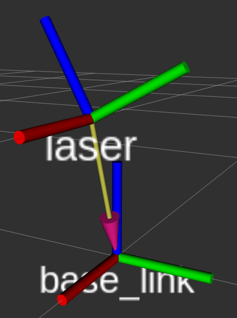
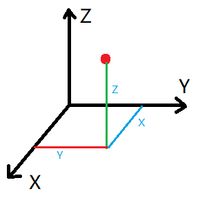

## 第〇章 ROS安装

### 1.自动安装ROS

普通安装方式十分繁琐，而且下载链接容易被墙，推荐用国内镜像源结合鱼香ros一键安装!

参考教程网站：<https://azitide.github.io/post/ubuntu_ROS.html>

网址

[清华开源镜像](https://mirrors.tuna.tsinghua.edu.cn/)

#### 一、配置软件源

1.首先我们要知道自己的电脑的cpu是什么架构的

**英特尔（intel）一般是x86架构，锐龙（amd）一般是arm架构**，当然英特尔也有amd架构，但在少部分，因为双方都有授权，所以各自都有对方架构的少部分芯片,还有一些小众的架构如PowerPC(ppc64el)、RISC-V(riscv64) 和 S390x 等架构，这些架构的设备用ubuntu-ports镜像的软件源即可

2.进去对应的架构的软件源

- [ubuntu | 镜像站使用帮助 | 清华大学开源软件镜像站 | x86](https://mirrors.tuna.tsinghua.edu.cn/help/ubuntu/)

    与

- [ubuntu-ports | 镜像站使用帮助 | 清华大学开源软件镜像站 | arm](https://mirror.tuna.tsinghua.edu.cn/help/ubuntu-ports/)

3.选择对应的版本

[](https://z1.ax1x.com/2023/10/12/piSM6RP.png)

设置好后，随即文本框中会生成你需要的 **sources.list** 文件内容，一会用到。

然后打开 Ubuntu 的终端，依次输入下面的命令

1、

```none
sudo apt update
```

2、

```none
cp /etc/apt/sources.list ~/Desktop
```

3、

```none
sudo gedit /etc/apt/sources.list
```

三条命令都输完后会打开一个文件内容，

把里面的全删掉，然后复制刚才网页生成的文本框内容粘贴上去，保存文件，退出

#### 二、安装ROS

###### 一键安装

这里我们用小鱼的大佬的鱼香ROS 一键安装

打开ubuntu终端，输入：

```none
wget http://fishros.com/install -O fishros && . fishros
```

然后我们输入 **1** 一键安装 –> 不更换源安装 –> 选择你ubuntu版本对应的ros版本 –> 桌面版–> 进行安装

[](https://z1.ax1x.com/2023/10/12/piSMZ80.png)

##### 报错：

如报错，先检查网络原因，如没有问题，先用命令行更换源

```none
wget http://fishros.com/install -O fishros && . fishros
```

然后我们输入 **5** –> 删掉第三方源并更换国内源 –> 添加ros/ros2源–> 完成，重新执行”一键安装“；

###### ros1启动命令

1，然后新建一个终端，打开输入

```none
roscore
```

终端完成后 会显示 \[/rosout\], 这样成功了一半

2，再新建第二个终端，输入

```none
rosrun turtlesim turtlesim_node
```

它会打开一个蓝色屏幕的小乌龟在中间，成功了

3，再建第三个终端，输入：

```none
rosrun turtlesim turtle_teleop_key
```

鼠标要在第三个终端，就可以通过按下键盘的 ↑ ↓ ← →键来对小海龟进行控制了。

安装完成

###### ros2开启命令

ros2没有中心节点，不需要roscore！

1，新建终端

```none
ros2 run turtlesim turtlesim_node
```

2，另外开一个终端

```none
ros2 run turtlesim turtle_teleop_key
```

安装完成

#### 三、配置rosdep

这里我们用小鱼的大佬的 一键配置

打开ubuntu终端，输入：

```none
wget http://fishros.com/install -O fishros && . fishros
```

再输入 **3** 就一键配置了

完成

#### 四、更新系统环境

这里我们还是用小鱼的大佬的 一键配置

打开ubuntu终端，输入：

```none
wget http://fishros.com/install -O fishros && . fishros
```

再输入 **4** 就一键配置了

完成

到这里，我们的ROS已经安装完成，加油！

### 2.手动安装ROS

参考网址：[ubuntu系统安装ROS（手动版） (azitide.github.io)](https://azitide.github.io/post/ubuntu_ROS_shoudong.html)

#### 1.确认自己的ubuntu系统然后去确认ROS版本

| **Ubuntu** | **ROS1**   | 开始 | 维护到期 |
| ---------- | ---------- | ---- | -------- |
| 14.04 LTS  | indigo     | 2014 | 2019     |
| 16.04 LTS  | Kinetic    | 2016 | 2021     |
| 18.04 LTS  | Melodic    | 2018 | 2023     |
| 20.04 LTS  | **Noetic** | 2020 | 2025     |

与

| **Ubuntu** | **ROS2**            | 开始 | 维护到期 |
| ---------- | ------------------- | ---- | -------- |
| 20.04 LTS  | Foxy Fitzroy        | 2020 | 2023     |
| 20.04 LTS  | Galactic Geochelone | 2021 | 2022     |

| 20.04 LTS  
22.04 LTS | **Humble Hawksbill  
(Recommended)** | 2022 | 2027 |
| 22.04 LTS | **Iron Irwini** | 2023 | 2024 |

#### 2、更换源

（1）进去源网站

- [ros | 镜像站使用帮助 | 清华大学开源软件镜像站](https://mirror.tuna.tsinghua.edu.cn/help/ros/)

    与

- [ros2 | 镜像站使用帮助 | 清华大学开源软件镜像站](https://mirror.tuna.tsinghua.edu.cn/help/ros2/)

[](https://s11.ax1x.com/2023/12/31/piOhzlQ.png)

（2）打开**ubuntu终端**，输入命令行打开文件

```none
sudo gedit /etc/apt/sources.list.d/ros-latest.list
```

打开文件后，复制第2步的网址进去（如文件内有其他网址，可以删掉，只留一条）

（3）文件保存退出后，新开一个终端，输入第3步的命令行（注意里面是两条命令行，要分开输入）

#### 3、安装ROS本体

格式是：

```none
sudo apt install ros-”ROS版本“-desktop-full
```

以20.04版本的ROS1为例：

```none
sudo apt install ros-noetic-desktop-full
```

以22.04版本的ROS2为例：

```none
sudo apt install ros-Humble-desktop-full
```

#### 4、更新rosdep

```none
sudo rosdep init
```

```none
rosdep update
```

#### 5、设置环境变量：

格式：

```none
echo "source 《你的ros系统文件setup.sh存放位置》" >> ~/.bashrc
```

以20.04版本的ROS1为例：

```none
echo "source /opt/ros/noetic/setup.bash" >> ~/.bashrc
```

```none
source ~/.bashrc
```

#### 6、验证

##### ros1启动命令

分别开**三个终端**依次输入

```none
roscore
```

```none
rosrun turtlesim turtlesim_node
```

```none
rosrun turtlesim turtle_teleop_key
```

鼠标要在第三个终端，就可以通过按下键盘的 ↑ ↓ ← →键来对小海龟进行控制了，动起来便是成功了

##### ros2启动命令

ros2没有中心节点，不需要roscore！

第一个终端

```none
ros2 run turtlesim turtlesim_node
```

第二个终端

```none
ros2 run turtlesim turtle_teleop_key
```

 **python添加中文报错**

第二行加上		# coding:utf-8

**鼠标变为十字 无法点击**

```shell
ps -e | grep import
kill -9 21526(import的进程)
```


## 第一章 文件初始化

### 终端快捷键

```
Alt+Up                          //移动到上面的终端
Alt+Down                        //移动到下面的终端
Alt+Left                        //移动到左边的终端
Alt+Right                       //移动到右边的终端

Ctrl+Shift+X                    //最大化或恢复当前终端

Ctrl+Shift+W                    //关闭当前终端
Ctrl+Shift+Q                    //退出当前窗口，当前窗口的所有终端都将被关闭

Ctrl+Shift+O                    //水平分割终端
```

**python添加中文报错：**		第二行加上		# coding:utf-8		

**鼠标变为十字 无法点击**

```
ps -e | grep import
kill -9 21526(import的进程)
```

### 终端写代码

###### C++

```shell
#创建工作空间并初始化
mkdir -p 自定义空间名称/src
cd 自定义空间名称
catkin_make		#编译

#进入 src 创建 ros 包并添加依赖
cd src
catkin_create_pkg 自定义ROS包名 roscpp rospy std_msgs

#进入 ros 包的 src 目录编辑源文件
cd 自定义的包
gedit helloworld.cpp
```

```c++
#include "ros/ros.h"

int main(int argc, char *argv[])
{
    //执行 ros 节点初始化
    ros::init(argc,argv,"hello");
    //创建 ros 节点句柄(非必须)
    ros::NodeHandle n;
    //控制台输出 hello world
    ROS_INFO("hello world!");
    return 0;
}
```

```cmake
#编辑 ros 包下的 Cmakelist.txt文件
add_executable(步骤3的源文件名
  src/步骤3的源文件名.cpp
)
target_link_libraries(步骤3的源文件名
  ${catkin_LIBRARIES}
)
```

```shell
#进入工作空间目录并编译，窗口1
cd 自定义空间名称
catkin_make
```

```shell
#重新开一个窗口2，启动ros核心
roscore
```

```shell
#回到窗口1
cd 工作空间
source ./devel/setup.bash		#刷新路径，让系统知道ROS 工作空间位置、可执行文件和脚本。
rosrun 包名 C++节点		#运行

##命令行输出: HelloWorld!

##PS:进入家目录的隐藏文件：.bashrc文件
##末尾添加source ~/工作空间/devel/setup.bash，更加方便
```

###### python

```shell
cd ros包
mkdir scripts
cd scripts
gedit hello.py
```

```python
#! /usr/bin/env python		##解释器路径
# coding:utf-8						##防止中文注释报错
"""
    Python 版 HelloWorld
"""
import rospy					#输入包

if __name__ == "__main__":
    rospy.init_node("Hello")					#节点初始化
    rospy.loginfo("Hello World!!!!")		#日志输出
```

```shell
chmod +x 自定义文件名.py
```

```cmake
#编辑 ros 包下的 CamkeList.txt 文件
catkin_install_python(PROGRAMS scripts/自定义文件名.py
  DESTINATION ${CATKIN_PACKAGE_BIN_DESTINATION}
)
```

```shell
#进入工作空间目录并编译，窗口1
cd 自定义空间名称
catkin_make
```

```shell
#重新开一个窗口2，启动ros核心
roscore
```

```shell
#窗口1 
cd 工作空间
source ./devel/setup.bash
rosrun 包名 自定义文件名.py

##输出结果:Hello World!!!!
```

### VScode写代码

```shell
mkdir -p xxx_ws/src(必须得有 src)		#创建 ROS 工作空间
cd xxx_ws
catkin_make

cd xxx_ws		# 启动 vscode
code .
```

 ctrl + shift + B 调用编译，选择:	catkin_make:build	； 会自动添加c_cpp_properties.json，settings.json。

 ctrl + shift + B 调用编译，选择：catkin_make:build 右边的齿轮，添加配置文件

```json
{
// 有关 tasks.json 格式的文档，请参见
    // https://go.microsoft.com/fwlink/?LinkId=733558
    "version": "2.0.0",
    "tasks": [
        {
            "label": "catkin_make:debug", //代表提示的描述性信息
            "type": "shell",  //可以选择shell或者process,如果是shell代码是在shell里面运行一个命令，如果是process代表作为一个进程来运行
            "command": "catkin_make",//这个是我们需要运行的命令
            "args": [],//如果需要在命令后面加一些后缀，可以写在这里，比如-DCATKIN_WHITELIST_PACKAGES=“pac1;pac2”
            "group": {"kind":"build","isDefault":true},
            "presentation": {
                "reveal": "always"//可选always或者silence，代表是否输出信息
            },
            "problemMatcher": "$msCompile"
        }
    ]
}

```

**创建 ROS 功能包**

选定./命名空间/src ,右击 ---> create catkin package,设置包名helloworld
添加依赖roscpp,rospy,std_msgs

**功能包的 src 下新建 cpp 文件**

```c++
/*
    控制台输出 HelloVSCode !!!
*/
#include "ros/ros.h"

int main(int argc, char *argv[])
{
    setlocale(LC_ALL,"");//解决输出中文乱码问题
    //执行节点初始化
    ros::init(argc,argv,"HelloVSCode");

    //输出日志
    ROS_INFO("Hello VSCode!!!哈哈哈哈哈哈哈哈哈哈");
    return 0;
}
```

**python 实现**

功能包 下新建 scripts 文件夹，添加 python 文件，**并添加可执行权限**

 **配置 CMakeLists.txt**

```cmake
##c++
add_executable(节点名称
  src/C++源文件名.cpp
)
target_link_libraries(节点名称
  ${catkin_LIBRARIES}
)
##python
catkin_install_python(PROGRAMS scripts/自定义文件名.py
  DESTINATION ${CATKIN_PACKAGE_BIN_DESTINATION}
)
```

**编译:** ctrl + shift + B

**执行**：启动内核，进入工作空间，刷新环境变量，运行

```shell
#窗口1
roscore

#窗口2
cd 工作空间
source ./devel/setup.bash
rosrun 包名 helloworld.py 或者 c++节点
```

### launch文件和计算图

用于一次性启动多个 ROS 节点

1. 选定功能包右击 ---> 添加文件夹，命名为 launch 

2. 选定 launch 文件夹右击 ---> 添加文件，命名为xxx.launch 

3. 编辑 xxx.launch 文件内容

    ```shell
    <launch>
        <node pkg="helloworld" type="demo_hello" name="hello" output="screen" />
        <node pkg="turtlesim" type="turtlesim_node" name="t1"/>
        <node pkg="turtlesim" type="turtle_teleop_key" name="key1" />
    </launch>
    ```

    - node ---> 包含的某个节点
    - pkg -----> 功能包
    - type ----> 被运行的节点文件
    - name --> 为节点命名，自定义
    - output-> 设置日志的输出目标

    终端运行
    
    ```shell
    roslaunch 包名 launch文件名
    #运行 launch 文件
    #运行结果: 一次性启动了多个节点
    ```

**计算图**

用于展示节点之间的关系

```shell
rqt_graph	#新终端输入
```

##     第二章 通信机制

### 2.0概述

ROS 中的基本通信机制主要有如下三种实现策略:

- 话题通信(发布订阅模式)，类似关注B站UP主，当他发视频时，我可以自动接收
- 服务通信(请求响应模式)，类似点击视频观看，只有点击才能观看
- 参数服务器(参数共享模式)，类似在线腾讯文档，多人填写查看信息

### 2.1话题通信


#### C++

**需求:**

> 编写发布订阅实现，要求发布方以1HZ(每秒1次)的频率发布文本消息，订阅方订阅消息并将消息内容打印输出。

**分析:**

在模型实现中，ROS master 不需要实现，而连接的建立也已经被封装了，需要关注的关键点有三个:

1. 发布方
2. 接收方
3. 数据(此处为普通文本)

**流程:**

1. 编写发布方实现；
2. 编写订阅方实现；
3. 编辑配置文件；
4. 编译并执行。

```shell
mkdir -p ws/src		#创建 ROS 工作空间
cd ws
catkin_make	#编译，初始化ROS空间

#进入家目录的隐藏文件：.bashrc		末尾添加:
source ~/工作空间/devel/setup.bash

cd ws		# 启动 vscode
code .
```

 ctrl + shift + B 调用编译，选择：catkin_make:build 右边的齿轮，添加配置文件

```json
{
// 有关 tasks.json 格式的文档，请参见
    // https://go.microsoft.com/fwlink/?LinkId=733558
    "version": "2.0.0",
    "tasks": [
        {
            "label": "catkin_make:debug", //代表提示的描述性信息
            "type": "shell",  //可以选择shell或者process,如果是shell代码是在shell里面运行一个命令，如果是process代表作为一个进程来运行
            "command": "catkin_make",//这个是我们需要运行的命令
            "args": [],//如果需要在命令后面加一些后缀，可以写在这里，比如-DCATKIN_WHITELIST_PACKAGES=“pac1;pac2”
            "group": {"kind":"build","isDefault":true},
            "presentation": {
                "reveal": "always"//可选always或者silence，代表是否输出信息
            },
            "problemMatcher": "$msCompile"
        }
    ]
}
```

右击vscode中src文件夹-->creat catkin package

```shell
demo01 #添加包名
roscpp rospy std_msgs	#添加依赖
```

在demo01下的src中，新建pub.cpp，即发布方

```cpp
/*
    需求: 实现基本的话题通信，一方发布数据，一方接收数据，
         实现的关键点:
         1.发送方
         2.接收方
         3.数据(此处为普通文本)

         PS: 二者需要设置相同的话题

    消息发布方:
        循环发布信息:HelloWorld 后缀数字编号

    实现流程:
        1.包含头文件 
        2.初始化 ROS 节点:命名(唯一)
        3.实例化 ROS 句柄
        4.实例化 发布者 对象
        5.组织被发布的数据，并编写逻辑发布数据
*/
// 1.包含头文件 
#include "ros/ros.h"
#include "std_msgs/String.h" //普通文本类型的消息
#include <sstream>//拼接字符串

int main(int argc, char  *argv[])
{   
    //设置编码，防止中文乱码
    setlocale(LC_ALL,"");

    //2.初始化 ROS 节点:命名(唯一)
    // 参数1和参数2 后期为节点传值会使用
    // 参数3 是节点名称，是一个标识符，需要保证运行后，在 ROS 网络拓扑中唯一
    ros::init(argc,argv,"talker");
    //3.实例化 ROS 句柄
    ros::NodeHandle nh;//该类封装了 ROS 中的一些常用功能

    //4.实例化 发布者 对象
    //泛型: 发布的消息类型，字符串
    //参数1: 要发布到的话题
    //参数2: 队列中最大保存的消息数，超出此阀值时，先进的先销毁(时间早的先销毁)
    ros::Publisher pub = nh.advertise<std_msgs::String>("chatter",10);

    //5.组织被发布的数据，并编写逻辑发布数据
    //数据(动态组织)
    std_msgs::String msg;
    // msg.data = "你好啊！！！";
    std::string msg_front = "Hello 你好！"; //消息前缀
    int count = 0; //消息计数器

    ros::Rate r(1);    //逻辑(一秒1次)
    ros::Duration(3.0).sleep(); //延迟3秒发送，用于和管理者通信，避免接收者错过第一条数据

    //节点不死
    while (ros::ok())
    {
        //使用 stringstream 拼接字符串与编号
        std::stringstream ss;
        ss << msg_front << count;
        msg.data = ss.str();
        //发布消息
        pub.publish(msg);
        //加入调试，打印发送的消息
        ROS_INFO("发送的消息:%s",msg.data.c_str());

        //根据前面制定的发送频率自动休眠 休眠时间 = 1/频率；
        r.sleep();
        count++;//循环结束前，让 count 自增
        //回调函数，目前暂无应用
        ros::spinOnce();
    }
    return 0;
}
```

在demo01下的src中，新建sub.cpp，即订阅方

```cpp
/*
    需求: 实现基本的话题通信，一方发布数据，一方接收数据，
         实现的关键点:
         1.发送方
         2.接收方
         3.数据(此处为普通文本)

    消息订阅方:
        订阅话题并打印接收到的消息

    实现流程:
        1.包含头文件 
        2.初始化 ROS 节点:命名(唯一)
        3.实例化 ROS 句柄
        4.实例化 订阅者 对象
        5.处理订阅的消息(回调函数)
        6.设置循环调用回调函数
*/
// 1.包含头文件 
#include "ros/ros.h"
#include "std_msgs/String.h"

void doMsg(const std_msgs::String::ConstPtr& msg_p){//引用形式，传入消息指针
    ROS_INFO("我听见:%s",msg_p->data.c_str());//打印消息
    // ROS_INFO("我听见:%s",(*msg_p).data.c_str());
}

int main(int argc, char  *argv[])
{
    setlocale(LC_ALL,"");
    //2.初始化 ROS 节点:命名(唯一)
    ros::init(argc,argv,"listener");
    //3.实例化 ROS 句柄
    ros::NodeHandle nh;
    //4.实例化 订阅者 对象
    ros::Subscriber sub = nh.subscribe<std_msgs::String>("chatter",10,doMsg);//尖括号可省略
    //5.处理订阅的消息(回调函数)

    //6.设置循环调用回调函数
    ros::spin();//循环读取接收的数据，并调用回调函数doMsg处理
    return 0;
}
```

配置 demo01/CMakeLists.txt

```cmake
add_executable(pub		#136行
  src/pub.cpp
)
add_executable(sub
  src/sub.cpp
)

target_link_libraries(pub		#150行
  ${catkin_LIBRARIES}
)
target_link_libraries(sub
  ${catkin_LIBRARIES}
)
```

ctrl shift + B编译；ctrl alt + T新建终端

```shell
roscore	#启动核心
```

分割终端，运行发布者节点

```shell
cd ws
rosrun demo01 pub	#rosrun 包名	节点名
```

再次分割终端，运行订阅者节点

```shell
rosrun demo01 sub
```

打印话题小工具

```shell
rostopic echo chatter	#rostopic echo 话题
```

查看计算图

```shell
rqt_graph 		#新终端输入
```

#### Python

**流程:**

1. 编写发布方实现；
2. 编写订阅方实现；
3. 为python文件添加可执行权限；
4. 编辑配置文件；
5. 编译并执行。

在ws/demo01下新建文件夹scripts，其下新建pub.py，发布方程序

```python
#! /usr/bin/env python
# -*- coding: utf-8 -*-		
# 指定编码格式为utf-8
"""
    需求: 实现基本的话题通信，一方发布数据，一方接收数据，
         实现的关键点:
         1.发送方
         2.接收方
         3.数据(此处为普通文本)

         PS: 二者需要设置相同的话题

    消息发布方:
        循环发布信息:HelloWorld 后缀数字编号

    实现流程:
        1.导包 
        2.初始化 ROS 节点:命名(唯一)
        3.实例化 发布者 对象
        4.组织被发布的数据，并编写逻辑发布数据
"""
#1.导包 
import rospy
from std_msgs.msg import String

if __name__ == "__main__":
    #2.初始化 ROS 节点:命名(唯一)
    rospy.init_node("talker_p")
    #3.实例化 发布者 对象
    pub = rospy.Publisher("chatter_p",String,queue_size=10)
    #4.组织被发布的数据，并编写逻辑发布数据
    msg = String()  #创建 msg 对象
    msg_front = "hello 你好"
    count = 0  #计数器 
    # 设置循环频率
    rate = rospy.Rate(1)
    rospy.sleep(3)  #延迟3秒发送数据，防止订阅方接收不到
    while not rospy.is_shutdown():

        #拼接字符串
        msg.data = msg_front + str(count)

        pub.publish(msg)
        rate.sleep()
        rospy.loginfo("写出的数据:%s",msg.data)
        count += 1
```

scripts下新建sub.py,订阅方脚本

```python
#! /usr/bin/env python
# -*- coding: utf-8 -*-
"""
    需求: 实现基本的话题通信，一方发布数据，一方接收数据，
         实现的关键点:
         1.发送方
         2.接收方
         3.数据(此处为普通文本)

    消息订阅方:
        订阅话题并打印接收到的消息

    实现流程:
        1.导包 
        2.初始化 ROS 节点:命名(唯一)
        3.实例化 订阅者 对象
        4.处理订阅的消息(回调函数)
        5.设置循环调用回调函数
"""
#1.导包 
import rospy
from std_msgs.msg import String

def doMsg(msg):
    rospy.loginfo("I heard:%s",msg.data)

if __name__ == "__main__":
    #2.初始化 ROS 节点:命名(唯一)
    rospy.init_node("listener_p")
    #3.实例化 订阅者 对象
    sub = rospy.Subscriber("chatter_p",String,doMsg,queue_size=10)
    #4.处理订阅的消息(回调函数)
    #5.设置循环调用回调函数
    rospy.spin()
```

终端下进入 scripts 执行:	

```shell
chmod +x *.py
```

配置CMakeLists.txt

```cmake
#165行
catkin_install_python(PROGRAMS
  scripts/pub.py
  scripts/sub.py
  DESTINATION ${CATKIN_PACKAGE_BIN_DESTINATION}
)
```

打开终端，执行节点

```
roscore
```

```shell
cd ws
rosrun demo01 pub.py
```

```shell
rosrun demo01 sub.py
```

**不同编译语言，交互通信**

话题名称改为相同就能实现

C++发布数据，pub.cpp

```cpp
 ros::Publisher pub = nh.advertise<std_msgs::String>("chatter",10);
//话题名称：chatter
```

python接收数据,sub.py

```python
sub = rospy.Subscriber("chatter",String,doMsg,queue_size=10)
#话题名称：chatter
```

ctrl shift + B 编译

打开终端，执行节点

```
roscore
```

```shell
cd ws
rosrun demo01 pub
```

```shell
rosrun demo01 sub.py
```

#### 自定义消息 数据类型 msg

即传输的一段消息可包含多种类似的数据，常用于储存激光雷达数据：长度和角度

- int8, int16, int32, int64 (或者无符号类型: uint*)
- float32, float64
- string
- time, duration
- other msg files
- variable-length array[] and fixed-length array[C]

ROS中还有一种特殊类型：`Header`，标头包含时间戳和ROS中常用的坐标帧信息。

**1 定义msg文件**

ws/src/demo01下新建文件夹msg，新建Person.msg

```msg
string name
uint16 age
float64 height
```

**2 编辑配置文件**

**demo01/package.xml**中添加编译依赖与执行依赖

```xml
  <build_depend>message_generation</build_depend>
  <exec_depend>message_runtime</exec_depend>
  <!-- 
  exce_depend 以前对应的是 run_depend 现在非法
  -->
```

**demo01/CMakeLists.txt**编辑 msg 相关配置

```cmake
# 编译时的依赖文件
find_package(catkin REQUIRED COMPONENTS
  roscpp
  rospy
  std_msgs
  message_generation
)

# 配置 msg 源文件
add_message_files(
  FILES
  Person.msg
)

# 生成消息时依赖于 std_msgs
generate_messages(
  DEPENDENCIES
  std_msgs
)

#执行时依赖
catkin_package(
#  INCLUDE_DIRS include
#  LIBRARIES demo02_talker_listener
  CATKIN_DEPENDS roscpp rospy std_msgs message_runtime
#  DEPENDS system_lib
)
```

**3 编译**

ctrl shift + B 后，出现

C++ 需要调用的中间文件(.../工作空间/devel/include/包名/xxx.h)

Python 需要调用的中间文件(.../工作空间/devel/lib/python3/dist-packages/包名/msg)

后续调用相关 msg 时，是从这些中间文件调用的

#### C++调用自定义msg

**vscode配置**

 ws/.vscode/c_cpp_properties.json 的 includepath属性，设置头文件路径

```json
{
  "configurations": [
    {
      "browse": {
        "databaseFilename": "${default}",
        "limitSymbolsToIncludedHeaders": false
      },
      "includePath": [
        "/opt/ros/melodic/include/**",
        "/usr/include/**",
        "/home/book/ws/devel/include/demo01/**"//设置头文件路径
      ],
      "name": "ROS",
      "intelliSenseMode": "gcc-x64",
      "compilerPath": "/usr/bin/gcc",
      "cStandard": "gnu11",
      "cppStandard": "c++14"
    }
  ],
  "version": 4
}
```

ws/src/demo01/src新建pub_person.cpp

```cpp
/*
    需求: 循环发布人的信息
*/

#include "ros/ros.h"
#include "demo01/Person.h"//可能会报错，但不用管

int main(int argc, char *argv[])
{
    setlocale(LC_ALL,"");

    //1.初始化 ROS 节点
    ros::init(argc,argv,"talker_person");

    //2.创建 ROS 句柄
    ros::NodeHandle nh;

    //3.创建发布者对象
    ros::Publisher pub = nh.advertise<demo01::Person>("chatter_person",1000);

    //4.组织被发布的消息，编写发布逻辑并发布消息
    demo01::Person p;
    p.name = "sunwukong";
    p.age = 2000;
    p.height = 1.45;

    ros::Rate r(1);
    while (ros::ok())
    {
        pub.publish(p);
        p.age += 1;
        ROS_INFO("我叫:%s,今年%d岁,高%.2f米", p.name.c_str(), p.age, p.height);

        r.sleep();
        ros::spinOnce();
    }

    return 0;
}
```

ws/src/demo01/src新建sub_person.cpp

```cpp
/*
    需求: 订阅人的信息
*/

#include "ros/ros.h"
#include "demo01/Person.h"//可能会报错，但不用管

void doPerson(const demo01::Person::ConstPtr& person_p){
    ROS_INFO("订阅的人信息:%s, %d, %.2f", person_p->name.c_str(), person_p->age, person_p->height);
}

int main(int argc, char *argv[])
{   
    setlocale(LC_ALL,"");

    //1.初始化 ROS 节点
    ros::init(argc,argv,"listener_person");
    //2.创建 ROS 句柄
    ros::NodeHandle nh;
    //3.创建订阅对象
    ros::Subscriber sub = nh.subscribe<demo01::Person>("chatter_person",10,doPerson);

    //4.回调函数中处理 person

    //5.ros::spin();
    ros::spin();    
    return 0;
}
```

配置CMakeLists.txt

```cmake
add_executable(pub_person src/pub_person.cpp)
add_executable(sub_person src/sub_person.cpp)

# 编译前，先编译msg文件，然后让源文件调用msg
add_dependencies(pub_person ${PROJECT_NAME}_generate_messages_cpp)
add_dependencies(sub_person ${PROJECT_NAME}_generate_messages_cpp)

target_link_libraries(pub_person
  ${catkin_LIBRARIES}
)
target_link_libraries(sub_person
  ${catkin_LIBRARIES}
)
```

编译，启动roscore，分别启动两个节点，可以用rostopic echo talker_person查看发布的消息,用rqt_graph查看节点关系

#### py调用自定义msg

vscode settings.json 配置

```json
{
    "python.autoComplete.extraPaths": [
        "/opt/ros/melodic/lib/python2.7/dist-packages",
        "/home/book/ws/devel/lib/python2.7/dist-packages"//包含自定义msg的包
    ],
    "python.analysis.extraPaths": [
        "/opt/ros/melodic/lib/python2.7/dist-packages"
    ]
}
```

发布方脚本：pub_person.py

```python
#! /usr/bin/env python
# -*- coding: utf-8 -*-
"""
    发布方:
        循环发送消息

"""
import rospy
from demo01.msg import Person


if __name__ == "__main__":
    #1.初始化 ROS 节点
    rospy.init_node("talker_person_p")
    #2.创建发布者对象
    pub = rospy.Publisher("chatter_person",Person,queue_size=10)
    #3.组织消息
    p = Person()
    p.name = "葫芦瓦"
    p.age = 18
    p.height = 0.75

    #4.编写消息发布逻辑
    rate = rospy.Rate(1)
    while not rospy.is_shutdown():
        pub.publish(p)  #发布消息
        rate.sleep()  #休眠
        rospy.loginfo("姓名:%s, 年龄:%d, 身高:%.2f",p.name, p.age, p.height)
```

订阅方脚本：sub_person.py

```python
#! /usr/bin/env python
# -*- coding: utf-8 -*-
"""
    订阅方:
        订阅消息

"""
import rospy
from demo01.msg import Person

def doPerson(p):
    rospy.loginfo("接收到的人的信息:%s, %d, %.2f",p.name, p.age, p.height)


if __name__ == "__main__":
    #1.初始化节点
    rospy.init_node("listener_person_p")
    #2.创建订阅者对象
    sub = rospy.Subscriber("chatter_person",Person,doPerson,queue_size=10)
    rospy.spin() #4.循环
```

scripts文件夹下打开终端，改权限

```shell
chmod +x *.py
```

配置 CMakeLists.txt

```
catkin_install_python(PROGRAMS
  scripts/pub_person.py
  scripts/sub_person.py
  DESTINATION ${CATKIN_PACKAGE_BIN_DESTINATION}
)
```

```shell
roscore	#启动核心
```

```shell
cd ws
rosrun demo01 pub_person.py		#进入工作空间，启动发布节点
```

```shell
rosrun demo01 sub_person.py		#订阅节点
```

```shell
rpt_graph												#关系图
```

### 2.2服务通信

概念：A节点向B节点发送请求，B节点回复响应

理论模型：B节点作为服务端，先向管理方注册话题和地址，当A节点向管理方注册话题后，管理方向A发送B的地址，然后A可以与B进行请求，后B响应

#### 自定义服务消息 数据类型 srv

**需求:**

> 服务通信中，客户端提交两个整数至服务端，服务端求和并响应结果到客户端，请创建服务器与客户端通信的数据载体。

右击ws/src，创建catkin包，包名：plumbing_server_client；依赖包：roscpp rospy stdmsgs

plumbing_server_client中，新建文件夹srv，用于放置服务通信自定义数据，新建AddInts.srv;请求和响应使用`---`分割

```shell
# 客户端请求时发送的两个数字
int32 num1
int32 num2
---
# 服务器响应发送的数据
int32 sum
```

**编辑配置文件**

package.xml

```xml
  <build_depend>message_generation</build_depend>
  <exec_depend>message_runtime</exec_depend>
  <!-- 
  exce_depend 以前对应的是 run_depend 现在非法
  -->
```

CMakeLists.txt

```cmake
find_package(catkin REQUIRED COMPONENTS
  roscpp
  rospy
  std_msgs
  message_generation	# 需要加入 message_generation,必须有 std_msgs
)

add_service_files(
  FILES
  AddInts.srv	#
)

generate_messages(
  DEPENDENCIES
  std_msgs	#
)

catkin_package(
 CATKIN_DEPENDS roscpp rospy std_msgs message_runtime	#
)

```

ctrl shift b编译；发现ws/devel/include/plumbing_server_client出现三个.h头文件，用于cpp程序

ws/devel/lib/plumbing_server_client/srv出现三个.py文件,用于python程序

#### C++	服务通信

**服务端节点**

.vscode/c_cpp_properties.json配置

```json
{
  "configurations": [
    {
      "browse": {
        "databaseFilename": "${default}",
        "limitSymbolsToIncludedHeaders": true
      },
      "includePath": [
        "/opt/ros/melodic/include/**",
        "/usr/include/**",
        "/home/book/ws/devel/include/**"	//加这里
      ],
      "name": "ROS",
      "intelliSenseMode": "gcc-x64",
      "compilerPath": "/usr/bin/gcc",
      "cStandard": "gnu11",
      "cppStandard": "c++14"
    }
  ],
  "version": 4
}
```

plumbing_server_client 功能包中src文件夹新建demo01_server.cpp

```cpp
/*
    需求: 
        编写两个节点实现服务通信，客户端节点需要提交两个整数到服务器
        服务器需要解析客户端提交的数据，相加后，将结果响应回客户端，
        客户端再解析

    服务器实现:
        1.包含头文件
        2.初始化 ROS 节点
        3.创建 ROS 句柄
        4.创建 服务 对象
        5.回调函数处理请求并产生响应
        6.由于请求有多个，需要调用 ros::spin()
*/
#include "ros/ros.h"
#include "plumbing_server_client/AddInts.h"

// bool 返回值由于标志是否处理成功
bool doReq(plumbing_server_client::AddInts::Request& req,
          plumbing_server_client::AddInts::Response& resp){
    int num1 = req.num1;
    int num2 = req.num2;

    ROS_INFO("服务器接收到的请求数据为:num1 = %d, num2 = %d",num1, num2);

    //逻辑处理
    if (num1 < 0 || num2 < 0)
    {
        ROS_ERROR("提交的数据异常:数据不可以为负数");
        return false;
    }

    //如果没有异常，那么相加并将结果赋值给 resp
    resp.sum = num1 + num2;
    return true;
}

int main(int argc, char *argv[])
{
    setlocale(LC_ALL,"");
    // 2.初始化 ROS 节点
    ros::init(argc,argv,"AddInts_Server");//节点名称
    // 3.创建 ROS 句柄
    ros::NodeHandle nh;
    // 4.创建 服务 对象
    ros::ServiceServer server = nh.advertiseService("AddInts",doReq);//话题名称，处理函数
    ROS_INFO("服务已经启动....");
    //     5.回调函数处理请求并产生响应
    //     6.由于请求有多个，需要调用 ros::spin()
    ros::spin();
    return 0;
}
```

配置CMakeLists.txt

```cmake
add_executable(demo01_server src/demo01_server.cpp)
add_dependencies(demo01_server ${PROJECT_NAME}_gencpp)
target_link_libraries(demo01_server
  ${catkin_LIBRARIES}
)
```

ctrl shift b 编译，打开终端

```
roscore
```

```shell
cd ws
source ./devel/setup.bash
rosrun plumbing_server_client demo01_server 

#[ INFO] [1724064193.753397254]: 服务已经启动....
```

```shell
rosservice call AddInts 	#按tab键
"num1: 1
num2: 5" 

#sum: 6

#[ INFO] [1724069676.954949735]: 服务器接收到的请求数据为:num1 = 1, num2 = 5
```

**客户端节点**

plumbing_server_client 功能包中src文件夹新建demo02_client.cpp

```cpp
/*
    需求: 
        编写两个节点实现服务通信，客户端节点需要提交两个整数到服务器
        服务器需要解析客户端提交的数据，相加后，将结果响应回客户端，
        客户端再解析

    服务器实现:
        1.包含头文件
        2.初始化 ROS 节点
        3.创建 ROS 句柄
        4.创建 客户端 对象
        5.请求服务，接收响应

    实现动态参数提交：
        1.格式：rosrun xxx xxx 12 34
        2.节点执行时，获取命令中的参数，并组织n进 request
        共传入3个参数，程序名 12 34；故argc = 3;*argv[1]=12，*argv[2]=34
       
    问题：
        如果先启动客户端，没启动服务端，会请求异常
    解决：
        在ros中内部设置相关函数，这些函数可以让客户端挂起，等待服务端启动
*/
// 1.包含头文件
#include "ros/ros.h"
#include "plumbing_server_client/AddInts.h"

int main(int argc, char *argv[])
{
    setlocale(LC_ALL,"");

    // 调用时动态传值
    if (argc != 3)
    {
        ROS_ERROR("请提交两个整数");
        return 1;//结束main函数
    }

    // 2.初始化 ROS 节点
    ros::init(argc,argv,"AddInts_Client");//客户端
    // 3.创建 ROS 句柄
    ros::NodeHandle nh;
    // 4.创建 客户端 对象
    ros::ServiceClient client = nh.serviceClient<plumbing_server_client::AddInts>("AddInts");
    //等待服务启动成功
    //这是一个阻塞式函数，只有服务启动成功后才会继续执行
    //方式1
    ros::service::waitForService("AddInts");
    //方式2
    // client.waitForExistence();
    // 5.组织请求数据
    //实例化AddInts类对象，里面封装了客户端的请求数据和服务端的响应数据
    plumbing_server_client::AddInts ai;
    ai.request.num1 = atoi(argv[1]);//将字符串地址转化为int型数据
    ai.request.num2 = atoi(argv[2]);
    // 6.发送请求,返回 bool 值，标记是否成功
    bool flag = client.call(ai);//ros自带函数
    // 7.处理响应
    if (flag)
    {
        ROS_INFO("请求正常处理,响应结果:%d",ai.response.sum);
    }
    else
    {
        ROS_ERROR("请求处理失败....");
        return 1;
    }

    return 0;
}
```

配置CMakeLists.txt

```cmake
 add_executable(demo02_client src/demo02_client.cpp)
 add_dependencies(demo02_client ${PROJECT_NAME}_gencpp)
 target_link_libraries(demo02_client  ${catkin_LIBRARIES})
```

编译后，启动终端

```shell
rosrun plumbing_server_client demo02_client
[ERROR] [1724074832.948562698]: 请提交两个整数

plumbing_server_client demo02_client 1 2
[ INFO] [1724074885.084971520]: 请求正常处理,响应结果:3
```

#### py	服务通信

**vscode/settings.json配置**

```json
{
    "python.autoComplete.extraPaths": [
        "/opt/ros/melodic/lib/python2.7/dist-packages",
        "/home/book/ws/devel/lib/python2.7/dist-packages"	//加这里
    ],
    "python.analysis.extraPaths": [
        "/opt/ros/melodic/lib/python2.7/dist-packages"
    ]
}
```

**服务端**

ws/src/plumbing_server_client下新建文件夹scripts，新建文件demo01_server_p.py

```python
#! /usr/bin/env python
#-*- coding: utf-8 -*-
"""
    需求: 
        编写两个节点实现服务通信，客户端节点需要提交两个整数到服务器
        服务器需要解析客户端提交的数据，相加后，将结果响应回客户端，
        客户端再解析

    服务器端实现:
        1.导包
        2.初始化 ROS 节点
        3.创建服务对象
        4.回调函数处理请求并产生响应
        5.spin 函数

"""
# 1.导包
import rospy
from plumbing_server_client.srv import AddInts,AddIntsRequest,AddIntsResponse
# 回调函数的参数是请求对象，返回值是响应对象
def doReq(req):
    # 解析提交的数据
    sum = req.num1 + req.num2
    rospy.loginfo("提交的数据:num1 = %d, num2 = %d, sum = %d",req.num1, req.num2, sum)

    # 创建响应对象，赋值并返回
    # resp = AddIntsResponse()
    # resp.sum = sum
    resp = AddIntsResponse(sum)
    return resp


if __name__ == "__main__":
    # 2.初始化 ROS 节点
    rospy.init_node("addints_server_p")
    # 3.创建服务对象
    server = rospy.Service("AddInts",AddInts,doReq)# 话题名称 消息数据类型 处理函数
    rospy.loginfo("服务器已启动！")
    # 4.回调函数处理请求并产生响应
    # 5.spin 函数
    rospy.spin()
```

右击ws/src/plumbing_server_client/scripts，在终端打开

```shell
chmod +x *.py
```

配置CMakeLists.txt

```cmake
catkin_install_python(PROGRAMS		#167行
  scripts/demo01_server_p.py
  DESTINATION ${CATKIN_PACKAGE_BIN_DESTINATION}
)
```

编译后，打开终端

```shell
roscore
```

```shell
cd ws
rosrun plumbing_server_client demo01_server_p.py

# [INFO] [1724125496.827225]: 服务器已启动！
# [INFO] [1724125593.831271]: 提交的数据:num1 = 10, num2 = 20, sum = 30
```

```shell
rosservice call AddInts  #空格 tab
"num1: 10
num2: 20" 
#sum: 30
```

**客户端**

ws/src/plumbing_server_client/scripts，新建文件demo02_client_p.py

```python
#! /usr/bin/env python
# -*- coding: utf-8 -*-
"""
    需求: 
        编写两个节点实现服务通信，客户端节点需要提交两个整数到服务器
        服务器需要解析客户端提交的数据，相加后，将结果响应回客户端，
        客户端再解析

    客户端实现:
        1.导包
        2.初始化 ROS 节点
        3.创建请求对象
        4.发送请求
        5.接收并处理响应

    优化:
        加入数据的动态获取
"""
#1.导包
import rospy
from plumbing_server_client.srv import *    #自定义数据类型
import sys  #用于接收终端数据

if __name__ == "__main__":

    #优化实现，动态读取
    if len(sys.argv) != 3:
        rospy.logerr("请正确提交参数")
        sys.exit(1)

    # 2.初始化 ROS 节点
    rospy.init_node("AddInts_Client_p")#节点名称
    # 3.创建请求对象
    client = rospy.ServiceProxy("AddInts",AddInts)#话题名称，消息类型
    # 请求前，等待服务已经就绪
    # 方式1:
    # rospy.wait_for_service("AddInts")
    # 方式2
    client.wait_for_service()
    # 4.发送请求,接收并处理响应
    # 方式1
    # resp = client(3,4)
    # 方式2
    # resp = client(AddIntsRequest(1,5))
    # 方式3
    req = AddIntsRequest()
    # req.num1 = 100
    # req.num2 = 200 

    #优化，终端动态读取
    req.num1 = int(sys.argv[1])
    req.num2 = int(sys.argv[2]) 

    resp = client.call(req)
    rospy.loginfo("响应结果:%d",resp.sum)
```

右击ws/src/plumbing_server_client/scripts，在终端打开

```shell
chmod +x *.py
```

配置CMakeLists.txt

```cmake
catkin_install_python(PROGRAMS		#167行
  scripts/demo01_server_p.py
  scripts/demo02_client_p.py
  DESTINATION ${CATKIN_PACKAGE_BIN_DESTINATION}
)
```

编译后，打开终端

```shell
roscore
```

```shell
cd ws
rosrun plumbing_server_client demo02_client_p.py 12 34
# 挂起，等待服务器启动
#服务器启动结果：
# [INFO] [1724139177.098779]: 响应结果:46
```

```shell
rosrun plumbing_server_client demo01_server_p.py
# [INFO] [1724139176.873222]: 服务器已启动！
# [INFO] [1724139177.097307]: 提交的数据:num1 = 12, num2 = 34, sum = 46
```

### 2.3参数服务器

作为一个数据容器，方便多个节点调用与存储数据；适用于存在数据共享的应用场景，如无人车的尺寸和转弯半径可放在参数服务器，给全局路径规划和局部路径规划节点使用。

设置者向管理者发送数据，管理者会将数据存入一个列表，调用者可以向管理者请求数据

参数可使用数据类型:

- 32-bit integers	4个字节的整形
- booleans               布尔
- strings                    字符串
- doubles                  浮点
- iso8601 dates       国际标准时间
- lists                            列表 
- base64-encoded binary data        64位编码二进制数据
- 字典    

> 注意:参数服务器不是为高性能而设计的，因此最好用于存储静态的、非二进制的、简单数据

#### C++参数服务器

##### 参数设置与修改

新建功能包：plumbing_param_server

plumbing_param_server/src中新建文件：demo01_param_det.cpp

```cpp
/*
    参数服务器操作之新增与修改(二者API一样)_C++实现:
    在 roscpp 中提供了两套 API 实现参数操作
    ros::NodeHandle
        setParam("键",值)
    ros::param
        set("键","值")

    示例:分别设置整形、浮点、字符串、bool、列表、字典等类型参数
        修改(相同的键，不同的值)
*/
#include "ros/ros.h"

int main(int argc, char *argv[])
{
    ros::init(argc,argv,"set_update_param");

    std::vector<std::string> stus;
    stus.push_back("zhangsan");
    stus.push_back("李四");
    stus.push_back("王五");
    stus.push_back("孙大脑袋");

    std::map<std::string,std::string> friends;
    friends["guo"] = "huang";
    friends["yuang"] = "xiao";

    //NodeHandle--------------------------------------------------------
    ros::NodeHandle nh;
    nh.setParam("nh_int",10); //整型
    nh.setParam("nh_double",3.14); //浮点型
    nh.setParam("nh_bool",true); //bool
    nh.setParam("nh_string","hello NodeHandle"); //字符串
    nh.setParam("nh_vector",stus); // vector
    nh.setParam("nh_map",friends); // map

    //修改演示(相同的键，不同的值)
    nh.setParam("nh_int",10000);

    //param--------------------------------------------------------
    ros::param::set("param_int",20);
    ros::param::set("param_double",3.14);
    ros::param::set("param_string","Hello Param");
    ros::param::set("param_bool",false);
    ros::param::set("param_vector",stus);
    ros::param::set("param_map",friends);

    //修改演示(相同的键，不同的值)
    ros::param::set("param_int",20000);

    return 0;
}
```

配置cmakelists

```cmake
add_executable(demo01_param_set src/demo01_param_set.cpp)

target_link_libraries(demo01_param_set
  ${catkin_LIBRARIES}
)
```

编译后，终端启动

```
roscore
```

```shell
cd ws
rosrun plumbing_param_server demo01_param_set
```

```shell
rosparam list
/nh_bool
/nh_double
/nh_int
/nh_map/guo
/nh_map/yuang
/nh_string
/nh_vector
/param_bool
/param_double
/param_int
/param_map/guo
/param_map/yuang
/param_string
/param_vector
/rosdistro
/roslaunch/uris/host_100ask__39713
/rosversion
/run_id

rosparam get /nh_int
10000
```

##### 参数查找

plumbing_param_server/src中新建文件：demo02_param_get.cpp

```cpp
/*
    参数服务器操作之查询_C++实现:
    在 roscpp 中提供了两套 API 实现参数操作
    ros::NodeHandle

        param(键,默认值) 
            存在，返回键对应的值，否则返回默认值

        getParam(键,存储结果的变量)
            存在,返回 true,且将值赋值给参数2
            若果键不存在，那么返回值为 false，且不为参数2赋值

        getParamCached键,存储结果的变量)--从缓存中提取，提高变量获取效率
            存在,返回 true,且将值赋值给参数2
            若果键不存在，那么返回值为 false，且不为参数2赋值

        getParamNames(std::vector<std::string>)
            获取所有的键,并存储在参数 vector 中 

        hasParam(键)
            是否包含某个键，存在返回 true，否则返回 false

        searchParam(参数1：被搜索的键，参数2：结果)
            搜索键，参数2存储搜索结果的变量，如果键存在则键名被存入参数2，否则参数2为空

    ros::param ----- 与 NodeHandle 类似
*/

#include "ros/ros.h"

int main(int argc, char *argv[])
{
    setlocale(LC_ALL,"");//防止中文乱码
    ros::init(argc,argv,"get_param");//初始化节点（节点名称）

    //NodeHandle--------------------------------------------------------
    
    ros::NodeHandle nh;
    
    // param 函数
    int res1 = nh.param("nh_int",100); // 键存在
    int res2 = nh.param("nh_int2",100); // 键不存在
    ROS_INFO("param获取结果:%d,%d",res1,res2);
    //param获取结果:10000,100


    // getParam 函数
    int nh_int_value;
    double nh_double_value;
    bool nh_bool_value;
    std::string nh_string_value;
    std::vector<std::string> stus;
    std::map<std::string, std::string> friends;

    nh.getParam("nh_int",nh_int_value);
    nh.getParam("nh_double",nh_double_value);
    nh.getParam("nh_bool",nh_bool_value);
    nh.getParam("nh_string",nh_string_value);
    nh.getParam("nh_vector",stus);
    nh.getParam("nh_map",friends);

    ROS_INFO("getParam获取的结果:%d,%.2f,%s,%d",
            nh_int_value,
            nh_double_value,
            nh_string_value.c_str(),
            nh_bool_value
            );//10000,3.14,hello NodeHandle,1
    for (auto &&stu : stus)//遍历stus，每次循环给stu赋值一次
    {
        ROS_INFO("stus 元素:%s",stu.c_str());//用c风格字符串形式输出        
    }
    /*
    [ INFO] [1724151841.944857405]: stus 元素:zhangsan
    [ INFO] [1724151841.944888085]: stus 元素:李四
    [ INFO] [1724151841.944892990]: stus 元素:王五
    [ INFO] [1724151841.944902557]: stus 元素:孙大脑袋
    */

    for (auto &&f : friends)
    {
        ROS_INFO("map 元素:%s = %s",f.first.c_str(), f.second.c_str());
    }
    /*
    [ INFO] [1724151841.944908374]: map 元素:guo = huang
    [ INFO] [1724151841.944913013]: map 元素:yuang = xiao
    */

    // getParamCached()
    nh.getParamCached("nh_int",nh_int_value);
    ROS_INFO("通过缓存获取数据:%d",nh_int_value);
    //通过缓存获取数据:10000

    //getParamNames()
    std::vector<std::string> param_names1;
    nh.getParamNames(param_names1);//将参数服务器中的键名存入param_names1
    for (auto &&name : param_names1)
    {
        ROS_INFO("名称解析name = %s",name.c_str());        
    }
    /*
    [ INFO] [1724151841.946669765]: 名称解析name = /param_double
    [ INFO] [1724151841.946717951]: 名称解析name = /param_int
    [ INFO] [1724151841.946790520]: 名称解析name = /rosversion
    [ INFO] [1724151841.946802605]: 名称解析name = /run_id
    [ INFO] [1724151841.946808835]: 名称解析name = /param_bool
    [ INFO] [1724151841.946815695]: 名称解析name = /nh_int
    [ INFO] [1724151841.946854004]: 名称解析name = /param_vector
    [ INFO] [1724151841.946895464]: 名称解析name = /nh_map/guo
    [ INFO] [1724151841.946919449]: 名称解析name = /nh_map/yuang
    [ INFO] [1724151841.946926770]: 名称解析name = /nh_vector
    [ INFO] [1724151841.946932185]: 名称解析name = /nh_bool
    [ INFO] [1724151841.946937718]: 名称解析name = /nh_string
    [ INFO] [1724151841.946979257]: 名称解析name = /param_map/guo
    [ INFO] [1724151841.947019639]: 名称解析name = /param_map/yuang
    [ INFO] [1724151841.947056720]: 名称解析name = /rosdistro
    [ INFO] [1724151841.947083354]: 名称解析name = /nh_double
    [ INFO] [1724151841.947089215]: 名称解析name = /param_string
    */
    ROS_INFO("----------------------------");

    //hasParam()，键名是否存在？
    ROS_INFO("存在 nh_int 吗? %d",nh.hasParam("nh_int"));
    ROS_INFO("存在 nh_intttt 吗? %d",nh.hasParam("nh_intttt"));
    // [ INFO] [1724151841.948633801]: 存在 nh_int 吗? 1
    // [ INFO] [1724151841.949115054]: 存在 nh_intttt 吗? 0

    //searchParam("键名",键的值)
    std::string key;
    nh.searchParam("nh_int",key);
    ROS_INFO("搜索键:%s",key.c_str());//搜索键:/nh_int
    
    //param--------------------------------------------------------
    /*
    ROS_INFO("++++++++++++++++++++++++++++++++++++++++");
    int res3 = ros::param::param("param_int",20); //存在
    int res4 = ros::param::param("param_int2",20); // 不存在返回默认
    ROS_INFO("param获取结果:%d,%d",res3,res4);

    // getParam 函数
    int param_int_value;
    double param_double_value;
    bool param_bool_value;
    std::string param_string_value;
    std::vector<std::string> param_stus;
    std::map<std::string, std::string> param_friends;

    ros::param::get("param_int",param_int_value);
    ros::param::get("param_double",param_double_value);
    ros::param::get("param_bool",param_bool_value);
    ros::param::get("param_string",param_string_value);
    ros::param::get("param_vector",param_stus);
    ros::param::get("param_map",param_friends);

    ROS_INFO("getParam获取的结果:%d,%.2f,%s,%d",
            param_int_value,
            param_double_value,
            param_string_value.c_str(),
            param_bool_value
            );
    for (auto &&stu : param_stus)
    {
        ROS_INFO("stus 元素:%s",stu.c_str());        
    }

    for (auto &&f : param_friends)
    {
        ROS_INFO("map 元素:%s = %s",f.first.c_str(), f.second.c_str());
    }

    // getParamCached()
    ros::param::getCached("param_int",param_int_value);
    ROS_INFO("通过缓存获取数据:%d",param_int_value);

    //getParamNames()
    std::vector<std::string> param_names2;
    ros::param::getParamNames(param_names2);
    for (auto &&name : param_names2)
    {
        ROS_INFO("名称解析name = %s",name.c_str());        
    }
    ROS_INFO("----------------------------");

    ROS_INFO("存在 param_int 吗? %d",ros::param::has("param_int"));
    ROS_INFO("存在 param_intttt 吗? %d",ros::param::has("param_intttt"));

    std::string key;
    ros::param::search("param_int",key);
    ROS_INFO("搜索键:%s",key.c_str());
    */

    return 0;
}
```

配置cmaklists.txt

```cmake
add_executable(demo02_param_get src/demo02_param_get.cpp)

target_link_libraries(demo02_param_get
  ${catkin_LIBRARIES}
)
```

编译后，终端运行

```shell
book@100ask:~/ws$ rosrun plumbing_param_server demo02_param_get
[ INFO] [1724151841.941386929]: param获取结果:10000,100
[ INFO] [1724151841.944803899]: getParam获取的结果:10000,3.14,hello NodeHandle,1
[ INFO] [1724151841.944857405]: stus 元素:zhangsan
[ INFO] [1724151841.944888085]: stus 元素:李四
[ INFO] [1724151841.944892990]: stus 元素:王五
[ INFO] [1724151841.944902557]: stus 元素:孙大脑袋
[ INFO] [1724151841.944908374]: map 元素:guo = huang
[ INFO] [1724151841.944913013]: map 元素:yuang = xiao
[ INFO] [1724151841.945862283]: 通过缓存获取数据:10000
[ INFO] [1724151841.946475397]: 名称解析name = /roslaunch/uris/host_100ask__39713
[ INFO] [1724151841.946669765]: 名称解析name = /param_double
[ INFO] [1724151841.946717951]: 名称解析name = /param_int
[ INFO] [1724151841.946790520]: 名称解析name = /rosversion
[ INFO] [1724151841.946802605]: 名称解析name = /run_id
[ INFO] [1724151841.946808835]: 名称解析name = /param_bool
[ INFO] [1724151841.946815695]: 名称解析name = /nh_int
[ INFO] [1724151841.946854004]: 名称解析name = /param_vector
[ INFO] [1724151841.946895464]: 名称解析name = /nh_map/guo
[ INFO] [1724151841.946919449]: 名称解析name = /nh_map/yuang
[ INFO] [1724151841.946926770]: 名称解析name = /nh_vector
[ INFO] [1724151841.946932185]: 名称解析name = /nh_bool
[ INFO] [1724151841.946937718]: 名称解析name = /nh_string
[ INFO] [1724151841.946979257]: 名称解析name = /param_map/guo
[ INFO] [1724151841.947019639]: 名称解析name = /param_map/yuang
[ INFO] [1724151841.947056720]: 名称解析name = /rosdistro
[ INFO] [1724151841.947083354]: 名称解析name = /nh_double
[ INFO] [1724151841.947089215]: 名称解析name = /param_string
[ INFO] [1724151841.947097993]: ----------------------------
[ INFO] [1724151841.948633801]: 存在 nh_int 吗? 1
[ INFO] [1724151841.949115054]: 存在 nh_intttt 吗? 0
[ INFO] [1724151841.949522085]: 搜索键:/nh_int
```

##### 参数删除

plumbing_param_server/src中新建文件：demo03_param_del.cpp

```cpp
/* 
    参数服务器操作之删除_C++实现:

    ros::NodeHandle
        deleteParam("键")
        根据键删除参数，删除成功，返回 true，否则(参数不存在)，返回 false

    ros::param
        del("键")
        根据键删除参数，删除成功，返回 true，否则(参数不存在)，返回 false
*/
#include "ros/ros.h"
int main(int argc, char *argv[])
{   
    setlocale(LC_ALL,"");
    ros::init(argc,argv,"delete_param");

    ros::NodeHandle nh;
    bool r1 = nh.deleteParam("nh_int");
    ROS_INFO("nh 删除结果:%d",r1);

    bool r2 = ros::param::del("param_int");
    ROS_INFO("param 删除结果:%d",r2);

    return 0;
}
```

配置cmaklists.txt

```
add_executable(demo03_param_del src/demo03_param_del.cpp)

target_link_libraries(demo03_param_del
  ${catkin_LIBRARIES}
)
```

编译后，终端运行

```shell
book@100ask:~/ws$ rosrun plumbing_param_server demo03_param_del
[ INFO] [1724154448.310369359]: nh 删除结果:1
[ INFO] [1724154448.311598449]: param 删除结果:1
```

查看服务器中参数

```shell
book@100ask:~/ws$ rosparam list
/nh_bool
/nh_double
/nh_map/guo
/nh_map/yuang
/nh_string
/nh_vector
/param_bool
/param_double
/param_map/guo
/param_map/yuang
/param_string
/param_vector
/rosdistro
/roslaunch/uris/host_100ask__39713
/rosversion
/run_id
# 发现   nh_int，param_int被删除了
```

#### PY参数服务器

##### 参数设置与修改

plumbing_param_server功能包下新建文件夹scripts,新建文件demo1_param_set_p.py

```python
#! /usr/bin/env python
# -*- coding: utf-8 -*-
"""
    参数服务器操作之新增与修改(二者API一样)_Python实现:
     rospy.set_param("p_int",10)
"""

import rospy

if __name__ == "__main__":
    rospy.init_node("set_update_paramter_p")

    # 设置各种类型参数
    rospy.set_param("p_int",10)
    rospy.set_param("p_double",3.14)
    rospy.set_param("p_bool",True)
    rospy.set_param("p_string","hello python")
    rospy.set_param("p_list",["hello","haha","xixi"])
    rospy.set_param("p_dict",{"name":"hulu","age":8})

    # 修改
    rospy.set_param("p_int",100)

```

右击scripts,终端打开

```
chmod +x *.py
```

配置cmakelists

```cmake
catkin_install_python(PROGRAMS
  scripts/demo01_param_set_p.py
  DESTINATION ${CATKIN_PACKAGE_BIN_DESTINATION}
)
```

编译后，终端运行

```shell
roscore
```

```
cd ws
rosrun plumbing_param_server demo01_param_set_p.py
```

```shell
book@100ask:~$ rosparam list
/p_bool
/p_dict/age
/p_dict/name
/p_double
/p_int
/p_list
/p_string
/rosdistro
/roslaunch/uris/host_100ask__44087
/rosversion
/run_id

book@100ask:~$ rosparam get p_bool
true
book@100ask:~$ rosparam get p_dict
{age: 8, name: hulu}

book@100ask:~$ rosparam get p_double
3.14
book@100ask:~$ rosparam get p_int
100
book@100ask:~$ rosparam get p_list
[hello, haha, xixi]

book@100ask:~$ rosparam get p_string
hello python
```

##### 参数查询

scripts新建文件demo02_param_get_p.py

```python
#! /usr/bin/env python
# -*- coding: utf-8 -*-
"""
    参数服务器操作之查询_Python实现:    
        rospy.get_param(键,默认值)
            当键存在时，返回对应的值，如果不存在返回默认值
        rospy.get_param_cached(键,默认值)
            速度更快，当键存在时，返回对应的值，如果不存在返回默认值
        rospy.get_param_names()
        rospy.has_param(待查询键名)
        rospy.search_param（待查询键名）
"""

import rospy

if __name__ == "__main__":
    rospy.init_node("get_param_p")

    #获取参数
    int_value = rospy.get_param("p_int",10000)
    double_value = rospy.get_param("p_double")
    bool_value = rospy.get_param("p_bool")
    string_value = rospy.get_param("p_string")
    p_list = rospy.get_param("p_list")
    p_dict = rospy.get_param("p_dict")

    rospy.loginfo("获取的数据:%d,%.2f,%d,%s",
                int_value,
                double_value,
                bool_value,
                string_value)
    #获取的数据:100,3.14,1,hello python

    for ele in p_list:
        rospy.loginfo("ele = %s", ele)
    # [INFO] [1724210194.246411]: ele = hello
    # [INFO] [1724210194.247279]: ele = haha
    # [INFO] [1724210194.248085]: ele = xixi

    rospy.loginfo("name = %s, age = %d",p_dict["name"],p_dict["age"])
    # name = hulu, age = 8

    # get_param_cached
    int_cached = rospy.get_param_cached("p_int")
    rospy.loginfo("缓存数据:%d",int_cached)
    # 缓存数据:100

    # get_param_names
    names = rospy.get_param_names()
    for name in names:
        rospy.loginfo("name = %s",name)
    # [INFO] [1724210194.254186]: name = /p_string
    # [INFO] [1724210194.255053]: name = /p_dict/age
    # [INFO] [1724210194.256032]: name = /p_dict/name
    # [INFO] [1724210194.257405]: name = /p_bool
    # [INFO] [1724210194.259344]: name = /p_double
    # [INFO] [1724210194.261331]: name = /p_list
    # [INFO] [1724210194.262646]: name = /p_int

    rospy.loginfo("-"*80)

    # has_param
    flag = rospy.has_param("p_int")
    rospy.loginfo("包含p_int吗？%d",flag)
    # 包含p_int吗？1

    # search_param
    key = rospy.search_param("p_int")
    rospy.loginfo("搜索的键 = %s",key)
    #搜索的键 = /p_int
```

右击scripts,终端打开

```shell
chmod +x *.py
```

cmakelists

```cmake
catkin_install_python(PROGRAMS
  scripts/demo01_param_set_p.py
  scripts/demo02_param_get_p.py
  DESTINATION ${CATKIN_PACKAGE_BIN_DESTINATION}
)
```

终端运行

```shell
rosrun plumbing_param_server demo02_param_get_p.py
```

##### 参数删除

scripts新建demo03_param_del_p.py

```python
#! /usr/bin/env python
# -*- coding: utf-8 -*-
"""
    参数服务器操作之删除_Python实现:
    rospy.delete_param("键")
    键存在时，可以删除成功，键不存在时，会抛出异常
"""
import rospy

if __name__ == "__main__":
    rospy.init_node("delete_param_p")

    try:
        rospy.delete_param("p_int")
    except Exception as e:  #将异常赋值给e
        rospy.loginfo("删除失败")
```

添加权限，修改cmakelists，打开终端执行

```shell
rosparam list
#p_int 参数存在
```

```shell
rosrun plumbing_param_server demo03_param_del_p.py
```

```shell
rosparam list
#p_int 参数消失
```

```shell
rosrun plumbing_param_server demo03_param_del_p.py
[INFO] [1724212308.275874]: 删除失败
```

### 2.4常用命令

查看ROS程序运行时，节点或参数的相关信息

#### rosnode

获取节点信息命令

```
rosnode ping    测试到节点的连接状态
rosnode list    列出活动节点
rosnode info    打印节点信息
rosnode machine    列出指定设备上节点
rosnode kill    杀死某个节点
rosnode cleanup    清除已经关闭，但存在于list中的节点
```

测试

```
roscore
```

```shell
cd ws
rosrun demo01 pub_person
# 不断输出发布消息
```

```shell
cd ws
rosrun demo01 sub_person
# 不断输出订阅消息
```

```shell
book@100ask:~$ rosnode
rosnode is a command-line tool for printing information about ROS Nodes.
Commands:
	rosnode ping	test connectivity to node
	rosnode list	list active nodes
	rosnode info	print information about node
	rosnode machine	list nodes running on a particular machine or list machines
	rosnode kill	kill a running node
	rosnode cleanup	purge registration information of unreachable nodes

Type rosnode <command> -h for more detailed usage, e.g. 'rosnode ping -h'

book@100ask:~$ rosnode ping -h
Usage: rosnode ping [options] <node>
Options:
  -h, --help  show this help message and exit
  -a, --all   ping all nodes
  -c COUNT    number of pings to send. Not available with --all
  
book@100ask:~$ rosnode list
/listener_person
/rosout
/talker_person

book@100ask:~$ rosnode ping talker_person
rosnode: node is [/talker_person]
pinging /talker_person with a timeout of 3.0s
xmlrpc reply from http://100ask:38979/	time=19.884109ms
xmlrpc reply from http://100ask:38979/	time=0.598907ms
xmlrpc reply from http://100ask:38979/	time=0.551939ms
^Cping average: 3.290789ms

book@100ask:~$ rosnode info talker_person
--------------------------------------------------------------------------------
Node [/talker_person]
Publications: 
 * /chatter_person [demo01/Person]
 * /rosout [rosgraph_msgs/Log]

Subscriptions: None

Services: 
 * /talker_person/get_loggers
 * /talker_person/set_logger_level

contacting node http://100ask:38979/ ...
Pid: 107387
Connections:
 * topic: /rosout
    * to: /rosout
    * direction: outbound (43395 - 192.168.133.128:35900) [11]
    * transport: TCPROS
 * topic: /chatter_person
    * to: /listener_person
    * direction: outbound (43395 - 192.168.133.128:60472) [12]
    * transport: TCPROS

book@100ask:~$ rosnode machine 100ask
/listener_person
/rosout
/talker_person

book@100ask:~$ rosnode kill /listener_person
killing /listener_person
killed
```

rosnode cleanup 测试

```shell
book@100ask:~/ws$ rosrun turtlesim tulesim_node
[ INFO] [1724298014.614813417]: Starting turtlesim with node name /turtlesim
[ INFO] [1724298014.620261841]: Spawning turtle [turtle1] at x=[5.544445], y=[5.544445], theta=[0.000000]
^C
```

```shell
book@100ask:~/ws$ rosrun turtlesim turtle_teleop_key
Reading from keyboard
---------------------------
Use arrow keys to move the turtle. 'q' to quit.
```

```shell
book@100ask:~$ rosnode list
/rosout
/teleop_turtle
/turtlesim

book@100ask:~$ rosnode list
/rosout
/teleop_turtle
/turtlesim	#节点关闭后，依旧存在于list中

book@100ask:~$ rosnode cleanup  #用cleanup清除僵尸节点
ERROR: connection refused to [http://100ask:39229/]
Unable to contact the following nodes:
 * /turtlesim
Warning: these might include alive and functioning nodes, e.g. in unstable networks.
Cleanup will purge all information about these nodes from the master.
Please type y or n to continue:
y		#按y确认
Unregistering /turtlesim
done

book@100ask:~$ rosnode list
/rosout
/teleop_turtle
```

#### rostopic

动态获取话题的信息

```shell
rostopic bw     显示话题使用的带宽
rostopic delay  显示带有 header 的话题延迟
rostopic echo   打印消息到屏幕			
rostopic find   根据类型查找话题
rostopic hz     显示话题的发布频率		
rostopic info   显示话题相关信息			
rostopic list   显示所有活动状态下的话题	
rostopic pub    将数据发布到话题	
rostopic type   打印话题类型	
```

测试

```
roscore
```

```
rosrun demo01 pub_person
```

```
rosrun demo01 sub_person
```

```
book@100ask:~$ rostopic
rostopic is a command-line tool for printing information about ROS Topics.

Commands:
	rostopic bw	display bandwidth used by topic
	rostopic delay	display delay of topic from timestamp in header
	rostopic echo	print messages to screen
	rostopic find	find topics by type
	rostopic hz	display publishing rate of topic    
	rostopic info	print information about active topic
	rostopic list	list active topics
	rostopic pub	publish data to topic
	rostopic type	print topic or field type

Type rostopic <command> -h for more detailed usage, e.g. 'rostopic echo -h'

book@100ask:~$ rostopic list
/chatter_person
/rosout
/rosout_agg
book@100ask:~$ rostopic echo chatter_person
name: "sunwukong"
age: 2170
height: 1.45
---
name: "sunwukong"
age: 2171
height: 1.45
---
name: "sunwukong"
age: 2172
height: 1.45
```

```shell
#rostopic pub 话题名称 自定义数据类型
#关闭发布方
rostopic pub chatter_person demo #按两次tab，并修改发布数据
rostopic pub chatter_person demo01/Person "name:huluwa ''
age: 8
height: 0.8" 
# 订阅方：[ INFO] [1724317261.211805402]: 订阅的人信息:huluwa, 8, 0.80

#按每秒一次的评率发布话题
# rostopic pub -r 频率 话题 自定义数据类型（按两次rab补齐并修改）
book@100ask:~$ rostopic pub -r 1 chatter_person demo01/Person "name: 'huluwa'
age: 8
height: 1.0" 
# 后订阅方每隔一秒接收到一次数据
```

```shell
#查看话题信息，首先打开发布方节点，然后
#rostopic info 话题
rostopic info chatter_person
Type: demo01/Person		#消息类型

Publishers: 
 * /talker_person (http://100ask:38333/)	#发布方

Subscribers: 
 * /listener_person (http://100ask:34005/)		#订阅方
```

```shell
#查看发布频率
rostopic hz chatter_person
subscribed to [/chatter_person]
no new messages
average rate: 1.002
	min: 0.998s max: 0.998s std dev: 0.00000s window: 2
average rate: 1.001
	min: 0.998s max: 1.000s std dev: 0.00059s window: 3
average rate: 1.001
	min: 0.998s max: 1.000s std dev: 0.00075s window: 4
average rate: 1.000
	min: 0.998s max: 1.000s std dev: 0.00075s window: 5
```

#### rosservice

显示服务通信，有关信息

```shell
rosservice args 打印服务参数
rosservice call    使用提供的参数调用服务
rosservice find    按照服务类型查找服务
rosservice info    打印有关服务的信息
rosservice list    列出所有活动的服务
rosservice type    打印服务类型
rosservice uri    打印服务的 ROSRPC uri
```

测试

```
roscore
```

```
rosrun plumbing_server_client demo01_server
[ INFO] [1724318439.809560829]: 服务已经启动....
```

```shell
book@100ask:~$ rosservice list		#列写服务信息
/AddInts
/AddInts_Server/get_loggers
/AddInts_Server/set_logger_level
/rosout/get_loggers
/rosout/set_logger_level

#呼叫服务端，给服务端发数据
book@100ask:~$ rosservice call AddInts "num1: 1		
num2: 2" 
sum: 3
#服务端接收数据后，响应：
#[ INFO] [1724318548.898261324]: 服务器接收到的请求数据为:num1 = 1, num2 = 2

#查看服务话题信息
book@100ask:~$ rosservice info AddInts
Node: /AddInts_Server		#节点
URI: rosrpc://100ask:40523		#地址
Type: plumbing_server_client/AddInts		#消息类型
Args: num1 num2		#传入的数据

#查看消息类型
book@100ask:~$ rosservice type AddInts 
plumbing_server_client/AddInts
```

#### rosmsg

查看消息类型

```shell
rosmsg show    显示消息描述
rosmsg info    显示消息信息
rosmsg list    列出所有消息

rosmsg md5    显示 md5 加密后的消息
# 用于加密数据通信，当消息数据结构修改时，不能被解析

rosmsg package    显示某个功能包下的所有消息
rosmsg packages    列出包含消息的功能包
```

测试

```
roscore
```

```
rosrun demo01 pub_person
```

```
rosrun demo01 sub_person
```

```shell
book@100ask:~$ rosmsg
rosmsg is a command-line tool for displaying information about ROS Message types.

Commands:
	rosmsg show	Show message description
	rosmsg info	Alias for rosmsg show
	rosmsg list	List all messages
	rosmsg md5	Display message md5sum
	rosmsg package	List messages in a package
	rosmsg packages	List packages that contain messages

Type rosmsg <command> -h for more detailed usage

book@100ask:~$ rosmsg list
actionlib/TestAction
actionlib/TestActionFeedback
......
```

```shell
book@100ask:~$ rosmsg list | grep -i person
demo01/Person

book@100ask:~$ rosmsg show demo01/Person 
string name
uint16 age
float64 height

book@100ask:~$ rosmsg info demo01/Person 
string name
uint16 age
float64 height

book@100ask:~$ rosmsg md5 demo01/Person 
81ccf2097ef38ca6466e5a60ea1f8e49

book@100ask:~$ rosmsg package demo01
demo01/Person

book@100ask:~$ rosmsg packages demo01
actionlib
actionlib_msgs
actionlib_tutorials
......
```

#### rossrv

显示服务类型，消息信息

```shell
rossrv show    显示服务消息详情
rossrv info    显示服务消息相关信息
rossrv list    列出所有服务信息

rossrv md5    显示 md5 加密后的服务消息
rossrv package    显示某个包下所有服务消息
rossrv packages    显示包含服务消息的所有包
```

测试

```
roscore
```

```
rosrun plumbing_server_client demo01_server
```

```
book@100ask:~/ws$ rossrv list
control_msgs/QueryCalibrationState
control_msgs/QueryTrajectoryState
control_toolbox/SetPidGains
......

book@100ask:~/ws$ rossrv list | grep -i AddInts
plumbing_server_client/AddInts

book@100ask:~/ws$ rossrv info plumbing_server_client/AddInts
int32 num1
int32 num2
---
int32 sum

book@100ask:~/ws$ rossrv show plumbing_server_client/AddInts
int32 num1
int32 num2
---
int32 sum
```

#### rosparam

参数服务器相关参数查看

```shell
rosparam set    设置参数
rosparam get    获取参数
rosparam load    从外部文件加载参数
rosparam dump    将参数写出到外部文件
rosparam delete    删除参数
rosparam list    列出所有参数
```

```
roscore
```

```shell
book@100ask:~$ rosparam list
/rosdistro
/roslaunch/uris/host_100ask__40187
/rosversion
/run_id

book@100ask:~$ rosparam set name car
book@100ask:~$ rosparam list
/name
/rosdistro
/roslaunch/uris/host_100ask__40187
/rosversion
/run_id

book@100ask:~$ rosparam get name
car

book@100ask:~$ rosparam delete name
book@100ask:~$ rosparam list
/rosdistro
/roslaunch/uris/host_100ask__40187
/rosversion
/run_id

book@100ask:~$ rosparam dump params.yaml
# 主目录出现params.yaml文件，添加： name: bike

book@100ask:~$ rosparam load params.yaml
book@100ask:~$ rosparam list
/length
/name
/rosdistro
/roslaunch/uris/host_100ask__40187
/rosversion
/run_id
/width

book@100ask:~$ rosparam get name
bike
```

### 2.5实际操作

以编码的方式实现乌龟运动的控制、乌龟位姿的订阅、乌龟生成与乌龟窗体背景颜色的修改

#### 话题发布

给乌龟节点发布 角速度与线速度 消息，控制乌龟做圆周运动

##### 研究话题与消息

```
roscore
```

```
rosrun turtlesim turtlesim_node
```

```
rosrun turtlesim turtle_teleop_key
```

```shell
book@100ask:~$ rostopic list
/rosout
/rosout_agg
/turtle1/cmd_vel
/turtle1/color_sensor
/turtle1/pose

book@100ask:~$ rqt_graph
#/teleop_turtle  ----/turtle1/cmd_vel---->  /teleop_turtle

book@100ask:~$ rostopic info /turtle1/cmd_vel		#查看话题信息
Type: geometry_msgs/Twist		#消息数据类型

Publishers: 
 * /teleop_turtle (http://100ask:40243/)		#发布者

Subscribers: 
 * /turtlesim (http://100ask:44811/)			#订阅者


book@100ask:~$ rostopic type /turtle1/cmd_vel		#话题消息，数据类型
geometry_msgs/Twist

book@100ask:~$ rosmsg show geometry_msgs/Twist		#话题通信，消息数据类型，详细信息
geometry_msgs/Vector3 linear	#线速度
  float64 x		#前进后退					#只修改这个
  float64 y		#左右平移
  float64 z		#垂直起降
geometry_msgs/Vector3 angular		#角速度，rad/s
  float64 x		#x轴平行于机头和机尾，控制翻滚
  float64 y		#y轴平行于机翼，控制俯仰
  float64 z		#z轴垂直于机身平面，控制偏航				#只修改这个

book@100ask:~$ rosmsg info geometry_msgs/Twist		#同rosmsg show
geometry_msgs/Vector3 linear
  float64 x
  float64 y
  float64 z
geometry_msgs/Vector3 angular
  float64 x
  float64 y
  float64 z
```

乌龟速度消息验证

```shell
book@100ask:~$ rostopic echo /turtle1/cmd_vel
linear: 
  x: 2.0
  y: 0.0
  z: 0.0
angular: 
  x: 0.0
  y: 0.0
  z: 0.0
---
linear: 
  x: 0.0
  y: 0.0
  z: 0.0
angular: 
  x: 0.0
  y: 0.0
  z: 2.0
---
```

自定义话题，控制乌龟作圆周运动

命令行实现

```shell
book@100ask:~$ rostopic pub -r 10 /turtle1/cmd_vel geometry_msgs/Twist "linear:
  x: 1.0
  y: 0.0
  z: 0.0
angular:
  x: 0.0
  y: 0.0
  z: 1.0" 
# 输入期间用tab补齐，后续发现乌龟作圆周运动
```

##### c++代码实现

右击ws/src，创建功能包，包名：plumbing_test，依赖包：roscpp,rospy,std_msgs,geometry_msgs；plumbing_test/src中新建文件：test01_pub_twist.cpp

```cpp
/*
    编写 ROS 节点，控制小乌龟画圆

    准备工作:
        1.获取topic(已知: /turtle1/cmd_vel)
        2.获取消息类型(已知: geometry_msgs/Twist)
        3.运行前，注意先启动 turtlesim_node 节点

    实现流程:
        1.包含头文件
        2.初始化 ROS 节点
        3.创建发布者对象
        4.循环发布运动控制消息
*/

#include "ros/ros.h"
#include "geometry_msgs/Twist.h"

int main(int argc, char *argv[])
{
    setlocale(LC_ALL,"");
    // 2.初始化 ROS 节点
    ros::init(argc,argv,"control");
    ros::NodeHandle nh;
    // 3.创建发布者对象
    ros::Publisher pub = nh.advertise<geometry_msgs::Twist>("/turtle1/cmd_vel",1000);
    // 4.循环发布运动控制消息
    //4-1.组织消息
    geometry_msgs::Twist msg;
    msg.linear.x = 1.0;//1m/s
    msg.linear.y = 0.0;
    msg.linear.z = 0.0;

    msg.angular.x = 0.0;
    msg.angular.y = 0.0;
    msg.angular.z = 0.5;//2rad/s

    //4-2.设置发送频率
    ros::Rate r(10);//每秒10次
    //4-3.循环发送
    while (ros::ok())
    {
        pub.publish(msg);
        //休眠
        r.sleep();
        ros::spinOnce();//调用回头函数，暂时无用
    }
    return 0;
}
```

编辑cmakelists

```shell
add_executable(test01_pub_twist src/test01_pub_twist.cpp)	#137

add_dependencies(test01_pub_twist ${${PROJECT_NAME}_EXPORTED_TARGETS} ${catkin_EXPORTED_TARGETS})		#147

target_link_libraries(test01_pub_twist		#150
  ${catkin_LIBRARIES}
)
```

编译后，打开终端

```
roscore
```

```
rosrun turtlesim turtlesim_node
```

```shell
cd ws
rosrun plumbing_test test01_pub_twist
# 现象：乌龟作圆周运动
```

##### py代码实现

plumbing_test下新建scripts,新建test01_pub_twist_p.py

```python
#! /usr/bin/env python
# -*- coding:utf-8 -*-
"""
    编写 ROS 节点，控制小乌龟画圆

    准备工作:
        1.获取topic(已知: /turtle1/cmd_vel)
        2.获取消息类型(已知: geometry_msgs/Twist)
        3.运行前，注意先启动 turtlesim_node 节点

    实现流程:
        1.导包
        2.初始化 ROS 节点
        3.创建发布者对象
        4.循环发布运动控制消息
"""
import rospy
from geometry_msgs.msg import Twist

if __name__ == "__main__":
    # 2.初始化 ROS 节点
    rospy.init_node("control_circle_p")
    # 3.创建发布者对象
    pub = rospy.Publisher("/turtle1/cmd_vel",Twist,queue_size=1000)
    # 4.循环发布运动控制消息
    rate = rospy.Rate(10)
    msg = Twist()
    msg.linear.x = 1.0
    msg.linear.y = 0.0
    msg.linear.z = 0.0
    msg.angular.x = 0.0
    msg.angular.y = 0.0
    msg.angular.z = 0.5

    while not rospy.is_shutdown():
        pub.publish(msg)
        rate.sleep()
```

右击scripts，终端打开

```
chmod +x *.py
```

配置cmakelists

```shell
catkin_install_python(PROGRAMS		#163
  scripts/test01_pub_twist_p.py
  DESTINATION ${CATKIN_PACKAGE_BIN_DESTINATION}
)
```

编译后，终端运行

```shell
cd ws
rosrun plumbing_test test01_pub_twist_p.py
# 现象：乌龟作圆周运动
```

#### 话题订阅

通过键盘控制乌龟运动后，乌龟会发送运动信息，通过话题订阅获取乌龟位姿信息

首先，查看关于位姿信息的话题和消息类型

写一个launch文件，控制乌龟运动与键盘控制

plumbing_test下新建文件夹launch,新建文件start_turtle.launch

```xml
<!-- 启动乌龟gui与键盘控制节点 -->
<launch>
    <!-- 相当于终端同时输入两行命令，并显示到屏幕上 -->
    <!-- 如：rosrun turtlesim turtlesim_node -->
    <!-- 乌龟gui -->
    <node pkg="turtlesim" type="turtlesim_node" name="turtle1" output="screen" />
    <!-- 键盘控制 -->
    <node pkg="turtlesim" type="turtle_teleop_key" name="key" output="screen" />
</launch>
```

```shell
roslaunch plumbing_test start_turtle.launch
#此时出现乌龟gui，键盘可控制乌龟运行
```

##### 研究话题与消息

```shell
book@100ask:~$ rostopic list
/rosout
/rosout_agg
/turtle1/cmd_vel
/turtle1/color_sensor
/turtle1/pose						#乌龟位姿话题

book@100ask:~$ rostopic info /turtle1/pose
Type: turtlesim/Pose		#消息类型

Publishers: 
 * /turtle1 (http://100ask:32991/)

Subscribers: None

book@100ask:~$ rosmsg info turtlesim/Pose		#消息类型内部结构
float32 x
float32 y
float32 theta			
float32 linear_velocity
float32 angular_velocity	#坐标点，角度，线速度，角速度
```

命令行获取位姿

```
rostopic echo /turtle1/pose

x: 8.21795654297
y: 8.03555488586
theta: 1.66400003433
linear_velocity: 0.0
angular_velocity: 0.0
---
x: 8.21795654297
y: 8.03555488586
theta: 1.66400003433
linear_velocity: 0.0
angular_velocity: 0.0
---
......
```

##### c++获取位姿

配置package.xml

```xml
  <!-- 编译文件和运行文件时，需要依赖turtlesim功能包 -->
  
<build_depend>turtlesim</build_depend>

  <exec_depend>turtlesim</exec_depend>
```

配置cmakelists

```cmake
find_package(catkin REQUIRED COMPONENTS
  geometry_msgs
  roscpp
  rospy
  std_msgs
  turtlesim		#编译时，需要此包
)
```

plumbing_test/src新建test02_sub_pose.cpp

```cpp
#include "ros/ros.h"
#include "turtlesim/Pose.h"
/*
    订阅乌龟的位姿信息，并打印到终端
    已知信息：
        1.话题名称：/turtle1/pose
        2.消息类型：turtlesim/Pose
    
    实现流程：
        1.包含头文件
        2.初始化节点
        3.创建节点句柄
        4.创建订阅者对象
        5.回调函数处理订阅数据
        6.spin
*/
void doPose(const turtlesim::Pose::ConstPtr& p){
    ROS_INFO("乌龟的位姿信息：坐标：（%.2f,%.2f）,朝向：%.2f,线速度：%.2f,角速度：%.2f",
            p->x,p->y,p->theta,p->linear_velocity,p->angular_velocity);
};

int main(int argc,char *argv[])
{
    // 防止中文乱码
    setlocale(LC_ALL,"");
    // 2.初始化节点
    ros::init(argc,argv,"sub_pose");
    // 3.创建节点句柄
    ros::NodeHandle nh;
    // 4.创建订阅者对象
    ros::Subscriber sub = nh.subscribe<turtlesim::Pose>("/turtle1/pose",100,doPose);
    // 5.回调函数处理订阅数据
    // 6.spin
    ros::spin();
    return 0;
}
```

配置cmakelists

```cmake
add_executable(test02_sub_pose src/test02_sub_pose.cpp)

add_dependencies(test02_sub_pose ${${PROJECT_NAME}_EXPORTED_TARGETS} ${catkin_EXPORTED_TARGETS})

target_link_libraries(test02_sub_pose
  ${catkin_LIBRARIES}
)
```

编译，启动终端

```
roscore
```

```
roslaunch plumbing_test start_turtle.launch		#启动乌龟和键盘
```

```shell
cd ws
rosrun plumbing_test test02_sub_pose
#终端出现乌龟位姿信息
```

##### py获取位姿

scripts新建test02_sub_pose_p.py

添加运行权限，配置cmakelist

```cmake
catkin_install_python(PROGRAMS
  scripts/test01_pub_twist_p.py
  scripts/test02_sub_pose_p.py

  DESTINATION ${CATKIN_PACKAGE_BIN_DESTINATION}
)
```

```python
#! /usr/bin/env python
# -*- coding: utf-8 -*-
"""
订阅乌龟位姿，打印到终端
已知信息：
    1.话题名称：/turtle1/pose
    2.消息类型：turtlesim/Pose

实现流程：
    1.导包
    2.初始化节点
    3.创建订阅者对象
    4.回调函数 处理数据
    5.spin
"""

import rospy
from turtlesim.msg import Pose

def doPose(data):
    rospy.loginfo("乌龟坐标:x=%.2f, y=%.2f,theta=%.2f",data.x,data.y,data.theta)

if __name__ == "__main__":
    # 2.初始化节点
    rospy.init_node("sub_pose_p")
    # 3.创建订阅者对象
    sub = rospy.Subscriber("/turtle1/pose",Pose,doPose,queue_size=100)
    # 4.回调函数 处理数据
    # 5.spin
    rospy.spin()
```

编译，打开终端运行

```
roscore
```

```
roslaunch plumbing_test start_turtle.launch
```

```
rosrun plumbing_test test02_sub_pose_p.py
```

#### 服务调用

乌龟gui作为服务端，写一个客户端节点，放置乌龟

##### 话题名称与消息类型

乌龟gui原理图：以终端左下角为原点，建立直角坐标系定位

```shell
roslaunch plumbing_test start_turtle.launch		#启动乌龟和键盘
```

```shell
book@100ask:~$ rosservice list			
......
/spawn			#服务名称：产卵；生成新乌龟
......

book@100ask:~$ rosservice info spawn		#服务信息		
Node: /turtle1
URI: rosrpc://100ask:48449
Type: turtlesim/Spawn		#消息类型
Args: x y theta name			#请求参数

book@100ask:~$ rossrv info turtlesim/Spawn		#消息详细参数
float32 x					#请求
float32 y
float32 theta
string name
---
string name			#响应

```

##### 命令行放置乌龟

```shell
book@100ask:~$ rosservice call spawn "x: 1.0
y: 4.0
theta: 1.57
name: 'turtle2'" 
name: "turtle2"
```

##### c++放龟客户端

创建功能包需要依赖的功能包: roscpp rospy std_msgs turtlesim

src新建test03_service_client.cpp

```cpp
/*
    生成一只小乌龟
    准备工作:
        1.服务话题 /spawn
        2.服务消息类型 turtlesim/Spawn
        3.运行前先启动 turtlesim_node 节点

    实现流程:
        1.包含头文件
          需要包含 turtlesim 包下资源，注意在 package.xml 配置
        2.初始化 ros 节点
        3.创建 ros 句柄
        4.创建 service 客户端
        5.等待服务启动
        6.发送请求
        7.处理响应
*/
#include "ros/ros.h"
#include "turtlesim/Spawn.h"

int main(int argc, char *argv[])
{
    setlocale(LC_ALL,"");
    // 2.初始化 ros 节点
    ros::init(argc,argv,"turtle2");
    // 3.创建 ros 句柄
    ros::NodeHandle nh;
    // 4.创建 service 客户端
    ros::ServiceClient client = nh.serviceClient<turtlesim::Spawn>("/spawn");
    // 5.等待服务启动
    ros::service::waitForService("/spawn");
    // 6.发送请求
    turtlesim::Spawn spawn;//创建数据载体
    spawn.request.x = 1.0;
    spawn.request.y = 1.0;
    spawn.request.theta = 1.57;
    spawn.request.name = "turtle2";
    //客户端向服务端发送数据，响应成功返回true,服务端响应数据存入spawn
    bool flag = client.call(spawn);
    // 7.处理响应
    if (flag)
    {
        ROS_INFO("有新龟诞生：%s!",spawn.response.name.c_str());
    }
    else
    {
        ROS_INFO("龟龟出生失败！");
    }
    
    return 0;
}

```

配置cmakelists,同上；终端运行

```shell
rosrun turtlesim turtlesim_node		#乌龟gui
```

```shell
book@100ask:~$ cd ws
book@100ask:~/ws$ rosrun plumbing_test test03_service_client 
[ INFO] [1724473667.848560159]: 有新龟诞生：turtle2!
book@100ask:~/ws$ rosrun plumbing_test test03_service_client 
[ INFO] [1724473752.985671928]: 龟龟出生失败！
# 同名龟不可重复生成
```

##### py放龟客户端

scripts中新建test03_service_client_p.py

```python
#! /usr/bin/env python
#-*- coding: utf-8 -*-
"""
    生成一只小乌龟
    准备工作:
        1.服务话题 /spawn
        2.服务消息类型 turtlesim/Spawn
        3.运行前先启动 turtlesim_node 节点

    实现流程:
        1.导包
          需要包含 turtlesim 包下资源，注意在 package.xml 配置
        2.初始化 ros 节点
        3.创建 service 客户端
        4.等待服务启动
        5.发送请求
        6.处理响应
"""
import rospy
from turtlesim.srv import *

if __name__ == "__main__":
    # 2.初始化 ros 节点
    rospy.init_node("set_turtle_p")
    # 3.创建 service 客户端
    client = rospy.ServiceProxy("/spawn",Spawn)
    # 4.等待服务启动
    client.wait_for_service()
    # 5.发送请求
    req = SpawnRequest()    #创建发布对象
    req.x = 2.0
    req.y = 2.0
    req.theta = -1.57
    req.name = "turtle3"
    # 6.处理响应
    try:
        response = client.call(req)
        rospy.loginfo("新龟生成：%s!",response.name)
    except Exception as e:
        rospy.logerr("服务调用失败！")
```

改权限，改cmake，终端运行

```shell
rosrun turtlesim turtlesim_node 
```

```shell
book@100ask:~$ rosrun plumbing_test test03_service_client
[ INFO] [1724488190.907889649]: 有新龟诞生：turtle2!
book@100ask:~$ rosrun plumbing_test test03_service_client
[ INFO] [1724488196.870934340]: 龟龟出生失败！
```

#### 参数设置

通过参数服务器，以 rgb 方式设置乌龟gui背景

##### 命令行设置参数

```
rosrun turtlesim turtlesim_node 
```

```shell
book@100ask:~$ rosparam list
......
/turtlesim/background_b
/turtlesim/background_g
/turtlesim/background_r
......

book@100ask:~$ rosparam get /turtlesim/background_r
69
book@100ask:~$ rosparam get /turtlesim/background_g
86
book@100ask:~$ rosparam get /turtlesim/background_b
255

book@100ask:~$ rosparam set /turtlesim/background_r 255
book@100ask:~$ rosparam set /turtlesim/background_g 0
book@100ask:~$ rosparam set /turtlesim/background_b 0

#修改参数后，节点未使用参数服务器数据，重新启动节点，刷新
book@100ask:~$ rosrun turtlesim turtlesim_node 
[ INFO] [1724488838.444682822]: Starting turtlesim with node name /turtlesim
[ INFO] [1724488838.450170998]: Spawning turtle [turtle1] at x=[5.544445], y=[5.544445], theta=[0.000000]
#此时背景变为红色
```

##### C++设置参数

src中新建test04_param.cpp

```cpp
/*设置乌龟GUI背景色*/
#include "ros/ros.h"

int main(int argc, char *argv[])
{
    ros::init(argc,argv,"set_bgcol");

    // //1.用ros内置函数设置参数
    // ros::param::set("/turtlesim/background_r",0);
    // ros::param::set("/turtlesim/background_g",0);
    // ros::param::set("/turtlesim/background_b",0);

    //2.用句柄设置参数
    ros::NodeHandle nh("turtlesim");//添加命名空间后，后续不用输入
    nh.setParam("background_r",255);
    nh.setParam("background_g",255);
    nh.setParam("background_b",255);

    return 0;
}
```

配置cmake，编译后终端运行

```shell
roscore
```

```shell
cd ws
rosrun plumbing_test test04_param
rosrun turtlesim turtlesim_node
#背景变为白色
```

##### py设置参数

脚本文件夹新建test04_param_p.py

```
#! /usr/bin/env python
#-*- coding: utf-8 -*-

'''
设置乌龟gui背景色
'''
import rospy

if __name__ == "__main__":
    rospy.init_node("set_bgCol")
    rospy.set_param("/turtlesim/background_r",100)
    rospy.set_param("/turtlesim/background_g",100)
    rospy.set_param("/turtlesim/background_b",100)
```

改权限，改cmake，终端运行

```
roscore
```

```shell
book@100ask:~$ rosrun plumbing_test test04_param_p.py
book@100ask:~$ rosrun turtlesim turtlesim_node 
# gui背景变为灰色
```

## 第三章 通信API与包

### 3.1常用API_C++

#### 初始化

```cpp
/*ROS初始化函数。
 * 该函数可以解析并使用节点启动时传入的参数(通过参数设置节点名称、命名空间...) 
 * 该函数有多个重载版本，如果使用NodeHandle建议调用该版本。 
 *
 * argc 参数个数
 * argv 参数列表
 * name 节点名称，需要保证其唯一性，不允许包含命名空间
 * options 节点启动选项，被封装进了ros::init_options
 */
ros::init(argc,argv,"talker",ros::init_options::AnonymousName);
```

argc和argv的使用

```shell
rosrun plumbing_apis demo01_apis_pub _length:=2
#通过此格式  _length:=2  ，传参，修改参数服务器
rosparam list
......
/talker/length

rosparam get /talker/length
2
# 其他用法：设置全局参数，给节点重命名......
```

 options的使用

```cpp
//解决不能多次启动相同节点的问题，修改c++文件并编译
 ros::init(argc,argv,"talker",ros::init_options::AnonymousName);
```

```
 rosrun plumbing_apis demo01_apis_pub
```

```
rosrun plumbing_apis demo01_apis_pub
```

```shell
rosnode list
/rosout
/talker_1724496754023255670
/talker_1724496762085070085
# 产生同名但不同后缀的节点
```

#### 话题与服务相关对象

一般由NodeHandle建立

发布对象

```cpp
ros::NodeHandle nh;//该类封装了 ROS 中的一些常用功能
ros::Publisher pub = nh.advertise<std_msgs::String>("chatter",10,true);
    //发布者 对象
    /*
        作用：创建发布者对象
        模板：被发布的消息类型

        参数：
            参数1: 要发布到的话题
            参数2: 队列中最大保存的消息数，超出此阀值时，先进的先销毁(时间早的先销毁)
            参数3：latch(可选)，默认为false.如何设置为true,会保存发布方最后一条消息，
                当新的订阅对象连接到发布方时，发布方会将这条消息，发送给订阅者
        使用：
            latch 设置为true时，可以用于只发布一次消息的情况，如发布静态地图
    */
```

订阅方不能查看订阅前的数据，但设置latch为true，可以查看订阅前的最后一条消息

```cpp
roscore
```

```
book@100ask:~/ws$ $ rosrun plumbing_ap demo01_apis_pub 
[ INFO] [1724560942.800910407]: 发送的消息:Hello 你好！0
[ INFO] [1724560942.802486624]: 发送的消息:Hello 你好！1
[ INFO] [1724560943.803039551]: 发送的消息:Hello 你好！2
[ INFO] [1724560944.802744063]: 发送的消息:Hello 你好！3
```

```
book@100ask:~/ws$ rosrun plumbing_apidemo02_apis_sub 
[ INFO] [1724560949.662738902]: 我听见:Hello 你好！3
```

```cpp
//订阅对象
ros::NodeHandle nh;
ros::Subscriber sub = nh.subscribe<std_msgs::String>("chatter",10,doMsg);//尖括号可省略
/*
作用：创建订阅对象
模板：订阅的消息类型
参数：
	参数1：话题名称
	参数2：消息队列长度
	参数3：处理消息的回调函数，如打印消息
*/
```

```cpp
//服务端对象
ros::NodeHandle nh;
ros::ServiceServer server = nh.advertiseService("AddInts",doReq);
/*
作用：创建服务端对象
参数：
	参数1：服务话题名称
	参数2：处理请求的回调函数
*/
```

```cpp
//客户端对象
ros::NodeHandle nh;
ros::ServiceClient client = nh.serviceClient<plumbing_server_client::AddInts>("AddInts");
/*
作用：创建客户端对象
模板：服务消息类型
参数：服务话题名称
*/

//请求发送函数
plumbing_server_client::AddInts  data;
data = 100;
client.call(data);
/*
函数类型：bool
	发送成功返回true，并将服务端的响应，封装进data
*/

//等待服务函数
ros::service::waitForService("AddInts");
//或者
client.waitForExistence();
```

#### 回旋函数

```cpp
ros::spinOnce();		//只回调一次处理函数，用于发布数据，运行一次后，运行后面程序
ros::spin();					//无限次回调处理函数，用于接收数据，后面程序不再运行
```

#### 时间

```cpp
#include "ros/ros.h"
/*
需求1：获取当前时刻 + 设置指定时刻
实现：
    1.准备（头文件，节点初始化，句柄创建）
    2.获取当前时刻
    3.设置指定时刻

需求2：程序停顿执行5秒
实现：
    1.创建持续时间对象
    2.休眠

需求3：已知程序开始时刻和运行时间，求运行结束时刻
实现：
    1.获取开始执行时刻
    2.模拟运行时间
    3.计算结束时刻
总结：
    1.时刻与时刻不能相减
    2.时刻与时间可相加减
    3.时间之间可以相加减

需求4：每隔1秒钟，在控制台输出一段文本
实现：
    1.策略1 ros::Rate(1)
    2.策略2 定时器
总结：
    创建: nh.creatTimer()
    参数1：时间间隔
    参数2：回调函数（时间时间 TimerEvent）
    参数3：是否只启动一次
    参数4：是否自动启动（当设置为false时，手动调用 timer.start()）
    定时器启动后：ros::spin()
*/

//定时器用的回调函数
void cb(const ros::TimerEvent& event){
    ROS_INFO("--------");
    ROS_INFO("函数被调用的时刻：%.2f",event.current_real.toSec());

}

int main(int argc, char  *argv[])
{
    //需求1：获取与设置时刻-----------------------------------------------------------------------------------------------------------

    // 1.准备（头文件，节点初始化，句柄创建）
    setlocale(LC_ALL,"");    
    ros::init(argc,argv,"hello_time");
    ros::NodeHandle nh;

    // 2.获取当前时刻
    ros::Time now = ros::Time::now();
    //now函数会将当前时刻封装并返回
    //当前时刻：now 被调用的那一刻
    //参考系：1970.01.01 00：00：00；中国：参考系+8h
    ROS_INFO("当前时刻：%.2f",now.toSec());//单位:秒,距离参考系的时间
    ROS_INFO("当前时刻：%d",now.sec);//单位:秒,距离参考系的时间

    // 3.设置指定时刻
    ros::Time t1(100,1e9);//距离参考系的时间，参数1：秒，参数2：纳秒,1e9=10^9
    ros::Time t2(100.66);
    ROS_INFO("t1 = %.2f",t1.toSec());
    ROS_INFO("t2 = %.2f",t2.toSec());

    // book@100ask:~/ws$ rosrun plumbing_apis  demo03_apis_time 
    // [ INFO] [1724583717.898397225]: 当前时刻：1724583717.90
    // [ INFO] [1724583717.899574252]: 当前时刻：1724583717
    // [ INFO] [1724583717.899631580]: t1 = 101.00
    // [ INFO] [1724583717.899685149]: t2 = 100.66

    //需求2：程序停顿执行5秒----------------------------------------------------------------------------------------------------------
    ROS_INFO("------持续时间-----");
    ros::Time start = ros::Time::now();
    ROS_INFO("开始休眠:%.2f",start.toSec());
    ros::Duration du(4.5);//定时4.5秒
    du.sleep();//休眠4.5秒
    ros::Time end = ros::Time::now();
    ROS_INFO("结束休眠:%.2f",end.toSec());
    // [ INFO] [1724586367.960657222]: ------持续时间-----
    // [ INFO] [1724586367.960681601]: 开始休眠:1724586367.96
    // [ INFO] [1724586372.460918638]: 结束休眠:1724586372.46

	//需求3：已知程序开始时刻和运行时间，求运行结束时刻-------------------------------------------------------------------
    ROS_INFO("------时间运算-----");
    // 1.获取开始执行时刻
    ros::Time begin = ros::Time::now();
    // 2.模拟运行时间
    ros::Duration du1(5);//运行5秒钟
    // 3.计算结束时刻
    ros::Time stop = begin + du1;//也可以 “减法”
    ROS_INFO("开始时刻：%.2f",begin.toSec());
    ROS_INFO("结束时刻：%.2f",stop.toSec());
    // [ INFO] [1724586979.184085857]: 开始时刻：1724586979.18
    // [ INFO] [1724586979.184098739]: 结束时刻：1724586984.18

    //时刻与时刻运算
    //ros::Time sum = begin + stop;时刻没有+操作
    ros::Duration du2 = stop - begin;
    ROS_INFO("时刻相减：%.2f",du2.toSec());
    //[ INFO] [1724587326.316437257]: 时刻相减：5.00

    //持续时间之间的运算
    ros::Duration du3 = du1 + du2;
    ros::Duration du4 = du1 - du2;
    ROS_INFO("du1 + du2：%.2f",du3.toSec());
    ROS_INFO("du1 - du2：%.2f",du4.toSec());
    // [ INFO] [1724587504.250559469]: du1 + du2：10.00
    // [ INFO] [1724587504.250564680]: du1 - du2：0.00

	//需求4：每隔1秒钟，在控制台输出一段文本-----------------------------------------------------------------------------------
    ROS_INFO("------定时器-----");
    /*
    Timer createTimer(Duration period,  //时间间隔 --- 1s
        const TimerCallback& callback,  //回调函数 --- 封装业务
        bool oneshot = false,           //是否只执行一次回调函数
        bool autostart = true)          //是否自动启动定时器
    */
    // ros::Timer timer = nh.createTimer(ros::Duration(1),cb);
    // ros::spin();//需要回旋
    // // [ INFO] [1724642727.858371742]: ------定时器-----
    // //间隔1秒输出横杠
    // // [ INFO] [1724642728.859643751]: --------
    // // [ INFO] [1724642729.858800596]: --------
    // // [ INFO] [1724642730.859296727]: --------

    //oneshot参数
    // ros::Timer timer = nh.createTimer(ros::Duration(1),cb,true);
    // ros::spin();//需要回旋
    // [ INFO] [1724643002.441836875]: --------

    //autostart参数
    ros::Timer timer = nh.createTimer(ros::Duration(1),cb,false,false);
    //不出现 ------
    timer.start();//手动启动定时器
    // [ INFO] [1724643261.505752254]: --------
    // [ INFO] [1724643262.505615668]: --------
    // [ INFO] [1724643263.506614365]: --------
    ros::spin();//需要回旋
    return 0;
}
```

#### 关闭节点

**ros**::**shutdown**();

```cpp
#include "ros/ros.h"
#include "std_msgs/String.h" //普通文本类型的消息
#include <sstream>//拼接字符串
/*
打印了50条消息后，关闭节点
*/

int main(int argc, char  *argv[])
{   
    setlocale(LC_ALL,"");
    ros::init(argc,argv,"talker",ros::init_options::AnonymousName);
    ros::NodeHandle nh;//该类封装了 ROS 中的一些常用功能
    ros::Publisher pub = nh.advertise<std_msgs::String>("chatter",10,true);
    std_msgs::String msg;
    std::string msg_front = "Hello 你好！"; //消息前缀
    int count = 0; //消息计数器
    ros::Rate r(10);    //逻辑(一秒1次)
    ros::Duration(3.0).sleep(); //延迟3秒发送，用于和管理者通信，避免接收者错过第一条数据

    while (ros::ok())
    {
        //如果计数器 >=50,那么关闭节点
        if (count >= 50)
        {
            ros::shutdown();
        }

        count++;//循环结束前，让 count 自增
        //使用 stringstream 拼接字符串与编号
        std::stringstream ss;
        ss << msg_front << count;
        msg.data = ss.str();
        pub.publish(msg);
        ROS_INFO("发送的消息:%s",msg.data.c_str());
        r.sleep();
        //回调函数，目前暂无应用,不能用ros::spin（），会阻塞发布消息
        ros::spinOnce();
        ROS_INFO("回调");
    }
    return 0;
}
```

#### 日志输出

```cpp
#include "ros/ros.h"
/*
ros 中日志：
    演示不同级别日志的基本使用
*/
int main(int argc, char *argv[])
{
    setlocale(LC_ALL,"");
    ros::init(argc,argv,"hello_log");
    ros::NodeHandle nh;

    //日志输出
    ROS_DEBUG("调试信息");//不会打印在控制台
    ROS_INFO("一般信息");
    ROS_WARN("警告信息");
    ROS_ERROR("错误信息");
    ROS_FATAL("严重错误");
    // [ INFO] [1724646209.954417074]: 一般信息
    // [ WARN] [1724646209.955213578]: 警告信息
    // [ERROR] [1724646209.955239990]: 错误信息
    // [FATAL] [1724646209.955249620]: 严重错误
    return 0;
}
```

### 3.2常用API_PY

#### 初始化

demo01_apis_pub_p.py

```python
#! /usr/bin/env python
# -*- coding: utf-8 -*-
import rospy
from std_msgs.msg import String

if __name__ == "__main__":
    #2.初始化 ROS 节点:命名(唯一)
    """
    作用：ros初始化

    参数：
        name: 节点名
        argv = None ------ 封装节点调用时传递的参数
        anonymous = False ------ 为节点生成随机后缀名，可以解决重名问题

    使用：
        1.argv的使用:可以按照ros中指定的语法格式传参，ros可以解析并加以使用           

        2.anonymous的使用:可以设置为Ture,节点名称会产生随机后缀，解决重名问题
    """
    rospy.init_node("talker_p",anonymous=True)
    #3.实例化 发布者 对象
    pub = rospy.Publisher("chatter_p",String,queue_size=10)
    #4.组织被发布的数据，并编写逻辑发布数据
    msg = String()  #创建 msg 对象
    msg_front = "hello 你好"
    count = 0  #计数器 
    # 设置循环频率
    rate = rospy.Rate(1)
    rospy.sleep(3)  #延迟3秒发送数据，防止订阅方接收不到
    while not rospy.is_shutdown():

        #拼接字符串
        msg.data = msg_front + str(count)

        pub.publish(msg)
        rate.sleep()
        rospy.loginfo("写出的数据:%s",msg.data)
        count += 1
```

argv参数

```
rosrun plumbing_apis  demo01_apis_pub_p.py _A:=10000	#py中不用设置，直接传参
```

```
book@100ask:~/ws$ rosparam list
/rosdistro
/roslaunch/uris/host_100ask__33747
/rosversion
/run_id
/talker_p/A
book@100ask:~/ws$ rosparam get /talker_p/A
10000
```

anonymous参数

```
rosrun plumbing_apis  demo01_apis_pub_p.py
```

```shell
book@100ask:~$ rosnode list
/rosout
/talker_p_64617_1724664465536
/talker_p_64645_1724664500119
```

#### 话题与服务相关对象

```python
#! /usr/bin/env python
# -*- coding: utf-8 -*-
import rospy
from std_msgs.msg import String

if __name__ == "__main__":
    rospy.init_node("talker_p",anonymous=True)
    #3.实例化 发布者 对象
    """
    参数latch:
        bool值，默认值：False
    作用：
        如果设置为True,可以将发布的最后一条数据保存，当新的订阅对象连接时，将该数据发送出去
    使用：
        latch = True
    """
    pub = rospy.Publisher("chatter_p",String,queue_size=10,latch=True)
    #4.组织被发布的数据，并编写逻辑发布数据
    msg = String()  #创建 msg 对象
    msg_front = "hello 你好"
    count = 0  #计数器 
    # 设置循环频率
    rate = rospy.Rate(1)
    rospy.sleep(3)  #延迟3秒发送数据，防止订阅方接收不到
    while not rospy.is_shutdown():
        if count <= 10:
            #拼接字符串
            msg.data = msg_front + str(count)
            pub.publish(msg)
            rate.sleep()
            rospy.loginfo("写出的数据:%s",msg.data)
        count += 1
```

​    参数latch作用：发布方保存最后一条数据，给订阅方

```
rosrun plumbing_apis demo01_apis_pub_p.py
[INFO] [1724665776.938569]: 写出的数据:hello 你好0
[INFO] [1724665777.940653]: 写出的数据:hello 你好1
ros[INFO] [1724665778.940354]: 写出的数据:hello 你好2
[INFO] [1724665779.939760]: 写出的数据:hello 你好3
[INFO] [1724665780.939404]: 写出的数据:hello 你好4
[INFO] [1724665781.939696]: 写出的数据:hello 你好5
[INFO] [1724665782.939669]: 写出的数据:hello 你好6
[INFO] [1724665783.940090]: 写出的数据:hello 你好7
[INFO] [1724665784.940449]: 写出的数据:hello 你好8
[INFO] [1724665785.939816]: 写出的数据:hello 你好9
[INFO] [1724665786.939942]: 写出的数据:hello 你好10
```

```
rostopic echo chatter_p
data: !!python/str "hello \u4F60\u597D10"
---
```

#### 回旋函数

```python
rospy.spin()
```

#### 时间

```python
#! /usr/bin/env python
# -*- coding: utf-8 -*-
import rospy

"""
需求1：获取当前时刻 + 设置指定时刻
需求2：程序停顿执行5秒
需求3：已知程序开始时刻和运行时间，求运行结束时刻
需求4：定时器，每隔1秒钟，在控制台输出一段文本

"""
def doMsg(event):
    rospy.loginfo("+++++++++++")
    rospy.loginfo("调用回调函数的时刻:%.2f",event.current_real.to_sec())

if __name__ == "__main__":
    #-----------------------------------------------------------------------------------
    # 需求1：获取当前时刻 + 设置指定时刻
    rospy.init_node("hello_time")
    #获取时刻
    #获取now() 被调用的时刻，并封装成对象
    #即距离参考点 1970.01.01 00：00：00的时间，中国+8h
    now = rospy.Time.now()  
    rospy.loginfo("当前时刻：%.2f",now.to_sec())
    rospy.loginfo("当前时刻：%d",now.secs)
    # [INFO] [1724668296.301696]: 当前时刻：1724668296.30
    # [INFO] [1724668296.303739]: 当前时刻：1724668296    

    #设置时刻
    #将一个时间封装成Time对象，距离参考点过去了x秒
    time1 = rospy.Time(100.5) #秒
    time2 = rospy.Time(100,1e9) #秒，纳秒
    rospy.loginfo("当前时刻：%.2f",time1.to_sec())
    rospy.loginfo("当前时刻：%.2f",time2.to_sec())
    # [INFO] [1724672445.568729]: 当前时刻：100.50
    # [INFO] [1724672445.569474]: 当前时刻：101.00

    #从某个时间值(可以是变量)，获取时间对象
    time3 = rospy.Time.from_sec(210.12)
    rospy.loginfo("当前时刻：%.2f",time3.to_sec())
    # [INFO] [1724672548.787859]: 当前时刻：210.12

    #--------------------------------------------------------------------------------
    #需求2：程序停顿执行5秒
    rospy.loginfo("-----休眠前-----")
    # 1.封装一个持续时间对象（5秒）
    du = rospy.Duration(5,1e9)#秒，纳秒
    # 2.再将持续时间休眠
    #du.sleep()异常
    # rospy.sleep(du)
    rospy.loginfo("-----休眠后-----")
    # [INFO] [1724672912.190349]: -----休眠前-----
    # 等待6秒
    # [INFO] [1724672918.198098]: -----休眠后-----

    #-----------------------------------------------------------------------------
    #需求3：已知程序开始时刻和运行时间，求运行结束时刻
    #1.获取一个时刻t1
    t1 = rospy.Time.now()
    #2.设置一个持续时间du1
    du1 = rospy.Duration(5)
    #3.结束时刻 t2 = t1 + du1
    t2 = t1 + du1
    rospy.loginfo("开始时刻：%.2f",t1.to_sec())
    rospy.loginfo("结束时刻：%.2f",t2.to_sec())
    # [INFO] [1724673249.438090]: 开始时刻：1724673249.44
    # [INFO] [1724673249.438933]: 结束时刻：1724673254.44
    t3 = t1 - du1
    rospy.loginfo("时刻与时间减法：%.2f",t3.to_sec())
    #[INFO] [1724673618.295816]: 时刻与时间减法：1724673613.29
    # t4 = t1 + t2
    # rospy.loginfo("时刻与时刻加法：%.2f",t4.to_sec())#不行
    t5 = t1 - t2
    rospy.loginfo("时刻与时刻减法：%.2f",t5.to_sec())
    # [INFO] [1724673791.624368]: 时刻与时刻减法：-5.00
    du2 = du1 + du
    rospy.loginfo("时间与时间加法：%.2f",du2.to_sec())
    # [INFO] [1724673875.693536]: 时间与时间加法：11.00   
    du3 = du2 - du1
    rospy.loginfo("时间与时间减法：%.2f",du3.to_sec())
    # [INFO] [1724673934.050527]: 时间与时间减法：6.00

    #--------------------------------------------------------------------------------------
    """
    需求4：定时器，每隔1秒钟，在控制台输出一段文，类似于

    rate = rospy.Rate(1)
    while not rospy.is_shutdown():
        rate.sleep() #休眠
        rospy.loginfo("+++++++++++++++")
    """
    """
    rospy.Timer(self, period, callback, oneshot=False, reset=False)
        @param period: desired period between callbacks
        @type  period: rospy.Duration
        @param callback: callback to be called
        @type  callback: function taking rospy.TimerEvent
        @param oneshot: if True, fire only once, otherwise fire continuously until shutdown is called [default: False]
        @type  oneshot: bool
        @param reset: if True, timer is reset when rostime moved backward. [default: False]
        @type  reset: bool
    """
    # timer = rospy.Timer(rospy.Duration(2),doMsg)#每隔两秒，运行一次doMsg函数
    # rospy.spin() #重要
    # # [INFO] [1724675054.027888]: +++++++++++
    # # [INFO] [1724675056.024945]: +++++++++++
    # # [INFO] [1724675058.027757]: +++++++++++

    # oneshot
    # timer = rospy.Timer(rospy.Duration(2),doMsg,True)#只运行一次doMsg
    # rospy.spin() #重要
    # # [INFO] [1724675263.437060]: +++++++++++

    #获取回调函数运行时刻
    timer = rospy.Timer(rospy.Duration(2),doMsg)#每隔两秒，运行一次doMsg函数
    rospy.spin() #重要
    # [INFO] [1724675836.166313]: +++++++++++
    # [INFO] [1724675836.167802]: 调用回调函数的时刻:1724675836.17
    # [INFO] [1724675838.166007]: +++++++++++
    # [INFO] [1724675838.167514]: 调用回调函数的时刻:1724675838.17

```

#### 关闭节点

```python
rospy.is_shutdown()
#判断节点是否关闭，如果关闭，返回ture

rospy.on_shutdown(回调函数)
#节点关闭过程中，执行回调函数

rospy.signal_shutdown("提示信息：关闭节点")
#关闭节点
```

实操

```python
#! /usr/bin/env python
# -*- coding: utf-8 -*-
import rospy
from std_msgs.msg import String

def cb():
    rospy.loginfo("节点正在被关闭.....")

if __name__ == "__main__":
    #2.初始化 ROS 节点:命名(唯一)
    rospy.init_node("talker_p",anonymous=True)
    #3.实例化 发布者 对象
    pub = rospy.Publisher("chatter_p",String,queue_size=10,latch=True)
    #4.组织被发布的数据，并编写逻辑发布数据
    msg = String()  #创建 msg 对象
    msg_front = "hello 你好"
    count = 0  #计数器 
    # 设置循环频率
    rate = rospy.Rate(1)
    rospy.sleep(3)  #延迟3秒发送数据，防止订阅方接收不到
    while not rospy.is_shutdown():
        count += 1
        if count <= 3:
            #拼接字符串
            msg.data = msg_front + str(count)
            pub.publish(msg)
            rate.sleep()
            rospy.loginfo("写出的数据:%s",msg.data)
        else:
            #关闭节点
            rospy.on_shutdown(cb)
            rospy.signal_shutdown("提示信息：关闭节点")           
```

```
rosrun plumbing_apis demo01_apis_pub_p.py 
[INFO] [1724727968.211850]: 写出的数据:hello 你好1
[INFO] [1724727969.214033]: 写出的数据:hello 你好2
[INFO] [1724727970.214050]: 写出的数据:hello 你好3
[INFO] [1724727970.215849]: 节点正在被关闭.....
```

#### 日志输出

```python
#! /usr/bin/env python
#-*- coding:utf-8 -*-
import rospy

if __name__ == "__main__":
    #演示日志函数
    rospy.init_node("hello_log")

    rospy.logdebug("debug消息")	#不会输出
    rospy.loginfo("info消息")				#默认白色字体
    rospy.logwarn("warn消息")			#默认黄色字体
    rospy.logerr("error消息")				#默认红色字体
    rospy.logfatal("fatal消息")			#默认红色字体
```

```shell
rosrun plumbing_apis demo03_apis_log_p.py 
[INFO] [1724728506.644167]: info消息
[WARN] [1724728506.645217]: warn消息
[ERROR] [1724728506.646050]: error消息
[FATAL] [1724728506.646829]: fatal消息
```

### 3.3头文件与源文件

#### 头文件的调用

需求：设计头文件，源文件调用被设计的头文件

流程：

> 1.编写头文件
> 2.编写源文件
> 3.编辑配置文件，编译并执行

编写头文件

右击ws/src，创建功能包，包名：plumbing_head，依赖：roscpp rospy std_msgs

include中，新建头文件hello.h

```cpp
#ifndef _HELLO_H
#define _HELLO_H    //如果没有声明_HELLO_H，重新声明

/*
声明 namespace
        |-- class
            |-- run
*/

namespace hello_ns{

    class MyHello{

    public:
        void run();
    };

}

#endif
```

配置.vscode/c_cpp_properties.json

```json
"includePath": [
        "/home/book/ws/src/plumbing_head/include/**"
      ],
```

src中，新建hello.cpp

```cpp
#include "ros/ros.h"
#include "plumbing_head/hello.h"

namespace hello_ns {

    void MyHello::run(){
        ROS_INFO("run 函数执行中");
    }
}

int main(int argc, char *argv[])
{
    setlocale(LC_ALL,"");
    ros::init(argc,argv,"hello_head");
    hello_ns::MyHello myhello;
    myhello.run();
    return 0;
}
```

配置cmakelists

```cmake
include_directories(
include
  ${catkin_INCLUDE_DIRS}
)

add_executable(hello src/hello.cpp)

add_dependencies(hello ${${PROJECT_NAME}_EXPORTED_TARGETS} ${catkin_EXPORTED_TARGETS})

target_link_libraries(hello
  ${catkin_LIBRARIES}
)
```

编译并执行

```shell
roscore
```

```shell
rosrun plumbing_head hello
[ INFO] [1724730532.958943114]: run 函数执行中
```

#### 自定义源文件调用

需求：设计头文件与源文件，可执行源文件包含头文件

流程：

> 1.编写头文件
> 2.编写源文件
> 3.编写可执行文件
> 4.编辑配置文件并执行

新建功能包：plumbing_head_src，依赖：roscpp rospy std_msgs

1.编写头文件；include中新建hello.h

```cpp
#ifndef _HELLO_H
#define _HELLO_H    //如果没有声明_HELLO_H，重新声明

/*
声明 namespace
        |-- class
            |-- run
*/

namespace hello_ns{
    class MyHello{
    public:
        void run();
    };
}

#endif
```

2.编写源文件；src中新建hello.cpp

```cpp
#include "plumbing_head_src/hello.h"
#include "ros/ros.h"

namespace hello_ns{
    void MyHello::run(){
        ROS_INFO("源文件中的run函数...");
    }
}
```

3.编写可执行文件；src中新建use_hello.cpp

```cpp
#include "ros/ros.h"
#include "plumbing_head_src/hello.h"

int main(int argc, char *argv[])
{
    setlocale(LC_ALL,"");
    ros::init(argc,argv,"hello_head_src");

    hello_ns::MyHello myhello;
    myhello.run();

    return 0;
}
```

4.编辑cmakelists文件并执行

头文件与源文件：

```cmake
#包含头文件目录：自定义的头文件目录，ROS自带的头文件目录
include_directories(
include
  ${catkin_INCLUDE_DIRS}
)

#生成head_src.a静态库，用于后面编译
add_library(head_src
  include/${PROJECT_NAME}/hello.h
  src/hello.cpp
)

#确保在构建head_src目标之前，其他必要目标已构建完成
add_dependencies(head_src ${${PROJECT_NAME}_EXPORTED_TARGETS} ${catkin_EXPORTED_TARGETS})

# 将catkin库文件，链接到目标库文件head_src
target_link_libraries(head_src
  ${catkin_LIBRARIES}
)
```

可执行文件：

```cmake
# 编译use_hello.cpp生成可执行文件use_hello 
add_executable(use_hello src/use_hello.cpp)

#确保在构建use_hello 目标之前，其他必要目标已构建完成
add_dependencies(use_hello ${${PROJECT_NAME}_EXPORTED_TARGETS} ${catkin_EXPORTED_TARGETS})

#这里的链接库  要包含之前生成的	head_src
#将head_src、${catkin_LIBRARIES}动态库文件链接到可执行文件use_hello
target_link_libraries(use_hello
  head_src
  ${catkin_LIBRARIES}
)
```

编译并执行

```
rosrun plumbing_head_src use_hello
[ INFO] [1724755000.792012363]: 源文件中的run函数...
```

### 3.4 Python模块导入

需求：新建A和UseA文件，将A导入UseA，并使用A

scripts中新建tools.py

```python
#! /usr/bin/env python
num = 100
```

修改之前的pub.py

```python
#! /usr/bin/env python
# -*- coding: utf-8 -*-

#1.导包 
import rospy
from std_msgs.msg import String
import tools#--------------------------------------------------------------

if __name__ == "__main__":
    #2.初始化 ROS 节点:命名(唯一)
    rospy.init_node("talker_p")
    rospy.loginfo("%d",tools.num)#--------------------------------------
    #3.实例化 发布者 对象
    pub = rospy.Publisher("chatter_p",String,queue_size=10)
    #4.组织被发布的数据，并编写逻辑发布数据
    msg = String()  #创建 msg 对象
    msg_front = "hello 你好"
    count = 0  #计数器 
    # 设置循环频率
    rate = rospy.Rate(1)
    rospy.sleep(3)  #延迟3秒发送数据，防止订阅方接收不到
    while not rospy.is_shutdown():

        #拼接字符串
        msg.data = msg_front + str(count)

        pub.publish(msg)
        rate.sleep()
        rospy.loginfo("写出的数据:%s",msg.data)
        count += 1
```

添加权限，修改cmakelists

```
chmod +x *.py
```

```cmake
catkin_install_python(PROGRAMS
  scripts/pub.py
  scripts/tools.py
  DESTINATION ${CATKIN_PACKAGE_BIN_DESTINATION}
)
```

编译并运行

```shell
rosrun demo01 pub.py
[INFO] [1724756670.948273]: 100
[INFO] [1724756673.953366]: 写出的数据:hello 你好0
[INFO] [1724756674.955365]: 写出的数据:hello 你好1
。。。。。。
```

## 第四章 运行管理

如何关联不同功能包？	元功能包

如何同时启动繁多的节点？		launch文件

功能包、节点、话题、参数重名如何解决？		进行相关设置

不同主机上的节点如何通信？		分布式通信

### 4.1 元功能包

将功能包打包成元功能包(MetaPackage)，实现多功能一起调用

创建元功能包实操

需求：将demo01、plumbing_server_client、plumbing_param_server功能包打包成元功能包plumbing_my

右击ws/src，新建功能包，名称plumbing_my，依赖无，按回车即可

修改package.xml

```xml
<!--   元功能包声明依赖的功能包 -->
  <exec_depend>demo01</exec_depend>
  <exec_depend>plumbing_server_client</exec_depend>
  <exec_depend>plumbing_param_server</exec_depend>

  <!-- The export tag contains other, unspecified, tags -->
  <!-- 声明一个标签 -->
  <export>
    <metapackage />
  </export>
```

修改cmakelists

```cmake
cmake_minimum_required(VERSION 3.0.2)
project(plumbing_my)
find_package(catkin REQUIRED)
catkin_metapackage()	#添加这一行，后面删干净,不可以换行
```

### 4.2 launch文件

应用场景：同时启动多个节点

需求：同时启动乌龟gui和键盘操控节点

右击ws/src，创建功能包 launch01_basic，添加依赖包：roscpp rospy std_msgs turtlesim

右击launch01_basic，新建文件夹launch，其下新建文件start_turtle.launch

```xml
<launch>
    <!-- 子级标签：启动的节点 -->
    <!-- node pkg="功能包" type="节点类型" name="节点名称" output="日志输出目标" -->
    <!-- 乌龟gui节点 -->
    <node pkg="turtlesim" type="turtlesim_node" name="my_turtle" output="screen"/>
    <!-- 键盘控制节点 -->
    <node pkg="turtlesim" type="turtle_teleop_key" name="my_key" output="screen"/>
</launch>
```

运行

```shell
roslaunch launch01_basic start_turtle.launch
# 会自动启动roscore
```

**文件标签语法**

#### launch

`<launch>`标签是所有 launch 文件的根标签，充当其他标签的容器

1.属性

- `deprecated = "弃用声明"`

    告知用户当前 launch 文件已经弃用

2.子级标签

所有其它标签都是launch的子级

```xml
<launch deprecated="此文件已过时，不建议使用">
    <!-- 子级标签：启动的节点 -->
    <!-- node pkg="功能包" type="节点类型" name="节点名称" output="日志输出目标" -->
    <!-- 乌龟gui节点 -->
    <node pkg="turtlesim" type="turtlesim_node" name="my_turtle" output="screen"/>
    <!-- 键盘控制节点 -->
    <node pkg="turtlesim" type="turtle_teleop_key" name="my_key" output="screen"/>
</launch>
```

```shell
roslaunch launch01_basic start_turtle.launch
# 节点能正常启动，但有警告
# WARNING: [/home/book/ws/src/launch01_basic/launch/start_turtle.launch] DEPRECATED: 此文件已过时，不建议使用
```

#### node

`<node>`标签用于指定 ROS 节点，是最常见的标签，需要注意的是: roslaunch 命令不能保证按照 node 的声明顺序来启动节点(节点的启动是多进程的)

1.属性

- pkg="包名"

    节点所属的包

- type="nodeType"

    节点类型(与之相同名称的可执行文件)

- name="nodeName"

    节点名称(在 ROS 网络拓扑中节点的名称)

- args="xxx xxx xxx" (可选)

    将参数传递给节点

- machine="机器名"

    在指定机器上启动节点

- respawn="true | false" (可选)

    重新产卵，如果节点退出，是否自动重启；实践

    ```xml
    <node pkg="turtlesim" type="turtlesim_node" name="my_turtle" output="screen" respawn="true" />
    ```

    ```shell
    #启动节点，关闭乌龟gui，系统会自动重启乌龟gui
    ```

- respawn_delay=" N" (可选)

    如果 respawn 为 true, 那么延迟 N 秒后启动节点

- required="true | false" (可选)

    该节点是否必须，如果为 true,那么如果该节点退出，将杀死整个 roslaunch;实践

    ```xml
    <node pkg="turtlesim" type="turtlesim_node" name="my_turtle" output="screen" required="true" />
    ```

    ```shell
    #启动节点，关闭乌龟gui，系统会关闭所有节点
    ```

- ns="xxx" (可选)

    在指定命名空间 xxx 中启动节点

    ```xml
    <node pkg="turtlesim" type="turtlesim_node" name="my_turtle" output="screen" ns="hello"/>
    ```

    ```shell
    #启动节点，查看节点列表
    rosnode list
    /hello/my_turtle
    ```

- clear_params="true | false" (可选)

    在启动前，删除节点的私有空间的所有参数，慎用！

- output="log | screen" (可选)

    日志发送目标，可以设置为 log 日志文件，或 screen 屏幕,默认是 log

2.子级标签

- env 环境变量设置
- remap 重映射节点名称
- rosparam 参数设置
- param 参数设置

#### include

`include`标签用于将另一个 xml 格式的 launch 文件导入到当前文件

1.属性

- file="$(find 包名)/xxx/xxx.launch"

    要包含的文件路径

- ns="xxx" (可选)

    在指定命名空间导入文件

2.子级标签

- env 环境变量设置
- arg 将参数传递给被包含的文件

实践：ws/src/launch中新建start_turtle_use.launch

```xml
<!-- 需要复用start_turtle.launch文件 -->
<launch>
    <!-- 包含 -->
    <include file="$(find launch01_basic)/launch/start_turtle.launch" />
    <!-- 其他节点 -->
</launch>
```

运行：

```shell
roslaunch launch01_basic start_turtle_use.launch 
```

#### remap

用于话题重命名

1.属性

- from="xxx"

    原始话题名称

- to="yyy"

    目标名称

实践：安装更好的键盘控制功能包

```
sudo apt-get install ros-melodic-teleop-twist-keyboard
```

运行

```
rosrun teleop_twist_keyboard teleop_twist_keyboard.py
```

运行乌龟gui+原始键盘控制

```
roslaunch launch01_basic start_turtle.launch
```

查看话题

```shell
rostopic list
/cmd_vel						#高级键盘节点
/turtle1/cmd_vel		#乌龟节点
```

发现话题不一样，不能控制，将乌龟话题改成/cmd_vel，start_turtle.launch

```xml
<launch deprecated="此文件已过时，不建议使用">
    <!-- 子级标签：启动的节点 -->
    <!-- node pkg="功能包" type="节点类型" name="节点名称" output="日志输出目标" -->
    <!-- 乌龟gui节点 -->
    <node pkg="turtlesim" type="turtlesim_node" name="my_turtle" output="screen">
        <remap from="/turtle1/cmd_vel" to="/cmd_vel" />
    </node>
    <!-- 老键盘控制节点 -->
    <node pkg="turtlesim" type="turtle_teleop_key" name="my_key" output="screen"/>
</launch>
```

测试

```
rosrun teleop_twist_keyboard teleop_twist_keyboard.py
```

```
roslaunch launch01_basic start_turtle.launch
```

可以用高级键盘控制了，原始键盘无法控制（原始键盘话题：/turtle1/cmd_vel）

#### param

`<param>`标签主要用于在参数服务器上设置参数，参数源可以在标签中通过 value 指定，也可以通过外部文件加载，在`<node>`标签中时，相当于私有命名空间（参数名称加前缀）。

1.属性

- name="命名空间/参数名"

    参数名称，可以包含命名空间

- value="xxx" (可选)

    定义参数值，如果此处省略，必须指定外部文件作为参数源

- type="str | int | double | bool | yaml" (可选)

    指定参数类型，如果未指定，roslaunch 会尝试确定参数类型，规则如下:

    - 如果包含 '.' 的数字解析未浮点型，否则为整型
    - "true" 和 "false" 是 bool 值(不区分大小写)
    - 其他是字符串

实践,start_turtle.launch

```xml
<launch>
    <!-- param 使用：向参数服务器设置参数 -->
    <!-- 格式1：launch下，node外 -->
    <param name="param_A" type="int" value="100" />
    <node pkg="turtlesim" type="turtlesim_node" name="my_turtle" output="screen">
        <remap from="/turtle1/cmd_vel" to="/cmd_vel" />
        <!-- 格式2：node下 -->
        <param name="param_B" type="double" value="3.14" />
    </node>
    <!-- 老键盘控制节点 -->
    <node pkg="turtlesim" type="turtle_teleop_key" name="my_key" output="screen"/>
</launch>
```

```shell
roslaunch launch01_basic start_turtle.launch 
```

```shell
book@100ask:~$ rosparam list
/my_turtle/param_B
/param_A
book@100ask:~$ rosparam get /param_A
100
book@100ask:~$ rosparam get /my_turtle/param_B
3.14
```

#### rosparam

`<rosparam>`标签可以从 YAML 文件导入参数，或将参数导出到 YAML 文件，也可以用来删除参数，`<rosparam>`标签在`<node>`标签中时被视为私有（参数名称加前缀）。

1.属性

- command="load | dump | delete" (可选，默认 load)

    加载、导出或删除参数

- file="$(find xxxxx)/xxx/yyy...."

    加载或导出到的 yaml 文件

- param="参数名称"

- ns="命名空间" (可选)

**加载参数**

launch文件夹中，新建params.yaml

```yaml
bg_R: 100
bg_G: 50
bg_B: 255
```

start_turtle.launch 

```xml
<launch>
    <!-- rosparam使用：操作参数服务器数据 -->
    <!-- 加载参数 -->
    
    <!-- 格式1：launch 下,node 外 -->
    <rosparam command="load" file="$(find launch01_basic)/launch/params.yaml" />
    
    <node pkg="turtlesim" type="turtlesim_node" name="my_turtle" output="screen">
        <remap from="/turtle1/cmd_vel" to="/cmd_vel" />        
        <!-- 格式2：node下 -->
    	<rosparam command="load" file="$(find launch01_basic)/launch/params.yaml" />
    </node>
    
    <!-- 老键盘控制节点 -->
    <node pkg="turtlesim" type="turtle_teleop_key" name="my_key" output="screen"/>
</launch>
```

运行并查看参数

```shell
roslaunch launch01_basic start_turtle.launch 
```

```shell
book@100ask:~/ws$ rosparam list
/bg_B
/bg_G
/bg_R
/my_turtle/background_b
/my_turtle/background_g
/my_turtle/background_r
/my_turtle/bg_B
/my_turtle/bg_
/my_turtle/bg_R
/rosdistro
/roslaunch/uris/host_100ask__34033
/rosversion
/run_id

book@100ask:~/ws$ rosparam get /bg_R
100
book@100ask:~/ws$ rosparam get /my_turtle/bg_R
100
```

导出、删除参数

系统优先导出、删除参数，再运行其他节点；所有要单独运行

launch文件夹中新建

dump.launch

```shell
<launch>
    <!-- 导出参数 -->
    <rosparam command="dump" file="$(find launch01_basic)/launch/params_out.yaml" />
    <!-- 删除参数 -->
    <rosparam command="delete" param="bg_B" />
</launch>
```

先运行设置参数的节点

```
roslaunch launch01_basic start_turtle.launch 
```

在导出、删除参数

```
roslaunch launch01_basic dump.launch 
```

结果：bg_B被删除，生成的params_out.yaml文件：

```yaml
bg_B: 255
bg_G: 50
bg_R: 100
my_turtle: {background_b: 255, background_g: 86, background_r: 69, bg_B: 255, bg_G: 50,
  bg_R: 100}
rosdistro: 'melodic

  '
roslaunch:
  uris: {host_100ask__34033: 'http://100ask:34033/', host_100ask__38167: 'http://100ask:38167/'}
rosversion: '1.14.13

  '
run_id: 41cbdd6e-65f5-11ef-947b-000c294e710c
```

#### group

`<group>`标签可以对节点分组，具有 ns 属性，可以让节点归属某个命名空间

避免重名问题，易于管理节点

1.属性

- ns="名称空间" (可选)

- clear_params="true | false" (可选)

    启动前，是否删除组名称空间的所有参数(慎用....此功能危险)

2.子级标签

- 除了launch 标签外的其他标签

实践：launch文件夹新建turtles.launch

```xml
<launch>
    <!-- 启动两对乌龟gui 与 键盘控制节点 -->
    
    <group ns="first">
        <node pkg="turtlesim" type="turtlesim_node" name="my_turtle" output="screen"/>
        <node pkg="turtlesim" type="turtle_teleop_key" name="my_key" output="screen"/>
    </group>

    <group ns="second">
        <node pkg="turtlesim" type="turtlesim_node" name="my_turtle" output="screen"/>
        <node pkg="turtlesim" type="turtle_teleop_key" name="my_key" output="screen"/>
    </group>

</launch>
```

运行与测试

```shell
roslaunch launch01_basic turtles.launch 
# 出现两套 龟和键盘
```

```
rosnode list

/first/my_key
/first/my_turtle
/rosout
/second/my_key
/second/my_turtle
```

#### arg

`<arg>`标签是用于动态传参，类似于函数的参数，可以增强launch文件的灵活性

1.属性

- name="参数名称"

- default="默认值" (可选)

- value="数值" (可选)

    不可以与 default 并存

- doc="描述"

    参数说明

launch文件夹中新建arg.launch

```
<launch>
    <!-- 需求：演示arg的使用，设置多个同值参数（小车长度） -->
    <!-- <param name="A" value="0.5" />
    <param name="B" value="0.5" />
    <param name="C" value="0.5" /> -->

    <arg name="car_length" default="0.5" />
    <param name="A" value="$(arg car_length)" />
    <param name="B" value="$(arg car_length)" />
    <param name="C" value="$(arg car_length)" />

</launch>
```

运行与测试

```
 roslaunch launch01_basic arg.launch 
```

```shell
book@100ask:~$ rosparam list
/A
/B
/C
/rosdistro
/roslaunch/uris/host_100ask__44019
/rosversion
/run_id
book@100ask:~$ rosparam get A
0.5
book@100ask:~$ rosparam get B
0.5

#动态传参
roslaunch launch01_basic arg.launch car_length:=0.6

book@100ask:~/ws$ rosparam get A
0.6
book@100ask:~/ws$ rosparam get B
0.6
```

### 4.3 工作空间覆盖

解决功能包重名问题

工作空间覆盖：指的是不同工作空间中，存在重名的功能包情形

实验：

创建两个工作空间：demo01_ws,demo02_ws

分别创建功能包turtlesim，cpp文件：hello_ws1,hello_ws2

cpp文件作用，分别输出demo01_ws和demo02_ws

配置.bashrc文件

```shell
source ~/demo02_ws/devel/setup.bash
source ~/demo01_ws/devel/setup.bash
```

终端运行

```shell
book@100ask:~$ rosrun turtlesim hello_ws1 
[ INFO] [1725277994.602680084]: demo01_ws
book@100ask:~$ echo $ROS_PACKAGE_PATH 
/home/book/demo01_ws/src:/home/book/ws/src:/opt/ros/melodic/share
book@100ask:~$ rosrun turtlesim hello_ws2
[rosrun] Couldn't find executable named hello_ws2 below /home/book/demo01_ws/src/turtlesim
```

source两次后，使用最后一次source，前一次被覆盖

删除demo01_ws,demo02_ws，删除ws的devel和build重新编译，重启ubuntu；方可用官方功能包

### 4.4 节点名称重名

节点重名，在运行时，会导致节点关闭

解决方法：加前缀（命名空间）,起别名（名称重映射）
rosrun启动时、launch文件中、编码时，起别名或者加前缀；

#### rosrun

案例：启动多个乌龟

1.加前缀（命名空间）

```shell
# 语法
rosrun 包名 节点名 __ns:=前缀
```

```
rosrun turtlesim turtlesim_node __ns:=ns01
```

```
rosrun turtlesim turtlesim_node __ns:=ns02
```

```
rosnode list
/ns01/turtlesim
/ns02/turtlesim
/rosout
/turtlesim
```

2.改名字

```shell
#语法
rosrun 包名 节点名 __name:其他名字
```

```
rosrun turtlesim turtlesim_node __name:=mike
```

```
rosrun turtlesim turtlesim_node __name:=jerry
```

```shell
rosnode list
/jerry
/mike
/rosout
/turtlesim
```

或者

```shell
rosrun turtlesim turtlesim_node /turtlesim:=t1		#不适用于python
```

```
rosnode list
/rosout
/t1
```

3.混合

```shell
#语法
rosrun 包名 节点名 __name:其他名字 __ns:=命名空间
```

```
rosrun turtlesim turtlesim_node __name:=mike __ns:=ns01
```

```
rosrun turtlesim turtlesim_node __name:=jerry __ns:=ns02
```

```
rosnode list
/ns01/mike
/ns02/jerry
/rosout
/turtlesim
```

4.使用环境变量设置命名空间

```
export ROS_NAMESPACE=ns01
rosrun turtlesim turtlesim_node
```

```
rosnode list
/ns01/turtlesim
```

#### launch

创建功能包：rename01_node
添加依赖：roscpp rospy std_msgs
此功能包下新建文件夹：launch；
此文件夹下新建文件：start_turtle.launch

```xml
<!-- 启动多个乌龟节点 -->
<launch>
    <node pkg="turtlesim" type="turtlesim_node" name="tuetlesim"  />
    <!--名称重映射-->
    <node pkg="turtlesim" type="turtlesim_node" name="t1"  />
    <!-- 命名空间 -->
    <node pkg="turtlesim" type="turtlesim_node" name="tuetlesim"  ns="ns01" />
    <!-- 命名空间 + 名称重映射 -->
    <node pkg="turtlesim" type="turtlesim_node" name="t2"  ns="ns02" />

</launch>
```

编译后测试

```
roslaunch rename01_node start_turtle.launch 
```

```shell
rosnode list
/ns01/tuetlesim
/ns02/t2
/rosout
/t1
/tuetlesim
```

#### 程序设置

cpp

```cpp
ros::init(argc,argv,"zhangsan",ros::init_options::AnonymousName);	//节点后加时间戳，重命名
```

或者

```cpp
  std::map<std::string, std::string> map;
  map["__ns"] = "ns01";
  ros::init(map,"node01");		//命名空间
```

### 4.5 话题名称设置

案例：

```
rosrun teleop_twist_keyboard teleop_twist_keyboard.py
```

```
rosrun turtlesim turtlesim_node 
```

发现不能用键盘控制乌龟运动，原因：话题名称不同

```shell
rostopic list
/cmd_vel		#键盘
/turtle1/cmd_vel		#小乌龟
```

#### rosrun

```
rosrun turtlesim turtlesim_node 
```

```shell
 rosrun teleop_twist_keyboard  teleop_twist_keyboard.py /cmd_vel:=/turtle1/cmd_vel
```

此时可以控制乌龟运动

```shell
rostopic list
/turtle1/cmd_vel		#话题改为相同了
```

#### launch

创建功能包rename02_topic，添加依赖roscpp ,rospy,std_msgs
功能包下新建文件start.launch

```xml
<!-- 高级键盘控制乌龟运动 -->
<launch>
    <!-- 将乌龟的话题设置成与键盘控制一致 -->
    <node pkg="turtlesim" type="turtlesim_node" name="t1">
        <remap from="/turtle1/cmd_vel" to="/cmd_vel" />
    </node>

    <!-- 键盘控制节点 -->
    <node pkg="teleop_twist_keyboard" type="teleop_twist_keyboard.py" name="key" />
</launch>
```

运行测试

```
roslaunch rename02_topic start.launch
```

```
rostopic list
/cmd_vel
/rosout
/rosout_agg
/turtle1/cmd_vel
/turtle1/color_sensor
/turtle1/pose
```

#### 程序设置

话题名称类型：

- 全局(话题参考ROS系统，与节点命名空间平级)
- 相对(话题参考的是节点的命名空间，与节点名称平级)
- 私有(话题参考节点名称，是节点名称的子级)

节点名称：
/命名空间/节点名称	第一个斜杠为根目录

话题名称：
全局：/话题名称
相对：/命名空间/话题名称
私有：/命名空间/节点名称/话题名称

**CPP**

创建功能包rename02_topic，依赖包照常，src中新建topic_name.cpp文件

```cpp
#include "ros/ros.h"
#include "std_msgs/String.h"
/*
演示不同类型的话题名称设置
设置话题名称与命名空间
*/
int main(int argc, char *argv[])
{
    setlocale(LC_ALL,"");
    ros::init(argc,argv,"topic_name");
    // ros::NodeHandle nh;
    //设置不同类型的话题
    //1.全局--话题名称以“/”开头（也可以设置自己的命名空间），这种情况下和节点（命名空间和名字）无关系
    // ros::Publisher pub = nh.advertise<std_msgs::String>("/chatter",100);
    /*
    rosrun rename02_top topic_name __ns:=xxx

    rosnode list
    /xxx/topic_name

    rostopic list
    /chatter
    */

    // ros::Publisher pub = nh.advertise<std_msgs::String>("/yyy/chatter",100);
    /*
    rosrun rename02_top topic_name __ns:=xxx

    rosnode list    
    /xxx/topic_name

    rostopic list   
    /yyy/chatter
    */

    //2.相对    非“/”开头
    // ros::Publisher pub = nh.advertise<std_msgs::String>("chatter",100);
    /*
    rosrun rename02_top topic_name __ns:=xxx

    rosnode list
    /xxx/topic_name

    rostopic list
    /xxx/chatter
    */
    // ros::Publisher pub = nh.advertise<std_msgs::String>("yyy/chatter",100);
    /*
    rosrun rename02_top topic_name __ns:=xxx

    rosnode list
    /xxx/topic_name

    rostopic list
    /xxx/yyy/chatter
    */
    //3.私有  需要创建新的 ros::NodeHandle nh("~");话题名称在命名空间/节点 的下面

    ros::NodeHandle nh("~");
    // ros::Publisher pub = nh.advertise<std_msgs::String>("chatter",100);
    /*
    rosrun rename02_top topic_name __ns:=xxx

    rosnode list
    /xxx/topic_name

    rostopic list
    /xxx/topic_name/chatter
    */
    // ros::Publisher pub = nh.advertise<std_msgs::String>("yyy/chatter",100);
    /*
    rosrun rename02_top topic_name __ns:=xxx

    rosnode list
    /xxx/topic_name

    rostopic list
    /xxx/topic_name/yyy/chatter
    */

    //有斜杠，用的全局，非私有，权限最高
    ros::Publisher pub = nh.advertise<std_msgs::String>("/yyy/chatter",100);
    /*
    rosrun rename02_top topic_name __ns:=xxx
    
    rosnode list
    /xxx/topic_name

    rostopic list   
    /yyy/chatter
    */
    while (ros::ok())
    {

    }

    return 0;
}
```

Python

新建scripst文件夹，其下新建topic_name_p.py，修改权限，配置cmakelist.txt

```cmake
catkin_install_python(PROGRAMS
  scripts/topic_name_p.py
  DESTINATION ${CATKIN_PACKAGE_BIN_DESTINATION}
)
```

topic_name_p.py

```python
#! /usr/bin/env python
# -*- coding: utf-8 -*-
import rospy
from std_msgs.msg import String

if __name__ == "__main__":
    rospy.init_node("hello")
    """
    实现不同类型的话题设置
    """
    # 1.全局    话题名称以 / 开头
    # pub = rospy.Publisher("/chatter",String,queue_size=10)
    '''
    rosrun rename02_topic topic_name_p.py __ns:=xxx

    rosnode list
    /xxx/hello

    rostopic list
    /chatter
    '''
    # 2.相对    话题名称无前缀
    # pub = rospy.Publisher("chatter",String,queue_size=10)
    """
    rosrun rename02_topic topic_name_p.py __ns:=xxx

    rosnode list
    /xxx/hello

    rostopic list
    /xxx/chatter
    """
    # 3.私有    话题名称以 ~ 开头
    pub = rospy.Publisher("~chatter",String,queue_size=10)
    """
    rosrun rename02_topic topic_name_p.py __ns:=xxx

    rosnode list
    /xxx/hello

    rostopic list
    /xxx/hello/chatter
    """

    while not rospy.is_shutdown():
        pass		#空占位符，没有操作，保证语法通过
```

### 4.6 参数名称重名

#### rosrun 

```shell
# 语法：rosrun 包名 节点名称 _参数名:=参数值
rosrun turtlesim turtlesim_node _radius:=100
```

```
rosparam list
/turtlesim/radius

rosparam get /turtlesim/radius
100
```

#### launch

创建功能包rename03_param，新建launch文件夹，新建文件test_param.launch

```xml
<!-- 设置参数 -->
<launch>
    <!-- 全局 -->
    <param name="radius" value="0.2" />
    <node pkg="turtlesim" type="turtlesim_node" name="t1" ns="xxx" >
        <!-- 私有 -->
        <param name="radius" value="0.08" />
    </node>        
</launch>
```

测试

```
roslaunch rename03_param test_param.launch 
```

```
rosparam list
/radius
/xxx/t1/radius

rosparam get /radius
0.2

rosparam get /xxx/t1/radius
0.08
```

#### 程序设置

 **cpp**

param_name.cpp

```cpp
#include "ros/ros.h"

int main(int argc, char *argv[])
{
    ros::init(argc,argv,"hello");
    ros::NodeHandle nh;
    /* 
        使用 ros::param 设置不同类型参数
    */
    //全局
    ros::param::set("/radiusA",100);
    //相对
    ros::param::set("radiusA",99);
    //私有
    ros::param::set("~radiusA",53);

    return 0;
}
```

测试

```
roscore
```

```
cd ws
rosrun rename03_param param_name __ns:=xxx
```

```
rosparam list
/radiusA
/xxx/hello/radiusA
/xxx/radiusA

 rosparam get /radiusA 
100

rosparam get /xxx/hello/radiusA
53

rosparam get /xxx/radiusA
99
```

**cpp用节点句柄设置参数**

param_name_nh.cpp

```cpp
#include "ros/ros.h"

int main(int argc, char *argv[])
{
    ros::init(argc,argv,"hello");
    ros::NodeHandle nh;
    /* 
        使用 NodeHandle 设置不同类型参数
    */
    //全局
    nh.setParam("/radius_nh_A",4);
    //相对
    nh.setParam("radius_nh_B",5);
    //私有
    ros::NodeHandle nh_private("~");
    nh_private.setParam("radius_nh_C",6);

    return 0;
}
```

```
cd ws
rosrun rename03_param param_name_nh __ns:=xxx

rosparam list
/radius_nh_A
/xxx/hello/radius_nh_C
/xxx/radius_nh_B
```

**python设置参数**

新建scripts文件夹，其中新建文件param_name_p.py，添加权限，配置cmakelists

```python
#! /usr/bin/env python
# -*- coding: utf-8 -*-
import rospy
from std_msgs.msg import String
if __name__ == "__main__":
    rospy.init_node("hello")
    """
    设置不同类型的参数
    """
    # 全局
    rospy.set_param("/radius_A",1)
    # 相对
    rospy.set_param("radius_B",2)
    # 私有
    rospy.set_param("~radius_C",3)
```

测试

```
cd ws
rosrun rename03_param param_name_p.py __ns:=xxx

rosparam list
/radius_A
/xxx/hello/radius_C
/xxx/radius_B
```

### 4.7 分布式通信

一个ROS系统可以为多个节点通信，各个节点可以放置在不同计算机上

要求：所有计算机双向连接，名称能被其他计算机解析

操作：参考赵虚左老师视频

#### **实现**

##### 1.准备

先要保证不同计算机处于同一网络中，最好分别设置固定IP，如果为虚拟机，需要将网络适配器改为桥接模式；

##### 2.配置文件修改

分别修改不同计算机的 /etc/hosts 文件，在该文件中加入对方的IP地址和计算机名:

主机端:

```
从机的IP    从机计算机名
```

从机端:

```
主机的IP    主机计算机名
```

设置完毕，可以通过 ping 命令测试网络通信是否正常。

> IP地址查看名: ifconfig
>
> 计算机名称查看: hostname

##### 3.配置主机IP

配置主机的 IP 地址

~/.bashrc 追加

```
export ROS_MASTER_URI=http://主机IP:11311
export ROS_HOSTNAME=主机IP
```

##### 4.配置从机IP

配置从机的 IP 地址，从机可以有多台，每台都做如下设置:

~/.bashrc 追加

```
export ROS_MASTER_URI=http://主机IP:11311
export ROS_HOSTNAME=从机IP
```

#### **测试**

1.主机启动 roscore(必须)

2.主机启动订阅节点，从机启动发布节点，测试通信是否正常

3.反向测试，主机启动发布节点，从机启动订阅节点，测试通信是否正常

## 第五章 常用组件

- TF坐标变换，不同类型的坐标系之间的转换；实践：小乌龟跟随
- rosbag 用于录制ROS节点的执行过程并可以重放该过程；
- rqt 工具箱，集成了多款图形化的调试工具。

### 5.1 TF坐标变换

目的：将不同传感器整合到一个坐标原点

ROS约定坐标系：


tf1已经被启用，目前常用tf2:

tf2_geometry_msgs:可以将ROS消息转换成tf2消息。

tf2: 封装了坐标变换的常用消息。

tf2_ros:为tf2提供了roscpp和rospy绑定，封装了坐标变换常用的API。

#### 坐标msg消息

终端运行，查看消息类型

```shell
rosmsg info geometry_msgs/PointStamped		#坐标点信息

std_msgs/Header header		#头信息
  uint32 seq		#序列号，无用
  time stamp		#时间戳
  string frame_id		#参考的坐标系
  
geometry_msgs/Point point		#点坐标
  float64 x
  float64 y
  float64 z
```

```shell
rosmsg info geometry_msgs/TransformStamped 		#坐标系相对位置，信息

std_msgs/Header header		#头信息
  uint32 seq		#序列号，无用
  time stamp		#时间戳
  string frame_id		#本坐标系
string child_frame_id		#另一个坐标系

geometry_msgs/Transform transform		#描述二者关系
  geometry_msgs/Vector3 translation			#两坐标原点偏移量
    float64 x
    float64 y
    float64 z
    
  geometry_msgs/Quaternion rotation			#偏航俯仰翻滚相对角，用四元数表示
    float64 x
    float64 y
    float64 z
    float64 w
```

#### 静态坐标变换

静态坐标变换：两坐标系位置相对固定，如机器人与雷达直接的位置

动态坐标变换：两坐标系位置不相对固定，如手指之间的相对位置

已知雷达相对于主体: x 0.2 y0.0 z0.5。当前雷达检测到一障碍物坐标为 (2.0 3.0 5.0),该障碍物相对于主体的坐标是（2.2,3.0,5.5)

##### cpp

创建功能包tf01_static

添加依赖：tf2、tf2_ros、tf2_geometry_msgs、geometry_msgs、roscpp、 rospy、std_msgs 

创建文件：demo01_static_pub.cpp，配置cmakelist（bulid中：可执行文件、依赖文件、目标链接库）

demo01_static_pub.cpp

```cpp
#include "ros/ros.h"
#include "tf2_ros/static_transform_broadcaster.h"       //发布者对象
#include "geometry_msgs/TransformStamped.h"             //消息数据
#include "tf2/LinearMath/Quaternion.h"                  //欧拉角转化为四元数
/*
需求：发布两个坐标系的相对关系

流程：
    1.包含头文件
    2.初始化：设置编码，节点初始化，NodeHandle
    3.创建发布对象；
    4.组织被发布的消息
    5.发布数据；
    6.spin();
*/
int main(int argc, char *argv[])
{
    // 2.初始化：设置编码，节点初始化，NodeHandle
    setlocale(LC_ALL,"");
    ros::init(argc,argv,"static_pub");
    ros::NodeHandle nh;
    // 3.创建发布对象；
    tf2_ros::StaticTransformBroadcaster pub;
    // 4.组织被发布的消息
    geometry_msgs::TransformStamped tfs;
    tfs.header.stamp = ros::Time::now();
    tfs.header.frame_id = "base_link";//相对坐标系关系中，被参考的那一个
    tfs.child_frame_id = "laser";
    //雷达偏移量
    tfs.transform.translation.x = 0.2;
    tfs.transform.translation.y = 0.0;
    tfs.transform.translation.z = 0.5;

    //雷达角度偏移量，根据欧拉角转换
    tf2::Quaternion qtn;//创建四元数对象
    //向该对象设置欧拉角，这个对象可以将欧拉角转化为四元数
    qtn.setRPY(0,0,0);//翻滚 俯仰 偏航（单位：弧度）
    tfs.transform.rotation.x = qtn.getX();
    tfs.transform.rotation.y = qtn.getY();
    tfs.transform.rotation.z = qtn.getZ();
    tfs.transform.rotation.w = qtn.getW();

    // 5.发布数据；
    pub.sendTransform(tfs);
    // 6.spin();
    ros::spin();
    return 0;
}
```

测试

```
rosrun tf01_static demo01_static_pub
```

```shell
rostopic echo /tf_static
transforms: 
  - 
    header: 
      seq: 0
      stamp: 
        secs: 1726366143
        nsecs: 684386653
      frame_id: "base_link"
    child_frame_id: "laser"
    transform: 
      translation: 
        x: 0.2
        y: 0.0
        z: 0.5
      rotation: 
        x: 0.0
        y: 0.0
        z: 0.0
        w: 1.0
---
```

可视化坐标系

```shell
rviz
# 在启动的 rviz 中设置Fixed Frame 为 base_link;
# 点击左下的 add 按钮，在弹出的窗口中选择 TF 组件，即可显示坐标关系。
```

**订阅方**

demo02_static_sub.cpp

```cpp
#include "ros/ros.h"
#include "tf2_ros/transform_listener.h"     //创建订阅方对象
#include "tf2_ros/buffer.h"     //缓存数据到buffer中
#include "geometry_msgs/PointStamped.h"     //坐标点数据
#include "tf2_geometry_msgs/tf2_geometry_msgs.h"    //tf2坐标消息
/*
订阅方：订阅发布的坐标相对关系，传入一个坐标点，调用tf实现转换

流程：
    1.包含头文件
    2.编码、初始化、NodeHandle（必须）
    3.创建订阅对象：负责订阅坐标系相对关系
    4.组织一个坐标点数据
    5.转换算法，调用tf内置实现
    6.输出
*/
int main(int argc, char *argv[])
{
    // 2.编码、初始化、NodeHandle（必须）
    setlocale(LC_ALL,"");
    ros::init(argc,argv,"static_sub");
    ros::NodeHandle nh;
    // 3.创建订阅对象：负责订阅坐标系相对关系
    //3-1 创建一个buffer缓存
    tf2_ros::Buffer buffer;
    //3-2创建订阅对象，将订阅数据存入buffer
    tf2_ros::TransformListener listener(buffer);
    // 4.组织一个坐标点数据(雷达检测的物体坐标)
    geometry_msgs::PointStamped ps;
    ps.header.frame_id = "laser";
    ps.header.stamp = ros::Time::now();
    ps.point.x = 2.0;
    ps.point.y = 3.0;
    ps.point.z = 5.0;
    //添加休眠,让订阅方订阅到数据
    ros::Duration(2).sleep();

    // 5.转换算法，调用tf内置实现
    ros::Rate rate(10);
    while (ros::ok())
    {
        //核心代码  将雷达检测的位置 转换成相对于base_link的坐标点
        geometry_msgs::PointStamped ps_out;
        //转换后的坐标点信息，需要头文件tf2_geometry_msgs/tf2_geometry_msgs.h
        ps_out = buffer.transform(ps,"base_link");//参数1：输入坐标点，参数2；转换后的坐标系

        // 6.输出
        ROS_INFO("转换后的坐标值：（%.2f,%.2f,%.2f）,参考坐标系：%s",
                    ps_out.point.x,
                    ps_out.point.y,
                    ps_out.point.z,
                    ps_out.header.frame_id.c_str());
        rate.sleep();
        ros::spinOnce();
    }
    
    return 0;
}
```

测试

```
rosrun tf01_static demo01_static_pub
```

```shell
rosrun tf01_static demo02_static_sub
#[ INFO] [1726369799.161358242]: 转换后的坐标值：（2.20,3.00,5.50）,参考坐标系：base_link
```

**使用try语句，防止订阅不及时报错（建议）**

```cpp
#include "ros/ros.h"
#include "tf2_ros/transform_listener.h"     //创建订阅方对象
#include "tf2_ros/buffer.h"     //缓存数据到buffer中
#include "geometry_msgs/PointStamped.h"     //坐标点数据
#include "tf2_geometry_msgs/tf2_geometry_msgs.h"    //tf2坐标消息
/*
订阅方：订阅发布的坐标相对关系，传入一个坐标点，调用tf实现转换

流程：
    1.包含头文件
    2.编码、初始化、NodeHandle（必须）
    3.创建订阅对象：负责订阅坐标系相对关系
    4.组织一个坐标点数据
    5.转换算法，调用tf内置实现
    6.输出
*/
int main(int argc, char *argv[])
{
    // 2.编码、初始化、NodeHandle（必须）
    setlocale(LC_ALL,"");
    ros::init(argc,argv,"static_sub");
    ros::NodeHandle nh;
    // 3.创建订阅对象：负责订阅坐标系相对关系
    //3-1 创建一个buffer缓存
    tf2_ros::Buffer buffer;
    //3-2创建订阅对象，将订阅数据存入buffer
    tf2_ros::TransformListener listener(buffer);
    // 4.组织一个坐标点数据(雷达检测的物体坐标)
    geometry_msgs::PointStamped ps;
    ps.header.frame_id = "laser";
    ps.header.stamp = ros::Time::now();
    ps.point.x = 2.0;
    ps.point.y = 3.0;
    ps.point.z = 5.0;
    
    // 5.转换算法，调用tf内置实现
    ros::Rate rate(10);
    while (ros::ok())
    {
        //核心代码  将ps转换成相对于base_link的坐标点
        geometry_msgs::PointStamped ps_out;

        try
        {
            //转换后的坐标点信息，需要头文件tf2_geometry_msgs/tf2_geometry_msgs.h
            ps_out = buffer.transform(ps,"base_link");//参数1：输入坐标点，参数2；转换后的坐标系

            // 6.输出
            ROS_INFO("转换后的坐标值：（%.2f,%.2f,%.2f）,参考坐标系：%s",
                        ps_out.point.x,
                        ps_out.point.y,
                        ps_out.point.z,
                        ps_out.header.frame_id.c_str());
        }
        catch(const std::exception& e)rosrun tf01_static demo02_static_sub 3
        {
             ROS_INFO("异常消息：%s",e.what());
        }
        rate.sleep();
        ros::spinOnce();
    }   
    return 0;
}
```

测试

```
rosrun tf01_static demo02_static_sub
```

##### python

**发布方**

tf01_static文件夹中新建scripts文件夹，其中新建demo01_static_p.py，添加权限，配置cmakelists

```cmake
catkin_install_python(PROGRAMS
  scripts/demo01_static_p.py
  DESTINATION ${CATKIN_PACKAGE_BIN_DESTINATION}
)
```

demo01_static_p.py

```python
#! /usr/bin/env python
#-*- coding: utf-8 -*-
import rospy
import tf.transformations
import tf2_ros  #创建发布对象
import tf  #将欧拉角转化为四元数
from geometry_msgs.msg import TransformStamped  #消息类型
"""
发布方：发布两个坐标系相对关系（底盘 base_link  雷达 laser）
流程：
    1.导包
    2.初始化节点
    3.创建发布对象
    4.组织被发布对象
    5.发布数据
    6.spin()
"""
if __name__ == "__main__":
    # 2.初始化节点
    rospy.init_node("static_pub_p")

    # 3.创建发布对象
    pub = tf2_ros.StaticTransformBroadcaster()

    # 4.组织被发布对象（写消息数据）
    ts = TransformStamped()
    # header
    ts.header.stamp = rospy.Time.now()
    ts.header.frame_id = "base_link"
    # child frame id
    ts.child_frame_id = "radar"

    #坐标系相对信息
    #偏移量
    ts.transform.translation.x = 0.2
    ts.transform.translation.y = 0.0
    ts.transform.translation.z = 0.5
    #旋转量
    qtn = tf.transformations.quaternion_from_euler(0,0,0)
    ts.transform.rotation.x = qtn[0]
    ts.transform.rotation.y = qtn[1]
    ts.transform.rotation.z = qtn[2]
    ts.transform.rotation.w = qtn[3]

    # 5.发布数据
    pub.sendTransform(ts)

    # 6.spin()
    rospy.spin()
```

运行

```
rosrun tf01_static demo01_static_pub_p.py
```

```
rostopic echo /tf_static
transforms: 
  - 
    header: 
      seq: 101
      stamp: 
        secs: 1726391990
        nsecs: 527064085
      frame_id: "world"
    child_frame_id: "radar"
    transform: 
      translation: 
        x: 0.2
        y: 0.0
        z: 0.5
      rotation: 
        x: 0.0
        y: 0.0
        z: 0.0
        w: 1.0
---

transforms: 
  - 
    header: 
      seq: 101
      stamp: 
        secs: 1726395833
        nsecs: 928730010
      frame_id: "world"
    child_frame_id: "radar"
    transform: 
      translation: 
        x: 0.2
        y: 0.0
        z: 0.5
      rotation: 
        x: 0.0
        y: 0.0
        z: 0.0
        w: 1.0
---
```

如果报错：

```
the rosdep view is empty: call 'sudo rosdep init' and 'rosdep update'
```

解决办法：

系统检测到`rosdep`没有初始化或更新。以下步骤可以帮助您解决这个问题：

1. **确保网络连接：** 确保您的计算机可以访问互联网，因为`rosdep init`和`rosdep update`需要从网上下载资源。

2. **初始化`rosdep`：** 打开终端，运行以下命令来初始化`rosdep`：

    ```
    sudo rosdep init
    ```

    如果您在中国大陆，可能会因为网络问题而无法直接执行这个命令。这时，您可以尝试以下手动初始化的方法。

3. **手动初始化`rosdep`（如果需要）：** 如果无法直接运行`sudo rosdep init`，您可以手动创建初始化文件：

    - 创建`/etc/ros/rosdep/sources.list.d/20-default.list`文件，并添加以下内容：

        ```
        yaml https://raw.githubusercontent.com/ros/rosdistro/master/rosdep/osx-homebrew.yaml osx
        yaml https://raw.githubusercontent.com/ros/rosdistro/master/rosdep/base.yaml
        yaml https://raw.githubusercontent.com/ros/rosdistro/master/rosdep/python.yaml
        yaml https://raw.githubusercontent.com/ros/rosdistro/master/rosdep/ruby.yaml
        gbpdistro https://raw.githubusercontent.com/ros/rosdistro/master/releases/fuerte.yaml fuerte
        ```

    - 请注意，上述URL中的`fuerte`应替换为您使用的ROS版本的名称（例如`melodic`、`noetic`等）。

4. **更新`rosdep`：** 运行以下命令来更新`rosdep`数据库：

    ```
    rosdep update
    ```

    如果遇到网络问题，您可能需要设置代理或使用VPN。

5. **设置代理（如果需要）：** 如果您在中国大陆并且需要设置代理，可以在终端中设置代理环境变量：

    ```
    export http_proxy=http://<proxy>:<port>
    export https_proxy=http://<proxy>:<port>
    ```

    替换`<proxy>`和`<port>`为您的代理服务器地址和端口。

6. **重新运行ROS节点：** 完成上述步骤后，再次尝试运行您的ROS节点：

    ```
    rosrun tf01_static demo01_static_p.py
    ```

按照这些步骤操作后，`rosdep`应该已经初始化并更新，您应该能够正常运行ROS节点。如果仍然存在问题，请检查网络连接，确保`rosdep`可以访问到所需的资源。

**订阅方**

demo02_static_sub_p.py

```python
#! /usr/bin/env python
#-*- coding: utf-8 -*-
"""
订阅坐标系信息，生成一个相对于 子级坐标系的坐标点数据
转换成父级坐标系中的坐标点

流程：
    1.导包
    2.节点初始化
    3.创建订阅对象
    4.创建雷达坐标系中的坐标点
    5.将坐标点转换成车体坐标系中的坐标点
    6.spin
"""
    # 1.导包
import rospy
import tf2_ros  #创建订阅对象与坐标缓存器
from tf2_geometry_msgs import PointStamped  #坐标数据对象
if __name__ == "__main__":
    # 2.节点初始化
    rospy.init_node("static_sub_p")
    # 3.创建订阅对象
    buffer = tf2_ros.Buffer()   #缓存坐标数据
    listener = tf2_ros.TransformListener(buffer)    #订阅者对象

    rate = rospy.Rate(10)
    while not rospy.is_shutdown():
    # 4.创建雷达坐标系中的坐标点
        ps = PointStamped() 
        ps.header.frame_id = "radar"
        ps.header.stamp = rospy.Time.now()
        ps.point.x = 2.0
        ps.point.y = 3.0
        ps.point.z = 5.0

    # 5.将坐标点转换成车体坐标系中的坐标点
        try:
            ps_out = buffer.transform(ps,"base_link")
            rospy.loginfo("转换结果：（%.2f,%.2f,%.2f）,参考坐标系：%s",
                        ps_out.point.x,
                        ps_out.point.y,
                        ps_out.point.z,
                        ps_out.header.frame_id
                        )
        except Exception as e:
            rospy.logerr("异常：%s",e)
    # 6.spin
        rate.sleep()
```

运行测试

```
cd ws
rosrun tf01_static demo01_static_pub_p.py 
```

```
cd ws 
rosrun tf01_static demo02_static_sub_p.py 
```

##### 终端

```shell
#语法
rosrun tf2_ros static_transform_publisher 
x偏移量 y偏移量 z偏移量 
z偏航角度 y俯仰角度 x翻滚角度 
父级坐标系 子级坐标系
```

运行测试

```
rosrun tf2_ros static_transform_publisher 0.1 0.0 0.3 0 0 0.5 /base_link /laser
```

```
rviz
```



绕轴旋转正方向：轴指向人脸，绕此轴逆时针旋转

#### 动态坐标变换

两个坐标系之间的相对位置是相对变化的

需求：获取乌龟位姿，发布到rviz中

实现：获取乌龟位姿话题和消息名称
			订阅位姿信息，发布位姿信息

获取乌龟位姿话题和消息类型

```shell
rostopic list
/turtle1/pose		#话题名称

rostopic info /turtle1/pose
Type: turtlesim/Pose		#消息类型

Publishers: 
 * /turtlesim (http://100ask:43533/)

Subscribers: None

rosmsg info turtlesim/Pose
float32 x
float32 y
float32 theta
float32 linear_velocity
float32 angular_velocity
```

##### CPP

创建功能包tf02_dynamic，添加依赖 tf2、tf2_ros、tf2_geometry_msgs、roscpp rospy std_msgs geometry_msgs、turtlesim

demo01_dynamic_pub.cpp

```cpp
#include "ros/ros.h"
#include "turtlesim/Pose.h"
#include "tf2_ros/transform_broadcaster.h"
#include "geometry_msgs/TransformStamped.h"
#include "tf2/LinearMath/Quaternion.h"
/*
发布方：订阅乌龟位姿信息，转换成相对于窗体的坐标关系，并发布
准备:
    话题：/turtle1/pose
    消息：/turtlesim/Pose
分析：订阅/turtle1/pose，获取乌龟在世界坐标系中的坐标
     将pose信息转换成坐标系相对信息并发布
流程：
    1.头文件
    2.设置编码，初始化，句柄
    3.创建订阅对象，订阅 /turtle1/pose
    4.回调函数处理订阅消息：将位姿信息转换成坐标相对关系，并发布（重点）
    5.spin()
*/
// 回调函数处理订阅消息：将位姿信息转换成坐标相对关系，并发布（重点）
void doPose(const turtlesim::Pose::ConstPtr& pose)
{
    //1.创建坐标发布对象
    static tf2_ros::TransformBroadcaster pub;   //static对象在程序运行期间会一直存在
    //2.组织被发布的数据
    //坐标对象
    geometry_msgs::TransformStamped ts;
    ts.header.frame_id = "world";   //全局坐标
    ts.header.stamp = ros::Time::now(); 
    ts.child_frame_id = "turtle1";  //子坐标   
    //坐标偏移量
    ts.transform.translation.x = pose->x;
    ts.transform.translation.y = pose->y;
    ts.transform.translation.z = 0; //乌龟处于二维平面
    //坐标旋转量
    tf2::Quaternion qtn;
    qtn.setRPY(0,0,pose->theta);
    ts.transform.rotation.x = qtn.getX();
    ts.transform.rotation.y = qtn.getY();
    ts.transform.rotation.z = qtn.getZ();
    ts.transform.rotation.w = qtn.getW();
    //3.发布
    pub.sendTransform(ts);
}
int main(int argc, char *argv[])
{   
    // 2.设置编码，初始化，句柄
    setlocale(LC_ALL,"");
    ros::init(argc,argv,"dynamic_pub");
    ros::NodeHandle nh;
    // 3.创建订阅对象，订阅 /turtle1/pose
    ros::Subscriber sub;
    sub = nh.subscribe("/turtle1/pose",100,doPose);
    // 4.回调函数处理订阅消息：将位姿信息转换成坐标相对关系，并发布（重点）
    // 5.spin()
    ros::spin();
    return 0;
}
```

配置cmakelists后，编译并执行

```shell
rosrun turtlesim turtlesim_node
```

```
rosrun turtlesim turtle_turtle_teleop_key
```

```
cd ws
rosrun tf02_dynamic demo01_dynamic_pub 
```

```
rviz
```

用键盘控制乌龟运行，rviz上看到相同运动

**订阅方**

需求：订阅相对于乌龟坐标系下的物体坐标，用转换算法修正后，加入世界坐标系，并用终端输出

demo02_dynamic_sub.cpp

```cpp
#include "ros/ros.h"
#include "tf2_ros/transform_listener.h"     //创建订阅方对象
#include "tf2_ros/buffer.h"     //缓存数据到buffer中
#include "geometry_msgs/PointStamped.h"     //坐标点数据
#include "tf2_geometry_msgs/tf2_geometry_msgs.h"    //tf2坐标消息
/*
订阅方：订阅发布的坐标相对关系，传入一个坐标点，调用tf实现转换

流程：
    1.包含头文件
    2.编码、初始化、NodeHandle（必须）
    3.创建订阅对象：负责订阅坐标系相对关系
    4.组织一个坐标点数据
    5.转换算法，调用tf内置实现
    6.输出
*/
int main(int argc, char *argv[])
{
    // 2.编码、初始化、NodeHandle（必须）
    setlocale(LC_ALL,"");
    ros::init(argc,argv,"dynamic_sub");
    ros::NodeHandle nh;
    // 3.创建订阅对象：负责订阅坐标系相对关系
    //3-1 创建一个buffer缓存
    tf2_ros::Buffer buffer;
    //3-2创建订阅对象，将订阅数据存入buffer
    tf2_ros::TransformListener listener(buffer);
    // 4.组织一个坐标点数据(乌龟检测的物体坐标，相对于乌龟的坐标系)
    geometry_msgs::PointStamped ps;
    ps.header.frame_id = "turtle1";
    //用了动态坐标系，废除订阅方时间戳，由于订阅延时，会导致发布时间戳与订阅时间戳无法对齐，导致报错
    ps.header.stamp = ros::Time(0.0);    
    ps.point.x = 2.0;
    ps.point.y = 3.0;
    ps.point.z = 5.0;
    
    // 5.转换算法，调用tf内置实现
    ros::Rate rate(10);
    while (ros::ok())
    {
        //核心代码  将ps转换成相对于base_link的坐标点
        geometry_msgs::PointStamped ps_out;

        try
        {
            //转换后的坐标点信息，需要头文件tf2_geometry_msgs/tf2_geometry_msgs.h
            ps_out = buffer.transform(ps,"world");//参数1：输入坐标点，参数2；转换后的坐标系

            // 6.输出
            ROS_INFO("转换后的坐标值：（%.2f,%.2f,%.2f）,参考坐标系：%s",
                        ps_out.point.x,
                        ps_out.point.y,
                        ps_out.point.z,
                        ps_out.header.frame_id.c_str());
        }
        catch(const std::exception& e)
        {
            ROS_INFO("异常消息：%s",e.what());
        }
        rate.sleep();
        ros::spinOnce();
    }    
    return 0;
}

```

配置cmake后，编译并测试

```
rosrun turtlesim turtlesim_node
```

```
rosrun turtlesim turtle_teleop_key 
```

```shell
cd ws
rosrun tf02_dynamic demo01_dynamic_pub 
```

```
rosrun tf02_dynamic demo01_dynamic_sub 
```

##### python

发布方，demo01_dynamic_pub_p.py

```python
#! /usr/bin/env python
"""  
    动态的坐标系相对姿态发布(一个坐标系相对于另一个坐标系的相对姿态是不断变动的)

    需求: 启动 turtlesim_node,该节点中窗体有一个世界坐标系(左下角为坐标系原点)，乌龟是另一个坐标系，键盘
    控制乌龟运动，将两个坐标系的相对位置动态发布

    实现分析:
        1.乌龟本身不但可以看作坐标系，也是世界坐标系中的一个坐标点
        2.订阅 turtle1/pose,可以获取乌龟在世界坐标系的 x坐标、y坐标、偏移量以及线速度和角速度
        3.将 pose 信息转换成 坐标系相对信息并发布
    实现流程:
        1.导包
        2.初始化 ROS 节点
        3.订阅 /turtle1/pose 话题消息
        4.回调函数处理
            4-1.创建 TF 广播器
            4-2.创建 广播的数据(通过 pose 设置)
            4-3.广播器发布数据
        5.spin
"""
# 1.导包
import rospy
import tf2_ros
import tf
from turtlesim.msg import Pose
from geometry_msgs.msg import TransformStamped

#     4.回调函数处理
def doPose(pose):
    #         4-1.创建 TF 广播器
    broadcaster = tf2_ros.TransformBroadcaster()
    #         4-2.创建 广播的数据(通过 pose 设置)
    tfs = TransformStamped()
    tfs.header.frame_id = "world"
    tfs.header.stamp = rospy.Time.now()
    tfs.child_frame_id = "turtle1"
    tfs.transform.translation.x = pose.x
    tfs.transform.translation.y = pose.y
    tfs.transform.translation.z = 0.0
    qtn = tf.transformations.quaternion_from_euler(0,0,pose.theta)
    tfs.transform.rotation.x = qtn[0]
    tfs.transform.rotation.y = qtn[1]
    tfs.transform.rotation.z = qtn[2]
    tfs.transform.rotation.w = qtn[3]
    #         4-3.广播器发布数据
    broadcaster.sendTransform(tfs)

if __name__ == "__main__":
    # 2.初始化 ROS 节点
    rospy.init_node("dynamic_tf_pub_p")
    # 3.订阅 /turtle1/pose 话题消息
    sub = rospy.Subscriber("/turtle1/pose",Pose,doPose)
    #     4.回调函数处理
    #         4-1.创建 TF 广播器
    #         4-2.创建 广播的数据(通过 pose 设置)
    #         4-3.广播器发布数据
    #     5.spin
    rospy.spin()
```

测试

```
rosrun turtlesim turtlesim_node 
```

```
rosrun turtlesim turtle_teleop_key 
```

```
cd ws
rosrun tf02_dynamic demo01_dynamic_pub_p.py
```

```shell
rviz
#键盘控制乌龟运动时，坐标系同时显示
```

订阅方

demo02_dynamic_sub_p.py

```python
#! /usr/bin/env python
#-*- coding: utf-8 -*-
"""
订阅坐标系信息，生成一个相对于 子级坐标系的坐标点数据
转换成父级坐标系中的坐标点

流程：
    1.导包
    2.节点初始化
    3.创建订阅对象
    4.创建雷达坐标系中的坐标点
    5.将坐标点转换成车体坐标系中的坐标点
    6.spin
"""
    # 1.导包
import rospy
import tf2_ros  #创建订阅对象与坐标缓存器
from tf2_geometry_msgs import PointStamped  #坐标数据对象
if __name__ == "__main__":
    # 2.节点初始化
    rospy.init_node("dynamic_sub_p")
    # 3.创建订阅对象
    buffer = tf2_ros.Buffer()   #缓存坐标数据
    listener = tf2_ros.TransformListener(buffer)    #订阅者对象
    #创建订阅对象的同时，无需写话题名称，会自动接收坐标数据，存入buffer

    rate = rospy.Rate(10)
    while not rospy.is_shutdown():
    # 4.创建乌龟坐标系中的坐标点
        ps = PointStamped() 
        ps.header.frame_id = "turtle1"
        #订阅者时间戳置空，只让发布者时间戳生效，防止订阅延迟报错
        ps.header.stamp = rospy.Time(0.0)  
        ps.point.x = 2.0
        ps.point.y = 3.0
        ps.point.z = 5.0

    # 5.将坐标点转换成世界坐标系中的坐标点
        try:
            ps_out = buffer.transform(ps,"world")
            rospy.loginfo("转换结果：（%.2f,%.2f,%.2f）,参考坐标系：%s",
                        ps_out.point.x,
                        ps_out.point.y,
                        ps_out.point.z,
                        ps_out.header.frame_id
                        )
        except Exception as e:
            rospy.logerr("异常：%s",e)
    # 6.spin
        rate.sleep()
```

运行并测试

```
rosrun turtlesim turtlesim_node
```

```
rosrun turtlesim turtle_teleop_key 
```

```
cd ws 
rosrun tf02_dynamic demo01_dynamic_pub
```

```
cd ws
rosrun tf02_dynamic demo02_dynamic_sub
```

现象：终端输出 乌龟坐标

#### 多坐标变换

实现世界坐标系中，两个子坐标系的坐标变换

##### CPP

创建功能包tf03_tfs，依赖包：tf2、tf2_ros、tf2_geometry_msgs、roscpp rospy std_msgs geometry_msgs、turtlesim，编译

**发布方**

新建launch文件夹，新建文件tfs_c.launch

```xml
<launch>
    <!-- 发布 son1 相对于world 以及 son2 相对于world 的坐标关系 -->
    <!-- args参数：偏移量、旋转量、世界坐标系、子坐标系 -->
    <node pkg="tf2_ros" type="static_transform_publisher" name="son1" args="1 0 0 0 0 0 /world /son1" output="screen" />
    <node pkg="tf2_ros" type="static_transform_publisher" name="son2" args="2 0 0 0 0 0 /world /son2" output="screen" />
</launch>
```

测试

```
roslaunch tf03_tfs tfs_c.launch
```

```
rviz
```

订阅方

demo01_tfs.cpp

```cpp
/*

需求:
    现有坐标系统，父级坐标系统 world,下有两子级系统 son1，son2，
    son1 相对于 world，以及 son2 相对于 world 的关系是已知的，
    求 son1 与 son2中的坐标关系，又已知在 son1中一点的坐标，要求求出该点在 son2 中的坐标
实现流程:
    1.包含头文件
    2.初始化 ros 节点
    3.创建 ros 句柄
    4.创建 TF 订阅对象
    5.解析订阅信息中获取 son1 坐标系原点在 son2 中的坐标
      解析 son1 中的点相对于 son2 的坐标
    6.spin

*/
//1.包含头文件
#include "ros/ros.h"
#include "tf2_ros/transform_listener.h"
#include "tf2_ros/buffer.h"
#include "tf2/LinearMath/Quaternion.h"
#include "tf2_geometry_msgs/tf2_geometry_msgs.h"
#include "geometry_msgs/TransformStamped.h"
#include "geometry_msgs/PointStamped.h"

int main(int argc, char *argv[])
{   setlocale(LC_ALL,"");
    // 2.初始化 ros 节点
    ros::init(argc,argv,"sub_frames");
    // 3.创建 ros 句柄
    ros::NodeHandle nh;
    // 4.创建 TF 订阅对象
    tf2_ros::Buffer buffer; 
    tf2_ros::TransformListener listener(buffer);
    // 5.解析订阅信息中获取 son1 坐标系原点在 son2 中的坐标
    ros::Rate r(1);
    while (ros::ok())
    {
        try
        {
            //解析 son1 中的点相对于 son2 的坐标
            /*
            buffer.lookupTransform("参数1","参数2",参数3)
            A 相对于 B 的坐标系关系
            参数1：目标坐标系 B
            参数2：源坐标系   A
            参数3：ros::Time(0) 取时间间隔最短的两个坐标关系帧，计算相对关系
            返回值：geometry_msgs::TransformStamped  两坐标系的相对关系
            */
            geometry_msgs::TransformStamped tfs = buffer.lookupTransform("son2","son1",ros::Time(0));
            ROS_INFO("Son1 相对于 Son2 的坐标关系:父坐标系ID=%s",tfs.header.frame_id.c_str());
            ROS_INFO("Son1 相对于 Son2 的坐标关系:子坐标系ID=%s",tfs.child_frame_id.c_str());
            ROS_INFO("Son1 相对于 Son2 的坐标关系:x=%.2f,y=%.2f,z=%.2f",
                    tfs.transform.translation.x,
                    tfs.transform.translation.y,
                    tfs.transform.translation.z
                    );

            // 坐标点解析
            geometry_msgs::PointStamped ps;
            ps.header.frame_id = "son1";
            ps.header.stamp = ros::Time::now();
            ps.point.x = 1.0;
            ps.point.y = 2.0;
            ps.point.z = 3.0;

            geometry_msgs::PointStamped psAtSon2;
            psAtSon2 = buffer.transform(ps,"son2");
            ROS_INFO("在 Son2 中的坐标:x=%.2f,y=%.2f,z=%.2f",
                    psAtSon2.point.x,
                    psAtSon2.point.y,
                    psAtSon2.point.z
                    );
        }
        catch(const std::exception& e)
        {
            // std::cerr << e.what() << '\n';
            ROS_INFO("异常信息:%s",e.what());
        }
        r.sleep();
        // 6.spin
        ros::spinOnce();
    }
    return 0;
}
```

测试

```
rosrun tf03_tfs demo01_tfs
```

```
[ INFO] [1726536164.689534557]: Son1 相对于 Son2 的坐标关系:父坐标系ID=son2
[ INFO] [1726536164.689612186]: Son1 相对于 Son2 的坐标关系:子坐标系ID=son1
[ INFO] [1726536164.689671694]: Son1 相对于 Son2 的坐标关系:x=-1.00,y=0.00,z=0.00
[ INFO] [1726536164.689709998]: 在 Son2 中的坐标:x=0.00,y=2.00,z=3.00
```

##### python

发布方：cpp中的launch文件

订阅方：demo01_tfs_p.py

```python
#!/usr/bin/env python
#-*- coding: utf-8 -*-
"""  
    需求:
        现有坐标系统，父级坐标系统 world,下有两子级系统 son1，son2，
        son1 相对于 world，以及 son2 相对于 world 的关系是已知的，
        求 son1 与 son2中的坐标关系，又已知在 son1中一点的坐标，要求求出该点在 son2 中的坐标
    实现流程:   
        1.导包
        2.初始化 ROS 节点
        3.创建 TF 订阅对象
        4.调用 API 求出 son1 相对于 son2 的坐标关系
        5.创建一依赖于 son1 的坐标点，调用 API 求出该点在 son2 中的坐标
        6.spin
"""
# 1.导包
import rospy
import tf2_ros
from geometry_msgs.msg import TransformStamped
from tf2_geometry_msgs import PointStamped

if __name__ == "__main__":

    # 2.初始化 ROS 节点
    rospy.init_node("frames_sub_p")
    # 3.创建 TF 订阅对象
    buffer = tf2_ros.Buffer()
    listener = tf2_ros.TransformListener(buffer)

    rate = rospy.Rate(1)
    while not rospy.is_shutdown():

        try:
        # 4.调用 API 求出 son1 相对于 son2 的坐标关系
            #lookup_transform(self, target_frame, source_frame, time, timeout=rospy.Duration(0.0)):
            tfs = buffer.lookup_transform("son2","son1",rospy.Time(0))
            rospy.loginfo("son1 与 son2 相对关系:")
            rospy.loginfo("父级坐标系:%s",tfs.header.frame_id)
            rospy.loginfo("子级坐标系:%s",tfs.child_frame_id)
            rospy.loginfo("相对坐标:x=%.2f, y=%.2f, z=%.2f",
                        tfs.transform.translation.x,
                        tfs.transform.translation.y,
                        tfs.transform.translation.z,
            )
        # 5.创建一依赖于 son1 的坐标点，调用 API 求出该点在 son2 中的坐标
            point_source = PointStamped()
            point_source.header.frame_id = "son1"
            point_source.header.stamp = rospy.Time.now()
            point_source.point.x = 1
            point_source.point.y = 2
            point_source.point.z = 3

            point_target = buffer.transform(point_source,"son2")

            rospy.loginfo("point_target 所属的坐标系:%s",point_target.header.frame_id)
            rospy.loginfo("坐标点相对于 son2 的坐标:(%.2f,%.2f,%.2f)",
                        point_target.point.x,
                        point_target.point.y,
                        point_target.point.z
            )

        except Exception as e:
            rospy.logerr("错误提示:%s",e)

        rate.sleep()
    # 6.spin    
    # rospy.spin()
```

测试

```
rosrun tf03_tfs demo01_tfs_p.py
```

```
[INFO] [1726539595.972950]: son1 与 son2 相对关系:
[INFO] [1726539595.974439]: 父级坐标系:son2
[INFO] [1726539595.975454]: 子级坐标系:son1
[INFO] [1726539595.976626]: 相对坐标:x=-1.00, y=0.00, z=0.00
[INFO] [1726539595.980209]: point_target 所属的坐标系:son2
[INFO] [1726539595.981932]: 坐标点相对于 son2 的坐标:(0.00,2.00,3.00)
```

#### 坐标系关系查看

安装工具

```shell
# 查看是否有安装
rospack find tf2_tools
```

```shell
#如果没安装，运行下面命令
sudo apt install ros-melodic-tf2-tools
```

测试

```shell
roslaunch tf03_tfs tfs_c.launch		#运行坐标系节点
```

```shell
rosrun tf2_tools view_frames.py		#生成坐标系关系图.pdf，存入运行路径
evince frames.pdf		#打开pdf文件
```

