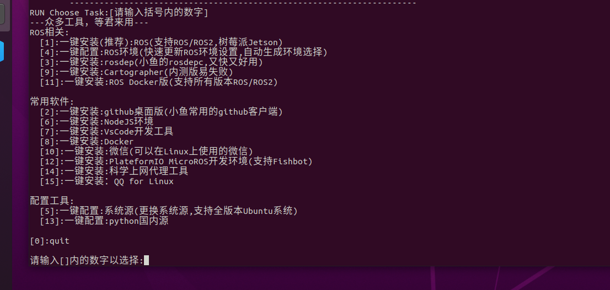

## 第〇章 ROS安装

### 1.自动安装ROS

普通安装方式十分繁琐，而且下载链接容易被墙，推荐用国内镜像源结合鱼香ros一键安装!

参考教程网站：<https://azitide.github.io/post/ubuntu_ROS.html>

网址

[清华开源镜像](https://mirrors.tuna.tsinghua.edu.cn/)

#### 一、配置软件源

1.首先我们要知道自己的电脑的cpu是什么架构的

**英特尔（intel）一般是x86架构，锐龙（amd）一般是arm架构**，当然英特尔也有amd架构，但在少部分，因为双方都有授权，所以各自都有对方架构的少部分芯片,还有一些小众的架构如PowerPC(ppc64el)、RISC-V(riscv64) 和 S390x 等架构，这些架构的设备用ubuntu-ports镜像的软件源即可

2.进去对应的架构的软件源

- [ubuntu | 镜像站使用帮助 | 清华大学开源软件镜像站 | x86](https://mirrors.tuna.tsinghua.edu.cn/help/ubuntu/)

    与

- [ubuntu-ports | 镜像站使用帮助 | 清华大学开源软件镜像站 | arm](https://mirror.tuna.tsinghua.edu.cn/help/ubuntu-ports/)

3.选择对应的版本

[](https://z1.ax1x.com/2023/10/12/piSM6RP.png)

设置好后，随即文本框中会生成你需要的 **sources.list** 文件内容，一会用到。

然后打开 Ubuntu 的终端，依次输入下面的命令

1、

```none
sudo apt update
```

2、

```none
cp /etc/apt/sources.list ~/Desktop
```

3、

```none
sudo gedit /etc/apt/sources.list
```

三条命令都输完后会打开一个文件内容，

把里面的全删掉，然后复制刚才网页生成的文本框内容粘贴上去，保存文件，退出

#### 二、安装ROS

###### 一键安装

这里我们用小鱼的大佬的鱼香ROS 一键安装

打开ubuntu终端，输入：

```none
wget http://fishros.com/install -O fishros && . fishros
```

然后我们输入 **1** 一键安装 –> 不更换源安装 –> 选择你ubuntu版本对应的ros版本 –> 桌面版–> 进行安装

[](https://z1.ax1x.com/2023/10/12/piSMZ80.png)

##### 报错：

如报错，先检查网络原因，如没有问题，先用命令行更换源

```none
wget http://fishros.com/install -O fishros && . fishros
```

然后我们输入 **5** –> 删掉第三方源并更换国内源 –> 添加ros/ros2源–> 完成，重新执行”一键安装“；

###### ros1启动命令

1，然后新建一个终端，打开输入

```none
roscore
```

终端完成后 会显示 \[/rosout\], 这样成功了一半

2，再新建第二个终端，输入

```none
rosrun turtlesim turtlesim_node
```

它会打开一个蓝色屏幕的小乌龟在中间，成功了

3，再建第三个终端，输入：

```none
rosrun turtlesim turtle_teleop_key
```

鼠标要在第三个终端，就可以通过按下键盘的 ↑ ↓ ← →键来对小海龟进行控制了。

安装完成

###### ros2开启命令

ros2没有中心节点，不需要roscore！

1，新建终端

```none
ros2 run turtlesim turtlesim_node
```

2，另外开一个终端

```none
ros2 run turtlesim turtle_teleop_key
```

安装完成

#### 三、配置rosdep

这里我们用小鱼的大佬的 一键配置

打开ubuntu终端，输入：

```none
wget http://fishros.com/install -O fishros && . fishros
```

再输入 **3** 就一键配置了

完成

#### 四、更新系统环境

这里我们还是用小鱼的大佬的 一键配置

打开ubuntu终端，输入：

```none
wget http://fishros.com/install -O fishros && . fishros
```

再输入 **4** 就一键配置了

完成

到这里，我们的ROS已经安装完成，加油！

### 2.手动安装ROS

参考网址：[ubuntu系统安装ROS（手动版） (azitide.github.io)](https://azitide.github.io/post/ubuntu_ROS_shoudong.html)

#### 1.确认自己的ubuntu系统然后去确认ROS版本

| **Ubuntu** | **ROS1**   | 开始 | 维护到期 |
| ---------- | ---------- | ---- | -------- |
| 14.04 LTS  | indigo     | 2014 | 2019     |
| 16.04 LTS  | Kinetic    | 2016 | 2021     |
| 18.04 LTS  | Melodic    | 2018 | 2023     |
| 20.04 LTS  | **Noetic** | 2020 | 2025     |

与

| **Ubuntu** | **ROS2**            | 开始 | 维护到期 |
| ---------- | ------------------- | ---- | -------- |
| 20.04 LTS  | Foxy Fitzroy        | 2020 | 2023     |
| 20.04 LTS  | Galactic Geochelone | 2021 | 2022     |

| 20.04 LTS  
22.04 LTS | **Humble Hawksbill  
(Recommended)** | 2022 | 2027 |
| 22.04 LTS | **Iron Irwini** | 2023 | 2024 |

#### 2、更换源

（1）进去源网站

- [ros | 镜像站使用帮助 | 清华大学开源软件镜像站](https://mirror.tuna.tsinghua.edu.cn/help/ros/)

    与

- [ros2 | 镜像站使用帮助 | 清华大学开源软件镜像站](https://mirror.tuna.tsinghua.edu.cn/help/ros2/)

[](https://s11.ax1x.com/2023/12/31/piOhzlQ.png)

（2）打开**ubuntu终端**，输入命令行打开文件

```none
sudo gedit /etc/apt/sources.list.d/ros-latest.list
```

打开文件后，复制第2步的网址进去（如文件内有其他网址，可以删掉，只留一条）

（3）文件保存退出后，新开一个终端，输入第3步的命令行（注意里面是两条命令行，要分开输入）

#### 3、安装ROS本体

格式是：

```none
sudo apt install ros-”ROS版本“-desktop-full
```

以20.04版本的ROS1为例：

```none
sudo apt install ros-noetic-desktop-full
```

以22.04版本的ROS2为例：

```none
sudo apt install ros-Humble-desktop-full
```

#### 4、更新rosdep

```none
sudo rosdep init
```

```none
rosdep update
```

#### 5、设置环境变量：

格式：

```none
echo "source 《你的ros系统文件setup.sh存放位置》" >> ~/.bashrc
```

以20.04版本的ROS1为例：

```none
echo "source /opt/ros/noetic/setup.bash" >> ~/.bashrc
```

```none
source ~/.bashrc
```

#### 6、验证

##### ros1启动命令

分别开**三个终端**依次输入

```none
roscore
```

```none
rosrun turtlesim turtlesim_node
```

```none
rosrun turtlesim turtle_teleop_key
```

鼠标要在第三个终端，就可以通过按下键盘的 ↑ ↓ ← →键来对小海龟进行控制了，动起来便是成功了

##### ros2启动命令

ros2没有中心节点，不需要roscore！

第一个终端

```none
ros2 run turtlesim turtlesim_node
```

第二个终端

```none
ros2 run turtlesim turtle_teleop_key
```

 **python添加中文报错**

第二行加上		# coding:utf-8

**鼠标变为十字 无法点击**

```shell
ps -e | grep import
kill -9 21526(import的进程)
```


## 第一章 文件初始化

**命令窗口快捷键**

```
Alt+Up                          //移动到上面的终端
Alt+Down                        //移动到下面的终端
Alt+Left                        //移动到左边的终端
Alt+Right                       //移动到右边的终端

Ctrl+Shift+X                    //最大化或恢复当前终端

Ctrl+Shift+W                    //关闭当前终端
Ctrl+Shift+Q                    //退出当前窗口，当前窗口的所有终端都将被关闭

Ctrl+Shift+O                    //水平分割终端
```

**python添加中文报错：**		第二行加上		# coding:utf-8		

**鼠标变为十字 无法点击**

```
ps -e | grep import
kill -9 21526(import的进程)
```

### 终端写代码

###### C++

```shell
#创建工作空间并初始化
mkdir -p 自定义空间名称/src
cd 自定义空间名称
catkin_make		#编译

#进入 src 创建 ros 包并添加依赖
cd src
catkin_create_pkg 自定义ROS包名 roscpp rospy std_msgs

#进入 ros 包的 src 目录编辑源文件
cd 自定义的包
gedit helloworld.cpp
```

```c++
#include "ros/ros.h"

int main(int argc, char *argv[])
{
    //执行 ros 节点初始化
    ros::init(argc,argv,"hello");
    //创建 ros 节点句柄(非必须)
    ros::NodeHandle n;
    //控制台输出 hello world
    ROS_INFO("hello world!");
    return 0;
}
```

```cmake
#编辑 ros 包下的 Cmakelist.txt文件
add_executable(步骤3的源文件名
  src/步骤3的源文件名.cpp
)
target_link_libraries(步骤3的源文件名
  ${catkin_LIBRARIES}
)
```

```shell
#进入工作空间目录并编译，窗口1
cd 自定义空间名称
catkin_make
```

```shell
#重新开一个窗口2，启动ros核心
roscore
```

```shell
#回到窗口1
cd 工作空间
source ./devel/setup.bash		#刷新路径，让系统知道ROS 工作空间位置、可执行文件和脚本。
rosrun 包名 C++节点		#运行

##命令行输出: HelloWorld!

##PS:进入家目录的隐藏文件：.bashrc文件
##末尾添加source ~/工作空间/devel/setup.bash，更加方便
```

###### python

```shell
cd ros包
mkdir scripts
cd scripts
gedit hello.py
```

```python
#! /usr/bin/env python		##解释器路径
# coding:utf-8						##防止中文注释报错
"""
    Python 版 HelloWorld
"""
import rospy					#输入包

if __name__ == "__main__":
    rospy.init_node("Hello")					#节点初始化
    rospy.loginfo("Hello World!!!!")		#日志输出
```

```shell
chmod +x 自定义文件名.py
```

```cmake
#编辑 ros 包下的 CamkeList.txt 文件
catkin_install_python(PROGRAMS scripts/自定义文件名.py
  DESTINATION ${CATKIN_PACKAGE_BIN_DESTINATION}
)
```

```shell
#进入工作空间目录并编译，窗口1
cd 自定义空间名称
catkin_make
```

```shell
#重新开一个窗口2，启动ros核心
roscore
```

```shell
#窗口1 
cd 工作空间
source ./devel/setup.bash
rosrun 包名 自定义文件名.py

##输出结果:Hello World!!!!
```

### VScode写代码

```shell
mkdir -p xxx_ws/src(必须得有 src)		#创建 ROS 工作空间
cd xxx_ws
catkin_make

cd xxx_ws		# 启动 vscode
code .
```

 ctrl + shift + B 调用编译，选择:	catkin_make:build	； 会自动添加c_cpp_properties.json，settings.json。

 ctrl + shift + B 调用编译，选择：catkin_make:build 右边的齿轮，添加配置文件

```json
{
// 有关 tasks.json 格式的文档，请参见
    // https://go.microsoft.com/fwlink/?LinkId=733558
    "version": "2.0.0",
    "tasks": [
        {
            "label": "catkin_make:debug", //代表提示的描述性信息
            "type": "shell",  //可以选择shell或者process,如果是shell代码是在shell里面运行一个命令，如果是process代表作为一个进程来运行
            "command": "catkin_make",//这个是我们需要运行的命令
            "args": [],//如果需要在命令后面加一些后缀，可以写在这里，比如-DCATKIN_WHITELIST_PACKAGES=“pac1;pac2”
            "group": {"kind":"build","isDefault":true},
            "presentation": {
                "reveal": "always"//可选always或者silence，代表是否输出信息
            },
            "problemMatcher": "$msCompile"
        }
    ]
}

```

**创建 ROS 功能包**

选定./命名空间/src ,右击 ---> create catkin package,设置包名helloworld
添加依赖roscpp,rospy,std_msgs

**功能包的 src 下新建 cpp 文件**

```c++
/*
    控制台输出 HelloVSCode !!!
*/
#include "ros/ros.h"

int main(int argc, char *argv[])
{
    setlocale(LC_ALL,"");//解决输出中文乱码问题
    //执行节点初始化
    ros::init(argc,argv,"HelloVSCode");

    //输出日志
    ROS_INFO("Hello VSCode!!!哈哈哈哈哈哈哈哈哈哈");
    return 0;
}
```

**python 实现**

功能包 下新建 scripts 文件夹，添加 python 文件，**并添加可执行权限**

 **配置 CMakeLists.txt**

```cmake
##c++
add_executable(节点名称
  src/C++源文件名.cpp
)
target_link_libraries(节点名称
  ${catkin_LIBRARIES}
)
##python
catkin_install_python(PROGRAMS scripts/自定义文件名.py
  DESTINATION ${CATKIN_PACKAGE_BIN_DESTINATION}
)
```

**编译:** ctrl + shift + B

**执行**：启动内核，进入工作空间，刷新环境变量，运行

```shell
#窗口1
roscore

#窗口2
cd 工作空间
source ./devel/setup.bash
rosrun 包名 helloworld.py 或者 c++节点
```

### launch文件和计算图

用于一次性启动多个 ROS 节点

1. 选定功能包右击 ---> 添加文件夹，命名为 launch 

2. 选定 launch 文件夹右击 ---> 添加文件，命名为xxx.launch 

3. 编辑 xxx.launch 文件内容

    ```shell
    <launch>
        <node pkg="helloworld" type="demo_hello" name="hello" output="screen" />
        <node pkg="turtlesim" type="turtlesim_node" name="t1"/>
        <node pkg="turtlesim" type="turtle_teleop_key" name="key1" />
    </launch>
    ```

    - node ---> 包含的某个节点
    - pkg -----> 功能包
    - type ----> 被运行的节点文件
    - name --> 为节点命名，自定义
    - output-> 设置日志的输出目标

    终端运行
    
    ```shell
    roslaunch 包名 launch文件名
    #运行 launch 文件
    #运行结果: 一次性启动了多个节点
    ```

**计算图**

用于展示节点之间的关系

```shell
rqt_graph	#新终端输入
```

##     第二章 通信机制

### 2.0概述

ROS 中的基本通信机制主要有如下三种实现策略:

- 话题通信(发布订阅模式)，类似关注B站UP主，当他发视频时，我可以自动接收
- 服务通信(请求响应模式)，类似点击视频观看，只有点击才能观看
- 参数服务器(参数共享模式)，类似在线腾讯文档，多人填写查看信息

### 2.1话题通信


#### C++

**需求:**

> 编写发布订阅实现，要求发布方以1HZ(每秒1次)的频率发布文本消息，订阅方订阅消息并将消息内容打印输出。

**分析:**

在模型实现中，ROS master 不需要实现，而连接的建立也已经被封装了，需要关注的关键点有三个:

1. 发布方
2. 接收方
3. 数据(此处为普通文本)

**流程:**

1. 编写发布方实现；
2. 编写订阅方实现；
3. 编辑配置文件；
4. 编译并执行。

```shell
mkdir -p ws/src		#创建 ROS 工作空间
cd ws
catkin_make	#编译，初始化ROS空间

#进入家目录的隐藏文件：.bashrc		末尾添加:
source ~/工作空间/devel/setup.bash

cd ws		# 启动 vscode
code .
```

 ctrl + shift + B 调用编译，选择：catkin_make:build 右边的齿轮，添加配置文件

```json
{
// 有关 tasks.json 格式的文档，请参见
    // https://go.microsoft.com/fwlink/?LinkId=733558
    "version": "2.0.0",
    "tasks": [
        {
            "label": "catkin_make:debug", //代表提示的描述性信息
            "type": "shell",  //可以选择shell或者process,如果是shell代码是在shell里面运行一个命令，如果是process代表作为一个进程来运行
            "command": "catkin_make",//这个是我们需要运行的命令
            "args": [],//如果需要在命令后面加一些后缀，可以写在这里，比如-DCATKIN_WHITELIST_PACKAGES=“pac1;pac2”
            "group": {"kind":"build","isDefault":true},
            "presentation": {
                "reveal": "always"//可选always或者silence，代表是否输出信息
            },
            "problemMatcher": "$msCompile"
        }
    ]
}
```

右击vscode中src文件夹-->creat catkin package

```shell
demo01 #添加包名
roscpp rospy std_msgs	#添加依赖
```

在demo01下的src中，新建pub.cpp，即发布方

```cpp
/*
    需求: 实现基本的话题通信，一方发布数据，一方接收数据，
         实现的关键点:
         1.发送方
         2.接收方
         3.数据(此处为普通文本)

         PS: 二者需要设置相同的话题

    消息发布方:
        循环发布信息:HelloWorld 后缀数字编号

    实现流程:
        1.包含头文件 
        2.初始化 ROS 节点:命名(唯一)
        3.实例化 ROS 句柄
        4.实例化 发布者 对象
        5.组织被发布的数据，并编写逻辑发布数据
*/
// 1.包含头文件 
#include "ros/ros.h"
#include "std_msgs/String.h" //普通文本类型的消息
#include <sstream>//拼接字符串

int main(int argc, char  *argv[])
{   
    //设置编码，防止中文乱码
    setlocale(LC_ALL,"");

    //2.初始化 ROS 节点:命名(唯一)
    // 参数1和参数2 后期为节点传值会使用
    // 参数3 是节点名称，是一个标识符，需要保证运行后，在 ROS 网络拓扑中唯一
    ros::init(argc,argv,"talker");
    //3.实例化 ROS 句柄
    ros::NodeHandle nh;//该类封装了 ROS 中的一些常用功能

    //4.实例化 发布者 对象
    //泛型: 发布的消息类型，字符串
    //参数1: 要发布到的话题
    //参数2: 队列中最大保存的消息数，超出此阀值时，先进的先销毁(时间早的先销毁)
    ros::Publisher pub = nh.advertise<std_msgs::String>("chatter",10);

    //5.组织被发布的数据，并编写逻辑发布数据
    //数据(动态组织)
    std_msgs::String msg;
    // msg.data = "你好啊！！！";
    std::string msg_front = "Hello 你好！"; //消息前缀
    int count = 0; //消息计数器

    ros::Rate r(1);    //逻辑(一秒1次)
    ros::Duration(3.0).sleep(); //延迟3秒发送，用于和管理者通信，避免接收者错过第一条数据

    //节点不死
    while (ros::ok())
    {
        //使用 stringstream 拼接字符串与编号
        std::stringstream ss;
        ss << msg_front << count;
        msg.data = ss.str();
        //发布消息
        pub.publish(msg);
        //加入调试，打印发送的消息
        ROS_INFO("发送的消息:%s",msg.data.c_str());

        //根据前面制定的发送频率自动休眠 休眠时间 = 1/频率；
        r.sleep();
        count++;//循环结束前，让 count 自增
        //回调函数，目前暂无应用
        ros::spinOnce();
    }
    return 0;
}
```

在demo01下的src中，新建sub.cpp，即订阅方

```cpp
/*
    需求: 实现基本的话题通信，一方发布数据，一方接收数据，
         实现的关键点:
         1.发送方
         2.接收方
         3.数据(此处为普通文本)

    消息订阅方:
        订阅话题并打印接收到的消息

    实现流程:
        1.包含头文件 
        2.初始化 ROS 节点:命名(唯一)
        3.实例化 ROS 句柄
        4.实例化 订阅者 对象
        5.处理订阅的消息(回调函数)
        6.设置循环调用回调函数
*/
// 1.包含头文件 
#include "ros/ros.h"
#include "std_msgs/String.h"

void doMsg(const std_msgs::String::ConstPtr& msg_p){//引用形式，传入消息指针
    ROS_INFO("我听见:%s",msg_p->data.c_str());//打印消息
    // ROS_INFO("我听见:%s",(*msg_p).data.c_str());
}

int main(int argc, char  *argv[])
{
    setlocale(LC_ALL,"");
    //2.初始化 ROS 节点:命名(唯一)
    ros::init(argc,argv,"listener");
    //3.实例化 ROS 句柄
    ros::NodeHandle nh;
    //4.实例化 订阅者 对象
    ros::Subscriber sub = nh.subscribe<std_msgs::String>("chatter",10,doMsg);//尖括号可省略
    //5.处理订阅的消息(回调函数)

    //6.设置循环调用回调函数
    ros::spin();//循环读取接收的数据，并调用回调函数doMsg处理
    return 0;
}
```

配置 demo01/CMakeLists.txt

```cmake
add_executable(pub		#136行
  src/pub.cpp
)
add_executable(sub
  src/sub.cpp
)

target_link_libraries(pub		#150行
  ${catkin_LIBRARIES}
)
target_link_libraries(sub
  ${catkin_LIBRARIES}
)
```

ctrl shift + B编译；ctrl alt + T新建终端

```shell
roscore	#启动核心
```

分割终端，运行发布者节点

```shell
cd ws
rosrun demo01 pub	#rosrun 包名	节点名
```

再次分割终端，运行订阅者节点

```shell
rosrun demo01 sub
```

打印话题小工具

```shell
rostopic echo chatter	#rostopic echo 话题
```

查看计算图

```shell
rqt_graph 		#新终端输入
```

#### Python

**流程:**

1. 编写发布方实现；
2. 编写订阅方实现；
3. 为python文件添加可执行权限；
4. 编辑配置文件；
5. 编译并执行。

在ws/demo01下新建文件夹scripts，其下新建pub.py，发布方程序

```python
#! /usr/bin/env python
# -*- coding: utf-8 -*-		
# 指定编码格式为utf-8
"""
    需求: 实现基本的话题通信，一方发布数据，一方接收数据，
         实现的关键点:
         1.发送方
         2.接收方
         3.数据(此处为普通文本)

         PS: 二者需要设置相同的话题

    消息发布方:
        循环发布信息:HelloWorld 后缀数字编号

    实现流程:
        1.导包 
        2.初始化 ROS 节点:命名(唯一)
        3.实例化 发布者 对象
        4.组织被发布的数据，并编写逻辑发布数据
"""
#1.导包 
import rospy
from std_msgs.msg import String

if __name__ == "__main__":
    #2.初始化 ROS 节点:命名(唯一)
    rospy.init_node("talker_p")
    #3.实例化 发布者 对象
    pub = rospy.Publisher("chatter_p",String,queue_size=10)
    #4.组织被发布的数据，并编写逻辑发布数据
    msg = String()  #创建 msg 对象
    msg_front = "hello 你好"
    count = 0  #计数器 
    # 设置循环频率
    rate = rospy.Rate(1)
    rospy.sleep(3)  #延迟3秒发送数据，防止订阅方接收不到
    while not rospy.is_shutdown():

        #拼接字符串
        msg.data = msg_front + str(count)

        pub.publish(msg)
        rate.sleep()
        rospy.loginfo("写出的数据:%s",msg.data)
        count += 1
```

scripts下新建sub.py,订阅方脚本

```python
#! /usr/bin/env python
# -*- coding: utf-8 -*-
"""
    需求: 实现基本的话题通信，一方发布数据，一方接收数据，
         实现的关键点:
         1.发送方
         2.接收方
         3.数据(此处为普通文本)

    消息订阅方:
        订阅话题并打印接收到的消息

    实现流程:
        1.导包 
        2.初始化 ROS 节点:命名(唯一)
        3.实例化 订阅者 对象
        4.处理订阅的消息(回调函数)
        5.设置循环调用回调函数
"""
#1.导包 
import rospy
from std_msgs.msg import String

def doMsg(msg):
    rospy.loginfo("I heard:%s",msg.data)

if __name__ == "__main__":
    #2.初始化 ROS 节点:命名(唯一)
    rospy.init_node("listener_p")
    #3.实例化 订阅者 对象
    sub = rospy.Subscriber("chatter_p",String,doMsg,queue_size=10)
    #4.处理订阅的消息(回调函数)
    #5.设置循环调用回调函数
    rospy.spin()
```

终端下进入 scripts 执行:	

```shell
chmod +x *.py
```

配置CMakeLists.txt

```cmake
#165行
catkin_install_python(PROGRAMS
  scripts/pub.py
  scripts/sub.py
  DESTINATION ${CATKIN_PACKAGE_BIN_DESTINATION}
)
```

打开终端，执行节点

```
roscore
```

```shell
cd ws
rosrun demo01 pub.py
```

```shell
rosrun demo01 sub.py
```

**不同编译语言，交互通信**

话题名称改为相同就能实现

C++发布数据，pub.cpp

```cpp
 ros::Publisher pub = nh.advertise<std_msgs::String>("chatter",10);
//话题名称：chatter
```

python接收数据,sub.py

```python
sub = rospy.Subscriber("chatter",String,doMsg,queue_size=10)
#话题名称：chatter
```

ctrl shift + B 编译

打开终端，执行节点

```
roscore
```

```shell
cd ws
rosrun demo01 pub
```

```shell
rosrun demo01 sub.py
```

#### 自定义消息 数据类型 msg

即传输的一段消息可包含多种类似的数据，常用于储存激光雷达数据：长度和角度

- int8, int16, int32, int64 (或者无符号类型: uint*)
- float32, float64
- string
- time, duration
- other msg files
- variable-length array[] and fixed-length array[C]

ROS中还有一种特殊类型：`Header`，标头包含时间戳和ROS中常用的坐标帧信息。

**1 定义msg文件**

ws/src/demo01下新建文件夹msg，新建Person.msg

```msg
string name
uint16 age
float64 height
```

**2 编辑配置文件**

**demo01/package.xml**中添加编译依赖与执行依赖

```xml
  <build_depend>message_generation</build_depend>
  <exec_depend>message_runtime</exec_depend>
  <!-- 
  exce_depend 以前对应的是 run_depend 现在非法
  -->
```

**demo01/CMakeLists.txt**编辑 msg 相关配置

```cmake
# 编译时的依赖文件
find_package(catkin REQUIRED COMPONENTS
  roscpp
  rospy
  std_msgs
  message_generation
)

# 配置 msg 源文件
add_message_files(
  FILES
  Person.msg
)

# 生成消息时依赖于 std_msgs
generate_messages(
  DEPENDENCIES
  std_msgs
)

#执行时依赖
catkin_package(
#  INCLUDE_DIRS include
#  LIBRARIES demo02_talker_listener
  CATKIN_DEPENDS roscpp rospy std_msgs message_runtime
#  DEPENDS system_lib
)
```

**3 编译**

ctrl shift + B 后，出现

C++ 需要调用的中间文件(.../工作空间/devel/include/包名/xxx.h)

Python 需要调用的中间文件(.../工作空间/devel/lib/python3/dist-packages/包名/msg)

后续调用相关 msg 时，是从这些中间文件调用的

#### C++调用自定义msg

**vscode配置**

 ws/.vscode/c_cpp_properties.json 的 includepath属性，设置头文件路径

```json
{
  "configurations": [
    {
      "browse": {
        "databaseFilename": "${default}",
        "limitSymbolsToIncludedHeaders": false
      },
      "includePath": [
        "/opt/ros/melodic/include/**",
        "/usr/include/**",
        "/home/book/ws/devel/include/demo01/**"//设置头文件路径
      ],
      "name": "ROS",
      "intelliSenseMode": "gcc-x64",
      "compilerPath": "/usr/bin/gcc",
      "cStandard": "gnu11",
      "cppStandard": "c++14"
    }
  ],
  "version": 4
}
```

ws/src/demo01/src新建pub_person.cpp

```cpp
/*
    需求: 循环发布人的信息
*/

#include "ros/ros.h"
#include "demo01/Person.h"//可能会报错，但不用管

int main(int argc, char *argv[])
{
    setlocale(LC_ALL,"");

    //1.初始化 ROS 节点
    ros::init(argc,argv,"talker_person");

    //2.创建 ROS 句柄
    ros::NodeHandle nh;

    //3.创建发布者对象
    ros::Publisher pub = nh.advertise<demo01::Person>("chatter_person",1000);

    //4.组织被发布的消息，编写发布逻辑并发布消息
    demo01::Person p;
    p.name = "sunwukong";
    p.age = 2000;
    p.height = 1.45;

    ros::Rate r(1);
    while (ros::ok())
    {
        pub.publish(p);
        p.age += 1;
        ROS_INFO("我叫:%s,今年%d岁,高%.2f米", p.name.c_str(), p.age, p.height);

        r.sleep();
        ros::spinOnce();
    }

    return 0;
}
```

ws/src/demo01/src新建sub_person.cpp

```cpp
/*
    需求: 订阅人的信息
*/

#include "ros/ros.h"
#include "demo01/Person.h"//可能会报错，但不用管

void doPerson(const demo01::Person::ConstPtr& person_p){
    ROS_INFO("订阅的人信息:%s, %d, %.2f", person_p->name.c_str(), person_p->age, person_p->height);
}

int main(int argc, char *argv[])
{   
    setlocale(LC_ALL,"");

    //1.初始化 ROS 节点
    ros::init(argc,argv,"listener_person");
    //2.创建 ROS 句柄
    ros::NodeHandle nh;
    //3.创建订阅对象
    ros::Subscriber sub = nh.subscribe<demo01::Person>("chatter_person",10,doPerson);

    //4.回调函数中处理 person

    //5.ros::spin();
    ros::spin();    
    return 0;
}
```

配置CMakeLists.txt

```cmake
add_executable(pub_person src/pub_person.cpp)
add_executable(sub_person src/sub_person.cpp)

# 编译前，先编译msg文件，然后让源文件调用msg
add_dependencies(pub_person ${PROJECT_NAME}_generate_messages_cpp)
add_dependencies(sub_person ${PROJECT_NAME}_generate_messages_cpp)

target_link_libraries(pub_person
  ${catkin_LIBRARIES}
)
target_link_libraries(sub_person
  ${catkin_LIBRARIES}
)
```

编译，启动roscore，分别启动两个节点，可以用rostopic echo talker_person查看发布的消息,用rqt_graph查看节点关系

#### py调用自定义msg

vscode settings.json 配置

```json
{
    "python.autoComplete.extraPaths": [
        "/opt/ros/melodic/lib/python2.7/dist-packages",
        "/home/book/ws/devel/lib/python2.7/dist-packages"//包含自定义msg的包
    ],
    "python.analysis.extraPaths": [
        "/opt/ros/melodic/lib/python2.7/dist-packages"
    ]
}
```

发布方脚本：pub_person.py

```python
#! /usr/bin/env python
# -*- coding: utf-8 -*-
"""
    发布方:
        循环发送消息

"""
import rospy
from demo01.msg import Person


if __name__ == "__main__":
    #1.初始化 ROS 节点
    rospy.init_node("talker_person_p")
    #2.创建发布者对象
    pub = rospy.Publisher("chatter_person",Person,queue_size=10)
    #3.组织消息
    p = Person()
    p.name = "葫芦瓦"
    p.age = 18
    p.height = 0.75

    #4.编写消息发布逻辑
    rate = rospy.Rate(1)
    while not rospy.is_shutdown():
        pub.publish(p)  #发布消息
        rate.sleep()  #休眠
        rospy.loginfo("姓名:%s, 年龄:%d, 身高:%.2f",p.name, p.age, p.height)
```

订阅方脚本：sub_person.py

```python
#! /usr/bin/env python
# -*- coding: utf-8 -*-
"""
    订阅方:
        订阅消息

"""
import rospy
from demo01.msg import Person

def doPerson(p):
    rospy.loginfo("接收到的人的信息:%s, %d, %.2f",p.name, p.age, p.height)


if __name__ == "__main__":
    #1.初始化节点
    rospy.init_node("listener_person_p")
    #2.创建订阅者对象
    sub = rospy.Subscriber("chatter_person",Person,doPerson,queue_size=10)
    rospy.spin() #4.循环
```

scripts文件夹下打开终端，改权限

```shell
chmod +x *.py
```

配置 CMakeLists.txt

```
catkin_install_python(PROGRAMS
  scripts/pub_person.py
  scripts/sub_person.py
  DESTINATION ${CATKIN_PACKAGE_BIN_DESTINATION}
)
```

```shell
roscore	#启动核心
```

```shell
cd ws
rosrun demo01 pub_person.py		#进入工作空间，启动发布节点
```

```shell
rosrun demo01 sub_person.py		#订阅节点
```

```shell
rpt_graph												#关系图
```

### 2.2服务通信

概念：A节点向B节点发送请求，B节点回复响应

理论模型：B节点作为服务端，先向管理方注册话题和地址，当A节点向管理方注册话题后，管理方向A发送B的地址，然后A可以与B进行请求，后B响应

#### 自定义服务消息 数据类型 srv

**需求:**

> 服务通信中，客户端提交两个整数至服务端，服务端求和并响应结果到客户端，请创建服务器与客户端通信的数据载体。

右击ws/src，创建catkin包，包名：plumbing_server_client；依赖包：roscpp rospy stdmsgs

plumbing_server_client中，新建文件夹srv，用于放置服务通信自定义数据，新建AddInts.srv;请求和响应使用`---`分割

```shell
# 客户端请求时发送的两个数字
int32 num1
int32 num2
---
# 服务器响应发送的数据
int32 sum
```

**编辑配置文件**

package.xml

```xml
  <build_depend>message_generation</build_depend>
  <exec_depend>message_runtime</exec_depend>
  <!-- 
  exce_depend 以前对应的是 run_depend 现在非法
  -->
```

CMakeLists.txt

```cmake
find_package(catkin REQUIRED COMPONENTS
  roscpp
  rospy
  std_msgs
  message_generation	# 需要加入 message_generation,必须有 std_msgs
)

add_service_files(
  FILES
  AddInts.srv	#
)

generate_messages(
  DEPENDENCIES
  std_msgs	#
)

catkin_package(
 CATKIN_DEPENDS roscpp rospy std_msgs message_runtime	#
)

```

ctrl shift b编译；发现ws/devel/include/plumbing_server_client出现三个.h头文件，用于cpp程序

ws/devel/lib/plumbing_server_client/srv出现三个.py文件,用于python程序

#### C++	服务通信

**服务端节点**

.vscode/c_cpp_properties.json配置

```json
{
  "configurations": [
    {
      "browse": {
        "databaseFilename": "${default}",
        "limitSymbolsToIncludedHeaders": true
      },
      "includePath": [
        "/opt/ros/melodic/include/**",
        "/usr/include/**",
        "/home/book/ws/devel/include/**"	//加这里
      ],
      "name": "ROS",
      "intelliSenseMode": "gcc-x64",
      "compilerPath": "/usr/bin/gcc",
      "cStandard": "gnu11",
      "cppStandard": "c++14"
    }
  ],
  "version": 4
}
```

plumbing_server_client 功能包中src文件夹新建demo01_server.cpp

```cpp
/*
    需求: 
        编写两个节点实现服务通信，客户端节点需要提交两个整数到服务器
        服务器需要解析客户端提交的数据，相加后，将结果响应回客户端，
        客户端再解析

    服务器实现:
        1.包含头文件
        2.初始化 ROS 节点
        3.创建 ROS 句柄
        4.创建 服务 对象
        5.回调函数处理请求并产生响应
        6.由于请求有多个，需要调用 ros::spin()
*/
#include "ros/ros.h"
#include "plumbing_server_client/AddInts.h"

// bool 返回值由于标志是否处理成功
bool doReq(plumbing_server_client::AddInts::Request& req,
          plumbing_server_client::AddInts::Response& resp){
    int num1 = req.num1;
    int num2 = req.num2;

    ROS_INFO("服务器接收到的请求数据为:num1 = %d, num2 = %d",num1, num2);

    //逻辑处理
    if (num1 < 0 || num2 < 0)
    {
        ROS_ERROR("提交的数据异常:数据不可以为负数");
        return false;
    }

    //如果没有异常，那么相加并将结果赋值给 resp
    resp.sum = num1 + num2;
    return true;
}

int main(int argc, char *argv[])
{
    setlocale(LC_ALL,"");
    // 2.初始化 ROS 节点
    ros::init(argc,argv,"AddInts_Server");//节点名称
    // 3.创建 ROS 句柄
    ros::NodeHandle nh;
    // 4.创建 服务 对象
    ros::ServiceServer server = nh.advertiseService("AddInts",doReq);//话题名称，处理函数
    ROS_INFO("服务已经启动....");
    //     5.回调函数处理请求并产生响应
    //     6.由于请求有多个，需要调用 ros::spin()
    ros::spin();
    return 0;
}
```

配置CMakeLists.txt

```cmake
add_executable(demo01_server src/demo01_server.cpp)
add_dependencies(demo01_server ${PROJECT_NAME}_gencpp)
target_link_libraries(demo01_server
  ${catkin_LIBRARIES}
)
```

ctrl shift b 编译，打开终端

```
roscore
```

```shell
cd ws
source ./devel/setup.bash
rosrun plumbing_server_client demo01_server 

#[ INFO] [1724064193.753397254]: 服务已经启动....
```

```shell
rosservice call AddInts 	#按tab键
"num1: 1
num2: 5" 

#sum: 6

#[ INFO] [1724069676.954949735]: 服务器接收到的请求数据为:num1 = 1, num2 = 5
```

**客户端节点**

plumbing_server_client 功能包中src文件夹新建demo02_client.cpp

```cpp
/*
    需求: 
        编写两个节点实现服务通信，客户端节点需要提交两个整数到服务器
        服务器需要解析客户端提交的数据，相加后，将结果响应回客户端，
        客户端再解析

    服务器实现:
        1.包含头文件
        2.初始化 ROS 节点
        3.创建 ROS 句柄
        4.创建 客户端 对象
        5.请求服务，接收响应

    实现动态参数提交：
        1.格式：rosrun xxx xxx 12 34
        2.节点执行时，获取命令中的参数，并组织n进 request
        共传入3个参数，程序名 12 34；故argc = 3;*argv[1]=12，*argv[2]=34
       
    问题：
        如果先启动客户端，没启动服务端，会请求异常
    解决：
        在ros中内部设置相关函数，这些函数可以让客户端挂起，等待服务端启动
*/
// 1.包含头文件
#include "ros/ros.h"
#include "plumbing_server_client/AddInts.h"

int main(int argc, char *argv[])
{
    setlocale(LC_ALL,"");

    // 调用时动态传值
    if (argc != 3)
    {
        ROS_ERROR("请提交两个整数");
        return 1;//结束main函数
    }

    // 2.初始化 ROS 节点
    ros::init(argc,argv,"AddInts_Client");//客户端
    // 3.创建 ROS 句柄
    ros::NodeHandle nh;
    // 4.创建 客户端 对象
    ros::ServiceClient client = nh.serviceClient<plumbing_server_client::AddInts>("AddInts");
    //等待服务启动成功
    //这是一个阻塞式函数，只有服务启动成功后才会继续执行
    //方式1
    ros::service::waitForService("AddInts");
    //方式2
    // client.waitForExistence();
    // 5.组织请求数据
    //实例化AddInts类对象，里面封装了客户端的请求数据和服务端的响应数据
    plumbing_server_client::AddInts ai;
    ai.request.num1 = atoi(argv[1]);//将字符串地址转化为int型数据
    ai.request.num2 = atoi(argv[2]);
    // 6.发送请求,返回 bool 值，标记是否成功
    bool flag = client.call(ai);//ros自带函数
    // 7.处理响应
    if (flag)
    {
        ROS_INFO("请求正常处理,响应结果:%d",ai.response.sum);
    }
    else
    {
        ROS_ERROR("请求处理失败....");
        return 1;
    }

    return 0;
}
```

配置CMakeLists.txt

```cmake
 add_executable(demo02_client src/demo02_client.cpp)
 add_dependencies(demo02_client ${PROJECT_NAME}_gencpp)
 target_link_libraries(demo02_client  ${catkin_LIBRARIES})
```

编译后，启动终端

```shell
rosrun plumbing_server_client demo02_client
[ERROR] [1724074832.948562698]: 请提交两个整数

plumbing_server_client demo02_client 1 2
[ INFO] [1724074885.084971520]: 请求正常处理,响应结果:3
```

