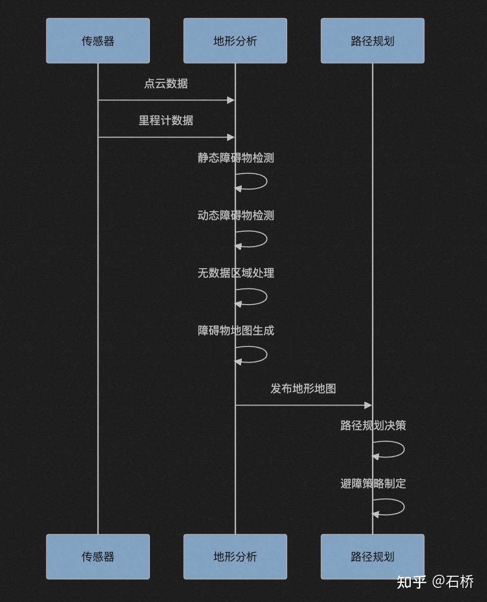
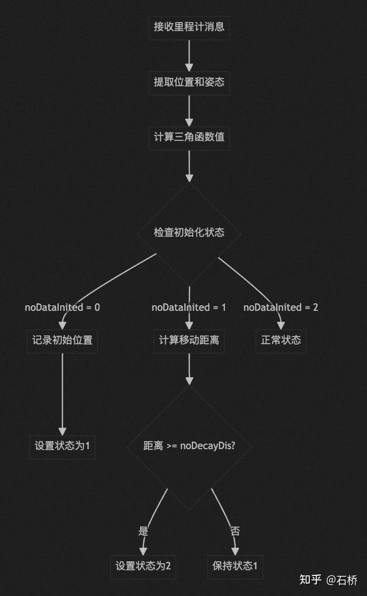
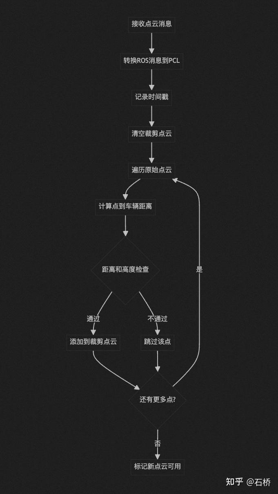
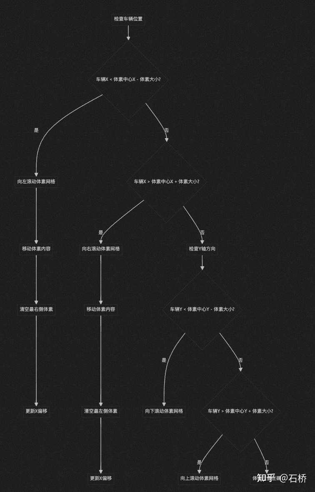
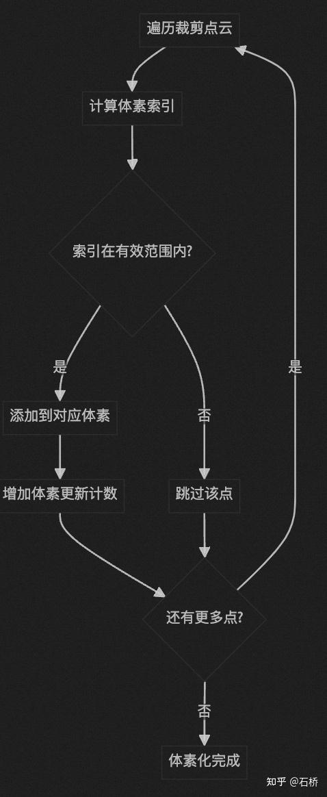
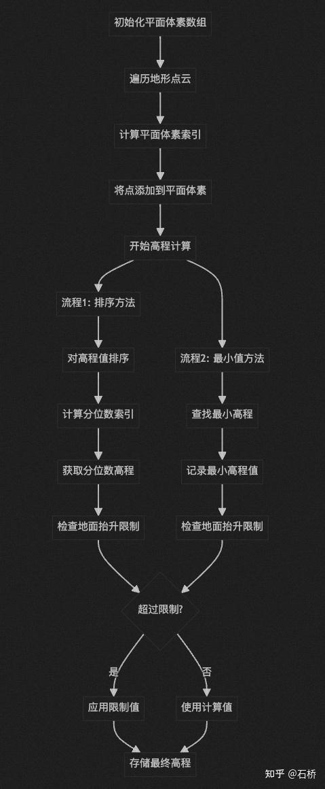
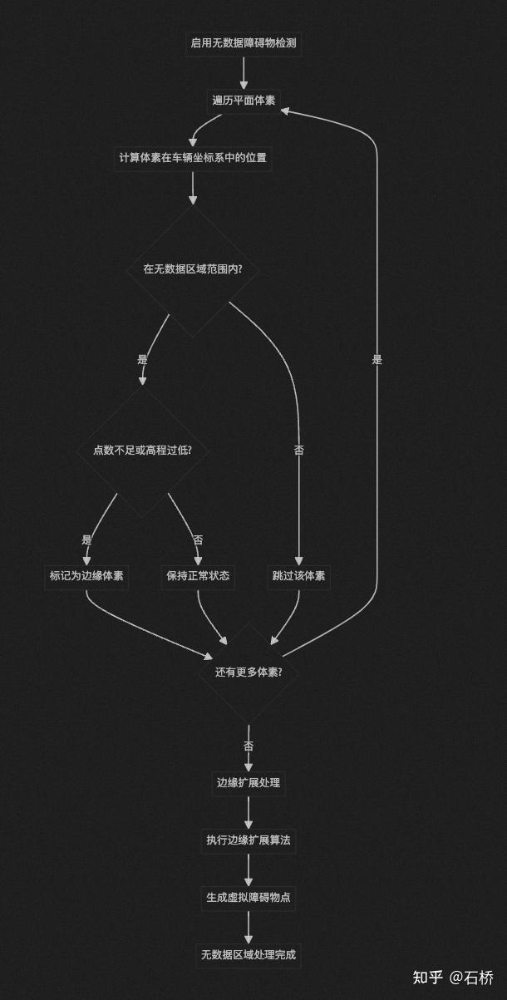
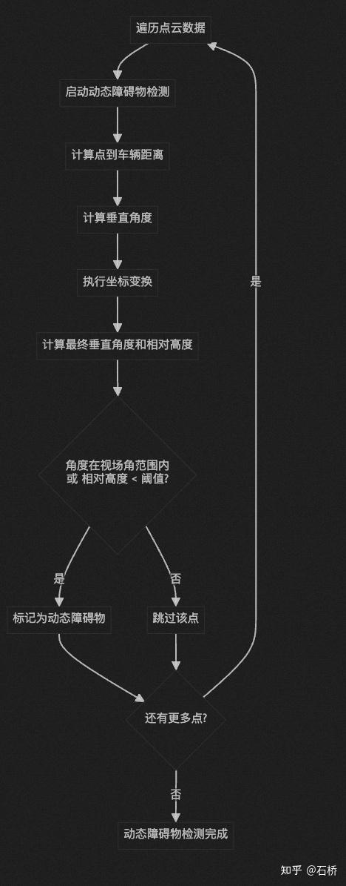
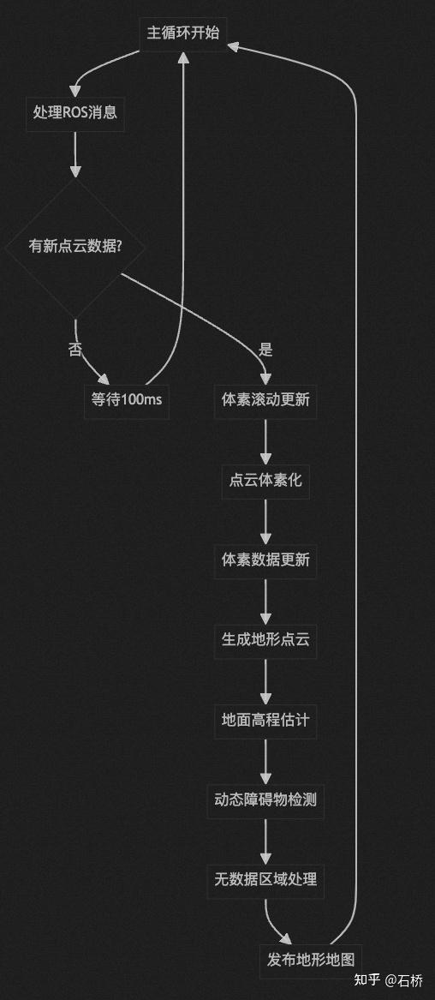
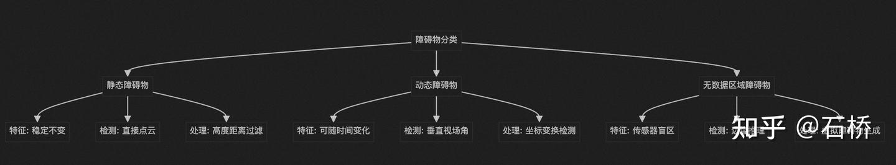

## 启动文件：terrain\_analysis.launch



地形分析处理流程时序图

对机器人周围环境进行3D地形分析，为路径规划提供环境感知信息。

```xml
<node pkg="terrain_analysis" exec="terrainAnalysis" name="terrainAnalysis" output="screen">
基础扫描参数
<param name="scanVoxelSize" value="0.05" />      <!-- 扫描体素大小：0.05米，决定地形分析的精度 -->
<param name="decayTime" value="2.0" />           <!-- 衰减时间：2.0秒，点云数据的有效时间 -->
<param name="noDecayDis" value="0.0" />          <!-- 无衰减距离：0.0米，在此距离内的点云不会衰减 -->
<param name="clearingDis" value="8.0" />         <!-- 清理距离：8.0米，超过此距离的点云会被清理 -->
数据处理参数
<param name="useSorting" value="true" />         <!-- 使用排序：true，对点云数据进行排序处理 -->
<param name="quantileZ" value="0.25" />          <!-- Z轴分位数：0.25，用于确定地面高度阈值 -->
<param name="considerDrop" value="false" />      <!-- 考虑下降：false，是否考虑地形下降 -->
<param name="limitGroundLift" value="false" />   <!-- 限制地面抬升：false，是否限制地面高度变化 -->
<param name="maxGroundLift" value="0.15" />      <!-- 最大地面抬升：0.15米，地面高度变化的上限 -->
动态障碍物检测参数
<param name="clearDyObs" value="false" />        <!-- 清除动态障碍物：false，是否清除动态障碍物 -->
<param name="minDyObsDis" value="0.3" />         <!-- 最小动态障碍物距离：0.3米 -->
<param name="minDyObsAngle" value="0.0" />       <!-- 最小动态障碍物角度：0.0度 -->
<param name="minDyObsRelZ" value="-0.3" />       <!-- 最小动态障碍物相对Z坐标：-0.3米 -->
<param name="absDyObsRelZThre" value="0.2" />    <!-- 绝对动态障碍物相对Z阈值：0.2米 -->
<param name="minDyObsVFOV" value="-16.0" />      <!-- 最小动态障碍物垂直视场角：-16.0度 -->
<param name="maxDyObsVFOV" value="16.0" />       <!-- 最大动态障碍物垂直视场角：16.0度 -->
<param name="minDyObsPointNum" value="1" />      <!-- 最小动态障碍物点数：1个点 -->
无数据区域处理参数
<param name="noDataObstacle" value="true" />     <!-- 无数据障碍物：true，将无数据区域视为障碍物 -->
<param name="noDataBlockSkipNum" value="0" />    <!-- 无数据块跳过数量：0，不跳过无数据块 -->
<param name="minBlockPointNum" value="10" />     <!-- 最小块点数：10，每个体素块的最小点数要求 -->
车辆相关参数
<param name="maxElevBelowVeh" value="-0.6" />    <!-- 车辆下方最大高程：-0.6米，车辆下方允许的最大凹陷深度 -->
<param name="vehicleHeight" value="1.5" />       <!-- 车辆高度：1.5米，用于计算通过性 -->
无数据区域范围参数
<param name="noDataAreaMinX" value="0.3" />      <!-- 无数据区域最小X：0.3米，车辆前方的无数据区域范围 -->
<param name="noDataAreaMaxX" value="1.8" />      <!-- 无数据区域最大X：1.8米 -->
<param name="noDataAreaMinY" value="-0.9" />     <!-- 无数据区域最小Y：-0.9米，车辆左侧的无数据区域范围 -->
<param name="noDataAreaMaxY" value="0.9" />      <!-- 无数据区域最大Y：0.9米，车辆右侧的无数据区域范围 -->
体素更新参数
<param name="voxelPointUpdateThre" value="100" /> <!-- 体素点更新阈值：100个点，触发体素更新的最小点数 -->
<param name="voxelTimeUpdateThre" value="2.0" />  <!-- 体素时间更新阈值：2.0秒，触发体素更新的最小时间间隔 -->
高度约束参数
<param name="minRelZ" value="-1.5" />            <!-- 最小相对Z：-1.5米，相对于车辆的最小高度 -->
<param name="maxRelZ" value="0.5" />             <!-- 最大相对Z：0.5米，相对于车辆的最大高度 -->
<param name="disRatioZ" value="0.2" />           <!-- Z轴距离比例：0.2，用于高度相关的距离计算 -->
```

## TerrainAnalysis程序文件

### 1、初始化参数

```cpp
// 地形体素参数
float terrainVoxelSize = 1.0;       // 地形体素大小(米)
int terrainVoxelShiftX = 0;         // 地形体素X轴偏移
int terrainVoxelShiftY = 0;         // 地形体素Y轴偏移
const int terrainVoxelWidth = 21;   // 地形体素宽度
int terrainVoxelHalfWidth = 10;     // 地形体素半宽度
const int terrainVoxelNum = 441;    // 地形体素总数(21×21)

// 平面体素参数
float planarVoxelSize = 0.2;        // 平面体素大小(米)
const int planarVoxelWidth = 51;    // 平面体素宽度
int planarVoxelHalfWidth = 25;      // 平面体素半宽度
const int planarVoxelNum = 2601;    // 平面体素总数(51×51)

// 主要点云容器
pcl::PointCloud<pcl::PointXYZI>::Ptr laserCloud;        // 原始激光雷达点云
pcl::PointCloud<pcl::PointXYZI>::Ptr laserCloudCrop;    // 裁剪后的点云
pcl::PointCloud<pcl::PointXYZI>::Ptr laserCloudDwz;     // 下采样的点云
pcl::PointCloud<pcl::PointXYZI>::Ptr terrainCloud;      // 地形点云
pcl::PointCloud<pcl::PointXYZI>::Ptr terrainCloudElev;  // 高程地形点云

// 地形体素点云数组
pcl::PointCloud<pcl::PointXYZI>::Ptr terrainVoxelCloud[terrainVoxelNum];

// 体素更新状态数组
int terrainVoxelUpdateNum[terrainVoxelNum] = {0};       // 体素更新点数
float terrainVoxelUpdateTime[terrainVoxelNum] = {0};    // 体素更新时间

// 平面体素数据数组
float planarVoxelElev[planarVoxelNum] = {0};            // 平面体素高程
int planarVoxelEdge[planarVoxelNum] = {0};              // 平面体素边缘
int planarVoxelDyObs[planarVoxelNum] = {0};             // 平面体素动态障碍物
vector<float> planarPointElev[planarVoxelNum];           // 平面体素点高程

// 车辆位置和姿态
float vehicleRoll = 0, vehiclePitch = 0, vehicleYaw = 0;  // 车辆姿态角
float vehicleX = 0, vehicleY = 0, vehicleZ = 0;           // 车辆位置
float vehicleXRec = 0, vehicleYRec = 0;                   // 车辆记录位置

// 三角函数值缓存
float sinVehicleRoll = 0, cosVehicleRoll = 0;             // 车辆横滚角三角函数值
float sinVehiclePitch = 0, cosVehiclePitch = 0;           // 车辆俯仰角三角函数值
float sinVehicleYaw = 0, cosVehicleYaw = 0;               // 车辆偏航角三角函数值
```

### 2、主要功能模块分析


数据处理流程

```cpp
void odometryHandler(const nav_msgs::msg::Odometry::ConstSharedPtr odom)
```



里程计数据处理流程

功能: 处理里程计数据，更新车辆状态

处理流程:

1.  从四元数提取欧拉角(roll, pitch, yaw)
2.  更新车辆位置和姿态
3.  计算并缓存三角函数值
4.  初始化无数据区域检测
5.  监控车辆移动距离

```cpp
void laserCloudHandler(const sensor_msgs::msg::PointCloud2::ConstSharedPtr laserCloud2)
```



点云处理流程

功能: 处理激光雷达点云数据

处理流程:

1.  转换ROS消息到PCL点云
2.  点云裁剪(距离和高度过滤)
3.  添加时间戳信息
4.  标记新点云可用

```cpp
void joystickHandler(const sensor_msgs::msg::Joy::ConstSharedPtr joy)
```

功能: 处理手柄输入，控制地图清理

按键映射: 手柄按键5触发地图清理和重新初始化

```cpp
void clearingHandler(const std_msgs::msg::Float32::ConstSharedPtr dis)
```

功能: 处理外部地图清理指令

参数: 清理距离阈值

### 3、核心算法分析

**体素滚动更新算法：当车辆移动超出当前体素网格范围时，通过滚动更新保持车辆始终在网格中心**



体素滚动更新流程（局部地图更新）

```cpp
// X轴方向体素滚动
while (vehicleX - terrainVoxelCenX < -terrainVoxelSize) {
  // 向左滚动体素网格
  for (int indY = 0; indY < terrainVoxelWidth; indY++) {
    // 移动体素内容
    for (int indX = terrainVoxelWidth - 1; indX >= 1; indX--) {
      terrainVoxelCloud[terrainVoxelWidth * indX + indY] = 
          terrainVoxelCloud[terrainVoxelWidth * (indX - 1) + indY];
    }
    // 清空最右侧体素
    terrainVoxelCloud[indY]->clear();
  }
  terrainVoxelShiftX--;
}
```

**点云体素化算法：将3D点云按位置分配到对应的体素中，实现空间离散化**



点云体素化流程

```cpp
// X轴方向体素滚动
while (vehicleX - terrainVoxelCenX < -terrainVoxelSize) {
  // 向左滚动体素网格
  for (int indY = 0; indY < terrainVoxelWidth; indY++) {
    // 移动体素内容
    for (int indX = terrainVoxelWidth - 1; indX >= 1; indX--) {
      terrainVoxelCloud[terrainVoxelWidth * indX + indY] = 
          terrainVoxelCloud[terrainVoxelWidth * (indX - 1) + indY];
    }
    // 清空最右侧体素
    terrainVoxelCloud[indY]->clear();
  }
  terrainVoxelShiftX--;
}
```

**地面高程估计算法：通过统计方法估计每个平面体素的地面高程，支持分位数和最小值两种模式**



地面高程估计，用于进一步分割障碍物

```cpp
if (useSorting) {
  // 使用排序方法
  sort(planarPointElev[i].begin(), planarPointElev[i].end());
  int quantileID = int(quantileZ * planarPointElevSize);
  planarVoxelElev[i] = planarPointElev[i][quantileID];
} else {
  // 使用最小值方法
  float minZ = 1000.0;
  for (int j = 0; j < planarPointElevSize; j++) {
    if (planarPointElev[i][j] < minZ) {
      minZ = planarPointElev[i][j];
    }
  }
  planarVoxelElev[i] = minZ;
}
```

**动态障碍物检测算法：通过多次坐标变换将点云转换到车辆坐标系，检测垂直视场角范围内的动态障碍物**



无数据区域处理流程

```cpp
// 坐标变换到车辆坐标系
float pointX2 = pointX1 * cosVehicleYaw + pointY1 * sinVehicleYaw;
float pointY2 = -pointX1 * sinVehicleYaw + pointY1 * cosVehicleYaw;

// 俯仰角变换
float pointX3 = pointX2 * cosVehiclePitch - pointZ2 * sinVehiclePitch;
float pointZ3 = pointX2 * sinVehiclePitch + pointZ2 * cosVehiclePitch;

// 横滚角变换
float pointY4 = pointY3 * cosVehicleRoll + pointZ3 * sinVehicleRoll;
float pointZ4 = -pointY3 * sinVehicleRoll + pointZ3 * cosVehicleRoll;

// 垂直视场角检测
float angle4 = atan2(pointZ4, dis4) * 180.0 / PI;
if (angle4 > minDyObsVFOV && angle4 < maxDyObsVFOV || fabs(pointZ4) < absDyObsRelZThre) {
  planarVoxelDyObs[planarVoxelWidth * indX + indY]++;
}
```



动态障碍物检测流程

**无数据区域处理算法：识别车辆前方无数据区域，通过边缘检测和扩展算法生成虚拟障碍物**

```cpp
// 检测无数据区域
if (pointX2 > noDataAreaMinX && pointX2 < noDataAreaMaxX && 
    pointY2 > noDataAreaMinY && pointY2 < noDataAreaMaxY) {
  if (planarPointElevSize < minBlockPointNum || 
      planarVoxelElev[i] - vehicleZ < maxElevBelowVeh) {
    planarVoxelEdge[i] = 1;  // 标记为边缘
  }
}

// 边缘扩展
for (int noDataBlockSkipCount = 0; noDataBlockSkipCount < noDataBlockSkipNum; noDataBlockSkipCount++) {
  for (int i = 0; i < planarVoxelNum; i++) {
    if (planarVoxelEdge[i] >= 1) {
      // 检查相邻体素
      for (int dX = -1; dX <= 1; dX++) {
        for (int dY = -1; dY <= 1; dY++) {
          if (planarVoxelEdge[planarVoxelWidth * (indX + dX) + indY + dY] < planarVoxelEdge[i]) {
            edgeVoxel = true;
          }
        }
      }
      if (!edgeVoxel) planarVoxelEdge[i]++;
    }
  }
}
```

### 4、数据流处理流程



主循环处理流程

```cpp
while (status) {
  rclcpp::spin_some(nh);  // 处理ROS消息
  
  if (newlaserCloud) {     // 有新点云数据时
    newlaserCloud = false;
    
    // 1. 体素滚动更新
    // 2. 点云体素化
    // 3. 体素数据更新
    // 4. 地形点云生成
    // 5. 地面高程估计
    // 6. 动态障碍物检测
    // 7. 无数据区域处理
    // 8. 发布地形地图
  }
  
  rate.sleep();  // 控制循环频率
}
```

**点云处理流程**

1.  数据接收: 接收里程计和激光雷达数据
2.  预处理: 点云裁剪和过滤
3.  体素化: 将点云分配到体素网格
4.  更新检测: 检查体素是否需要更新
5.  下采样: 使用体素网格滤波器减少点数
6.  时间衰减: 应用时间衰减机制
7.  高程计算: 估计地面高程
8.  障碍物检测: 识别动态和静态障碍物
9.  地图生成: 生成最终的地形地图

总结一下：障碍物分类

