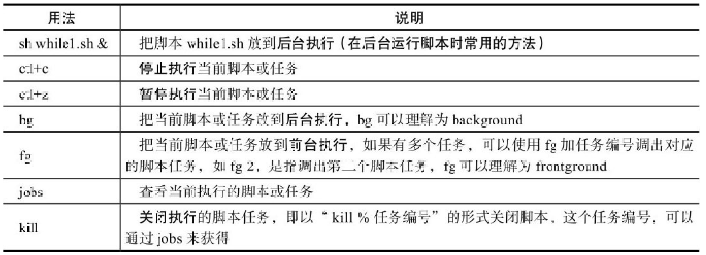

#### 1.shell概述

Shell是一个命令解释器，它的作用是解释执sdf发发行用户输入的命令及程序


shell脚本，通过编辑器编写，vim或gedit，以.sh结尾

执行命令，如果权限不够：chmod +x script-name

```shell
bash script-name		#或者
./script-name
```

脚本开头，第一行会指出由哪个程序（解释器）来执行脚本中的内容

```shell
#!/bin/bash
```

#### 2.变量

```
变量名称=值 
```

注意”=“的两侧无空格，否则变量名称会被识别为命令，变量的内容一般要加双引号，以防止出错，特别是值有空格时，不区分格式。

```shell
a=5
echo $a #通过echo命令加上$即可输出变量的值
```

为普通变量的定义赋值，注意引号区别

```
变量=value
变量='value
变量="value"
```

```shell
a=192.168.1.10
b='192.168.1.10'
c="192.168.1.10"
echo "a=$a"
echo "b=$b"
echo "c=${c}"
```


```shell
a=192.168.1.10-$a
b='192.168.1.10-$a'
c="192.168.1.10-$a"
echo "a=$a"
echo "b=$b"
echo "c=${c}"
```


不加引号定义,值里有变量的会被解析后再输出

单引号定义,原样输出不解析

双引号定义，先解析再输出

数字内容的变量定义可以不加引号，其他没有特别要求的字符串等定义最好都加上双引号

#### 3.特殊变量

**$n**

```shell
echo $1 $2  #编写如下的a.sh脚本,给1，2变量传入两个字符串并输出
```


$为特殊字符，不能直接用，要配合“\”转义字符，转为字符串才能用“>”传入字符

```shell
echo $1 $2 $3 $4 $5 $6 $7 $8 $9 $10 $11 $12 $13 $14 $15
   # 编写如下的a.sh脚本,给变量传入字符串并输出
```


当位置参数数字大于9时，需要用大括号将数字括起来，如：${10}，否则会出现异常

**$0的作用为取出执行脚本的名称（包括路径）**

```shell
#编写如下的a.sh脚本，内容如下：
echo $0
```


```shell
#希望单独获取名称或路径
dirname /opt/server/a.txt
basename /opt/server/a.txt

dirname $0
basename $0
```


**$#获取脚本传参的个数**

```
#编写如下的q.sh脚本
echo $1 $2 $3 $4 $5 $6 $7 $8 $9
echo $#
```


**$＊和$@**

```shell
set -- zhangsan lisi wangwu # --表示清除所有的参数变量，重新设置后面的参数变量
echo $# #输出参数个数 3
echo $1 #zhangsan
...
```


测试$*和$@，注意，此时不带双引号：

```shell
echo $*
echo $@
for i in $*; do echo $i; done
for i in $@; do echo $i; don
```


测试"$*"和"$@"，注意，此时带有双引号：

```shell
echo "$*"		//作为一个字符串输出
echo "$@"		//三个字符串分别输出
for i in "$*"; do echo $i; done
for i in "$@"; do echo $i; done #每次循环"$@"将其一个值赋给 i，并打印，共三次
```


**$?用于获取执行上一个指令的执行状态返回值，0表示成功，非0表示失败**


* **内置变量命令**

**echo在屏幕上输出信息：**

```shell
echo args # 将echo命令后面args指定的字符串及变量等显示到标准输出
#“\”是字符串转移义字符，可以将后面的字符转义成字符串
```


**eval**，当Shell程序执行到eval语句时，Shell读入参数args，并将它们组合成一个新的命令，然后执行。下面的命令相当于读入两次字符串 lisi wangwu

```shell
eval args
```


**4.运算符**

```shell
book@100ask:~$ echo ((1+1))
bash: 未预期的符号“(”附近有语法错误

book@100ask:~$ echo $((1+1)) 
2

book@100ask:~$ i=5
book@100ask:~$ ((i=i*2))
book@100ask:~$ echo $i
10

book@100ask:~$ ((a=1+2**3-10))
book@100ask:~$ echo $a
-1
book@100ask:~$ echo $((a+=1))
0

book@100ask:~$ b=$((1+1))
book@100ask:~$ echo b
b
book@100ask:~$ echo $b
2

book@100ask:~$ echo $((1+10))
11
book@100ask:~$ echo $((8>10))
0
book@100ask:~$ echo $((8==8&&3>2))
1
```

上面涉及的数字及变量必须为整数（整型），不能是小数（浮点数）或字符串

(())”表达式在命令行执行时不需要加$符号，直接使用((6%2))形式即可，但是如果需要输出，就要加$符，例如：echo $((6%2))

(())”里的所有字符之间没有空格、有一个或多个空格都不会影响结果。$(())也可以使用$[]代替

#### 5.测试表达式


语法1中的test命令和语法2中的[]是等价的。语法3中的[[]]为扩展的test命令，语法4中的(())常用于计算
在==[[]]==（双中括号）中可以使用==通配符==等进行模式匹配，这是其区别于其他几种语法格式的地方。
==&&、||、＞、＜==等操作符可以应用于[[]]中，但不能应用于[]中

在==[]==中一般用==-a、-o、-gt（用于整数）、-lt（用于整数）==代替上述操作符。#and,or,greater than,less than
对于整数的关系运算，也可以使用Shell的算术运算符(())

案例测试

```shell
book@100ask:~/scripts$ ls
a.sh
book@100ask:~/scripts$ test -f a.sh && echo true || echo false
true
book@100ask:~/scripts$ test -f b.sh && echo true || echo false
false

#-f表示查找文件，存在输出true,不存在输出false
#当找到文件时，test -f a.sh = 1，1 && echo true = echo true，输出true，终止程序
#当没找到文件时，test -f b.sh = 0，0 && echo true =0，0 || echo false = echo false，输出false

book@100ask:~/scripts$ test -z hello && echo 1 || echo 0 
0
#-z选项（如果测试字符串的长度为0，则表达式成立）
# 如果测试的字符串长度为0，则输出1
```

==括号==内部的两端要有==空格==，[]和test等价，即test的所有判断选项都可以直接在[]里使用。

```shell
[ -f /tmp/xx ] && echo 1 || echo 0
[[ -f /tmp/xx	 && echo 1 || echo 0 ]] 
```


对于字符串的测试，一定要将==字符串加双引号==之后再进行比较
比较符号（例如=="=和!="==）的==两端==一定要有==空格==

```shell
book@100ask:~$ name=zhangsan
book@100ask:~$ [ -n "$name" ] && echo 1 || echo 0 # 注意此处 变量两侧也要有引号，否则会出现判断错误
1
book@100ask:~$ [ "abc" = "ac" ] && echo 1 || echo 0 # 注意等 号两侧要有空格，使用=或==均可
0

```


比较符号两端也要有空格。


#### 6.选择语句

 **if语句**

```shell
if <条件表达式>
	then
		指令
fi
```

```shell
if <条件表达式>;then
		指令
fi
```

```shell
if <条件表达式>
	then
		if <条件表达式>
			then
				指令
		fi
fi
```

* 案例

```shell
[ -f "$file1" ] && echo 1
#等价于
if [ -f "$file1" ];then
		echo 1
fi
```

```shell
[ -f "$file1" ] && echo 1 || echo 0
#等价于
if [ -f "$file1" ]
	then
		echo 1
	else
		echo 0
fi
```

```shell
if <条件表达式>
	then
		指令
elif <条件表达式2>
	then
		指令
elif <条件表达式2>
	then
		指令
...
else
		指令
fi

#注意多分支elif的写法，每个elif都要带有then。
#最后结尾的else后面没有then。
```

**case语句**

```
case "变量" in
	值1)
		指令..
		;;
	值2)
		指令..
		;;
	*)
		指令..
esac
```

 **read命令**

```shell
read [参数] [变量名]
# 用参数如下。
# -p prompt：设置提示信息。
# -t timeout：设置输入等待的时间，单位默认为秒。
```

```shell
read -t 10 -p "input a number:" num # 变量前需要有空格
echo $num
read -t 10 -p "input two number:" num1 num2 # 变量前需要有空格
echo $num1 $num2
```

```shell
read -p "input a number:" num
case "$num" in
	1)
		echo "the num is 1"
		;;
	2)
		echo "the num is 2"
		;;
	[3-9]) # 支持正则表达式
		echo "the num is $num"
		;;
	*)
		echo "error"
esac
```

#### 7.循环语句

**while循环**

```shell
while <条件表达式>
do
		指令
done
```

```shell
while true # 条件用于为真，会一直运行
do
		uptime#uptime 命令用于显示系统总共运行了多长时间和系统的平均负载。
		sleep 2 # 让程序暂停2秒，控制循环的频率，否则会消耗大量的系统资源
done
```

```shell
while [ 1 ] # 使用条件表达式表示条件为真
do
		uptime >>/tmp/uptime.log # 将信息输入到log文件中
		sleep 2
done
```

 **for循环**

```shell
for 变量名 in 变量取值列表
do
		指令
done
```

```shell
for ((exp1;exp2;exp3))
do
		指令
done
```


**脚本后台运行**

结尾使用&符号

```shell
bash uptime-demo.sh &
tail -f /tmp/uptime.log # 使用tail命令实时观察结果
```



```shell
#创建test.sh脚本测试
while true # 条件用于为真，会一直运行
do
		uptime
		sleep 2 # 让程序暂停2秒，控制循环的频率，否则会消耗大量的系统资源
done
```

终端输入指令控制脚本运行

#### 8.函数

* **语法** 

```shell
function 函数名() {
		指令
		return n
}


function 函数名 {
		指令
		return n
}


函数名 {
		指令
		return n
}
```

* **执行与调用**

Shell的函数分为最基本的函数和可以传参的函数两种

**1）执行==不带参数==的函数时，直接输入函数名即可（注意不带小括号）。**

```
函数名
```

函数的定义必须在要执行的程序前面定义或加载。

Shell执行系统中各种程序的执行顺序为：系统别名→函数→系统命令→可执行文件。

函数执行时，会和调用它的脚本共用变量，也可以为函数设定局部变量及特殊位置参数。

在Shell函数里面，return命令的功能与exit类似，return的作用是退出函数，而exit是退出脚本文件。

return语句会返回一个退出值（即返回值）给调用函数的当前程序，而exit会返回一个退出值（即返回值）给执行程序的当前Shell。

如果将函数存放在独立的文件中，被脚本加载使用时，需要使用source或“.”来加载。

在函数内一般使用local定义局部变量，这些变量离开函数后就会消失。

**2）==带参数==的函数执行方法**

```shell
函数名 参数1 参数2
```

Shell的位置参数（$1、$2…、$#、$*、$？及$@）都可以作为函数的参数来使用。
此时父脚本的参数临时地被函数参数所掩盖或隐藏。
$0比较特殊，它仍然是父脚本的名称。
函数执行完成时，原来的命令行脚本的参数即可恢复。

* **案例**

```shell
book@100ask:~$ gedit fun-demo.sh
book@100ask:~$ cat fun-demo.sh 
#开发脚本建立简单函数并调用执行
function demo(){
	echo "call demo"
}
demo
book@100ask:~$ bash fun-demo.sh 
call demo

book@100ask:~$ gedit fun-demo.sh
book@100ask:~$ cat fun-demo.sh 
function demo(){
	echo "call demo"
	return 100
}
echo demo
book@100ask:~$ bash fun-demo.sh 
demo

book@100ask:~$ gedit fun-demo.sh
book@100ask:~$ cat fun-demo.sh 
function demo(){
	echo "call demo"
	return 100
}
echo 'demo'
book@100ask:~$ bash fun-demo.sh 
demo

book@100ask:~$ gedit fun-demo.sh
book@100ask:~$ cat fun-demo.sh 
function demo(){
	echo "call demo"
	return 100
}
echo `demo`
book@100ask:~$ bash fun-demo.sh 
call demo

book@100ask:~$ gedit fun-demo.sh
book@100ask:~$ cat fun-demo.sh 
function demo(){
	echo "call demo"
	return 100
}
demo		#调用函数
echo $?		#输出返回值
book@100ask:~$ bash fun-demo.sh 
call demo
100

book@100ask:~$ gedit fun-demo.sh
book@100ask:~$ cat fun-demo.sh 
function demo(){
	echo "call demo"
	echo $1 $2
	return 100
}
demo zhangshan lisi		#调用函数
book@100ask:~$ bash fun-demo.sh 
call demo
zhangshan lisi

book@100ask:~$ gedit fun-demo.sh
book@100ask:~$ cat fun-demo.sh 
function demo(){
	echo "call demo"
	echo $1 $2
	return 100
}
demo $1 $2		#调用函数,传入外部参数
book@100ask:~$ bash fun-demo.sh zhangsan lisi
call demo
zhangsan lisi
```

**函数间的调用**

```shell
##########################################
book@100ask:~$ gedit fun-demo2.sh
book@100ask:~$ cat fun-demo2.sh 
#调用 fun-demo1.sh
#"."表示调用后面的脚本
. ./fun-demo.sh 
demo

book@100ask:~$ ls
fun-demo.sh 		fun-demo2.sh 

book@100ask:~$ cat fun-demo.sh
function demo(){
	echo "call demo"
	echo $1 $2
	return 100
}
demo

book@100ask:~$ bash fun-demo2.sh
call demo
###############################################
book@100ask:~$ gedit fun-demo2.sh
book@100ask:~$ cat fun-demo2.sh 
#调用 fun-demo1.sh,"."表示调用后面的脚本,反斜杠 "\" 用于将一行代码延续到下一行以提高代码的可读性。
#"\" 在"then"之后使用，表示if语句条件的延续。这样做是为了让代码更易于阅读，特别是当一行代码很长时。

#先判断要调用的脚本是否存在，然后再调用
if [ -f ./fun-demo.sh ]; then\
    . ./fun-demo.sh
    demo
fi

book@100ask:~$ bash fun-demo2.sh
call demo

```

**break、continue、exit、return的区别**

```shell
book@100ask:~$ gedit fun-demo3.sh
book@100ask:~$ cat fun-demo3.sh 
echo hello
exit 50
book@100ask:~$ bash fun-demo3.sh 
hello
book@100ask:~$ echo $?
50
#exit 可以返回值

book@100ask:~$ gedit fun-demo3.sh
book@100ask:~$ cat fun-demo3.sh 
function f1(){
	echo "f1"
	return 100
}
f1
book@100ask:~$ bash fun-demo3.sh 
f1
book@100ask:~$ echo $?
100
 #f1函数的return返回值100
 
 book@100ask:~$ gedit fun-demo3.sh
book@100ask:~$ cat fun-demo3.sh 
function f1(){
	echo "f1"
	return 100
}
f1
echo $?
exit 200

book@100ask:~$ bash fun-demo3.sh 
f1
100
book@100ask:~$ echo $?
200
#exit是脚本整体返回值，return是函数返回值
```

break:跳出for或者whilex循环

continue:跳过第n次（i = n）循环，进入下一轮循环

exit:退出整个脚本，回到终端

return:退出函数