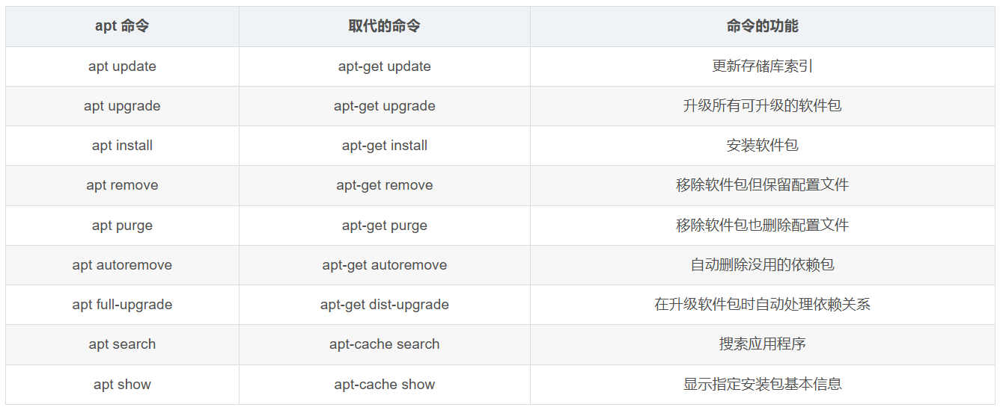

# 1.截图，修改截图存储位置

https://www.jb51.net/softjc/117295.html

https://www.cnblogs.com/by-sknight/p/12321503.html

https://blog.csdn.net/weixin_30887919/article/details/98986520

Ubuntu自带的截图工具非常好用，可以自已设置各种截图的快捷键，下面我们一起来了解一下这个截图工具gnome-screenshot

```shell
thinkpad@thinkpad:~$ gnome-screenshot -h
用法：
  gnome-screenshot [选项...] 对屏幕截图
 
帮助选项：
  -h, --help                   显示帮助选项
  --help-all                   显示全部帮助选项
  --help-gtk                   显示 GTK+ 选项
 
应用程序选项：
  -c, --clipboard              将截图直接发送到剪贴板
  -w, --window                 抓取窗口，而不是整个屏幕
  -a, --area                   抓取屏幕的一个区域，而不是整个屏幕
  -b, --include-border         在截图中包含窗口边框
  -B, --remove-border          去除屏幕截图的窗口边框
  -d, --delay=秒               在指定延迟后截图[以秒计]
  -e, --border-effect=效果     添加到边框的特效(阴影 shadow 、边框 border 或无特效 none)
  -i, --interactive            交互式设定选项
  --display=显示               要使用的 X 显
 
```

**设置截图快捷键**

进入系统设置　－－　键盘　－－　快捷键　－－　截图 －－ 自定义或修改；backspace键表示禁用

**修改默认的截图保存位置**

终端输入命令，后面的目录`"/home/sknight/Pictures/Screenshot/"`按照自己的要求修改

```
gsettings set org.gnome.gnome-screenshot auto-save-directory "/home/sknight/Pictures/Screenshot/"
```

或者，打开dconf-editor软件，进入路径org->gnome->gnome-screenshot->auto-save-directory，修改value为需要的路径

# 2.桌面图标是否可见

打开应用

找到/org /gnome /nautilus /desktop /，通过它可以配置许多桌面设置。

在可配置的设置中，您还可以看到“trash-icon-visible”按钮。

# 3.频繁断网，连线图标不可见

#### Ubuntu下DSL拨号上网频繁断网解决方法

###### 打开配置文件/etc/ppp/options

```shell
sudo vi /etc/ppp/options # 不熟悉vi的同学可以使用
sudo gedit /etc/ppp/options
```

###### 在options文件中找到以下两行代码

lcp\-echo-failure 4

> 相当于断线之后发送的心跳帧，即重连次数。
>
> If this option is given, pppd will send an LCP echo-request frame to the peer every n seconds.

lcp-echo-interval 30

> 重连周期  
> If this option is given, pppd will presume the peer to be dead if n  
> LCP echo-requests are sent without receiving a valid LCP echo-reply. If this happens, pppd will terminate the connection.

两个字段的意思就是每30秒内重连一次，4次重连失败就自动断网，把4改大点，比如40、400。

```
sudo service network-manager restart
```


* 别的方法：

1.  先停掉网络(root用户下)

```shell
sudo service network-manager stop
```

2.  查看网络状态

```shell
suodo gedit /var/lib/NetworkManager/NetworkManager.state
```

  
这里主要观察**NetworkingEnable=true** ，如果为false ，就修改成true并保存  
3\. 重新开启网络服务

```shell
sudo service network-manager start
```

网络就有用了，并且右上角的网络图标也出现了


# 4.配置vscode

 官方教程地址：[Get Started with C++ on Linux in Visual Studio Code](https://code.visualstudio.com/docs/cpp "Get Started with C++ on Linux in Visual Studio Code")（[Get Started with C++ on Linux in Visual Studio Code](https://code.visualstudio.com/docs/cpp "Get Started with C++ on Linux in Visual Studio Code")）

## 1、下载安装vscode

[Visual Studio Code - Code Editing. Redefined](https://code.visualstudio.com/ "Visual Studio Code - Code Editing. Redefined")（[Visual Studio Code - Code Editing. Redefined](https://code.visualstudio.com/ "Visual Studio Code - Code Editing. Redefined")）。

## 2、安装C++扩展


## 3、安装gdb

如果不安装gdb运行可能会报错“unable to start debugging. the value of miDebuggerPath is invalid.md”。

## 4、[示例程序](https://so.csdn.net/so/search?q=%E7%A4%BA%E4%BE%8B%E7%A8%8B%E5%BA%8F&spm=1001.2101.3001.7020)

        helloworld示例程序如下，保存为test.cpp。

```cpp
#include <iostream>

using namespace std;

int main()

{

cout << "Hello World!" << endl;

return 0;

}
```

## 5、运行程序

### 5.1 task模式

        按下F5或点击左侧Run&Debug，点击create a launch.json File，弹窗中选择第一个即可运行程序，输出结果同时，工程文件夹下多出一个.vscode文件夹，包含launch.json, tasks.json, c\_cpp\_properties.json。

####         （1）launch.json

        launch.json文件主要用来设置如何调试。  
        直接点击左侧边栏的Run and Debug图标（Ctrl+Shirft+D)，点击create a launch.json file，选择C++(GDB/LLDB)，选择Default Configuration，就能自动生成launch.json文件。  
        一般地只需要改"program":部分内容改为项目路径下生成的执行文件即可。  
        如果需要调试前重新编译一遍，可以新增一条"preLaunchTask"，里面的内容改为tasks.json中的'label'名称。

```cpp
{

"version": "0.2.0",

"configurations": [

{

"name": "(gdb) Launch",

"type": "cppdbg",

"request": "launch",

"program": "${workspaceFolder}/bin/hello_world",

"args": [],

"stopAtEntry": false,

"cwd": "${workspaceFolder}",

"environment": [],

"externalConsole": false,

"MIMode": "gdb",

"setupCommands": [

{

"description": "Enable pretty-printing for gdb",

"text": "-enable-pretty-printing",

"ignoreFailures": true

}

],

"preLaunchTask": "task1"

}

]

}
```

####         （2）tasks.json

        tasks.json文件相当于vscode的.sh或.bat文件，用来记录一系列操作的宏，可以用来设置如何编译文件，如何运行文件，几乎.sh能干的都可以干。
    
        下面增加了一个build.sh脚本来删除和创建build文件夹，build.sh内容如下所示：

```cpp
#!/bin/bash

if [ ! -d "bin" ]; then

mkdir bin

fi

g++ main.cc -g -o ./bin/hello_world　 #默认为release模式，-g表示debud模式，如果编译c程序,g++改成gcc
```

        按ctrl + shift + p打开vscode控制台，输入Tasks: Configure Task，再选择Create tasks.json file from templates，选择Others模板，就自动生成了一个tasks.json文件，这样你就可以在该文件中编写参数来调整设置。

```cpp
{

"version": "2.0.0",

"tasks": [

{

"label": "task1",

"type": "shell",

"command": "bash ./build.sh",

"args": [],

"group": {

"kind": "build",

"isDefault": true

}

}

]

}
```

####         （3）c\_cpp\_properties.json

```cpp
{

"configurations": [

{

"name": "Linux",

"includePath": [

"${workspaceFolder}/**"

],

"defines": [],

"compilerPath": "/usr/bin/gcc",

"cStandard": "c11",

"cppStandard": "gnu++14",

"intelliSenseMode": "linux-gcc-x64"

}

],

"version": 4

}
```

        整个过程描述：  
        按F5 => 运行launch.json => 由于设置"preLaunchTask": "task1"，先去运行tasks.json中的task1中的command => 运行build.sh => 调用g++将main.cc编译成可执行文件hello\_world => 开始调试launch.json中program所指的可执行文件hello\_world

### 5.2 cmake模式

####         （1）cmake安装

```bash
（1）安装编译所需的依赖包：

sudo apt update

sudo apt install build-essential libssl-dev

（2）下载CMake的源代码。访问[CMake官网](https://cmake.org/files/)下载指定版本的源码压缩包。

wget https://cmake.org/files/v3.20/cmake-3.20.0.tar.gz

（3）解压源代码包，并进入解压后的目录

tar -zxvf cmake-3.20.0.tar.gz

cd cmake-3.20.0

（4）编译和安装：

./configure

make

sudo make install

（5）验证安装

cmake --version
```

####         （2）build.sh和CMakeLists.txt

        工程目录下新建build.sh和CMakeLists.txt。  
        build.sh内容如下。

```cpp
cmake_minimum_required(VERSION 3.20)

project(hello_world)

set(CMAKE_BUILD_TYPE "Debug") # 默认是Release模式，设置为Debug才能调试

set(EXECUTABLE_OUTPUT_PATH ${PROJECT_SOURCE_DIR}/bin) # 设置可执行文件的输出目录

add_executable(hello_world test.cpp)
```

        CMakeLists.txt内容如下。

```bash
#!/bin/bash

if [ ! -d "build" ]; then

mkdir build

else

rm -rf build/*

fi

cd build

Local_Dir=$(cd "$(dirname "$0")"; pwd)

echo "Now work at Dir:$Local_Dir"

cmake ..

make
```

        整个过程描述：  
        按F5 => 运行launch.json => 由于设置"preLaunchTask": "task1"，先去运行tasks.json中的task1中的command => 运行build.sh => 调用cmake并根据CMakeLists.txt文件编译出可执行文件hello\_world => 开始调试launch.json中program所指的可执行文件hello\_world。

### 5.3 CMake Tools

        安装插件CMake Tools。


        安装完成之后，直接点击下方build和运行按钮即可。安装完成之后可能需要重启vscode。


## 6、参考资料

\[1\] [https://blog.csdn.net/weixin\_43180456/article/details/129847004](https://blog.csdn.net/weixin_43180456/article/details/129847004 "https://blog.csdn.net/weixin_43180456/article/details/129847004")

\[2\] [https://www.zhihu.com/question/30315894](https://www.zhihu.com/question/30315894 "https://www.zhihu.com/question/30315894")

\[3\] [https://blog.csdn.net/A\_L\_A\_N/article/details/104548022](https://blog.csdn.net/A_L_A_N/article/details/104548022 "https://blog.csdn.net/A_L_A_N/article/details/104548022")


# 5.vscode配置官方教材翻译

[vscode](https://so.csdn.net/so/search?q=vscode&spm=1001.2101.3001.7020)是文本编辑而非集成开发环境，需要经过配置才能在其上编译执行代码。本教程将具体详解在linux上配置Visual Studio Code使用GCC C++ 编译器（g++）和GDB调试器的方法（GCC是GNU 编译器集合，GDB则是 GNU调试器）。 配置vscode后，将通过在VSCode中编译和调试一个简单的 C++程序告知您具体该如何操作。

### 一、先决条件

1.  安装[Visual Studio Code.](https://link.zhihu.com/?target=https%3A//code.visualstudio.com/download "Visual Studio Code.")
2.  安装C++拓展。点击在vscode界面最左侧的Extensions图标（打开快捷键：ctrl+shift+X），搜索“C/C++”，点击进行安装。


3\. 确保已安装gcc. 一般ubuntu系统会预装gcc.在终端窗口中输入如下命令以检验是否已安装gcc。

```undefined
gcc -v
```

如果能够正确打印出当前gcc的版本信息，则表示已经预装。若没有预装，则用如下命令安装安装 GNU 编译器工具和 GDB 调试器：

```csharp
sudo apt update # 更新软件包源

sudo apt-get install build-essential gdb
```

### 二、 Hello World

通过终端创建一个名为project的文件夹以保存我们的VSCode项目，并创建子文件夹helloworld,在project/helloworld目录下打开vscode。

```bash
mkdir project && cd project

mkdir helloworld && cd helloworld

code .
```

项目的配置文件位于.vscode文件夹下。在后续教程中，将具体说明在vscode中如何操作生成.vscode 文件夹下的三个配置文件：

tasks.json (compiler build settings) ，负责编译  
launch.json (debugger settings)，负责调试

c\_cpp\_properties.json (compiler path and IntelliSense settings)，负责更改路径等设置

当然，也可以直接复制配置文件中的内容，以新建文件的方式生成配置文件。后续会对文件中的一些重要关键字进行解读，了解配置文件中内容的具体作用。

#### 2.1 源代码 helloworld.cpp

新建文件helloworld.cpp


在helloworld.cpp粘贴如下代码并保存(Ctrl+S）,在vscode左侧栏的**Explorer**视图中可以看到新建的文件helloworld.cpp。

```cobol
#include <iostream>
#include <vector>
#include <string>
using namespace std;
int main()
{
	vector<string> msg {"Hello", "C++", "World", "from", "VS Code", "and the C++ extension!"};
	for (const string& word : msg)
	{
		cout << word << " ";
	}
cout << endl;
}
```


#### 2.2 编译 Build helloworld.cpp

#### 创建 tasks.json  用于编译程序

在.vscode下创建tasks.json文件，它的作用是告诉 VS Code 如何构建（编译）程序，将调用 g++编译器从源代码创建一个可执行文件。 在上方的主菜单中，选择 **终端**\>**配置默认生成任务** ，将出现一个下拉菜单，显示 C++ 编译器的各种预定义编译任务。选择 **C/C++: g++ build active file**。

编译C++选G++编译器，编译C选GCC编译器


上述操作将自动在.vscode文件夹下生成tasks.json文件。当然也可以在Explorer视图中新建文件，将下面代码复制进去，手动生成tasks.json，教程后面的配置文件也均可这样生成。其中代码类似如下：

```json
{
	"version": "2.0.0",
	"tasks": [
		{
			"type": "cppbuild",
			"label": "C/C++: g++ 生成活动文件",//标签值是将在任务列表中看到的内容；可以随意命名它。
			"command": "/usr/bin/g++",		//要运行的程序，此处是g++。
			"args": [		//args 数组包含将传递给 g++ 的命令行参数
				"-fdiagnostics-color=always",
				"-g",
				"${file}",	//当前打开的待编译的活动文件（helloworld.cpp），对它进行编译
                //将"${file}"替换“${workspaceFolder}/*.cpp”来构建多个 C++ 文件;
				"-o",
				"${fileDirname}/${fileBasenameNoExtension}"
                //{fileDirname}表示当前路径，fileBasenameNoExtension表示生成与活动文件同名无后缀的可执行文件（helloworld）
                //
			],
			"options": {
				"cwd": "${fileDirname}"
			},
			"problemMatcher": [
				"$gcc"
			],
			"group": {//isDefault: 值为true表示支持通过快捷键ctrl+shift+B来执行该编译任务。如果值改为false，也可以从菜单中选择运行：终端—>运行生成任务
				"kind": "build",
				"isDefault": true
			},
			"detail": "编译器: /usr/bin/g++"
		}
	]
}
```

注： VScode支持使用 ${variableName} 语法在配置文件中实现键值字符串的变量替换。tasks.json及后面为调试创建的launch.json文件中变量的具体说明可参考[variable reference](https://link.zhihu.com/?target=https%3A//code.visualstudio.com/docs/editor/variables-reference "variable reference").

tasks.json中部分关键字说明：

**command:** 要运行的程序，此处是g++。

**args**： args 数组包含将传递给 g++ 的命令行参数（必须按照编译器预期的顺序指定）。"${file}"表示当前打开的待编译的活动文件，对它进行编译，并在当前路径${fileDirname}生成与活动文件同名无后缀的可执行文件"${fileDirname}/${fileBasenameNoExtension}"。在本案例中活动文件指helloworld.cpp,所生成的可执行文件为helloworld。

**label:** 标签值是将在任务列表中看到的内容；可以随意命名它。

group中的**isDefault**: 值为**true**表示支持通过快捷键ctrl+shift+B来执行该编译任务。如果值改为false，也可以从菜单中选择运行：**Terminal**\>**Run Build Task。**

#### 执行编译

1.  回到活动文件helloworld.cpp
2.  执行tasks.json中定义的编译任务。快捷键ctrl+shift+B或者从菜单中选择运行：**Terminal>Run Build Task**。
3.  任务开始时，源代码编辑器下方将出现集成终端面板。任务执行完成后，终端会显示编译结果，对于成功的 g++编译，输出类似如下：


4\. 如下图，点击+按钮将创建一个以当前工作目录（本案例中是helloworld）默认运行的shell终端。输入指令ls查看当前目录下所有文件，可以看到编译生成的可执行文件helloword。

5.终端中输入 ./helloworld ,即可运行可执行文件helloworld


#### 修改tasks.json

可以修改 tasks.json来满足一些特定需求。比如 将"${file}"替换“${workspaceFolder}/\*.cpp”来构建多个 C++ 文件; 将“${fileDirname}/${fileBasenameNoExtension}”替换为硬编码文件名（如“helloworld.out”）来修改输出文件名。

#### 2.3 调试Debug helloworld.cpp

#### 创建launch.json	用于调试程序

launch.json 文件用于在 Visual Studio Code 中配置调试器。接下来将创建launch.json 文件。

从主菜单中，选择 **运行 > 添加配置...**，再次选择**运行 > 添加配置...**，选择**C/C++ (GDB)启动**。 之后将看到展示各种预定义调试配置的下拉列表,选择 **g++ build and debug active file**。将自动生成launch.json文件。

在编辑器中打开launch.json,具体内容类似如下：

```json
{
    "version": "0.2.0",
    "configurations": [
        
        {
            "name": "(gdb) 启动",
            "type": "cppdbg",
            "request": "launch",
            "program": "输入程序名称，例如 ${workspaceFolder}/a.out",
                //program: 指带调试的程序,其值对应程序的路径。
                //在这里设置为"fileDirname/{fileBasenameNoExtension}"
                //在本案例中对应“helloworld/helloworld”.

            "args": [],
            "stopAtEntry": false,
                //C++拓展不会向源代码添加任何断点，stopAtEntry 值设置为 false。 
                //将stopAtEntry值更改为 true 将使调试器在开始调试时停止在 main 方法上。

            "cwd": "${fileDirname}",
            "environment": [],
            "externalConsole": false,
            "MIMode": "gdb",
            "setupCommands": [
                {
                    "description": "为 gdb 启用整齐打印",
                    "text": "-enable-pretty-printing",
                    "ignoreFailures": true
                },
                {
                    "description": "将反汇编风格设置为 Intel",
                    "text": "-gdb-set disassembly-flavor intel",
                    "ignoreFailures": true
                }
            ]
        }


    ]
}
```


launch.json中部分关键字说明：

**program:** 指带调试的程序,其值对应程序的路径。在这里设置为"${fileDirname}/${fileBasenameNoExtension}",在本案例中对应“helloworld/helloworld”.

**stopAtEntry:** 默认情况下，C++拓展不会向源代码添加任何断点，stopAtEntry 值设置为 false。 将stopAtEntry值更改为 **true** 将使调试器在开始调试时停止在 main 方法上。

#### 开始一个调试回话

1.  返回 helloworld.cpp 使其成为活动文件
2.  按 **F5** 或从主菜单中选择 **运行-》启动调试**。用户界面的几个变化： 集成终端出现在源代码编辑器的底部，在“Debug Output”选项卡中，会看到指示调试器已启动并正在运行的输出。编辑器突出显示 main 方法中的第一条语句。这是 C++拓展自动设置的断点。


左侧的运行视图显示调试信息，后面有示例。 在代码编辑器的顶部，会出现一个调试控制面板。可以通过抓住左侧的点在屏幕上移动它。


#### 逐步执行代码

1.  单击调试控制面板中的 **逐过程** 图标或者按F10。将程序执行推进到 for 循环的第一行，并跳过创建和初始化 msg 变量时调用的 vector 和 string 类中的所有内部函数调用。留意侧面“变量”窗口中的变化:


1.  再次按  **逐过程**  前进到该程序中的下一条语句（跳过为初始化循环而执行的所有内部代码）。现在，变量窗口显示有关循环变量的信息。
2.  再次按 **逐过程** 执行 cout 语句。 （注意:从 2019年3 月的版本开始，C++ 扩展在最后一次 cout 执行之前不会将任何输出打印到调试控制台。）
3.  你可以一直按  **逐过程** 直到向量中的所有单词都被打印到控制台。如果您感到好奇，可以尝试按 **单步调试（Step Into）** 按钮来逐步浏览 C++ 标准库中的源代码。


可以一直按**单步跳出（Step over）**以返回到自己的代码。另一种方法是在代码中设置断点，方法是切换到代码编辑器中的 helloworld.cpp，比如在循环内cout语句处设置断点，将鼠标放置于该行上，按 F9，最左边将出现一个红点，表示该行已设置断点。（也可用鼠标点击代码行的最左侧来设置断点，再次单击或者按F9将取消断点）


然后按 F5 从标准库头文件中的当前行开始执行。执行将在 cout 中断。 循环完成后，可在集成终端的调试控制台选项中看到输出，以及 GDB 输出的一些其他诊断信息。


#### 设置监视watch

要在程序执行时跟踪变量的值，可以对变量设置监视（watch）。

1.  将插入点放在循环内。在 **监视** 窗口中，单击加号，然后在文本框中键入循环变量的名称 word。在逐步执行循环时查看 Watch 窗口，可看到word值的变化。


1.  断点处暂停执行时，将鼠标指针悬停在变量上可快速查看该变量的值。


### 三、C/C++ 配置

如果你想更多地控制 C/C++ 扩展，你可以创建一个 c\_cpp\_properties.json 文件，它允许你更改设置，例如编译器的路径、包含路径、C++ 标准（默认为 C++17），等等。 您可以通过从命令面板 (Ctrl+Shift+P) 运行命令 **C/C++: Edit Configurations (UI)** 来查看 C/C++ 配置 UI。（这时.vscode下会自动生成c\_cpp\_properties.json 文件）


之后上述操作将打开 C/C++ Configurations页面。当您在此处进行更改时，VSCode 会将它们写入 .vscode 文件夹中名为 c\_cpp\_properties.json 的文件。


如果您的程序包含不在您的工作区或标准库路径中的头文件，您只需要修改包含路径Include path 设置。Visual Studio Code 将这些设置放在.vscode/c\_cpp\_properties.json 中。如果您直接打开该文件，它应该如下所示：

```kotlin
{

"configurations": [

{

"name": "Linux",

"includePath": ["${workspaceFolder}/**"],

"defines": [],

"compilerPath": "/usr/bin/gcc",

"cStandard": "c11",

"cppStandard": "c++17",

"intelliSenseMode": "clang-x64"

}

],

"version": 4

}
```

#### 重复使用你的 C++ 配置

上述操作已配置好用vscode在 Linux上使用 gcc。该配置适用于当前工作空间。 要重用配置，只需将对应的JSON 文件复制到新项目文件夹（工作区）中的 .vscode 文件夹，并根据需要更改源文件和可执行文件的名称。

### 参考

[Using C++ on Linux in VS Code](https://link.zhihu.com/?target=https%3A//code.visualstudio.com/docs/cpp/config-linux%23_running-the-build "Using C++ on Linux in VS Code")


# 6.访问不了简书

1.在地址栏输入“about:config”，按下回车进入设置菜单。 如下图：


 点击接受风险并继续。

about:config简介：about:config 命令是[火狐浏览器](https://so.csdn.net/so/search?q=%E7%81%AB%E7%8B%90%E6%B5%8F%E8%A7%88%E5%99%A8&spm=1001.2101.3001.7020)等Mozilla系列浏览器的高级设置的打开命令，其中about：是协议名，代表about协议。

2.搜索栏输入“general.useragent.override”，如下图：


 选择[字符串](https://so.csdn.net/so/search?q=%E5%AD%97%E7%AC%A6%E4%B8%B2&spm=1001.2101.3001.7020)，点添加，输入“Mozilla/5.0 (X11; Linux x86\_64) AppleWebKit/537.36 (KHTML, like Gecko) Chrome/77.0.3865.120 Safari/537.36”，回车，如图：


 问题解决。

# 7.安装最新火狐浏览器

**第1步**：在新终端窗口中运行以下命令，删除 Firefox snap：

```
sudo snap　remove　　 firefox
```

**第2步**：在同一终端窗口中运行以下命令，将（Ubuntu）Mozilla team PPA添加到软件源列表中：

```
sudo　add　　-apt-repository ppa:mozillateam/ppa
```

**第3步**：接下来，改变 Firefox 软件包的优先级，以确保首选 Firefox 的 PPA/deb/apt 版本。这可以通过使用 [FosTips 中的一段代码](https://fostips.com/ubuntu-21-10-two-firefox-remove-snap)来完成（复制并粘贴整个代码，不要一行一行来）：

```
echo '
Package: *　　
Pin: release o=LP-PPA-mozillateam　　
Pin-Priority: 1001　　
' | sudo tee /etc/apt/preferences.d/mozilla-firefox
```

**第4步**：可能你（希望）之后 Firefox 的升级更新由 upgrades 程序自动完成，那么 [Balint Reczey 在他的博客上分享了一个简洁的命令](https://balintreczey.hu/blog/firefox-on-ubuntu-22-04-from-deb-not-from-snap/)，可以确保这一点：

```
　echo　　　'Unattended-Upgrade::Allowed-Origins:: "LP-PPA-mozillateam:　${distro_codename}　　";'　　 | sudo tee /etc/apt/apt.conf.d/51unattended-upgrades-firefox
```

**第5步**：最后，通过 apt 运行以下命令安装 Firefox：

```
　sudo　　 apt install firefox
```

# 8.查找装过的软件并卸载

以microsoft-edge 为例

```shell
$ dpkg -l | grep edge

dpkg -l | grep edge
ii  microsoft-edge-dev                              113.0.1754.0-1                          amd64        The web browser from Microsoft
ii  microsoft-edge-stable                           111.0.1661.54-1                         amd64        The web browser from Microsoft

sudo apt autoremove microsoft-edge-stable --purge    #--purge 表示配置文件
#或者单独删除配置文件
sudo apt purge microsoft-edge-stable
```

# 9.翻墙

## Ubuntu虚拟机共享主机VPN（适用于NAT或桥接）

工作环境：VMware15、Ubuntu16.04（客户机）、Win10（主机）、clash或其他ssr

VMware的网络选择NAT

1\. 将win10主机的VPN客户打开“局域网代理”，并查看代理端口，我这里是7897：


2\. 在主机cmd中执行ipconfig，查看VMware Network Adapter VMnet8的IPv4

    地址，我这里是 192.168.133.1


3\. 在Ubuntu系统设置>system setting>network>network proxy，右边填你的VMnet8的ipv4地址和代理端口号


4\. 最后点apply system wide就可以了。


## Clash-for-linux-config

### 1.linux下的clash安装包，汉化文件

+ [Clash-for-linux安装包](https://drive.google.com/file/d/1Xf6-Huv2p4aLN1uenR-EPiHoZVQcktH0/view?usp=drive_link)
+ [汉化文件](https://drive.google.com/file/d/1EYwcqMXEYpA0BGIVCKTlhyzyBq6J6oZo/view?usp=drive_link)

### 2.使用方法

+ 解压

```bash
tar -xzvf Clash-*...
```

+ 汉化
    * 用下载的app.asar替换掉Clash-*.../resources/app.asar
+ 授权限

```bash
mv Clash-*... Clash
cd Clash
sudo chmod +x cfw
./cfw
```

+ 此时将有一个可视化的界面
    + 配置中填入订阅链接，后下载
    + 不会用订阅链接的看这个：[魔戒](https://mojie.app/register?aff=LVmo5wx7)
+ 设置代理端口
    + Ubuntu-->Setting-->NetWork-->Proxy-->Mannual

```json
http:127.0.0.1:7890
https:127.0.0.1:7890
```

# 10.软件管理



* 安装软件

```
apt-get install 软件包名
```

apt-get install 会扫描本地存放的软件包更新列表/var/lib/apt/lists/，找到最新版本的软件包，然后检 查软件包依赖关系，找到支持该软件正常运行的所有软件包，并从镜像源地址中下载所需的软件包，最后解压软件包，自动完成应用程序的安装和配置。

* 卸载软件 最好别用autoremove  会删掉ros

```
apt-get remove 软件包名
```

* 软件更新

```
sudo apt-get update		#获取更新软件信息
sudo apt-get upgrade	#更新软件
```

* 查询软件包信息

```
apt-cache show 软件包名
```


git文件下载：

```
git clone 仓库地址
```

#### 安装gedit

```
sudo apt-get update
sudo apt install gedit-gmate
sudo apt install gedit-plugins
sudo apt-get remove gedit
sudo apt install gedit
```

#### 安装软件分布目录

    /usr：这是Ubuntu中规模非常庞大的文件夹，里面包含了各个应用程序的文件，相当于Windows的"Program Files"文件夹。/usr下有几个重要的子文件夹，如：
        /usr/bin：应用程序的可执行文件部分，相当于Windows的*.exe文件。
        /usr/share：各种程序间的共享文件，如字体、图标、文档等。
        /usr/local：用户的程序目录，用户自己编译的软件默认会安装到这个目录下。
    
    `/opt`
    
    ：这个目录专门用于安装一些大型的第三方软件，可以理解为Windows中的D盘中自定义的安装目录。
    
    /home/username/bin：用户自己编译的程序通常会被存储在这个目录下。
    
    `/var/cache/apt/archives
    
    `：这是下载的软件存放位置。
    
    /etc：里面绝大部分都是文本文件，用于设置系统的，作用相当于Windows的注册表。其中有一个/etc/shadow文件里面保存着用户的登录密码。
    
    `/lib`
    
    和 /usr/lib：系统核心的动态模块和连接库文件，各种可动态加载的硬件驱动程序。
    
    /tmp：各用户程序产生的临时文件的存放场所，临时文件会被自动清除掉。
    
    /mnt：外接文件系统的挂载点，u盘、cdrom、windows分区都应挂到这里面。

如果你不确定一个程序的安装位置，可以尝试在终端中使用which命令来查找程序的位置。例如，如果你想查找Python的安装位置，可以在终端中输入which python，这将会返回Python安装的路径。

# 

