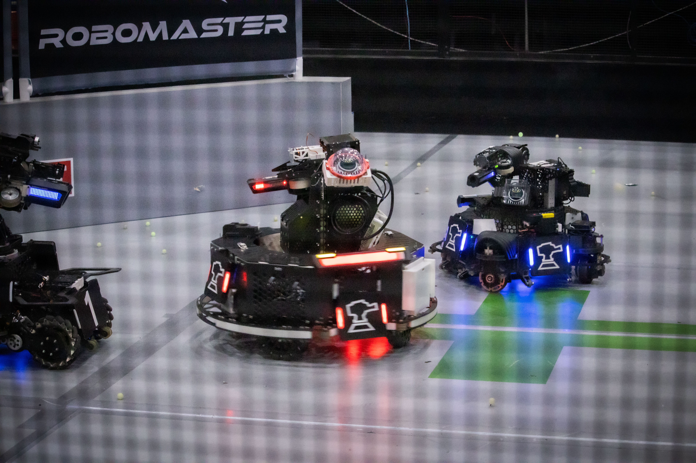
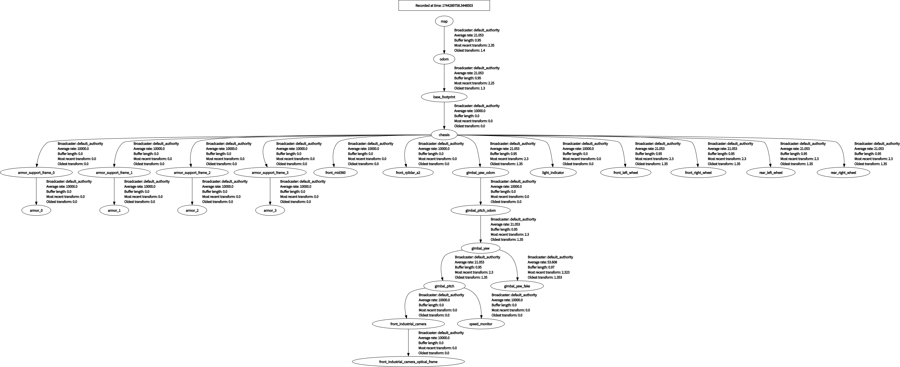
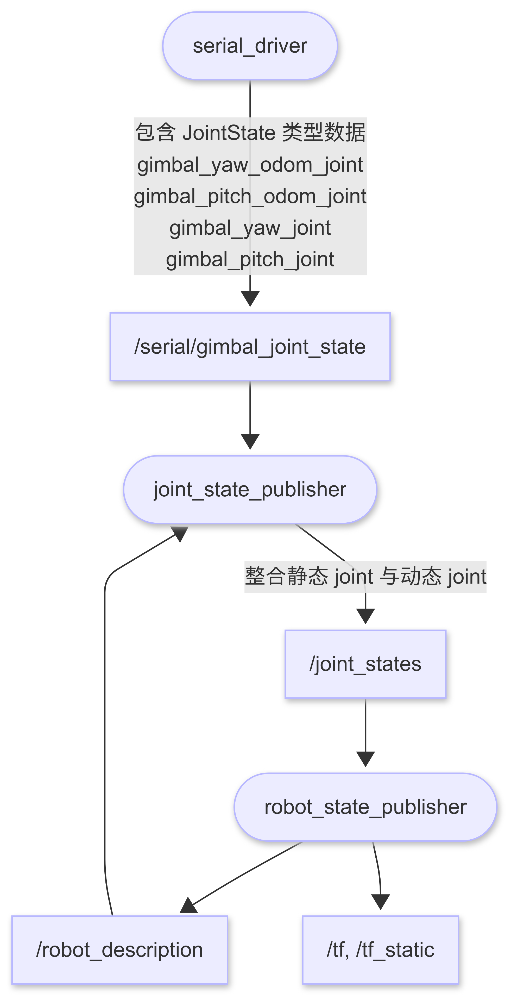
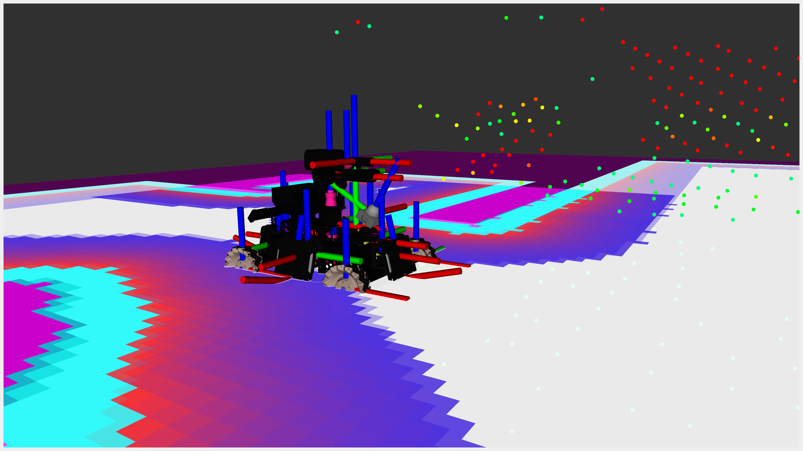
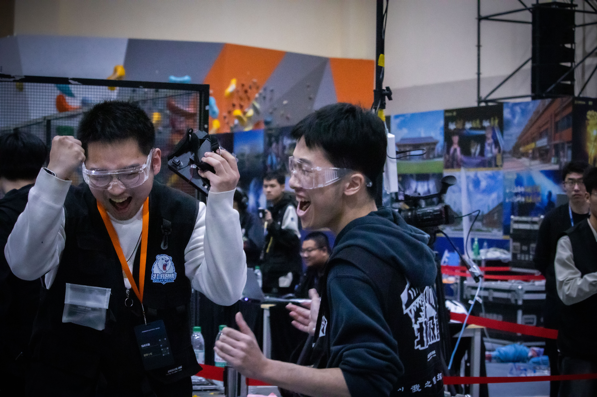
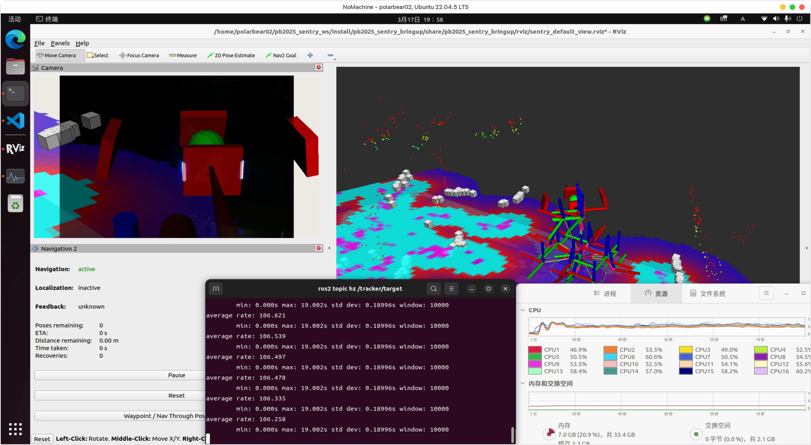
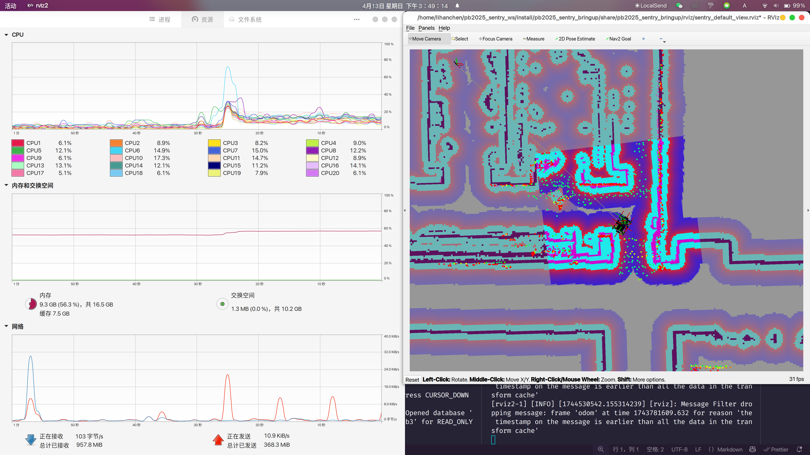

**深圳北理莫斯科大学 北极熊战队 Sim2Real 导航及整车建模开源分享**

菜鸡开源，仅供参考。期待对抗赛后更多强队的开源

## **先放链接**

**导航模块开源：**[https://github.com/SMBU-PolarBear-Robotics-Team/pb2025\_sentry\_nav](https://github.com/SMBU-PolarBear-Robotics-Team/pb2025_sentry_nav)

**上位机全工作空间开源：**[https://github.com/SMBU-PolarBear-Robotics-Team/pb2025\_sentry\_ws](https://github.com/SMBU-PolarBear-Robotics-Team/pb2025_sentry_ws)

## **一. 技术背景概述**

1.从零开始搓新车，无实车可调

24 赛季的哨兵由于机械设计问题，大伙都不想再碰它了（）于是乎打完联盟赛回来后就被“肢解”了。算法组又陷入了无车可调的状态，因此建立"算法仿真→半实物测试→实车验证"的开发流程，降低实车调试风险，也能避免因机械、电控开发周期较靠前导致算法组没有足够的时间进行开发迭代。 番外：25 赛季哨兵机械与布线完成时间约为联盟赛出发前一周，极限调车部署。

1.ROS 成也 TF，败也 TF

24 赛季导航方案中曾遇到过一些问题： 每个传感器都有自己的“原点”系（下称 odom 系），例如 lidar\_odom，imu\_odom，而根据 ROS [REP-105](https://www.ros.org/reps/rep-0105.html)，odom 系表示的是车辆相对于上电位置的位移，导致雷达非放置与云台旋转中心时，机器人实际坐标中心是存在偏差的。 自瞄与导航严格意义上是分开的两棵 TF 树，导致在决策层无法直接使用现成的 TF 库进行坐标查询与变换，从而完成自瞄与导航的联动，例如实现追击行为。 并非自底向上的坐标系建立方式，出现双向变换的发布（例如既发布 odom→lidar，又发布 lidar→base\_link），导致 ROS 坐标变换查询时间异常高。

1.代码风格与质量

强迫症晚期患者，但仅凭人为监督是很容易“被妥协”的，因此有必要使用 pre-commit 和 Github Action 实现自动代码测试审查，从而强制保证代码质量，统一编程风格。

## 二. **详细技术方案**

## **2.1 仿真平台**

### **2.1.1 Why**

前期调研了已有的仿真平台如 [Gazebo](https://gazebosim.org/), [Webot](https://cyberbotics.com/), [Mujoco](https://mujoco.org/), [Isaac](https://developer.nvidia.com/isaac/sim), 综合考虑了仿真需求、运算性能和社区已有资源后，最终选择使用 [Gazebo Ignition](https://gazebosim.org/docs/fortres) 以满足简单的刚体运动仿真，并站在 [RoboMaster-OSS](https://robomaster-oss.github.io/rmoss_tutorials/#/) 的肩膀上进行开发。

### **2.1.2 How**

[rmoss\_gz\_resources](https://github.com/robomaster-oss/rmoss_gz_resources) 提供公共基本模型资源，如裁判系统、标准射击弹丸和 [RoboMaster 2019 AI 机器人](https://www.robomaster.com/zh-CN/products/components/detail/1839)模型。

[rmoss\_gazebo](https://github.com/robomaster-oss/rmoss_gazebo) 提供了 RoboMaster 相关 Gazebo Simulator 插件和模拟 MCU 部分功能的接口，相当于一个虚拟的下位机，为算法层提供了与实车近乎一致的控制接口，包括底盘跟随/独立控制、云台控制和弹丸发射。

通过 [ros\_gz\_bridge](https://index.ros.org/p/ros_gz_bridge/) 实现仿真器到 ROS 的通信。

将组委会开源的[场地模型](https://bbs.robomaster.com/article/372035)使用 Blender 减少面数并去除不必要的模型后，导出为 .dae/.stl 文件后即可导入到 Gazebo 仿真器中。

### **2.1.3 Disadvantage**

对于验证导航算法，Gazebo 仿真器已经够用了。但如果想验证视觉算法，当前使用发现 Gazebo 无法对发光物体（如装甲板）进行真实感渲染，我们尝试使用 [armor\_detector\_openvino](https://github.com/SMBU-PolarBear-Robotics-Team/armor_detector_openvino) 和 [armor\_detector\_opencv](https://github.com/SMBU-PolarBear-Robotics-Team/pb2025_rm_vision/tree/main/armor_detector_opencv) 都无法在 Gazebo 仿真中获得连续的识别效果，效果 be like：

Sorry, your browser doesn't support embedded videos. 抱歉，浏览器不支持 video 视频

2025.2.13 导航自瞄联动的追击行为

## **2.2 整车建模与坐标系**

> 为了这碗醋，包了一盘饺子。但在后期确实挺香的~

### **2.2.1 Why**

**自瞄**如何维护高频的云台坐标变换关系？

gimbal\_odom → gimbal → camera

**导航**如何维护雷达传感器与机器人速度参考系和世界坐标系的变换关系？

map → odom → chassis → gimbal →lidar

**决策**如何实现装甲板受击反馈？

获取云台与底盘装甲板在过去某时刻的相对关系

是时候将 robot\_description 分离为独立的功能包了！

站在 TF2 的肩膀上，TF2 是 ROS2 自带的坐标变换库，用户可以随着时间的推移跟踪多个坐标帧。建模机器人可活动的坐标系和传感器，如 `gimbal_yaw`，`gimbal_pitch`，`industrial_camera`, `lidar`。让自瞄、导航、决策都能维护并共享同一棵坐标变换树。

### **2.2.2 What**

1.ROS 遵循自底向上的建系，也就是 `world` → `chassis` → `gimbal` → `sensors`

电控普遍使用 IMU 建立 `world` 与 `gimbal` 的关系，`chassis` 只是 gimbal 下的子坐标系。换而言之，**电控的建系方式与算法是相反的**，即 `world` → `gimbal` → `chassis`

1.**每个传感器都有自己的“原点”系**（下称 odom 系），例如 lidar\_odom，imu\_odom，而根据 ROS REP-105，odom 系表示的是车辆相对于车辆启动位置的位移。

2.自瞄的实时性要求高频（ > 200Hz）的坐标变换关系，这意味着不可能直接将 Detector 输出的观测目标变换到导航模块维护的 odom 系上，因为 odom → chassis 的变换频率一般不超过 30 Hz。

### **2.2.3 How**

1.电控的建系方式与算法是相反的、自瞄实时性

在 `chassis` 与 `gimbal` 之间嵌入额外的坐标系 `gimbal_odom`，表示电控 IMU 的初始上电位置，因此需要再维护底盘正方向（chassis）与 IMU 初始上电位置（gimbal\_odom）的坐标变换关系，该变换可通过电控转发数据维护。

1.对于导航模块，需要把 fast\_lio / point\_lio 等算法的 camera\_init(lidar\_odom) → body(lidar) 转换为 odom → chassis(base\_footprint)

2.具体实现：串口模块发布 joint\_states 类型数据至 /serial/gimbal\_joint\_state 话题；joint\_state\_publisher 订阅 /robot\_description 和 /serial/gimbal\_joint\_state，整合关节数据后发布到 /joint\_states；robot\_state\_publisher 读取机器人描述文件并订阅 /joint\_states，发布 /tf, /tf\_static 与 /robot\_description，建立整车 TF

注：`gimbal_pitch_odom_joint`, `gimbal_yaw_odom_joint` 表示云台 IMU 上电位置相对于底盘正方向的变换；`gimbal_pitch_joint`, `gimbal_yaw_joint` 表示云台 IMU 相对于 IMU 上电位置的变换，也即 IMU 的 pitch, yaw 解算数据。以上四个数据值均由电控维护；

### **2.2.4 常被问到的问题**

1.为什么引入坐标系 base\_footprint？

在 24 赛季和本赛季初期，在使用 `nav2_costmap_2d::InflationLayer` 插件时，常出现报错 [#3273](https://github.com/ros-navigation/navigation2/issues/3273)，导致无法正确清除动态障碍物走过留下的轨迹。对比实验后发现是由于 LiDAR 转换后的点云处于地图下（z < 0），如下图

 未添加 base\_footprint 坐标系，导致车体和地面点云实际沉在 map 下

base\_footprint 的含义是 chassis 向地面的投影，也就是说本质上就是添加地面到底盘的高度作为 base\_footprint → chassis 的 z 轴偏移。如下图

.png)

 添加 base\_footprint 坐标系 z 偏移后，车体和地面点云均与实际一致

1.`base_frame` 与 `robot_base_frame` 的区别？

`base_frame` 表示机器人本体的建系起点，也就是机器人描述文件中的第一个 link

`robot_base_frame` 表示机器人的速度参考系（通常为 gimbal\_yaw）

1.坐标系 `lidar_odom` 应插在哪之间？

笔者尝试了很多方式，插入在 `odom` → `base_footprint` 或前或后，本质上都破坏了自底向上建系的逻辑，又容易重蹈 24 赛季中 lookupTransform() 函数耗时异常的覆辙。

由于 `lidar_odom` 本质上是一个虚拟但确实存在的坐标系，表示 LIO 算法启动时的初始坐标系（point\_lio / fast\_lio 默认称之为 `camera_init` 系），因此笔者的做法是不把它显式的发布在 TF Tree 中，`odom` → `lidar_odom` 仅作为一个隐式变换，其变换值与程序启动时刻的 `base_footprint` → `lidar` 是等价的。

.png)

## **2.3 感知**

环境感知指的是机器人对于周围障碍物、地形的辨识能力。简单的解决方法如 Navigation2 中 costmap 的 obstacle\_layer，将输入点云中高于一定高度阈值的点分类为障碍物。

1.坡面识别

使用 CMU 开源的 terrain\_analysis。 大致流程： 点云预处理。裁剪仅保留车体周围一定范围的区域，通过下采样降低数据密度，并将点云按体素网格结构存储，以提高处理效率。 动态体素滚动更新。根据车辆实时位置动态调整体素网格布局：当车辆移动超出当前网格中心范围时，循环平移体素阵列，确保处理区域始终围绕车体，同时清理边缘旧数据。 地面基准高度计算。对每个体素内的点按高度排序，选取分位数高度作为地形基准。若存在地面抬升限制，则对基准高度进行约束，避免过度抬升。 高程差与障碍物标记。计算每个点相对于所在体素基准的高度差，点的高程信息被存储在点云消息的 intensity 域，通过将 intensity 高于一定 阈值的点辨识为障碍物即可实现障碍物和的辨识

1.原生对接 NAV2 框架

参考 nonpersistent\_voxel\_layer 创建了 intensity\_voxel\_layer，由于 terrain\_analysis 已经将地形结果保存在点云的 intensity field 中，因此可以直接通过 intensity 值判断是否为障碍物，并将 3D 障碍物点云拍平到 2D 栅格表示。

## **2.4 定位**

哨兵导航分为建图模式和导航模式。重定位表示将每次里程计的启动位置（odom）匹配到先验栅格/点云地图的起点（map），即维护 map → odom 的变换；里程计维护的是 odom → base\_footprint 的变换，这两对坐标变换关系都是 Navigation2 所需的。

建图模式：纯 point\_lio 里程计

导航模式：small\_gicp 重定位 + point\_lio 里程计

### **2.4.1 point\_lio**

优点：对剧烈运动导致的 IMU 饱和环境比较鲁棒，允许高速旋转

缺点：输出的点云并非全量的，经过体素降采样

Tips: 对于一个完整的机器人系统，我们需要的是 odom → base\_footprint 的变换，而不是 lio 输出的 lidar\_odom → lidar。笔者的做法是在 [sensor\_scan\_generation](https://github.com/SMBU-PolarBear-Robotics-Team/pb2025_sentry_nav/blob/639564455ec52d6bd44969c7cb09e470953e1545/sensor_scan_generation/src/sensor_scan_generation.cpp#L75-L81) 功能包中订阅 lidar 里程计，再通过机器人各个关节间的变换，拆解为 odom → base\_footprint 的TF 和 odom → gimbal\_yaw 的里程计。

### **2.4.2 small\_gicp**

[small\_gicp](https://github.com/koide3/small_gicp.git) 是一个点云注册的高效和并行算法

**优点：**

1.单线程 small\_gicp::GICP 分别比 pcl::GICP 和fast\_gicp::GICP 快2.4倍和1.9倍

2.small\_gicp::GICP 的输出几乎与 fast\_gicp::GICP 的输出相同

**对 livox mid360 非重复扫描的特殊优化：**

问题：mid360 非重复扫描的点云模式导致单帧点云较少存在一定随机性。

在 ROS 中，重定位模块关联的坐标变换是 map → odom，在里程计足够稳健的情况下，并不需要十分高频的重定位计算。

积分 0.5s 内的点云，再将积分后的点云输入 small\_gicp 与先验点云图做匹配。

Sorry, your browser doesn't support embedded videos. 抱歉，浏览器不支持 video 视频

2025.3.2 rosbag 测试定位

## **2.5 控制**

### **2.5.1 NAV2 自定义控制器** [**pb\_omni\_pid\_pursuit\_controller**](https://github.com/SMBU-PolarBear-Robotics-Team/pb_omni_pid_pursuit_controller)

NAV2 框架中 controller 的功能是根据局部路径与障碍物计算出期望速度，从而控制车辆跟随局部路径和局部避障。

 主要的 NAV2 开源控制器

TEB 好用，但是参数十分难调；DWB 好调，但是对于全向移动机器人，规划出的局部路径容易左右“震荡”来回横跳。

另外，目前开源的主流 Controller 方案线速度和角速度是绑定输出的，但对于 RoboMaster 场景下，机器人的运动规划仅需要输出线速度给底盘即可，小陀螺角速度应是决策层或电控功率控制决定的。因此，最终选择基于 Regulated Pure Pursuit Controller 和 PID 算法开发一个简单易用，允许仅输出线速度的控制器。

#### 主要流程

1.从 global\_plan 中裁剪出 local\_costmap 范围内的路径

2.根据当前速度自适应计算 carrot\_pose，即前瞻点

3.解耦线速度和角速度的计算

使用平移 PID 和旋转 PID，根据期望值分别输出线速度和角速度，对于 RM 场景可选择仅输出线速度。

1.运动优化策略

**曲率速度限制：**给定前视距离和后视距离参数，得到包含 carrot\_pose 在内的三个点计算曲率，根据曲率大小限制速度输出。

**末端接近速度衰减**：`velocity_scaling = remaining_dist / scaling_dist`

**碰撞检测：**当前 controller 尚未加入主动局部避障的功能**，**若路径上遇到障碍物，则停止机器人，并等待全局规划器规划出新的可通行路径。

Sorry, your browser doesn't support embedded videos. 抱歉，浏览器不支持 video 视频

### **2.5.2 虚拟云台坐标系**

Idea 源于 2024 赛季 深技大 Shockley。

对于无大小 YAW 的哨兵机械构型，LiDAR 固连 gimbal\_yaw，若云台处于扫描模式（即 gimbal\_yaw 处于自旋状态），会使 NAV2 认为速度参考系一直在不停地旋转，但 Controller 的计算频率一般不超过 30 Hz，导致速度输出与实际速度参考系存在滞后。

**核心思路**

创建一个稳定的速度参考系，将它作为 NAV2 的速度参考系并输出基于该坐标系的速度。

**方法**

1.订阅原始速度参考系的 odometry，获取 odom.yaw 数据。在 chassis 上创建 gimbal\_yaw\_fake 坐标系，其 yaw 角为 -odom.yaw。

2.将 NAV2 输出的基于虚拟坐标系 gimbal\_yaw\_fake 的速度，根据 yaw\_diff = odom\_yaw 解算回真实速度参考系 gimbal\_yaw 并转发给下位机。

**代码实现后发现的问题**

**现象：**速度参考系（gimbal\_yaw）旋转时，车辆始终偏移路径一小段距离

**原因：**NAV2 计算输出速度指令需要时间，一定晚于各个传感器的输入时间。这就导致[fake\_vel\_transform](https://github.com/SMBU-PolarBear-Robotics-Team/pb2025_sentry_nav/tree/main/fake_vel_transform) 中，获取到的速度参考系里程计的时间，晚于获取到的速度指令的时间，换而言之**两个数据的时间未对齐**，因此基于旧时刻云台方向的速度被错误地用于新时刻云台方向。

**解决方法**

方法很简单也很直接，就是用 ROS 自带的 message\_filter 给 odometry 和 cmd\_vel 做时间同步。

但现有 Humble 版本 NAV2 release 的 cmd\_vel 并没有保留 header 时间戳。无法直接时间同步。笔者的做法是使用 local\_plan 的时间戳当作 cmd\_vel 的时间戳完成时间同步，应为 local\_plan 和 cmd\_vel 都是 controller 同时发布的，但这会导致代码中出现很多繁琐的逻辑处理，笔者强烈推荐后人使用 ROS2 Jazzy。Related Issue: [Switch from Twist to TwistStamped for cmd\_vel](https://github.com/ros-navigation/navigation2/issues/1594)

Sorry, your browser doesn't support embedded videos. 抱歉，浏览器不支持 video 视频

## **2.6 Others**

一些小功能 / 实践中遇到问题的解决方案

### **2.6.1 BackUpFreeSpace Behavior**

本功能的实现启发自 [四川大学 2024 开源](https://github.com/PolarisXQ/SCURM_SentryNavigation)

在 RM 激烈场景中，常常会出现哨兵机器人被碰撞陷入到障碍层中，或者被多台车包围完全无法规划出安全路径，这是会触发 NAV2 进入 Recover 模式尝试脱困，但 NAV2 默认的 [BackUp Behavior](https://github.com/ros-navigation/navigation2/blob/main/nav2_behaviors/plugins/back_up.cpp) 仅会让机器人朝着正后方后退，显得不太智能。

因此启发自 [四川大学2024开源](https://github.com/PolarisXQ/SCURM_SentryNavigation)，@陈炜眀 开发了 BackUpFreeSpace Behavior。该算法流程其实也比较简洁：

1.获取 costmap；

2.像人一样向周围扫视 360° 射线，遍历出无障碍物的射线；

3.优先选取角度跨度最大的一对安全射线；

4.选取一对安全射线的中值作为脱困方向并输出速度。

Sorry, your browser doesn't support embedded videos. 抱歉，浏览器不支持 video 视频

### **2.6.2 在 odom 系后的数据需使用 lio 输出的点云**

point\_lio/fast\_lio 等算法会覆写点云的时间戳和去除运动畸变，并使点云与里程计时间对齐。

又因为 NAV2 建立 map 与机器人的关系需要里程计数据，这意味着 **NAV2 中输入的传感器数据，严格意义上都要基于里程计才能将 LiDAR 系的点云转换到世界系。**

笔者查看以往赛季的开源中发现，NAV2 costmap 输入的障碍物点云都是原始的 /livox/lidar 数据，这会导致 lidar 高速旋转时点云出现不正常的偏移。正确做法应是使用 lio 输出的点云。

## **2.7 代码规范**

通过 [clang-format](https://clang.llvm.org/docs/ClangFormat.html), [clang-tidy](https://clang.llvm.org/extra/clang-tidy/), [Ruff](https://github.com/astral-sh/ruff) 和 [VSCode 插件](https://github.com/LihanChen2004/ros2_with_vscode)等工具实现代码在本地的格式化，[pre-commit](https://github.com/pre-commit/pre-commit) 强制要求通过代码风格等检查后才允许 commit，[Github Action](https://github.com/SMBU-PolarBear-Robotics-Team/pb2025_sentry_nav/actions) 在云端虚拟机中安装依赖链并检查编译结果，也可实现自动检查代码风格、打包发布 Docker Image… 一切皆有可能。笔者还不太玩明白测试单元，但 Github 这 CI 拓展性也是使我大受震撼。

人是不可靠的，容易被妥协。但当把范式写入 .clang-format 等文件后，每次保存文件都将自动执行代码风格化，不再需要组长唠唠叨叨，使我神清气爽~

## **Result**

比较可惜的是，由于当前仍然未知且下场后无法复现的问题（）导致哨兵机器人 miniPC 在赛场上出现开机失败和程序非正常强制终止的现象，联盟赛只正常发挥了一局，那一局我躺在备场区，听着队友们在身边狂喊“woc，烧饼出去了！！！，first blood！！！”，烧饼的故事也短暂地圆满了。

Sorry, your browser doesn't support embedded videos. 抱歉，浏览器不支持 video 视频

在规范的 TF 下，导航的性能占用也被极致压缩。以下截图是哨兵机载 miniPC 雷神 mix3 i7-13620H 的测试结果，同时运行导航与自瞄时的 CPU 占用资源约 55%。单开导航的CPU占用资源约 25%

## **当前不太好的 / 相信后人的力量**

1.无法做到任意起点启动，匹配 map2odom。

一种可能有效的思路：[KISS-Matcher](https://github.com/MIT-SPARK/KISS-Matcher) 粗匹配 + [small\_gicp](https://github.com/koide3/small_gicp) 精匹配

1.2D 的地图表征形式局限性较多，在本开源项目中主要表现为建图时障碍物被不正确擦除。

或许可以尝试完全基于 3D 地图的开源导航框架：[mesh\_navigation](https://github.com/naturerobots/mesh_navigation)

1.controller 加入触发器，若无法通行则触发 planner 规划新的路径

2.point\_lio 重力对齐

## **致谢**

以下内容不分先后

[rm\_vision](https://github.com/chenjunnn/rm_vision)：素未谋面，但是笔者的 RM、ROS2 启蒙老师。rm\_vision 的恩情从大一影响到现在！

[robomaster-oss](https://github.com/robomaster-oss)：代码如诗，仿真包的依赖，第一次见 C++ 模块与抽象化设计使笔者叹为观止。

[SCURM\_SentryNavigation](https://github.com/PolarisXQ/SCURM_SentryNavigation)：标准的技术方案文档，给出了量化的测试实验和不同方案的对比，本项目的 intensity\_voxel\_layer 和 BackUp Behavior 均受其启发。

[CSU-RM-Sentry](https://github.com/baiyeweiguang/CSU-RM-Sentry)：笔者对导航的启蒙项目。

[rm2022\_auto\_infantry\_ws](https://github.com/SCAU-RM-NAV/rm2022_auto_infantry_ws)：依稀记得在大一下跑通该项目的仿真+导航，使小小的笔者大受震撼，埋下了两年后的伏笔。

江苏开放大学小刘：在 sim2real 时提供了 rosbag 用于测试完善定位算法。

北极熊导航产后护理的群友们：作为“内测”用户帮助笔者发现了很多细节问题，也看到了群友们把这一套导航框架部署在平衡/人形机器人上的花活 0.o

北极熊的崽崽们：我看着你们，满怀期待，因为未来终究是你们的。

