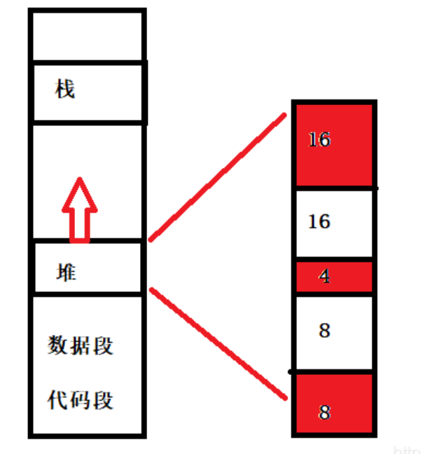
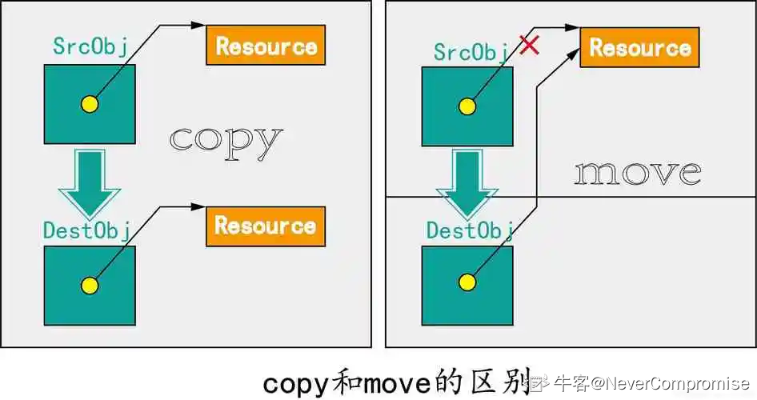
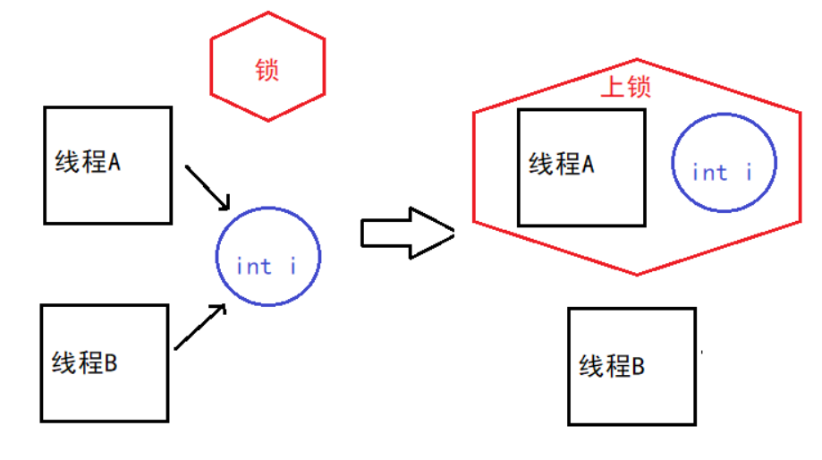
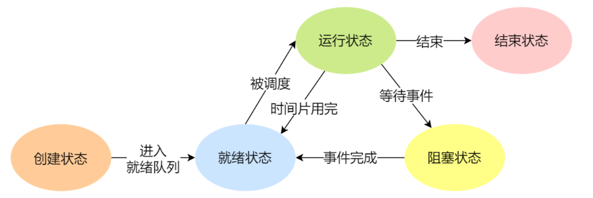
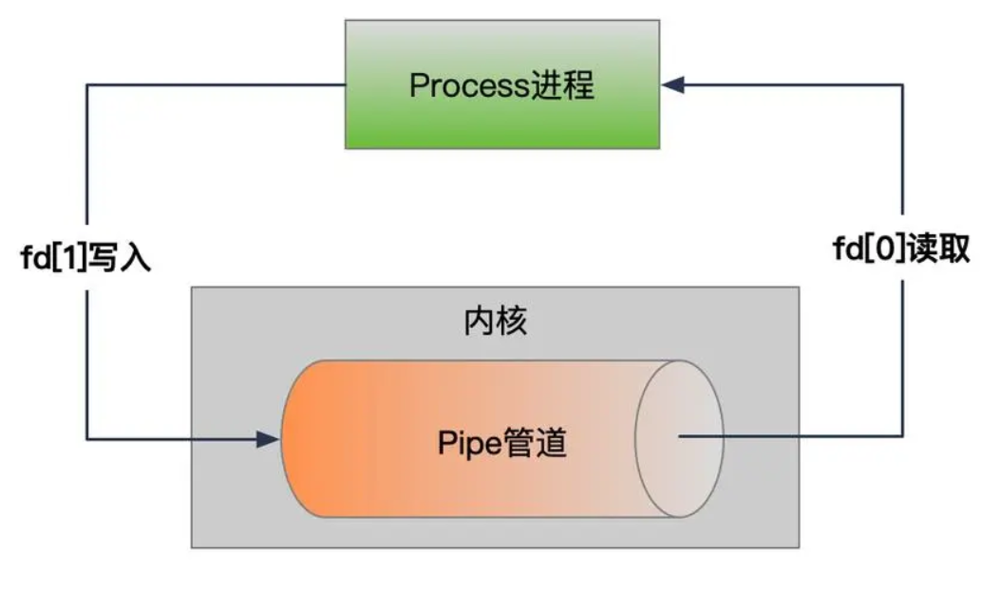
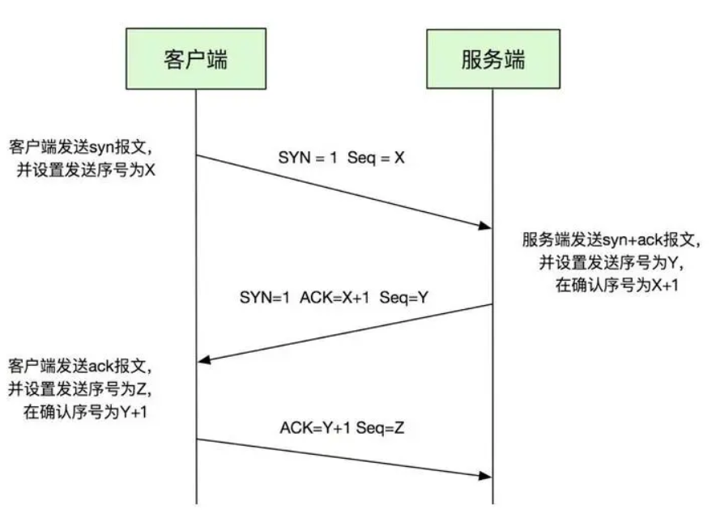

# C语言 （内存管理）

## **1.(内存)堆和栈的区别**⭐

**堆栈空间分配不同：**

-   栈由操作系统自动进行分配和释放，用于存放函数的参数值、局部变量的值等，具有高效性。
-   堆一般由程序员手动进行分配和释放，效率比栈低很多。

**堆栈缓存方式不同：**

-   栈使用一级缓存，存储在处理器核心中，调用完成后立即释放，速度较快。
-   堆存储在二级缓存或主存中，速度相对较慢。

**生长方向**：

-   堆：堆的分配方向是向上的，即向地址较大的方向分配。当堆需要扩展时，会向高地址方向增长。
-   栈：栈的分配方向是向下的，即向地址较小的方向分配。当栈需要扩展时，会向低地址方向增长。

**生命周期：**

-   堆：堆上的内存在分配时并不会被立即释放，需要手动进行内存释放操作。堆上的数据可以在程序的任意位置进行访问，不受函数的调用关系限制。
-   栈：栈上的内存分配和释放是自动进行的，随着函数的调用和返回进行相应的操作。栈上的数据只在特定的作用域内有效，函数执行完成后会自动释放。

**空间大小：**

-   栈的空间大小一般较小，通常最多为2MB，超过则会报溢出错误。
-   堆的空间比较大，理论上可以接近3GB（对于32位程序来说）。

**能否产生碎片：**

-   栈操作遵循"后进先出"的原则，不会有内存块从栈中弹出，因此不会产生碎片。
-   堆是通过动态分配内存的方式进行分配和释放，频繁的申请和释放内存可能会引发内存碎片问题。

## **2.在函数中申请堆内存需要注意什么**⭐

-   确保不要错误地返回指向栈内存的指针，因为栈内存会在函数结束时自动释放。
-   避免在函数内部申请临时数组，因为函数执行完成后，该数组会消失。
-   不要返回指向常量区的内存空间，因为它们无法修改且获取它们没有意义。
-   使用传入一级指针无法解决问题，因为函数内部指针的修改不会影响传入的指针。
-   在分配堆内存时，确保空间足够存储所需数据，避免访问越界和产生未定义行为。

解决办法如下：

-   使用二级指针来返回申请的堆内存的地址，通过间接引用来修改指针值，从而确保在函数外部能够获取到堆内存的内容。
-   使用指针函数来解决问题，即返回通过malloc函数申请的堆内存的地址，这样可以在函数外部使用free函数释放该内存。

## 3.请你说说内存碎片⭐

内存碎片是指在内存管理过程中产生的未被有效利用的零散、不连续的内存空间。主要分为两种类型：**内部碎片**和**外部碎片**。

-   内部碎片：是由于固定大小的内存分配方式或对齐要求等原因导致的未被利用的小空间。当分配给进程的内存块大于所需的大小时，其中的剩余空间就成为了内部碎片。
-   外部碎片：是由于存在未分配的连续内存空间太小而不能满足分配请求，从而导致这些内存无法被有效利用。

解决内存碎片问题的方法可以包括：

-   段页式管理：采用虚拟内存管理技术，将物理内存划分为不同的页或段，以更灵活地管理和分配内存空间，减少碎片化。
-   使用内存池：通过分配一定数量的内存块，由内存池来管理分配和回收，减少频繁的内存分配和释放，从而减少碎片化。

## 4.什么是内存池⭐

**内存池（Memory Pool）**是一种动态内存分配与管理技术。通常情况下习惯使用new/delete/malloc/free等API申请分配和释放内存，这样导致的后果是：当程序长时间运行时，由于所申请的内存块大小不定，频繁使用时会造成大量的内存碎片从而降低程序和操作系统的性能。**内存池则是在真正使用内存之前，先申请分配一大块内存(内存池)留作备用，当我们申请内存时，从池中取出一块动态分配的内存，释放内存时，再将我们使用的内存释放到我们申请的内存池内，再次申请内存池也可以再取出来使用。并且，尽量与周边的内存块合并。若内存池不够时，则自动扩大内存池，从操作系统中申请更大的内存池**

### 为什么需要内存池？

**解决内存碎片问题**




假设系统依次分配了16,16,4,8,8字节，接着释放了16字节和8字节归还给了系统（红色表示还未归还给系统），那么现在堆区空闲了一个16字节的空间和一个8字节的空间。这是如果用户要想申请出一个24字节的空间，那么系统就无法分配连续的空间给用户。这就是内存碎片的问题。

## **5.使用指针需要注意什么？**⭐⭐

1.  定义指针时，最好将其初始化为 NULL，这样可以避免使用未初始化的指针。
2.  在使用 malloc 或 new 分配内存之后，应该立即检查指针的值是否为 NULL，以防止在使用指针值为 NULL 的内存时出现问题。在 C++11 及更高版本中，使用 new 分配内存的时候，如果发生错误，会抛出异常，因此不需要显示判空。
3.  当使用指针指向数组或者动态分配的内存时，一定要记得为其赋初值，避免使用未被初始化的内存作为右值。
4.  小心避免数字或指针的下标越界，特别是一些常见的“多1”或者“少1”错误。
5.  在释放动态分配的内存时，务必确保申请和释放是配对的，以防止内存泄漏。
6.  使用 free 或 delete 释放内存后，立即将指针设置为 NULL，以避免出现悬空指针（野指针）。
7.  避免指针的多重间接性：多重间接性指的是通过多个指针进行连续的解引用操作。尽量避免过多的间接性，以提高代码的可读性和维护性。
8.  注意浅拷贝和深拷贝：如果指针指向的是动态分配的内存，涉及到对象的拷贝或赋值时，需要注意浅拷贝和深拷贝的区别。深拷贝会复制整个对象及其指向的内存，而浅拷贝只是复制指针本身，可能导致多个指针指向同一块内存。

## **6.初始化为0的全局变量在bss还是data**

初始化为0的全局变量通常会被分配到程序的BSS（Block Started by Symbol）段。BSS段是用于存放未初始化或初始化为0的全局变量和静态变量的一部分内存空间。在程序加载时，系统会自动将BSS段中的变量初始化为0。

已经明确初始化为非零值的全局变量会被分配到程序的数据（Data）段。Data段用于存放已经初始化的全局变量和静态变量。

总结来说，初始化为0的全局变量通常会被分配到BSS段，而已初始化为非零值的全局变量则会被分配到Data段。

# C++ (一)

## 一、new和malloc ⭐

-   new是C++的关键字，用于动态分配内存并创建对象。它可以根据类型自动计算所需内存空间，并调用对象的构造函数进行初始化。在使用new分配内存后，需要使用delete来释放这些内存空间，以防止内存泄漏。
-   malloc是C语言的库函数，用于动态分配一块指定大小的内存块，并返回其地址。需要注意的是，使用malloc分配内存后，需要使用free来释放这些内存空间，以防止内存泄漏。

```cpp
#include &lt;iostream&gt;
#include &lt;cstdlib&gt;

int main() {
    // 使用new进行动态内存分配和释放
    int* newPtr = new int(10);
    std::cout &lt;&lt; "Value allocated with new: " &lt;&lt; *newPtr &lt;&lt; std::endl;
    delete newPtr;

    // 使用malloc进行内存分配和释放
    int* mallocPtr = (int*)malloc(sizeof(int));
    if (mallocPtr != nullptr) {
        *mallocPtr = 20;
        std::cout &lt;&lt; "Value allocated with malloc: " &lt;&lt; *mallocPtr &lt;&lt; std::endl;
        free(mallocPtr);
    }

    return 0;
}
```

## 二、class和struct的区别 ⭐

```cpp
struct StructExample {
    int publicMember; // 默认public，可以直接访问
};

class ClassExample {
    int privateMember; // 默认private，不能直接访问

public:
    // 公共接口，允许外部访问privateMember
    int getPrivateMember() const {
        return privateMember;
    }

    void setPrivateMember(int value) {
        privateMember = value;
    }
};

int main() {
    StructExample se;
    se.publicMember = 10; // 直接访问

    ClassExample ce;
    ce.setPrivateMember(20); // 通过公共成员函数设置私有成员
    int value = ce.getPrivateMember(); // 通过公共成员函数获取私有成员
}
```

## 三、char和int之间的转换

```cpp
char c = 'A';
int i = c;  // 将字符'A'的ASCII码值赋给i

int i = 65;
char c = static_cast&lt;char&gt;(i);  // 将整数65转换为对应的字符'A'
```

需要注意的是，对于转换为char的int值，如果超出了char类型的范围(-128至127)，将会发生溢出，只保留最低位字节的值。

## 四、什么是野指针和悬挂指针 ⭐

-   野指针（Dangling Pointer）：指的是没有初始化过的指针，它指向的地址是未知的、不确定的、随机的。

产生野指针的原因主要是指针未初始化，防止的措施就是指针初始化（包括及时初始化或置空）。

```cpp
int main() {
    int* ptr; // 未初始化的指针，成为野指针

    // 使用野指针会导致未定义的行为
    *ptr = 5; // 解引用野指针，可能导致程序崩溃

    return 0;
}
```

-   悬挂指针（Dangling Reference）：指针最初指向的内存已经被释放了的一种指针。指针指向的内存已释放，但指针的值没有被清零，对悬空指针操作的结果不可预知。

```cpp
int* createInt() {
    int value = 5;
    int* ptr = &amp;value;
    return ptr; // 返回指向局部变量的指针
}

int main() {
    int* danglingPtr = createInt(); // 指向已释放的内存

    // 对悬挂指针操作的结果不可预知
    int value = *danglingPtr; // 解引用悬挂指针，可能导致未定义的行为

    return 0;
}
```

局部变量 value 会在 `createInt` 函数执行完毕后，离开其作用域时被销毁。此时，`value` 占用的内存将不再被 `value` 所拥有，但是通过 `ptr` 返回的指针依然指向这块内存。由于这块内存已经被释放，再通过 ptr 访问它将会导致未定义行为（Undefined Behavior），可能引起程序崩溃或其他不可预知的错误。

重要的是要理解，局部变量 `value` 的生命周期仅限于 `createInt` 函数的作用域内。一旦函数返回，`value` 的生命周期结束，<u>它所占用的内存可以被系统回收或重新分配给其他变量。</u>

在C++中，正确处理这类情况的一种方法是使用动态内存分配，例如使用 `new` 关键字分配内存，并在适当的时候使用 `delete` 来释放内存：

```cpp
int* createInt() {
    int* ptr = new int(5); // 使用new分配内存，并初始化为5
    return ptr; // 返回指向这块内存的指针
}

// 使用完毕后，需要使用delete释放内存
int* ptr = createInt();
// ... 使用ptr ...
delete ptr; // 释放ptr指向的内存
ptr = nullptr; // 将ptr设置为nullptr，避免悬挂指针问题
```

## 五、NULL和nullptr区别⭐

-   在C++11之前，NULL 是一个宏，通常被定义为 0 或 (void\*)0。在C++11及以后，NULL 被定义为 nullptr。
-   nullptr 是C++11引入的一个更现代、更安全的方式来表示空指针。尽管 NULL 在旧代码中仍然广泛使用，但在新的C++代码中，推荐使用 nullptr。

## 六、指针常量和常量指针有何区别⭐

-   指针常量：指针本身的值不可改变（即不能让它指向另一个地址），但可以改变它所指向的数据（除非数据本身是常量）。（指针地址不可变，值可变。注：指针常量在定义时要赋初值。）

```cpp
int a = 0，b = 0;
int* const p = &amp;a;
*p = 1; //正确，可以修改值
*p = &amp;b; //错误，不可改变地址
```

-   常量指针：指针可以改变指向的地址，但它所指向的数据是不可修改的（即数据是常量）。

（指针地址可以变，值不能变）

```cpp
int a = 0，b = 0;
const int *p = &amp;a;
*p = 1; //错误，不可修改常量值
*p = &amp;b; //正确，可以指向另一个常量
```

**区分记忆：比较const和\*谁离ptr更近，如果const更近则表示指针本身是常量，是指针常量；如果\*离ptr更近则表示指向的值value不能更改，是常量指针；否则是**指向常量的指针常量（const int \* const p = &a）

## 七、物理内存和虚拟内存的区别⭐

-   本质：物理内存是实际存在的硬件资源，而虚拟内存是操作系统提供的一种抽象和扩展。
-   大小：物理内存的大小受限于硬件，虚拟内存的大小受限于物理内存和磁盘空间。
-   访问速度：物理内存的访问速度通常远快于虚拟内存，因为硬盘的读写速度远低于RAM。
-   目的：物理内存用于存储当前活跃的程序和数据，虚拟内存用于扩展可用的内存空间，允许更多的程序并发运行或处理更大的数据集。
-   管理：物理内存由硬件直接管理，而虚拟内存由操作系统通过复杂的内存管理算法进行管理。

**虚拟内存的使用可以提高系统的多任务处理能力，但过度依赖虚拟内存可能导致性能下降，因为频繁的页面交换（也称为“页面抖动”或“抖动”）会增加对硬盘的访问，从而降低程序的响应速度。**

## 八、重载、重写和隐藏的区别⭐

## 1、重载（**Overloading）**

-   重载是在同一个作用域内定义多个相同名称但参数列表不同的函数或方法。
-   重载提供相同功能但接受不同参数的函数版本。

```cpp
#include &lt;iostream&gt;

void printNumber(int num) {
    std::cout &lt;&lt; "Integer number: " &lt;&lt; num &lt;&lt; std::endl;
}

void printNumber(double num) {
    std::cout &lt;&lt; "Floating-point number: " &lt;&lt; num &lt;&lt; std::endl;
}

int main() {
    printNumber(10);
    printNumber(3.14);
    return 0;
}
```

## 2、重写（override）

-   重写是指子类重新定义从父类继承的虚函数，使其具有不同的实现。
-   重写的函数签名（函数名、参数列表和返回类型）必须与被重写函数相同。

```cpp
#include &lt;iostream&gt;

class Base {
public:
    virtual void sayHello() {
        std::cout &lt;&lt; "Hello from Base class!" &lt;&lt; std::endl;
    }
};

class Derived : public Base {
public:
    void sayHello() override {  // 使用 override 关键字表明重写了父类的函数
        std::cout &lt;&lt; "Hello from Derived class!" &lt;&lt; std::endl;
    }
};

int main() {
    Base* basePtr = new Derived();
    basePtr-&gt;sayHello();  // Output: "Hello from Derived class!"
    delete basePtr;
    return 0;
}
```

## 3、隐藏（**Hiding）**

-   隐藏发生在派生类中，当派生类中的一个成员（可以是函数或变量）与基类中的成员名称相同，但又不是重写（即函数签名不匹配）时，就会发生隐藏。
-   隐藏的成员可以通过基类类型的引用或指针来访问，或者在派生类中使用 using 声明来解决名称冲突。

```cpp
#include &lt;iostream&gt;

class Base {
public:
    void sayHello() {
        std::cout &lt;&lt; "Hello from Base class!" &lt;&lt; std::endl;
    }
};

class Derived : public Base {
public:
    void sayHello() {
        std::cout &lt;&lt; "Hello from Derived class!" &lt;&lt; std::endl;
    }
};

int main() {
    Base baseObj;
    Derived derivedObj;
    
    baseObj.sayHello();    // Output: "Hello from Base class!"
    derivedObj.sayHello(); // Output: "Hello from Derived class!"
    
    Base* basePtr = new Derived();
    basePtr-&gt;sayHello();   // Output: "Hello from Base class!"
    
    delete basePtr;
    return 0;
}
```

## 4、总结

**重载和重写是多态性的重要体现，而隐藏更多是名称冲突的一种情况。正确理解这些概念有助于更好地设计和实现面向对象的程序。**

## 九、简述面向对象（OOP）的三大特性 ⭐

1.  封装（Encapsulation）：封装是将数据（属性）和操作这些数据的代码（方法）捆绑在一起的过程。它隐藏了内部细节，只暴露出一个可以被外界访问和使用的接口。封装使得代码模块化，提高了代码的安全性和易于维护。
2.  继承（Inheritance）：继承是一种机制，允许一个类（称为子类或派生类）继承另一个类（称为基类或父类）的属性和方法。子类可以扩展或修改基类的行为，也可以添加新的属性和方法。继承支持代码复用，可以创建层次结构，使得程序结构更加清晰。
3.  多态（Polymorphism）：多态是指允许不同类的对象对同一消息做出响应，但具体的行为会根据对象的实际类型而有所不同。多态可以通过虚函数在基类中实现，使得派生类可以重写（Override）基类中的方法，以提供特定的实现。多态性使得代码可以对不同类型的对象执行不同的操作，而不需要知道对象的具体类。

**封装提供了数据和操作的保护，继承支持了代码的层次结构和复用，而多态则允许编写更加通用和灵活的代码**。

## 十、什么是多态 ⭐

利用虚函数，基类指针指向基类对象时就使用基类的成员（包括成员函数和成员变量），指向派生类对象时就使用派生类的成员。 基类指针可以按照基类的方式来做事，也可以按照派生类的方式来做事，它有多种形态，或者说有多种表现方式，我们将这种现象称为多态（Polymorphism）。

```cpp
#include &lt;iostream&gt;

class Base {
public:
    virtual void print() {
        std::cout &lt;&lt; "This is the Base class" &lt;&lt; std::endl;
    }
};

class Derived : public Base {
public:
    void print() override {
        std::cout &lt;&lt; "This is the Derived class" &lt;&lt; std::endl;
    }
};

int main() {
    Base* basePtr;
    
    Base baseObj;
    Derived derivedObj;
    
    basePtr = &amp;baseObj;
    basePtr-&gt;print();  // 此时使用基类的成员函数来打印消息
    
    basePtr = &amp;derivedObj;
    basePtr-&gt;print();  // 此时使用派生类的成员函数来打印消息
    
    return 0;
}
```

## 十一、静态链接库和动态链接库的区别 ⭐

-   链接时间：静态链接在编译时完成，而动态链接在程序运行时完成。
-   部署：静态链接生成的可执行文件是自包含的，易于部署；动态链接需要确保运行时库文件的可用性。
-   内存使用：静态链接可能会导致多个副本的相同代码存在于内存中（如果多个程序运行），而动态链接允许共享同一份库代码。
-   更新和维护：静态链接的程序更新需要重新编译，动态链接的库更新只需替换DLL或共享库文件。
-   性能：静态链接可能提供更好的性能，因为它避免了运行时链接的开销；动态链接可能在启动时有额外的开销。

**C++与C在编译时的主要区别有以下几点：**

1.  由于C++支持函数重载，因此编译器编译函数的过程中会将函数的参数类型也加到编译后的代码中，而不仅仅是函数名；而C语言并不支持函数重载，因此编译C语言代码的函数时不会带上函数的参数类型，一般只包括函数名。
2.  语法和功能：C++相比C具有更多的语法和功能。C++引入了面向对象编程的概念，包括类、继承、多态等。此外，C++还提供了更多的库和工具，如标准模板库（STL）和异常处理机制等。
3.  兼容性：C++是C的超集，这意味着C的源代码可以直接在C++中编译和运行。C++编译器会自动识别和处理C的语法，因此可以使用C代码编写的功能和库。

**在C++中使用C代码有多种方式，其中常见的几种方式包括：**

使用extern "C"进行函数声明：在C++中，使用extern "C"修饰C代码的函数声明，以告诉编译器使用C的名称重载规则。

```cpp
extern "C" {
    // C函数声明
    int add(int a, int b);
}

```

## 十三、**为什么要少使用宏？C++有什么解决方案？ ⭐**

**在C++中，推荐尽量避免过多使用宏的原因有以下几点：**

1.  可读性差：宏通常使用简单的文本替换机制，在代码中展开为复杂的表达式或语句，导致代码可读性降低。
2.  潜在的副作用：宏的使用可能导致潜在的副作用，比如多次求值、修改变量等，这可能导致意外行为和错误。
3.  缺乏类型检查：宏不进行类型检查，因此在使用宏时需要自行确保类型匹配，否则可能导致运行时错误。

**C++中的解决方案：**

1.  内联函数（Inline Functions）：使用内联函数代替宏，可以提供类型安全检查和更多的调试信息。

```cpp
inline int max(int a, int b) { return a &gt; b ? a : b; }
```

1.  模板函数（Template Functions）：模板提供了一种类型安全的通用编程方式，可以用来替代一些宏。

```cpp
template&lt;typename T&gt;
T max(const T&amp; a, const T&amp; b) { return a &gt; b ? a : b; }
```

1.  constexpr：对于编译时常量，可以使用 constexpr 关键字定义，这提供了类型安全和编译时求值。

```cpp
constexpr int pi = 3.14159;
```

## 十四、内联函数的作用及注意事项 ⭐

内联函数是C++中的一种特殊函数，它可以在**编译时被插入**到每个调用该函数的地方，而不是通过常规的函数调用机制执行。这通常用于**小的、频繁调用**的函数，**以减少函数调用的开销**。因为函数的调用会涉及栈帧的创建和销毁、参数传递等操作，而将函数体直接插入调用点则无需进行这些操作。

**为什么使用内联函数？**

1.  减少调用开销：对于小函数，内联可以避免函数调用的额外开销，如参数传递、栈帧的创建和销毁等。
2.  提高执行效率：内联函数的代码直接嵌入到调用点，可能提高程序的执行速度。
3.  避免多态开销：内联函数可以用于避免虚函数的动态调度开销。
4.  代码优化：编译器可以对内联函数的代码进行更深入的优化。

**如何声明内联函数？**

在C++中，使用 inline 关键字来声明内联函数：

```cpp
inline int max(int a, int b) {
    return a &gt; b ? a : b;
}
```

**需要注意什么？**

-   内联函数适用于函数体简单、调用频繁的情况。如果函数体较大或调用频率较低，使用内联函数可能会导致代码膨胀，产生更多的代码复制，甚至可能导致性能下降。
-   内联函数的声明通常放在头文件中，因此需要注意内联函数的定义和声明应该一致，遵循内联函数的定义规则，在同一个编译单元中只能有一个定义。
-   虚函数不能使用内联函数，因为虚函数的调用是通过虚表进行的，无法在编译时确定调用的具体函数。

## 十五、**简述C++从代码到可执行二进制文件的过程 ⭐**

C++ 从源代码到可执行二进制文件的过程通常包括以下几个主要步骤：

1.  预处理（Preprocessing）：源代码文件（.cpp 文件）首先通过预处理器进行处理。预处理器执行宏定义的展开、条件编译指令（如 #if, #ifdef, #ifndef, #endif）、包含头文件（#include）等操作。
2.  编译（Compilation）：预处理后的代码被编译器转换成汇编语言。编译器进行语法分析、语义分析、生成中间代码、优化等。
3.  汇编（Assembly）：编译生成的汇编代码随后被汇编器转换成机器代码。这个过程通常由编译器自动调用汇编器完成。
4.  链接（Linking）：汇编后的机器代码通常还不能直接执行，因为它可能依赖于库文件或其他对象文件。链接器将所有的机器代码（包括程序的代码和库代码）链接在一起，生成一个单一的可执行文件。链接过程包括静态链接和动态链接。静态链接在编译时将所有依赖的库代码复制到可执行文件中；动态链接则在运行时解析库。
5.  优化（Optimization）：在编译和汇编的过程中，编译器和汇编器会进行代码优化，以提高程序的执行效率。优化可能包括消除冗余代码、循环优化、指令重排等。
6.  生成可执行文件（Executable File）：链接后的输出是一个可执行文件，它包含了程序的所有机器代码和必要的元数据。
7.  执行（Execution）：用户可以在操作系统中运行这个可执行文件，操作系统加载这个文件到内存中，并将控制权交给程序的入口点（通常是 main 函数）。

这个过程可以通过命令行工具或集成开发环境（IDE）来完成。例如，在Unix-like系统中，可以使用 `g++` 或 `clang++` 等编译器来编译和链接C++程序：

```cpp
g++ -o my_program my_program.cpp
```

这个命令会编译 `my_program.cpp` 并链接生成名为 `my_program` 的可执行文件。如果使用了动态链接库，链接器会确保在执行时可以找到相应的库。

## 十六、继承和虚继承 ⭐

继承是面向对象编程中的一个重要概念，它允许一个类（派生类或子类）继承另一个类（基类或父类）的属性和方法。通过继承，派生类可以重用基类的代码，并可以在此基础上进行扩展和修改。

**虚继承**

虚继承是C++特有的一种继承方式，用于解决多继承中出现的菱形继承问题。当两个或多个类继承自同一个基类，然后又有一个派生类继承自这两个类时，如果没有虚继承，基类的成员会被复制多次到派生类中，导致冗余。

**特点**：

-   虚继承通过关键字 virtual 来声明，表明继承是虚拟的。
-   使用虚继承时，基类的成员只会在内存中保存一份，即使多个父类都继承自同一个基类。
-   虚继承确保了派生类中只有一个基类子对象的实例，避免了数据冗余。

```cpp
class Base {
    // ...
};

class Derived1 : virtual public Base {
    // ...
};

class Derived2 : virtual public Base {
    // ...
};

class MostDerived : public Derived1, public Derived2 {
    // MostDerived 只有一个 Base 的实例
};
```

在这个例子中，`Derived1` 和 `Derived2` 都虚继承自 `Base`。`MostDerived` 继承自 `Derived1` 和 `Derived2`，由于使用了虚继承，`MostDerived` 中**只有一个** **`Base`** **的实例，避免了重复**。

## 十七、**多态的类，内存布局是怎么样的 ⭐**

在C++中，多态类的内存布局包含两个主要部分：非静态成员变量的内存和虚函数表（vtable）的内存。

1.  非静态成员变量的内存：这部分内存包含了类的实例数据，即所有非静态成员变量。这些成员变量按照它们在类中声明的顺序在内存中连续存储。
2.  虚函数表（vtable）：虚函数表是一个指向虚函数实现的指针数组，用于支持运行时多态。每个包含虚函数的类都有自己的虚函数表，包括所有通过 virtual 关键字声明的函数。当创建一个对象时，编译器会在对象的内存布局中嵌入一个指向该类虚函数表的指针。

**内存布局示例：**

假设有一个简单的多态类层次结构：

```cpp
class Base {
public:
    virtual void virtualFunc() { /* ... */ }
    void nonVirtualFunc() { /* ... */ }
};

class Derived : public Base {
public:
    void virtualFunc() override { /* ... */ }
};
```

**内存布局**：

-   对于 Base 类的对象，内存布局将包括：非静态成员变量（如果有的话）。一个指向 Base 类的虚函数表的指针。
-   对于 Derived 类的对象，内存布局将包括：继承自 Base 的非静态成员变量（如果有的话）。Derived 类自己的非静态成员变量（如果有的话）。一个指向 Derived 类的虚函数表的指针。

**虚函数表的工作原理：**

-   当你通过基类指针或引用调用虚函数时，程序会使用对象的虚函数表指针来查找正确的函数地址。
-   如果基类指针指向的是派生类对象，调用虚函数时会调用派生类中重写的版本。
-   如果基类指针指向的是基类对象，调用虚函数时会调用基类中的版本。

**注意事项：**

-   虚函数表的存在是透明的，由编译器自动管理。
-   虚函数表的大小取决于类中虚函数的数量。
-   虚函数表指针通常位于对象内存布局的起始位置，但具体位置可能因编译器而异。

多态类的内存布局设计使得C++能够有效地支持运行时多态，同时保持了对象的封装性和类型安全。

## 十八、被隐藏的基类函数如何调用？子类怎么调用父类的同名函数和父类成员变量？ ⭐

**调用父类的同名函数**：可以使用基类名加上作用域解析运算符来调用父类的同名函数。

```cpp
class Base {
public:
    void function() {
        cout &lt;&lt; "This is the Base class function" &lt;&lt; endl;
    }
};

class Derived : public Base {
public:
    void function() {
        cout &lt;&lt; "This is the Derived class function" &lt;&lt; endl;
    }

    void callBaseFunction() {
        Base::function(); // 调用父类的同名函数
    }
};

Derived d;
d.function(); // 调用子类的同名函数
d.callBaseFunction(); // 调用父类的同名函数
在上述示例中，Derived类中定义了一个与Base类同名的函数function。通过使用Base::function()，我们可以在子类中调用父类的同名函数。
```

**访问父类的同名成员变量**：可以使用作用域解析运算符来访问父类的同名成员变量。

```cpp
class Base {
public:
    int x;

    void print() {
        cout &lt;&lt; "Base x: " &lt;&lt; x &lt;&lt; endl;
    }
};

class Derived : public Base {
public:
    int x;

    void print() {
        cout &lt;&lt; "Derived x: " &lt;&lt; x &lt;&lt; endl; // 访问子类的同名成员变量
        cout &lt;&lt; "Base x: " &lt;&lt; Base::x &lt;&lt; endl; // 访问父类的同名成员变量
    }
};

Derived d;
d.x = 10;
d.Base::x = 20;
d.print();
在上述示例中，Derived类和Base类都定义了一个同名的成员变量x。通过使用Base::x，我们可以在子类中访问父类的同名成员变量。
```

## 十九、多态实现的条件和原理是什么？ ⭐

多态性是面向对象编程（OOP）的一个核心概念，它允许不同类的对象对同一消息做出响应，但具体的行为会根据对象的实际类型而有所不同。在C++中，实现多态主要依赖于虚函数和动态绑定机制。以下是实现多态的三个基本条件和原理：

### 实现多态的三个条件：

1.  虚函数（Virtual Functions）：基类中需要声明至少一个虚函数，使用 virtual 关键字。这是实现运行时多态的基础。
2.  派生类重写（Overriding）：派生类需要重写基类中的虚函数，即使用 override 关键字明确指出该函数是对基类虚函数的重写。
3.  基类指针或引用（Base Class Pointer/Reference）：需要通过基类的指针或引用来操作派生类对象。这样，编译器在运行时能够根据对象的实际类型调用相应的函数。

### 多态实现的原理：

1.  虚函数表（Virtual Table, vtable）：每个包含虚函数的类都有一个虚函数表，它是一个函数指针数组，存储了类中所有虚函数的地址。
2.  虚函数指针（Virtual Pointer, vptr）：每个包含虚函数的对象都有一个虚函数指针，指向其类的虚函数表。
3.  动态绑定（Dynamic Binding）或晚期绑定（Late Binding）：在程序运行时，通过基类指针或引用调用虚函数时，编译器会使用对象的虚函数指针找到正确的虚函数表，并调用相应的函数实现。
4.  构造函数初始化列表：对于虚继承的情况，使用 virtual 关键字声明的基类确保了每个类只有一个基类的子对象副本，避免了因多继承引起的二义性。
5.  编译器支持：编译器负责生成和管理虚函数表和虚函数指针，以及在运行时进行正确的函数调用。

### 示例：

```cpp
class Base {
public:
    virtual void show() { std::cout &lt;&lt; "Base show" &lt;&lt; std::endl; }
};

class Derived : public Base {
public:
    void show() override { std::cout &lt;&lt; "Derived show" &lt;&lt; std::endl; }
};

int main() {
    Base* basePtr = new Derived(); // 基类指针指向派生类对象
    basePtr-&gt;show(); // 动态绑定调用Derived的show函数
    delete basePtr;
    return 0;
}
```

在这个例子中，尽管 `basePtr` 是 `Base` 类型的指针，但它实际上指向了一个 `Derived` 类的对象。当调用 `show()` 函数时，编译器会根据对象的实际类型（Derived）调用相应的函数实现，这是通过虚函数表和虚函数指针实现的动态绑定过程。

## 二十、拷贝构造函数作用及用途？什么时候需要定义拷贝构造函数？⭐

## 拷贝构造函数的作用是创建一个对象的副本。它在以下情况下被调用：

1.  对象的复制：当使用一个同类对象来初始化另一个同类对象时，拷贝构造函数被调用。例如，通过复制一个对象来创建一个新对象。
2.  参数传递：当将对象作为参数传递给函数时，拷贝构造函数用于创建参数的副本。
3.  返回值：当函数返回一个对象时，拷贝构造函数用于创建返回值的副本。

## 需要自定义拷贝构造函数的情况：

**浅拷贝不够：**如果类中有指针成员或资源（如文件句柄）需要进行深度拷贝，以防止多个对象共享同一资源。否则，当一个对象销毁时，共享的资源可能会被释放，从而导致其他对象的资源变为无效。

**防止浅拷贝：**如果类没有指针成员或资源，但是你希望禁止浅拷贝操作，以确保每个对象都有其自己的独立副本，而不是共享相同的数据。

**高效率要求：**有时候默认的拷贝构造函数可能不够高效，例如当类中有大量的数据或复杂的操作时。在这种情况下，自定义拷贝构造函数可以实现更高效的对象复制。

```cpp
#include &lt;iostream&gt;

class MyClass {
public:
    int* data; // 指针成员

    // 默认构造函数
    MyClass() : data(nullptr) {}

    // 自定义拷贝构造函数
    MyClass(const MyClass&amp; other) {
        // 执行深拷贝
        if (other.data != nullptr) {
            data = new int(*other.data);
        } else {
            data = nullptr;
        }
    }

    // 析构函数
    ~MyClass() {
        delete data; // 释放堆内存
    }
};

int main() {
    MyClass obj1;
    obj1.data = new int(10);

    MyClass obj2(obj1); // 使用拷贝构造函数进行深拷贝

    std::cout &lt;&lt; *obj1.data &lt;&lt; std::endl; // 输出: 10
    std::cout &lt;&lt; *obj2.data &lt;&lt; std::endl; // 输出: 10

    delete obj1.data;

    std::cout &lt;&lt; *obj2.data &lt;&lt; std::endl; // 输出: 10，仍然有效
    return 0;
}
上述代码中，MyClass类中包含了一个指针成员data。为了避免多个对象共享同一个内存资源，我们在拷贝构造函数中进行了深拷贝操作，即创建一个新的内存副本并将指针指向新的内存位置。
这样，obj2对象将拥有独立的data指针和副本，而不会与obj1对象共享。至于析构函数中的delete操作，则用于释放堆内存，避免内存泄漏
```

## 二十一、静态绑定和动态绑定的区别⭐

静态绑定（Static Binding）和动态绑定（Dynamic Binding）是面向对象编程中的两个重要概念，它们描述了**函数调用或方法调用在程序执行期间是如何与相应的代码段关联的**。

### 静态绑定（Static Binding）

1.  定义：静态绑定，也称为早绑定（Early Binding），是在编译时确定函数调用和相应代码段的关联。
2.  特点：由于关联在编译时就已经确定，因此执行速度较快。静态绑定通常用于非虚函数调用。它不检查对象的实际类型，只依赖于对象类型的声明。
3.  示例：

### 动态绑定（Dynamic Binding）

1.  定义：动态绑定，也称为晚绑定（Late Binding），是在运行时确定函数调用和相应代码段的关联。
2.  特点：由于关联在运行时确定，因此可以提供更大的灵活性。动态绑定通常用于虚函数调用。它检查对象的实际类型，并调用相应的函数实现。
3.  实现机制：动态绑定通过虚函数表（Virtual Table, vtable）和虚函数指针（Virtual Pointer, vptr）实现。
4.  示例：

### 区别

-   绑定时间：静态绑定在编译时发生，而动态绑定在运行时发生。
-   调用方式：静态绑定通常用于非虚函数，动态绑定用于虚函数。
-   性能：静态绑定由于在编译时确定，可能更快；动态绑定涉及运行时查找，可能稍慢。
-   灵活性：动态绑定提供了更大的灵活性，允许多态性；静态绑定则没有这种灵活性。
-   类型检查：动态绑定在调用时会检查对象的实际类型，而静态绑定只依赖于声明类型。

理解静态绑定和动态绑定的区别对于掌握面向对象编程和设计模式非常重要。

## 二十二、析构函数为什么不能抛出异常？解决方法是什么？⭐

在C++中，析构函数是不建议抛出异常的。原因如下：

1.  资源泄漏：如果析构函数抛出异常，而这个异常没有被捕获和处理，程序将调用 std::terminate 来终止执行。这种情况下，已经析构的对象所占用的资源将无法得到释放，导致资源泄漏。
2.  不可预测性：析构函数通常用于清理和释放对象占用的资源，如内存、文件句柄或网络连接。如果在析构过程中抛出异常，将使得资源的清理变得不可预测，增加了程序出错的风险。
3.  异常安全性：在异常安全性方面，析构函数应该遵循“no-throw”保证，即保证不抛出异常。这样，当对象被销毁时，可以确保资源被正确释放，即使在异常情况下也是如此。
4.  调用栈展开：当析构函数抛出异常时，调用栈需要展开，以销毁所有局部对象。如果析构函数本身抛出异常，这将导致调用栈展开过程中再次抛出异常，这通常是不被允许的。
5.  标准库约定：C++标准库中的容器和智能指针等组件都假定析构函数不会抛出异常。如果析构函数违反了这一假设，可能会导致未定义行为。
6.  最佳实践：作为最佳实践，应该在析构函数中避免执行可能抛出异常的操作。如果确实需要执行这样的操作，应该在资源释放之前捕获并处理异常，以确保资源被正确清理。

如果必须在析构函数中执行可能抛出异常的代码，应该使用异常捕获和处理机制，如 `try-catch` 块，来确保异常被妥善处理，避免因异常而导致的资源泄漏或其他问题。

```cpp
class MyResource {
public:
    ~MyResource() {
        try {
            // 可能抛出异常的清理代码
        } catch (...) {
            // 异常处理代码，确保资源被正确释放
            std::cerr &lt;&lt; "Exception caught in destructor and handled." &lt;&lt; std::endl;
        }
    }
};
```

通过这种方式，即使在析构函数中发生异常，也可以确保资源得到正确处理，避免程序因异常而中断。

## 二十三、哪些情况需要手写虚构函数？⭐

在许多情况下，C++ 类的默认析构函数足以满足需求，特别是当类只包含内置类型成员或没有动态分配资源时。编译器会自动生成一个默认的析构函数来处理这些情况。然而，有几种情况需要手动编写析构函数：

1.  动态内存分配：如果类中包含用 new 分配的动态内存，需要在析构函数中使用 delete 来释放这些内存，以避免内存泄漏。
2.  释放资源：除了内存之外，如果类分配了其他资源，如文件句柄、网络连接或数据库连接，析构函数应该释放这些资源。
3.  清理非标准资源：对于非标准资源，如COM对象或OpenGL资源，可能需要特定的清理代码，这些通常不是由编译器自动生成的。
4.  多态类：如果类包含虚函数，并且你希望在对象销毁时执行特定的清理逻辑，应该手动实现一个虚析构函数。
5.  基类的析构函数：如果类被设计为基类，并且你知道派生类可能会重写析构函数，应该将基类的析构函数声明为 virtual，以确保通过基类指针安全地删除派生类对象。
6.  异常安全性：如果你需要确保在对象销毁过程中不抛出异常，或者需要处理可能抛出异常的资源清理，应该手动编写析构函数来实现异常安全。
7.  调试目的：有时为了调试，可能需要在析构函数中添加日志输出或其他调试代码，以帮助追踪对象的生命周期。
8.  控制对象的生命周期：在某些设计模式中，如单例模式或工厂模式，可能需要特定的析构逻辑来控制对象的生命周期。

以下是一个简单的示例，展示手动编写析构函数来**释放动态分配**的内存：

```cpp
class MyClass {
public:
    MyClass() {
        // 动态分配内存
        resource = new int[100];
    }

    ~MyClass() {
        // 释放内存
        delete[] resource;
    }

private:
    int* resource;
};
```

在这个例子中，`MyClass` 分配了一个包含100个整数的数组。析构函数确保当 `MyClass` 对象被销毁时，分配的内存被正确释放。

虽然编译器可以自动生成默认析构函数，但当涉及到资源管理和特定的清理逻辑时，手动编写析构函数是必要的。

## 二十四、什么情况下需要调用拷贝构造函数？⭐

拷贝构造函数是C++中的一个特殊成员函数，其**作用是使用一个已存在的对象来初始化一个新对象**。以下是调用拷贝构造函数的几种情况：

1.  对象直接初始化：
2.  当使用一个已存在的对象来初始化一个新对象时，会调用拷贝构造函数。
3.  对象赋值：
4.  当一个对象通过复制赋值操作符（\`=）从一个已存在的对象初始化时，拷贝构造函数也会被调用（如果复制赋值操作符没有被重写）。
5.  函数参数传递：
6.  当对象作为函数参数按值传递时，拷贝构造函数被用来复制对象。
7.  函数返回对象：
8.  当函数按值返回一个对象时，拷贝构造函数被用来复制返回的对象。
9.  容器中的元素复制：
10.  当使用复制初始化列表来初始化标准容器中的元素时，会调用拷贝构造函数。
11.  按值传递给构造函数：
12.  当一个类的构造函数接受一个与类类型相同的参数按值传递时，会调用拷贝构造函数。
13.  标准库算法：
14.  使用某些标准库算法时，如 std::copy，std::fill\_n 等，可能会隐式调用拷贝构造函数。
15.  临时对象的复制：
16.  在某些表达式中，如果创建了临时对象，拷贝构造函数会被调用来复制这些临时对象。

在编写类时，如果需要自定义对象的复制行为，应考虑重写拷贝构造函数。默认的拷贝构造函数通常执行成员逐一复制（member-wise copy），这可能不适用于包含指针或动态分配资源的类。

## 二十五、mutable关键字和volatile关键字

`mutable` 和 `volatile` 是C++中的两个关键字，它们都用于修改变量的属性，但用途和行为完全不同：

### mutable 关键字：

-   用途：mutable 关键字用于类或结构体中的成员变量，允许这些变量在 const 成员函数中被修改。
-   目的：它主要用于多线程编程中，允许变量在保持对象外部状态不变的情况下被修改。
-   示例：

### volatile 关键字：

-   用途：volatile 关键字用于指示一个变量可能被程序的其它部分以一种未预见的方式改变，比如硬件或操作系统。
-   目的：它阻止编译器进行某些优化，确保每次访问变量时都会从内存中读取最新值，而不是使用寄存器中的副本。
-   示例：

### 功能对比：

-   作用域：mutable 主要用于多线程环境中修改对象的内部状态，而 volatile 主要用于与硬件交互或处理中断服务例程。
-   线程安全性：mutable 不提供线程安全性，它只允许在 const 成员函数中修改变量。volatile 也不提供线程安全性，它只确保变量的每次访问都直接与内存交互。
-   优化：mutable 允许编译器在多线程环境中对变量进行修改，而 volatile 阻止编译器进行某些优化，以确保变量的每次读写都直接与内存交互。
-   使用场景：mutable 通常用于计数器、日志记录等需要在 const 函数中修改的变量。volatile 通常用于嵌入式编程、硬件接口、信号处理等场景。

总的来说，`mutable` 和 `volatile` 解决的问题完全不同。`mutable` 允许在 `const` 上下文中修改变量，而 `volatile` 确保变量的访问不受编译器优化影响。

## 二十六、栈溢出一般是由哪些原因导致？⭐

栈溢出（Stack Overflow）通常是由于程**序的调用栈超出其分配的内存空间引起的**。以下是一些常见的原因：

1.  递归调用过深：递归函数在每次调用时都会使用栈空间来保存局部变量和返回地址。如果递归没有适当的终止条件或递归层数过多，将导致栈空间耗尽。
2.  大型局部变量：在函数中声明的较大尺寸的局部变量（如大型数组或对象）会占用栈空间。如果这些变量在许多小函数中被频繁创建，可能会迅速填满栈。
3.  异常处理：异常处理可能会增加栈的使用量，因为每个异常堆栈帧都需要存储额外的信息。
4.  大量函数调用：函数调用链过长，尤其是在没有优化的情况下，每个调用都会在栈上添加一个新的帧。
5.  缓冲区溢出：如果程序中有缓冲区溢出（如通过使用 strcpy 而不是 strncpy 导致的），可能会覆盖栈内存，导致栈溢出。
6.  缺乏尾递归优化：尾递归优化是一种编译器优化技术，可以减少递归调用的栈使用。如果编译器没有进行这种优化，即使是尾递归也可能消耗大量栈空间。
7.  线程栈大小不足：在多线程程序中，如果为线程分配的栈空间过小，可能会在线程执行过程中发生栈溢出。
8.  内存碎片：在某些情况下，内存碎片可能导致栈空间不足，尽管实际上可能还有足够的可用内存。
9.  系统资源限制：操作系统可能对栈的大小有限制。如果程序的栈使用量超过了这个限制，将导致栈溢出。
10.  编程错误：编程错误，如无限循环或错误地管理内存，也可能导致栈溢出。

**解决栈溢出的方法可能包括**优化递归逻辑**、**减少不必要的函数调用**、**增加栈大小**、**使用迭代而不是递归**、**确保编译器优化开启**（如尾递归优化），以及**使用静态分析工具来检测潜在的栈使用问题**。在设计程序时，应该考虑这些因素，以避免栈溢出的发生。**

## 二十七、什么是字节对齐？为什么要字节对齐？

### 字节对齐（Byte Alignment）

字节对齐是指在计算机内存中，数据按照特定的边界（通常是2、4、8字节等）对齐存储。这意味着数据的起始地址是其大小的整数倍。例如，一个4字节对齐的整数，其在内存中的地址应该是4的倍数。

### 为什么要字节对齐：

1.  提高访问速度：许多处理器访问对齐的内存地址比非对齐地址更快。对齐的数据可以直接被处理器一次性读取，而非对齐的数据可能需要多次内存访问和额外的处理步骤。
2.  满足硬件要求：某些硬件平台对数据对齐有特殊要求。如果数据没有按照要求对齐，硬件可能无法正确处理数据，或者性能会受到影响。
3.  避免额外的处理开销：对齐的数据可以直接映射到CPU的寄存器。如果数据包没有对齐，CPU可能需要执行额外的工作来处理这些数据，例如，通过软件来调整数据的边界。
4.  保证数据结构的紧凑性：在某些情况下，编译器会使用填充（padding）来确保数据结构中的成员变量符合特定的对齐要求。这有助于保持数据结构的紧凑性，避免不必要的内存浪费。
5.  跨平台兼容性：不同的系统架构可能有不同的数据对齐要求。使用字节对齐可以提高程序在不同平台间的兼容性。
6.  符合特定编程接口：某些编程接口或库可能要求数据按照特定的对齐方式存储，以确保最大的性能和兼容性。
7.  避免数据损坏：在多线程环境中，对齐的数据可以减少由于缓存行分裂导致的数据不一致问题。

### 实现字节对齐：

在C和C++中，可以使用 `alignas` 关键字来指定变量或类型的对齐要求：

```cpp
alignas(16) int myVariable; // 确保myVariable在16字节边界上对齐
```

```cpp
#include &lt;stdio.h&gt;

struct Sample {
    char a;    // 1字节
    int b;     // 4字节
    double c;  // 8字节
};

我们以4字节对齐为例那么上述的Sample就是 4+4+8 =16字节
```

编译器和链接器通常会自动处理大多数对齐问题，但有时手动指定对齐要求是必要的，特别是在进行系统编程或优化性能关键部分的代码时。

## 二十八、静态成员函数与普通成员函数的区别?⭐⭐

**1.调用方式：**

-   静态成员函数可以直接通过类名来调用，无需创建类的对象。
-   普通成员函数必须通过类的对象或指针来调用。

```cpp
class MyClass {
public:
    static void staticFunc() {
        // 静态成员函数的实现
    }

    void normalFunc() {
        // 普通成员函数的实现
    }
};

int main() {
    // 调用静态成员函数
    MyClass::staticFunc();

    MyClass obj;
    // 调用普通成员函数
    obj.normalFunc();

    return 0;
}
```

**2.访问权限：**

-   静态成员函数只能直接访问静态成员变量和静态成员函数，不能直接访问非静态成员变量和非静态成员函数。
-   普通成员函数可以直接访问类的所有成员，包括静态成员和非静态成员。

```cpp
class MyClass {
private:
    static int staticNum; // 静态成员变量
    int num; // 非静态成员变量

public:
    static void staticFunc() {
        // 静态成员函数可以访问静态成员变量
        staticNum = 10;

        // 编译错误，静态成员函数不能访问非静态成员变量
        // num = 20;
    }

    void normalFunc() {
        // 普通成员函数可以访问静态成员变量
        staticNum = 30;

        // 普通成员函数可以访问非静态成员变量
        num = 40;
    }
};

int MyClass::staticNum = 0;

int main() {
    MyClass obj;
    obj.normalFunc();

    // 静态成员函数可以直接访问静态成员变量
    MyClass::staticFunc();

    return 0;
}
```

**3.存储方式：**

-   静态成员函数不会影响类的对象的大小，它们存储在类的命名空间中，所有对象共享同一个静态成员函数。
-   普通成员函数被存储在类的对象中，每个对象都有自己的成员函数。

```cpp
class MyClass {
public:
    static void staticFunc() {
        // 静态成员函数的实现
    }

    void normalFunc() {
        // 普通成员函数的实现
    }
};

int main() {
    MyClass obj1, obj2;

    // 所有对象共享同一个静态成员函数
    MyClass::staticFunc();

    // 每个对象有自己的普通成员函数
    obj1.normalFunc();
    obj2.normalFunc();

    return 0;
}
```

**4.this 指针：**

-   普通成员函数有一个隐含的指向当前对象的指针，即 this 指针，可以在函数中使用 this 指针访问对象的成员。
-   静态成员函数没有 this 指针，无法直接访问非静态成员。

```cpp
class MyClass {
private:
    int num; // 非静态成员变量

public:
    static void staticFunc() {
        // 静态成员函数没有 this 指针，无法访问非静态成员变量
        // num = 10;
    }

    void normalFunc() {
        // 普通成员函数可以通过 this 指针访问非静态成员变量
        this-&gt;num = 20;
    }
};

int main() {
    MyClass obj;
    obj.normalFunc();

    // 静态成员函数没有 this 指针，不能直接访问对象成员

    return 0;
}
```

**5.类作用域：**

-   静态成员函数属于类的作用域，可以直接访问类的静态成员变量和静态成员函数，无需通过对象或指针。
-   普通成员函数属于对象的作用域，可以直接访问类的静态成员和非静态成员，需要通过对象或指针来访问。

```cpp
class MyClass {
public:
    static int staticNum; // 静态成员变量

    static void staticFunc() {
        // 可以直接访问静态成员变量
        staticNum = 10;

        // 可以直接调用静态成员函数
        staticFunc();
    }

    void normalFunc() {
        // 可以直接访问静态成员变量
        staticNum = 20;

        // 可以直接访问非静态成员变量
        num = 30;
    }

    int num; // 非静态成员变量
};

int MyClass::staticNum = 0;

int main() {
    // 静态成员函数可以直接访问静态成员变量和静态成员函数
    MyClass::staticFunc();

    MyClass obj;
    // 普通成员函数需要通过对象访问静态成员变量和静态成员函数
    obj.normalFunc();

    return 0;
}
```

## 二十九、为什么静态成员函数不能访问非静态成员？⭐

静态成员函数不能直接访问非静态成员变量和非静态成员函数，这是因为**静态成员函数并不隶属于任何具体的对象，而是属于整个类**。这导致在静态成员函数中没有隐含的指向对象的 this 指针。由于**非静态成员是在对象的上下文中存在的，因此在没有对象的情况下，无法直接访问非静态成员。**

```cpp
class MyClass {
public:
    static void staticFunc() {
        // 静态成员函数无法直接访问非静态成员变量和非静态成员函数
        // num = 10; // 错误：无法访问非静态成员变量
        // normalFunc(); // 错误：无法访问非静态成员函数
    }

    void normalFunc() {
        // 普通成员函数可以直接访问非静态成员变量和非静态成员函数
        num = 20;
        normalFunc2();
    }

private:
    int num; // 非静态成员变量

    void normalFunc2() {
        // 非静态成员函数可以直接访问非静态成员变量
        num = 30;
    }
};

int main() {
    MyClass obj;
    obj.normalFunc();

    // 静态成员函数无法直接访问非静态成员变量和非静态成员函数
    // MyClass::staticFunc(); // 错误：无法访问非静态成员变量和非静态成员函数

    return 0;
}
```

在上述示例中，静态成员函数 staticFunc() 试图访问非静态成员变量 num 和非静态成员函数 normalFunc()，但由于没有对象的上下文，因此无法直接访问它们。相反，普通成员函数 normalFunc() 和 normalFunc2() 可以直接访问非静态成员变量和非静态成员函数，因为它们在对象的上下文中被调用。

**要访问非静态成员，需要使用**对象或指针**进行访问，例如在静态成员函数内部通过**对象**调用非静态成员函数或访问非静态成员变量。**

## 三十、说说原子操作？⭐

原子操作（Atomic Operations）是指在多线程环境中，一个操作在执行过程中不会被其他线程中断，**要么完全执行，要么完全不执行**，不存在中间状态。这种操作的特点是它**保证了操作的完整性和一致性，对于保证并发程序的正确性至关重要**。

### 原子操作的关键特性：

1.  不可分割性：原子操作是不可分割的，即在执行过程中不会被其他线程的操作打断。
2.  线程安全：原子操作保证了在多线程环境中，即使多个线程同时访问共享数据，也不会导致数据不一致的问题。
3.  锁自由：原子操作通常不依赖于锁（Lock-free），这意味着它们可以减少锁带来的开销和潜在的死锁问题。

### 常见的原子操作：

1.  原子变量：如原子计数器，它们提供了一系列原子操作，如原子增加（atomic increment）和原子减少（atomic decrement）。
2.  原子比较并交换（Compare-and-Swap, CAS）：这是一种常用的原子操作，用于实现无锁数据结构。它比较内存中的值与预期值是否相同，如果相同，则将其更新为新值。
3.  原子加载和存储：原子地从内存中加载数据到寄存器，或从寄存器存储数据到内存。
4.  原子交换（Atomic Exchange）：原子地交换两个值，通常用于锁和条件变量的实现。
5.  原子累加（Atomic Fetch-and-Add）：原子地将一个值加到另一个值上，并返回原始值。

### C++中的原子操作：

C++11标准引入了对原子操作的支持，通过 `<atomic>` 头文件提供了一系列原子类型和操作。例如：

```cpp
#include &lt;atomic&gt;
#include &lt;thread&gt;

std::atomic&lt;int&gt; counter(0); // 定义一个原子整型变量

void increment() {
    counter.fetch_add(1, std::memory_order_relaxed); // 原子增加
}

int main() {
    std::thread t1(increment);
    std::thread t2(increment);
    
    t1.join();
    t2.join();
    
    std::cout &lt;&lt; "Counter: " &lt;&lt; counter &lt;&lt; std::endl; // 输出结果应该是2
    return 0;
}
```

在这个例子中，`fetch_add` 是一个原子操作，它将 `counter` 的值原子地增加1，并返回增加前的值。

原子操作在**构建高性能并发应用程序**时非常有用，因为它们可以减少锁的使用，提高程序的可伸缩性和响应性。然而，过度依赖原子操作可能会导致程序复杂度增加，因此应当在确实需要保证操作原子性时才使用。

## 三十一、**静态变量什么时候初始化？⭐**

**在C语言中，全局变量和静态变量的初始化发生在编译期**。这意味着它们的初始化**在程序执行之前就已经完成**，无论是否真正使用这些变量。

```cpp
#include &lt;stdio.h&gt;

int globalVar = 10; // 全局变量，在编译期初始化

void function() {
    static int staticVar = 20; // 静态变量，在编译期初始化
    printf("Static variable: %d
", staticVar);
}

int main() {
    printf("Global variable: %d", globalVar);
    function();
    return 0;
}
```

**而在C++中，全局变量和静态变量的初始化行为有所不同。全局变量和静态变量在C++中的初始化推迟至它们"首次用到"时才进行，这是C++标准规定的行为。**

```cpp
#include &lt;iostream&gt;

int globalVar = 10; // 全局变量，推迟初始化
static int staticVar = 20; // 静态变量，推迟初始化

void function() {
    static int staticVarFunction = 30; // 静态变量，推迟初始化
    std::cout &lt;&lt; "Static variable in function: " &lt;&lt; staticVarFunction &lt;&lt; std::endl;
}

int main() {
    std::cout &lt;&lt; "Global variable: " &lt;&lt; globalVar &lt;&lt; std::endl;
    std::cout &lt;&lt; "Static variable: " &lt;&lt; staticVar &lt;&lt; std::endl;
    function();
    return 0;
}
```

# C++ 11 新特性 (二)

## 一、C++11有什么新特性？⭐

1.  自动类型推导（Type Inference）：引入了 auto 关键字，允许编译器根据初始化表达式的类型自动推导变量的类型。
2.  统一的初始化语法（Uniform Initialization Syntax）：引入了用花括号 {} 进行初始化的统一语法，可以用于初始化各种类型的对象，包括基本类型、数组、结构体、类等。
3.  右值引用（Rvalue References）：引入了 && 符号，用于声明右值引用。右值引用具有区分左值和右值的能力，提供了移动语义和完美转发的基础。
4.  移动语义（Move Semantics）：通过右值引用和移动构造函数（Move Constructor）实现，用于高效地转移资源拥有权，避免不必要的复制和内存分配。
5.  lambda 表达式（Lambda Expressions）：引入了类似于匿名函数的语法，允许在代码中创建匿名函数对象，方便地编写更简洁的、具有局部作用域的函数。
6.  并发支持（Concurrency Support）：引入了多线程和原子操作的支持，包括线程库、原子类型、互斥锁、条件变量等，使得并发编程更加方便和安全。
7.  新的智能指针（Smart Pointers）：引入了 std::shared\_ptr、std::unique\_ptr、std::weak\_ptr 等智能指针类模板，提供了更安全、更方便的内存管理机制。
8.  静态断言（Static Assert）：引入了 static\_assert 关键字，允许在编译时对表达式进行静态断言，用于自定义的编译时检查和错误提示。
9.  新的标准库组件：包括了正则表达式库、基于范围的循环（Range-based for loop）、哈希表（std::unordered\_map、std::unordered\_set）、随机数库、异步任务库（std::async）、类型特征工具（std::is\_same、std::is\_convertible 等）等。

## 二、**auto关键字**⭐

auto 是 C++ 中的关键字，用于**自动推导变量的类型**。它可以让编译器根据初始化表达式的类型自动推导变量的类型，从而简化类型的声明和定义过程。

**优点：简化类型声明：**

-   使用 auto 可以简化变量类型的声明，避免重复书写冗长的类型名。增强代码灵活性：
-   使用 auto 可以方便地适应不同的数据类型，使代码更具有通用性和灵活性。
-   减少代码依赖：使用 auto 可以减少对具体类型的依赖，使得代码的维护和修改更加灵活和容易。

**缺点：降低可读性：**

-   使用 auto 可能会降低代码的可读性，因为类型信息不再明显可见，需要根据上下文推测变量的真实类型。
-   可能引发隐式类型转换：使用 auto 会自动推导变量的类型，可能导致隐式类型转换和意外的行为，尤其是在复杂的表达式或函数中使用时需要特别注意。

**使用场景：**

-   简化类型声明：在变量的类型已经明确而且易于推导的情况下，可以使用 auto 以简化代码。
-   模板编程：在模板函数和模板类的定义中，通过 auto 结合类型推导，可以实现更通用、灵活的模板代码。
-   迭代器类型：对于容器和遍历器等情况，使用 auto 可以自动推导迭代器的类型，避免显式指定具体类型。

**代码示例：**

-   简化类型声明：

```cpp
auto i = 10; // 推导为 int 类型
auto d = 3.14; // 推导为 double 类型
auto b = true; // 推导为 bool 类型
```

-   模板函数和模板类的定义：

```cpp
template &lt;typename T&gt;
auto add(T a, T b) -&gt; decltype(a + b) {
    return a + b;
}
```

-   迭代器类型推导：

```cpp
std::vector&lt;int&gt; nums = {1, 2, 3, 4, 5};
for (auto it = nums.begin(); it != nums.end(); ++it) {
    std::cout &lt;&lt; *it &lt;&lt; " ";
}
```

## 三、**Lambda表达式**⭐⭐

在C++11中引入的lambda表达式是一种匿名函数，它允许你在需要时**快速定义一个函数**。Lambda表达式的符号不是一个单一的符号，而是**一组语法结构，包括捕获子句、参数列表、箭头（****`->`****）和函数体**。

```
[capture] (parameters) -&gt; return_type { function_body }
```

其中：

-   capture：用于从外部作用域捕获变量，可以是值捕获或引用捕获。
-   parameters：函数参数列表。
-   return\_type：函数返回类型。可以省略，会根据返回表达式自动推导。
-   body：函数体，可以包含任意合法的代码。

**lambda优点：**

-   简洁性：lambda 表达式可以在需要时直接在代码中定义，避免了显式地编写独立的函数。
-   局部性：lambda 表达式在定义它的作用域内有效，对于一些只在某个特定场景下使用的函数，使用 lambda 表达式更加合适。
-   便捷性：lambda 表达式可以捕获外部作用域的变量，方便实现闭包效果，减少了函数参数的传递复杂性。

**lambda缺点：**

-   可读性：lambda 表达式的语法相对复杂，对于不熟悉 lambda 表达式的人来说，可读性可能会有一定的挑战。
-   滥用问题：在不需要捕获外部变量或需要较长代码块的场景下，过度使用 lambda 表达式可能会导致代码的可读性和可维护性下降。

**使用场景：**

-   算法函数对象：作为 STL 的算法函数对象，lambda 表达式可以方便地用于操作容器中的元素。

```cpp
std::vector&lt;int&gt; nums = {1, 2, 3, 4, 5};
std::for_each(nums.begin(), nums.end(), [](int num) {
    std::cout &lt;&lt; num &lt;&lt; " ";
});
```

-   回调函数：作为回调函数传递给其他函数，lambda 表达式可以提供一种简洁的实现方式。

```cpp
void doSomething(int a, int b, std::function&lt;int(int, int)&gt; callback) {
    int result = callback(a, b);
    std::cout &lt;&lt; "Result: " &lt;&lt; result &lt;&lt; std::endl;
}

doSomething(5, 3, [](int x, int y) {
    return x + y;
});
```

-   并行编程：在并行编程的场景下，lambda 表达式可以用于定义线程函数或并行执行的任务。

```cpp
std::vector&lt;int&gt; nums = {1, 2, 3, 4, 5};
std::vector&lt;int&gt; squares(nums.size());

#pragma omp parallel for
for (size_t i = 0; i &lt; nums.size(); ++i) {
    squares[i] = nums[i] * nums[i];
}
```

## 四、左值和右值⭐⭐⭐

在C++中，左值（Lvalue）和右值（Rvalue）是根据表达式在赋值操作中的作用来分类的：

### 左值（Lvalue）

-   定义：左值是指那些可以出现在赋值表达式左边的表达式，即可以被赋值的目标。
-   特点：左值代表内存位置，具有地址。可以进行取地址操作（&）。可以被赋值。通常用于变量的命名或引用。

### 右值（Rvalue）

-   定义：右值是指那些不能出现在赋值表达式左边的表达式，通常作为赋值操作的源。
-   特点：右值不指向持久存储的位置，通常是临时的或不可访问的。不能进行取地址操作（&）。不能被赋值，因为它们没有持久的内存地址。

### 一些具体的例子：

-   变量是左值：例如，a 在 a = 10; 中是左值，因为它出现在赋值的左侧。
-   字面量是右值：例如，10 在 a = 10; 中是右值，因为它出现在赋值的右侧。
-   返回临时对象的函数调用是右值：例如，func() 如果返回一个对象，那么在 auto val = func(); 中 func() 的结果是一个右值。
-   对象的解引用是左值：如果 p 是一个指针，\*p 是左值。
-   数组的元素是左值：array\[0\] 是左值，因为它可以被赋值。

### C++11中的左值和右值的新特性：

C++11引入了**右值引用（使用** **`&&`** **声明）**，以及**移动语义**和**完美转发**，这些特性使得对右值的处理更加灵活和高效。

-   右值引用：允许程序员直接操作即将被销毁的右值，例如，通过移动语义转移资源的所有权，而不是进行复制。
-   移动语义：使用 std::move 将左值转换为右值引用，从而允许使用移动构造函数或移动赋值运算符来接受对象。
-   完美转发：在模板编程中，能够保持被转发参数的左值/右值属性。

### 示例：

```cpp
int a = 5; // a是左值
int b = a; // a是左值，5是右值

int* p = &amp;a; // p是指针，&amp;a是取a的地址，a是左值
int c = *p;  // p是左值（指针可以被赋值），*p是左值（解引用）

std::vector&lt;int&gt; v1;
std::vector&lt;int&gt; v2 = std::move(v1); // v1变为右值引用，移动v1的资源给v2
```

理解左值和右值的区别对于深入掌握C++的**赋值**、**拷贝**、**移动语义**等概念至关重要。

## 五、什么是右值引用？它的作用？⭐⭐

在C++11中，右值引用是一种特殊类型的引用，使用两个和号（`&&`）来声明。与常规引用（左值引用）不同，**右值引用专门用来绑定到右值上，即那些不是持久存储对象的表达式**。

1.  标识右值：右值引用主要用于标识和操作右值（临时值、表达式结果、将被销毁的值等）。右值引用只能绑定到右值，不能绑定到左值。
2.  移动语义：右值引用支持移动语义，通过对临时对象的资源所有权进行移动而不是复制，提高了操作的效率。例如，在对象的拷贝构造函数和拷贝赋值运算符中，可以通过移动构造函数和移动赋值运算符来实现对资源的转移。
3.  完美转发：右值引用也用于实现完美转发，即在函数模板中保持参数的值类别。通过使用右值引用参数，可以将传递给函数的右值或左值转发到其他函数，保持传递参数的原始值类别。

## 右值引用的作用主要体现在以下几个方面：

-   避免不必要的拷贝：通过标识和操作右值，可以避免在操作临时对象时进行不必要的拷贝操作，提高程序的性能。
-   实现移动语义：通过右值引用和移动操作，可以在对象的资源拷贝过程中，将资源所有权从一个对象转移给另一个对象，避免了不必要的资源拷贝。
-   支持完美转发：通过右值引用，可以保持传递参数的值类别，实现参数的完美转发，避免了临时对象的额外拷贝操作。

```cpp
void processValue(int&amp;&amp; value) {
    // 对右值进行操作
    // ...
}

int main() {
    int x = 10;  // x 是一个左值

    processValue(5); // 临时值 5 是一个右值
    processValue(x); // x 是一个左值，无法绑定到右值引用

    return 0;
}
```

在这个示例中，processValue() 函数接受一个右值引用参数，可以绑定到临时值 5，但无法绑定到变量 x。右值引用可以用于对右值进行特定的操作，提高代码的效率和灵活性。

## 六、移动语义 ⭐

移动语义：**移动语义为了避免临时对象的拷贝，将内存的所有权从一个对象转移到另外一个对象**，**高效的移动用来替换效率低下的复制**，为类增加移动构造函数。移动构造函数与拷贝构造不同，它并不是重新分配一块新的空间同时将要拷贝的对象复制过来，而是"拿"了过来，将自己的指针指向别人的资源，然后将别人的指针修改为nullptr。



```cpp
   class MyObject {
public:
    // 移动构造函数
    MyObject(MyObject&amp;&amp; other) noexcept {
        // 将资源从 other 移动到当前对象
        data_ = other.data_;
        other.data_ = nullptr;
    }
    
    // 移动赋值运算符
    MyObject&amp; operator=(MyObject&amp;&amp; other) noexcept {
        // 检查自我赋值
        if (this == &amp;other) {
            return *this;
        }
        
        // 释放当前对象的资源
        delete data_;
        
        // 将资源从 other 移动到当前对象
        data_ = other.data_;
        other.data_ = nullptr;
        
        return *this;
    }
    
private:
    int* data_;  // 动态分配的内存资源
};
```

当需要移动一个 MyObject 对象时，移动构造函数将获取 other 对象的资源，并将 other 的指针置为 nullptr。移动赋值运算符也类似，先释放当前对象的资源，再将 other 的资源移动到当前对象。

## 七、说说完美转发的原理⭐

完美转发（Perfect Forwarding）是C++模板编程中的一个概念，它允许我们**将函数的参数以它们的原始值类别（左值或右值）转发给其他函数**。这是通过使用**模板和右值**引用来实现的，确保参数的类型特性（如左值/右值属性）在转发过程中得以保留。

完美转发的原理是基于**引用折叠**（Reference collapsing）和**函数重载解析**。引用折叠是一种规则，用于在特定情况下将引用类型折叠为一个类型。在函数重载解析过程中，编译器会根据参数的值类别和函数模板的特化匹配最佳的函数。

**为了实现完美转发，通常要使用两个重要的特性：**

1.  模板类型推导：函数模板使用模板参数来承载传递的参数，通过类型推导来确定参数的类型。
2.  转发引用：转发引用是指使用 std::forward 函数来将参数转发给其他函数。std::forward 的原理是根据参数的值类别和是否为左值引用来决定将参数转发为左值引用或右值引用。

```cpp
template &lt;typename T&gt;
void process(T&amp;&amp; arg) {
    otherFunction(std::forward&lt;T&gt;(arg));
}

void otherFunction(int&amp; arg) {
    std::cout &lt;&lt; "L-value reference: " &lt;&lt; arg &lt;&lt; std::endl;
}

void otherFunction(int&amp;&amp; arg) {
    std::cout &lt;&lt; "R-value reference: " &lt;&lt; arg &lt;&lt; std::endl;
}

int main() {
    int x = 10;

    process(x); // 传递左值，调用 L-value 引用版本
    process(5); // 传递右值，调用 R-value 引用版本

    return 0;
}
```

在上面的示例中，process 函数是一个模板，并使用转发引用将参数 arg 转发给 otherFunction 函数。由于完美转发的存在，模板类型推导保持了参数的原始值类别，通过重载解析选取对应的函数版本进行调用。

## 八、请你说说函数模板与模板函数？⭐

**函数模板**是一种通用的函数模板声明，其中函数的参数和返回类型可以使用通用的模板参数来表示。函数模板的定义通常以 template<typename T> 或 template<class T> 开始，后跟函数的声明或定义。

```cpp
template&lt;typename T&gt;
T add(T a, T b) {
    return a + b;
}

int intResult = add(5, 10);         // 实例化为 add&lt;int&gt;(5, 10)，返回 15
double doubleResult = add(3.14, 2.71);  // 实例化为 add&lt;double&gt;(3.14, 2.71)，返回 5.85


在这个例子中，add 是一个函数模板，它可以接受相同类型的参数 a 和 b，并返回它们的和。
模板参数 T 是一个占位符，表示函数中的类型。在函数调用时，编译器会根据实际的参数类型来实例化函数模板。
```

**模板函数**（Template function specialization）是对特定模板参数进行特化的函数定义。特化是指针对特定的模板参数类型编写的特殊版本。特化函数可以提供**对特定数据类型的定制化行为**。

```cpp
template&lt;typename T&gt;
T max(T a, T b) {
    return (a &gt; b) ? a : b;
}

template&lt;&gt;
const char* max&lt;const char*&gt;(const char* a, const char* b) {
    return strcmp(a, b) &gt; 0 ? a : b;
}
在这个例子中，max 是一个函数模板，用于比较两个值并返回较大的值。
然后，通过模板特化 template&lt;&gt; 来定义 max 函数针对 const char* 类型的特殊版本。
这个特殊版本使用了 strcmp 函数来比较两个 C 字符串并返回较大的字符串。
```

-   函数模板是一个通用的模板声明，可以用于多种数据类型，根据实际参数类型来实例化。
-   模板函数是对特定模板参数进行特化的函数定义，提供了对特定数据类型的定制化行为。

## 九、**智能指针**⭐⭐⭐⭐⭐

智能指针是C++中用于管理动态分配对象的一种特殊指针类型，**它能够自动地分配和释放内存，避免内存泄漏和悬挂指针的问题**。常用的智能指针有unique\_ptr、shared\_ptr和weak\_ptr 和auto\_ptr(已弃用）。智能指针的主要优点是它们在对象不再需要时自动释放资源，这使得资源管理更加安全和方便。

## 1、**unique\_ptr**

1.  unique\_ptr是独占所有权的智能指针，用于管理动态分配的对象。
2.  它禁止多个unique\_ptr指向同一对象，可以通过std::move转移所有权。
3.  适用于需要独占所有权的场景，能够避免内存泄漏。
4.  unique指针规定一个智能指针独占一块内存资源。当两个智能指针同时指向一块内存，编译报错。我们只需要将拷贝构造函数和赋值拷贝构造函数申明为private或delete。不允许拷贝构造函数和赋值操作符。

```cpp
#include &lt;iostream&gt;
#include &lt;memory&gt;

int main() {
    std::unique_ptr&lt;int&gt; uniquePtr(new int(10));
    if (uniquePtr) {
        std::cout &lt;&lt; *uniquePtr &lt;&lt; std::endl; // 输出10
    }
    uniquePtr.reset(); // 手动释放内存
    return 0;
}

```

## 2、**shared\_ptr：**

1.  shared\_ptr允许多个指针共享对同一对象的所有权，通过引用计数来追踪当前有多少个指针共享一个对象。
2.  当最后一个shared\_ptr超出作用域或被重置时，才会释放所管理的对象。
3.  它可以通过std::make\_shared来创建，并且允许拷贝和移动。

相关问题**:shared\_ptr出现内存泄露怎么办？**

**共享指针的循环引用计数问题：**当两个类中相互定义shared\_ptr成员变量，同时对象相互赋值时，就会产生循环引用计数问题，最后引用计数无法清零，资源得不到释放。

**可以使用weak\_ptr**，weak\_ptr是**弱引用**，weak\_ptr的**构造和析构不会引起引用计数的增加或减少**。我们可以将其中一个改为weak\_ptr指针就可以了。

```cpp
#include &lt;iostream&gt;
#include &lt;memory&gt;

int main() {
    std::shared_ptr&lt;int&gt; sharedPtr1 = std::make_shared&lt;int&gt;(10);
    std::shared_ptr&lt;int&gt; sharedPtr2 = sharedPtr1;

    std::cout &lt;&lt; *sharedPtr1 &lt;&lt; " " &lt;&lt; *sharedPtr2 &lt;&lt; std::endl; // 输出10 10

    sharedPtr1.reset(); // 释放sharedPtr1所指向的对象

    if (sharedPtr2) {
        std::cout &lt;&lt; *sharedPtr2 &lt;&lt; std::endl; // 输出10
    }

    return 0;
}
```

## 3、**weak\_ptr：**

1.  weak\_ptr是一种不共享所有权的智能指针，用于解决shared\_ptr的循环引用问题。
2.  weak\_ptr可以从shared\_ptr创建，但不能直接访问所管理的对象。
3.  它可以使用lock()方法来获取一个有效的shared\_ptr，用于访问所管理的对象。

```cpp
#include &lt;iostream&gt;
#include &lt;memory&gt;

int main() {
    std::shared_ptr&lt;int&gt; sharedPtr = std::make_shared&lt;int&gt;(10);
    std::weak_ptr&lt;int&gt; weakPtr(sharedPtr);

    if (auto lockedPtr = weakPtr.lock()) {
        std::cout &lt;&lt; *lockedPtr &lt;&lt; std::endl; // 输出10
    }

    sharedPtr.reset(); // 释放sharedPtr，引用计数为0

    if (weakPtr.expired()) {
        std::cout &lt;&lt; "Weak pointer expired" &lt;&lt; std::endl;
    }

    return 0;
}
```

## 十、四种cast转换⭐⭐

**C++中有**四种类型转换符**可用于在不同类型之间进行类型转换。static\_cast、dynamic\_cast、const\_cast和reinterpret\_cast。**

## 1、**static\_cast**：

1.  基本类型之间的转换，例如将int转换为double等。
2.  向上或向下进行继承关系的指针或引用转换。
3.  显式调用转换构造函数或转换操作符。
4.  进行其他合法的转换，例如指针与整数类型之间的转换。

```cpp
int num = 10;
double convertedNum = static_cast&lt;double&gt;(num);

class Base {};
class Derived : public Base {};
Base* basePtr = new Derived();
Derived* derivedPtr = static_cast&lt;Derived*&gt;(basePtr);
```

## 2、**dynamic\_cast**：

1.  向上转换：将派生类指针或引用转换为基类指针或引用。
2.  安全向下转换：将基类指针或引用转换为派生类指针或引用，仅当基类指针或引用实际指向派生类对象时才有效。
3.  运行时类型检查：dynamic\_cast会在运行时检查转换的安全性，如果转换失败，返回空指针（对于指针转换）或抛出std::bad\_cast异常（对于引用转换）

```cpp
class Base { virtual void foo() {} };
class Derived : public Base {};

Base* basePtr = new Derived();
Derived* derivedPtr = dynamic_cast&lt;Derived*&gt;(basePtr);
if (derivedPtr) {
    // 转换成功
}
```

## 3、**const\_cast**：

1.  const\_cast用于去除指针或引用的const属性。
2.  可以修改被const修饰的对象。
3.  仅能去除直接指针或引用的const属性。
4.  使用const\_cast需谨慎，因为修改被const修饰的对象会导致未定义行为。仅在确保安全性的前提下使用。

```cpp
const int num = 10;
int* nonConstPtr = const_cast&lt;int*&gt;(&amp;num);
*nonConstPtr = 20; // 合法：修改nonConstPtr的值
```

## 4、**reinterpret\_cast**：

1.  reinterpret\_cast是C++中用于执行低级别的类型转换的关键字（使用reinterpret\_cast需要格外谨慎）。
2.  它可以将一个指针或引用转换为不同类型的指针或引用，甚至是完全无关的类型。
3.  reinterpret\_cast在类型转换时只进行位模式的重新解释，不执行任何类型检查或转换操作。
4.  错误的使用reinterpret\_cast可能导致程序行为不确定或非法。
5.  因此，除非绝对必要，否则应避免使用reinterpret\_cast，并且使用前需要确保类型转换的合法性。

```cpp
int num = 10;
double* doublePtr = reinterpret_cast&lt;double*&gt;(&amp;num);  // 不安全，可能导致未定义行为

int* intPtr = reinterpret_cast&lt;int*&gt;(doublePtr);  // 转回原始类型
```

# C++ 虚函数 (三)

## 一、**虚函数可以是模板函数吗？⭐**

在C++中，**虚函数通常用于实现多态性，而模板函数则是一种泛型编程手段**。虚函数和模板函数在设计上有不同的目的和使用场景，但它们并不是互斥的。然而，根据C++语言的规则，虚函数**不能**是模板函数。

**由于虚函数的动态绑定特性依赖于对象的动态类型，**虚函数**需要在运行时根据对象的实际类型进行调用，而**模板函数**的参数类型是在编译时确定的，因此虚函数不能是模板函数。**

-   对于含有虚函数的类，编译器需要为每个类生成一个虚函数表（vtable），以便在运行时进行动态绑定。虚函数表中存储着该类的虚函数的地址。
-   而模板函数的实例化个数是在整个程序被编译完成之后才确定的，编译器无法为模板函数生成固定数量的虚函数表。

## 二、请你说说虚函数的工作机制**⭐⭐⭐**

虚函数是C++中实现运行时多态的关键机制。它的工作机制涉及几个关键概念：**虚函数表（vtable）**、**虚函数指针**（vptr）、**动态绑定**（Dynamic Binding）。以下是虚函数工作机制的详细说明：

### 1\. 虚函数表（vtable）

-   每个包含虚函数的类都有一个虚函数表，这是一个函数指针数组。
-   虚函数表中存储了类中所有虚函数的地址。

### 2\. 虚函数指针（vptr）

-   每个包含虚函数的对象都有一个虚函数指针，这是一个指向虚函数表的指针。
-   虚函数指针通常存储在对象内存布局的最前面。

### 3\. 动态绑定（Dynamic Binding）

-   当通过基类指针或引用调用虚函数时，程序运行到该调用点时，会使用对象的虚函数指针来查找正确的虚函数。
-   编译器在编译时生成必要的代码，确保在运行时能够根据对象的实际类型确定调用哪个函数。

### 4\. 构造函数和析构函数

-   即使构造函数和析构函数被声明为虚函数，它们的调用仍然在编译时解析（静态绑定），以确保对象的正确构造和析构。

### 5\. 纯虚函数和抽象类

-   纯虚函数是没有任何实现的虚函数，它使用 = 0 声明。
-   包含至少一个纯虚函数的类是抽象类，不能被实例化，但可以作为其他类的基类。

### 6\. 虚函数的重写（Overriding）

-   当派生类提供了与基类中虚函数相同签名的函数时，这被视为重写。
-   派生类的虚函数会覆盖基类中的同名虚函数。

### 7\. `override` 关键字

-   C++11引入了 override 关键字，用于明确指出函数是重写基类中的虚函数。
-   使用 override 可以帮助编译器检查是否正确重写了基类中的虚函数。

### 工作流程示例：

```cpp
class Base {
public:
    virtual void show() {
        std::cout &lt;&lt; "Base show" &lt;&lt; std::endl;
    }
};

class Derived : public Base {
public:
    void show() override {  // 重写基类虚函数
        std::cout &lt;&lt; "Derived show" &lt;&lt; std::endl;
    }
};

int main() {
    Base* basePtr = new Derived();  // 基类指针指向派生类对象
    basePtr-&gt;show();  // 动态绑定调用Derived::show
    delete basePtr;
    return 0;
}
```

在这个例子中，`Base` 类有一个虚函数 `show`，`Derived` 类重写了这个虚函数。在 `main` 函数中，通过基类指针 `basePtr` 调用 `show` 函数时，由于动态绑定，实际调用的是 `Derived::show` 函数。

总结一下，虚函数的实现方式通常包括在**对象**中添加一个指向虚函数表的指针（vptr），虚函数表存储了虚函数的地址，子类继承并重写父类的虚函数时会替换相应的地址，通过 vptr 指针和虚函数表来实现动态绑定和多态。虚函数的实现会带来额外的内存访问开销。

## 三、虚函数表在什么时候创建？每个对象都有一份虚函数表吗？

虚函数表（vtable）的创建和管理是C++运行时系统中一个重要的组成部分，具体细节可能因编译器和平台而异，但以下是一些通用的规则和概念：

### 虚函数表的创建：

1.  类定义时：当编译器遇到一个类定义，并且该类包含至少一个虚函数时，编译器会为这个类创建一个虚函数表。
2.  编译时生成：虚函数表是在编译时生成的，并且作为程序的一部分存储在可执行文件的代码段或数据段中。
3.  每个类一个：每个包含虚函数的类都有自己的虚函数表，即使派生类没有添加新的虚函数，也会有一个虚函数表来覆盖基类中的虚函数。

### 虚函数表的内容：

1.  函数指针：虚函数表中包含类中所有虚函数的指针，这些指针指向相应的函数实现。
2.  继承和覆盖：如果派生类重写了基类中的虚函数，那么派生类的虚函数表中的相应条目会指向派生类中的实现，而不是基类中的实现。

### 虚函数表的使用：

1.  对象创建：当创建一个对象时，编译器会为该对象生成一个虚函数指针（vptr），这个指针指向类的虚函数表。
2.  动态绑定：在运行时，通过基类指针或引用调用虚函数时，程序会使用对象的虚函数指针来查找并调用正确的函数。

### 每个对象的虚函数表：

1.  不是每个对象都有：实际上，每个类只有一个虚函数表，而不是每个对象都有一个。对象通过虚函数指针（vptr）来共享这个表。
2.  虚函数指针：每个对象都有一个虚函数指针，它指向类的虚函数表，而不是对象自己拥有一个独立的表。
3.  内存布局：对象的内存布局中通常包含一个或多个指针，指向类的虚函数表，以及对象的实际数据成员。

### 示例：

```cpp
class Base {
public:
    virtual void show() { std::cout &lt;&lt; "Base show" &lt;&lt; std::endl; }
    virtual ~Base() {}  // 虚析构函数
};

class Derived : public Base {
public:
    void show() override { std::cout &lt;&lt; "Derived show" &lt;&lt; std::endl; }
};

int main() {
    Base* basePtr = new Derived();//创建一个派生类对象,并将其地址赋给一个基类类型的指针
    basePtr-&gt;show();  // 调用Derived::show，通过虚函数表实现动态绑定
    delete basePtr;
    return 0;
}
```

在这个例子中，`Base` 类和 `Derived` 类共享同一个虚函数表，但 `Derived` 类的 `show` 函数会覆盖 `Base` 类中的实现。`Derived` 类的对象通过虚函数指针与这个共享的虚函数表关联。

虚函数表和虚函数指针是C++实现多态性的关键机制，它们使得运行时确定函数调用成为可能，同时保持了内存使用的效率。

## 四、请说说操作符重载？哪些操作符不能重载？**⭐⭐**

操作符重载是一种特殊的函数重载，可以使得某些运算符在对特定对象进行操作时具有自定义的行为。通过重载操作符，可以为自定义的类类型创建与内置类型相似的语法和行为。

```cpp
#include &lt;iostream&gt;

class MyNumber {
private:
    int value;

public:
    MyNumber(int val) : value(val) {}

    MyNumber operator+(const MyNumber&amp; other) {
        return MyNumber(value + other.value);
    }

    int getValue() const {
        return value;
    }
};

int main() {
    MyNumber num1(5);
    MyNumber num2(10);

    MyNumber sum = num1 + num2;

    std::cout &lt;&lt; "The sum is: " &lt;&lt; sum.getValue() &lt;&lt; std::endl;
    
    return 0;
}
```

**然而，并不是所有的操作符都可以被重载。以下操作符不能被重载：**

-   成员选择操作符（.）：无法改变点操作符的行为。
-   展开操作符（::）：它用于指定作用域，不能被重载。
-   条件运算符（?:）：无法改变条件运算符的行为。
-   sizeof：它是一个关键字，无法重载。
-   typeid：它是一个运算符，无法重载。

## 五、什么是纯虚函数？**⭐**

纯虚函数（Pure Virtual Function）是在**基类中声明但没有提供实现**的虚函数。它的声明形式为在函数原型后面加上\= 0。纯虚函数在基类中起到以下作用：

1.  提供接口定义：纯虚函数在基类中定义了一种接口，规定了派生类必须实现的函数。基类通过纯虚函数定义了一组可供派生类实现的操作，从而实现了接口的定义。
2.  实现多态性：派生类可以根据自己的需要对纯虚函数进行重写，具体的实现可以根据派生类的特性和需求而自由定义，从而实现了多态性的特征。通过基类指针或引用调用纯虚函数，可以在运行时根据指针或引用所指向的实际对象类型来调用对应的派生类的实现。

```cpp
#include &lt;iostream&gt;

// 基类定义
class Base {
public:
    // 纯虚函数
    virtual void pureVirtualFunc() const = 0;
};

// 派生类1实现纯虚函数
class Derived1 : public Base {
public:
    void pureVirtualFunc() const override {
        std::cout &lt;&lt; "Derived1: Implementing pure virtual function" &lt;&lt; std::endl;
    }
};

// 派生类2实现纯虚函数
class Derived2 : public Base {
public:
    void pureVirtualFunc() const override {
        std::cout &lt;&lt; "Derived2: Implementing pure virtual function" &lt;&lt; std::endl;
    }
};

int main() {
    Derived1 d1;
    Derived2 d2;

    // 通过基类指针调用派生类的实现
    Base* basePtr1 = &amp;d1;
    basePtr1-&gt;pureVirtualFunc();

    Base* basePtr2 = &amp;d2;
    basePtr2-&gt;pureVirtualFunc();

    return 0;
}
```

在以上示例代码中，Base是一个基类，其中的pureVirtualFunc是一个纯虚函数。Derived1和Derived2是两个派生类，它们都重写了基类中的纯虚函数，并提供了各自的实现。在main函数中，我们创建了Derived1和Derived2的对象，并通过基类指针调用它们的纯虚函数实现。这样就实现了多态性，不同的派生类对象根据实际类型执行不同的操作。

## 六、**虚函数可以内联吗？⭐**

**虚函数不能直接被标记为内联函数，因为虚函数在**运行时**通过虚函数表进行调用，而内联函数需要在**编译时**进行替换，两者的机制是不相容的。**

-   由于虚函数调用发生在运行时，需要经过动态绑定过程，编译器在编译期无法确定具体的实现。
-   而内联函数在编译期间进行替换，需要在编译时确定函数体的实际代码。

虚函数的调用是通过**虚函数表（vtable）**实现的，每个包含虚函数的类都有一个虚函数表，存储了每个虚函数的地址。**在调用虚函数时，通过对象的虚函数表找到正确的函数地址进行调用**。这个过程是在运行时发生的，无法在编译期间进行内联优化。

## 七、**析构函数一般写成虚函数的原因？**构造函数为什么一般不定义为虚函数？构造函数或者析构函数中调用虚函数会怎样？**⭐⭐⭐（一定要理解）**

### 析构函数一般写成虚函数的原因：

1.  多态性：在C++中，如果一个类包含虚函数，那么析构函数应该被声明为虚函数。这是因为当通过基类的指针或引用删除一个派生类对象时，需要正确地调用派生类的析构函数来完成对象的销毁。
2.  避免悬空指针：如果基类的析构函数不是虚函数，而派生类对象通过基类指针被删除，那么基类的析构函数将被调用，而派生类的析构函数将不会被调用。这将导致派生类特有的资源没有被释放，从而造成内存泄漏或其他资源泄漏。
3.  资源管理：派生类可能拥有一些基类中没有的资源，如动态分配的内存。虚析构函数确保当对象被删除时，所有这些资源都能被适当地清理。

### 构造函数为什么一般不定义为虚函数：

1.  初始化目的：构造函数的主要目的是初始化对象。它们不应该是虚函数，因为它们在创建对象时就被调用，而不是在对象的生命周期中被动态地选择。
2.  对象标识：构造函数在对象创建时确定对象的类型。如果构造函数是虚函数，那么在对象创建过程中，编译器如何确定调用哪个虚构造函数就会变得不明确。
3.  对象已存在：当调用虚函数时，对象必须已经存在，以便能够调用正确的函数实现。然而，在构造函数执行时，对象尚未完全构造，因此不能使用虚函数。

### 构造函数或者析构函数中调用虚函数会怎样：

1.  构造函数中调用虚函数：这通常不是一个好的做法，因为对象尚未完全构造，派生类的成员可能还没有被初始化。如果构造函数中调用了虚函数，那么基类中的实现将被调用，这可能不是预期的行为。
2.  析构函数中调用虚函数：析构函数中可以调用虚函数，但通常是为了执行一些基类中定义的行为。然而，由于析构函数的调用顺序是从派生类到基类，所以当基类的析构函数被调用时，派生类的对象已经被销毁，此时调用派生类中的虚函数实现可能会导致未定义行为。
3.  对象销毁顺序：在析构过程中，首先调用派生类的析构函数，然后才是基类的析构函数。如果在派生类的析构函数中调用虚函数，将调用派生类中的实现；而在基类的析构函数中调用虚函数，将调用基类中的实现。

### 示例：

```cpp
class Base {
public:
    virtual ~Base() { std::cout &lt;&lt; "Base destructor" &lt;&lt; std::endl; }
    virtual void behavior() { std::cout &lt;&lt; "Base behavior" &lt;&lt; std::endl; }
};

class Derived : public Base {
public:
    ~Derived() override { behavior(); } // 在析构函数中调用虚函数
    void behavior() override { std::cout &lt;&lt; "Derived behavior" &lt;&lt; std::endl; }
};

int main() {
    Base* basePtr = new Derived;
    delete basePtr; // 正确调用Derived的析构函数和behavior
    return 0;
}
```

在这个示例中，`Derived` 类的析构函数中调用了虚函数 `behavior()`，这将展示多态性，调用 `Derived` 类中的 `behavior()` 实现。如果 `behavior()` 被调用在 `Base` 类的构造函数中，它将调用 `Base` 类的实现，这可能不是预期的行为，因为对象的派生部分尚未构造完成。

## 八、**请说说多重继承的二义性⭐**

多重继承是指一个类（称为派生类）可以同时继承多个基类的特性。虽然多重继承提供了更大的灵活性，但它也可能引起一些问题，其中最典型的是二义性（Ambiguity）。

### 二义性问题：

1.  相同名称的成员：当多个基类中有相同名称的成员（如成员变量或成员函数）时，这些成员在派生类中的引用就会变得不明确。派生类对象不知道应该引用哪个基类的成员。
2.  虚继承：虚继承是解决多重继承中二义性的一个机制。当使用虚继承时，每个基类只会在派生类的对象中存储一份其成员的副本。这样，即使多个基类中有相同名称的成员，它们也不会引起二义性。
3.  钻石继承问题：钻石继承是指一个类有两个基类，而这些基类又有一个共同的基类。这种情况下，如果不使用虚继承，共同基类的成员将在派生类的对象中存储两次，造成数据冗余和二义性。

### 示例：

```cpp
class Base1 {
public:
    void func() { std::cout &lt;&lt; "Base1 func" &lt;&lt; std::endl; }
    int value;
};

class Base2 : virtual public Base1 { // 使用虚继承
public:
    void func() { std::cout &lt;&lt; "Base2 func" &lt;&lt; std::endl; }
};

class Derived : public Base1, public Base2 {
public:
    // 如何调用func？存在二义性
};
```

在这个例子中，`Derived` 类从 `Base1` 和 `Base2` 继承，而 `Base2` 又虚继承自 `Base1`。如果在 `Derived` 类中直接调用 `func()`，将产生二义性，因为 `Base1` 和 `Base2` 中都有 `func()`。

### 解决二义性的方法：

1.  明确指定：使用作用域运算符（::）来明确指定要调用的基类中的成员。
2.  虚函数重写：在派生类中重写所有基类中的同名虚函数，并提供具体的实现。
3.  访问控制：将一些成员声明为私有（private），并在派生类中提供公共的访问接口。
4.  名称隐藏：有意让一个基类的成员被另一个基类的同名成员隐藏，然后在派生类中使用。
5.  设计重构：重新设计类层次结构，避免不必要的多重继承，减少二义性的可能性。

理解多重继承中的二义性问题对于编写清晰、可维护的面向对象代码至关重要。在实际编程中，应谨慎使用多重继承，并考虑使用接口、组合等其他设计模式来替代或减少多重继承的使用。

## 九、**可以通过引用实现多态吗？⭐**

可以通过引用实现多态。多态是面向对象编程的一个重要概念，**它允许使用基类类型的引用或指针来引用派生类对象，并根据实际对象的类型来调用相应的成员函数**。

```cpp
#include &lt;iostream&gt;

class Animal {
public:
    virtual void makeSound() const {
        std::cout &lt;&lt; "Animal makes a sound.
";
    }
};

class Dog : public Animal {
public:
    void makeSound() const override {
        std::cout &lt;&lt; "Dog barks.
";
    }
};

class Cat : public Animal {
public:
    void makeSound() const override {
        std::cout &lt;&lt; "Cat meows.
";
    }
};

int main() {
    Dog dog;
    Cat cat;

    // 使用基类类型的引用，实现多态
    Animal&amp; animal1 = dog; //基类引用绑定到派生类对象
    Animal&amp; animal2 = cat;

    animal1.makeSound();  // 输出：Dog barks.
    animal2.makeSound();  // 输出：Cat meows.

    return 0;
}
```

在上面的示例中，Animal 是基类，Dog 和 Cat 是派生类。Animal 类中有一个虚函数 makeSound()，并在派生类中进行了重写。在 main 函数中，我们先创建了 Dog 和 Cat 的实例，**然后使用 Animal 类型的引用 animal1 和 animal2 分别引用这些对象**。通过调用引用的 makeSound() 函数，实际调用的是各个对象对应的派生类的函数，实现了多态。

# C++八股之STL（四）

## 一、讲一下C++的STL

C++的STL（Standard Template Library，标准模板库）是C++语言的一个核心组成部分，**它提供了一系列预先定义的类和函数模板，用于实现通用的、类型安全的数据结构和算法**。STL极大地增强了C++的功能性和表现力，允许开发者编写高效且可重用的代码。

### STL的主要组件：

1.  容器（Containers）：提供了多种数据结构，如向量（std::vector）、列表（std::list）、双端队列（std::deque）、集合（std::set）、多重集合（std::multiset）、映射（std::map）和多重映射（std::multimap）等。
2.  迭代器（Iterators）：迭代器是STL中用于遍历容器中元素的对象。迭代器可以视为一种泛化的指针，支持对容器元素的访问和操作。
3.  算法（Algorithms）：STL提供了大量通用算法，如排序（std::sort）、搜索（std::find）、复制（std::copy）、变换（std::transform）、算术运算等。
4.  配器（Adaptors）：配器是特殊的迭代器，它们改变迭代器的行为以适应不同的需求，如流迭代器（std::istream\_iterator）、反向迭代器（std::reverse\_iterator）等。
5.  分配器（Allocators）：分配器负责管理内存分配和回收，STL容器使用分配器来分配和释放内存。默认情况下，STL使用std::allocator作为分配器。
6.  函数对象（Functional）：函数对象是一类可以像函数一样使用的模板类，例如谓词（std::less）、二元操作（std::plus）等。
7.  容器适配器（Container Adaptors）：容器适配器是特殊的容器，它们提供了额外的功能或不同的接口，如栈（std::stack）、队列（std::queue）、优先队列（std::priority\_queue）等。
8.  数值操作（Numeric Operations）：STL提供了一些用于数值计算的算法，如std::accumulate、std::inner\_product等。
9.  分布式算法（Distributed Algorithms）：C++并行STL（Parallel STL）是STL的一个扩展，它提供了并行版本的算法，可以在多核处理器上利用并行计算提高性能。

### 使用STL的好处：

-   类型安全：STL提供了类型安全的数据操作方式，减少了类型错误的风险。
-   代码重用：STL的组件是通用的，可以在不同的项目中重复使用。
-   效率：STL的算法和数据结构经过优化，能够提供良好的性能。
-   简化编程：STL简化了复杂的数据结构操作，使编程更加直观和简洁。

### 示例：

```cpp
#include &lt;iostream&gt;
#include &lt;vector&gt;
#include &lt;algorithm&gt;

int main() {
    std::vector&lt;int&gt; vec = {1, 2, 3, 4, 5};
    
    // 使用STL算法对向量进行排序
    std::sort(vec.begin(), vec.end());

    // 遍历向量并打印元素
    for (int num : vec) {
        std::cout &lt;&lt; num &lt;&lt; " ";
    }
    std::cout &lt;&lt; std::endl;

    return 0;
}
```

在这个示例中，我们使用了`std::vector`容器、`std::sort`算法和基于范围的for循环来操作和打印容器中的元素。STL的使用使得代码更加简洁和易于理解。

## 二、**vector list异同⭐⭐**

`std::vector` 和 `std::list` 是C++ STL中的两种不同的顺序容器，它们各有特点和适用场景。以下是它们的异同点：

### 相同点：

1.  STL容器：std::vector 和 std::list 都是C++ STL中提供的容器。
2.  模板类：两者都是模板类，可以存储任何类型的数据。
3.  迭代器：它们都提供迭代器，允许按顺序访问容器中的元素。
4.  元素访问：都允许通过迭代器访问元素，支持常见的元素访问操作，如遍历、搜索等。

### 不同点：

1.  内存分配：std::vector 通常使用连续的内存块来存储元素，类似于数组。std::list 使用非连续的内存块，每个元素（节点）包含数据和指向前一个和后一个节点的指针，形成链表结构。
2.  性能特点：std::vector 在随机访问和通过索引访问元素时非常高效，时间复杂度为 O(1)。std::list 在随机访问上效率较低，因为它需要从头开始遍历到特定位置，时间复杂度为 O(n)。
3.  插入和删除操作：std::vector 在中间或开始插入或删除元素时效率较低，因为这可能需要移动大量元素以维持连续性。std::list 在任何位置插入或删除元素都很快，只需要改变相邻节点的指针，时间复杂度为 O(1)。
4.  空间效率：std::vector 通常具有较高的空间效率，因为它没有额外的内存开销。std::list 由于每个元素都需要额外存储指针，因此空间效率较低。
5.  容量和调整大小：std::vector 可以调整大小，当超过当前容量时会进行扩容操作，这可能涉及复制或移动大量元素。std::list 没有容量的概念，通常不需要调整大小。
6.  用途：std::vector适用于需要快速随机访问和在末尾添加元素的场景。std::list适用于需要频繁插入和删除元素的场景，尤其是在容器的中间部分。
7.  标准库实现：std::vector 是基于数组实现的，而 std::list 是基于双向链表实现的。

### 示例：

```cpp
#include &lt;vector&gt;
#include &lt;list&gt;
#include &lt;iostream&gt;

int main() {
    std::vector&lt;int&gt; vec = {1, 2, 3, 4, 5};
    std::list&lt;int&gt; lst = {1, 2, 3, 4, 5};

    // 访问元素
    std::cout &lt;&lt; "Vector at index 2: " &lt;&lt; vec[2] &lt;&lt; std::endl;
    // std::cout &lt;&lt; "List at index 2: " &lt;&lt; lst[2] &lt;&lt; std::endl; // 错误：list不支持随机访问

    // 插入元素
    vec.push_back(6); // 在末尾插入
    lst.insert(lst.begin(), 0); // 在开始插入

    // 删除元素
    vec.pop_back(); // 删除末尾元素
    lst.erase(--lst.end()); // 删除最后一个元素

    return 0;
}
```

在这个示例中，`std::vector` 允许随机访问和使用索引，而 `std::list` 不支持。此外，`std::vector` 的插入和删除操作在末尾是高效的，而 `std::list` 可以在任何位置高效地插入和删除。

选择 `std::vector` 还是 `std::list` 取决于具体的应用场景和性能要求。

**list：**


**vector：**


-   综上所述，list适用于需要频繁插入和删除元素的场景，对内存占用要求较高；
-   vector适用于需要高效的随机访问和尾部插入操作的场景，对内存占用要求较低。

**选择合适的容器类型取决于具体的需求和对性能的要求。**

## 三、**vector的底层实现⭐⭐**

`std::vector` 在C++中的底层实现是基于**动态数组**的。以下是一些关键点，描述了 `std::vector` 的底层实现细节：

1.  连续内存分配：std::vector 存储其元素在堆上一段连续的内存区域内，这使得它可以提供快速的随机访问能力。
2.  容量和大小：区分了“容量”（capacity）和“大小”（size）两个概念。大小是容器中元素的数量，而容量是容器当前分配的内存能够容纳的元素数量。
3.  自动扩容：当添加元素使得 std::vector 的大小超过当前容量时，std::vector 会自动进行扩容。这通常涉及分配更大的内存区域，复制现有元素到新内存，并释放旧内存。
4.  扩容策略：扩容时，新的容量通常是当前容量的两倍，这是一种常见的策略，旨在平衡扩容操作的频率和每次扩容的复制成本。
5.  内存分配：std::vector 使用分配器（allocator）来分配和释放内存。默认情况下，使用的是 std::allocator，但可以自定义分配器以适应特定的内存管理需求。
6.  元素构造和析构：当在 std::vector 中添加元素时，会调用元素的构造函数来初始化新元素。当从 std::vector 中移除元素时，会调用元素的析构函数。
7.  内存复制和移动：在扩容或重新分配内存时，std::vector 会使用复制或移动构造函数来复制或移动元素。C++11引入的移动语义可以减少不必要的复制，提高性能。
8.  迭代器失效：当 std::vector 调整其大小或重新分配内存时，可能会导致迭代器失效。例如，push\_back、pop\_back、resize 和赋值操作都可能使迭代器失效。
9.  性能特点：由于内存连续性，std::vector 提供了对元素的快速访问。然而，中间插入和删除操作可能较慢，因为可能需要移动大量元素以维持连续性。
10.  非线程安全：std::vector 并不是线程安全的。如果需要在多线程环境中使用，需要额外的同步机制。

### 示例：

```cpp
#include &lt;vector&gt;
#include &lt;iostream&gt;

int main() {
    std::vector&lt;int&gt; vec;
    
    // 扩容前添加元素
    for (int i = 0; i &lt; 10; ++i) {
        vec.push_back(i);
    }
    
    // 扩容时添加元素
    vec.push_back(10); // 可能触发扩容

    // 访问元素
    for (const auto&amp; elem : vec) {
        std::cout &lt;&lt; elem &lt;&lt; " ";
    }
    std::cout &lt;&lt; std::endl;

    return 0;
}
```

在这个示例中，`std::vector` 被用来存储整数。随着元素的添加，如果超出当前容量，`std::vector` 会自动扩容。通过迭代器遍历 `std::vector` 并打印元素展示了其连续内存分配的特点。

## 四、vector和deque的区别 **⭐⭐**

`std::vector` 和 `std::deque`（double-ended queue，双端队列）都是C++ STL中的顺序容器，但它们在设计和性能特点上有所不同。以下是 `std::vector` 和 `std::deque` 的主要区别：

### 内存分配：

-   std::vector 使用一块连续的内存空间存储其元素，类似于传统的C语言数组。
-   std::deque 使用多个固定大小的内存块存储元素，这些块可以分布在内存中的不同位置，并通过内部指针连接起来。

### 性能特点：

-   std::vector 在随机访问（通过索引访问元素）、扩展（在尾部添加或删除元素）方面非常高效，但在中间插入或删除元素时可能较慢，因为这可能需要移动大量元素以维持元素的连续性。
-   std::deque 提供了在头部和尾部快速插入和删除元素的能力，不需要移动除了新插入或删除的元素之外的其他元素。但在随机访问方面，std::deque 通常比 std::vector 慢，因为它可能需要遍历多个内存块。

### 用途：

-   std::vector 更适合于需要频繁随机访问元素、在尾部添加或删除元素的场景。
-   std::deque 更适合于需要在头部或中间快速插入或删除元素的场景。

### 迭代器失效：

-   在 std::vector 中，中间的插入或删除操作可能导致所有指向容器的迭代器失效。
-   在 std::deque 中，只有插入或删除操作影响的元素的迭代器会失效。

### 示例：

```cpp
#include &lt;vector&gt;
#include &lt;deque&gt;
#include &lt;iostream&gt;

int main() {
    std::vector&lt;int&gt; vec = {1, 2, 3, 4, 5};
    std::deque&lt;int&gt; deq = {1, 2, 3, 4, 5};

    // 在尾部添加元素
    vec.push_back(6);
    deq.push_back(6);

    // 在头部添加元素
    vec.insert(vec.begin(), 0); // 可能慢，因为需要移动元素
    deq.push_front(0); // 快，不需要移动元素

    // 访问元素
    std::cout &lt;&lt; "Vector at index 2: " &lt;&lt; vec[2] &lt;&lt; std::endl;
    std::cout &lt;&lt; "Deque at index 2: " &lt;&lt; deq[2] &lt;&lt; std::endl; // 慢，因为deque不支持快速随机访问

    return 0;
}
```

在这个示例中，`std::vector` 和 `std::deque` 都被用来存储整数并执行一些基本操作。示例展示了 `std::vector` 在随机访问上的便利性，以及 `std::deque` 在头部插入上的效率。

### Deque和vector和LIST使用场景：**⭐⭐**

-   如果需要高效的随即存取，而不需要在乎插入和删除的效率，使用 vector；
-   如果需要大量的插入和删除，而不需要关心随即存取，则应使用 list；
-   如果需要随即存取，而且需要关心两端数据的插入和删除，则应使用 deque。

## 五、deque和queue的区别**⭐⭐**

`std::deque` 和 `std::queue` 都是C++ STL中的容器或容器适配器，但它们在功能和用途上有所不同：

### `std::deque`（双端队列）:

-   std::deque 是一个基于动态数组的双端队列容器，可以高效地从两端添加或删除元素。
-   它提供了快速的随机访问能力，允许在两端快速插入和删除元素，而不需要移动其他元素。
-   std::deque 没有大小限制，只受系统内存大小的限制。
-   它是一个底层容器，提供了广泛的操作，包括访问任何位置的元素。

### `std::queue`（队列）:

-   std::queue 是一个容器适配器，它使用 std::deque（默认情况下，但也可以与 std::list 一起使用）作为其底层容器。
-   它实现了标准的先进先出（FIFO）队列操作，只允许在队列的末尾添加元素（push），并在队列的开头移除元素（pop）。
-   std::queue 不提供随机访问元素的能力，访问仅限于队列的前端和后端。
-   它是一个高层适配器，只提供了队列操作所需的接口。

### 主要区别：

1.  访问能力：std::deque 允许随机访问，可以快速访问任何位置的元素。std::queue 不允许随机访问，只能访问队列的前端和后端元素。
2.  操作限制：std::deque 提供了广泛的操作，包括在两端插入和删除元素。std::queue 只提供了队列操作，限制了在队列末尾添加元素和在队列开头移除元素。
3.  底层实现：std::deque 是一个实际的容器类，有自己的内存管理机制。std::queue 是一个容器适配器，依赖于一个底层容器来存储元素。
4.  用途：std::deque适用于需要从两端高效操作的场景。std::queue 适用于需要实现标准队列行为的场景。
5.  性能特点：std::deque 在随机访问和两端操作方面表现良好。std::queue 在队列操作方面表现良好，但受限于其适配器的性质，可能在某些操作（如 pop 和 push）上不如 std::deque 高效。

### 示例：

```cpp
#include &lt;deque&gt;
#include &lt;queue&gt;
#include &lt;iostream&gt;

int main() {
    // 使用 std::deque
    std::deque&lt;int&gt; deq = {1, 2, 3};
    deq.push_back(4);  // 在尾部添加
    deq.push_front(0);  // 在头部添加
    std::cout &lt;&lt; "Deque front: " &lt;&lt; deq.front() &lt;&lt; ", back: " &lt;&lt; deq.back() &lt;&lt; std::endl;

    // 使用 std::queue
    std::queue&lt;int&gt; q;
    q.push(1);
    q.push(2);
    q.push(3);
    q.pop();  // 移除队列前端元素
    std::cout &lt;&lt; "Queue front after pop: " &lt;&lt; q.front() &lt;&lt; std::endl;

    return 0;
}
```

在这个示例中，`std::deque` 被用来展示其**两端操作**的能力，而 `std::queue` 被用来展示其**标准的队列操作**。选择使用哪一个取决于具体的应用需求。

## 六、**为什么list里面还要再定义一个sort函数⭐**

-   1.整个STL设计的指导思想是GP，即模板编程。在此思想的指导下，少了面向象编程的类继承、虚函数、多态等的设计，取而代之的是数据与方法的分离，表现在STL中将容器与算法分离，两者分别闭门造车，中间依靠迭代器联系。
-   2.故sort算法被单独剥离出来，与所有的容器分开。虽然想的挺好但是总有例外，list容器就是那个例外。从源码可以看出，sort函数用到的迭代器的操作链表是不可能做到的，故list需要设计自己的sort函数。

在C++中，`list` 是一种顺序容器，它提供了双向迭代器，允许在序列的任何位置**快速插入和删除元素**。尽管C++标准库提供了一个通用的 `sort` 函数，位于 `<algorithm>` 头文件中，但是 `list` 容器本身也提供了一个成员函数 `sort`。以下是为什么 `list` 容器可能需要自己的 `sort` 成员函数的几个原因：

1.  容器特定优化：list 的 sort 成员函数可以利用 list 的特性进行优化。例如，它可以在原地进行排序，不需要额外的内存，因为它不需要像数组那样复制元素。
2.  稳定性：list 的 sort 函数可以保证排序的稳定性，即相等的元素在排序后仍然保持它们原始的顺序。这对于某些应用是非常重要的。
3.  自定义比较函数：list 的 sort 成员函数允许用户传递自定义的比较函数，这与标准库中的 sort 函数提供的灵活性类似。
4.  直接操作容器元素：list 的 sort 成员函数直接作用于容器的元素，不需要用户手动指定范围，这简化了使用。
5.  避免不必要的复制：由于 list 是一个链表结构，使用标准库的 sort 函数可能需要将元素复制到数组中，然后再复制回去，这在某些情况下可能是不必要的开销。
6.  保持容器的完整性：使用 list 的 sort 成员函数可以确保排序操作不会破坏 list 的内部结构，因为 list 的迭代器在排序过程中仍然有效。
7.  符合容器的接口规范：C++ 标准库容器通常提供了一组一致的操作，包括 sort，这使得用户在使用不同容器时可以有一个统一的体验。

总的来说，`list` 容器的 `sort` 成员函数提供了一种适合链表结构的排序方式，同时保持了与标准库其他容器操作的一致性。

## 七、**STL底层数据结构实现⭐**

STL（Standard Template Library，标准模板库）是C++中一个功能强大的库，它提供了一系列通用的模板类和函数，用于处理各种数据结构和算法。STL的底层数据结构主要包括以下几种：

1.  向量（Vector）：底层实现：动态数组。特点：连续内存分配，提供快速随机访问。
2.  列表（List）：底层实现：双向链表。特点：允许在任何位置快速插入和删除，但不支持随机访问。
3.  双端队列（Deque）：底层实现：通常是一个固定大小的数组或多个固定大小的数组块，每个块之间通过指针连接。特点：支持在两端快速插入和删除元素。
4.  集合（Set）：底层实现：红黑树。特点：自动排序，提供对数时间复杂度的查找、插入和删除操作。
5.  多重集合（Multiset）：底层实现：与 set 相同，使用红黑树。特点：允许存储重复元素。
6.  映射（Map）：底层实现：红黑树。特点：键值对存储，自动排序。
7.  多重映射（Multimap）：底层实现：与 map 相同，使用红黑树。特点：允许键的重复，每个键可以有多个关联的值。
8.  栈（Stack）：底层实现：可以是 deque、list 或 vector。特点：后进先出（LIFO）的数据结构。
9.  队列（Queue）：底层实现：通常使用双向队列 deque。特点：先进先出（FIFO）的数据结构。
10.  优先队列（Priority Queue）：底层实现：通常使用堆（通常是二叉堆）。特点：总是能够快速访问最高或最低优先级的元素。

## 八、**利用迭代器删除元素会发生什么？⭐⭐⭐⭐**

在C++中，迭代器是标准模板库（STL）中用来遍历容器的元素的一种机制。利用迭代器删除元素是STL容器操作中常见的一种行为。以下是使用迭代器删除元素时可能发生的几种情况：

1.  元素被删除：通过迭代器删除元素时，迭代器指向的元素会被从容器中移除。
2.  迭代器失效：删除元素后，指向被删除元素的迭代器会失效，不能用于后续操作。这是因为元素的物理位置已经被释放。
3.  后续迭代器移动：删除元素后，所有指向被删除元素之后位置的迭代器都会向前移动一个位置。也就是说，它们现在指向之前紧随被删除元素的元素。
4.  容器大小变化：删除元素会导致容器的大小减少。
5.  内存重新分配：对于某些容器，如 vector，在删除元素后可能需要重新分配内存，特别是当删除操作导致容器大小显著减少时。
6.  异常安全：STL容器的删除操作通常保证基本的异常安全性。如果删除操作过程中抛出异常，容器的状态将保持不变，或者至少处于有效但可能未定义的状态。
7.  迭代器范围调整：如果使用范围迭代器（如 erase(first, last)）删除多个元素，那么所有 first 和 last 之间的元素都会被删除，last 之后的迭代器都会向前移动到 first 的位置。
8.  引用和指针失效：如果存在指向被删除元素的引用或指针，这些引用或指针也会失效。
9.  算法影响：如果容器中存在指向当前元素的算法（如排序或搜索算法），删除元素可能会影响这些算法的执行。
10.  稳定性：对于某些容器（如 list），删除元素是稳定的，即相同元素的相对顺序在删除操作后保持不变。

正确地使用迭代器进行元素删除是STL编程中的一个重要技能，需要对迭代器的失效规则有清晰的理解，以避免程序中出现未定义行为。

### **vector容器**

在删除元素时需要确保迭代器的有效性。可以使用**erase函数**来删除元素，并且要注意将erase函数返回的下一个元素的迭代器保存起来，以便正确遍历容器。

### map和set容器

由于其底层数据结构为红黑树，删除当前元素不会影响到下一个元素的迭代器，因此在调用erase函数之前，记录下一个元素的迭代器是一种常见的处理方式。

### list容器

由于其底层数据结构是链表，使用了不连续分配的内存，且erase函数会返回下一个有效的迭代器，所以无论是记录下一个元素的迭代器还是使用erase返回的迭代器，两种方式都是可行的。

当然可以。以下是一些C++代码示例，展示了如何使用迭代器删除元素的不同场景：

### 1\. 使用 `vector` 删除单个元素：

```cpp
#include &lt;iostream&gt;
#include &lt;vector&gt;

int main() {
    std::vector&lt;int&gt; vec = {1, 2, 3, 4, 5};
    auto it = vec.begin() + 2;  // 指向第三个元素

    vec.erase(it);  // 删除第三个元素

    for (int num : vec) {
        std::cout &lt;&lt; num &lt;&lt; " ";
    }
    std::cout &lt;&lt; std::endl;

    return 0;
}
```

### 2\. 使用 `list` 删除指定范围内的元素：

```cpp
#include &lt;iostream&gt;
#include &lt;list&gt;

int main() {
    std::list&lt;int&gt; lst = {1, 2, 3, 4, 5, 6};
    auto it1 = lst.begin();
    std::advance(it1, 2);  // 移动到第三个元素
    auto it2 = it1;
    std::advance(it2, 2);  // 移动到第五个元素

    lst.erase(it1, it2);  // 删除从第三个到第五个元素

    for (int num : lst) {
        std::cout &lt;&lt; num &lt;&lt; " ";
    }
    std::cout &lt;&lt; std::endl;

    return 0;
}
```

### 3\. 使用 `set` 删除特定的元素：

```cpp
#include &lt;iostream&gt;
#include &lt;set&gt;

int main() {
    std::set&lt;int&gt; s = {1, 2, 3, 4, 5};
    auto it = s.find(3);  // 查找元素3

    if (it != s.end()) {
        s.erase(it);  // 删除找到的元素
    }

    for (int num : s) {
        std::cout &lt;&lt; num &lt;&lt; " ";
    }
    std::cout &lt;&lt; std::endl;

    return 0;
}
```

### 4\. 使用 `map` 删除键值对：

```cpp
#include &lt;iostream&gt;
#include &lt;map&gt;

int main() {
    std::map&lt;int, std::string&gt; m = {{1, "one"}, {2, "two"}, {3, "three"}};

    auto it = m.find(2);  // 查找键为2的元素

    if (it != m.end()) {
        m.erase(it);  // 删除找到的键值对
    }

    for (const auto &amp;pair : m) {
        std::cout &lt;&lt; pair.first &lt;&lt; ": " &lt;&lt; pair.second &lt;&lt; " ";
    }
    std::cout &lt;&lt; std::endl;

    return 0;
}
```

### 5\. 删除 `vector` 中满足特定条件的元素：

```cpp
#include &lt;iostream&gt;
#include &lt;vector&gt;
#include &lt;algorithm&gt;

int main() {
    std::vector&lt;int&gt; vec = {1, 2, 3, 4, 5, 6};
    
    // 删除所有大于3的元素
    vec.erase(
        std::remove_if(vec.begin(), vec.end(), [](int x) { return x &gt; 3; }),
        vec.end()
    );

    for (int num : vec) {
        std::cout &lt;&lt; num &lt;&lt; " ";
    }
    std::cout &lt;&lt; std::endl;

    return 0;
}
```

## 九、**map是如何实现的，查找效率是多少⭐⭐⭐**

C++中的 `std::map` 是一种**关联容器**，其底层实现通常是基于**红黑树**。红黑树是一种自平衡的二叉搜索树，它保证了树的高度大致为 `log(n)`，其中 `n` 是树中元素的数量。以下是 `std::map` 的一些关键特性和实现细节：

### 红黑树特性：

-   每个节点都有一个颜色属性，可以是红色或黑色。
-   树的根节点和叶子节点（NIL节点，空节点）都是黑色。
-   任何从根到叶子的路径上，黑色节点的数量都是相同的。
-   每个红色节点的两个子节点都是黑色的（没有两个连续的红色节点）。
-   从任一节点到其每个叶子的所有简单路径，都包含相同数目的黑色节点。

### 查找效率：

由于红黑树保持了大致的平衡，`std::map` 中的查找操作具有对数时间复杂度，即**`O(log n)`**。这意味着即使在最坏的情况下，查找操作的效率也不会随着元素数量的增加而显著下降。

### 插入和删除操作：

-   插入：当新元素插入红黑树时，为了保证红黑树的性质，可能需要进行一系列的颜色变换和旋转操作。
-   删除：删除操作也可能导致树的不平衡，需要通过颜色变换和旋转来重新平衡树。

### 性能考虑：

-   由于 std::map 需要维护红黑树的平衡，插入和删除操作相对于无序容器（如 std::vector）来说通常要慢一些。
-   但是，std::map 提供了快速的查找、插入和删除操作，这对于需要频繁进行这些操作的应用来说是非常重要的。

### 其他特性：

-   std::map 保持元素的有序性，元素按照键的顺序进行排序。
-   它提供了键值对（key-value pairs）的存储方式，其中键是唯一的。

### 示例代码：

```cpp
#include &lt;iostream&gt;
#include &lt;map&gt;

int main() {
    std::map&lt;int, std::string&gt; myMap;

    // 插入元素
    myMap.insert({1, "one"});
    myMap.insert({2, "two"});
    myMap.insert({3, "three"});

    // 查找元素
    auto it = myMap.find(2);
    if (it != myMap.end()) {
        std::cout &lt;&lt; "Found: " &lt;&lt; it-&gt;second &lt;&lt; std::endl;
    }

    // 删除元素
    myMap.erase(it);

    // 再次查找已删除的元素
    it = myMap.find(2);
    if (it == myMap.end()) {
        std::cout &lt;&lt; "Not found" &lt;&lt; std::endl;
    }

    return 0;
}
```

这个示例展示了如何在 `std::map` 中**插入、查找和删除元素**。由于 `std::map` 的底层实现是红黑树，这些操作都能以 **`O(log n)`**的时间复杂度完成。

## 十、map和unordered\_map有什么区别？**⭐⭐⭐**

C++中的 `std::map` 和 `std::unordered_map` 是两种不同的**关联容器**，它们在内部实现、性能特点以及使用场景上有所区别。以下是它们的主要差异：

### 1\. 内部实现：

-   std::map：基于红黑树实现，保证元素按照键值的顺序存储。
-   std::unordered\_map：基于哈希表实现，元素的存储顺序不保证有序。

### 2\. 元素排序：

-   std::map：元素自动按照键值排序，便于进行有序遍历。
-   std::unordered\_map：元素存储无序，不便于有序遍历。

### 3\. 查找效率：

-   std::map：平均情况下，查找操作的时间复杂度为 O(log n)，但在最坏情况下，如树的平衡性被破坏，查找效率可能降低。
-   std::unordered\_map：理想情况下，查找操作的平均时间复杂度接近 O(1)，但最坏情况下可能退化为 O(n)，这取决于哈希函数的质量和冲突解决机制。

### 4\. 插入和删除操作：

-   std::map：插入和删除操作可能需要树的旋转和颜色变换来保持红黑树的平衡。
-   std::unordered\_map：插入和删除操作通常只需要在哈希表中找到对应的位置，然后进行替换或删除。

### 5\. 内存使用：

-   std::map：由于需要存储额外的平衡信息（红黑树的节点颜色），可能会使用更多的内存。
-   std::unordered\_map：通常使用较少的内存，因为它不需要存储额外的平衡信息。

### 6\. 性能波动：

-   std::map：性能相对稳定，不受哈希函数质量的影响。
-   std::unordered\_map：性能可能受到哈希函数和冲突解决机制的影响，如果哈希分布不均匀，可能导致性能下降。

### 7\. 使用场景：

-   std::map：适用于需要有序遍历元素、对元素进行范围查询或需要元素有序的场景。
-   std::unordered\_map：适用于对元素进行快速查找、插入和删除操作，且不关心元素的存储顺序的场景。

### 示例代码：

-   使用 std::map：
-   使用 std::unordered\_map：
-   选择使用 std::map 还是 std::unordered\_map 取决于具体的应用需求和性能考虑。
-   如果需要有序的元素存储和遍历，std::map 是更好的选择；
-   如果需要快速的查找操作且不关心元素的顺序，std::unordered\_map 可能更合适。

## 十一、for (const auto &pair : myMap) 这里的const和& 的作用是什么？**⭐⭐**

在C++11及之后的版本中，使用 `for` 循环遍历 `std::map` 或 `std::unordered_map` 时，`const auto &pair` 的声明有几个重要的作用：

1.  const：const 关键字表示引用的元素是不可修改的。在这个上下文中，它防止了循环内部对元素的修改。这是一个很好的实践，因为它避免了意外修改容器中的元素，并且可以提高编译器优化代码的能力。
2.  auto：auto 关键字用于自动推断变量 pair 的类型。std::map 和 std::unordered\_map 中的元素是 pair<const Key, T> 类型，其中 Key 是键的类型，T 是值的类型。使用 auto 可以简化代码，避免需要显式写出复杂的类型名称。
3.  &（引用）：& 表示我们正在获取容器中元素的引用，而不是它们的副本。这使得循环更加高效，因为我们不需要为每个元素创建副本，尤其是在元素类型较大或复杂时。同时，由于使用了 const，这些引用是不可修改的。

将这些结合起来，`for (const auto &pair : myMap)` 的作用是：

-   遍历 myMap 容器中的每个元素。
-   每个元素被声明为 const，所以不能在循环中修改这些元素。
-   每个元素是通过引用访问的，避免了不必要的复制，提高了效率。
-   auto 用于自动推断元素的类型，使得代码更加简洁。

这种循环语法是C++11引入的范围基于（range-based）for循环的一部分，它提供了一种简洁、安全且易于阅读的方式来遍历容器中的元素。

## 十二、**几种模板插入的时间复杂度 ⭐⭐⭐⭐**

在C++中，几种模板容器（如 `std::vector`、`std::list`、`std::deque`、`std::map`、`std::set` 和 `std::unordered_map`）的插入操作的时间复杂度各有不同，取决于容器的内部实现和插入位置。以下是一些常见容器的插入操作的时间复杂度概览：

1.  std::vector尾部插入：通常为 O(1)，因为 std::vector 在尾部预留了额外空间。中间或开始插入：为 O(n)，因为可能需要移动插入点后的所有元素。
2.  std::list任何位置插入：通常为 O(1)，因为 std::list 是链表结构，插入操作只需要修改相邻节点的指针。
3.  std::deque（双端队列）尾部或头部插入：通常为 O(1)，如果尾部或头部有足够的空间。中间插入：为 O(n)，因为可能需要移动插入点后的所有元素。
4.  std::map 和 std::set任何位置插入：平均为 O(log n)，因为这些容器基于红黑树实现，插入操作需要维护树的平衡。
5.  std::unordered\_map 和 std::unordered\_set任何位置插入：平均为 O(1)，因为这些容器基于哈希表实现，理想情况下插入操作不需要重新排列元素。最坏情况下：可能退化为 O(n)，这通常发生在哈希冲突较多，且链表或子数组较长时。
6.  std::forward\_list任何位置插入：为 O(1)，因为 std::forward\_list 是单向链表，插入操作只需要修改相邻节点的指针。
7.  std::stack 和 std::queue这些容器通常只提供对顶部或尾部的插入和删除操作，时间复杂度通常为 O(1)。
8.  std::priority\_queue插入：为 O(log n)，因为需要维护堆的性质。


请注意，上述时间复杂度是**理想情况下的平均情况**，实际的时间复杂度可能会受到特定实现、元素的哈希函数质量、内存分配策略等因素的影响。在设计算法时，了解不同容器的插入操作时间复杂度对于选择最合适的数据结构非常重要。

## 十三、容器和适配器有什么区别？**⭐⭐**

在C++中，容器（如 `std::vector`、`std::list`）和适配器（如 `std::queue`、`std::stack`）是标准模板库（STL）中两种不同类型的组件，它们在功能和使用方式上有所区别：

### 容器（Container）：

1.  存储：容器直接存储数据元素。
2.  类型：容器可以存储任意类型的数据。
3.  大小：容器有固定的大小，尽管某些容器（如 std::vector）可以动态调整大小。
4.  访问：容器提供了多种访问元素的方式，例如随机访问（ std::vector）、顺序访问（ std::list）等。
5.  操作：容器提供了丰富的成员函数来操作元素，如插入、删除、查找等。
6.  迭代器：容器使用迭代器来遍历元素。

### 适配器（Adapter）：

1.  抽象：适配器是一种抽象层，它定义了一组特定的操作来使用容器。
2.  依赖：适配器依赖于容器来存储数据，但隐藏了容器的具体实现。
3.  接口：适配器提供了一种特定的接口来访问数据，通常只暴露几种基本操作。
4.  限制：适配器限制了对容器的访问方式，只允许通过适配器定义的方式进行操作。
5.  用途：适配器用于实现特定的数据结构，如队列、栈等，它们具有特定的操作规则。

### 具体区别：

-   std::vector 是一个动态数组，可以随机访问元素，支持在尾部快速插入和删除，但在其他位置进行这些操作可能较慢。
-   std::list 是一个双向链表，支持在任何位置快速插入和删除，但不支持随机访问。
-   std::queue 是一个队列适配器，通常使用 std::deque 作为底层容器，只允许在尾部插入元素和在头部删除元素。
-   std::stack 是一个栈适配器，通常使用 std::deque 或 std::vector 作为底层容器，只允许在栈顶进行插入和删除操作。

### 示例代码：

-   使用容器 std::vector：
-   使用适配器 std::queue：

选择使用容器还是适配器取决于你的具体需求。如果你需要一个具有特定操作规则的数据结构，适配器可能是更好的选择。如果你需要更多的灵活性和控制，直接使用容器可能更合适。

## 十四、 **讲一下vector动态扩展的原理？⭐**

### **在vector中，为了实现自动的容量拓展，需要进行以下几个步骤：**

1.  检查空间是否足够：在插入新元素之前，需要检查当前的元素数量是否已经达到了当前容量（capacity）。如果元素数量等于容量，表示容量不足。
2.  分配新的内存空间：当容量不足时，需要对vector进行容量的拓展。此时，会通过一定的策略来计算新的容量大小，并在内存中分配一块新的连续空间，用于存储更多的元素。通常的策略可以是将容量翻倍或者增加一个固定的增量。
3.  复制元素：接下来，需要将当前的元素从旧的内存空间复制到新的内存空间中。这一步是为了保持原有元素的顺序和正确性。
4.  释放旧内存空间：完成元素的复制后，旧的内存空间将不再使用，需要将其释放，避免内存泄漏。

### **为什么要以这样的方式实现自动拓**展呢？

这是因为vector要求元素在内存中是连续存储的，这样可以实现高效的随机访问和迭代。

而为了避免频繁的内存重分配和复制，采取动态拓展的方式可以减少内存重分配的次数，提高效率。在容量拓展时，翻倍或固定增量的方式可以充分利用已分配内存空间，避免过多的内存浪费。这样设计的vector可以在大多数情况下保持较好的性能，同时能够适应不断变化的元素数量需求。

## 十五、**Vector动态扩展时，编译器为什么不先判断一下原有空间后面的内存是否空闲，如果空闲，直接在后面的内存空间继续分配空间？⭐**

-   内存池的设计目标与vector的扩展策略存在冲突。
-   内存池通常以预先分配和划分的固定大小内存块为基础，不涉及连续内存空间的动态扩展。
-   Vector需要动态扩展来容纳更多元素，通常会请求更大的连续内存空间，并将原有元素复制到新的内存中。
-   编译器追求数据连续性和性能平衡，因此不会利用内存池来判断和利用原有空间后面的内存。
-   基于内存池进行动态扩展的实现通常并不会比常规的动态分配方式更加麻烦。占用更多的资源。

## 十六、Unordered\_map和map，unordered\_set和set，分别有什么区别，它们的底层数据结构是什么？⭐⭐

`std::map`、`std::set` 和它们对应的无序版本 `std::unordered_map`、`std::unordered_set` 在C++中是四种不同的关联容器，它们在底层数据结构、性能特点以及使用场景上有所区别：

### std::map 与 std::unordered\_map

**std::map**:

-   底层数据结构：红黑树，一种自平衡的二叉搜索树。
-   元素排序：自动按照键的顺序进行排序。
-   查找效率：平均时间复杂度为 O(log n)。
-   插入/删除操作：可能需要树的旋转和颜色变换来保持平衡。

**std::unordered\_map**:

-   底层数据结构：哈希表，通过哈希函数将键映射到存储位置。
-   元素排序：元素存储无序，不保证有序遍历。
-   查找效率：平均时间复杂度接近 O(1)，但最坏情况下可能退化为 O(n)。
-   插入/删除操作：通常只需要在哈希表中找到对应的位置，然后进行替换或删除。

### std::set 与 std::unordered\_set

**std::set**:

-   底层数据结构：与 std::map 相同，使用红黑树。
-   元素排序：自动按照元素的顺序进行排序。
-   查找效率：平均时间复杂度为 O(log n)。
-   插入/删除操作：与 std::map 类似，需要保持树的平衡。

**std::unordered\_set**:

-   底层数据结构：与 std::unordered\_map 相同，使用哈希表。
-   元素排序：元素存储无序。
-   查找效率：平均时间复杂度接近 O(1)，但可能在最坏情况下退化。
-   插入/删除操作：与 std::unordered\_map 类似，操作简单。

### 选择使用哪个？

-   有序性：如果你需要有序的元素存储和有序遍历，使用 std::map 或 std::set。
-   性能：如果元素的顺序不重要，且需要快速的查找、插入和删除操作，使用 std::unordered\_map 或 std::unordered\_set。
-   内存使用：std::map 和 std::set 可能使用更多的内存，因为它们需要存储额外的平衡信息。
-   稳定性：std::map 和 std::set 提供稳定的排序，而 std::unordered\_map 和 std::unordered\_set 的元素顺序可能会在每次插入或删除后改变。

### 示例代码：

-   使用 std::map：
-   使用 std::unordered\_map：

选择使用哪种容器取决于你的具体需求和性能考虑。如果你需要有序的元素存储和遍历，`std::map` 和 `std::set` 是更好的选择；如果你需要快速的查找操作且不关心元素的顺序，`std::unordered_map` 和 `std::unordered_set` 可能更合适。

## 十七、map和set有什么区别？⭐⭐

`std::map` 和 `std::set` 都是C++标准模板库（STL）中的关联容器，它们用于存储元素并提供高效的查找功能。尽管它们在某些方面相似，但它们之间存在一些关键区别：

1.  存储内容：std::map 存储的是键值对（key-value pairs），每个元素包含一个键（key）和一个与之关联的值（value）。std::set 只存储唯一的键，没有与之关联的值。
2.  元素类型：std::map 的元素类型是 std::pair<const Key, T>，其中 Key 是键的类型，T 是值的类型。std::set 的元素类型就是键的类型。
3.  迭代器返回类型：当遍历 std::map 时，迭代器返回的是 std::pair<const Key, T>。当遍历 std::set 时，迭代器返回的是键类型。
4.  默认构造函数：std::map 的默认构造函数创建一个空的映射，不包含任何键值对。std::set 的默认构造函数创建一个空的集合，不包含任何元素。
5.  用途：std::map 适用于需要将数据项映射或关联到其他数据项的场景。std::set 适用于需要存储唯一元素集合的场景，例如，去重或确保元素的唯一性。
6.  操作：std::map 提供了插入键值对、通过键查找值、更新值等操作。std::set 提供了插入元素、查找元素、删除元素等操作。
7.  底层数据结构：尽管两者都基于红黑树实现，但 std::map 使用红黑树存储键值对，而 std::set 使用红黑树仅存储键。
8.  性能：std::map 和 std::set 在大多数操作上都有相似的性能特征，例如，查找、插入和删除操作的平均时间复杂度都是 O(log n)。

### 示例代码：

-   使用 std::map：
-   使用 std::set：

选择 `std::map` 还是 `std::set` 取决于你的具体需求。如果你需要存储键值对，使用 `std::map`；如果你只需要存储唯一的键，使用 `std::set`。

## 十八、讲一下map和set的定义 ， 以及相对应的无序集合unordered\_map 和 unordered\_set⭐⭐

在C++中，`std::map`、`std::set`、`std::unordered_map` 和 `std::unordered_set` 是四种不同的关联容器，它们各自有独特的定义和用途：

### std::map

`std::map` 是一个关联容器，它存储了键值对（key-value pairs），其中每个键都是唯一的。`std::map` 中的元素按照键的顺序自动排序，通常是基于键的比较函数实现的。

**定义**:

```cpp
template &lt; 
    class Key, 
    class T, 
    class Compare = std::less&lt;Key&gt;, 
    class Allocator = std::allocator&lt;std::pair&lt;const Key, T&gt;&gt;
&gt;
class map {
public:
    // ...
};
```

### std::set

`std::set` 是一个关联容器，它存储了唯一元素的集合。`std::set` 中的元素也是自动按照元素的顺序排序的。

**定义**:

```cpp
template &lt; 
    class Key, 
    class Compare = std::less&lt;Key&gt;, 
    class Allocator = std::allocator&lt;Key&gt;
&gt;
class set {
public:
    // ...
};
```

### std::unordered\_map

`std::unordered_map` 是一个关联容器，它存储了键值对，但与 `std::map` 不同的是，它不保证元素的顺序。`std::unordered_map` 基于哈希表实现，提供了平均时间复杂度为 `O(1)` 的查找效率。

**定义**:

```cpp
template &lt; 
    class Key, 
    class T, 
    class Hash = std::hash&lt;Key&gt;, 
    class Pred = std::equal_to&lt;Key&gt;, 
    class Allocator = std::allocator&lt;std::pair&lt;const Key, T&gt;&gt;
&gt;
class unordered_map {
public:
    // ...
};
```

### std::unordered\_set

`std::unordered_set` 是一个关联容器，它存储了唯一元素的集合，同样不保证元素的顺序。它也基于哈希表实现，提供了高效的查找性能。

**定义**:

```cpp
template &lt; 
    class Key, 
    class Hash = std::hash&lt;Key&gt;, 
    class Pred = std::equal_to&lt;Key&gt;, 
    class Allocator = std::allocator&lt;Key&gt;
&gt;
class unordered_set {
public:
    // ...
};
```

### 区别和选择

-   std::map 和 std::set 基于红黑树实现，保证元素有序，适用于需要有序数据的场景。
-   std::unordered\_map 和 std::unordered\_set 基于哈希表实现，提供更快的查找速度，适用于不需要有序数据且对查找速度有较高要求的场景。
-   std::map 和 std::unordered\_map 存储键值对，适合于需要通过键快速访问值的场景。
-   std::set 和 std::unordered\_set 只存储键，适合于需要快速查找元素是否存在的场景。

**在选择使用哪种容器时，需要根据具体的应用需求来决定，考虑数据的有序性、查找效率、内存使用等因素。**

## 十九、prioriry\_queue优先级队列的底层数据结构是什么？操作的时间复杂度是什么？⭐⭐⭐

`std::priority_queue` 是C++标准模板库中的一个容器适配器，它提供了一种方式来访问一个元素集合中具有最高（或最低，取决于优先级规则）优先级的元素。`std::priority_queue` 本身并不存储元素，而是通常使用 `std::vector` 作为底层数据结构来存储元素。

### 底层数据结构：

-   尽管 std::priority\_queue 没有直接指定其底层数据结构，但它通常使用一个二叉堆（binary heap）来维护元素的顺序。二叉堆可以是最大堆或最小堆，这取决于优先级队列的实现和配置。

### 操作的时间复杂度：

-   插入元素 (push): 平均时间复杂度为 O(log n)，因为新元素需要被添加到堆的末尾，并向上调整以维持堆的性质。
-   删除最高优先级元素 (pop): 也是 O(log n)，因为需要将堆顶元素移除，并将最后一个元素移动到顶部，然后重新调整堆。
-   访问最高优先级元素 (top): 通常为 O(1)，因为最高优先级的元素始终位于堆顶。

### 示例代码：

```cpp
#include &lt;iostream&gt;
#include &lt;queue&gt;

int main() {
    std::priority_queue&lt;int&gt; pq;

    // 插入元素
    pq.push(10);
    pq.push(5);
    pq.push(20);

    // 访问并移除最高优先级的元素
    while (!pq.empty()) {
        std::cout &lt;&lt; pq.top() &lt;&lt; " "; // 输出最高优先级的元素
        pq.pop(); // 移除最高优先级的元素
    }

    // 输出: 20 10 5
    return 0;
}
```

在这个示例中，`std::priority_queue` 按照最大堆的方式工作，所以最大的元素首先被输出。

### 注意事项：

-   std::priority\_queue只提供了对最高优先级元素的访问和移除操作，不支持随机访问或修改除了最高优先级以外的其他元素。
-   优先级队列的元素需要定义严格的弱排序规则，即元素之间可以相互比较。
-   默认情况下，std::priority\_queue 使用 std::less 作为比较操作，这使得队列成为一个最大堆；如果需要最小堆，可以使用 std::greater 作为比较操作。

### `priority_queue` 使用最小堆：

```cpp
#include &lt;iostream&gt;
#include &lt;queue&gt;
#include &lt;functional&gt; // 包含 std::greater

int main() {
    std::priority_queue&lt;int, std::vector&lt;int&gt;, std::greater&lt;int&gt;&gt; minHeap;

    // 插入元素
    minHeap.push(30);
    minHeap.push(10);
    minHeap.push(20);

    // 弹出元素，此时会按照最小堆的顺序
    while (!minHeap.empty()) {
        std::cout &lt;&lt; minHeap.top() &lt;&lt; " "; // 输出最小元素
        minHeap.pop(); // 移除最小元素
    }

    // 输出: 10 20 30
    return 0;
}#include &lt;iostream&gt;
#include &lt;queue&gt;
#include &lt;functional&gt; // 包含 std::greater

int main() {
    std::priority_queue&lt;int, std::vector&lt;int&gt;, std::greater&lt;int&gt;&gt; minHeap;

    // 插入元素
    minHeap.push(30);
    minHeap.push(10);
    minHeap.push(20);

    // 弹出元素，此时会按照最小堆的顺序
    while (!minHeap.empty()) {
        std::cout &lt;&lt; minHeap.top() &lt;&lt; " "; // 输出最小元素
        minHeap.pop(); // 移除最小元素
    }

    // 输出: 10 20 30
    return 0;
}
```

# C++常用设计模式（ROS）⭐

设计模式不必死记硬背，核心就两点：**解耦（互相不依赖）**和**可扩展（加新功能不改老代码）**。按照你的资料结构，我将重点挑出ROS和面试中最常考的几种，逐一拆解。

---

## 一、设计模式三大分类（基础认知）

在C++中，设计模式分为三大类：
1. **创建型模式**：管对象怎么“生”（单例、工厂）。
2. **结构型模式**：管对象怎么“组合”（适配器、代理）。
3. **行为型模式**：管对象怎么“沟通”（观察者、策略、状态、命令）。

**通俗理解：** 创建型就是造零件的，结构型就是拼零件的，行为型就是让零件互相配合干活。

---

## 二、创建型模式（重点：单例、工厂）

### 1. 单例模式（Singleton）
**💡 通俗理解：** 公司只有一个CEO。不管谁找他汇报，找到的都是同一个人，不会出现两个CEO。
**🤖 ROS场景：** 全局的 `tf2_ros::Buffer` 或 日志系统。整个机器人系统里，坐标变换缓冲区只能有一个，否则数据就乱了。
**📝 面试代码（C++11 线程安全版，重点！）：**

```cpp
#include <iostream>
#include <mutex>

class TfBuffer {
public:
    // 提供全局访问点
    static TfBuffer& getInstance() {
        // C++11 保证静态局部变量初始化是线程安全的（延迟加载）
        static TfBuffer instance; 
        return instance;
    }

    void setTransform(float x, float y) {
        std::lock_guard<std::mutex> lock(mtx_);
        x_ = x; y_ = y;
        std::cout << "Transform set: " << x_ << ", " << y_ << std::endl;
    }

    // 禁用拷贝和赋值
    TfBuffer(const TfBuffer&) = delete;
    TfBuffer& operator=(const TfBuffer&) = delete;

private:
    TfBuffer() {} // 私有构造函数
    float x_ = 0, y_ = 0;
    std::mutex mtx_;
};

int main() {
    TfBuffer::getInstance().setTransform(1.0, 2.0);
    return 0;
}
```
**⚠️ 面试避坑：**
*   为什么不用饿汉式（程序启动就new）？因为可能启动慢，且可能根本用不到。
*   为什么推荐C++11的 `static` 局部变量？因为它既延迟加载，又自带线程安全（底层用了 `std::call_once`）。
*   **结合你之前的第6题（数据竞争）：** 单例里的成员变量如果需要修改，必须加锁（如上述代码的 `mutex`），否则多线程下依然有数据竞争。

### 2. 工厂模式（Factory）
**💡 通俗理解：** 去餐厅点餐，你不需要知道厨师怎么炒菜，只需要看菜单点，厨房（工厂）帮你做出来。
**🤖 ROS场景：** ROS的 `pluginlib` 插件机制。Nav2 里的规划器（Planner）、控制器（Controller）都是插件，系统运行时根据参数动态加载对应的算法。
**📝 代码示例（改造你的恶魔果实例子，融入现代C++智能指针）：**

```cpp
#include <iostream>
#include <memory>
#include <string>

// 抽象产品基类
class AbstractSmile {
public:
    virtual void transform() = 0;
    virtual void ability() = 0;
    virtual ~AbstractSmile() = default;
};

// 具体产品类
class BatSmile : public AbstractSmile {
public:
    void transform() override { std::cout << "变成蝙蝠人形态..." << std::endl; }
    void ability() override { std::cout << "声纳引箭之万剑归宗..." << std::endl; }
};

// 简单工厂类
class SmileFactory {
public:
    // 使用智能指针避免内存泄漏（RAII）
    std::unique_ptr<AbstractSmile> createSmile(const std::string& type) {
        if (type == "bat") {
            return std::make_unique<BatSmile>();
        }
        return nullptr;
    }
};

int main() {
    SmileFactory factory;
    auto obj = factory.createSmile("bat");
    if (obj) {
        obj->transform();
        obj->ability();
    }
    return 0;
}
```
**⚠️ 面试避坑：**
*   简单工厂违背了**开闭原则**（加新果实还得改工厂的if-else）。
*   解决办法是用**工厂方法模式**（每个果实建一个工厂类）或**抽象工厂模式**。优必选的机器人系统庞大，通常要求插件式设计，必须做到“加算法不改老代码”。

---

## 三、行为型模式（重点：观察者、策略、状态、命令）

### 1. 观察者模式（Observer）—— ROS的绝对核心
**💡 通俗理解：** 微信公众号。作者发一篇文章，所有关注他的粉丝都能收到通知。作者不需要知道粉丝是谁，粉丝也不需要一直盯着作者。
**🤖 ROS场景：** **Topic 发布/订阅**、ROS2 的 `rclcpp::Subscription` 回调。
**📝 代码示例（简化版ROS回调机制）：**

```cpp
#include <iostream>
#include <vector>
#include <functional>

// 观察者接口
class Observer {
public:
    virtual void onMessage(const std::string& msg) = 0;
    virtual ~Observer() = default;
};

// 具体观察者（订阅者节点）
class SubscriberNode : public Observer {
public:
    SubscriberNode(std::string name) : name_(name) {}
    void onMessage(const std::string& msg) override {
        std::cout << "[" << name_ << "] 收到消息: " << msg << std::endl;
    }
private:
    std::string name_;
};

// 主题（发布者）
class Publisher {
public:
    void subscribe(Observer* obs) {
        observers_.push_back(obs);
    }
    void publish(const std::string& msg) {
        for (auto* obs : observers_) {
            obs->onMessage(msg);
        }
    }
private:
    std::vector<Observer*> observers_;
};

int main() {
    Publisher pub;
    SubscriberNode node1("Node1");
    SubscriberNode node2("Node2");

    pub.subscribe(&node1);
    pub.subscribe(&node2);

    pub.publish("Hello ROS!");
    return 0;
}
```
**⚠️ 面试延伸：** 观察者模式在C++11后经常用 `std::function` + `std::bind` 或 Lambda 来替代传统的虚函数，代码更简洁。

### 2. 策略模式（Strategy）
**💡 通俗理解：** 去公司上班，你可以走路、骑车、打车。目的地（算法目标）一样，但换一种方式（策略）不需要修改你的腿。
**🤖 ROS场景：** Nav2 中的全局路径规划器（`GlobalPlanner`）、局部规划器（`Controller`）。MoveIt 中的运动规划算法（OMPL, CHOMP）。
**📝 代码示例：**

```cpp
#include <iostream>
#include <memory>

// 抽象策略
class NavigationStrategy {
public:
    virtual void navigate() = 0;
    virtual ~NavigationStrategy() = default;
};

// 具体策略A
class AStarPlanner : public NavigationStrategy {
public:
    void navigate() override { std::cout << "使用 A* 算法规划路径..." << std::endl; }
};

// 具体策略B
class RRTPlanner : public NavigationStrategy {
public:
    void navigate() override { std::cout << "使用 RRT 算法规划路径..." << std::endl; }
};

// 上下文（机器人系统）
class RobotNavigator {
public:
    void setStrategy(std::unique_ptr<NavigationStrategy> strategy) {
        strategy_ = std::move(strategy);
    }
    void execute() {
        if (strategy_) strategy_->navigate();
    }
private:
    std::unique_ptr<NavigationStrategy> strategy_;
};

int main() {
    RobotNavigator nav;
    nav.setStrategy(std::make_unique<AStarPlanner>());
    nav.execute();  // 输出 A*
    nav.setStrategy(std::make_unique<RRTPlanner>());
    nav.execute();  // 输出 RRT
}
```

### 3. 状态模式 / 状态机（State）
**💡 通俗理解：** 红绿灯。红灯停，绿灯行，黄灯等一等。状态决定了你能做什么，状态一变，行为就变了。
**🤖 ROS场景：** **ROS2 生命周期节点（Lifecycle Node）**。状态有 `Unconfigured` -> `Inactive` -> `Active` -> `Finalized`。`BehaviorTree.CPP` 也是状态机的典型应用。
**📝 面试怎么答：** ROS2 的生命周期节点就是一种状态机，控制节点何时配置、激活、去激活、关闭，避免机器人系统启动时出现混乱。

### 4. 命令模式（Command）
**💡 通俗理解：** 去餐厅点餐，服务员给你一张小票（命令对象）。厨师拿到小票去做菜。你如果想取消订单，就是取消这张小票。把小票封装起来，可以排队、可以撤销。
**🤖 ROS场景：** **ROS ActionLib** / ROS2 的 `rclcpp_action`。发送一个“导航到目标点”的 Goal，支持取消（Cancel）和周期反馈（Feedback）。
**📝 面试延伸：** Action 和 Service 的区别？Service 是同步的，发完请求等响应；Action 是异步的，支持长任务、取消和反馈。

---

## 四、结构型模式（重点：适配器、代理）

### 1. 适配器模式（Adapter）
**💡 通俗理解：** 出国旅游，插头不对，用个转换插头（适配器）。
**🤖 ROS场景：** 传感器驱动。不同厂家的激光雷达、相机，输出的原始数据格式不同，通过一个“适配器节点”转换成 ROS 标准的 `sensor_msgs/LaserScan`。
**📝 代码示例：**

```cpp
#include <iostream>

// 旧接口（厂家原始数据）
class LegacyCamera {
public:
    void getRawImage() { std::cout << "获取原始图像数据" << std::endl; }
};

// 新接口（ROS标准消息）
class ROSImage {
public:
    virtual void publishImage() = 0;
    virtual ~ROSImage() = default;
};

// 适配器
class CameraAdapter : public ROSImage {
public:
    CameraAdapter(LegacyCamera* cam) : cam_(cam) {}
    void publishImage() override {
        cam_->getRawImage();
        std::cout << "转换为 ROS 消息并发布" << std::endl;
    }
private:
    LegacyCamera* cam_;
};

int main() {
    LegacyCamera old_cam;
    CameraAdapter adapter(&old_cam);
    adapter.publishImage();
}
```

### 2. 代理模式（Proxy）
**💡 通俗理解：** 明星的经纪人。你想找明星拍广告，先找经纪人，经纪人再安排。
**🤖 ROS场景：** `ros::ServiceClient` / `rclcpp::Client`。本地代码调用一个远程服务，就像调用本地函数一样，底层的网络通信细节被隐藏了（代理）。
**📝 面试结合：** 结合你之前的第5题（进程间通信），Service Client 的本质就是一个代理，客户端发送请求，服务端处理并返回，网络数据包封装对用户透明。

---

## 五、面试回答模板（ROS方向）

如果面试官问：“你了解ROS中常用的设计模式吗？”

**满分回答：**
> 在ROS和机器人系统开发中，设计模式主要用于**解耦和可扩展**。我最常用的有：
> 1. **观察者模式**：Topic 发布/订阅、回调，解决节点间松耦合。
> 2. **工厂和策略模式**：Nav2 的规划器/控制器插件、`pluginlib` 动态加载，让我能在不改主代码的情况下替换算法。
> 3. **状态模式**：ROS2 生命周期节点，管理机器人启动、激活、关闭的状态流转。
> 4. **命令模式**：ActionLib 封装长任务，支持取消和反馈。
> 5. **适配器模式**：统一不同传感器的接口，输出标准 ROS 消息。
> 6. **单例模式**：TF 缓冲区等全局唯一资源，需要注意线程安全。
> 7. **RAII**：智能指针管理发布者和订阅者句柄，防止资源泄漏。
>
> 这些模式在系统架构设计中，帮助我实现了高内聚、低耦合的机器人软件系统。

**复习建议：** 不要死记UML图，**重点记“这个模式在ROS里对应什么场景”**，面试官一听你有实战经验，效果远好于背代码。优必选尤其看重你的系统架构思维。

# 操作系统 （一）线程与进程⭐

## 1.什么是线程？进程，线程，彼此有什么区别？**⭐⭐⭐**

### **进程**

-   **进程（Process）是计算机中的程序关于某数据集合上的一次运行活动，是系统进行资源分配的基本单位。**
-   **是操作系统结构的基础。**
-   **进程是线程的容器。程序是指令、数据及其组织形式的描述，进程是程序的实体。**

### **线程**

-   **线程是操作系统最小的运算调度单位。**
-   **线程包含在进程中，是进程中实际执行任务的单位。**
-   **在一些操作系统中，线程也被称为轻量级进程**

### 线程和进程区别：

-   **线程是进程的一部分，是进程内的实际执行单位，而进程则是操作系统分配资源的基本单位。**
-   **每个进程都有独立的地址空间和系统资源，而线程共享同一进程的地址空间和系统资源。**
-   **线程之间的切换比进程之间的切换更快，因为线程共享相同的上下文和资源。**
-   **线程间通信更加方便，可以直接读写共享内存，而进程间通信需要通过特定的机制（如管道、消息队列等）。**
-   **进程的创建和销毁比线程的开销更大。**
-   **进程是相对独立的，一个进程的崩溃不会影响其他进程，而线程是相互依赖的，一个线程的崩溃会导致整个进程的崩溃。**

## **2.什么时候用进程，什么时候用线程？⭐⭐**

### 使用进程的情况：

1.  需要独立的地址空间和系统资源：如果任务需要运行在独立的环境中，不同任务之间的数据隔离较为重要，那么可以选择使用进程。
2.  需要更高的安全性和稳定性：如果一个任务的崩溃不应该影响其他任务的正常运行，使用进程可以保证更高的安全性和稳定性。
3.  并行计算需求：如果任务需要充分利用多核处理器的计算能力，可以通过多个独立的进程并行执行来提高计算效率。

### 使用线程的情况：

1.  共享数据和资源：如果任务之间需要共享数据和资源，并且数据同步和通信较为频繁，使用线程可以更方便地访问和操作共享资源。
2.  轻量级任务：如果任务比较轻量级，且并行执行可以提高效率，使用线程可以进行更快速的切换和调度，减少开销。
3.  实时性要求：如果任务对实时性要求较高，使用线程可以更快响应事件和处理任务。

## 3.一个线程占多大内存？⭐⭐⭐

一个线程在Linux系统中大约占用8MB的内存。

## 4.说说什么是信号量，有什么作用？⭐⭐

**信号量是一种同步机制，它本质上是一个计数器，用于多进程或多线程对共享资源的访问。信号量的主要作用是保护共享资源，使得在一个时刻只有一定数量的进程或线程可以访问。**

信号量的原理是基于 P(sv) 和 V(sv) 两种操作：

-   P(sv) 操作会将信号量的值减1，如果信号量的值大于零，进程或线程可以继续访问共享资源；如果信号量的值为零，进程或线程会被挂起，直到其他进程或线程通过 V(sv) 操作释放信号量。
-   V(sv) 操作会将信号量的值加1，如果有进程或线程因等待信号量而被挂起，它们中的一个会被唤醒继续执行；如果没有进程或线程等待信号量，信号量的值会增加。

通过控制信号量的值和对共享资源的访问，可以实现对共享资源的互斥访问和并发控制。

代码举例：

```cpp
#include &lt;iostream&gt;
#include &lt;semaphore&gt;
#include &lt;thread&gt;

std::counting_semaphore&lt;1&gt; semaphore; // 创建一个信号量，初始值为 1
int counter = 0; // 共享资源

void IncrementCounter() {
    semaphore.acquire(); // P(sv) 操作

    // 访问共享资源
    counter++;
    std::cout &lt;&lt; "Counter: " &lt;&lt; counter &lt;&lt; std::endl;

    semaphore.release(); // V(sv) 操作
}

int main() {
    constexpr int NumThreads = 3;
    std::vector&lt;std::thread&gt; threads;

    // 创建多个线程并启动
    for (int i = 0; i &lt; NumThreads; i++) {
        threads.push_back(std::thread(IncrementCounter));
    }

    // 等待所有线程完成
    for (auto&amp; thread : threads) {
        thread.join();
    }

    return 0;
}
```

## 5.多进程内存共享可能存在什么问题？如何处理？⭐⭐⭐⭐⭐

### 多进程内存共享可能存在以下问题：

1.  **竞争条件（Race Condition）**：当多个进程同时访问和修改共享内存时，由于执行顺序的不确定性，可能导致数据不一致或不正确的结果。
2.  **数据同步问题**：不同的进程可能以不同的速度访问共享内存，导致数据在读取和更新之间的时间差异，进而引发数据不一致的问题。
3.  **死锁（Deadlock）**：如果多个进程在访问共享内存时发生互相等待的情况，可能导致死锁，使得进程无法继续执行。

### 为了处理多进程内存共享的问题，可以采取以下措施：

1.  **使用互斥锁（Mutex）**：通过在访问共享内存之前获取互斥锁，并在访问完成后释放锁，可以确保同一时间只有一个进程访问共享内存，从而避免竞争条件。
2.  **使用信号量（Semaphore）：**通过使用信号量来同步进程的访问，可以控制同时访问共享内存的进程数量，从而避免数据同步问题和死锁。
3.  **使用条件变量（Condition Variable）**：条件变量可以用于进程间的通信和同步，它可以在特定条件满足时唤醒等待的进程，从而避免忙等待和减少资源消耗。
4.  使用进程间通信机制（IPC）：使用操作系统提供的进程间通信机制，如管道、消息队列、共享内存、套接字等，可以实现进程间的数据传输和同步，确保共享数据的正确性和一致性。

## 6.多进程、多线程的优缺点⭐⭐⭐⭐

### 多进程的优点：

-   独立性：每个进程拥有独立的内存空间，一个进程的崩溃不会影响其他进程的执行。
-   安全性：进程之间通过操作系统提供的通信机制交互，可以有效隔离和保护数据。
-   可扩展性：可以更容易地在多个机器上部署，实现分布式计算，提高系统的处理能力和吞吐量。

### 多进程的缺点：

-   开销：创建和管理进程的开销较大，包括内存和资源的分配、上下文切换等，可能影响系统性能。
-   通信复杂：进程间通信需要使用特定的IPC机制，编写和维护较为复杂。

### 多线程的优点：

-   轻量级：线程之间共享同一进程的内存空间和资源，创建和切换线程的开销较小。
-   资源共享：线程直接访问进程的共享资源，数据共享更方便，提高系统效率。
-   响应性：线程的创建和销毁速度快，可以更快地响应用户的请求。

### 多线程的缺点：

-   安全性问题：多个线程共享数据时需考虑同步和锁机制，以避免数据竞争和不一致的结果。
-   内存占用：每个线程都需要独立的栈空间和线程数据结构，增加内存消耗。
-   上下文切换开销：线程切换需要保存和恢复上下文，增加系统开销。

## 7.多进程、多线程同步（通讯）的方法⭐⭐⭐⭐

<table bordercolor="#000000"><colgroup><col width="435"><col width="435"></colgroup><tbody><tr><td><p>多线程</p></td><td><p>多进程</p></td></tr><tr><td><p><span>互斥锁（Mutex）</span></p></td><td><p><span>互斥锁（Mutex）</span></p></td></tr><tr><td><p>信号量（Semaphore）</p></td><td><p>信号量（Semaphore）</p></td></tr><tr><td><p>读写锁（ReadWrite Lock）</p></td><td><p>管道（Pipe）</p></td></tr><tr><td></td><td><p>共享内存（Shared Memory）</p></td></tr></tbody></table>

## 8.什么是线程同步和互斥⭐⭐⭐

**线程同步是指通过一定的机制确保多个线程按照一定的顺序和规则共享资源或进行协调工作，以避免出现并发访问导致的问题，例如竞态条件、数据不一致等。**

**互斥是一种用于保护共享资源的机制**，确保同一时间只有一个线程可以访问该资源，避免出现数据竞争和冲突。通过使用互斥锁（Mutex），只有获得锁的线程才能进入临界区（访问共享资源的代码段），其他线程需要等待锁的释放。

**同步是一种更广泛的概念，它意味着协调多个线程间的执行顺序和行为，以确保它们按照一定的规则和顺序执行。**同步可以通过互斥来实现，但也可以使用其他的同步机制，如信号量、条件变量、事件等。



1.  线程A想要访问共享资源之前，它会尝试获取互斥锁。
2.  如果互斥锁当前没有被其他线程占用，线程A成功获得锁，并进入临界区，开始执行操作。
3.  同时，线程B也想要访问共享资源，但发现互斥锁已经被线程A占用，所以线程B需要等待。
4.  当线程A完成操作后，它会释放互斥锁，而此时线程B会被唤醒并尝试获取锁。
5.  如果没有其他线程占用互斥锁，线程B可以获取锁并进入临界区，开始执行自己的操作。
6.  当线程B完成操作后，它也会释放互斥锁，以便其他线程可以获取锁并执行操作。

## 9.线程同步与阻塞的关系？同步一定阻塞吗？阻塞一定同步吗？⭐

线程同步是指协调多个线程之间的执行顺序和行为，以保证数据的一致性和正确性。同步可以通过使用互斥锁、条件变量、信号量等机制来实现。

阻塞是指当线程遇到某些条件而无法继续执行时，暂时挂起线程的状态。具体而言，当线程发起一个阻塞式的操作（如等待I/O、获取锁、等待条件满足等）时，它会进入阻塞状态，暂停执行，直到条件满足或被唤醒。

**同步机制在某些情况下可能会导致线程阻塞。例如，在互斥锁的场景中，当一个线程尝试获取互斥锁但锁已经被其他线程占用时，它会被阻塞，等待锁的释放。直到获取到锁之后，线程才能继续执行。**

**然而，并不是所有的同步操作都会导致线程阻塞。例如，在使用无锁数据结构或者一些并发原语（如原子操作）的情况下，线程可以在不阻塞的情况下实现同步。**

**同样地，阻塞也不一定意味着同步。线程阻塞是由于等待特定条件的满足或是在某些操作完成之前无法继续执行。而同步是为了协调线程之间的顺序和行为，以保证数据的一致性。阻塞有时可能会与同步相关，但阻塞本身并不代表同步**。

**同步可能导致线程阻塞，但阻塞不一定与同步相关，它可能是由于其他因素引起的。**

## 10.并发，同步，异步，互斥，阻塞，非阻塞的理解⭐⭐⭐⭐⭐

##### 并发：

并发是指多个任务或操作在同一时间段内执行，它们相互独立，不一定按照严格的顺序执行。

##### 同步：

同步是为了协调多个任务或操作之间的顺序和行为，以确保数据的一致性。在同步中，任务或操作可能会按照特定的顺序执行或等待其他任务的完成，以满足特定的条件。

##### 异步：

异步是指任务或操作可以独立于当前线程继续执行，而不需要等待其他任务完成。在异步操作中，任务可以在后台或另一个线程中执行，并且可以提供结果或通知以后再处理。

##### 互斥：

互斥是指通过一种机制来确保同一时间只有一个任务或线程可以访问共享资源。它通过锁或信号量等机制实现，以避免数据竞争和冲突。

##### 阻塞：

阻塞是指当一个线程或任务在执行过程中遇到某种条件而无法继续进行时，暂停执行，等待条件满足或被唤醒。在阻塞状态下，资源通常不可用，直到条件满足。

##### 非阻塞：

非阻塞是指任务或操作在执行过程中不会暂停等待条件满足，而是立即返回并继续执行其他任务。非阻塞操作可以持续进行，而不会受到其他任务的影响。

# 操作系统 （二）线程与进程⭐

## **1.父进程、子进程的关系以及区别⭐⭐**

**父子进程的关系：**

父进程是创建子进程的进程。当父进程创建一个新的进程时，该新进程就成为子进程。父进程在创建子进程时，会为子进程分配独立的资源和运行环境。

子进程是由父进程创建的新进程。子进程会继承父进程的大部分属性和资源。它可以独立运行，并且可以执行不同的代码路径。子进程可以创建自己的子进程，形成进程的层次结构。

**父进程和子进程之间有以下几个区别：**

-   进程ID：每个进程在系统中都有一个唯一的进程ID。父进程在创建子进程时，会将子进程的进程ID分配给子进程。
-   进程关系：父进程与子进程之间建立了一种层次关系，父进程是子进程的创造者和管理者。
-   资源继承：子进程会继承父进程的大部分属性和资源，包括打开的文件、环境变量和当前工作目录等。
-   进程通信：父进程和子进程可以通过进程间通信机制来进行交互和数据共享，如管道、共享内存、消息队列等。
-   生命周期：父进程和子进程的生命周期是相互独立的。子进程可以在父进程退出后继续存在，成为孤儿进程，由系统的init进程接管管理。

**代码举例：**

```cpp
#include &lt;iostream&gt;
#include &lt;unistd.h&gt;
#include &lt;sys/types.h&gt;

int main() {
  pid_t pid = fork();

  if (pid &gt; 0) {
    // Parent process
    std::cout &lt;&lt; "Parent process PID: " &lt;&lt; getpid() &lt;&lt; std::endl;
    std::cout &lt;&lt; "Child process PID: " &lt;&lt; pid &lt;&lt; std::endl;
  } else if (pid == 0) {
    // Child process
    std::cout &lt;&lt; "Child process PID: " &lt;&lt; getpid() &lt;&lt; std::endl;
    std::cout &lt;&lt; "Parent process PID: " &lt;&lt; getppid() &lt;&lt; std::endl;
  } else {
    // Fork failed
    std::cerr &lt;&lt; "Fork failed" &lt;&lt; std::endl;
    return 1;
  }

  return 0;
}
//这个示例使用了C++的标准库和POSIX（Portable Operating System Interface）的fork函数来创建父子进程。
//当pid大于0时，表示当前处于父进程，当pid等于0时，表示当前处于子进程。
```

## 2.正确处理僵尸进程的方法⭐⭐

1.关于避免产生僵尸进程的方法，在使用fork()创建子进程后，确实应该及时使用wait()或waitpid()系统调用来回收子进程的资源。同时，可以通过注册SIGCHLD信号的处理函数，在函数内部调用wait()或waitpid()来处理子进程的终止状态，以避免僵尸进程的累积。

2.关于使用kill命令来处理僵尸进程，kill命令主要是用来向进程发送信号。如果父进程在子进程退出后没有处理SIGCHLD信号导致出现僵尸进程，可以使用kill命令发送SIGCHLD信号给父进程来触发父进程处理僵尸进程。可以使用以下命令来找到僵尸进程的PID：

> ps aux | grep Z

3.然后使用以下命令向父进程发送SIGCHLD信号或强制杀死父进程：

> kill -s SIGCHLD <parent\_pid>

或者

> kill -9 <parent\_pid>

这样父进程就会收到SIGCHLD信号或被强制杀死，并由其父进程（通常是init进程）接管处理僵尸进程的清理工作。

## 3.一个进程可以创建多少线程，和什么有关⭐

**理论上，一个进程可用虚拟空间是2G，默认情况下，线程的栈的大小是1MB，所以理论上一个进程可以创建2048个线程，当然更改编译器的设置可以创建多余2048个线程**

**因此，一个进程可以创建的线程数由可用虚拟空间和线程的栈的大小共同决定，只要虚拟空间足够，那么新线程的建立就会成功。如果需要创建超过2K以上的线程，减小你线程栈的大小就可以实现了，虽然在一般情况下，你不需要那么多的线程。过多的线程将会导致大量的时间浪费在线程切换上，给程序运行效率带来负面影响。**

## 4.什么是进程上下文、中断上下文？**⭐⭐⭐**

### **进程上下文（Process Context）：**

-   **进程上下文是指操作系统在执行进程时所需的所有状态信息的集合。**
-   包括程序的代码、数据、进程的标识符、堆栈、寄存器的值等。
-   **进程上下文的切换通常发生在操作系统的调度器决定切换到另一个进程运行时。**

使用场景：

-   当操作系统需要切换正在执行的进程，将CPU资源分配给其他进程时，会发生进程上下文切换。
-   当进程阻塞等待某个事件的发生时，进程上下文可能会被保存，因为此时进程无法继续执行。

### 中断上下文（Interrupt Context）：

-   **中断上下文是指当发生中断或异常事件时，硬件或操作系统内核自动保存当前被中断程序的执行现场，并切换到中断处理程序执行的上下文环境。**
-   中断上下文包含了被中断程序的寄存器状态、堆栈指针、中断原因等信息。

使用场景：

-   当硬件设备发生某种事件，如I/O完成、定时器中断等，会触发中断，并切换到中断上下文执行中断处理程序。
-   在中断处理程序执行过程中，保存和恢复被中断程序的上下文是必要的，以确保被中断程序的执行能够正确继续。

## 5.如何创建守护进程**⭐⭐⭐⭐⭐**

创建守护进程的过程如下：

1.  **创建子进程**：通过在父进程中调用fork()函数来创建子进程。
2.  **终止父进程**：子进程创建后，父进程会调用exit()函数或其他方式终止自身执行，从而使子进程成为孤儿进程。
3.  **调用setsid()创建新会话**：子进程调用setsid()函数创建一个新的会话。这将使子进程成为会话领导者，并且与其父进程和控制终端解除关系。
4.  **更改当前目录为根目录**：守护进程通常将当前工作目录更改为根目录（chdir("/")），这样可以避免后续操作与其他进程的目录关联。
5.  **重设文件权限掩码**：守护进程会调用umask()函数来重设文件权限掩码，这样可以确保守护进程创建的文件具有适当的权限。
6.  **关闭文件描述符**：守护进程会关闭不再需要的文件描述符，比如标准输入、标准输出和标准错误。这可以防止守护进程意外地与控制终端进行交互。

```cpp
#include &lt;stdio.h&gt;
#include &lt;stdlib.h&gt;
#include &lt;unistd.h&gt;
#include &lt;sys/types.h&gt;
#include &lt;sys/stat.h&gt;

int main() {
    // 创建子进程
    pid_t pid = fork();

    if (pid &lt; 0) {
        // 创建子进程失败
        perror("fork");
        exit(1);
    } else if (pid &gt; 0) {
        // 父进程退出，使子进程成为孤儿进程
        exit(0);
    }

    // 在子进程中执行以下操作

    // 创建新的会话并成为会话领导者
    if (setsid() &lt; 0) {
        perror("setsid");
        exit(1);
    }

    // 更改当前目录为根目录
    if (chdir("/") &lt; 0) {
        perror("chdir");
        exit(1);
    }

    // 关闭不再需要的文件描述符
    close(STDIN_FILENO);
    close(STDOUT_FILENO);
    close(STDERR_FILENO);

    // 守护进程逻辑，可以在这里执行系统级别的任务或监听服务

    sleep(10);  // 示例：守护进程休眠10秒

    return 0;
}
```

## **6.孤儿进程、僵尸进程、守护进程的概念⭐⭐⭐**

### 孤儿进程：父进程先于子进程结束运行，子进程成为孤儿进程并由init进程接管。

### 僵尸进程：子进程已经终止，但父进程尚未调用wait()或waitpid()来获取子进程的终止状态，子进程进入僵尸进程状态。

### 守护进程：在后台运行的特殊进程，通常以init进程为父进程，独立于终端或控制终端，用于执行常驻任务。

## **7.进程有哪五种状态，如何转换⭐⭐⭐⭐**

1.  **创建状态**：进程刚被创建，系统为其分配所需的资源，创建进程控制块（PCB）来管理进程的信息和状态。
2.  **就绪状态**：进程已经准备好开始执行，但还没有获取到处理器资源，处于等待调度的状态。
3.  **执行状态**：进程已经获取到处理器资源，正在执行指令和运行程序。
4.  **阻塞状态**：在执行状态下，如果进程遇到阻塞操作，例如等待I/O完成，它会进入阻塞状态。在此状态下，进程暂时无法继续执行，直到阻塞的操作完成或者条件满足后才能再次进入就绪状态。
5.  **终止状态**：进程执行结束或者被系统终止，进入终止状态。在终止状态下，进程的资源会被释放，PCB会被删除。



## 8.说说进程同步的方式？**⭐⭐**

-   **互斥锁（Mutex）**：保护共享资源的互斥访问。
-   **信号量（Semaphore）**：控制临界资源的访问数量。
-   条件变量（Condition Variable）：进程等待和唤醒。
-   屏障（Barrier）：同步多个进程或线程的执行。
-   **读写锁（Read-Write Lock**）：允许多读单写的访问模式。
-   事件（Event）：进程间的通知和同步。
-   **消息队列**：通过创建消息队列实现进程间的消息传递，异步通信。
-   **管程**：组合互斥锁、条件变量和共享数据结构，确保线程的互斥和同步。

## 9.进程通信中的管道实现原理是什么?**⭐⭐**

管道是一种用于两个进程间同一时刻进行单向通信的机制，也被称为半双工管道。操作系统在内核中开辟一块缓冲区（管道），用于进程之间的通信。由于其特性，同一时刻只能有一个进程进行读或写操作，所以称为半双工。

管道分为无名管道和命名管道。无名管道只能用于具有父子关系或兄弟关系的进程之间通信，它类似于特殊的文件，管道本质上也是一种文件。无名管道的读端由描述符`fd[0]`表示，写端由描述符`fd[1]`表示。

命名管道允许无亲缘关系的进程间通信，通过文件系统中的特殊文件进行。命名管道的特点是可以通过路径和文件名访问，不仅限于亲缘关系的进程。

可以使用`pipe()`函数创建管道，其原型如下：

```
#include &lt;unistd.h&gt;  
int pipe(int fd[2]);
```

管道的创建后，可以使用文件I/O函数如`read()`、`write()`等进行数据读写操作。

通常情况下，一个进程在使用`pipe()`创建管道后，会再通过`fork()`创建子进程，然后通过管道实现父子进程之间的通信。父子进程都有管道的读端和写端，子进程的描述符是从父进程复制而来的。通过这种方式，父子进程可以进行数据交换和通信。



管道的使用：

1.  调用`pipe()`函数创建管道，获取管道的读端和写端的文件描述符。
2.  调用`fork()`创建子进程，此时子进程会继承父进程的管道描述符。
3.  在父进程中关闭管道的不需要的端口，例如关闭管道的读端，保留管道的写端；在子进程中关闭管道的另一个端口，即关闭管道的写端，保留管道的读端。
4.  父进程通过保留的管道写端，使用`write()`函数向管道写入数据。
5.  子进程通过保留的管道读端，使用`read()`函数从管道中读取数据。
6.  父进程和子进程根据需求进行数据的交换和通信。
7.  当通信结束后，父进程和子进程分别关闭其管道端口，即父进程关闭管道的写端，子进程关闭管道的读端。
8.  父进程通过调用`wait()`等待子进程的结束，确保子进程正确退出。

```cpp
#include &lt;iostream&gt;
#include &lt;unistd.h&gt;
#include &lt;sys/wait.h&gt;
#include &lt;cstring&gt;

int main() {
    int pipefd[2]; // 用于存储管道读端和写端的文件描述符

    // 创建管道
    if (pipe(pipefd) == -1) {
        perror("pipe");
        exit(EXIT_FAILURE);
    }

    pid_t pid = fork();

    if (pid == -1) {
        perror("fork");
        exit(EXIT_FAILURE);
    }
    else if (pid == 0) {
        // 子进程读取管道中的数据
        close(pipefd[1]); // 关闭管道写端
        
        char buffer[100];
        ssize_t bytesRead = read(pipefd[0], buffer, sizeof(buffer));

        if (bytesRead == -1) {
            perror("read");
            exit(EXIT_FAILURE);
        }
        else if (bytesRead == 0) {
            std::cout &lt;&lt; "管道已关闭" &lt;&lt; std::endl;
        }
        else {
            std::cout &lt;&lt; "子进程读取到的数据：" &lt;&lt; buffer &lt;&lt; std::endl;
        }

        close(pipefd[0]); // 关闭管道读端
        exit(EXIT_SUCCESS);
    }
    else {
        // 父进程向管道写入数据
        close(pipefd[0]); // 关闭管道读端

        const char message[] = "Hello, World!";
        ssize_t bytesWritten = write(pipefd[1], message, strlen(message));

        if (bytesWritten == -1) {
            perror("write");
            exit(EXIT_FAILURE);
        }

        close(pipefd[1]); // 关闭管道写端
        wait(NULL); // 等待子进程退出
        exit(EXIT_SUCCESS);
    }
}
//在这个示例中，父进程创建了一个无名管道，并创建了子进程。
//子进程从管道中读取数据，父进程向管道中写入数据。通过管道实现了父子进程之间的通信。
```

## 10.说说进程通信的方式有哪些？**⭐⭐⭐**

-   **管道（Pipe）：**适用于有亲缘关系的进程，是一种单向通信方式。
-   **命名管道（Named Pipe）**：适用于没有亲缘关系的进程，通过特殊文件实现通信。
-   **共享内存（Shared Memory）**：多个进程可以访问同一块物理内存来实现数据共享。
-   **信号量（Semaphore）**：用于进程之间的同步和互斥操作。
-   **消息队列（Message Queue）**：通过消息队列来发送和接收消息，实现异步通信。
-   **套接字（Socket）**：通用的进程间通信机制，可在不同主机间进行通信。
-   文件：通过操作文件来实现进程间的通信和数据交换。

# 操作系统 （三）线程与进程

## 2.死锁的原因、条件？以及如何预防⭐⭐⭐

**死锁: 是指多个进程在执行过程中，因争夺资源而造成了互相等待。此时系统产生了死锁。比如两只羊过独木桥，若两只羊互不相让，争着过桥，就产生死锁。**

**产生的条件：死锁发生有四个必要条件**：

1.  互斥条件：进程对已分配的资源独享，其他进程需要等待。
2.  请求保持条件：进程需要持有已分配的资源，并继续请求其他资源，但他们无法满足请求，导致进程阻塞并保持对已有资源的持有。
3.  不可剥夺条件：进程已经获得的资源不能被其他进程强制性剥夺。
4.  环路等待条件：存在多个进程之间形成循环等待资源的关系。

**对于预防死锁的方法，可以采取以下措施：**

1.  破坏互斥条件：尽可能地共享资源，而不是互斥地独占资源。
2.  破坏请求保持条件：请求资源时先释放已占有的资源，再请求所需的资源，以避免持有资源的阻塞情况。
3.  破坏不可剥夺条件：引入资源抢占机制，使得系统可以对进程已获取的资源进行剥夺。
4.  破坏环路等待条件：通过合理的资源分配策略，避免形成循环等待的资源关系。

## 3.死锁与活锁⭐⭐

死锁（Deadlock）和活锁（Livelock）是多线程并发编程中的两种不同类型的问题。它们之间的区别如下：

### 死锁：

-   死锁指的是两个或多个线程彼此等待对方释放所持有的资源，从而导致所有线程都无法继续执行，程序无法继续运行的情况。
-   死锁是一种静止状态，线程被无限阻塞，直到外部干预，如强制终止某些线程。
-   死锁发生时，线程无法自行解锁，需要外部的干预来打破循环依赖，释放资源以解决死锁。

## epoll为什么高效？⭐⭐⭐⭐

##### epoll：

1.  epoll是Linux提供的一种I/O事件通知机制，通过epoll系统调用实现。
2.  它能够监视大量的文件描述符，并且在文件描述符就绪时触发相应的事件。
3.  epoll使用了边缘触发模式（EPOLLET），只有当文件描述符状态发生变化时才触发事件通知，避免了频繁的轮询操作，提高了I/O效率。
4.  epoll适用于大规模并发连接，具有较好的扩展性和性能优势。

##### Select：

1.  Select是一种传统的多路复用机制，通过select系统调用实现。
2.  它能够监听一组文件描述符，并在其中任意一个文件描述符就绪时返回。
3.  在使用select时，需要将文件描述符集合加入到fd\_set中，并通过轮询操作检查是否有文件描述符就绪，然后进行相应的操作。
4.  Select适用于较小规模的连接，但在连接数较大时，效率会下降。

### epoll为什么高效？

### 拷贝开销:

-   每次调用select，都需要将文件描述符集合从用户态拷贝到内核态，这个开销在文件描述符很多时会很大。
-   epoll保证了每个文件描述符在整个过程中只会拷贝一次，因此不会有拷贝开销的增加。

### 遍历开销:

-   每次调用select，需要在内核遍历传递进来的所有文件描述符，即使只有很少的文件描述符就绪。
-   epoll只需要轮询一次文件描述符集合，然后查看就绪链表中有没有就绪的文件描述符即可，避免了遍历所有文件描述符的开销。

### 文件描述符数量限制:

-   select有一个固定的限制，它支持的文件描述符数量较小，默认情况下是1024。
-   epoll没有这个限制，它所支持的文件描述符上限取决于系统最大可以打开的文件数目，一般远大于1024。

## 6.简述互斥锁的机制，互斥锁与读写的区别？⭐⭐

互斥锁（Mutex）是一种用于线程同步的机制，用于保护共享资源在多个线程间的互斥访问。互斥锁的特点如下：

1.  **互斥原理**：当一个线程获得互斥锁时，其他线程需要等待该线程释放锁才能继续执行。通过互斥锁的加锁和解锁操作，可以确保同一时间只有一个线程能够访问共享资源，从而保证数据的一致性和正确性。
2.  **加锁操作**：当线程想要访问共享资源时，首先需要尝试获得互斥锁。如果互斥锁已被其他线程占用，则当前线程会被阻塞，直到互斥锁被释放。一旦线程成功获得互斥锁，它就可以安全地访问共享资源。
3.  **解锁操作**：线程使用完共享资源后，应该释放互斥锁，以便其他线程可以继续访问。释放互斥锁将导致等待该锁的线程中的一个或多个线程恢复执行。

**互斥锁与读写锁（读写互斥锁）的区别如下：**

1.  **互斥锁（Mutex）：互斥锁保证了在任意时刻只有一个线程能够获得锁。当一个线程获得互斥锁后，其他线程必须等待该线程释放锁才能继续执行。互斥锁适用于对共享资源的互斥访问，既包括读操作也包括写操作。**
2.  **读写锁（ReadWrite Lock）：读写锁允许多个线程同时读共享资源，但在写共享资源时需要互斥访问。多个线程可以同时获取读写锁的读锁，只有当没有线程持有读锁时，写锁才能被获取。读写锁适用于读多写少的场景，可以提高并发性能。**

## 8.说说多路IO复用技术有哪些，区别是什么？⭐⭐

## Select：

-   select 是最古老的多路 I/O 复用技术之一，在多个文件描述符上执行 I/O 事件的轮询。
-   它使用一个位掩码（fd\_set）来表示文件描述符集合，并提供了三个集合用于监视读、写和异常条件。
-   当调用 select 函数时，内核会遍历指定的文件描述符集合，检查是否有就绪的 I/O 事件，并进行相应的处理。
-   但是 select 有一些限制，如文件描述符数量限制和效率问题。

### Poll：

-   poll 是相对于 select 的改进，解决了 select 的一些限制问题。
-   它基于一个结构数组（struct pollfd）来存放需要监听的文件描述符和事件，通过调用 poll 函数进行监视。
-   类似于 select，当调用 poll 函数时，内核会遍历指定的文件描述符数组，检查是否有就绪的 I/O 事件，并进行相应的处理。
-   相比于 select，poll 没有文件描述符数量的限制，但在大量文件描述符上轮询时性能较差。

### epoll：

-   epoll 是基于事件驱动的多路 I/O 复用技术，在 Linux 系统中提供更高效的 IO 事件通知机制。
-   它使用回调式监听机制，可以在较大的文件描述符集合上快速发现和应答就绪的 I/O 事件。
-   epoll 使用三个接口函数（epoll\_create、epoll\_ctl 和 epoll\_wait）来创建、添加和等待 I/O 事件。
-   相比于 select 和 poll，epoll 避免了在每次调用时都需要遍历整个文件描述符集合的开销，具有更高的性能。

## 9.epoll水平触发与边缘触发的区别？⭐⭐⭐

在 epoll 中，有两种触发模式：**水平触发（Level-Triggered，LT）和边缘触发（Edge-Triggered，ET）**。

1.  **水平触发（LT）**：在水平触发模式下，当一个文件描述符上有数据可读或可写时，epoll\_wait 函数会立即返回，并通知用户程序进行 I/O 操作。如果文件描述符上的数据没有被完全读取或写入，下次调用 epoll\_wait 时仍然会通知用户程序。水平触发是默认的触发模式，在 epoll\_ctl 函数中不指定 EPOLLET 标志即可使用水平触发。
2.  **边缘触发（ET）**：在边缘触发模式下，当一个文件描述符上的状态发生变化时（如从无数据变为有数据可读），epoll\_wait 函数会通知一次，并且只通知一次。边缘触发模式要求用户程序持续地读取或写入数据，直到发生 EAGAIN 错误，才能确保不会错过任何事件。边缘触发需要在 epoll\_ctl 函数中指定 EPOLLET 标志来开启。

**区别：**

1.  **触发方式**：水平触发：只要文件描述符上有数据可读或可写，就会触发事件，不管之前是否已经通知过。边缘触发：只有在文件描述符的状态发生变化时才会触发一次事件通知。
2.  **通知次数**：水平触发：如果数据没有被完全读取或写入，下次调用 epoll\_wait 时仍然会通知用户程序。边缘触发：只会在文件描述符的状态发生变化时通知一次，需要用户程序持续读取或写入数据。
3.  **I/O 处理方式**：水平触发：不需要特别处理，可以使用常规的阻塞或非阻塞方式进行 I/O 操作。边缘触发：需要保持持续读取或写入数据，以免错过事件，一般需要使用非阻塞方式进行 I/O 操作。

## 10.请介绍一下5种IO模型⭐⭐⭐

### 阻塞式 IO 模型：

-   在阻塞式 IO 模型中，当应用程序发起一个 IO 操作时，它会一直等待，直到操作完成并返回结果。
-   在这个过程中，应用程序无法进行其他任务，会一直阻塞在该 IO 操作上。
-   阻塞式 IO 模型简单易用，但会导致应用程序的整体性能受限，因为在等待 IO 完成期间无法进行其他工作。

### 非阻塞式 IO 模型：

-   在非阻塞式 IO 模型中，应用程序通过设置文件描述符为非阻塞模式进行 IO 操作。
-   当进行非阻塞 IO 操作时，如果操作不能立即完成，系统会立即返回，而不会阻塞应用程序。
-   应用程序可以继续进行其他任务，然后通过轮询或其他手段来查询IO操作的状态，直到操作完成。

### IO 复用模型：

-   IO 复用模型使用 select、poll 或 epoll 等函数，可以同时监听多个文件描述符上的 IO 事件。
-   当任何一个文件描述符上有 I/O 事件发生时，应用程序会被通知，然后可以执行相应的读写操作。
-   IO 复用模型避免了阻塞操作，可以同时处理多个文件描述符上的 I/O 事件，提高了系统的并发性能。

### 信号驱动式 IO 模型：

-   在信号驱动式 IO 模型中，应用程序发起一个 IO 操作后，可以继续进行其他任务而不会阻塞。
-   当 IO 操作完成时，系统会向应用程序发送一个信号，应用程序通过信号处理函数处理完成的 IO 事件。

### 异步 IO 模型：

-   在异步 IO 模型中，应用程序发起一个 IO 操作后，可以继续进行其他任务而不会阻塞。
-   当 IO 操作完成时，系统会通知应用程序，应用程序可以直接处理完成的 IO 事件

# 操作系统 （四）linux基础⭐

## 3.Linux系统中调试崩溃问题的流程是？⭐

1.  **收集崩溃信息**：当发生崩溃时，系统通常会生成一些崩溃信息，比如核心转储文件（core dump）或者错误日志。首先，需要收集这些信息，以便后续的调试工作。
2.  **分析核心转储文件**：如果有核心转储文件生成，可以使用调试器（如GDB）来加载核心转储文件，并查看堆栈回溯、变量值等信息。这将有助于确定崩溃发生的位置和原因。
3.  **查看系统日志**：检查系统日志（通常位于/var/log目录下）以获取任何与崩溃相关的信息，如错误消息、警告等。这些信息可能有助于确定崩溃的原因。
4.  **重现崩溃**：如果崩溃问题是可以重现的，尽量复现崩溃，以便在调试时能够更好地观察和分析现象。
5.  使用调试器：使用调试器（如GDB）来附加到崩溃的进程或执行崩溃的程序。通过观察程序的执行过程、设置断点、查看变量值等，可以深入分析问题，并找到导致崩溃的具体原因。
6.  **跟踪代码执行流**：通过单步调试、观察变量值、堆栈跟踪等方式，跟踪程序的执行流，找到潜在的缺陷或异常情况。

## 4.用户空间与内核通信方式有哪些？⭐⭐⭐

1.  **系统调用：**用户空间程序通过系统调用向内核请求执行特定的操作，如读写文件、创建进程等。
2.  **文件接口：**用户空间程序通过文件接口读写文件来与内核进行通信，传递数据和命令。
3.  **procfs：**用户空间程序通过读写/proc文件系统的特定文件与内核通信，获取或修改内核状态和信息。
4.  **sysfs：**用户空间程序通过读写/sys文件系统中的文件与内核通信，查询或修改设备属性和参数。
5.  **netlink**套接字：用户空间程序通过netlink套接字与内核进行双向通信，用于网络配置、管理等任务。
6.  **共享内存：**用户空间程序通过映射共享内存区域来读写数据，实现高效的数据交换。
7.  **设备文件：**用户空间程序通过打开和读写设备文件与内核进行通信，如串口设备、字符设备等。

## 5.linux下检查内存状态的命令⭐⭐⭐

1.  **free命令**：用于查看系统内存的使用情况，包括总内存、已用内存、可用内存等。示例命令：free -h
2.  **top命令**：除了显示系统的整体资源使用情况外，还可以查看每个进程的内存使用情况。示例命令：top
3.  **vmstat命令**：显示系统的虚拟内存统计信息，包括内存使用情况、交换空间使用情况等。示例命令：vmstat
4.  /proc/meminfo文件：该文件提供了系统内存的详细信息，可以使用cat或者less命令来查看。示例命令：cat /proc/meminfo
5.  pmap命令：用于显示进程内存映射的详细信息，包括内存地址、权限、映射的文件等。示例命令：pmap <进程ID>

## 6.简述自旋锁和互斥锁的使用场景？⭐⭐⭐⭐

**自旋锁（Spin Lock）和互斥锁（Mutex Lock）是常见的线程同步机制，它们适用于不同的使用场景：**

**自旋锁：**

-   自旋锁采用了一种忙等待的方式，线程在无法获得锁时不会被阻塞，而是一直循环检查锁的状态，直到获得锁为止。
-   自旋锁适用于锁被占用的时间非常短暂而且线程竞争不激烈的情况。
-   自旋锁不涉及上下文切换，因为线程在等待锁时会忙等待。因此，在多核处理器上，自旋锁可以表现得更好，因为它充分利用了处理器的并行性和线程的空闲时间。

自旋锁的使用场景包括：临界区较短且竞争不激烈的情况，常见于多核处理器、高性能计算和实时系统等。

**互斥锁：**

-   互斥锁提供了线程的互斥访问，即只有一个线程能够获得锁并执行临界区代码，其他线程需要等待。
-   互斥锁适用于临界区较长或者有激烈线程竞争的情况。
-   互斥锁涉及到线程的阻塞和唤醒操作，当锁被占用时，等待线程会被阻塞，直到锁被释放。

互斥锁的使用场景包括：临界区较长或者需要保证临界区的独占性的情况，常见于共享资源的读写、数据库访问、线程间通信等

## 7.说说常见信号有哪些，表示什么含义？⭐

<table bordercolor="#000000"><colgroup><col width="148"><col width="312"><col width="312"></colgroup><tbody><tr><td><p><strong>1</strong></p></td><td><p><strong>SIGHUP</strong></p></td><td><p><strong>终端挂起信号，当终端关闭或连接丢失时触发，通常用于通知进程重新加载配置文件</strong></p></td></tr><tr><td><p>2</p></td><td><p>SIGINT</p></td><td><p>程序中止信号，用于中止前台进程。相当于输出 Ctrl+C 快捷键</p></td></tr><tr><td><p>8</p></td><td><p>SIGFPE</p></td><td><p>在发生致命的算术运算错误时发出。不仅包括浮点运算错误，还包括溢出及除数为 0 等其他所有的算术运算错误</p></td></tr><tr><td><p><strong>9</strong></p></td><td><p><strong>SIGKILL</strong></p></td><td><p><strong>用来立即结束程序的运行。本信号不能被阻塞、处理和忽略。般用于强制中止进程</strong></p></td></tr><tr><td><p>14</p></td><td><p>SIGALRM</p></td><td><p>时钟定时信号，计算的是实际的时间或时钟时间。alarm 函数使用该信号</p></td></tr><tr><td><p>1<strong>5</strong></p></td><td><p><strong>SIGTERM</strong></p></td><td><p><strong>正常结束进程的信号，kill 命令的默认信号。如果进程已经发生了问题，那么这 个信号是无法正常中止进程的，这时我们才会尝试 SIGKILL 信号，也就是信号 9</strong></p></td></tr><tr><td><p>17</p></td><td><p><strong>SIGCHLD</strong></p></td><td><p><strong>子进程结束时, 父进程会收到这个信号。</strong></p></td></tr><tr><td><p>18</p></td><td><p>SIGCONT</p></td><td><p>该信号可以让暂停的进程恢复执行。本信号不能被阻断</p></td></tr><tr><td><p>19</p></td><td><p>SIGSTOP</p></td><td><p>该信号可以暂停前台进程，相当于输入 Ctrl+Z 快捷键。本信号不能被阻断</p></td></tr></tbody></table>

## 8\. 互斥量能不能在进程中使用？⭐⭐

可以。

**互斥量可以在单个进程内的多个线程之间使用，也可以在不同进程间进行共享。在多线程情况下，互斥量被用作互斥锁（Mutex Lock），以确保在临界区资源上的互斥访问。通过加锁和解锁操作，互斥量可以实现线程的安全同步。**

**在多进程的情况下，可以使用带有命名的互斥量来实现跨进程间的同步和互斥访问。不同进程可以创建或打开同一个命名互斥量对象，并通过对互斥量对象的加锁和解锁操作来实现进程间的互斥和同步。**

## 9\. 说说线程池的设计思路，线程池中线程的数量由什么确定？⭐⭐⭐

### 如何实现一个线程池：

**线程池的实现主要包括以下几个步骤：**

1.  创建一个线程安全的任务队列，充当生产者消费者队列，用于存储待执行的任务。可以使用阻塞队列等线程安全的数据结构实现。
2.  初始化固定数量的线程，并让它们进入等待状态，准备处理任务。
3.  当任务队列为空时，所有线程阻塞，等待新任务的到来。可以使用条件变量来实现线程的阻塞和唤醒机制。
4.  当有任务需要加入队列时，先对队列进行加锁，然后将任务添加到队列中。
5.  通过条件变量通知一个阻塞中的线程来处理任务。当任务添加到队列后，使用条件变量唤醒一个线程，该线程从队列中取出任务并执行。

**线程池中线程数量的选择与CPU、IO、并行和并发等因素有关。以下是针对不同情况下线程池大小的一些建议：**

1.  CPU密集型应用：如果任务主要是计算密集型，即需要大量的CPU时间，**通常将线程池大小设置为CPU核心数量+1，**这样可以保持CPU的高利用率。
2.  IO密集型应用：如果任务主要是IO密集型，即任务在等待IO操作的时间较长，可以增加线程池的大小，**一般建议将线程池大小设置为2倍的CPU核心数量加1**。这样可以充分利用CPU的计算能力，同时允许一些线程在等待IO操作时进行并发执行。
3.  并行度和响应性需求：线程池的大小还受到任务的并行度和对响应性的需求影响。**根据公式最佳线程数目 = （线程等待时间与线程CPU时间之比 + 1）\* CPU数目，**线程等待时间所占比例越高，就需要更多的线程来充分利用等待时间；线程CPU时间所占比例越高，就可以减少线程的数量。考虑到任务等待时间和CPU时间的比例，可以调整线程池的大小以提供最佳的性能。

## 10.请你说说Linux的fork的作用⭐⭐⭐

-   **fork是一个系统调用，用于创建新的进程。**
-   **调用fork会生成一个新的子进程，该子进程几乎与父进程完全相同。**
-   **子进程从父进程继承了代码、数据、堆栈以及其他进程上下文信息。**
-   **子进程还会拥有父进程打开的文件描述符和其他系统资源。**
-   **fork的返回值不同：在父进程中，返回子进程的进程ID；在子进程中，返回值为0。**
-   **通过fork，实现了进程的复制和创建，提高了系统的并发性。**
-   **父进程和子进程在fork之后会同时执行代码，但由于返回值不同，可以进行逻辑分支选择。**

总的来说，Linux的fork系统调用可以复制父进程的状态和资源，创建一个独立的子进程，从而实现并发和多进程编程的能力。

# 操作系统 （五）linux命令

## 一、Linux常用命令有哪些？

1.  ls - 列出目录内容。
2.  cd - 更改当前目录。
3.  pwd - 打印当前工作目录。
4.  mkdir - 创建新目录。
5.  rmdir - 删除空目录。
6.  touch - 创建新文件或更新现有文件的时间戳。
7.  cp - 复制文件或目录。
8.  mv - 移动或重命名文件或目录。
9.  rm - 删除文件或目录。
10.  echo - 打印参数到终端或文件。
11.  cat - 连接文件并打印到标准输出。
12.  more - 查看文件内容。
13.  less - 与 more 类似，但提供向前和向后滚动功能。
14.  head - 查看文件的开始部分。
15.  tail - 查看文件的结尾部分，常用 -f 选项来跟踪文件新增内容。
16.  grep - 搜索文本并打印匹配行。
17.  find - 在目录树中查找文件。
18.  which - 显示执行特定命令的二进制文件的路径。
19.  whereis - 定位二进制、源和手册页。
20.  top - 显示系统进程和资源使用情况。
21.  htop - 一个增强版的 top 命令，提供更丰富的用户界面和功能。
22.  ps - 显示当前进程的状态。
23.  kill - 向进程发送信号。
24.  chmod - 更改文件或目录的权限。
25.  chown - 更改文件或目录的所有者。
26.  chgrp - 更改文件或目录的组。
27.  df - 报告文件系统的磁盘空间使用情况。
28.  du - 估计文件或目录的磁盘使用量。
29.  ifconfig - 配置或显示系统网络接口的网络配置。
30.  ping - 发送ICMP ECHO请求以测试网络连接。
31.  netstat - 打印网络连接、路由表等网络信息。
32.  ssh - 安全的远程登录到另一台计算机。
33.  scp - 安全地复制文件到/从远程计算机。
34.  wget - 从网络上下载文件。
35.  curl - 客户端工具，用于传输数据。
36.  tar - 打包或解包文件。
37.  gzip - 压缩或解压文件。
38.  gunzip - 解压gzip压缩的文件。
39.  zip - 创建ZIP压缩文件。
40.  unzip - 解压ZIP文件。

这些命令覆盖了文件操作、系统监控、网络管理、磁盘使用、压缩和解压缩等常见任务。掌握这些命令对于Linux用户来说非常重要，因为它们是日常使用Linux的基础。

## 二、Linux中查看进程运行状态的指令、tar解压文件的参数。⭐⭐⭐

### **在Linux中，可以使用以下指令查看进程的运行状态：**

## **top**：

用于实时监视系统的进程活动和系统资源使用情况。在终端中运行top命令，可以查看进程的CPU占用、内存占用、运行时间等信息。

## **ps**：

用于显示当前正在运行的进程。常用的参数包括：

```
ps -aux：显示所有正在运行的进程的详细信息。
ps -ef：显示所有正在运行的进程的完整信息。
```

## 对于tar解压文件，可以使用以下参数：

-   x：表示解压文件。
-   v：可选参数，表示显示详细的解压过程。
-   f：后面接需要解压的文件名。
-   z：可选参数，用于解压gzip格式的文件。
-   j：可选参数，用于解压bzip2格式的文件。
-   C：指定解压目录，后面接目标目录。

例如，使用以下命令解压一个tar文件：

```shell
tar -xvf file.tar
```

如果需要解压一个gzip格式的tar文件，可以使用以下命令：

```shell
tar -xzvf file.tar.gz
```

## 三、如何创建一个新的目录？⭐⭐

在Linux中，创建一个新的目录可以使用 mkdir 命令。以下是一些常用的选项和示例：

1.  基本创建：
2.  创建多个目录：
3.  创建嵌套目录：
4.  使用 -p 选项可以创建嵌套目录，即使父目录不存在也不会报错。  这将创建 dir1、dir1/dir2 和 dir1/dir2/dir3 这三个层级的目录。
5.  设置目录权限：
6.  使用 -m 或 --mode 选项可以在创建目录时设置权限。  这将创建 new\_directory 目录，并设置其权限为 755（读、写、执行权限给所有者，读、执行权限给组和其他用户）。
7.  使用绝对路径：
8.  通过指定完整路径来创建目录。  这将在指定的路径下创建新目录。
9.  使用相对路径：
10.  相对路径创建目录，相对于当前工作目录。
11.  创建具有特定所有权的目录：
12.  使用 sudo 和 --user 或 --group 选项可以创建具有特定用户或组所有权的目录。  首先以root权限创建目录，然后更改所有权。

使用 `mkdir` 命令时，可以结合多个选项来满足不同的需求。创建目录后，可以使用 `ls` 或 `dir` 命令来验证目录是否成功创建。

## 四、说说如何以root权限运行某个程序。⭐

-   要以root权限运行某个程序，您可以使用sudo命令。sudo命令允许普通用户以超级用户（即root用户）的权限来执行命令。下面是使用sudo命令来以root权限运行程序的步骤：

```shell
sudo ./app
```

-   使用sudo su 进入root用户下运行程序

```shell
 sudo su 先进入root用户
./app 再运行程序
```

使用这些方法时，需要谨慎，因为**以root权限运行程序具有改变系统设置和潜在破坏系统的能力**。始终确保你了解程序的功能，并且信任其来源。此外，建议仅在必要时使用root权限，并尽可能使用 **`sudo`** 这样的安全机制，它提供了更好的审计和日志记录功能。

## 五、linux里如何查看一个想知道的进程？⭐

在 Linux 中，您可以使用 ps 命令来查看正在运行的进程。ps **命令用于报告当前活动进程的快照**。以下是使用 ps 命令来查看进程的常见用法：

## **查看所有进程：**

```
ps aux
```

## **查看特定用户的进程：**

在上述命令中，将 "用户名" 替换为要查看其进程的实际用户名。

```
ps -u 用户名
```

## **查找特定进程：**

将 "进程名" 替换为要查找的实际进程名。

```
ps -ef
```


# 计算机网络 socket网络编程⭐


## 1.请说说socket网络编程的步骤。⭐⭐⭐


## UDP的网络编程：

#### 客户端的基本流程如下：

1.  创建UDP套接字（socket）：使用socket库的socket()函数创建一个UDP套接字。
2.  可选地绑定本地地址和端口：使用bind()函数将套接字绑定到一个本地地址和端口。
3.  发送数据包给服务端：使用sendto()函数将数据包发送给服务端，需要指定目标地址和端口。
4.  等待接收来自服务端的响应数据包（可选）：使用recvfrom()函数从服务端接收数据包，这是一个阻塞操作，直到接收到数据或超时。
5.  关闭套接字：使用close()函数关闭客户端的套接字。

#### 服务端的基本流程如下：

1.  创建UDP套接字（socket）：使用socket库的socket()函数创建一个UDP套接字。
2.  将套接字绑定到一个本地地址和端口：使用bind()函数将套接字绑定到一个本地地址和端口，使其可以接收来自客户端的数据包。
3.  开始监听来自客户端的数据包：使用recvfrom()函数从客户端接收数据包，这是一个阻塞操作，直到接收到数据或超时。
4.  接收客户端发送的数据包：使用recvfrom()函数接收客户端发送的数据包，并获取客户端的地址和端口。
5.  可选地处理接收到的数据包并给客户端发送响应数据包：对接收到的数据包进行处理，并使用sendto()函数将响应数据包发送给客户端。
6.  可选地继续监听并处理其他客户端的请求：使用一个循环来持续监听和处理多个客户端的请求。
7.  关闭套接字：使用close()函数关闭服务端的套接字

## TCP的网络编程：

#### 服务端流程：

1.  创建服务端的TCP套接字：使用`socket()`函数，指定地址类型（IPv4或IPv6）、socket类型（如SOCK\_STREAM）和协议（如IPPROTO\_TCP）。
2.  绑定套接字到指定的IP地址和端口号：使用`bind()`函数，传入套接字、本地地址和端口号。
3.  开始监听连接请求：使用`listen()`函数，传入套接字和等待连接的最大数量。
4.  接受来自客户端的连接请求：使用`accept()`函数，在一个循环中等待客户端连接，并创建新的套接字来与客户端通信。
5.  与客户端通信：使用新的套接字进行数据传输，如使用`read()`函数接收客户端发送的数据并使用`write()`函数发送响应数据给客户端。
6.  当通信结束时，关闭与客户端的套接字：使用`close()`函数，传入套接字。

#### 客户端流程：

1.  创建客户端的TCP套接字：使用`socket()`函数，指定地址类型（IPv4或IPv6）、socket类型（如SOCK\_STREAM）和协议（如IPPROTO\_TCP）。
2.  连接到服务端的IP地址和端口号：使用`connect()`函数，传入套接字、服务端地址和端口号。
3.  向服务端发送请求或数据：使用`write`函数向服务端发送请求或数据。
4.  等待接收服务端返回的响应数据：使用`read()`函数接收服务端发送的响应数据。
5.  处理服务端的响应数据。
6.  当通信结束时，关闭客户端的套接字：使用`close()`函数，传入套接字。

## 2.请说说socket网络编程的接口。⭐⭐

1.  **创建套接字**：socket()函数。
2.  **绑定套接字**：bind()函数。
3.  **监听连接**：listen()函数。
4.  **接受连接：**accept()函数。在接受连接后，会返回一个新的套接字用于与客户端通信。
5.  **连接服务器：**connect()函数。
6.  **发送数据：**使用write()函数，将数据从套接字发送给目标主机。写入的字节数可以通过返回值进行检查。
7.  **接收数据：**使用read()函数，从套接字读取数据。读取的字节数可以通过返回值进行检查。
8.  **关闭套接字：**close()函数。

## 3\. 什么是Socket⭐

**Socket（套接字）是一种在计算机网络中进行通信的抽象概念。它提供了一种机制，使得不同计算机之间能够建立连接并进行数据交换。**

**在网络通信中，Socket可以被视为一个端点，它通过网络连接与其他应用程序进行通信。Socket可以分为两种类型：服务器端套接字（Server Socket）和客户端套接字（Client Socket）。**

## 5.Socket的常用类⭐⭐

Socket的常用类包括以下几个：

1.  **Socket**：Socket类是Java中最基本的Socket类，用于客户端与服务器之间的通信。它提供了一套方法，可以用于建立连接、发送和接收数据。
2.  **ServerSocket**：ServerSocket类用于在服务器端监听指定的端口，接受客户端的连接请求。一旦有客户端连接上来，ServerSocket会返回一个对应的Socket实例，用于与该客户端进行通信。
3.  **InetAddress**：InetAddress类表示IP地址，可以用于解析域名、获取主机名等。它提供了一系列静态方法，用于获取本地主机地址、远程主机地址等。
4.  **DatagramSocket**：DatagramSocket类用于支持UDP协议的网络通信。它提供了一套方法，可以用于发送和接收UDP数据报。
5.  **MulticastSocket**：MulticastSocket类继承自DatagramSocket，专用于支持多播（Multicast）通信。它提供了一套方法，用于加入和离开多播组、发送和接收多播数据报。

## 7.如何应对短连接、高并发的场景？⭐⭐

1.  **优化主机系统设置：**降低SYN timeout时间，以便尽快释放占用的半连接。使用SYN cookie设置，为每个连接请求的IP地址分配一个Cookie，当连续收到一个IP地址的重复SYN报文时，认为可能受到攻击，并拒绝来自该IP地址的后续包。
2.  **使用长连接：**在使用长连接的情况下，客户端和服务器之间的TCP连接在一个网页打开后不会立即关闭，而是保持连接状态，如果客户端再次访问服务器上的网页，可以继续使用已经建立的连接，避免频繁建立和关闭连接的开销。

#### **对于服务器高并发的场景，可以使用以下处理手段：**

1.  **采用多IO复用模型**：使用select、epoll等多路复用技术处理多个连接的读写操作。这样可以在一个线程或进程内同时处理多个连接，提高系统的并发能力。
2.  **使用队列进行削峰和缓存**：引入消息队列，将请求加入队列中，然后使用多个消费者进行处理。这种方式可以平滑处理峰值请求，并提高系统的可伸缩性和容错性。使用缓存来存储一些频繁访问的数据或计算结果，减少对后端系统的访问，提高系统响应速度。
3.  **采用多服务器负载均衡：**使用负载均衡技术将请求分发到多个服务器上，确保每个服务器都能均衡处理请求，提高系统的吞吐量和可靠性。
4.  **使用缓存：**使用缓存系统如Redis来缓存经常访问的数据，减少对后端系统的访问，提高系统的响应速度和并发处理能力。

## 3.说说TCP三次握手的过程。⭐⭐⭐⭐

TCP三次握手是建立TCP连接的过程，步骤如下：

1. **第一次握手（SYN）：**客户端向服务器发送一个包含SYN（同步序列号）标志的报文段。这表示客户端请求建立连接，并指定初始序列号（初始的随机值）。
2. **第二次握手（SYN+ACK）**：服务器收到客户端的请求后，会返回一个包含SYN和ACK（确认应答）标志的报文段。ACK应答号为客户端请求的序列号加1，表示服务器已经接受了客户端的请求，并希望建立连接。
3. **第三次握手（ACK）**：客户端收到服务器的应答后，会发送一个确认报文段给服务器，确保服务器收到了自己的确认应答。

**值得注意的是，TCP三次握手是为了确保双方都做好了发送和接收数据的准备工作，建立了全双工的连接。四次挥手是用于关闭连接的过程，通过交换FIN（结束）和ACK报文段完成。**


## 4. 说说TCP四次挥手的过程。⭐⭐⭐⭐

TCP四次挥手是关闭TCP连接的过程，步骤如下：

1. **第一次挥手（FIN）**：当一方（通常是客户端）决定关闭连接时，发送一个FIN（结束）标志的报文段给对方（通常是服务器）。这表示该方不会再发送数据，但仍然可以接收数据。
2. **第二次挥手（ACK）**：接收到关闭请求的一方（通常是服务器）收到FIN后，发送一个确认报文段给对方，确认收到了关闭请求。
3. **第三次挥手（FIN）：**被动关闭连接的一方（通常是服务器）也准备关闭连接，发送一个FIN标志的报文段给对方（通常是客户端）。表示服务器也不会再发送数据。
4. **第四次挥手（ACK）**：接收到第三次挥手的一方（通常是客户端）发送一个确认报文段给对方，确认收到了关闭请求。

通过这个过程，双方都可以安全地关闭连接，释放资源。需要注意的是，四次挥手中的前两次和后两次挥手是独立进行的，因此总共需要四次交互来完成连接的关闭。





# 导航规划算法

## 一、A* 与 Dijkstra

### 1. A* 和 Dijkstra 的核心区别是什么？⭐⭐

**答案：**
- **Dijkstra**：只考虑从起点到当前节点的实际代价 \( g(n) \)，相当于启发函数 \( h(n)=0 \) 的 A*。它会均匀地向所有方向扩展，搜索范围大，但能保证找到全局最优路径。
- **A* **：在 Dijkstra 基础上加入启发函数 \( h(n) \)，评估函数为 \( f(n) = g(n) + h(n) \)。在启发函数**可采纳**（admissible，即 \( h(n) \) 不超过真实代价）时，A* 同样保证最优，但搜索效率显著高于 Dijkstra。

**通俗理解：** Dijkstra 像水波扩散，A* 像有“方向感”的搜索，知道目标大概在哪个方向。

### 2. A* 的启发函数 h(n) 有什么要求？常见有哪些？⭐⭐

**答案：**
- **可采纳性**：\( h(n) \) 不能高估从当前节点到目标的真实代价，否则无法保证最优。
- **一致性（单调性）**：\( h(n) \leq c(n, n') + h(n') \)，可保证每个节点只被扩展一次。
- **常见启发函数**：
  - 曼哈顿距离：四连通网格，\( h = |x_1-x_2| + |y_1-y_2| \)
  - 欧几里得距离：八连通或连续空间，\( h = \sqrt{(x_1-x_2)^2 + (y_1-y_2)^2} \)
  - 对角距离：八连通，斜走代价为 \( \sqrt{2} \)

### 3. A* 能保证找到最优路径吗？⭐⭐

**答案：**
- 只要启发函数**可采纳**，A* 是**完备且最优**的。
- 如果使用**加权 A***（\( f = g + \varepsilon \cdot h \)，\( \varepsilon > 1 \)），则牺牲最优性换取速度，只能保证有界次优解。

### 4. A* 在实现时用了哪些数据结构？⭐⭐

**答案：**
- **开放列表（Open List）**：通常用**优先队列**（C++ 中 `priority_queue` 或 `std::set`）维护待扩展节点，按 \( f \) 值排序。
- **关闭列表（Closed List）**：用哈希表或布尔数组记录已扩展节点。
- 每次从 Open List 取 \( f \) 最小的节点，扩展其邻居并更新 \( g \) 值。

**代码示例（伪代码）：**
```cpp
struct Node {
    int x, y;
    double g, h;
    double f() const { return g + h; }
    bool operator<(const Node& other) const {
        return f() > other.f(); // 优先队列默认大顶堆，需反向
    }
};

priority_queue<Node> open;
vector<vector<bool>> closed;
vector<vector<double>> g_score;

open.push(start);
g_score[start] = 0;
while (!open.empty()) {
    Node current = open.top(); open.pop();
    if (current == goal) break;
    if (closed[current]) continue;
    closed[current] = true;
    for (auto& neighbor : getNeighbors(current)) {
        double tentative_g = g_score[current] + cost(current, neighbor);
        if (tentative_g < g_score[neighbor]) {
            g_score[neighbor] = tentative_g;
            neighbor.g = tentative_g;
            neighbor.h = heuristic(neighbor, goal);
            open.push(neighbor);
        }
    }
}
```

### 5. A* 的缺点是什么？⭐

**答案：**
- 在复杂环境或高维空间中，搜索空间仍然可能很大。
- 启发函数设计不当会导致效率低下。
- 对动态障碍物无能为力，需要重新规划。


## 二、Hybrid A*

### 1. Hybrid A* 和传统 A* 的区别是什么？⭐⭐

**答案：**
- **传统 A***：在离散网格上搜索，节点是格子中心，路径不满足车辆运动学约束（如最小转弯半径），会出现“折线”路径。
- **Hybrid A***：在**连续状态空间 (x, y, θ)** 上搜索，每个节点关联一个连续位姿，通过**运动基元（motion primitives）** 扩展，生成的路径满足车辆运动学约束，可直接用于泊车、低速无人车等场景。

### 2. Hybrid A* 的启发函数有什么特殊之处？⭐⭐

**答案：**
Hybrid A* 通常用**两个启发函数**：
1. **非完整约束无碰撞启发**：忽略障碍物，用 Reeds-Shepp 曲线或 Dubins 曲线计算到目标的距离，考虑车辆最小转弯半径。
2. **有障碍物的网格启发**：在栅格地图上跑普通 A* 得到的距离。

取两者**最大值**，兼顾了运动学可行性和障碍物信息。

### 3. Hybrid A* 的优缺点？⭐⭐

**答案：**
- **优点**：路径满足运动学约束，可直接被车辆跟踪；在泊车、窄通道等场景表现好。
- **缺点**：不保证全局最优（只能在离散化的运动基元集合上找最优）；计算量比传统 A* 大；启发函数设计复杂。


## 三、RRT / RRT* / PRM

### 1. RRT 和 PRM 的核心区别是什么？⭐⭐

**答案：**
- **RRT**：单次查询（single-query）规划器，从起点开始增量式生长一棵随机树，边采样边搜索，直到树触及目标。
- **PRM**：多次查询（multi-query）规划器，先在自由空间中随机采样大量节点，构建一张无向图（roadmap），然后在图上做搜索；同一张 roadmap 可复用于多次查询。

**通俗理解：** RRT 像“边探索边找路”，PRM 像“先画好地图再找路”。

### 2. RRT* 相比 RRT 做了什么改进？⭐⭐

**答案：**
RRT* 引入了两个关键机制：
1. **选择最优父节点（ChooseParent）**：新节点不直接连接到最近节点，而是在邻域内选择使总代价最小的节点作为父节点。
2. **重连（Rewire）**：如果新节点能使邻域内某些已有节点的代价更小，则修改它们的父指针。

RRT* 具有**渐进最优性**（样本数趋于无穷时收敛到最优解），而 RRT 只保证概率完备，不保证最优。

### 3. RRT 的“概率完备”是什么意思？⭐⭐

**答案：**
如果解存在，随着采样点数量趋于无穷，RRT 找到解的概率趋近于 1。但有限时间内不保证一定找到解。

### 4. RRT 适合什么场景？为什么高自由度机器人常用采样规划？⭐⭐

**答案：**
- RRT 适合**非完整约束**场景（如车辆、机械臂）和**高维构型空间**。
- 高自由度机器人（如 7 自由度机械臂）的构型空间维度很高，基于网格搜索的算法会维度爆炸；采样方法不需要显式构建整个空间，每次只需检查采样点和路径是否碰撞，天然适合高维问题。


## 四、DWA（动态窗口法）

### 1. DWA 的核心思想是什么？为什么叫“动态窗口”？⭐⭐

**答案：**
- DWA 在**速度空间 (v, ω)** 中采样多组候选速度，对每组速度前向模拟未来一段时间的轨迹，然后用评分函数（朝向目标、避障、速度）对每条轨迹打分，选最优速度执行。
- “动态窗口”指根据机器人当前速度和加速度限制，计算出一个**可行的速度区间**（如当前速度 ± 最大加速度×Δt），只在这个窗口内采样。

### 2. DWA 和势场法有什么区别？⭐

**答案：**
- 势场法在每个位置计算一个合力方向，沿合力走，容易陷入局部极小。
- DWA 不依赖单一方向，而是**采样多组速度并前向模拟**，通过评分选择综合最优轨迹，对局部极小的鲁棒性更好。

### 3. DWA 的缺点是什么？⭐⭐

**答案：**
- **短视**：只模拟未来几秒的轨迹，在狭窄通道、U 型弯等场景容易陷入局部最优、来回振荡。
- **无全局一致性**：每个控制周期的决策独立，前后轨迹可能跳变。
- **缺乏对初始路径的修正机制**：只能在采样集中选最优，无法主动优化一条不好的初始路径。


## 五、TEB（Timed Elastic Band）

### 1. TEB 和 DWA 的核心区别是什么？⭐⭐

**答案：**
- **DWA**：采样-评估方法，在速度空间采样、前向模拟、评分选优。
- **TEB**：基于优化的方法，将规划问题建模为一个带约束的图优化问题，优化变量是**位姿序列**和**时间间隔序列**，通过最小化一个多目标代价函数（目标逼近、避障、动力学约束、时间最优等）同时求解出路径和速度剖面。

### 2. TEB 的“弹性带”怎么理解？⭐

**答案：**
把路径想象成一条橡皮筋：橡皮筋的形状是位姿序列，每个点上的时间戳决定速度。橡皮筋受到多种“力”的拉扯——目标点的拉力、障碍物的排斥力、全局路径的引导力、动力学约束的保持力、时间最小化的收缩力。优化过程就是找到所有力的平衡点，得到一条既安全又平滑、且时间最优的轨迹。

### 3. TEB 相比 DWA 的优劣势？⭐⭐

**答案：**
- **优势**：轨迹更平滑、更符合动力学约束；能优化整条局部轨迹而非只选一个速度；在窄通道等场景表现更好。
- **劣势**：计算量更大（需要求解图优化）；对优化器初始值敏感；参数调优比 DWA 复杂。


## 六、MPC（模型预测控制）

### 1. MPC 的基本原理是什么？⭐⭐

**答案：**
MPC 包含三个核心要素：
- **预测模型**：根据当前状态和未来控制输入预测未来状态。
- **滚动优化**：在每个控制周期求解一个有限时域的最优控制问题，得到控制序列，只执行第一个控制量。
- **反馈校正**：下一周期用新的状态重新求解。

### 2. MPC 和 LQR 的区别是什么？为什么机器人更常用 MPC？⭐⭐

**答案：**
- LQR 求解的是**无限时域**的最优控制，但它**无法显式处理约束**（如关节限位、避障、力矩饱和）。
- MPC 在**有限时域**上优化，且可以**显式地将约束加入优化问题**（作为线性或非线性不等式约束），因此更适合有约束的机器人系统。

### 3. MPC 的预测时域和步长怎么设置？⭐⭐

**答案：**
- 预测时域 \( N_p \times \Delta t \) 必须**大于机器人在最高速度下的最大刹车时间**，否则 MPC 无法预见到需要提前减速。
- 步长 \( \Delta t \) 需要在计算量和精度之间权衡：太小则时域内步数太多、计算慢；太大则离散化误差大。
- 宇树四足机器人上 MPC 跑 30-50Hz，步长 20-30ms，预测约 10 步（总时域 200ms 左右）。

### 4. MPC 为什么需要和 WBC（全身控制）配合？⭐⭐

**答案：**
- MPC 通常用**简化模型**（如四足机器人的单刚体模型），忽略了关节动力学、腿的惯性和柔性。
- MPC 算出的足底力是“理想力”，但实际需要分配到 12 个关节力矩上，同时保证摆动腿跟踪轨迹、处理关节限位和力矩饱和。
- WBC 以 MPC 的足底力为参考，求解一个**带优先级的 QP**，输出关节力矩和机身加速度，在更高频率（200-500Hz）上完成精细控制。


## 七、Fast-Planner

### 1. Fast-Planner 的整体架构是什么？⭐⭐

**答案：**
Fast-Planner 是香港科技大学团队提出的无人机实时轨迹规划框架，分为**前端**和**后端**：
- **前端**：用 **kinodynamic A***（类似 Hybrid A*，考虑无人机动力学约束）在栅格地图上搜索一条初始可行路径。
- **后端**：用 **B 样条**表示轨迹，通过 **NLopt / L-BFGS** 优化器对轨迹进行平滑和避障优化。

### 2. 为什么 Fast-Planner 用 B 样条而不是多项式来表示轨迹？⭐⭐

**答案：**
B 样条具有三个关键性质：
1. **局部支撑性**：修改一个控制点只影响局部轨迹，不会“牵一发动全身”。
2. **凸包性**：轨迹始终位于控制点凸包内，便于用控制点约束来保证动力学可行性。
3. **自动连续性**：相邻段自动满足高阶连续。

相比之下，多项式是全局的，调整任一系数会影响整条曲线，且在避障优化中梯度可能不稳定。

### 3. Fast-Planner 和 EGO-Planner 的区别？⭐

**答案：**
- Fast-Planner 依赖 **ESDF（欧氏符号距离场）** 来计算障碍物代价和梯度，ESDF 构建和维护开销大。
- EGO-Planner 取消了 ESDF，改用**按需的锚点（anchor points）** 来计算障碍物代价，将规划时间从约 15ms 压缩到约 1ms。


## 八、综合对比类问题（面试高频）

### 1. 全局规划和局部规划分别负责什么？⭐⭐

**答案：**
- **全局规划**：在已知的静态地图上找一条从起点到终点的可行路径（A*、Dijkstra、RRT 等），输出给局部规划作为参考。
- **局部规划**：根据实时传感器数据（激光雷达、深度相机）和全局路径，在局部范围内调整机器人的速度和方向，躲避动态障碍物，输出速度指令给底层控制（DWA、TEB、MPC 等）。

### 2. DWA、TEB、MPC 三者的本质区别？⭐⭐

**答案：**
- **DWA**：速度空间采样 + 前向模拟 + 评分选优，简单实时但短视。
- **TEB**：位姿-时间图优化，同时优化路径和时间，平滑但计算量大。
- **MPC**：有限时域最优控制，显式处理约束，预测未来多步，适合轨迹跟踪和控制。

### 3. A*、RRT*、DWA 分别适合什么场景？⭐⭐

**答案：**
- **A***：静态已知地图上的全局路径规划，栅格化环境，保证最优。
- **RRT***：高维构型空间或非完整约束场景（机械臂、无人机），渐进最优。
- **DWA**：动态环境下的局部避障，实时性要求高，但不保证全局最优。

### 4. 路径规划和轨迹规划的区别？⭐⭐

**答案：**
- **路径规划**：只输出几何路径（一串 (x, y) 点），不含时间信息。
- **轨迹规划**：在路径基础上加入时间维度，输出每个时刻的位置、速度、加速度，需要考虑动力学约束和连续性（如五次多项式、B 样条）。


## 九、面试注意事项与技巧

1. **理解算法本质**：不要死记硬背，要理解每个算法解决什么问题、优缺点、适用场景。
2. **结合项目经验**：如果做过相关项目，准备一个具体案例，说明为什么选这个算法、遇到什么问题、如何调参。
3. **对比学习**：把相似算法放在一起对比（如 A* vs Dijkstra、DWA vs TEB、RRT vs PRM），面试官喜欢问区别。
4. **动手实现**：至少手写过 A* 和 DWA，理解代码细节。
5. **关注前沿**：了解 Fast-Planner、EGO-Planner 等较新算法，体现学习能力。

**总结：** 机器人导航规划算法面试重点考察算法原理、优缺点、适用场景和对比分析。把上面的问题弄懂，基本可以应对大部分面试。祝你面试顺利！


# ROS

## 1. 什么是ROS？为什么要用ROS？⭐⭐

**答案：**
ROS（Robot Operating System）是一个**机器人软件框架**，并非真正的操作系统，而是运行在Linux上的“元操作系统”。它提供了一套通信机制、工具和库，帮助开发者快速构建机器人应用。

**为什么要用ROS？**
- **标准化与模块化**：将机器人功能拆分成独立节点，通过统一接口通信，方便团队协作。
- **高复用性**：驱动、算法可跨项目复用。
- **强大工具链**：rviz（3D可视化）、rqt_graph（计算图）、rosbag（数据录制回放）等。
- **庞大生态**：Navigation2、MoveIt、Gazebo等现成功能包。

**通俗理解：** ROS就像乐高积木的标准接口，你不需要自己造轮子，只需拼装。

---

## 2. ROS1和ROS2有什么区别？⭐⭐

**答案：**

| 特性     | ROS1                   | ROS2                   |
| -------- | ---------------------- | ---------------------- |
| 核心架构 | 中心化，依赖Master节点 | 去中心化，节点自动发现 |
| 通信协议 | 自定义TCPROS           | 基于DDS（工业级）      |
| 实时性   | 支持有限               | 设计时已考虑实时       |
| 平台支持 | 仅Linux                | Linux、Windows、macOS  |
| 多机器人 | 实现复杂               | 原生支持               |

**面试要点：** ROS2解决了ROS1的单点故障、网络不稳定、缺乏实时性等问题，是未来趋势。

---

## 3. ROS的核心概念有哪些？⭐⭐⭐

**答案：**
- **节点（Node）**：独立可执行程序，完成单一功能。
- **话题（Topic）**：异步发布/订阅通信，一对多，适合连续数据流。
- **消息（Message）**：话题上传输的数据，有严格类型。
- **服务（Service）**：同步请求/响应，一对一，适合短时任务。
- **动作（Action）**：异步长任务，带周期反馈，可取消。
- **参数（Parameter）**：节点运行时配置。
- **Master（仅ROS1）**：注册中心，帮助节点互相发现。

**人体类比：** 节点=器官，话题=广播频道，服务=问答，动作=布置任务并汇报进度。

---

## 4. 话题、服务、动作的区别是什么？⭐⭐⭐

**答案：**

| 通信方式 | 同步/异步 | 方向                   | 适用场景   | 示例                     |
| -------- | --------- | ---------------------- | ---------- | ------------------------ |
| 话题     | 异步      | 单向（发布/订阅）      | 连续数据流 | 传感器数据、cmd_vel      |
| 服务     | 同步      | 双向（请求/响应）      | 短时任务   | 重置里程计、查询状态     |
| 动作     | 异步      | 双向（目标/反馈/结果） | 长时任务   | 导航到目标点、机械臂抓取 |

**面试要点：** 话题是一对多广播；服务是一对一立即返回；动作可中途取消并持续反馈。

---

## 5. ROS2的通信中间件是什么？为什么要用DDS？⭐⭐

**答案：**
ROS2使用**DDS（Data Distribution Service）**作为通信中间件。

**为什么用DDS？**
- **去中心化**：无需Master，节点自动发现。
- **工业级可靠性**：支持多种QoS策略，适应复杂网络。
- **实时性**：可配置实时传输。
- **跨平台**：支持多种操作系统和硬件。

**面试要点：** DDS是ROS2的基石，理解QoS是掌握ROS2通信的关键。

---

## 6. 什么是QoS？有哪些核心QoS策略？⭐⭐

**答案：**
QoS（Quality of Service）是ROS2中控制通信可靠性和实时性的策略。发布者和订阅者需协商兼容的QoS才能建立连接。

**核心策略：**
- **History**：`KEEP_LAST`（保留最新N条）或`KEEP_ALL`（保留所有）。
- **Depth**：与`KEEP_LAST`配合，指定队列大小。
- **Reliability**：`BEST_EFFORT`（尽力而为，可能丢包）或`RELIABLE`（可靠，重传）。
- **Durability**：`VOLATILE`（只发给当前订阅者）或`TRANSIENT_LOCAL`（保留最新消息给后加入的订阅者）。

**代码示例（C++）：**
```cpp
auto qos_sensor = rclcpp::QoS(rclcpp::KeepLast(1)).best_effort();
auto qos_cmd = rclcpp::QoS(rclcpp::KeepLast(10)).reliable().transient_local();
```

**面试要点：** 传感器数据用`BEST_EFFORT`，控制指令用`RELIABLE`；地图/配置用`TRANSIENT_LOCAL`。

---

## 7. ROS2的工作空间和功能包结构是怎样的？⭐⭐

**答案：**
**工作空间（Workspace）**：存放功能包的目录，典型结构：
```
ros2_ws/
├── src/          # 源代码
├── build/        # 编译中间文件
├── install/      # 编译产物
└── log/          # 日志
```

**功能包（Package）**：ROS2组织代码的基本单元，典型结构：
```
my_package/
├── CMakeLists.txt      # C++构建规则
├── package.xml         # 包清单（必需）
├── src/                # C++源文件
├── include/            # C++头文件
├── my_package/         # Python模块目录
├── launch/             # Launch文件
├── config/             # YAML参数文件
├── msg/ srv/ action/   # 自定义接口
└── setup.py            # Python构建规则
```

**面试要点：** `package.xml`是所有包必需的；C++包需要`CMakeLists.txt`，Python包需要`setup.py`。

---

## 8. 如何创建一个ROS2功能包？如何编译？⭐⭐

**答案：**
**创建C++包：**
```bash
ros2 pkg create --build-type ament_cmake my_cpp_pkg --dependencies rclcpp std_msgs
```

**创建Python包：**
```bash
ros2 pkg create --build-type ament_python my_py_pkg --dependencies rclpy std_msgs
```

**编译：**
```bash
cd ~/ros2_ws
colcon build --packages-select my_cpp_pkg
source install/setup.bash
```

**运行：**
```bash
ros2 run my_cpp_pkg my_node
```

**面试要点：** ROS2用`colcon build`，ROS1用`catkin_make`；编译后必须`source`。

---

## 9. ROS2中如何编写一个简单的发布者和订阅者（C++）？⭐⭐

**答案：**
**发布者：**
```cpp
#include "rclcpp/rclcpp.hpp"
#include "std_msgs/msg/string.hpp"

class MinimalPublisher : public rclcpp::Node {
public:
    MinimalPublisher() : Node("minimal_publisher") {
        publisher_ = this->create_publisher<std_msgs::msg::String>("topic", 10);
        timer_ = this->create_wall_timer(
            std::chrono::milliseconds(500),
            std::bind(&MinimalPublisher::timer_callback, this));
    }
private:
    void timer_callback() {
        auto msg = std_msgs::msg::String();
        msg.data = "Hello ROS2";
        publisher_->publish(msg);
    }
    rclcpp::Publisher<std_msgs::msg::String>::SharedPtr publisher_;
    rclcpp::TimerBase::SharedPtr timer_;
};

int main(int argc, char** argv) {
    rclcpp::init(argc, argv);
    rclcpp::spin(std::make_shared<MinimalPublisher>());
    rclcpp::shutdown();
    return 0;
}
```

**订阅者：**
```cpp
class MinimalSubscriber : public rclcpp::Node {
public:
    MinimalSubscriber() : Node("minimal_subscriber") {
        subscription_ = this->create_subscription<std_msgs::msg::String>(
            "topic", 10,
            std::bind(&MinimalSubscriber::topic_callback, this, std::placeholders::_1));
    }
private:
    void topic_callback(const std_msgs::msg::String::SharedPtr msg) {
        RCLCPP_INFO(this->get_logger(), "I heard: '%s'", msg->data.c_str());
    }
    rclcpp::Subscription<std_msgs::msg::String>::SharedPtr subscription_;
};
```

**面试要点：** 节点继承`rclcpp::Node`，用`create_publisher`/`create_subscription`，`rclcpp::spin`进入事件循环。

---

## 10. ROS2的参数（Parameter）是什么？如何使用？⭐⭐

**答案：**
参数是节点的配置项，可在启动时或运行时动态修改，无需重新编译。

**命令行操作：**
```bash
ros2 param list /turtlesim
ros2 param get /turtlesim background_r
ros2 param set /turtlesim background_r 200
ros2 param dump /turtlesim > params.yaml
```

**启动时加载YAML：**
```bash
ros2 run turtlesim turtlesim_node --ros-args --params-file params.yaml
```

**代码中声明：**
```cpp
this->declare_parameter<std::string>("my_param", "default");
```

**面试要点：** 参数适合配置，不适合高频数据；YAML文件用于批量配置。

---

## 11. ROS2的Launch文件有什么作用？如何编写？⭐⭐

**答案：**
Launch文件用于**一次启动多个节点**，并配置参数、重映射话题、命名空间等。

**Python Launch示例：**
```python
from launch import LaunchDescription
from launch_ros.actions import Node

def generate_launch_description():
    return LaunchDescription([
        Node(
            package='demo_nodes_cpp',
            executable='talker',
            name='my_talker',
            output='screen',
            parameters=[{'param1': 10}],
            remappings=[('/chatter', '/my_chatter')]
        ),
        Node(
            package='demo_nodes_cpp',
            executable='listener'
        )
    ])
```

**运行：**
```bash
ros2 launch my_pkg my_launch_file.launch.py
```

**面试要点：** Launch文件可包含其他Launch文件，支持启动参数（`DeclareLaunchArgument`）。

---

## 12. ROS2中的TF2是什么？有什么作用？⭐⭐

**答案：**
TF2是**坐标变换系统**，管理机器人各坐标系（如`map`、`odom`、`base_link`、`laser_frame`）之间的相对位置和姿态。

**核心功能：**
- **广播变换**：节点发布两个坐标系间的变换。
- **监听变换**：查询任意两个坐标系间的变换。

**常用工具：**
```bash
ros2 run tf2_ros tf2_echo odom base_link   # 查看实时变换
ros2 run tf2_tools view_frames             # 生成TF树PDF
```

**面试要点：** Rviz2依赖TF2显示数据；TF树中断会导致显示错误。

---

## 13. Rviz2和rqt工具分别用来做什么？⭐⭐

**答案：**
- **Rviz2**：3D可视化工具，显示机器人模型、传感器数据（激光、点云、图像）、路径、TF等。
- **rqt_graph**：可视化节点、话题、服务的连接关系。
- **rqt_plot**：实时绘制数值曲线（如PID调试）。
- **rqt_console**：查看和过滤日志。
- **rqt_image_view**：轻量显示图像话题。

**面试要点：** Rviz2看空间数据，rqt看系统内部数据流和2D曲线。

---

## 14. ROS2中如何录制和回放数据？⭐

**答案：**
使用`ros2 bag`：
```bash
ros2 bag record /topic1 /topic2    # 录制指定话题
ros2 bag play my_bag               # 回放
ros2 bag info my_bag               # 查看信息
```
**面试要点：** rosbag用于算法调试，可离线复现现场数据。

---

## 15. 多节点通信与QoS实战要点 ⭐⭐

**答案：**
- ROS2通过DDS自动发现节点，只要话题名和消息类型相同且QoS兼容，即可通信。
- 通信模式：一对一、一对多、多对一、多对多。
- QoS不兼容会导致连接失败，用`ros2 topic info /topic -v`查看QoS。

**面试要点：** 传感器数据用`BEST_EFFORT`，控制指令用`RELIABLE`；持久化配置用`TRANSIENT_LOCAL`。

---

**总结：** 以上是ROS/ROS2面试中最核心的八股问题。掌握节点、话题、服务、动作、QoS、DDS、工作空间、Launch、TF2、Rviz2等概念，并能结合代码说明，即可应对大多数ROS相关面试。

# 其他补充

---

## 4. 消息队列的最大负载量 ⭐⭐

**答案：**
消息队列的最大负载量取决于具体实现和系统限制：
- **System V 消息队列**：单个消息最大长度由 `msgmax` 决定（默认约 8KB），队列总容量由 `msgmnb` 决定（默认约 16KB）。可通过 `/proc/sys/kernel/msgmax`、`/proc/sys/kernel/msgmnb` 查看和调整。
- **POSIX 消息队列**：由 `mq_msgsize`（单条消息最大长度）和 `mq_maxmsg`（队列最大消息数）共同决定，总容量 = `mq_msgsize × mq_maxmsg`。
- **实际限制**：还受内核内存、系统负载、队列深度影响。消息队列满时，发送操作可能阻塞（默认）或返回 `EAGAIN`（非阻塞模式）。
- **面试要点**：知道有上限，能说出查看和调整方式即可，不必死记具体数值。

---

## 6. 如何解决数据竞争 ⭐⭐⭐

**答案：**
数据竞争指多个线程同时访问共享数据，且至少有一个是写操作，导致结果不确定。解决方法：
1. **互斥锁（Mutex）**：访问共享数据前加锁，访问后解锁，保证同一时刻只有一个线程操作。
2. **原子操作（Atomic）**：使用 `std::atomic`，对简单变量（如计数器）进行无锁原子访问。
3. **读写锁（Read-Write Lock）**：读多写少时，允许多个读线程同时访问，写线程独占。
4. **条件变量（Condition Variable）**：配合互斥锁，在特定条件满足时唤醒等待线程，避免忙等待。
5. **信号量（Semaphore）**：控制同时访问共享资源的线程数量。
6. **无锁数据结构**：使用 CAS（Compare-And-Swap）等原子操作实现无锁队列、栈等。
7. **线程局部存储（TLS）**：将数据限定在线程内，避免共享。
8. **避免共享**：通过消息传递、任务分解等方式减少共享数据。

**面试要点**：优先答互斥锁和原子操作，再补充读写锁、条件变量，最后提无锁编程。

---

## 10. 什么场景下不能使用 static 修饰局部变量 ⭐⭐

**答案：**
`static` 局部变量存储在静态数据区，生命周期贯穿整个程序，但作用域仍限于函数内。以下场景不宜使用：
1. **多线程环境**：多个线程同时调用该函数时，`static` 变量是共享的，可能引发数据竞争，需加锁。
2. **递归函数**：`static` 变量在递归调用中只有一份，无法保存每层递归的独立状态。
3. **需要每次调用重新初始化的场景**：`static` 变量只初始化一次，若希望每次调用都重置，则不能用。
4. **函数可重入性要求高**：`static` 变量使函数不可重入，不适合信号处理、中断服务等。
5. **内存敏感场景**：`static` 变量常驻内存，可能增加内存占用。
6. **需要动态初始化且依赖运行时参数**：`static` 局部变量初始化时机固定（首次执行到声明处），无法根据每次调用参数变化。

**面试要点**：重点说多线程共享和递归问题。

---

## 12. 静态多态如何实现，有哪些方法 ⭐⭐

**答案：**
静态多态（编译期多态）在编译时确定调用哪个函数，不依赖虚函数表。实现方法：
1. **函数重载（Overloading）**：同一作用域内，函数名相同、参数列表不同，编译器根据实参选择。
2. **运算符重载（Operator Overloading）**：为自定义类型重定义运算符行为。
3. **模板（Templates）**：函数模板、类模板，编译时根据类型实例化不同版本。
4. **CRTP（Curiously Recurring Template Pattern）**：派生类将自身作为模板参数传给基类，基类通过 `static_cast` 调用派生类方法，实现静态多态。
5. **编译期多态与策略模式结合**：用模板参数选择不同策略，编译时绑定。

**与动态多态对比**：静态多态无虚表开销，性能高，但灵活性差，无法运行时替换。

---

## 17. 什么时候不能用 auto ⭐⭐

**答案：**
`auto` 虽然方便，但以下情况不宜使用：
1. **需要明确类型时**：如接口返回值、成员变量类型，使用 `auto` 会降低可读性。
2. **类型推导不符合预期时**：`auto` 会忽略顶层 `const` 和引用，如 `const int&` 推导为 `int`。
3. **初始化表达式类型不明确时**：如 `auto x = func();`，若 `func` 返回类型复杂，难以判断 `x` 的真实类型。
4. **需要隐式类型转换时**：`auto` 不会进行隐式转换，可能导致类型不匹配。
5. **C++11 中 auto 不能用于函数参数**（C++14 起支持 lambda 参数，C++20 起支持普通函数参数）。
6. **数组和函数类型**：`auto` 会退化为指针，丢失数组维度信息。
7. **需要显式指定模板参数时**：如 `std::vector<auto>` 不合法。

**面试要点**：能说出 `const` 和引用丢失、可读性、数组退化即可。

---

## 18. 用 auto 修饰一个对象，如何判断这个对象是我想要的类型 ⭐⭐

**答案：**
可用以下方法判断 `auto` 推导出的真实类型：
1. **`typeid`**：`typeid(x).name()` 打印类型名（名称可能被修饰，可用 `c++filt` 解析）。
2. **`decltype`**：`decltype(x)` 获取类型，结合 `std::is_same` 进行编译期断言：
   ```cpp
   static_assert(std::is_same<decltype(x), int>::value, "x is not int");
   ```
3. **IDE 提示**：现代 IDE（VS Code、CLion）鼠标悬停可显示推导类型。
4. **编译错误信息**：故意写错类型，让编译器报错，从错误信息中看真实类型。
5. **`std::is_same` + `if constexpr`**：C++17 中可在编译期分支判断。

**面试要点**：推荐 `decltype` + `static_assert`，编译期检查最安全。

---

## 20. 哈希冲突的解决方法有哪些 ⭐⭐⭐

**答案：**
哈希冲突指不同键映射到同一哈希地址。常见解决方法：
1. **开放定址法（Open Addressing）**：
   - 线性探测：冲突时依次向后找空位。
   - 二次探测：按平方步长探测。
   - 双重哈希：再用另一个哈希函数计算步长。
2. **链地址法（Separate Chaining）**：每个哈希桶挂一个链表，冲突元素加入链表。STL 的 `unordered_map` 采用此法。
3. **再哈希法（Rehashing）**：冲突时用另一个哈希函数重新计算地址。
4. **建立公共溢出区**：冲突元素统一放入溢出区。
5. **罗宾汉哈希（Robin Hood Hashing）**：开放定址的优化，减少探测长度方差。

**面试要点**：重点说链地址法和开放定址法，知道 STL 用链地址法。

---

## 21. 了解 ROS 吗？⭐⭐

**答案：**
ROS（Robot Operating System）是机器人软件开发的元操作系统/框架，运行在 Linux 上，提供：
- **节点（Node）**：独立可执行程序，完成单一功能。
- **话题（Topic）**：异步发布/订阅通信，一对多。
- **服务（Service）**：同步请求/响应通信，一对一。
- **动作（Action）**：异步长任务，带周期反馈，可取消。
- **参数（Parameter）**：运行时配置节点。
- **工具**：rviz2（3D 可视化）、rqt_graph（计算图）、rosbag（数据录制回放）、Gazebo（仿真）。
- **ROS1 vs ROS2**：ROS2 去中心化（DDS），支持实时、多平台、多机器人，更稳定。

**面试要点**：能说清节点、话题、服务、动作的区别，以及 ROS2 为什么用 DDS。

---

## 22. ROS 有哪几种通信方式 ⭐⭐

**答案：**
ROS2 主要通信方式：
1. **话题（Topic）**：发布/订阅，异步，单向，一对多，适合传感器数据流。
2. **服务（Service）**：请求/响应，同步，双向，一对一，适合短时任务（如重置里程计）。
3. **动作（Action）**：异步长任务，带反馈和结果，可取消，适合导航到目标点。
4. **参数（Parameter）**：节点配置，可动态修改。
5. **TF2**：坐标变换广播/监听。
6. **DDS 底层**：ROS2 基于 DDS 实现节点发现和通信，支持 QoS 策略。

**面试要点**：重点对比话题、服务、动作的适用场景。

---

## 23. 有没有用过 GDB 调试 ⭐⭐

**答案：**
GDB 是 Linux 下常用调试器。常用命令：
- `gdb ./program`：启动调试。
- `break` / `b`：设置断点，如 `b main`、`b file.cpp:10`。
- `run` / `r`：运行程序。
- `next` / `n`：单步执行（不进入函数）。
- `step` / `s`：单步执行（进入函数）。
- `print` / `p`：打印变量，如 `p x`。
- `backtrace` / `bt`：查看调用栈。
- `info locals`：查看局部变量。
- `continue` / `c`：继续运行。
- `quit` / `q`：退出。
- 调试 core dump：`gdb ./program core`。
- 附加进程：`gdb -p <pid>`。

**面试要点**：能说出断点、单步、查看变量、调用栈、core dump 即可。

---

## 24. 如何部署 GDBserver ⭐⭐

**答案：**
GDBserver 用于远程调试（如嵌入式开发）。
步骤：
1. **目标机**：安装 `gdbserver`，运行 `gdbserver :1234 ./program`（监听 1234 端口）。
2. **主机**：使用交叉编译的 GDB，运行 `gdb ./program`。
3. **连接**：在 GDB 中执行 `target remote <目标机IP>:1234`。
4. **调试**：设置断点、单步、查看变量，与本地调试相同。
5. **注意事项**：确保主机和目标机程序一致（带调试信息 `-g`），网络连通，防火墙开放端口。

**面试要点**：知道 `gdbserver :端口 程序` 和 `target remote` 即可。

---

## 25. 有没有用过 Git，Git 常用命令 ⭐⭐

**答案：**
Git 常用命令：
- `git init`：初始化仓库。
- `git clone <url>`：克隆远程仓库。
- `git add <file>`：添加文件到暂存区。
- `git commit -m "msg"`：提交。
- `git status`：查看状态。
- `git log`：查看提交历史。
- `git branch`：查看/创建分支。
- `git checkout <branch>` / `git switch`：切换分支。
- `git merge <branch>`：合并分支。
- `git pull`：拉取远程并合并。
- `git push`：推送到远程。
- `git rebase`：变基，整理提交历史。
- `git cherry-pick <commit>`：挑选某个提交到当前分支。
- `git stash`：暂存未提交修改。
- `git reset` / `git revert`：回退或撤销。

**面试要点**：重点说 `add`、`commit`、`push`、`pull`、`branch`、`merge`、`rebase` 即可。

---

## 27. 条件变量的一些接口 ⭐⭐

**答案：**
C++11 `std::condition_variable` 常用接口：
- `wait(lock)`：释放锁并阻塞，直到被唤醒，重新获取锁。
- `wait(lock, pred)`：带谓词，避免虚假唤醒。
- `wait_for(lock, timeout)` / `wait_until(lock, time_point)`：超时等待。
- `notify_one()`：唤醒一个等待线程。
- `notify_all()`：唤醒所有等待线程。
- 配合 `std::unique_lock<std::mutex>` 使用。
- 示例：
  ```cpp
  std::mutex mtx;
  std::condition_variable cv;
  bool ready = false;

  // 等待线程
  std::unique_lock<std::mutex> lock(mtx);
  cv.wait(lock, []{ return ready; });

  // 通知线程
  {
      std::lock_guard<std::mutex> lock(mtx);
      ready = true;
  }
  cv.notify_one();
  ```

**面试要点**：知道 `wait`、`notify_one`、`notify_all`，能说出必须配合互斥锁和谓词防虚假唤醒。

---

以上是面经中**缺失或需要补充**的问题，其余问题（如右值引用、Lambda、auto、map/unordered_map、deque、虚函数等）在你的文档中已有详细覆盖，可直接参考。