# 运动规划

#### 第一章 地图与运动规划方法

 运动规划的定义：先生成低纬度粗糙静态路径（预处理），后生成高纬度光滑细致动态轨迹（后端处理）

##### 1.地图

数据结构与融合方式

###### 1.1 栅格占据地图

特点：稠密、结构化、直接坐标索引查询 ，内存消耗大

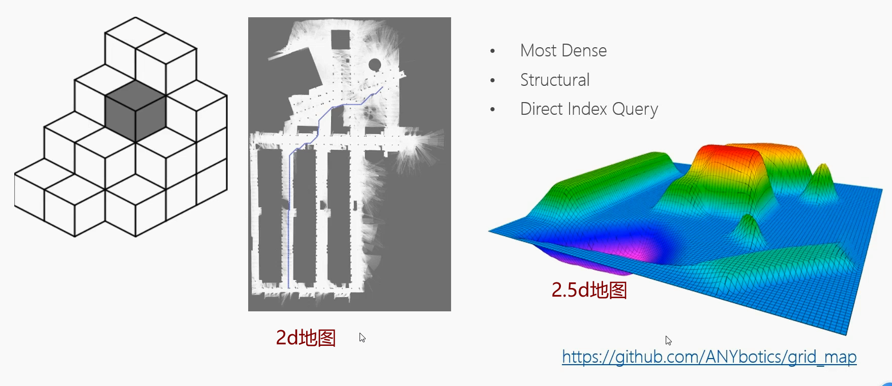

###### 1.2 八叉树地图

特点：稀疏、结构化、非直接坐标索引查询（递归查询）、数据占用较小

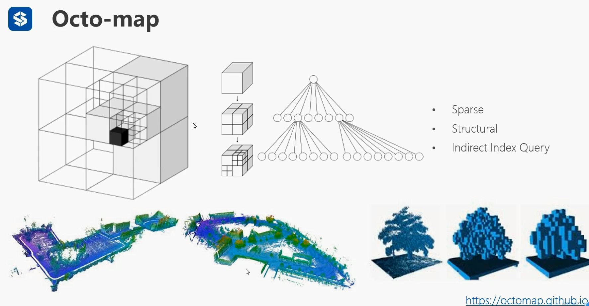

###### 1.3 Voxel hashing（体素哈希键值对地图）

特点：最稀疏、结构化、非直接坐标索引查询

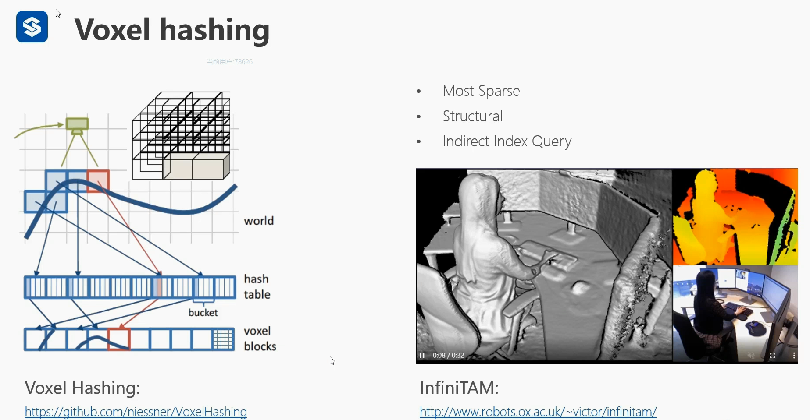

地图储存：将地图分解为体素栅格，后用字典翻译为低内存哈希键名

地图提取：将哈希键名数列用字典翻译为体素栅格

常用于制作rgb-d地图  

###### 1.4 点云地图

特定：无序，无索引查询

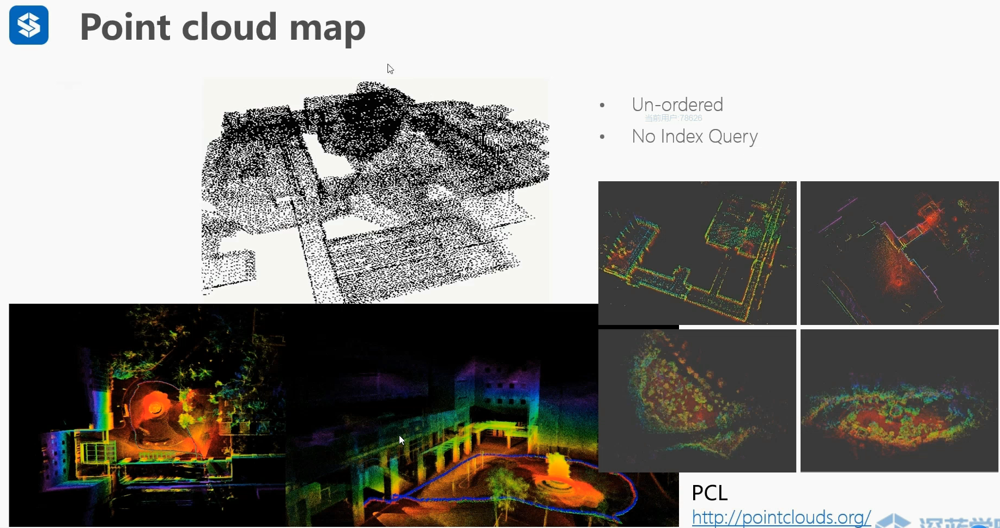

###### 1.4 TSDF地图

截断的有符号距离函数地图

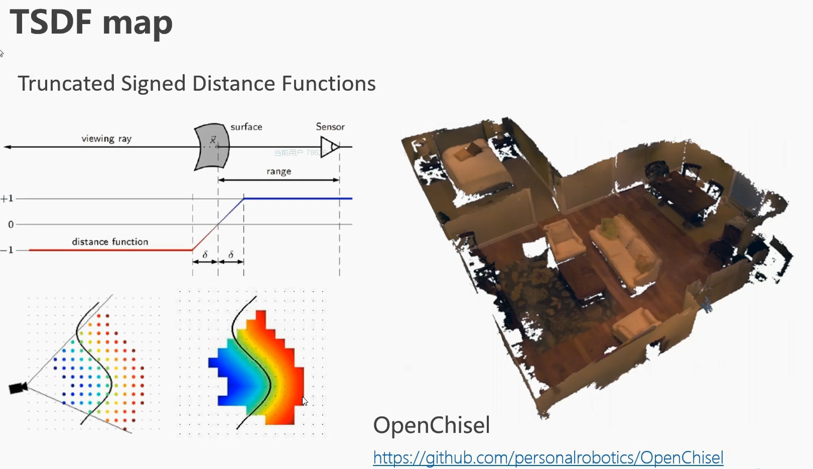

摄像机视角中，曲面左边为正值表示无障碍物，曲面右侧为负值表示有障碍物。

截断的定义：只关心视场内，曲面左右固定值距离场范围的感知信息，其余范围信息不考虑  

###### 1.5 ESDF地图

欧氏符号距离场地图，距离障碍物带距离信息，没有截断

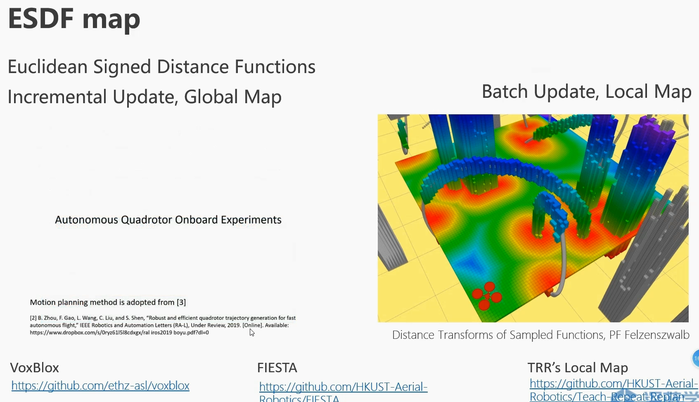

FIESTA:全局地图，TRR:局部地图

###### 1.6 空闲空间道路地图

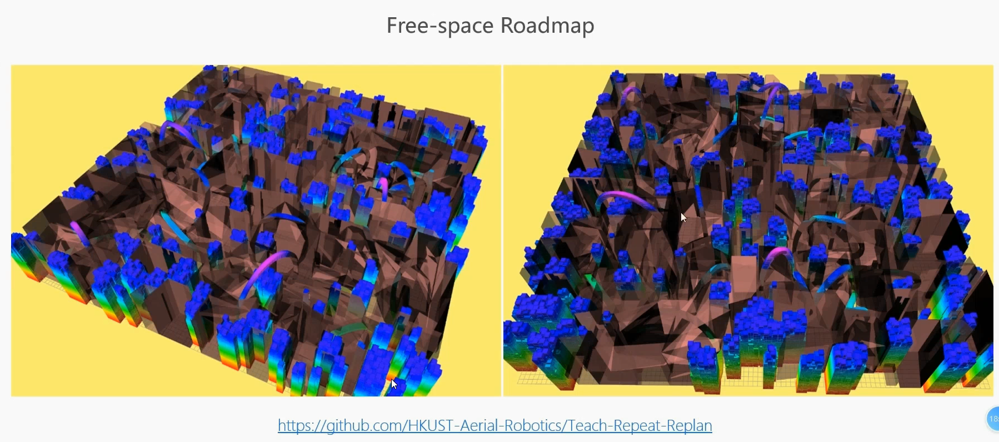

灰色多面体区域为空闲区域，用于提高机器人轨迹生成效率

###### 1.7 拓扑地图（ESDF优化）

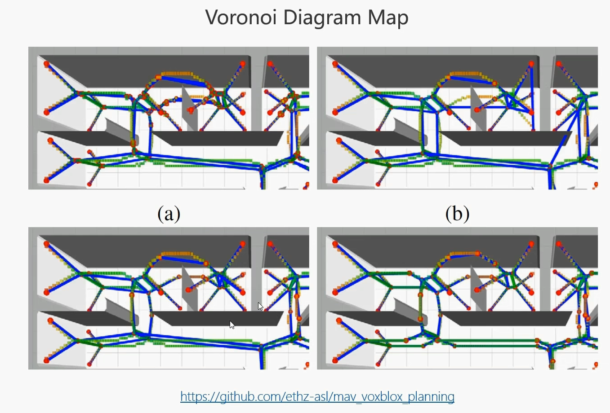

简化三维空间路径规划

##### 2.路径规划

1.基于搜索的路径规划，基于随机采样的路径规划，满足动力学的路径规划

2.轨迹优化，mininum snap；硬约束和软约束  

3.mdp(马尔科夫决策过程)与mpc（模型预测控制）

###### 

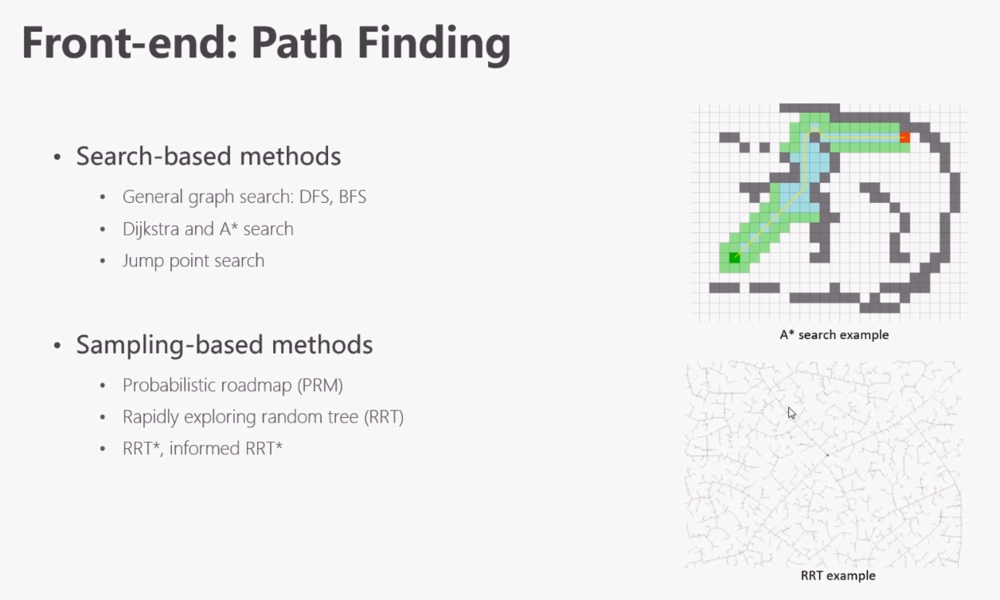

##### 1.基于搜索的算法

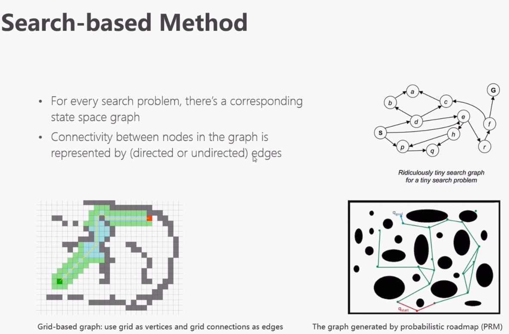

广度优先：dijkstra;深度优先：A*

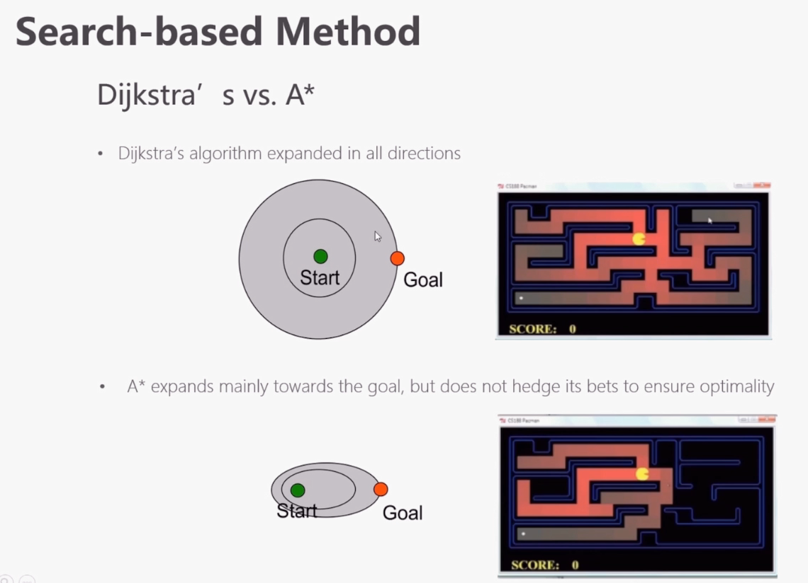

A*进阶：jps(跳点搜索算法)

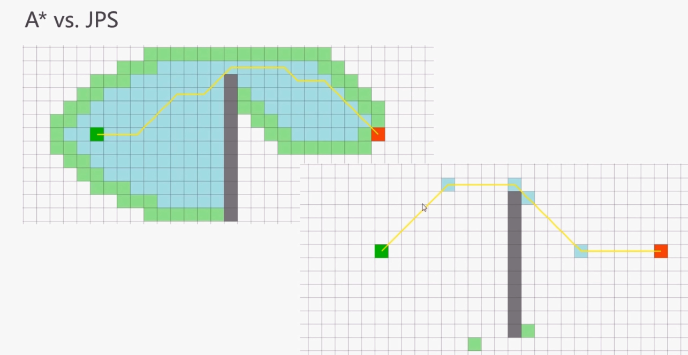

##### 2.基于采样的算法

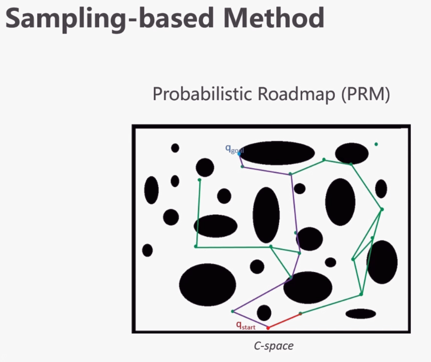

15:17